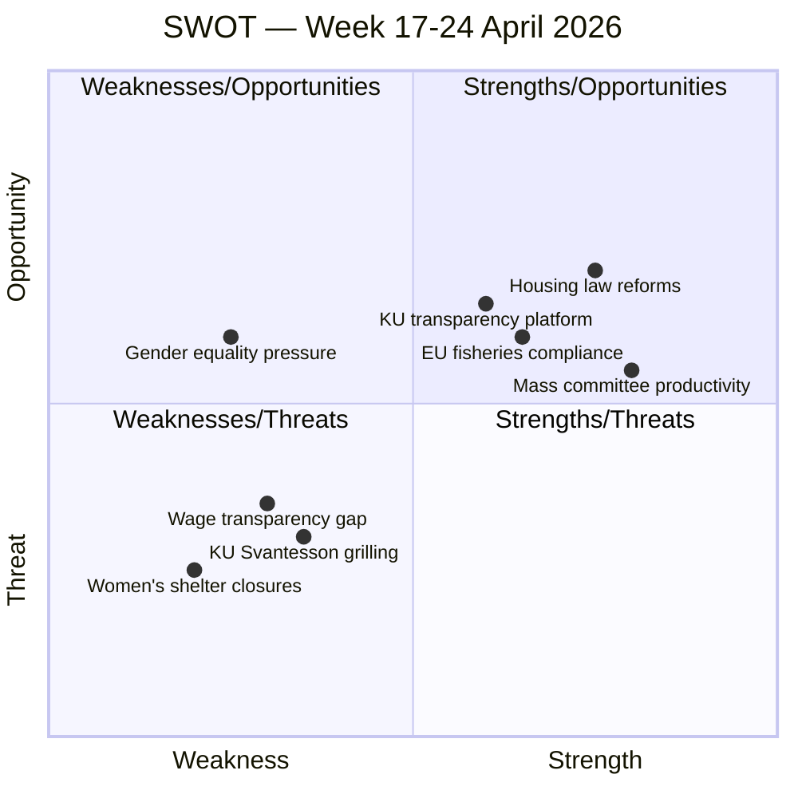

# SWOT Analysis — Week Ahead 2026-04-17

**Analysis Type**: Quick overview (week-ahead profile)  
**Date**: 2026-04-17  
**Confidence**: 🟩 HIGH

---

## Quick SWOT Overview

**The week of 17–24 April 2026** presents the Kristersson government with both significant opportunity and measurable risk. The KU Granskning (constitutional scrutiny) is a double-edged event: it enables the government to demonstrate transparency and accountability, but creates a national platform for the opposition to prosecute governance failures with Finance Minister Svantesson under direct questioning by KU on April 21 at 11:00. The hearing with former FM Margot Wallström amplifies this dynamic, as the S-led opposition will use the occasion to contrast the current government's foreign policy record with the previous administration's legacy.

The CU's four housing/civil law betänkanden scheduled for plenary debate represent genuine legislative accomplishment — guardianship reform, property transparency, and a national condo register together modernize Sweden's civil law infrastructure. However, the simultaneous pressure from S interpellations on women's shelter closures and wage transparency (EU directive implementation) creates an uncomfortable coalition-government narrative around gender equality for the L-led equality portfolio. Mass committee activity on April 23 (10+ committees convening) signals late-term legislative acceleration, typical pre-election sprint behaviour.

**Strengths**: Legislative productivity (4 CU reforms + 2 KU bills), institutional transparency via KU hearings, strong committee engagement across 15+ committees.

**Weaknesses**: Gender equality portfolio under pressure (wage transparency, women's shelters), Finance Minister exposed in public hearing at politically sensitive moment.

**Opportunities**: KU hearing allows government to project calm competence; CU housing reforms resonate with middle-class homeowner voters; April 23 committee meetings set up strong May plenary agenda.

**Threats**: Opposition (primarily S) using KU platform to highlight economic inequality, welfare retreats, and foreign policy positioning before 2026 election; any misstep by Svantesson or coalition members in hearings becomes campaign material.

