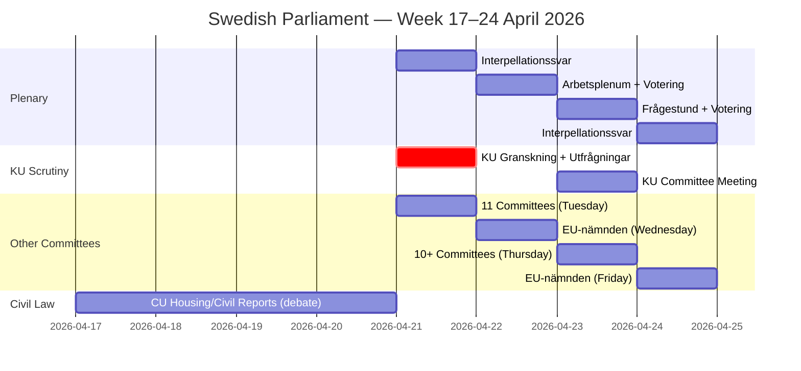

# Synthesis Summary — Week Ahead 2026-04-17

**Generated**: 2026-04-17  
**Week**: 2026-04-17 → 2026-04-24  
**Parliamentary Session**: 2025/26  
**Analysis Depth**: Deep  
**Documents Analyzed**: 10 (date-filtered from 300 downloaded)  
**Author**: AI Analysis (Riksdagsmonitor)

---

## Executive Summary

The week of 17–24 April 2026 is one of the most intense parliamentary periods of the spring term, dominated by two intertwined themes: **constitutional accountability scrutiny** and **broad-based social legislation**. The Constitutional Committee (KU) conducts its critical annual Granskning (scrutiny review) on Tuesday 21 April, with ministerial hearings involving Finance Minister Elisabeth Svantesson (M) and former Foreign Minister Margot Wallström (S) — events that often generate significant media coverage and, with an election year on the horizon, carry elevated political stakes.

Simultaneously, the Civil Law Committee (CU) pushes four substantial housing and civil law reforms into plenary debate, and the KU advances two media and transparency bills. Thursday's mass committee day (10+ committees) signals preparation for late-April plenary votes that will extend into early May.

**The dominant narrative for week-ahead**: Sweden's parliament intensifies constitutional oversight just as the government coalition faces mounting opposition pressure on welfare, gender equality, and tax reform — directly relevant to Election 2026 positioning.

---

## Key Themes

| Theme | Significance | Documents |
|-------|-------------|-----------|
| KU Constitutional Scrutiny (Granskning) | 🔴 CRITICAL | HDA7KU42, HDC220260421ou1, HDC220260421ou2 |
| CU Civil/Housing Law Reforms | 🟠 HIGH | HD01CU22, HD01CU27, HD01CU28, HD01CU42 |
| KU Media/Transparency Laws | 🟠 HIGH | HD01KU32, HD01KU33 |
| Gender Equality / Women's Welfare | 🟡 MEDIUM | HD10437, HD10438 |
| Mass Committee Day (Apr 23) | 🟡 MEDIUM | 10+ committee meetings |

---

## Document Inventory

| dok_id | Type | Title | Date | Significance |
|--------|------|-------|------|-------------|
| HDC220260421ou1 | utfrågning | KU hearing: Finance Minister Svantesson (M) | 2026-04-21 11:00 | 🔴 Critical |
| HDC220260421ou2 | utfrågning | KU hearing: Former FM Margot Wallström (S) | 2026-04-21 12:00 | 🔴 Critical |
| HDA7KU42 | granskning | KU Annual Government Scrutiny Session | 2026-04-21 | 🔴 Critical |
| HD01CU22 | bet | Guardianship reform (CU) | 2026-04-17 | 🟠 High |
| HD01CU27 | bet | Property title identity requirements + condo law (CU) | 2026-04-17 | 🟠 High |
| HD01CU28 | bet | National condominium register (CU) | 2026-04-17 | 🟠 High |
| HD01CU42 | bet | Riksrevisionen: government estate handling (CU) | 2026-04-17 | 🟡 Medium |
| HD01KU32 | bet | Media accessibility requirements (KU) | 2026-04-17 | 🟡 Medium |
| HD01KU33 | bet | Search-and-seizure transparency (KU) | 2026-04-17 | 🟡 Medium |
| HD10437 | ip | Wage transparency directive (S → L) | 2026-04-17 | 🟡 Medium |
| HD10438 | ip | Women's shelter closures (S → L) | 2026-04-17 | 🟡 Medium |

---

## Weekly Calendar Architecture

---

## Political Significance Assessment

**Confidence**: 🟩 HIGH (sourced from official riksdag.se API data)

The week represents a **constitutional accountability peak** in the parliamentary calendar. KU's Granskning is the institutional mechanism by which parliament holds the executive to account — questioning ministers about their exercise of power. With the 2026 election looming, every misstep in these hearings becomes campaign material.

The simultaneous push of CU housing reforms reflects the government's effort to demonstrate legislative productivity while facing opposition interpellations on gender equality and welfare.

