# Threat Analysis — Week Ahead 2026-04-17

**Generated**: 2026-04-17  
**Framework**: STRIDE-adapted political threat analysis  
**Confidence**: 🟧 MEDIUM

---

## Threat Matrix

```mermaid
graph TD
    A[Political Threats Apr 17-24] --> B[Constitutional Accountability]
    A --> C[Coalition Stability]
    A --> D[Legislative Agenda]
    A --> E[Electoral Positioning]
    
    B --> B1[KU scrutiny exposing governance gaps]
    B --> B2[Svantesson hearing: economic inequality narrative]
    B --> B3[Wallström hearing: foreign policy contrast]
    
    C --> C1[L under pressure on gender equality]
    C --> C2[SD comfort with welfare reduction differs from L]
    C --> C3[M-L-KD-SD coherence tested publicly]
    
    D --> D1[Opposition reservations on CU housing reforms]
    D --> D2[Women shelter closures blocking social legislation narrative]
    D --> D3[Wage transparency timeline pressure]
    
    E --> E1[S building E2026 case via interpellations]
    E --> E2[KU platform amplifying opposition research]
    E --> E3[Media framing: government vs vulnerable citizens]

    style B1 fill:#ff4444,color:#fff
    style B2 fill:#ff4444,color:#fff
    style C1 fill:#ff8800,color:#fff
    style E1 fill:#ff8800,color:#fff
    style E3 fill:#ff8800,color:#fff
```

---

## Primary Threat Scenarios

### T1: Constitutional Scrutiny Narrative Failure
**Threat Level**: 🔴 HIGH  
**Mechanism**: KU Granskning hearings (April 21) become a public relations failure if Finance Minister Svantesson contradicts previous government statements or cannot explain distributional effects of fiscal policy. Former FM Wallström hearing enables S to narrate a "Sweden abandoned multilateral leadership" story that resonates with progressive voters.  
**Election 2026 implication**: 🟩 HIGH confidence this feeds directly into campaign narratives.

### T2: Gender Equality Coalition Fracture
**Threat Level**: 🟠 ELEVATED  
**Mechanism**: L (liberal) holds the Jämställdhetsminister portfolio but governs with SD (nationalist-conservative) support. S's dual interpellations (HD10437 wage transparency + HD10438 women's shelters) exploit this ideological tension. If L minister Larsson gives answers that satisfy SD but alarm liberal voters, it exposes the coalition's fundamental contradiction on gender equality.  
**Actors**: Sofia Amloh (S) driving this pressure campaign; L voter base is particularly sensitive to gender equality signals.

### T3: Welfare State Erosion Narrative
**Threat Level**: 🟠 ELEVATED  
**Mechanism**: Women's shelter closures, combined with healthcare infrastructure concerns (see interpellation HD10432 on hospital investment) and housing affordability questions, enable S and V to build a sustained "government abandoning vulnerable Swedes" meta-narrative that resonates with working-class and urban liberal voters.

### T4: EU Compliance Pressure
**Threat Level**: 🟡 MODERATE  
**Mechanism**: EU Lönetransparensdirektivet (HD10437) represents a compliance obligation. Any indication Sweden is lagging implementation creates Commission pressure and domestic political embarrassment, particularly given Sweden's historical leadership on gender equality.

---

## Threat Mitigation Assessment

| Threat | Government Response Capacity | Opposition Exploitation Capacity |
|--------|-----------------------------|---------------------------------|
| KU Scrutiny | Moderate (Svantesson experienced) | HIGH (S well-prepared) |
| Gender equality | Low-Moderate (L vulnerable) | HIGH (Sofia Amloh coordinated) |
| Welfare narrative | Moderate (point to other programs) | HIGH (evidence-based claims) |
| EU compliance | Moderate (show implementation plan) | Moderate (technical detail) |

