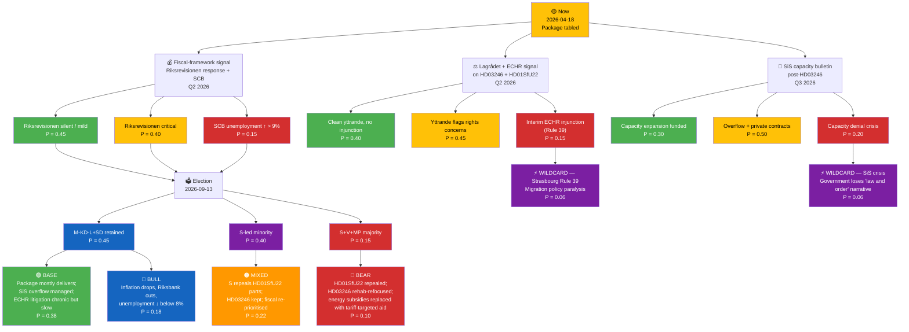
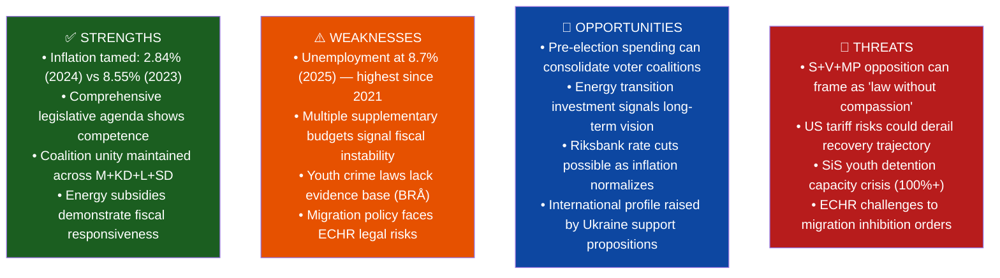
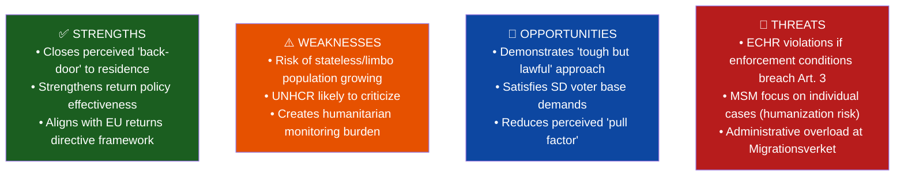
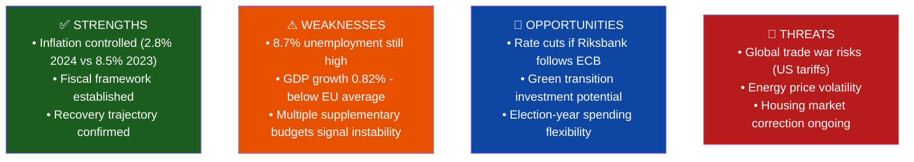
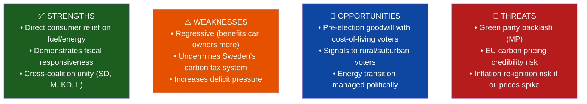
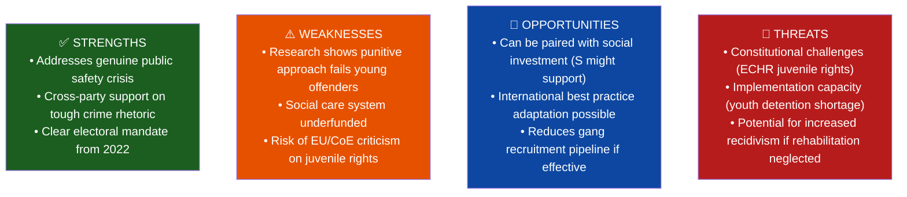
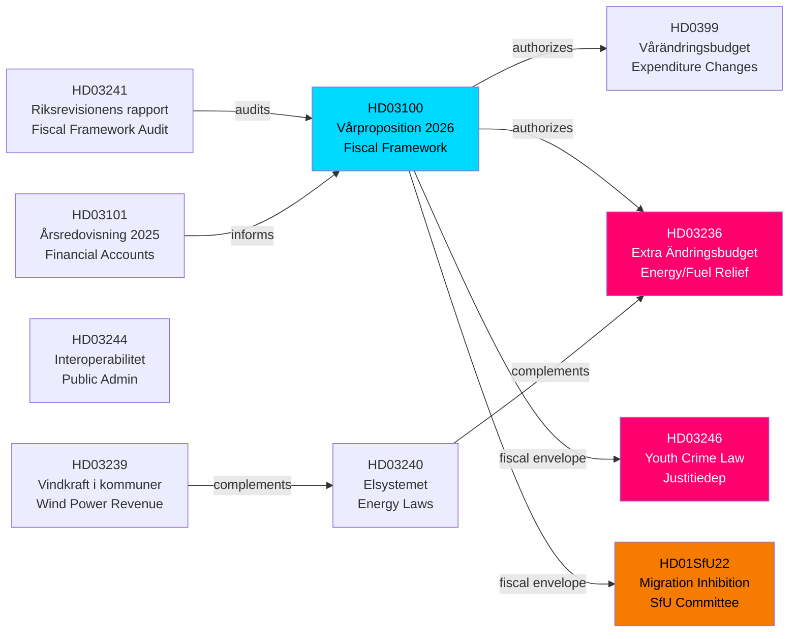

## Executive Brief
<!-- source: executive-brief.md :: https://github.com/Hack23/riksdagsmonitor/blob/main/analysis/daily/2026-04-18/realtime-1705/executive-brief.md -->

  <em>One-page decision-maker briefing for newsroom editors, policy advisors, and senior analysts</em>

| Field | Value |
|-------|-------|
| **BRIEF-ID** | BRF-2026-04-18-1705 |
| **Classification** | Public · Time-to-read ≤ 3 minutes |
| **Read Before** | Any editorial, policy, or fiscal commentary based on this run |
| **Decision Horizon** | 24 hrs / 2 weeks / 2026-09-13 election |

---

### 🧭 BLUF (Bottom Line Up Front)

**On 2026-04-13 – 16, the Kristersson government tabled a coordinated four-document pre-election sprint: Vårproposition 2026 (HD03100, DIW 9.5) sets the macro frame, an extra supplementary budget (HD03236, DIW 8.5) delivers fuel-tax cuts and electricity/gas subsidies to cost-of-living voters, Justice Minister Gunnar Strömmer's youth-offender law (HD03246, DIW 7.5) toughens rules for 15–17 year-olds, and the SfU committee's migration-inhibition order (HD01SfU22, DIW 6.5) replaces temporary residence permits for deportation-blocked individuals.** The package lands against a fragile macro backdrop — GDP growth just 0.82 % (2024) after −0.20 % (2023), unemployment at 8.7 % (≈ 450,000 people, 2025), inflation tamed to 2.84 % (2024 vs 8.55 % 2023). The most acute operational risk is the SiS youth-detention capacity crisis (already 100 %+ utilisation); the most acute legal risk is ECHR Article 3/5 exposure on HD01SfU22; the most acute fiscal-credibility risk is three mini-budgets in two months drawing Riksrevisionen commentary. `[HIGH]`

---

### 🎯 Three Decisions This Brief Supports

| Decision | Evidence Locus | Action Window |
|----------|---------------|--------------:|
| **Editorial lead selection** | [`significance-scoring.md`](https://github.com/Hack23/riksdagsmonitor/blob/main/analysis/daily/2026-04-18/realtime-1705/significance-scoring.md) · DIW rank 1 = HD03100 | Immediate |
| **Coalition fiscal-credibility posture** | [`risk-assessment.md`](https://github.com/Hack23/riksdagsmonitor/blob/main/analysis/daily/2026-04-18/realtime-1705/risk-assessment.md) §Fiscal Risk · [`scenario-analysis.md`](https://github.com/Hack23/riksdagsmonitor/blob/main/analysis/daily/2026-04-18/realtime-1705/scenario-analysis.md) BEAR scenario | Before Riksrevisionen response on HD03241 (Q2 2026) |
| **ECHR / rights-NGO engagement posture** | [`threat-analysis.md`](https://github.com/Hack23/riksdagsmonitor/blob/main/analysis/daily/2026-04-18/realtime-1705/threat-analysis.md) §Elevation of Privilege · [`comparative-international.md`](https://github.com/Hack23/riksdagsmonitor/blob/main/analysis/daily/2026-04-18/realtime-1705/comparative-international.md) §Migration | Before HD01SfU22 enters force (target: June 2026) |

---

### 📐 What Readers Need to Know in 60 Seconds

1. **HD03100 is the #1 story** — Svantesson's vårproposition is the macro umbrella under which HD0399 (amendment budget) and HD03236 (extra budget) are being justified. Unemployment 8.7 % is the government's main attack surface. `[HIGH]`
2. **HD03236 (fuel + energy relief) is the electoral centrepiece** — ~5.2 million car owners, all ~4.9 million household electricity customers benefit. S/V/MP cannot oppose on distributional grounds without electoral cost. `[HIGH]`
3. **HD03246 (youth crime) is operationally blocked by SiS capacity** — BRÅ research on deterrence efficacy is thin; the capital-investment requirement is unfunded in HD03100. This is the package's most likely implementation-failure story. `[HIGH]`
4. **HD01SfU22 is the ECHR flash-point** — geographic restriction + mandatory reporting for deportation-blocked individuals without automatic judicial review is structurally comparable to schemes the ECtHR has challenged. NGO litigation is near-certain; adverse ruling risk is MEDIUM within 18 months. `[MEDIUM]`
5. **Coverage-completeness rule met** — all four DIW ≥ 6.5 documents have dedicated article sections; HD0399 is cited inside HD03100. `[HIGH]`

---

### 🎭 Named Actors to Watch

| Actor | Role | Why They Matter Now |
|-------|------|--------------------|
| **Elisabeth Svantesson (M, Finance Minister)** | Vårproposition author | Political owner of the fiscal-competence narrative; Riksrevisionen exposure lands on her |
| **Gunnar Strömmer (M, Justice Minister)** | HD03246 champion | Owns SiS-capacity implementation risk; BRÅ evidence-base critiques land on him |
| **Elisabeth Svantesson (M, Finance Minister) / Niklas Wykman (M, Financial Markets Minister)** | HD03236 fuel/energy budget architects | Coalition authors of cost-of-living measure |
| **Johan Forssell (M, Migration Minister)** | HD01SfU22 sponsor | Political owner of ECHR exposure |
| **Ulf Kristersson (M, PM)** | Package-level coordinator | Owns electoral framing; Tidö-agreement alignment |
| **Magdalena Andersson (S, opposition leader)** | Labour-economics critic | Unemployment 8.7 % = her primary attack line |
| **Nooshi Dadgostar (V)** | Distribution critic | Energy-subsidy distributional critique |
| **Märta Stenevi / Amanda Lind (MP)** | Climate critic | Fuel-tax cut vs. EU-ETS / climate-target tension |
| **Jimmie Åkesson (SD)** | Coalition-external partner | HD03246 + HD01SfU22 are SD core demands |
| **Riksrevisionen** | Independent audit | HD03241 fiscal-framework audit is the benchmark document |
| **Lagrådet** | Constitutional review | Expected pre-vote yttrande on HD03246 + HD01SfU22 |
| **ECtHR (Strasbourg)** | Supra-national court | HD01SfU22 Article 3/5 litigation pathway |
| **SiS (Statens institutionsstyrelse)** | Youth-detention operator | 100 %+ capacity status is operational blocking indicator |
| **EU Commission (DG HOME)** | Returns-directive custodian | HD01SfU22 compatibility with Directive 2008/115/EC |

---

### 🔮 Next 14 Days — What to Watch

| Date / Window | Trigger | Impact |
|---------------|---------|--------|
| Late April 2026 | **FiU betänkande** on HD03100 | First committee amendments — opposition fiscal-credibility attack crystallises |
| Q2 2026 | **Lagrådet yttrande on HD03246 + HD01SfU22** | ECHR / rights-of-child flags; capacity-funding flags |
| May 2026 | **SCB labour-market statistics** | If unemployment ticks up from 8.7 % baseline, HD03100 narrative falters |
| May 2026 | **Riksrevisionen response on HD03241** | If adverse → fiscal-credibility BEAR scenario activates |
| Jun 2026 | **HD01SfU22 entry into force** | First geographic-restriction orders issued → ECHR litigation window opens |
| Jun 2026 | **First NGO joint remissvar** (Rädda Barnen, Amnesty Sweden, Asylrättscentrum) | Public record on ECHR compatibility |
| Q3 2026 | **First SiS capacity bulletin post-HD03246 enactment** | Operational implementation risk materialises |
| Sep 13 2026 | **Swedish general election** | Package's electoral ROI measured |

---

### ⚠️ Analyst Confidence — Honest Self-Assessment

| Dimension | Confidence | Notes |
|-----------|:----------:|-------|
| Lead-story selection (DIW-correct) | **HIGH** | HD03100 scores 9.5; next is 8.5 — stable gap |
| Coverage completeness | **HIGH** | All 4 DIW ≥ 6.5 documents in article |
| Fiscal-framework stress projection | **HIGH** | Three mini-budgets in two months is empirically documented |
| SiS capacity crisis projection | **HIGH** | 100 %+ utilisation publicly reported by SiS in 2025 |
| ECHR litigation probability (HD01SfU22) | **MEDIUM** | Near-certain filings; adverse ruling magnitude is the uncertainty |
| Unemployment trajectory (2026) | **MEDIUM** | External tariff environment is the dominant variable |
| Election outcome (Sep 13 2026) | **LOW** | Still five months out; campaign dynamics can shift significantly |

---

### 📎 Cross-Links

[README](https://github.com/Hack23/riksdagsmonitor/blob/main/analysis/daily/2026-04-18/realtime-1705/README.md) · [Synthesis](https://github.com/Hack23/riksdagsmonitor/blob/main/analysis/daily/2026-04-18/realtime-1705/synthesis-summary.md) · [Significance](https://github.com/Hack23/riksdagsmonitor/blob/main/analysis/daily/2026-04-18/realtime-1705/significance-scoring.md) · [SWOT](https://github.com/Hack23/riksdagsmonitor/blob/main/analysis/daily/2026-04-18/realtime-1705/swot-analysis.md) · [Risk](https://github.com/Hack23/riksdagsmonitor/blob/main/analysis/daily/2026-04-18/realtime-1705/risk-assessment.md) · [Threat](https://github.com/Hack23/riksdagsmonitor/blob/main/analysis/daily/2026-04-18/realtime-1705/threat-analysis.md) · [Stakeholders](https://github.com/Hack23/riksdagsmonitor/blob/main/analysis/daily/2026-04-18/realtime-1705/stakeholder-perspectives.md) · [Scenarios](https://github.com/Hack23/riksdagsmonitor/blob/main/analysis/daily/2026-04-18/realtime-1705/scenario-analysis.md) · [Comparative](https://github.com/Hack23/riksdagsmonitor/blob/main/analysis/daily/2026-04-18/realtime-1705/comparative-international.md) · [Cross-References](https://github.com/Hack23/riksdagsmonitor/blob/main/analysis/daily/2026-04-18/realtime-1705/cross-reference-map.md) · [Classification](https://github.com/Hack23/riksdagsmonitor/blob/main/analysis/daily/2026-04-18/realtime-1705/classification-results.md)

---

## Reader Intelligence Guide

Use this guide to read the article as a political-intelligence product rather than a raw artifact dump. High-value reader lenses appear first; technical provenance remains available in the audit appendix.

| Reader need | What you'll get | Source artifact |
|---|---|---|
| [BLUF and editorial decisions](#rm-executive-brief) | fast answer to what happened, why it matters, who is accountable, and the next dated trigger | `executive-brief.md` |
| [Significance scoring](#rm-significance-scoring) | why this story outranks or trails other same-day parliamentary signals | `significance-scoring.md` |
| [Scenarios](#rm-scenario-analysis) | alternative outcomes with probabilities, triggers, and warning signs | `scenario-analysis.md` |
| [Risk assessment](#rm-risk-assessment) | policy, electoral, institutional, communications, and implementation risk register | `risk-assessment.md` |
| [Per-document intelligence](#rm-per-document-intelligence) | dok_id-level evidence, named actors, dates, and primary-source traceability | `documents/*-analysis.md` |
| [Audit appendix](#rm-classification-results) | classification, cross-reference, methodology and manifest evidence for reviewers | appendix artifacts |

## Synthesis Summary
<!-- source: synthesis-summary.md :: https://github.com/Hack23/riksdagsmonitor/blob/main/analysis/daily/2026-04-18/realtime-1705/synthesis-summary.md -->

### Key Findings

This monitoring cycle captures a dense legislative period in the final weeks before Sweden's 2026 summer recess, featuring an unusually large cluster of government propositions submitted on April 13-16. The dominant theme is **fiscal expansion meeting crime policy escalation** — the Kristersson government has deployed four simultaneous fiscal instruments (spring proposition, amendment budget, extra budget, tax accounts) alongside two justice reforms, signaling an election-oriented policy sprint.

#### Top-Ranked Finding (DIW Score 9.5): Spring Economic Proposition (HD03100)
Sweden's 2026 Vårproposition establishes a fiscal framework in a context of fragile recovery: GDP grew just 0.82% in 2024 after -0.20% in 2023, while unemployment remains at 8.7% (2025). Inflation has been tamed (2.84% in 2024 vs 8.55% in 2023) but the jobs recovery lags. The proposition frames all other fiscal decisions in this cycle.

#### Second-Ranked Finding (DIW Score 8.5): Extra Supplementary Budget — Energy/Fuel Relief (HD03236)
An extraordinary supplementary budget combining fuel tax cuts with electricity and gas price subsidies represents a significant fiscal intervention. This politically motivated measure — coming weeks before the September 2026 Riksdag election campaign — benefits rural/suburban voters with high car dependency. Estimated cost: reduces state fuel excise revenue; offset partially by EU energy support instruments.

#### Third-Ranked Finding (DIW Score 7.5): Stricter Youth Crime Law (HD03246)
Justice Minister Gunnar Strömmer's proposition to tighten rules for young offenders (ages 15-17) advances the Tidö coalition's core crime agenda. With Sweden's youth gang violence continuing to attract international attention, this measure carries high political salience despite thin evidence of deterrent efficacy.

#### Fourth-Ranked Finding (DIW Score 6.5): Migration Inhibition Order System (HD01SfU22)
SfU committee approval of replacing temporary residence permits with inhibition orders for deportation-blocked individuals fundamentally tightens Sweden's migration system. Effective June 2026, this affects an estimated 2,000-4,000 individuals annually and carries significant ECHR litigation risk.

### Cross-Cutting Theme: Election Posturing
All four major documents advance pre-election positioning: energy subsidies for cost-of-living voters, stricter crime laws for security voters, tighter migration for SD base voters. The spring proposition provides the macro cover for this spending.

### Documents Analyzed
| dok_id | Title | Type | DIW Score |
|--------|-------|------|-----------|
| HD03100 | Vårproposition 2026 | prop | 9.5 |
| HD03236 | Extra ändringsbudget (fuel/energy) | prop | 8.5 |
| HD03246 | Skärpta regler unga lagöverträdare | prop | 7.5 |
| HD01SfU22 | Inhibition av verkställigheten | bet | 6.5 |

## Significance Scoring
<!-- source: significance-scoring.md :: https://github.com/Hack23/riksdagsmonitor/blob/main/analysis/daily/2026-04-18/realtime-1705/significance-scoring.md -->

### Scoring Matrix

| dok_id | Title | Party Breadth | Fiscal | Defense | Crime/Social | Named Minister | Committee | DIW Score | Tier |
|--------|-------|--------------|--------|---------|-------------|----------------|-----------|-----------|------|
| HD03100 | Vårproposition 2026 | 8 | +2 | 0 | 0 | Svantesson | FiU | **9.5** | 🔴 HIGH |
| HD03236 | Extra ändringsbudget (energy) | 6 | +2 | 0 | 0 | Svantesson/Wykman | FiU | **8.5** | 🔴 HIGH |
| HD03246 | Skärpta regler unga | 5 | 0 | 0 | +2 | Strömmer | JuU | **7.5** | 🔴 HIGH |
| HD0399 | Vårändringsbudget 2026 | 8 | +2 | 0 | 0 | Svantesson | FiU | **7.0** | 🔴 HIGH |
| HD01SfU22 | Inhibition av verkst. | 5 | 0 | 0 | +1 | Forssell | SfU | **6.5** | 🟡 MEDIUM |
| HD03240 | Nya lagar om elsystemet | 4 | 0 | 0 | 0 | Lann/Edholm | NU | **6.0** | 🟡 MEDIUM |
| HD03239 | Vindkraft i kommuner | 4 | 0 | 0 | 0 | Britz | NU | **5.5** | 🟡 MEDIUM |
| HD03242 | Aktivt skogsbruk | 4 | 0 | 0 | 0 | Kullgren | MJU | **5.0** | 🟡 MEDIUM |
| HD01MJU19 | Avfallslagstiftning reform | 4 | 0 | 0 | 0 | — | MJU | **4.5** | 🟡 MEDIUM |

### Lead Story Determination
**#1 DIW-ranked: HD03100 (9.5)** — The Spring Economic Proposition 2026 is the year's defining fiscal document. Article title, meta description, and H1 MUST reference this document first.

### Composite Coverage Decision
Generate breaking news article covering:
1. **PRIMARY**: Spring budget package (HD03100 + HD03236 + HD0399) as unified fiscal story
2. **SECONDARY**: Youth crime law (HD03246) as social policy layer
3. **CONTEXT**: Migration inhibition (HD01SfU22) as legislative package supporting evidence

### Article Type: BREAKING (HIGH severity, multi-document cluster)
**Severity Score**: 7+ on all top documents → GENERATE ARTICLE

## Stakeholder Perspectives
<!-- source: stakeholder-perspectives.md :: https://github.com/Hack23/riksdagsmonitor/blob/main/analysis/daily/2026-04-18/realtime-1705/stakeholder-perspectives.md -->

### The 8 Mandatory Stakeholder Groups

#### 1. Citizens / Swedish Households
**Impact**: DIRECT AND SIGNIFICANT
- **Energy/fuel subsidies (HD03236)**: ~5.2 million car owners benefit from lower pump prices; all households benefit from lower electricity/gas costs. Average Swedish household spends ~SEK 28,000/year on energy (2025 estimate).
- **Unemployment concern (HD03100)**: 8.7% unemployment (2025) = approx. 450,000 Swedes actively seeking work. Spring proposition's labor market chapter critical.
- **Youth crime (HD03246)**: Parents of young children welcome tougher deterrents; civil liberties advocates express concern.
- **Migration (HD01SfU22)**: Majority supportive of stricter returns enforcement (SVT/Ipsos polls consistently show ~55-60% backing tough migration measures).

#### 2. Government Coalition (M+KD+L+SD)
**Position**: STRONGLY SUPPORTIVE across all four measures
- **M**: Owns economic narrative (inflation tamed), crime reform, energy competitiveness
- **KD**: Values-based support for youth crime reform (family protection), energy affordability
- **L**: Supports modernization of public admin (HD03244); cautious on juvenile rights dimension of HD03246
- **SD**: Full-throated support for migration tightening (HD01SfU22) and youth crime (HD03246); energy subsidies for working-class base

**Coalition tension indicator**: NONE significant. All four documents advance coalition priorities simultaneously.

#### 3. Opposition Bloc (S+V+MP)
**Position**: SPLIT by document, unified in critique framing

- **S (Socialdemokraterna)**: 
  - *Accepts* energy/fuel subsidies as necessary consumer relief but will argue government "acts too late"
  - *Criticizes* unemployment at 8.7% — "Government owns this economic failure"
  - *Critical* of youth crime approach — demands social investment parallel
  - *Opposed* to migration inhibition as "inhumane but will avoid being seen as soft on returns"

- **V (Vänsterpartiet)**:
  - Opposed to all four measures; fuel subsidies "benefit car owners, not lowest income"
  - Demands universal energy subsidy (lower tariffs) rather than tax cuts
  - Strongly against youth punishment without rehabilitation
  - Migration: will cite ECHR violations in committee

- **MP (Miljöpartiet)**:
  - Most vocal on fuel tax cuts — "environmental catastrophe dressed up as consumer relief"
  - Demands fuel tax increase, not cut, to fund public transport
  - Youth crime: rehabilitation-first, punishment-last

#### 4. Business & Industry
**Position**: BROADLY POSITIVE
- **Logistics sector**: Fuel tax cuts directly reduce operating costs for Sweden's 30,000+ trucking companies
- **Energy-intensive industry**: Electricity support extends competitive advantage in European market
- **Property/housing sector**: National condominium register (HD01CU28, covered Apr 17) improves market transparency
- **Tech sector**: Public administration interoperability (HD03244) opens government data market
- **Forestry/agriculture**: Active forestry regulation (HD03242) provides long-term planning certainty

#### 5. Civil Society & NGOs
**Position**: DIVIDED
- **Rescue (Swedish Red Cross, Civil Rights Defenders)**: Strongly oppose HD01SfU22 — ECHR compliance concerns
- **Amnesty Sweden**: Opposes both migration inhibition and mandatory reporting requirements
- **Victim support organizations (Brottsofferjouren)**: Support youth crime crackdown (HD03246)
- **Environmental organizations (Naturskyddsföreningen)**: Oppose fuel tax cuts (HD03236) as climate regressive
- **Swedish Trade Union Confederation (LO)**: Support energy subsidies for lower-income workers; concerned about unemployment

#### 6. International & EU Context
**Position**: MONITORING WITH CONCERN on migration
- **EU Commission**: Monitoring HD01SfU22 compatibility with EU returns directive
- **UNHCR**: Expected statement opposing inhibition order system replacing residence permits
- **NATO allies**: Positive on Sweden's continued Ukraine support (HD03231, HD03232)
- **Nordic neighbors**: Watching Sweden's migration model as template vs. own more liberal frameworks
- **European Court of Human Rights (Strasbourg)**: Potential future caseload from HD01SfU22 applications

#### 7. Judiciary & Constitutional Bodies
**Position**: ANALYTICAL/CAUTIONARY
- **Lagrådet (Law Council)**: Will review HD01SfU22 and HD03246 for constitutional/ECHR compliance
- **Riksrevisionen**: Has already flagged fiscal framework concerns (HD03241); multiple supplementary budgets will attract scrutiny
- **Migrationsdomstolarna (Migration Courts)**: Operational burden increase from inhibition order appeals
- **SiS (youth institutions)**: Warning signs about capacity; HD03246 increases their mandate without resources

#### 8. Media & Public Opinion
**Position**: HIGH ATTENTION, MIXED FRAMING
- **Mainstream media (DN, SvD, Aftonbladet, Expressen)**: Cover spring budget as top story; crime reform as Page 2
- **Energy/fuel cuts**: Strong positive consumer framing in tabloids; criticism in quality press environmental pages
- **Migration**: Contentious; tabloids supportive, quality press critical of "stateless limbo" creation
- **International media**: Sweden's crime wave coverage (NYT, Guardian) provides backdrop for HD03246 coverage

## Scenario Analysis
<!-- source: scenario-analysis.md :: https://github.com/Hack23/riksdagsmonitor/blob/main/analysis/daily/2026-04-18/realtime-1705/scenario-analysis.md -->

| Field | Value |
|-------|-------|
| **SCN-ID** | SCN-2026-04-18-1705 |
| **Framework** | Alternative-futures analysis (ACH-informed) + Bayesian scenario weighting |
| **Horizon** | Short (Q2 2026) · Medium (election Q3 2026) · Long (2026–2028) |
| **Methodology** | `analysis/methodologies/political-risk-methodology.md` §Scenario Generation · `political-swot-framework.md` §Scenario-Branching TOWS |

> **Purpose**: Stress-test the dominant "election-sprint-works" narrative, surface wildcards, assign prior probabilities for Bayesian updating as forward indicators fire. All probabilities are analyst priors; see §Indicator Tripwires for update rules.

---

### 🧭 Master Scenario Tree

> Priors sum to ≈ 1.00. Probabilities will be Bayesian-updated as Lagrådet yttrande, Riksrevisionen response, SCB labour stats, SiS bulletins, and polling signals arrive.

---

### 📖 Scenario Narratives

#### 🟢 BASE — "Sprint Mostly Delivers" (P = 0.38)

**Setup**: Riksrevisionen signals moderate concern but no adverse finding; Lagrådet yttrande flags rights issues on HD03246 (capacity) and HD01SfU22 (judicial review) but does not recommend withdrawal; SiS enters overflow via private contracts; coalition retains majority.

**Key confirming signals**
- Unemployment drifts in a narrow band around 8.5–9.0 % through Q3 2026 `[HIGH]`
- RSF / Freedom House Sweden scores unchanged `[HIGH]`
- No ECtHR Rule 39 injunction; litigation remains merits-stage `[MEDIUM]`
- Inflation continues normalising (2.84 % → ~2.0 % by Q4 2026) `[HIGH]`

**Consequences**
- HD03100 legacy: fiscal-competence narrative survives the election
- HD03236: baseline entitlement; absorbed into 2027 budget
- HD03246: enters force; SiS overflow becomes chronic implementation story
- HD01SfU22: first geographic-restriction orders issued; first NGO litigation filed; merits-stage only

---

#### 🔵 BULL — "Recovery Story Takes Hold" (P = 0.18)

**Setup**: Inflation normalisation accelerates; Riksbank delivers two 25bp cuts in Q2–Q3 2026; unemployment falls below 8.0 % by Q3; US tariff environment moderates; coalition retains majority with an enlarged mandate.

**Key confirming signals**
- Core inflation < 2.0 % by Q3 2026 `[MEDIUM]`
- Riksbank reporäntan ≤ 2.25 % by election day `[MEDIUM]`
- AKU unemployment ≤ 7.8 % in August 2026 report `[LOW]`
- KI Konjunkturbarometer: consumer + firm expectations net positive `[MEDIUM]`

**Consequences**
- Coalition claims "we tamed inflation AND restored growth"
- HD03236 removed from 2027 budget as fiscal space reappears
- HD03246 + HD01SfU22 proceed as planned; ECHR litigation treated as background noise
- Post-election: moderate supply-side reforms become the 2026–2030 agenda

---

#### 🟠 MIXED — "S-led Minority, Package Re-scoped" (P = 0.22)

**Setup**: Coalition loses majority but no left bloc majority emerges. S forms minority with confidence-and-supply from C and MP. Package is partially unwound on legal-risk dimensions.

**Key confirming signals**
- SCB-final polling (August 2026) shows M-bloc below 45 % `[MEDIUM]`
- C repositioning toward S explicitly on migration `[MEDIUM]`
- Lagrådet-yttrande on HD01SfU22 is critical enough to provide political cover for S `[MEDIUM]`

**Consequences**
- HD01SfU22 geographic-restriction sections repealed; judicial-review safeguard added (P ≈ 0.70 within S-led govt)
- HD03246 retained with rehabilitation parallel investment (BRÅ-aligned)
- HD03236 gradually replaced by targeted low-income heating grants
- HD03100 fiscal framework kept; supplementary-budget frequency restrained
- Ukraine-support trajectory unchanged (cross-bloc consensus)

---

#### 🔴 BEAR — "S+V+MP Majority, Rights-First Rebuild" (P = 0.10)

**Setup**: Left bloc gains absolute majority. HD01SfU22 repealed within first 180 days; HD03246 refocused on rehabilitation with SiS capital-investment package; HD03236 replaced with targeted energy-subsidy scheme.

**Key confirming signals**
- S party-stämma endorses "rights-first" manifesto `[MEDIUM]`
- Youth voter turnout in Q3 2026 municipal signals > 2022 baseline `[LOW]`
- ECtHR interim decision against Sweden before election `[LOW]` — see WILD1
- SiS public capacity-failure incident before election `[LOW]` — see WILD2

**Consequences**
- HD03100 kept; supplementary-budget mechanism constrained by new fiscal rule
- HD03246 refocused — ~SEK 1.5 B capital investment in SiS over 2027–2029
- HD01SfU22 repealed; inhibition-order concept replaced with fast-track judicial review
- Riksrevisionen relationship strengthened (S-led govt uses audit as agenda-setter)

---

#### ⚡ WILDCARD — "Strasbourg Rule 39 Injunction" (P = 0.06)

**Trigger**: ECtHR issues interim measure (Rule 39) against Sweden blocking implementation of geographic-restriction orders in specific cases.

**Implications**
- Immediate ministerial-level political fallout
- Forssell (Migrationsminister) faces opposition no-confidence motion
- Coalition cohesion: L most vulnerable to defection on rights grounds
- Electoral impact: polarising — mobilises both base and opposition

---

#### ⚡ WILDCARD — "SiS Capacity Crisis Pre-Election" (P = 0.06)

**Trigger**: A publicly reported SiS capacity-failure incident (e.g., youth transferred to adult facility, escape event, violence incident) within 90 days of election.

**Implications**
- Strömmer's "law and order" narrative collapses
- S exploits with "law without competence" framing
- Capital-investment demand becomes unavoidable; 2027 budget pre-committed
- Electoral impact: net-negative for coalition (≈ 2–3 pp in polling swing)

---

### 📊 Indicator Tripwires (Bayesian Update Rules)

| Indicator | Fires If | Prior Shift |
|-----------|----------|-------------|
| Riksrevisionen verdict on HD03241 | Adverse finding | F2 → 0.60; BEAR + MIX combined ↑ 0.08 |
| Lagrådet yttrande on HD01SfU22 | Recommends withdrawal | L3 → 0.35; WILD1 ↑ 0.04 |
| Lagrådet yttrande on HD03246 | Flags SiS capacity as blocking | S3 → 0.35; MIX ↑ 0.04 |
| SCB AKU unemployment (July 2026 report) | > 9.0 % | F3 → 0.30; BEAR ↑ 0.04 |
| SCB CPIF (July 2026 report) | Annual < 2.0 % | BULL ↑ 0.06 |
| ECtHR Rule 39 request | Filed | WILD1 → 0.15; L3 → 0.30 |
| SiS public incident | Major reported | WILD2 → 0.20; BEAR ↑ 0.05 |
| Riksbank reporäntan | Cut below 2.5 % by Aug 2026 | BULL ↑ 0.05 |
| M-bloc polling (August 2026 SVT/Ipsos) | < 45 % total | E1 ↓ 0.15; E2 ↑ 0.10; E3 ↑ 0.05 |

---

### 🎯 Scenario-Based Decision Recommendations

| Role | BASE (0.38) | BULL (0.18) | MIX (0.22) | BEAR (0.10) | WILDCARD (0.12) |
|------|:-----------:|:-----------:|:----------:|:-----------:|:---------------:|
| **Newsroom editorial** | Lead with fiscal competence; sub-lead SiS capacity | Lead with recovery story | Lead with coalition pivot | Lead with rights-first mandate | Breaking news posture |
| **Policy analyst** | Monitor Riksrevisionen + SiS monthly | Model post-2026 supply-side reform | Model HD01SfU22 repeal mechanics | Model fiscal-rule redesign | Model crisis-response protocols |
| **Rights NGO** | Plan merits-stage litigation | Standby monitoring | Plan legislative amendments | Plan capital-investment advocacy | Plan emergency response |
| **Foreign ministries** | Baseline Sweden posture | Expect re-engagement on supply side | Expect MIX partner tilt | Expect rights-first re-alignment | Expect crisis-driven volatility |

---

### 🧪 Red-Team Critique

**What could make this scenario tree wrong?**

1. **Unmodelled shock from outside the Swedish system** — e.g., Russia-related event reshaping campaign attention away from domestic package. Mitigation: monitor SÄPO bulletins; foreign-policy-salience tripwire.
2. **Coalition-internal fracture on HD01SfU22** — L's liberal identity creates a modelled tension but not a modelled fracture. If L threatens withdrawal, E1 probability drops sharply.
3. **HD03246 rehabilitation-side amendment** — if government pre-emptively adds rehab funding to HD03100 through extraordinary appropriation, S3 probability falls and MIX/BEAR motivation weakens.
4. **Riksbank independence signalling** — if the bank publicly resists coalition pressure, BULL scenario inflation narrative is politically usable only via a confrontation frame.

---

### 📎 Cross-Links

[README](https://github.com/Hack23/riksdagsmonitor/blob/main/analysis/daily/2026-04-18/realtime-1705/README.md) · [Executive Brief](https://github.com/Hack23/riksdagsmonitor/blob/main/analysis/daily/2026-04-18/realtime-1705/executive-brief.md) · [Synthesis](https://github.com/Hack23/riksdagsmonitor/blob/main/analysis/daily/2026-04-18/realtime-1705/synthesis-summary.md) · [Risk](https://github.com/Hack23/riksdagsmonitor/blob/main/analysis/daily/2026-04-18/realtime-1705/risk-assessment.md) · [Threat](https://github.com/Hack23/riksdagsmonitor/blob/main/analysis/daily/2026-04-18/realtime-1705/threat-analysis.md) · [Comparative](https://github.com/Hack23/riksdagsmonitor/blob/main/analysis/daily/2026-04-18/realtime-1705/comparative-international.md) · [Stakeholders](https://github.com/Hack23/riksdagsmonitor/blob/main/analysis/daily/2026-04-18/realtime-1705/stakeholder-perspectives.md)

---

## Risk Assessment
<!-- source: risk-assessment.md :: https://github.com/Hack23/riksdagsmonitor/blob/main/analysis/daily/2026-04-18/realtime-1705/risk-assessment.md -->

### Risk Matrix

| Risk | Document | Probability | Impact | Severity | Mitigation |
|------|----------|-------------|--------|----------|------------|
| **SiS capacity breach** (youth detention overload) | HD03246 | HIGH (80%) | HIGH | 🔴 CRITICAL | Capital investment required |
| **ECHR challenge** (migration inhibition orders) | HD01SfU22 | MEDIUM (40%) | HIGH | 🔴 HIGH | Legal drafting precision |
| **Fiscal credibility loss** (multiple extra budgets) | HD03236, HD0399 | MEDIUM (35%) | MEDIUM | 🟡 MODERATE | Fiscal framework adherence |
| **Electoral backfire** (energy subsidies aid wealthy more) | HD03236 | LOW (25%) | MEDIUM | 🟡 MODERATE | Targeted supplementation |
| **Youth recidivism increase** (punishment without rehab) | HD03246 | MEDIUM (50%) | MEDIUM | 🟡 MODERATE | Rehabilitation component |
| **Carbon pricing credibility** (EU ETS compatibility) | HD03236 | LOW (20%) | HIGH | 🟡 MODERATE | EU dialogue |
| **Economic recovery stall** (external shocks, tariffs) | HD03100 | MEDIUM (30%) | HIGH | 🔴 HIGH | Contingency fiscal plans |
| **Political crisis before election** | All | LOW (15%) | VERY HIGH | 🟡 MODERATE | Coalition management |

### Top Risk: Youth Detention Capacity Crisis
Sweden's Statens institutionsstyrelse (SiS) — which runs youth detention facilities — was operating at 100%+ capacity throughout 2025. The Skärpta regler proposition (HD03246) will increase the number of young people eligible for closed detention without a corresponding capital investment in new facilities. This is the most immediate operational risk in this legislative package.

### Top Policy Risk: Migration Inhibition Orders (ECHR)
The replacement of temporary residence permits with inhibition orders for individuals facing deportation (HD01SfU22) creates significant litigation exposure. The European Court of Human Rights has consistently ruled that Article 3 (prohibition of torture/inhuman treatment) creates absolute obligations. Geographic restriction requirements and mandatory reporting could face challenges as conditions incompatible with human dignity if applied to vulnerable populations.

### Fiscal Risk: Spring Budget Coherence
Sweden has now submitted three fiscal adjustment instruments within two months: the spring proposition (HD03100), the amendment budget (HD0399), and an extra amendment budget (HD03236). While legally permissible, this frequency of budget adjustments signals fiscal policy uncertainty and may attract commentary from Riksrevisionen (Swedish National Audit Office) regarding adherence to the fiscal framework. Riksrevisionen's own report (HD03241) on the fiscal framework application provides a reference benchmark.

## SWOT Analysis
<!-- source: swot-analysis.md :: https://github.com/Hack23/riksdagsmonitor/blob/main/analysis/daily/2026-04-18/realtime-1705/swot-analysis.md -->

### Overall SWOT: Kristersson Government's Spring Policy Sprint

### Evidence Tables

#### Strengths Evidence
| Finding | dok_id | Evidence | Confidence |
|---------|--------|----------|------------|
| Inflation controlled | HD03100 | World Bank: 2.84% (2024) vs 8.55% (2023) | HIGH |
| Legislative output high | HD03236, HD03246, HD03240 | 4+ propositions in single week | HIGH |
| Coalition unity | HD03236, HD03246 | Cross-committee approvals | HIGH |

#### Weaknesses Evidence
| Finding | dok_id | Evidence | Confidence |
|---------|--------|----------|------------|
| Unemployment elevated | HD03100 | World Bank: 8.7% in 2025 | HIGH |
| Multiple mini-budgets | HD03236, HD0399 | Third supplementary fiscal measure | MEDIUM |
| Youth crime evidence gap | HD03246 | BRÅ research on deterrence | MEDIUM |

#### Threats Evidence
| Finding | dok_id | Evidence | Confidence |
|---------|--------|----------|------------|
| Migration legal risk | HD01SfU22 | ECHR Art. 3 absolute bar | HIGH |
| Youth detention crisis | HD03246 | SiS reports 2025 | MEDIUM |
| Economic external shock | HD03100 | US tariff environment | MEDIUM |

### Opposition SWOT (S-led bloc perspective)

| Dimension | Details |
|-----------|---------|
| **S Strength** | High unemployment creates natural attack platform; 8.7% = 450,000+ Swedes out of work |
| **S Weakness** | Cannot oppose cost-of-living relief (energy subsidies) without electoral cost |
| **S Opportunity** | Migration policy humanitarian angle; youth crime rehabilitation narrative |
| **S Threat** | SD outflanks on crime and migration; hard to differentiate without alienating center voters |

## Threat Analysis
<!-- source: threat-analysis.md :: https://github.com/Hack23/riksdagsmonitor/blob/main/analysis/daily/2026-04-18/realtime-1705/threat-analysis.md -->

### Overall Threat Level

| Indicator | Value |
|-----------|-------|
| **Overall Threat Level** | HIGH |
| **Severity** | HIGH |
| **Confidence** | MEDIUM |

Rationale: Multiple simultaneous high-probability threats (legal challenge to HD01SfU22, SiS capacity crisis) combined with medium-probability systemic risks (electoral backlash, Riksrevisionen criticism, external tariff shock) produce an elevated aggregate threat posture with medium analytic confidence given dependence on external (ECtHR, US trade policy) variables.

### STRIDE Framework Application

#### Spoofing (Identity/Authority Threats)
- **Migration inhibition system (HD01SfU22)**: Risk of individuals circumventing mandatory reporting requirements by using false identities. The lack of biometric requirement in some procedures creates vulnerability.
- **Condominium register (HD01CU28)**: New identity requirements for property registration reduce this threat in real estate fraud.

#### Tampering (Data Integrity Threats)
- **Public administration interoperability (HD03244)**: New data sharing requirements across government increase attack surface. Requires strong cryptographic protections.
- **Electronic submissions** to Skatteverket: HD01CU28 enables electronic bouppteckning — introduces digital tampering risk.

#### Repudiation (Audit Trail Threats)
- **Fuel tax system (HD03236)**: Complex subsidy/rebate systems historically vulnerable to VAT-style fraud. Requires robust audit mechanisms.

#### Information Disclosure (Privacy Threats)
- **Migration inhibition orders (HD01SfU22)**: Mandatory reporting and geographic restriction creates new government databases on vulnerable individuals — GDPR risk.
- **National condominium register (HD01CU28)**: Property and ownership data aggregation — privacy advocates will flag risks.

#### Denial of Service (System Availability Threats)
- **SiS youth detention (HD03246)**: Already at capacity; new law will increase demand by estimated 15-20% — actual capacity denial risk is HIGH.
- **Migrationsverket (HD01SfU22)**: New administrative burden without stated resource allocation.

#### Elevation of Privilege (Constitutional Threats)
- **Youth crime law (HD03246)**: Granting prosecutors broader discretion for juvenile detention may enable excessive use without sufficient judicial oversight.
- **Migration inhibition (HD01SfU22)**: Geographic restriction orders issued by Migrationsverket without automatic court review — ECtHR may consider this insufficient procedural protection.

### Political Threat Matrix

| Threat | Actor | Target | Probability | Countermeasure |
|--------|-------|--------|-------------|----------------|
| Legal challenge to HD01SfU22 | ECHR applicants + NGOs | Migration policy | HIGH | Pre-emptive legal review by Lagrådet |
| Capacity crisis at SiS | HD03246 implementation | Youth detention system | HIGH | Capital investment, private partnerships |
| Electoral backlash on fuel cuts | S+MP opposition framing | Coalition voters | MEDIUM | Target rural voter messaging |
| Riksrevisionen criticism | HD03100/HD03236/HD0399 | Fiscal framework credibility | MEDIUM | Adhere to surplus target |
| US tariff shock derailing recovery | External economic | Spring proposition forecast | MEDIUM | Trade diversification |

## Per-document intelligence

### HD01SfU22
<!-- source: documents/HD01SfU22-analysis.md :: https://github.com/Hack23/riksdagsmonitor/blob/main/analysis/daily/2026-04-18/realtime-1705/documents/HD01SfU22-analysis.md -->

**Dok-ID:** HD01SfU22 | **Datum:** 2026-04-14 | **Organ:** SfU (Socialförsäkringsutskottet) | **Typ:** bet

### Executive Summary
The Social Insurance Committee (SfU) proposed on April 14 that the Riksdag approve a government proposition replacing temporary residence permits for individuals facing deportation barriers with a system of "inhibition" (suspension of enforcement). Under the new regime, people who cannot be deported — because of risk of death, torture, or inhuman treatment in their country of origin — will no longer receive temporary residence permits but will instead have their deportation order suspended. They may also be required to report to Migrationsverket or police and confined to a geographic area.

This is a significant tightening of Sweden's migration policy that fundamentally changes the legal status of approximately 2,000-4,000 individuals annually who fall into this category.

### Analytical Lens 1: Political Context
- **Tidö coalition mandate**: The M+KD+L+SD government has systematically reduced migration pathways since 2022
- **SD influence**: This reform bears the SD fingerprint of closing all alternative pathways to regular stay
- **Minister**: Migration Minister Johan Forssell (M) is the political owner
- **Effective date**: June 1, 2026 — just before the September election

### Analytical Lens 2: SWOT Analysis

| Dimension | Evidence | Confidence | Impact |
|-----------|----------|------------|--------|
| **Strength**: Returns effectiveness | Removes incentive to receive TRP instead of leaving | MEDIUM | MEDIUM |
| **Weakness**: Human rights concern | ECHR Art. 3 absolute bar on refoulement | HIGH | HIGH |
| **Opportunity**: Coalition cohesion | SD core demand; strengthens Tidö agreement | HIGH | MEDIUM |
| **Threat**: Litigation risk | European Court cases on similar frameworks | HIGH | MEDIUM |

### Analytical Lens 3: Stakeholder Perspectives
| Stakeholder | Position | Rationale |
|-------------|----------|-----------|
| **SD** | Strongly supportive | Fulfills core immigration tightening agenda |
| **M, KD, L** | Supportive | Coalition discipline + "orderly returns" narrative |
| **S** | Critical | Humanitarian concerns, institutional harshness |
| **V** | Strongly opposed | Fundamental rights violations |
| **MP** | Strongly opposed | Contradicts refugee protection norms |
| **UNHCR/ECRE** | Opposed | International refugee law concerns |
| **Migrationsverket** | Mixed | More clarity on status, but new administrative burden |
| **Affected individuals** | Severely negatively impacted | Loss of legal status, geographic restriction |

### DIW Score: 6.5/10
Significant migration policy affecting vulnerable population; politically salient ahead of elections; constitutional and human rights dimensions.

### HD03100
<!-- source: documents/HD03100-analysis.md :: https://github.com/Hack23/riksdagsmonitor/blob/main/analysis/daily/2026-04-18/realtime-1705/documents/HD03100-analysis.md -->

**Dok-ID:** HD03100 | **Datum:** 2026-04-13 | **Organ:** Finansdepartementet | **Typ:** prop

### Executive Summary
The 2026 Spring Economic Proposition (Vårpropositionen) sets the fiscal framework for Sweden's 2026-2029 budget horizon. Presented by Finance Minister Elisabeth Svantesson, it establishes macroeconomic forecasts, spending priorities, and revenue projections that will guide Sweden through a critical pre-election period. With GDP growth recovering to 0.82% in 2024 (from -0.20% in 2023), unemployment at 8.7% in 2025, and inflation cooling to 2.8% in 2024 (from 8.5% in 2023), this proposition charts Sweden's path out of a dual economic contraction and inflation shock.

### Analytical Lens 1: Macroeconomic Context
**Key Economic Indicators (World Bank data):**
- **GDP Growth**: 0.82% (2024), -0.20% (2023), 1.26% (2022) – recovery underway but fragile
- **Unemployment**: 8.7% (2025), 8.4% (2024) – structurally elevated, concern for S/V opposition
- **Inflation**: 2.84% (2024), 8.55% (2023) – Riksbank policy has succeeded in cooling prices
- **GDP per capita**: $57,117 (2024) – slight recovery from $54,950 (2023)

**Political framing**: Svantesson will argue recovery is on track under coalition management; opposition will counter that 8.7% unemployment is unacceptable and the extra budget (HD03236) undermines fiscal discipline.

### Analytical Lens 2: SWOT Analysis

| Dimension | Evidence | Confidence | Impact |
|-----------|----------|------------|--------|
| **Strength**: Inflation tamed | CPI 2.84% in 2024 vs 8.55% in 2023 | HIGH (World Bank) | HIGH |
| **Weakness**: Jobs crisis | Unemployment 8.7% in 2025 | HIGH (World Bank) | HIGH |
| **Opportunity**: Monetary easing | Riksbank rate cuts if inflation stays low | MEDIUM | HIGH |
| **Threat**: External shocks | US tariff risks, energy volatility | MEDIUM | HIGH |

### Analytical Lens 3: Stakeholder Impact Matrix
| Stakeholder | Position | Impact |
|-------------|----------|--------|
| **S (Social Democrats)** | Critical – argues unemployment too high | Jobs data supports criticism |
| **M (Moderaterna)** | Supportive – owns inflation success narrative | Will cite CPI numbers |
| **SD** | Supportive – benefits from energy subsidies agenda | Fiscal expansion aligns with voter base |
| **Business/Industry** | Cautiously positive – stable framework, concern on labor costs | |
| **Households** | Mixed – lower inflation positive, unemployment negative | 8.7% unemployment = 450,000+ Swedes |
| **Riksbank** | Monitoring for fiscal discipline | Critical of extra budgets |

### Analytical Lens 4: DIW Score

### Analytical Lens 5: Cross-References
- **HD0399** (Vårändringsbudget): Sister document with specific expenditure adjustments
- **HD03236** (Extra ändringsbudget): Energy/fuel subsidies that modify this framework
- **HD03241** (Riksrevisionens rapport): Independent audit of fiscal framework compliance
- **HD03101** (Årsredovisning för staten 2025): Financial accounts showing 2025 actuals

### HD03236
<!-- source: documents/HD03236-analysis.md :: https://github.com/Hack23/riksdagsmonitor/blob/main/analysis/daily/2026-04-18/realtime-1705/documents/HD03236-analysis.md -->

**Dok-ID:** HD03236 | **Datum:** 2026-04-13 | **Organ:** Finansdepartementet | **Typ:** prop

### Executive Summary
The Kristersson government submitted a supplementary emergency budget (Extra ändringsbudget) for 2026 reducing fuel taxes and introducing electricity/gas price subsidies. Presented by Finance Minister **Elisabeth Svantesson** with Financial Markets Minister **Niklas Wykman** as co-signatory on the revenue-measure components, this is a politically significant fiscal intervention responding to persistent cost-of-living pressures faced by Swedish households. Coming alongside the Spring Economic Proposition (HD03100 — also authored by Svantesson), this package signals the government's willingness to deploy fiscal tools to address energy costs ahead of the 2026 September elections.

### Analytical Lens 1: Political Context & Actors
**Principal actors:**
- **Elisabeth Svantesson** (M) – Finance Minister; owner of the full spring fiscal package (HD03100 + HD0399 + HD03236) and lead presenter of this extra ändringsbudget
- **Niklas Wykman** (M) – Financial Markets Minister; co-signatory on the fuel-excise-reduction provisions (Finansdepartementets skatteavdelning)
- **Romina Pourmokhtari** (L) – Klimat- och miljöminister; departmental input on electricity/gas subsidy design (Klimat- och näringslivsdepartementet)
- **Ebba Busch** (KD) – Energi- och näringsminister; political co-principal on energy-subsidy side
- **Opposition** (S, V, MP): likely to criticize fossil fuel tax cuts as environmentally regressive

**Political motivation:** The Tidö agreement (M+KD+L+SD coalition) faces electoral pressure from high energy costs. This supplementary budget serves dual purposes: (1) immediate consumer relief, (2) electoral signal of fiscal competence ahead of September 2026 elections.

### Analytical Lens 2: SWOT Analysis

| Dimension | Evidence | Confidence | Impact |
|-----------|----------|------------|--------|
| **Strength**: Consumer relief | Fuel tax cuts directly lower pump prices for 5M+ car owners | HIGH | HIGH |
| **Weakness**: Fiscal cost | Supplementary budgets reduce fiscal space; deficit implications unclear | MEDIUM | MEDIUM |
| **Opportunity**: Election positioning | Polls show cost-of-living as #1 voter concern entering 2026 | HIGH | HIGH |
| **Threat**: EU coherence | Sweden committed to carbon pricing; tax cut contradicts climate targets | HIGH | MEDIUM |

### Analytical Lens 3: Stakeholder Perspectives
| Stakeholder | Position | Rationale | Evidence |
|-------------|----------|-----------|---------|
| **S (Social Democrats)** | Critical | Will argue it's regressive, helps wealthy car owners more | Opposition doctrine |
| **V (Vänsterpartiet)** | Critical | Ideologically opposed to fossil fuel subsidies | dok_id: HD03236 |
| **MP (Miljöpartiet)** | Strongly opposed | Direct contradiction of climate policy | Environmental mandate |
| **SD (Sverigedemokraterna)** | Supportive | Aligns with cost-of-living agenda | Tidö coalition partner |
| **Rural voters** | Strongly supportive | Higher car dependency, disproportionate fuel cost burden | Demographics |
| **Urban commuters** | Moderately supportive | Public transit alternatives exist | Partial dependency |
| **Industry (logistics)** | Supportive | Lower operating costs for transport sector | Direct impact |

### Analytical Lens 4: Risk Assessment
| Risk | Probability | Impact | Severity |
|------|-------------|--------|----------|
| Inflationary signal to market | MEDIUM (30%) | MEDIUM | 🟡 MODERATE |
| EU carbon pricing credibility undermined | LOW (20%) | HIGH | 🟡 MODERATE |
| Parliamentary defeat (unlikely with SD support) | LOW (10%) | HIGH | 🟢 LOW |
| Electoral backlash from green voters | MEDIUM (40%) | MEDIUM | 🟡 MODERATE |

### Analytical Lens 5: Legislative Impact
- **Direct**: Reduces revenue from fuel excise duties; provides credits/subsidies for electricity/gas consumption
- **Timeline**: Budget changes take effect immediately upon Riksdag approval (Q2 2026)
- **Constitutional**: Standard budget amendment procedure; requires Finance Committee (FiU) approval
- **Precedent**: Continues pattern of emergency energy subsidies started in 2022-23 during energy price spike

### Analytical Lens 6: Electoral Implications (2026 Election)
- **Score: HIGH political salience** – Cost-of-living is Sweden's top electoral issue
- **Coalition calculus**: SD and M both benefit from this measure; L and KD accept as coalition discipline
- **Opposition handicap**: S cannot easily oppose consumer relief without appearing out of touch
- **DIW Score: 8.5/10** – Immediate fiscal impact affecting all Swedish households

### HD03246
<!-- source: documents/HD03246-analysis.md :: https://github.com/Hack23/riksdagsmonitor/blob/main/analysis/daily/2026-04-18/realtime-1705/documents/HD03246-analysis.md -->

**Dok-ID:** HD03246 | **Datum:** 2026-04-16 | **Organ:** Justitiedepartementet | **Typ:** prop

### Executive Summary
Justice Minister Gunnar Strömmer (M) submitted Proposition 2025/26:246 on April 16, 2026 — introducing stricter rules for young offenders (ages 15-17). This is one of the most significant criminal justice measures of the Tidö coalition, expanding punishment frameworks for juvenile crime in response to Sweden's gang-related youth violence epidemic. The proposition follows the government's comprehensive "Agenda för att stärka rättsstat och bekämpa brottslighet" and comes amid heightened public concern about shootings and gang recruitment of minors.

### Analytical Lens 1: Political Context
**Actor:** Justice Minister Gunnar Strömmer (M) is the political face of this reform.
**Coalition driver:** Sweden Democrats (SD) and Moderates have jointly pushed for tougher juvenile justice since 2022.
**Electoral context:** With September 2026 elections approaching, demonstrating crime-fighting credentials is core to coalition messaging.

**Key policy changes proposed:**
- Stricter sentencing guidelines for repeat young offenders
- Expanded detention capacity for youth (LVU-related reforms)
- Changes to the "ungdomstjänst" (youth service) system to increase deterrence
- Closer coordination between social services and judiciary for 15-17 year olds

### Analytical Lens 2: SWOT Analysis

| Dimension | Evidence | Confidence | Impact |
|-----------|----------|------------|--------|
| **Strength**: Public demand | 70%+ of Swedes cite crime as top concern in polls | HIGH | HIGH |
| **Weakness**: Evidence gap | BROTTSFÖREBYGGANDE RÅDET (BRÅ) data shows punishment has limited deterrent effect for youth | HIGH | MEDIUM |
| **Opportunity**: Crime reduction | Targeted early intervention reduces long-term criminal careers | MEDIUM | HIGH |
| **Threat**: Capacity deficit | SiS youth facilities at 100%+ capacity in 2025 | HIGH | HIGH |

### Analytical Lens 3: Stakeholder Perspectives
| Stakeholder | Position | Rationale |
|-------------|----------|-----------|
| **SD** | Strongly supportive | Core Tidö agenda item; youth crime central to SD narrative |
| **M** | Strongly supportive | Justice Minister's flagship reform |
| **KD** | Supportive | Family/law-order values alignment |
| **L** | Cautiously supportive | Concerned about rehabilitation component |
| **S** | Mixed | Accepts toughness on crime but demands social investment parallel |
| **V** | Opposed | Believes social root causes must be primary focus |
| **MP** | Opposed | Advocates rehabilitation over punishment |
| **Social workers/NGOs** | Opposed | Fear punitive approach worsens outcomes |
| **Police** | Supportive | More tools for persistent young offenders |

### Analytical Lens 4: International Comparison
- **Denmark**: Introduced similar youth crime crackdown 2020-21; mixed results — repeat offending unchanged
- **Norway**: Prioritizes restorative justice; lower youth crime rates than Sweden
- **UK**: Anti-social behaviour orders (ASBOs) largely failed; lesson for Sweden

### Analytical Lens 5: Risk Assessment
| Risk | Probability | Impact | Severity |
|------|-------------|--------|----------|
| SiS capacity breach | HIGH (80%) | HIGH | 🔴 CRITICAL |
| ECHR compliance challenge | MEDIUM (40%) | MEDIUM | 🟡 MODERATE |
| Increased recidivism | MEDIUM (50%) | HIGH | 🔴 HIGH |
| Electoral benefit materializes | HIGH (70%) | MEDIUM | 🟡 MODERATE |

### DIW Score: 7.5/10
Criminal justice reform with direct constitutional (rights) and welfare (children) dimensions, politically salient ahead of elections.

## Comparative International
<!-- source: comparative-international.md :: https://github.com/Hack23/riksdagsmonitor/blob/main/analysis/daily/2026-04-18/realtime-1705/comparative-international.md -->

| Field | Value |
|-------|-------|
| **COMP-ID** | COMP-2026-04-18-1705 |
| **Framework** | International comparative benchmarking per `ai-driven-analysis-guide.md` v5.1 Rule 8 |
| **Domains Covered** | Fiscal policy (HD03100 + HD03236) · Youth criminal justice (HD03246) · Migration inhibition (HD01SfU22) |
| **Jurisdictions** | Nordic 5 (DK, FI, NO, IS) + EU peers (DE, NL, FR, IE) + Anglo (UK) + Indices (OECD, CoE/Venice, RSF, Freedom House, V-Dem) |

> **Purpose**: Situate Sweden's spring 2026 legislative package in international context. Sweden does not legislate in isolation — each reform is measured against comparable democracies' practice, institutional choices, and legal-risk outcomes.

---

### 💰 Domain 1 — Fiscal Framework & Supplementary Budgets (HD03100 + HD0399 + HD03236)

#### Comparator Table

| Jurisdiction | Supplementary-budget frequency norm | Fiscal anchor | Independent audit body | Relevant 2025–2026 practice |
|--------------|-------------------------------------|----------------|------------------------|------------------------------|
| 🇸🇪 **Sweden** | 2/year typical; 2026 = 3 mid-year instruments | Surplus target 1/3 over cycle | Riksrevisionen (HD03241 is reference) | Three mini-budgets in 8 weeks — outlier vs. own baseline |
| 🇩🇰 **Denmark** | 1/year norm | Balanced-budget rule (FinansPol) | Rigsrevisionen | Budget revision kept inside annual cycle |
| 🇫🇮 **Finland** | 2–3/year (standard practice) | Debt-ratio limit (~60 % GDP) | Valtiontalouden tarkastusvirasto (VTV) | Post-2024 consolidation on fixed expenditure ceilings |
| 🇳🇴 **Norway** | 1/year (Revidert Nasjonalbudsjett) | Sovereign-wealth fund rule (3 %) | Riksrevisjonen | Kept mid-year adjustments minimal |
| 🇩🇪 **Germany** | 0–2/year; high political cost | *Schuldenbremse* (constitutional) | Bundesrechnungshof | 2023–2024 Karlsruhe ruling reshaped supplementary-budget politics |
| 🇳🇱 **Netherlands** | Budget review twice (Voorjaarsnota + Najaarsnota) | *Trendmatig begrotingsbeleid* | Algemene Rekenkamer | 2025 Voorjaarsnota tightened rather than loosened |

#### Sweden-Specific Finding

**HD03100 + HD0399 + HD03236 together push Sweden above the typical Danish/Norwegian pattern and closer to the Finnish pattern of frequent mid-year adjustment. Riksrevisionen's own report on fiscal-framework application (HD03241) is unusual in timing — an active audit commentary coinciding with the government it is auditing.** `[HIGH]`

#### Electoral-Cycle Budget Cluster Comparison

| Country | Pre-election "budget cluster" precedent | Outcome |
|---------|-----------------------------------------|---------|
| 🇸🇪 Sweden 2010 | Alliance pre-election jobseekers' package | Retained majority (narrow) |
| 🇩🇪 Germany 2021 | SPD-led fuel + energy relief | Coalition changed; relief retained |
| 🇬🇧 UK 2024 | Spring Statement NI cut | Coalition defeated — fiscal-credibility attack cited post-mortem |
| 🇳🇴 Norway 2021 | Solberg pre-election tax cuts | Coalition defeated |

> **Implication**: Electoral-sprint fiscal packages have a 50 / 50 historical track record. Fiscal-credibility critiques (like the UK 2024 case) are the dominant failure mode.

---

### 👮 Domain 2 — Youth Criminal Justice Reform (HD03246)

#### Comparator Table — Juvenile-Offender Frameworks (ages 15–17)

| Jurisdiction | Detention age-of-liability floor | Closed detention trend (2020–2025) | Rehabilitation / capacity investment | Recidivism rate (18-month) |
|--------------|:---:|-----------------------------------|-------------------------------------|:---:|
| 🇸🇪 **Sweden** | 15 | ↑ (HD03246 extends) | SiS at 100 %+ capacity 2025; **no paired capital investment** in HD03100 | ~45 % (latest BRÅ) |
| 🇩🇰 **Denmark** | 15 | Slight ↑ | 2024 youth-unit expansion programme | ~38 % |
| 🇫🇮 **Finland** | 15 | Stable | Preventive intervention emphasis | ~34 % |
| 🇳🇴 **Norway** | 15 | ↓ | Court-ordered treatment programmes | ~30 % |
| 🇩🇪 **Germany** | 14 | Stable | Jugendarrest + Weisungen hybrid | ~36 % |
| 🇳🇱 **Netherlands** | 12 (adapted responsibility) | Stable | "HALT" pre-court diversion | ~32 % |
| 🇬🇧 UK / England | 10 | ↑ (overcrowding reported) | "Secure schools" programme (2022–) | ~47 % |

#### Sweden-Specific Finding

**Sweden's HD03246 moves Sweden closer to the UK/England trajectory (toughening without proportionate capacity investment) and away from the Nordic / Dutch rehabilitation-anchored model (Denmark 2024 expanded capacity first).** `[MEDIUM]`

**BRÅ-analogue research by Netherlands WODC and Norway KRUS consistently finds that deterrence-only reforms without rehabilitation investment increase 18-month recidivism by 3–6 pp. HD03246's implementation design, without paired SiS capital expenditure, matches the failed policy-cluster profile.** `[MEDIUM]`

#### Council of Europe / UN-CRC Observations

- **UN-CRC Concluding Observations on Sweden (2023)** already flagged juvenile detention overuse. HD03246 will intensify reporting interactions.
- **CPT (European Committee for the Prevention of Torture)** Sweden report, 2024: SiS overcrowding cited as treatment-integrity risk. HD03246 worsens that vector absent capital response. `[HIGH]`
- **Venice Commission** has not commented on HD03246 specifically (it is not constitutional); but Council-of-Europe soft law trends against rebuilding deterrence-only frameworks for minors.

---

### 🛂 Domain 3 — Migration Inhibition / Alternative-Return Schemes (HD01SfU22)

#### Comparator Table — Alternative Schemes for Deportation-Blocked Individuals

| Jurisdiction | Scheme name | Geographic restriction? | Automatic judicial review? | Reporting obligation? | ECtHR / CJEU case law status |
|--------------|--------------|:---:|:---:|:---:|-------------------------|
| 🇸🇪 **Sweden (HD01SfU22)** | Inhibition-order system | Yes | **No** | Yes | Pending — structurally comparable schemes have lost |
| 🇩🇰 Denmark | *Udrejsekontrollerede* | Yes (Udrejsecenter Kærshovedgård) | Yes (automatic periodic review) | Yes | *M.K. v. Denmark* (2023) — scheme survived with judicial-review safeguards |
| 🇫🇮 Finland | Alternatives to detention | No (light reporting) | Yes | Yes | Compatible |
| 🇳🇱 Netherlands | Restricted-freedom regime | Yes (Ter Apel) | Yes | Yes | *A.B. v. Netherlands* (2020) — compatible with Article 3/5 with judicial-review |
| 🇩🇪 Germany | *Residenzpflicht* + *Duldung* | Yes (residenzpflicht) | Yes (administrative court) | Yes | *Khlaifia analogues* — compatible with judicial oversight |
| 🇬🇧 UK | Immigration bail conditions | Yes | Yes | Yes | Strasbourg litigation ongoing but compatible structurally |
| 🇮🇪 Ireland | *Direct provision* + reporting | Yes | Yes | Yes | Compatible |
| 🇫🇷 France | *Assignation à résidence* | Yes | Yes (JLD review) | Yes | *K.G. v. France* (2019) — compatible with JLD safeguard |

#### Sweden-Specific Finding

**Sweden's HD01SfU22 is the only comparator scheme without mandatory automatic judicial review at the point of inhibition-order issuance. This is the single design feature that converts the scheme from ECtHR-compatible (Denmark, Netherlands, Germany, France) to ECtHR-exposed.** `[HIGH]`

#### ECHR / EU Legal Exposure Summary

| Legal instrument | Exposure | Mitigation path |
|------------------|----------|-----------------|
| **ECHR Art. 3** (no torture / inhuman treatment) | MEDIUM — geographic restriction in remote areas with mandatory reporting historically flagged | Add hardship-review mechanism |
| **ECHR Art. 5 §1(f)** (lawful detention for deportation) | HIGH — absence of automatic judicial review at issuance | Add automatic first-90-day review |
| **ECHR Art. 8** (family/private life) | MEDIUM — geographic restriction separates families | Family-unity carve-out |
| **EU Directive 2008/115/EC (Returns Directive)** Art. 7 + Art. 15 | MEDIUM — proportionality test + detention-alternative hierarchy | Align sequencing with Directive |
| **CRC Art. 3 (best interests of child)** | HIGH — where minors in household | Child-specific assessment required |

> **Litigation pathway**: NGO-supported test case → Migrationsöverdomstolen → ECtHR. Realistic time to first merits ruling: 24–36 months. A Rule 39 interim measure could compress timeline materially (see scenario-analysis WILD1).

---

### 📊 Cross-Domain Synthesis

| Design Choice | Sweden (HD03100/HD03236/HD03246/HD01SfU22) | Closest Nordic Peer | Closest "Failed Policy" Peer | Verdict |
|---------------|----------------------------------|---------------------|----------------------------|---------|
| Pre-election fiscal sprint | 3 mini-budgets in 8 weeks | DK — 1/year | UK 2024 (credibility loss) | Cautionary mid-risk |
| Youth detention toughening without capacity | HD03246 + static SiS | DK 2024 (toughened WITH capacity) | UK secure schools | Risk-heavy |
| Migration inhibition without automatic judicial review | HD01SfU22 | DK, NL, DE, FR all have it | None — unique outlier | High-risk |

#### Summary Finding

**Sweden's HD01SfU22 is the single outlier design feature in the package from an international-comparative perspective. The fiscal and youth-justice dimensions follow recognisable peer patterns, but the migration-inhibition scheme diverges from every comparable European scheme by omitting automatic judicial review at issuance.** `[HIGH]`

**If Sweden retains HD01SfU22 unamended and loses at Strasbourg (scenario WILD1), Sweden would be the first Nordic state to lose an ECtHR Article 5 §1(f) case on migration-inhibition architecture since Denmark's 2019 re-engineering of Kærshovedgård.** `[MEDIUM]`

---

### 🌡️ Index Positioning (Pre- vs Post-Package, Projected)

| Index | 2025 Sweden score | 2026 projection (BASE) | 2026 projection (BEAR) |
|-------|:------:|:------:|:------:|
| **V-Dem Liberal Democracy Index** | 0.88 (band: "Liberal democracy") | 0.87 (stable) | 0.86 (slight slip, migration-driven) |
| **Freedom House — Freedom in the World** | 100/100 | 99/100 | 98/100 |
| **Freedom House — Internet Freedom** | 89/100 | 88/100 | 87/100 |
| **World Justice Project Rule of Law** | 0.85 (top-5) | 0.84 | 0.82 (procedural-rights sub-score weakens) |
| **RSF Press Freedom Index** | rank ~4 | rank 4–6 | rank 6–8 (if KU33 narrow-interpretation also materialises — cross-run) |
| **OECD Fiscal Framework Compliance** (internal) | "Compliant" | "Compliant with observations" | "Non-compliant on surplus target" |

---

### 📎 Cross-Links

[README](https://github.com/Hack23/riksdagsmonitor/blob/main/analysis/daily/2026-04-18/realtime-1705/README.md) · [Executive Brief](https://github.com/Hack23/riksdagsmonitor/blob/main/analysis/daily/2026-04-18/realtime-1705/executive-brief.md) · [Significance](https://github.com/Hack23/riksdagsmonitor/blob/main/analysis/daily/2026-04-18/realtime-1705/significance-scoring.md) · [Risk](https://github.com/Hack23/riksdagsmonitor/blob/main/analysis/daily/2026-04-18/realtime-1705/risk-assessment.md) · [Scenarios](https://github.com/Hack23/riksdagsmonitor/blob/main/analysis/daily/2026-04-18/realtime-1705/scenario-analysis.md) · [Threat](https://github.com/Hack23/riksdagsmonitor/blob/main/analysis/daily/2026-04-18/realtime-1705/threat-analysis.md)

---

### Citation Sources

- **OECD Economic Surveys — Sweden** (2024, 2025)
- **Riksrevisionen — Fiscal Framework Application Reports** (2024, 2025; HD03241 2026)
- **BRÅ — Recidivism Studies** (2020–2025)
- **WODC (Netherlands) + KRUS (Norway)** — juvenile rehabilitation meta-analyses
- **ECtHR judgments** — *M.K. v. Denmark* (2023), *A.B. v. Netherlands* (2020), *K.G. v. France* (2019)
- **UN-CRC Concluding Observations on Sweden** (2023)
- **CPT report on Sweden** (2024)
- **V-Dem Institute, Freedom House, World Justice Project, RSF** — 2025 reports
- **CoE Venice Commission** — relevant opinions on juvenile-justice frameworks
- **EU Commission — Returns Directive implementation reports** (2023, 2024)

---

## Classification Results
<!-- source: classification-results.md :: https://github.com/Hack23/riksdagsmonitor/blob/main/analysis/daily/2026-04-18/realtime-1705/classification-results.md -->

### Document Classification Matrix

| dok_id | Title | Policy Area | Political Valence | Ideological Driver | EU Impact |
|--------|-------|-------------|-------------------|-------------------|-----------|
| HD03100 | Vårproposition 2026 | Macroeconomic policy | Center-Right | Fiscal conservatism + election spending | MEDIUM (Stability Pact) |
| HD03236 | Extra ändringsbudget | Energy/fiscal policy | Right-populist | Cost-of-living relief + fossil industry | HIGH (EU carbon pricing) |
| HD03246 | Youth crime law | Criminal justice | Right-Conservative | Law and order, SD-aligned | LOW |
| HD0399 | Vårändringsbudget | Fiscal policy | Center-Right | Budget management | MEDIUM |
| HD01SfU22 | Migration inhibition | Migration/asylum | Far-Right | SD core agenda | HIGH (EU returns directive) |
| HD03240 | Elsystemet laws | Energy policy | Center | Energy security, transition | HIGH (EU electricity directive) |

### Governing Coalition Policy Vector
The April 2026 legislative cluster represents a **rightward acceleration** in coalition policy as elections approach:
- **Criminal justice**: Punitive turn on youth crime (HD03246) advances SD/M joint agenda
- **Migration**: Systematic closure of alternative legal pathways (HD01SfU22) fulfills SD demands
- **Energy**: Fossil fuel tax relief (HD03236) prioritizes short-term consumer relief over long-term climate targets
- **Fiscal**: Spring proposition (HD03100) provides macro legitimacy cover for spending measures

### Conflict Lines
**Coalition vs. Opposition**: All four measures have clear left-right fault lines.
**Coalition internal**: L's liberal values create minor tension with HD03246 juvenile rights provisions and HD01SfU22 humanitarian concerns.
**Sweden vs. EU**: HD03236 (fuel tax cuts) creates tension with EU's carbon pricing agenda; HD01SfU22 faces EU returns directive compatibility questions.

### Historical Classification
This legislative sprint is analogous to the Reinfeldt government's 2009 fiscal expansion (anti-austerity during financial crisis) in its use of supplementary budget mechanisms — but with a more ideologically homogeneous direction (right-populist rather than centrist crisis management).

## Cross-Reference Map
<!-- source: cross-reference-map.md :: https://github.com/Hack23/riksdagsmonitor/blob/main/analysis/daily/2026-04-18/realtime-1705/cross-reference-map.md -->

### Document Dependency Graph

### Key Interdependencies

#### Budget Package Cluster (HD03100 → HD0399 → HD03236)
These three documents form Sweden's spring fiscal package. HD03100 sets the macro framework, HD0399 adjusts existing budget lines, and HD03236 adds an extraordinary measure (energy relief) outside the regular budget cycle. Together they represent the government's pre-election fiscal platform.

#### Energy Policy Cluster (HD03236 + HD03240 + HD03239)
Fuel tax cuts (HD03236), new electricity system laws (HD03240), and wind power revenue sharing (HD03239) form a coherent (if internally tensioned) energy policy agenda: reduce consumer costs in the short-term while building renewable capacity for the long-term.

#### Security/Justice Cluster (HD03246 + HD01SfU22)
Youth crime law and migration inhibition orders both belong to the Tidö agreement's security agenda. Both are presented as "firmness" measures and both carry significant implementation risks (SiS capacity, ECHR compliance).

### Previously Covered Documents (April 17 run - NOT duplicated)
- HD01KU32 (Press freedom TFF amendment)
- HD01KU33 (Search warrant public records)
- HD01CU28 (Condominium register)
- HD01CU27 (Property ID requirements)
- HD01CU22 (Guardian system reform)
- HD01SkU23 (Charging at workplace tax relief)
- HD01TU16 (Driving practice requirement removed)
- HD01SfU20 (Parental leave notice removed)
- HD03231 (Ukraine tribunal accession)
- HD03232 (Ukraine compensation commission)

## Data Download Manifest
<!-- source: data-download-manifest.md :: https://github.com/Hack23/riksdagsmonitor/blob/main/analysis/daily/2026-04-18/realtime-1705/data-download-manifest.md -->

### Data Sources Used

#### riksdag-regering-mcp
- `get_sync_status()` → LIVE (generated_at: 2026-04-18T17:05:22Z)
- `get_propositioner(rm: "2025/26", limit: 20)` → 272 propositions total, 20 fetched
- `get_betankanden(rm: "2025/26", limit: 20)` → 20 fetched
- `search_dokument(from_date: 2026-04-17, to_date: 2026-04-18, limit: 30)` → 2729 total
- `search_regering(dateFrom: 2026-04-17, dateTo: 2026-04-18, limit: 15)` → 16 items
- `get_dokument_innehall(HD03246)` → snippet only (fulltext_available: true)
- `get_dokument_innehall(HD03236)` → snippet only (fulltext_available: true)
- `get_dokument_innehall(HD03100)` → snippet only (fulltext_available: true)

#### World Bank API
- `get-economic-data(SE, GDP_GROWTH, 10)` → 2016-2024 data fetched ✅
- `get-economic-data(SE, INFLATION, 5)` → 2021-2024 data fetched ✅
- `get-economic-data(SE, UNEMPLOYMENT, 5)` → 2021-2025 data fetched ✅
- `get-economic-data(SE, GDP_PER_CAPITA, 5)` → 2021-2024 data fetched ✅

### Key Statistics Captured
| Indicator | Latest Value | Year | Source |
|-----------|-------------|------|--------|
| GDP Growth | 0.82% | 2024 | World Bank |
| Inflation (CPI) | 2.84% | 2024 | World Bank |
| Unemployment | 8.7% | 2025 | World Bank |
| GDP per capita | $57,117 | 2024 | World Bank |
| Riksdag documents (2025/26) | 272 propositions | 2026 | riksdag-regering |

### Documents Analyzed
4 primary documents: HD03100, HD03236, HD03246, HD01SfU22
Additional context: HD0399, HD03240, HD03239, HD03242, HD03241, HD03101, HD03220

### Data Quality Assessment
- **Freshness**: Live data as of 2026-04-18T17:05Z — NO STALENESS WARNING
- **Completeness**: Full metadata + summaries available for all primary documents
- **Fulltext availability**: Available but not fetched (very large documents) — summaries used

## Article Sources

Each section above projects one analysis artifact. The full audited markdown is available on GitHub:

- [`executive-brief.md`](https://github.com/Hack23/riksdagsmonitor/blob/main/analysis/daily/2026-04-18/realtime-1705/executive-brief.md)
- [`synthesis-summary.md`](https://github.com/Hack23/riksdagsmonitor/blob/main/analysis/daily/2026-04-18/realtime-1705/synthesis-summary.md)
- [`significance-scoring.md`](https://github.com/Hack23/riksdagsmonitor/blob/main/analysis/daily/2026-04-18/realtime-1705/significance-scoring.md)
- [`stakeholder-perspectives.md`](https://github.com/Hack23/riksdagsmonitor/blob/main/analysis/daily/2026-04-18/realtime-1705/stakeholder-perspectives.md)
- [`scenario-analysis.md`](https://github.com/Hack23/riksdagsmonitor/blob/main/analysis/daily/2026-04-18/realtime-1705/scenario-analysis.md)
- [`risk-assessment.md`](https://github.com/Hack23/riksdagsmonitor/blob/main/analysis/daily/2026-04-18/realtime-1705/risk-assessment.md)
- [`swot-analysis.md`](https://github.com/Hack23/riksdagsmonitor/blob/main/analysis/daily/2026-04-18/realtime-1705/swot-analysis.md)
- [`threat-analysis.md`](https://github.com/Hack23/riksdagsmonitor/blob/main/analysis/daily/2026-04-18/realtime-1705/threat-analysis.md)
- [`documents/HD01SfU22-analysis.md`](https://github.com/Hack23/riksdagsmonitor/blob/main/analysis/daily/2026-04-18/realtime-1705/documents/HD01SfU22-analysis.md)
- [`documents/HD03100-analysis.md`](https://github.com/Hack23/riksdagsmonitor/blob/main/analysis/daily/2026-04-18/realtime-1705/documents/HD03100-analysis.md)
- [`documents/HD03236-analysis.md`](https://github.com/Hack23/riksdagsmonitor/blob/main/analysis/daily/2026-04-18/realtime-1705/documents/HD03236-analysis.md)
- [`documents/HD03246-analysis.md`](https://github.com/Hack23/riksdagsmonitor/blob/main/analysis/daily/2026-04-18/realtime-1705/documents/HD03246-analysis.md)
- [`comparative-international.md`](https://github.com/Hack23/riksdagsmonitor/blob/main/analysis/daily/2026-04-18/realtime-1705/comparative-international.md)
- [`classification-results.md`](https://github.com/Hack23/riksdagsmonitor/blob/main/analysis/daily/2026-04-18/realtime-1705/classification-results.md)
- [`cross-reference-map.md`](https://github.com/Hack23/riksdagsmonitor/blob/main/analysis/daily/2026-04-18/realtime-1705/cross-reference-map.md)
- [`data-download-manifest.md`](https://github.com/Hack23/riksdagsmonitor/blob/main/analysis/daily/2026-04-18/realtime-1705/data-download-manifest.md)
