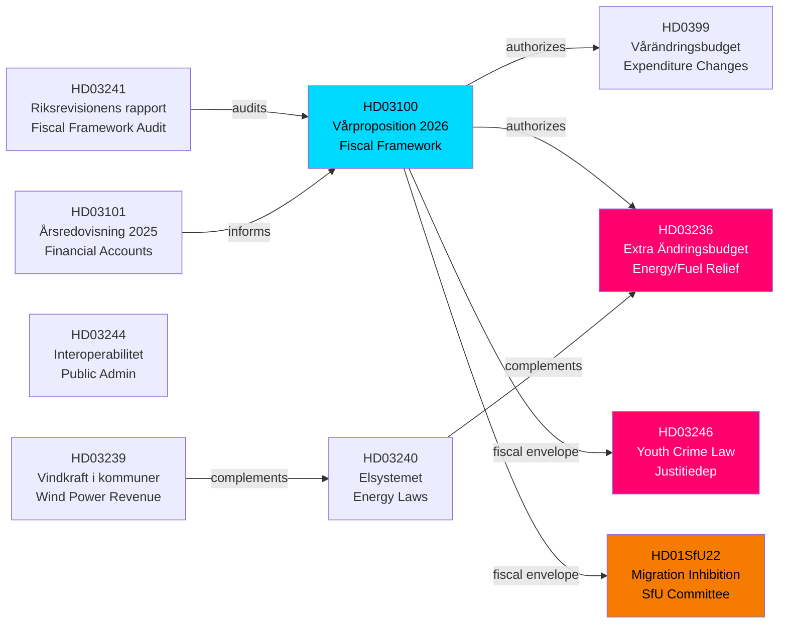

# Cross-Reference Map — Spring 2026 Legislative Cluster
**Analysis run:** realtime-1705 | **Date:** 2026-04-18

## Document Dependency Graph

## Key Interdependencies

### Budget Package Cluster (HD03100 → HD0399 → HD03236)
These three documents form Sweden's spring fiscal package. HD03100 sets the macro framework, HD0399 adjusts existing budget lines, and HD03236 adds an extraordinary measure (energy relief) outside the regular budget cycle. Together they represent the government's pre-election fiscal platform.

### Energy Policy Cluster (HD03236 + HD03240 + HD03239)
Fuel tax cuts (HD03236), new electricity system laws (HD03240), and wind power revenue sharing (HD03239) form a coherent (if internally tensioned) energy policy agenda: reduce consumer costs in the short-term while building renewable capacity for the long-term.

### Security/Justice Cluster (HD03246 + HD01SfU22)
Youth crime law and migration inhibition orders both belong to the Tidö agreement's security agenda. Both are presented as "firmness" measures and both carry significant implementation risks (SiS capacity, ECHR compliance).

## Previously Covered Documents (April 17 run - NOT duplicated)
- HD01KU32 (Press freedom TFF amendment)
- HD01KU33 (Search warrant public records)
- HD01CU28 (Condominium register)
- HD01CU27 (Property ID requirements)
- HD01CU22 (Guardian system reform)
- HD01SkU23 (Charging at workplace tax relief)
- HD01TU16 (Driving practice requirement removed)
- HD01SfU20 (Parental leave notice removed)
- HD03231 (Ukraine tribunal accession)
- HD03232 (Ukraine compensation commission)
