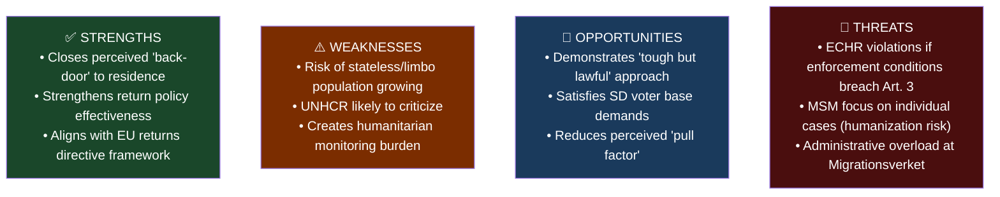

# Analysis: Inhibition av verkställigheten – en ny ordning för vissa utlänningar vid tillfälliga verkställighetshinder
**Dok-ID:** HD01SfU22 | **Datum:** 2026-04-14 | **Organ:** SfU (Socialförsäkringsutskottet) | **Typ:** bet

## Executive Summary
The Social Insurance Committee (SfU) proposed on April 14 that the Riksdag approve a government proposition replacing temporary residence permits for individuals facing deportation barriers with a system of "inhibition" (suspension of enforcement). Under the new regime, people who cannot be deported — because of risk of death, torture, or inhuman treatment in their country of origin — will no longer receive temporary residence permits but will instead have their deportation order suspended. They may also be required to report to Migrationsverket or police and confined to a geographic area.

This is a significant tightening of Sweden's migration policy that fundamentally changes the legal status of approximately 2,000-4,000 individuals annually who fall into this category.

## Analytical Lens 1: Political Context
- **Tidö coalition mandate**: The M+KD+L+SD government has systematically reduced migration pathways since 2022
- **SD influence**: This reform bears the SD fingerprint of closing all alternative pathways to regular stay
- **Minister**: Migration Minister Johan Forssell (M) is the political owner
- **Effective date**: June 1, 2026 — just before the September election

## Analytical Lens 2: SWOT Analysis

| Dimension | Evidence | Confidence | Impact |
|-----------|----------|------------|--------|
| **Strength**: Returns effectiveness | Removes incentive to receive TRP instead of leaving | MEDIUM | MEDIUM |
| **Weakness**: Human rights concern | ECHR Art. 3 absolute bar on refoulement | HIGH | HIGH |
| **Opportunity**: Coalition cohesion | SD core demand; strengthens Tidö agreement | HIGH | MEDIUM |
| **Threat**: Litigation risk | European Court cases on similar frameworks | HIGH | MEDIUM |

## Analytical Lens 3: Stakeholder Perspectives
| Stakeholder | Position | Rationale |
|-------------|----------|-----------|
| **SD** | Strongly supportive | Fulfills core immigration tightening agenda |
| **M, KD, L** | Supportive | Coalition discipline + "orderly returns" narrative |
| **S** | Critical | Humanitarian concerns, institutional harshness |
| **V** | Strongly opposed | Fundamental rights violations |
| **MP** | Strongly opposed | Contradicts refugee protection norms |
| **UNHCR/ECRE** | Opposed | International refugee law concerns |
| **Migrationsverket** | Mixed | More clarity on status, but new administrative burden |
| **Affected individuals** | Severely negatively impacted | Loss of legal status, geographic restriction |

## DIW Score: 6.5/10
Significant migration policy affecting vulnerable population; politically salient ahead of elections; constitutional and human rights dimensions.
