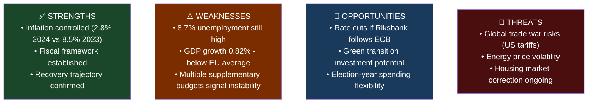

# Analysis: 2026 års ekonomiska vårproposition
**Dok-ID:** HD03100 | **Datum:** 2026-04-13 | **Organ:** Finansdepartementet | **Typ:** prop

## Executive Summary
The 2026 Spring Economic Proposition (Vårpropositionen) sets the fiscal framework for Sweden's 2026-2029 budget horizon. Presented by Finance Minister Elisabeth Svantesson, it establishes macroeconomic forecasts, spending priorities, and revenue projections that will guide Sweden through a critical pre-election period. With GDP growth recovering to 0.82% in 2024 (from -0.20% in 2023), unemployment at 8.7% in 2025, and inflation cooling to 2.8% in 2024 (from 8.5% in 2023), this proposition charts Sweden's path out of a dual economic contraction and inflation shock.

## Analytical Lens 1: Macroeconomic Context
**Key Economic Indicators (World Bank data):**
- **GDP Growth**: 0.82% (2024), -0.20% (2023), 1.26% (2022) – recovery underway but fragile
- **Unemployment**: 8.7% (2025), 8.4% (2024) – structurally elevated, concern for S/V opposition
- **Inflation**: 2.84% (2024), 8.55% (2023) – Riksbank policy has succeeded in cooling prices
- **GDP per capita**: $57,117 (2024) – slight recovery from $54,950 (2023)

**Political framing**: Svantesson will argue recovery is on track under coalition management; opposition will counter that 8.7% unemployment is unacceptable and the extra budget (HD03236) undermines fiscal discipline.

## Analytical Lens 2: SWOT Analysis

| Dimension | Evidence | Confidence | Impact |
|-----------|----------|------------|--------|
| **Strength**: Inflation tamed | CPI 2.84% in 2024 vs 8.55% in 2023 | HIGH (World Bank) | HIGH |
| **Weakness**: Jobs crisis | Unemployment 8.7% in 2025 | HIGH (World Bank) | HIGH |
| **Opportunity**: Monetary easing | Riksbank rate cuts if inflation stays low | MEDIUM | HIGH |
| **Threat**: External shocks | US tariff risks, energy volatility | MEDIUM | HIGH |

## Analytical Lens 3: Stakeholder Impact Matrix
| Stakeholder | Position | Impact |
|-------------|----------|--------|
| **S (Social Democrats)** | Critical – argues unemployment too high | Jobs data supports criticism |
| **M (Moderaterna)** | Supportive – owns inflation success narrative | Will cite CPI numbers |
| **SD** | Supportive – benefits from energy subsidies agenda | Fiscal expansion aligns with voter base |
| **Business/Industry** | Cautiously positive – stable framework, concern on labor costs | |
| **Households** | Mixed – lower inflation positive, unemployment negative | 8.7% unemployment = 450,000+ Swedes |
| **Riksbank** | Monitoring for fiscal discipline | Critical of extra budgets |

## Analytical Lens 4: DIW Score
**DIW Score: 9.5/10** – Spring Economic Proposition is the single most significant annual fiscal document in Swedish politics. It frames the entire year's political-economic debate and sets parameters for all other budget decisions, including HD03236, HD0399.

## Analytical Lens 5: Cross-References
- **HD0399** (Vårändringsbudget): Sister document with specific expenditure adjustments
- **HD03236** (Extra ändringsbudget): Energy/fuel subsidies that modify this framework
- **HD03241** (Riksrevisionens rapport): Independent audit of fiscal framework compliance
- **HD03101** (Årsredovisning för staten 2025): Financial accounts showing 2025 actuals
