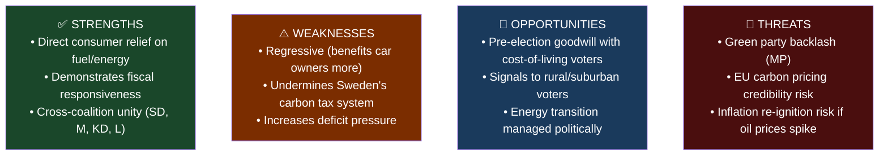

# Analysis: Extra ändringsbudget för 2026 – Sänkt skatt på drivmedel samt el- och gasprisstöd
**Dok-ID:** HD03236 | **Datum:** 2026-04-13 | **Organ:** Finansdepartementet | **Typ:** prop

## Executive Summary
The Kristersson government submitted a supplementary emergency budget (Extra ändringsbudget) for 2026 reducing fuel taxes and introducing electricity/gas price subsidies. Presented by Finance Minister **Elisabeth Svantesson** with Financial Markets Minister **Niklas Wykman** as co-signatory on the revenue-measure components, this is a politically significant fiscal intervention responding to persistent cost-of-living pressures faced by Swedish households. Coming alongside the Spring Economic Proposition (HD03100 — also authored by Svantesson), this package signals the government's willingness to deploy fiscal tools to address energy costs ahead of the 2026 September elections.

## Analytical Lens 1: Political Context & Actors
**Principal actors:**
- **Elisabeth Svantesson** (M) – Finance Minister; owner of the full spring fiscal package (HD03100 + HD0399 + HD03236) and lead presenter of this extra ändringsbudget
- **Niklas Wykman** (M) – Financial Markets Minister; co-signatory on the fuel-excise-reduction provisions (Finansdepartementets skatteavdelning)
- **Romina Pourmokhtari** (L) – Klimat- och miljöminister; departmental input on electricity/gas subsidy design (Klimat- och näringslivsdepartementet)
- **Ebba Busch** (KD) – Energi- och näringsminister; political co-principal on energy-subsidy side
- **Opposition** (S, V, MP): likely to criticize fossil fuel tax cuts as environmentally regressive

**Political motivation:** The Tidö agreement (M+KD+L+SD coalition) faces electoral pressure from high energy costs. This supplementary budget serves dual purposes: (1) immediate consumer relief, (2) electoral signal of fiscal competence ahead of September 2026 elections.

## Analytical Lens 2: SWOT Analysis

| Dimension | Evidence | Confidence | Impact |
|-----------|----------|------------|--------|
| **Strength**: Consumer relief | Fuel tax cuts directly lower pump prices for 5M+ car owners | HIGH | HIGH |
| **Weakness**: Fiscal cost | Supplementary budgets reduce fiscal space; deficit implications unclear | MEDIUM | MEDIUM |
| **Opportunity**: Election positioning | Polls show cost-of-living as #1 voter concern entering 2026 | HIGH | HIGH |
| **Threat**: EU coherence | Sweden committed to carbon pricing; tax cut contradicts climate targets | HIGH | MEDIUM |

## Analytical Lens 3: Stakeholder Perspectives
| Stakeholder | Position | Rationale | Evidence |
|-------------|----------|-----------|---------|
| **S (Social Democrats)** | Critical | Will argue it's regressive, helps wealthy car owners more | Opposition doctrine |
| **V (Vänsterpartiet)** | Critical | Ideologically opposed to fossil fuel subsidies | dok_id: HD03236 |
| **MP (Miljöpartiet)** | Strongly opposed | Direct contradiction of climate policy | Environmental mandate |
| **SD (Sverigedemokraterna)** | Supportive | Aligns with cost-of-living agenda | Tidö coalition partner |
| **Rural voters** | Strongly supportive | Higher car dependency, disproportionate fuel cost burden | Demographics |
| **Urban commuters** | Moderately supportive | Public transit alternatives exist | Partial dependency |
| **Industry (logistics)** | Supportive | Lower operating costs for transport sector | Direct impact |

## Analytical Lens 4: Risk Assessment
| Risk | Probability | Impact | Severity |
|------|-------------|--------|----------|
| Inflationary signal to market | MEDIUM (30%) | MEDIUM | 🟡 MODERATE |
| EU carbon pricing credibility undermined | LOW (20%) | HIGH | 🟡 MODERATE |
| Parliamentary defeat (unlikely with SD support) | LOW (10%) | HIGH | 🟢 LOW |
| Electoral backlash from green voters | MEDIUM (40%) | MEDIUM | 🟡 MODERATE |

## Analytical Lens 5: Legislative Impact
- **Direct**: Reduces revenue from fuel excise duties; provides credits/subsidies for electricity/gas consumption
- **Timeline**: Budget changes take effect immediately upon Riksdag approval (Q2 2026)
- **Constitutional**: Standard budget amendment procedure; requires Finance Committee (FiU) approval
- **Precedent**: Continues pattern of emergency energy subsidies started in 2022-23 during energy price spike

## Analytical Lens 6: Electoral Implications (2026 Election)
- **Score: HIGH political salience** – Cost-of-living is Sweden's top electoral issue
- **Coalition calculus**: SD and M both benefit from this measure; L and KD accept as coalition discipline
- **Opposition handicap**: S cannot easily oppose consumer relief without appearing out of touch
- **DIW Score: 8.5/10** – Immediate fiscal impact affecting all Swedish households
