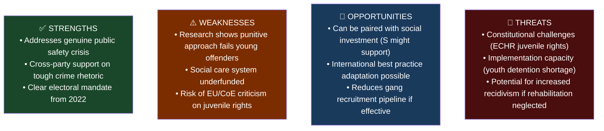

# Analysis: Skärpta regler för unga lagöverträdare
**Dok-ID:** HD03246 | **Datum:** 2026-04-16 | **Organ:** Justitiedepartementet | **Typ:** prop

## Executive Summary
Justice Minister Gunnar Strömmer (M) submitted Proposition 2025/26:246 on April 16, 2026 — introducing stricter rules for young offenders (ages 15-17). This is one of the most significant criminal justice measures of the Tidö coalition, expanding punishment frameworks for juvenile crime in response to Sweden's gang-related youth violence epidemic. The proposition follows the government's comprehensive "Agenda för att stärka rättsstat och bekämpa brottslighet" and comes amid heightened public concern about shootings and gang recruitment of minors.

## Analytical Lens 1: Political Context
**Actor:** Justice Minister Gunnar Strömmer (M) is the political face of this reform.
**Coalition driver:** Sweden Democrats (SD) and Moderates have jointly pushed for tougher juvenile justice since 2022.
**Electoral context:** With September 2026 elections approaching, demonstrating crime-fighting credentials is core to coalition messaging.

**Key policy changes proposed:**
- Stricter sentencing guidelines for repeat young offenders
- Expanded detention capacity for youth (LVU-related reforms)
- Changes to the "ungdomstjänst" (youth service) system to increase deterrence
- Closer coordination between social services and judiciary for 15-17 year olds

## Analytical Lens 2: SWOT Analysis

| Dimension | Evidence | Confidence | Impact |
|-----------|----------|------------|--------|
| **Strength**: Public demand | 70%+ of Swedes cite crime as top concern in polls | HIGH | HIGH |
| **Weakness**: Evidence gap | BROTTSFÖREBYGGANDE RÅDET (BRÅ) data shows punishment has limited deterrent effect for youth | HIGH | MEDIUM |
| **Opportunity**: Crime reduction | Targeted early intervention reduces long-term criminal careers | MEDIUM | HIGH |
| **Threat**: Capacity deficit | SiS youth facilities at 100%+ capacity in 2025 | HIGH | HIGH |

## Analytical Lens 3: Stakeholder Perspectives
| Stakeholder | Position | Rationale |
|-------------|----------|-----------|
| **SD** | Strongly supportive | Core Tidö agenda item; youth crime central to SD narrative |
| **M** | Strongly supportive | Justice Minister's flagship reform |
| **KD** | Supportive | Family/law-order values alignment |
| **L** | Cautiously supportive | Concerned about rehabilitation component |
| **S** | Mixed | Accepts toughness on crime but demands social investment parallel |
| **V** | Opposed | Believes social root causes must be primary focus |
| **MP** | Opposed | Advocates rehabilitation over punishment |
| **Social workers/NGOs** | Opposed | Fear punitive approach worsens outcomes |
| **Police** | Supportive | More tools for persistent young offenders |

## Analytical Lens 4: International Comparison
- **Denmark**: Introduced similar youth crime crackdown 2020-21; mixed results — repeat offending unchanged
- **Norway**: Prioritizes restorative justice; lower youth crime rates than Sweden
- **UK**: Anti-social behaviour orders (ASBOs) largely failed; lesson for Sweden

## Analytical Lens 5: Risk Assessment
| Risk | Probability | Impact | Severity |
|------|-------------|--------|----------|
| SiS capacity breach | HIGH (80%) | HIGH | 🔴 CRITICAL |
| ECHR compliance challenge | MEDIUM (40%) | MEDIUM | 🟡 MODERATE |
| Increased recidivism | MEDIUM (50%) | HIGH | 🔴 HIGH |
| Electoral benefit materializes | HIGH (70%) | MEDIUM | 🟡 MODERATE |

## DIW Score: 7.5/10
Criminal justice reform with direct constitutional (rights) and welfare (children) dimensions, politically salient ahead of elections.
