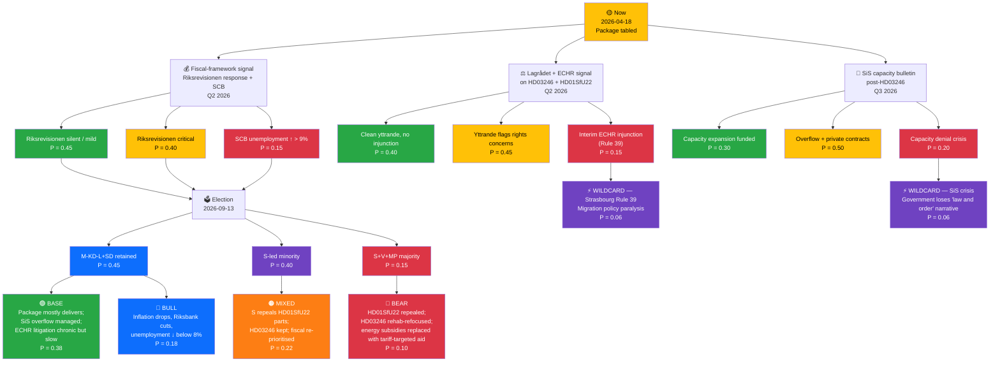

# 🔀 Scenario Analysis — Realtime Monitor 1705

| Field | Value |
|-------|-------|
| **SCN-ID** | SCN-2026-04-18-1705 |
| **Framework** | Alternative-futures analysis (ACH-informed) + Bayesian scenario weighting |
| **Horizon** | Short (Q2 2026) · Medium (election Q3 2026) · Long (2026–2028) |
| **Methodology** | `analysis/methodologies/political-risk-methodology.md` §Scenario Generation · `political-swot-framework.md` §Scenario-Branching TOWS |

> **Purpose**: Stress-test the dominant "election-sprint-works" narrative, surface wildcards, assign prior probabilities for Bayesian updating as forward indicators fire. All probabilities are analyst priors; see §Indicator Tripwires for update rules.

---

## 🧭 Master Scenario Tree

> Priors sum to ≈ 1.00. Probabilities will be Bayesian-updated as Lagrådet yttrande, Riksrevisionen response, SCB labour stats, SiS bulletins, and polling signals arrive.

---

## 📖 Scenario Narratives

### 🟢 BASE — "Sprint Mostly Delivers" (P = 0.38)

**Setup**: Riksrevisionen signals moderate concern but no adverse finding; Lagrådet yttrande flags rights issues on HD03246 (capacity) and HD01SfU22 (judicial review) but does not recommend withdrawal; SiS enters overflow via private contracts; coalition retains majority.

**Key confirming signals**
- Unemployment drifts in a narrow band around 8.5–9.0 % through Q3 2026 `[HIGH]`
- RSF / Freedom House Sweden scores unchanged `[HIGH]`
- No ECtHR Rule 39 injunction; litigation remains merits-stage `[MEDIUM]`
- Inflation continues normalising (2.84 % → ~2.0 % by Q4 2026) `[HIGH]`

**Consequences**
- HD03100 legacy: fiscal-competence narrative survives the election
- HD03236: baseline entitlement; absorbed into 2027 budget
- HD03246: enters force; SiS overflow becomes chronic implementation story
- HD01SfU22: first geographic-restriction orders issued; first NGO litigation filed; merits-stage only

---

### 🔵 BULL — "Recovery Story Takes Hold" (P = 0.18)

**Setup**: Inflation normalisation accelerates; Riksbank delivers two 25bp cuts in Q2–Q3 2026; unemployment falls below 8.0 % by Q3; US tariff environment moderates; coalition retains majority with an enlarged mandate.

**Key confirming signals**
- Core inflation < 2.0 % by Q3 2026 `[MEDIUM]`
- Riksbank reporäntan ≤ 2.25 % by election day `[MEDIUM]`
- AKU unemployment ≤ 7.8 % in August 2026 report `[LOW]`
- KI Konjunkturbarometer: consumer + firm expectations net positive `[MEDIUM]`

**Consequences**
- Coalition claims "we tamed inflation AND restored growth"
- HD03236 removed from 2027 budget as fiscal space reappears
- HD03246 + HD01SfU22 proceed as planned; ECHR litigation treated as background noise
- Post-election: moderate supply-side reforms become the 2026–2030 agenda

---

### 🟠 MIXED — "S-led Minority, Package Re-scoped" (P = 0.22)

**Setup**: Coalition loses majority but no left bloc majority emerges. S forms minority with confidence-and-supply from C and MP. Package is partially unwound on legal-risk dimensions.

**Key confirming signals**
- SCB-final polling (August 2026) shows M-bloc below 45 % `[MEDIUM]`
- C repositioning toward S explicitly on migration `[MEDIUM]`
- Lagrådet-yttrande on HD01SfU22 is critical enough to provide political cover for S `[MEDIUM]`

**Consequences**
- HD01SfU22 geographic-restriction sections repealed; judicial-review safeguard added (P ≈ 0.70 within S-led govt)
- HD03246 retained with rehabilitation parallel investment (BRÅ-aligned)
- HD03236 gradually replaced by targeted low-income heating grants
- HD03100 fiscal framework kept; supplementary-budget frequency restrained
- Ukraine-support trajectory unchanged (cross-bloc consensus)

---

### 🔴 BEAR — "S+V+MP Majority, Rights-First Rebuild" (P = 0.10)

**Setup**: Left bloc gains absolute majority. HD01SfU22 repealed within first 180 days; HD03246 refocused on rehabilitation with SiS capital-investment package; HD03236 replaced with targeted energy-subsidy scheme.

**Key confirming signals**
- S party-stämma endorses "rights-first" manifesto `[MEDIUM]`
- Youth voter turnout in Q3 2026 municipal signals > 2022 baseline `[LOW]`
- ECtHR interim decision against Sweden before election `[LOW]` — see WILD1
- SiS public capacity-failure incident before election `[LOW]` — see WILD2

**Consequences**
- HD03100 kept; supplementary-budget mechanism constrained by new fiscal rule
- HD03246 refocused — ~SEK 1.5 B capital investment in SiS over 2027–2029
- HD01SfU22 repealed; inhibition-order concept replaced with fast-track judicial review
- Riksrevisionen relationship strengthened (S-led govt uses audit as agenda-setter)

---

### ⚡ WILDCARD — "Strasbourg Rule 39 Injunction" (P = 0.06)

**Trigger**: ECtHR issues interim measure (Rule 39) against Sweden blocking implementation of geographic-restriction orders in specific cases.

**Implications**
- Immediate ministerial-level political fallout
- Forssell (Migrationsminister) faces opposition no-confidence motion
- Coalition cohesion: L most vulnerable to defection on rights grounds
- Electoral impact: polarising — mobilises both base and opposition

---

### ⚡ WILDCARD — "SiS Capacity Crisis Pre-Election" (P = 0.06)

**Trigger**: A publicly reported SiS capacity-failure incident (e.g., youth transferred to adult facility, escape event, violence incident) within 90 days of election.

**Implications**
- Strömmer's "law and order" narrative collapses
- S exploits with "law without competence" framing
- Capital-investment demand becomes unavoidable; 2027 budget pre-committed
- Electoral impact: net-negative for coalition (≈ 2–3 pp in polling swing)

---

## 📊 Indicator Tripwires (Bayesian Update Rules)

| Indicator | Fires If | Prior Shift |
|-----------|----------|-------------|
| Riksrevisionen verdict on HD03241 | Adverse finding | F2 → 0.60; BEAR + MIX combined ↑ 0.08 |
| Lagrådet yttrande on HD01SfU22 | Recommends withdrawal | L3 → 0.35; WILD1 ↑ 0.04 |
| Lagrådet yttrande on HD03246 | Flags SiS capacity as blocking | S3 → 0.35; MIX ↑ 0.04 |
| SCB AKU unemployment (July 2026 report) | > 9.0 % | F3 → 0.30; BEAR ↑ 0.04 |
| SCB CPIF (July 2026 report) | Annual < 2.0 % | BULL ↑ 0.06 |
| ECtHR Rule 39 request | Filed | WILD1 → 0.15; L3 → 0.30 |
| SiS public incident | Major reported | WILD2 → 0.20; BEAR ↑ 0.05 |
| Riksbank reporäntan | Cut below 2.5 % by Aug 2026 | BULL ↑ 0.05 |
| M-bloc polling (August 2026 SVT/Ipsos) | < 45 % total | E1 ↓ 0.15; E2 ↑ 0.10; E3 ↑ 0.05 |

---

## 🎯 Scenario-Based Decision Recommendations

| Role | BASE (0.38) | BULL (0.18) | MIX (0.22) | BEAR (0.10) | WILDCARD (0.12) |
|------|:-----------:|:-----------:|:----------:|:-----------:|:---------------:|
| **Newsroom editorial** | Lead with fiscal competence; sub-lead SiS capacity | Lead with recovery story | Lead with coalition pivot | Lead with rights-first mandate | Breaking news posture |
| **Policy analyst** | Monitor Riksrevisionen + SiS monthly | Model post-2026 supply-side reform | Model HD01SfU22 repeal mechanics | Model fiscal-rule redesign | Model crisis-response protocols |
| **Rights NGO** | Plan merits-stage litigation | Standby monitoring | Plan legislative amendments | Plan capital-investment advocacy | Plan emergency response |
| **Foreign ministries** | Baseline Sweden posture | Expect re-engagement on supply side | Expect MIX partner tilt | Expect rights-first re-alignment | Expect crisis-driven volatility |

---

## 🧪 Red-Team Critique

**What could make this scenario tree wrong?**

1. **Unmodelled shock from outside the Swedish system** — e.g., Russia-related event reshaping campaign attention away from domestic package. Mitigation: monitor SÄPO bulletins; foreign-policy-salience tripwire.
2. **Coalition-internal fracture on HD01SfU22** — L's liberal identity creates a modelled tension but not a modelled fracture. If L threatens withdrawal, E1 probability drops sharply.
3. **HD03246 rehabilitation-side amendment** — if government pre-emptively adds rehab funding to HD03100 through extraordinary appropriation, S3 probability falls and MIX/BEAR motivation weakens.
4. **Riksbank independence signalling** — if the bank publicly resists coalition pressure, BULL scenario inflation narrative is politically usable only via a confrontation frame.

---

## 📎 Cross-Links

[README](README.md) · [Executive Brief](executive-brief.md) · [Synthesis](synthesis-summary.md) · [Risk](risk-assessment.md) · [Threat](threat-analysis.md) · [Comparative](comparative-international.md) · [Stakeholders](stakeholder-perspectives.md)

---

**Classification**: Public · **Next Review**: 2026-04-25
