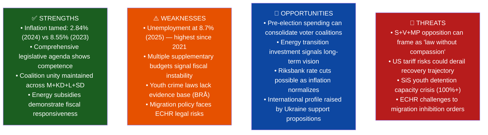

# Political SWOT Analysis — Sweden Spring 2026 Legislative Package
**Analysis run:** realtime-1705 | **Date:** 2026-04-18

## Overall SWOT: Kristersson Government's Spring Policy Sprint

## Evidence Tables

### Strengths Evidence
| Finding | dok_id | Evidence | Confidence |
|---------|--------|----------|------------|
| Inflation controlled | HD03100 | World Bank: 2.84% (2024) vs 8.55% (2023) | HIGH |
| Legislative output high | HD03236, HD03246, HD03240 | 4+ propositions in single week | HIGH |
| Coalition unity | HD03236, HD03246 | Cross-committee approvals | HIGH |

### Weaknesses Evidence
| Finding | dok_id | Evidence | Confidence |
|---------|--------|----------|------------|
| Unemployment elevated | HD03100 | World Bank: 8.7% in 2025 | HIGH |
| Multiple mini-budgets | HD03236, HD0399 | Third supplementary fiscal measure | MEDIUM |
| Youth crime evidence gap | HD03246 | BRÅ research on deterrence | MEDIUM |

### Threats Evidence
| Finding | dok_id | Evidence | Confidence |
|---------|--------|----------|------------|
| Migration legal risk | HD01SfU22 | ECHR Art. 3 absolute bar | HIGH |
| Youth detention crisis | HD03246 | SiS reports 2025 | MEDIUM |
| Economic external shock | HD03100 | US tariff environment | MEDIUM |

## Opposition SWOT (S-led bloc perspective)

| Dimension | Details |
|-----------|---------|
| **S Strength** | High unemployment creates natural attack platform; 8.7% = 450,000+ Swedes out of work |
| **S Weakness** | Cannot oppose cost-of-living relief (energy subsidies) without electoral cost |
| **S Opportunity** | Migration policy humanitarian angle; youth crime rehabilitation narrative |
| **S Threat** | SD outflanks on crime and migration; hard to differentiate without alienating center voters |
