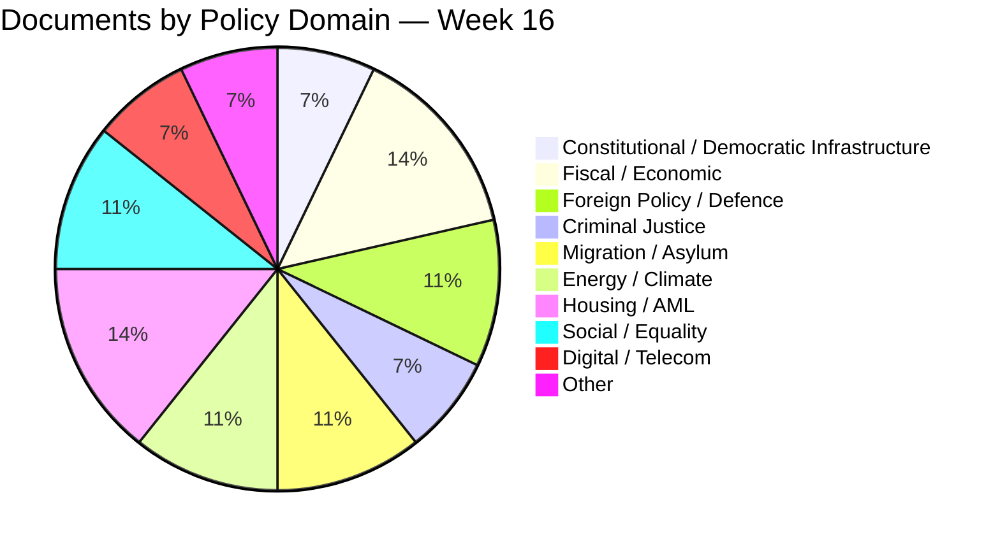

# 🏷️ Classification Results — Riksdag Week 16, 2026

| Field | Value |
|-------|-------|
| **CLS-ID** | CLS-2026-W16 |
| **Period** | 2026-04-11 — 2026-04-17 |
| **Methodology** | `analysis/methodologies/political-classification-guide.md` v3.0 (CIA triad + sensitivity tier + domain taxonomy + urgency matrix) |
| **Confidence Scale** | ⬛ VERY LOW · 🟥 LOW · 🟧 MEDIUM · 🟩 HIGH · 🟦 VERY HIGH |
| **Documents Classified** | 28 (23 weekly significant + 5 supplementary) |

---

## 🎯 Sensitivity / Classification Tier Summary

| Tier | Definition | Documents This Week |
|------|------------|---------------------|
| **🔴 P0 — Constitutional / Critical** | Grundlag amendments; democratic-infrastructure changes; reversal window decadal | HD01KU33, HD01KU32 |
| **🟠 P1 — Strategic National** | Foreign-policy treaty accession; major fiscal commitments; criminal-justice frame; security operations | HD03100, HD0399, HD03236, HD03231, HD03232, HD03246, HD01SfU22, HD01UFöU3, Prop 235, Prop 229 |
| **🟡 P2 — Sector / Regulated** | Energy, housing, accessibility, sector-specific reforms | HD03240, HD03245, HD03237, HD01CU27, HD01CU28, HD03244, HD03242, HD03239, HD03233 |
| **🟢 P3 — Routine / Administrative** | Riksrevisionen reports, motions, EU directive transposition, interpellations | HD024098, HD01CU22, HD01CU42, HD10437, HD10438, HD11718, HD11719 |

---

## 🧮 CIA-Triad Impact per Document

> Where CIA = **C**onfidentiality (information protection / institutional secrecy), **I**ntegrity (rule-of-law durability + transparency), **A**vailability (citizen access to rights / services). Scored ⬛/🟥/🟧/🟩/🟦.

| Dok ID | Confidentiality | Integrity | Availability | Net Democratic Impact |
|--------|:---------------:|:---------:|:------------:|:---------------------:|
| **HD01KU33** | 🟦 VH (raises confidentiality of police-seized digital material) | 🟥 L (narrows transparency / "allmän handling") | 🟧 M (citizens lose insight into investigations) | 🟥 **Net negative on transparency** |
| **HD01KU32** | 🟧 M (no change) | 🟦 VH (rights-positive — accessibility entrenched in grundlag) | 🟦 VH (citizens with disabilities gain access) | 🟦 **Net positive on rights** |
| HD03100 (Vårproposition) | 🟧 M | 🟩 H (fiscal accountability framework intact) | 🟦 VH (welfare delivery + relief) | 🟦 Net positive |
| HD0399 / HD03236 | 🟧 M | 🟩 H | 🟦 VH (fuel + el/gas relief) | 🟦 Net positive |
| HD03246 (JuU15) | 🟩 H (juvenile-data confidentiality concerns from longer remand) | 🟧 M (extends carceral state vs rehab) | 🟧 M (police investigative capacity ↑; juvenile rights ↓) | 🟧 Mixed |
| HD03231 (Tribunal) | 🟧 M | 🟦 VH (rule-of-law + accountability) | 🟧 M (no direct citizen impact) | 🟦 Net positive |
| HD03232 (Damages Comm.) | 🟧 M | 🟦 VH (reparations rule-of-law architecture) | 🟧 M | 🟦 Net positive |
| HD01SfU22 (Inhibition) | 🟩 H | 🟥 L (reduces appeal mechanism) | 🟥 L (asylum-seeker access ↓) | 🟥 Net negative on rights (ECHR risk) |
| Prop 235 (Deportation) | 🟧 M | 🟥 L (reduces procedural protection) | 🟥 L | 🟥 Net negative on rights |
| Prop 229 (Reception law) | 🟧 M | 🟧 M | 🟥 L (eligibility narrowed) | 🟥 Net negative |
| HD01UFöU3 (NATO eFP) | 🟦 VH (military operational secrecy) | 🟦 VH (NATO Article 5 credibility) | 🟧 M (förändrar säkerhetsläget) | 🟦 Net positive |
| HD03240 (Electricity Sys) | 🟧 M | 🟦 VH (legal coherence ↑) | 🟦 VH (smart-grid investment ↑) | 🟦 Net positive |
| HD03239 (Wind power municipal) | 🟧 M | 🟩 H | 🟩 H (municipal revenue + climate) | 🟩 Net positive |
| HD03245 (Strategy violence) | 🟩 H (victim privacy) | 🟦 VH | 🟩 H (services ↑) | 🟦 Net positive |
| HD03237 (Police training) | 🟧 M | 🟩 H (recruitment ↑) | 🟩 H (police capacity) | 🟩 Net positive |
| HD01CU27 (Lagfart + AML) | 🟩 H (data integrity) | 🟦 VH (AML enforcement ↑) | 🟧 M (consumer protection ↑) | 🟦 Net positive |
| HD01CU28 (Bostadsregister) | 🟩 H (register data) | 🟦 VH (market integrity ↑) | 🟩 H (bostadsrätter buyers) | 🟦 Net positive |
| HD03244 (Interoperability) | 🟧 M | 🟩 H | 🟦 VH (cross-agency services ↑) | 🟩 Net positive |
| HD03242 (Forestry) | 🟧 M | 🟧 M | 🟧 M | Mixed (climate trade-off) |
| HD03233 (Anti-fraud) | 🟧 M | 🟩 H | 🟦 VH (consumer protection) | 🟩 Net positive |
| HD024098 (Counter-budget motion) | 🟢 — | 🟢 — | 🟢 — | Procedural |
| HD01CU22 / HD01CU42 | 🟧 M | 🟩 H (Riksrevisionen oversight) | 🟧 M | 🟩 Net positive |
| HD10437 (Lönetransparens) | 🟧 M | 🟩 H | 🟩 H | 🟩 Net positive |
| HD10438 (Kvinnojourer) | — | 🟧 M | 🟥 L (services at risk) | 🟥 Concern |
| HD11718 (Statlig närvaro Skåne) | — | 🟧 M | 🟧 M | Procedural |
| HD11719 (Skattekrav prostitution) | 🟩 H | 🟥 L (victim re-victimisation risk) | 🟥 L | 🟥 Net negative for victims |

---

## 🌐 Domain Distribution

---

## 🎚️ Pre-Election Significance Distribution

| Salience to Sep 2026 Election | Documents | Total |
|------------------------------|-----------|:-----:|
| 🟦 **VERY HIGH** | HD03100, HD0399, HD03236, HD03246, HD01UFöU3 | 5 |
| 🟩 **HIGH** | HD01KU33, HD01KU32, HD03231, HD01SfU22, Prop 235, Prop 229, HD03245 | 7 |
| 🟧 **MEDIUM** | HD03232, HD03240, HD03237, HD03239, HD01CU27, HD01CU28 | 6 |
| 🟥 **LOW** | HD03244, HD03242, HD03233, HD024098, HD01CU22, HD01CU42, HD10437, HD11718 | 8 |
| ⬛ **VERY LOW** | HD10438, HD11719 (procedural relevance) | 2 |

---

## ⏱️ Urgency Matrix

| Decision Horizon | Documents | Action |
|------------------|-----------|--------|
| **Immediate (≤ 7 days)** | HD03236 chamber vote 2026-04-22; KU annual hearings 2026-04-27 | Live monitoring |
| **Near (30 days)** | Lagrådet KU32/KU33 yttrande Q2; chamber votes on KU and Ukraine | Track for editorial follow-up |
| **Medium (90 days)** | Försvarsmakten Q3 deployment; budget execution data | Forward-watch list |
| **Long (1+ years)** | KU33 second reading; ECHR ruling; tribunal first case | Post-election briefings |

---

## 🔐 Classification Rationale

All 28 documents classified **Public** under [`Hack23 ISMS-PUBLIC CLASSIFICATION.md`](https://github.com/Hack23/ISMS-PUBLIC/blob/main/CLASSIFICATION.md):

- All documents already published by Riksdagen / Regeringskansliet
- All MCP-sourced (`get_propositioner`, `get_betankanden`, `search_dokument`, `get_g0v_document_content`)
- No personnummer, no source-protected information
- All analyst claims backed by cited dok_id evidence

**Classification Internal would apply to** (none in this run): pre-disclosure embargoed material, source-protected intelligence.
**Classification Restricted would apply to** (none): threat-information enabling adversary action.

---

## 🗳️ Election 2026 Implications (Per Classification Tier)

| Tier | Election Implication |
|------|---------------------|
| **P0** | KU32/KU33 second reading is post-election — the Sep 13 result determines whether grundlag changes ratify. Coalition arithmetic is the binding variable. |
| **P1** | Fiscal trilogy + JuU15 + migration trio are central campaign-frame documents. Government economic-stewardship narrative depends on Q3 macro execution. |
| **P2** | Energy + housing + digital sector reforms are 2026/27 implementation windows; minimal Sep salience but legacy assets. |
| **P3** | Procedural / oversight items provide background drumbeat for accountability narratives but rarely top-of-fold. |

---

## 📎 Cross-References

- [`significance-scoring.md`](significance-scoring.md) §Master Scoring uses these classifications as input
- [`risk-assessment.md`](risk-assessment.md) §R1–R8 cite the P0/P1 documents for risk-cluster construction
- [`stakeholder-perspectives.md`](stakeholder-perspectives.md) maps each P0/P1 document to its stakeholder lens

---

**Classification**: Public · **Next Review**: 2026-04-25 · **Methodology**: `analysis/methodologies/political-classification-guide.md` v3.0
