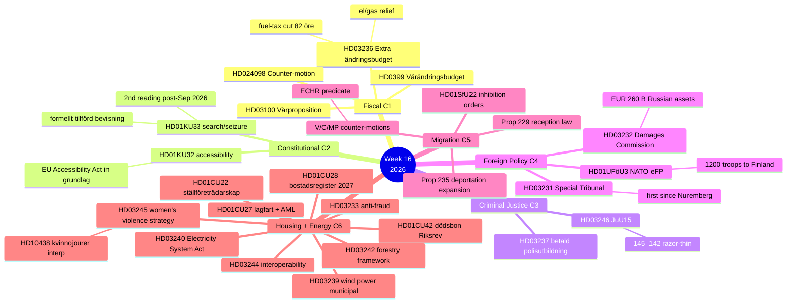

# 🔗 Cross-Reference Map — Riksdag Week 16, 2026

| Field | Value |
|-------|-------|
| **CRX-ID** | CRX-2026-W16 |
| **Period** | 2026-04-11 — 2026-04-17 |
| **Methodology** | Thematic clustering + cross-cluster interference + prior-run continuity |
| **Confidence Scale** | ⬛ VL · 🟥 L · 🟧 M · 🟩 H · 🟦 VH |

---

## 🎯 Six Thematic Clusters

| # | Cluster | Lead Documents | Total Significance Weight |
|:-:|---------|---------------|:------------------------:|
| **C1** | 💰 **Spring Fiscal Trilogy** | HD03100 + HD0399 + HD03236; HD024098 (counter-budget motion) | 28.0 (lead) |
| **C2** | 📜 **Constitutional First Reading** | HD01KU33 + HD01KU32 | 18.55 |
| **C3** | ⚖️ **Criminal Justice / Tidö Centerpiece** | HD03246 (JuU15) + HD03237 | 15.30 |
| **C4** | 🌍 **Ukraine Accountability + NATO Operationalisation** | HD03231 + HD03232 + HD01UFöU3 | 23.75 |
| **C5** | 🛂 **Migration / Rights Tightening** | HD01SfU22 + Prop 235 + Prop 229 | 23.75 |
| **C6** | 🏠 **Housing AML + Energy + Sector Reforms** | HD01CU27 + HD01CU28 + HD01CU22 + HD01CU42 + HD03240 + HD03239 + HD03242 + HD03244 + HD03233 + HD03245 | 53.85 (high count, lower per-document) |

---

## 🗺️ Policy Mindmap (Mermaid Mind-Map)

---

## 🔁 Cross-Cluster Linkages (where the action is)

| Linkage | Connecting Documents | Mechanism |
|---------|---------------------|-----------|
| **C1 ↔ C6 (Climate-coherence tension)** | HD03236 fuel-tax cut **vs** HD03240 Electricity System Act + HD03239 wind power | Government climate brand under pressure: relief mechanism contradicts green ambition |
| **C2 ↔ C4 (Press-freedom-abroad-vs-home)** | HD01KU33 narrowing **vs** HD03231 Nuremberg-style accountability | Cross-cluster rhetorical contradiction; opposition-frame target |
| **C3 ↔ C5 (Brott-och-ordning + migration alignment)** | HD03246 JuU15 + HD01SfU22 / Prop 235 / Prop 229 | Tidö-deal coherence; SD-base reinforcement |
| **C4 ↔ Threat T1** | HD03231 + HD01UFöU3 → Russian retaliation | Tribunal + NATO eFP elevate Sweden's adversary visibility |
| **C5 ↔ Threat T3** | Migration trio → V/C/MP ECHR challenge | Litigation predicate prepared in counter-motion text |
| **C6 ↔ Lantmäteriet capacity** | HD01CU28 register Jan 2027 | IT-delivery dependency on Lantmäteriet capacity |
| **C6 ↔ HD10438 (Kvinnojourer)** | HD03245 strategy + HD10438 interpellation | Strategy + funding-stress accountability moment |

---

## 🔄 Prior-Run Continuity

| Connecting File | Continuity Type | Notes |
|----------------|-----------------|-------|
| [`realtime-1434/synthesis-summary.md`](../../2026-04-17/realtime-1434/synthesis-summary.md) | **Direct precedent** | Per-document deep dives on KU32, KU33, HD03231, HD03232, CU27, CU28 |
| [`realtime-1434/comparative-international.md`](../../2026-04-17/realtime-1434/comparative-international.md) | **Direct precedent** | Nordic + EU benchmarks for KU33 / KU32 / Ukraine cluster |
| [`realtime-1434/scenario-analysis.md`](../../2026-04-17/realtime-1434/scenario-analysis.md) | **Direct precedent** | Scenario branches inherited and extended for fiscal+migration trios |
| Daily analysis 2026-04-15 → 2026-04-17 | **Catalogue continuity** | JuU15 chamber-vote details (145–142) sourced from voteringar 2026-04-15 |
| Quarterly NATO eFP risk assessment 2026-Q1 | **Risk continuity** | T1 baseline established; this run upgrades to operational integration phase |

---

## 🔭 Forward Continuity (next-run hand-off)

The next analytical runs (daily 2026-04-19 → daily 2026-04-25) should prioritise:

1. **HD03236 chamber vote (2026-04-22)** — fiscal trilogy validation; risk R4 update
2. **KU annual granskning hearings (2026-04-27)** — accountability drumbeat
3. **Lagrådet KU32/KU33 yttrande Q2 2026** — Bayesian update R2 (decisive variable)
4. **First-reading chamber vote on KU33 (May–June 2026)** — operational confirmation
5. **Ukraine HD03231 + HD03232 chamber vote** — confirms package; trigger T1 re-baseline
6. **Försvarsmakten Bn-task-group deployment Q3 2026** — operational milestone

Each of those events triggers a **per-event analysis** in the appropriate `analysis/daily/YYYY-MM-DD/{type}/` folder per Rule 1 isolation.

---

## 🗳️ Election 2026 Implications (mandatory)

| Cluster | Election Salience | Notes |
|---------|:-----------------:|-------|
| **C1 Fiscal** | 🟦 VERY HIGH | Cost-of-living = #1 voter issue; Q3 2026 macro = Sep verdict |
| **C2 Constitutional** | 🟩 HIGH | KU33 second reading post-election ⇒ campaign vector |
| **C3 Criminal Justice** | 🟦 VERY HIGH | Brott + ordning = #2 voter issue; Tidö centerpiece |
| **C4 Foreign Policy** | 🟧 MEDIUM | Cross-party consensus dampens electoral exploit |
| **C5 Migration** | 🟩 HIGH | SD-base reinforcement; ECHR risk if struck pre-Sep |
| **C6 Sector Reforms** | 🟧 MEDIUM | Implementation-window 2026/27; minimal Sep salience |

---

## 📎 Cross-References

- [`synthesis-summary.md`](synthesis-summary.md) §Top-5 Developments uses C1–C6 directly
- [`significance-scoring.md`](significance-scoring.md) §Master Scoring distributes documents across C1–C6
- [`swot-analysis.md`](swot-analysis.md) §TOWS uses C1×C6 + C2×C4 cross-cluster tensions
- [`risk-assessment.md`](risk-assessment.md) §R1–R8 maps cluster-level risk
- [`scenario-analysis.md`](scenario-analysis.md) §Scenarios apply cluster framing

---

**Classification**: Public · **Next Review**: 2026-04-25 · **Methodology**: Thematic clustering + cross-cluster interference + prior-run continuity (see `political-swot-framework.md` §Cross-Cluster Interference)
