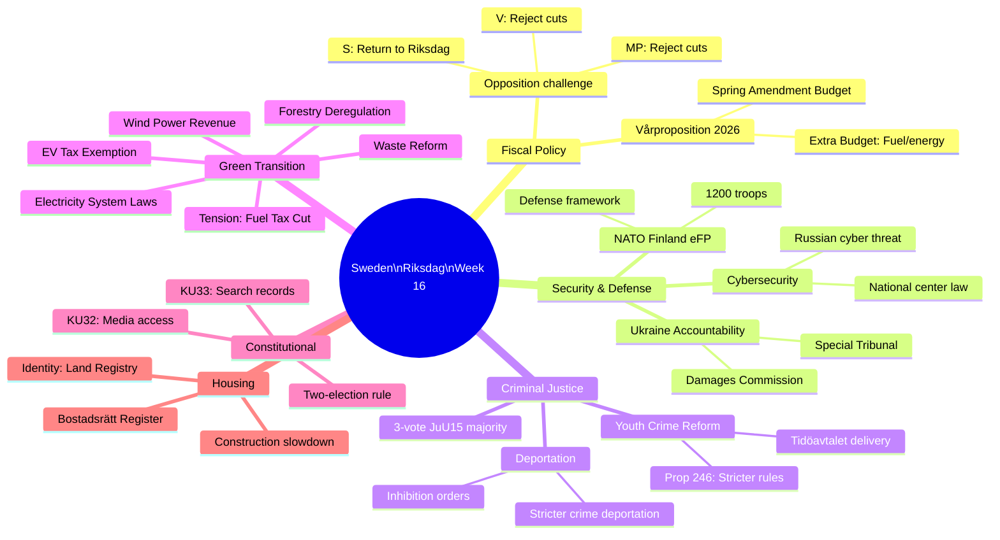

# Cross-Reference Map — Week 16 (2026-04-11 to 2026-04-17)

**Generated**: 2026-04-18 09:20 UTC (AI-enhanced)
**Purpose**: Map relationships between Week 16 documents and longer-term policy threads

---

## Thematic Clusters

### Cluster A: Spring Fiscal Package

```
HD03100 (Vårproposition 2026)
├── HD0399 (Vårändringsbudget 2026) — implements VÅP budget framework
├── HD03236 (Extra ändringsbudget: Drivmedel + el/gas) — emergency fiscal measure
│   ├── mot. 4098 (MP): Reject fuel tax cut
│   ├── mot. 4092 (V): Reject fuel tax cut
│   └── mot. 4082 (S): Demand further analysis
└── HD03241 (Riksrevision: Financial policy framework 2025) — audit context
    └── HD03101 (Årsredovisning staten 2025) — annual accounts

Related: HD0398 (Tax expenditure report 2026)
Committee: FiU → Expected: JuU17 vote April 22
```

### Cluster B: Ukraine Accountability

```
HD03231 (Special Tribunal: Ukraine aggression crime)
├── HD03232 (Damages Commission: Ukraine) — twin international instruments
│   └── Both: Prop. 2025/26:231 & 232 — Foreign Ministry package
└── HD01UFöU3 (NATO eFP Finland: 1,200 troops) — military implementation
    └── Previous: Prop. 2025/26:220 (April 9) — Sweden's NATO military framework

Related earlier: Prop. 2025/26:6, 2025/26:25 (NATO military framework series)
Committee: UFöU (joint foreign affairs/defense committee)
```

### Cluster C: Criminal Justice Reform Chain

```
HD03246 (Stricter rules: Young offenders — Prop. 246)
├── JuU15 vote (145–142, April 16) — direct connection
├── HD03218 (Double penalties: Network crime)
├── HD03217 (Civil servant criminal liability)
│   └── All: Tidöavtalet criminal justice delivery package
└── Previous: Prop. 2025/26:133 (SD interp. HD10429 on free speech) — context

Related: HD01SfU22 (Inhibition orders) — thematic connection via law enforcement
```

### Cluster D: Migration Policy Continuum

```
HD01SfU22 (Inhibition orders: Deportation reform) — Committee report
├── Prop. 2025/26:235 (Skärpta regler: Utvisning på grund av brott)
│   ├── mot. 4090 (V): Full rejection — ECHR risk
│   ├── mot. 4095 (C): Proportionality amendment
│   └── mot. 4097 (MP): Selective acceptance
├── HD03229 (En ny mottagandelag — New Reception Law)
│   ├── mot. 4080 (S): No private asylum housing
│   ├── mot. 4087 (MP): Integration-promoting housing
│   └── mot. 4089 (C): Municipal emergency assistance
└── Prop. 2025/26:215 (Settlement law — temporary housing)
    ├── mot. 4079 (S): Return to Riksdag demand
    └── mot. 4086 (MP): Policy alternatives
```

### Cluster E: Energy/Green Transition

```
HD03240 (New Electricity System Laws)
├── HD03239 (Wind Power in Municipalities: Revenue sharing)
│   └── Direct benefit to C rural constituency
├── HD03242 (Active Forestry Framework — deregulation)
├── HD01MJU19 (Waste/Recycling reform — MJU committee)
└── HD01MJU20 (Riksrevision: Climate policy framework audit)
    └── V+C+MP joint reservation — cross-bloc climate accountability demand

Related: HD01SkU23 (EV charging permanent tax exemption) — green transition
Note: Tension between HD03236 (fuel tax cut) and cluster E (green transition)
```

### Cluster F: Constitutional Amendments (First Reading)

```
HD01KU32 (Accessibility: Press/media — TF/YGL change)
└── HD01KU33 (Search/seizure records — TF/YGL change)
    Both: REQUIRE second identical vote after September 2026 election
    
Constitutional lock: 2 elections rule (TF Chapter 15)
Risk: New government could vote differently = amendments fail
Timeline: Second vote needed by May 2027 (new Riksdag term)
```

---

## Inter-Week Document Connections

| Week 16 Document | Prior Week Connection | Significance |
|-----------------|----------------------|:---:|
| HD01UFöU3 | Prop. 2025/26:220 (Apr 9) + Prop. 2025/26:6 | Series completion |
| HD03236 Extra budget | FiU48 committee (Apr 14) — already pre-analyzed | Fast-tracked |
| SfU22 Inhibition orders | HD03235 (Deportation rules — prior week) | Migration intensification |
| JuU15 vote | JuU committee spring term package | Coalition test |

---

## Policy Mindmap: Week 16 Interconnections


