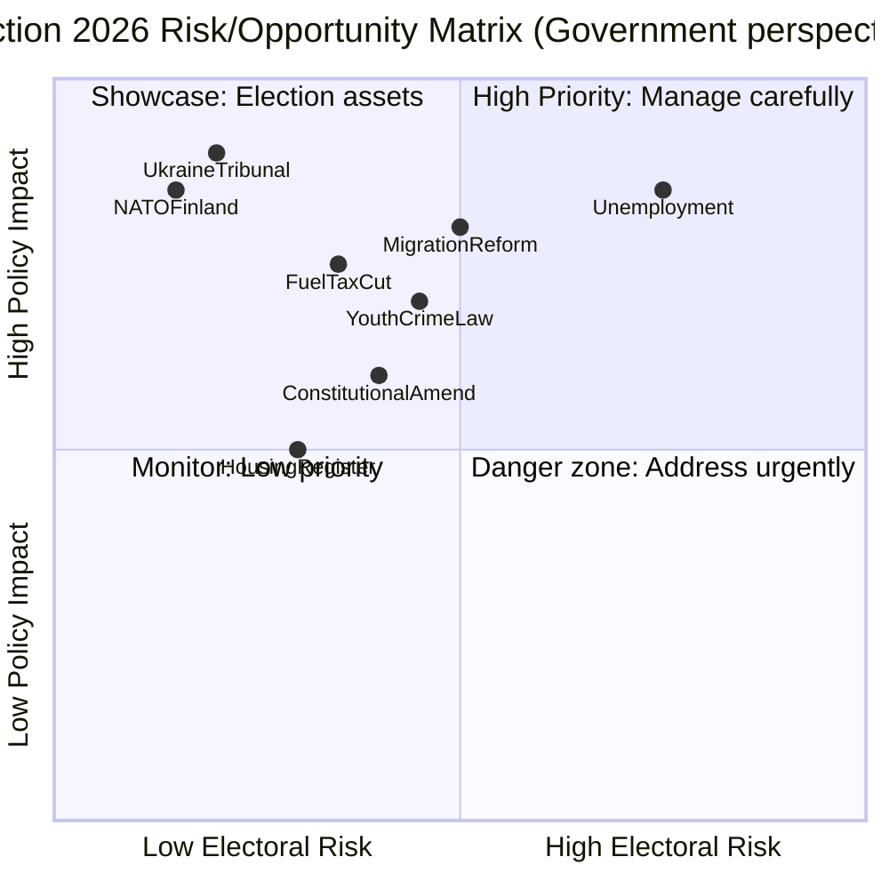

# Risk Assessment — Week 16 (2026-04-11 to 2026-04-17)

**Generated**: 2026-04-18 09:17 UTC (AI-enhanced)
**Method**: Multi-dimensional risk scoring per ai-driven-analysis-guide.md v5.0
**Risk Period**: Rolling 90-day forward view from April 18, 2026

---

## Top Risk Indicators

| Risk ID | Risk | Probability | Impact | Score | Confidence |
|---------|------|:-----------:|:------:|:-----:|:----------:|
| R01 | Coalition collapse before September election | 🟧 LOW-MED (25%) | 🔴 CRITICAL | 6.5/10 | 🟩 HIGH |
| R02 | Fuel tax cut backfires: Environmental credibility collapse | 🟧 MED (35%) | 🟠 HIGH | 6.0/10 | 🟩 HIGH |
| R03 | Ukraine tribunal opposition from neutralist MPs | 🟥 LOW (10%) | 🟠 HIGH | 4.0/10 | 🟩 HIGH |
| R04 | Deportation inhibition orders challenged at ECHR/EU courts | 🟦 HIGH (65%) | 🟠 MEDIUM | 6.5/10 | 🟩 HIGH |
| R05 | Youth crime law implementation challenges | 🟧 MED (40%) | 🟡 MED | 5.0/10 | 🟧 MED |
| R06 | Economic stagnation undermines fiscal narrative | 🟧 MED (45%) | 🟠 HIGH | 6.5/10 | 🟩 HIGH |
| R07 | Swedish NATO eFP: Risk of military incident in Finland | 🟥 LOW (8%) | 🔴 CRITICAL | 5.0/10 | 🟧 MED |
| R08 | Constitutional amendment fails second reading post-election | 🟧 MED (30%) | 🟠 HIGH | 5.5/10 | 🟩 HIGH |

---

## Risk Analysis: Coalition Fragility (R01)

The JuU15 vote (145–142, margin of 3) is the clearest signal of coalition fragility this spring term. The Tidöavtalet government can sustain current majority only if:
- All 73 SD MPs vote with government on every issue
- All 26 KD MPs vote with government  
- All 24 L MPs vote with government
- All 52 M MPs vote with government (plus PM)

**Scenario analysis**:
- Any 2 SD MPs defecting on a key vote = government defeat
- SD's Richard Jomshof interpellation on mosque hate speech (HD10430) signals SD is managing nationalist base demands — if Forssmed (KD) doesn't satisfy SD, intra-coalition tension could escalate
- Risk window: **May–June 2026** (spring term's final intensive period)

## Risk Analysis: Economic Exposure (R06)

Sweden's macroeconomic position entering the election:
- **GDP 2024**: +0.82% (recovering from -0.20% in 2023)
- **Unemployment 2025**: 8.7% (up from 8.4% in 2024)
- **Inflation**: Easing but still above ECB target
- **Nordic comparison**: Denmark 3.5% GDP growth, Norway 2.1%, Finland 0.4%

Sweden underperforms Denmark significantly and only slightly outperforms Finland's -0.9% contraction. Opposition (S, V) will campaign on unemployment figures — the government's fiscal stimulus must show results by September.

---

## Election 2026 Risk Matrix

---

## 90-Day Forward Risk Calendar

| Date | Risk Event | Risk Level |
|------|-----------|:----------:|
| 2026-04-22 | Extra Amendment Budget (JuU17) vote — fuel tax implementation | 🟠 HIGH |
| 2026-04-27 | Constitution Committee annual scrutiny (granskning) — KU hearing | 🔴 CRITICAL |
| 2026-05-01 | Labour Day — S/V mobilization; budget opposition narrative | 🟠 HIGH |
| 2026-05-21 | Riksdag last day (spring term) — final votes on queued legislation | 🔴 CRITICAL |
| 2026-06-06 | National Day — campaign season opens formally | 🟠 HIGH |
| 2026-09-13 | Swedish general election (likely date) | 🔴 CRITICAL |
