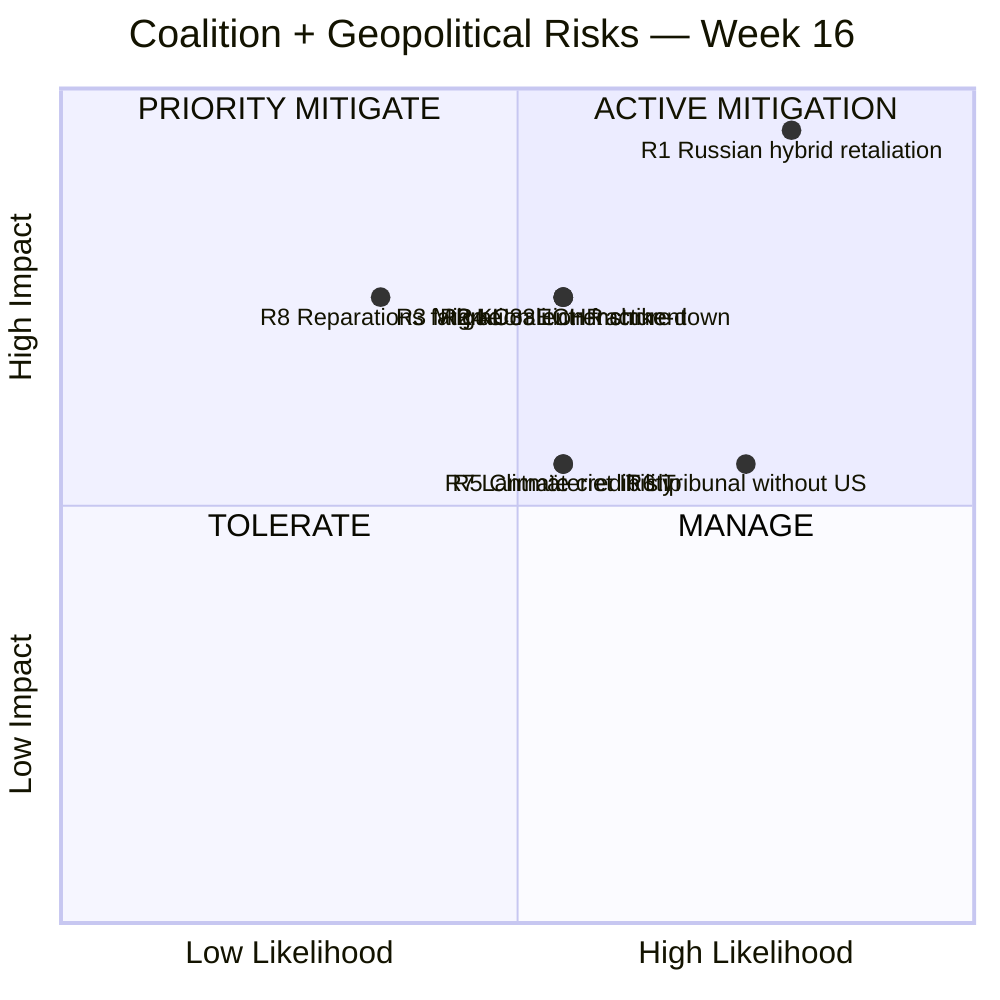
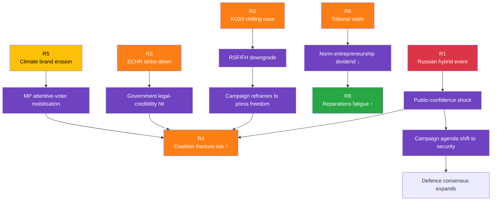
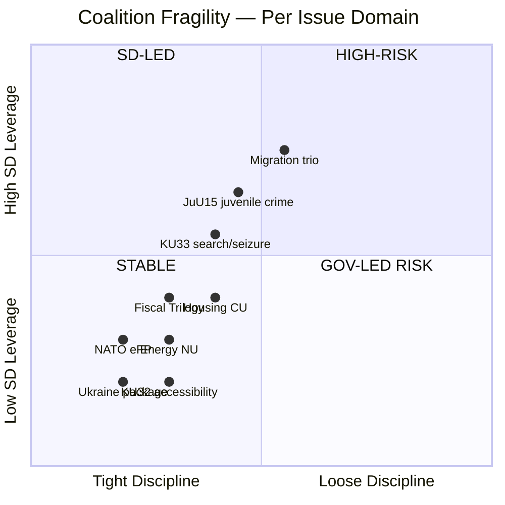

# ⚖️ Risk Assessment — Riksdag Week 16, 2026

| Field | Value |
|-------|-------|
| **RSK-ID** | RSK-2026-W16 |
| **Period** | 2026-04-11 — 2026-04-17 |
| **Methodology** | `analysis/methodologies/political-risk-methodology.md` v2.x (5×5 Likelihood × Impact + Bayesian update + ALARP + cascading-risk) |
| **Risk Inventory** | 8 priority risks · 4 watch-list items |
| **Confidence Scale** | ⬛ VL · 🟥 L · 🟧 M · 🟩 H · 🟦 VH |

---

## 🎯 Top Risk Indicators (5×5 Matrix)

| # | Risk | Likelihood (1-5) | Impact (1-5) | Score | Status | Confidence |
|---|------|:----------------:|:------------:|:-----:|:------:|:----------:|
| **R1** | **Russian hybrid-warfare retaliation** post-tribunal (HD03231) + NATO eFP (HD01UFöU3) — cyber, sabotage, disinformation, infrastructure harassment, instrumentalised migration | 4 | 5 | **20 / 25** → **18 / 25** with mitigation | 🔴 MITIGATE PRIORITY | 🟩 HIGH |
| **R2** | **KU33 narrow-interpretation entrenchment** — "formellt tillförd bevisning" interpretive frontier; chilling effect on investigative journalism over 5+ years | 3 | 4 | **12 / 25** | 🟠 MITIGATE | 🟩 HIGH |
| **R3** | **Migration trio ECHR strike-down or partial reversal** (SfU22 + Prop 235 + Prop 229) under Article 8 + 13 challenge | 3 | 4 | **12 / 25** | 🟠 MITIGATE | 🟧 MEDIUM |
| **R4** | **Coalition fracture under SD pressure** — post-145–142 JuU15 vote, future close votes risky; SD as kingmaker | 3 | 4 | **12 / 25** → **11 / 25** with sequencing discipline | 🟠 MANAGE | 🟧 MEDIUM |
| **R5** | **Climate-credibility erosion** — fuel-tax cut (HD03236) + activity-coupled forestry (HD03242) undermine green brand at exactly the green-policy peak (HD03240) | 3 | 3 | **9 / 25** | 🟡 MANAGE | 🟩 HIGH |
| **R6** | **Tribunal effectiveness without US** — limited operational caseload if US, China, major Global South do not cooperate | 4 | 3 | **12 / 25** | 🟠 ACTIVE MITIGATION | 🟥 LOW |
| **R7** | **Lantmäteriet bostadsregister IT delivery slip** — Jan 2027 deadline (HD01CU28); political cost of delivery failure | 3 | 3 | **9 / 25** | 🟡 MANAGE | 🟧 MEDIUM |
| **R8** | **Reparations-fatigue / decadal commitment burden** (HD03232) — UNCC precedent suggests 30-year horizon; political-sustainability challenges | 2 | 4 | **8 / 25** → **7 / 25** | 🟢 TOLERATE | 🟧 MEDIUM |

---

## 🌡️ Risk Heat Map (Likelihood × Impact)

---

## 📅 90-Day Risk Calendar

| Date / Window | Trigger Event | Risk(s) Updated |
|---------------|---------------|-----------------|
| **2026-04-22** | HD03236 chamber vote | R4 (coalition discipline test) · R5 (climate framing) |
| **2026-04-27** | KU annual granskning hearings open | R2 + R4 (parliamentary accountability) |
| Q2 2026 | **Lagrådet yttrande on KU32/KU33** | R2 (Bayesian decisive update) |
| May–Jun 2026 | KU33/KU32 first chamber reading (vilande beslut) | R2 + R4 |
| Late May / Jun 2026 | Ukraine HD03231/HD03232 chamber vote | R1 (escalation trigger) · R6 |
| **2026-Q3** | Försvarsmakten Bn-task-group deploys to Finland | R1 (operational visibility ↑) |
| **H2 2026** | V + C + MP file ECHR challenge on inhibition orders | R3 (litigation predicate) |
| Continuous (heightened) | SÄPO cyber/hybrid bulletins, Nordic-Baltic intel | R1 (continuous monitoring) |
| **2026-09-13** | General election | R2 (post-election Riksdag composition) · R4 (coalition arithmetic resets) |
| 2026-Q4 | Lantmäteriet IT procurement notice | R7 (delivery confirmation) |

---

## 🔄 Bayesian Update Rules (Living Risks)

> **Doctrine** (per `political-risk-methodology.md` §Bayesian Updating): each priority risk has named observable signals that trigger explicit prior/posterior updates. Failure to update post-trigger ⇒ stale risk inventory.

| Risk | Observable Signal | Direction | Magnitude | Reference |
|------|-------------------|:---------:|:---------:|-----------|
| **R1** | Major cyber/sabotage event attributed to Russia | ↑ | +4 to +6 | SÄPO bulletin |
| **R1** | Quiet 6-month period | ↓ | −2 | Continuous |
| **R1** | NATO Article 5 invocation by another member | ↑ | +3 | NATO HQ |
| **R2** | Lagrådet strict scoping of "formellt tillförd bevisning" | ↓ | −4 | Lagrådet yttrande |
| **R2** | Lagrådet silent on interpretive test | ↑ | +4 | Lagrådet yttrande |
| **R2** | Press-freedom-NGO joint remissvar critical of language | ↑ | +1 | SJF / TU / Utgivarna |
| **R3** | UNHCR reports concerns on Swedish migration practice | ↑ | +2 | UNHCR Sweden country report |
| **R3** | Government adds appeal mechanism in 2nd-reading amendment | ↓ | −4 | SfU committee record |
| **R3** | Strasbourg admits V/C/MP case to merits | ↑ | +3 | ECtHR docket |
| **R4** | Successful close-vote (≤ 5-vote margin) post-JuU15 | ↑ | +1 each | Voteringsregister |
| **R4** | SD parliamentary leader publicly threatens withdrawal | ↑ | +3 | Public statements |
| **R4** | L party-leader publicly distances from migration trio | ↑ | +2 | Public statements |
| **R5** | Q3 2026 emissions-trajectory data (Naturvårdsverket) shows reversal | ↑ | +2 | Naturvårdsverket bulletin |
| **R5** | Klimatpolitiska rådet flags fuel-tax-cut emissions impact | ↑ | +1 | KPR annual report |
| **R6** | US public tribunal endorsement | ↓ | −4 | US State Department |
| **R6** | First Russian official summoned by tribunal | ↓ | −2 | Council of Europe |
| **R6** | US explicit non-participation statement | ↑ | +2 | US official statement |
| **R7** | Lantmäteriet IT procurement notice published Q3 2026 | ↓ | −2 | Lantmäteriet procurement portal |
| **R7** | Procurement notice slip beyond Q3 2026 | ↑ | +3 | Procurement portal |
| **R8** | First reparations-payment disbursement | ↓ | −2 | Damages Commission Secretariat |

---

## 🪜 ALARP Ladder (As Low As Reasonably Practicable)

> **Doctrine**: each risk has explicit treatment-ladder rungs. Mitigation success measured against ladder progress.

| Risk | Current Rung | Next Rung | Decision-Maker |
|------|-------------|-----------|----------------|
| **R1** | Heightened SÄPO/MSB posture; Nordic-Baltic intel coordination | Public-resilience information campaign + critical-infrastructure hardening audit | SÄPO + MSB + Justitiedepartementet |
| **R2** | Lagrådet engagement; press-freedom NGO consultation | Statutory clarification of "formellt tillförd bevisning" in 2nd-reading amendment | Justitiedepartementet + KU |
| **R3** | Government legal review; UNHCR consultation | Add explicit appeal-mechanism + judicial-review compatibility text | Justitiedepartementet + SfU |
| **R4** | Sequencing discipline post-JuU15; pre-vote SD-buy-in management | Cabinet-level coalition dialogue + L-party brand-management coordination | PM Office + SD parliamentary leader |
| **R5** | Communications strategy elevating HD03240 visibility | Compensatory climate-policy commitment (e.g. accelerated EV-charge investment) | Klimat- och näringslivsdepartementet |
| **R6** | Quiet US engagement; Council of Europe leadership | Bilateral state-cooperation agreements with G7 + EU members | Utrikesdepartementet |
| **R7** | Lantmäteriet capacity assessment; political backstop budget | Procurement supplier ramp-up + delivery-milestone publication | Lantmäteriet + Civilutskottet oversight |
| **R8** | Reparations-secretariat staffing | Public-narrative discipline + multi-year budget commitment | Utrikesdepartementet |

---

## 🌊 Cascading Risk Map

---

## 🎯 Coalition-Fragility Quadrant (Operational Stability)

> **Reading**: top-right quadrant (Migration trio + JuU15) = highest fragility under SD leverage; bottom-left (Ukraine + NATO + KU32) = stable consensus. Future-vote risk concentrates in top half. `[HIGH]`

---

## 🗳️ Election 2026 Implications (mandatory)

| Lens | Implication |
|------|-------------|
| **Electoral Impact** | Risk realisation pre-Sep 2026 disproportionately damages government incumbency narrative; R1 + R3 + R5 = highest pre-Sep impact |
| **Coalition Scenarios** | Continuity (P=0.50) preserves R8 burden but mitigates R4; S-led (P=0.35) renegotiates R3 + R5; S+V+MP (P=0.15) reverses KU33 ⇒ extinguishes R2 |
| **Voter Salience** | R1 (security) + R5 (climate) most likely to enter voter consideration; R2 (constitutional) requires triggering case to register |
| **Campaign Vulnerability** | R4 = most exposed if government close-vote tally rises; R3 = most exposed if Strasbourg ruling lands pre-Sep |
| **Policy Legacy** | R8 = decadal — reparations sustainment crosses multiple governments |

---

## 📎 Cross-References

- [`swot-analysis.md`](swot-analysis.md) §T1–T8 = same risks viewed as government threats
- [`threat-analysis.md`](threat-analysis.md) §T1 deep-dives R1 with STRIDE + Attack Tree
- [`scenario-analysis.md`](scenario-analysis.md) §Wildcards = R1 + R5 escalation paths
- [`comparative-international.md`](comparative-international.md) §Diplomatic-Response patterns calibrate R1 magnitude

---

**Classification**: Public · **Next Review**: 2026-04-25 (event-driven; immediate update if R1 trigger fires) · **Methodology**: `analysis/methodologies/political-risk-methodology.md` v2.x (5×5 + Bayesian + ALARP + cascading)
