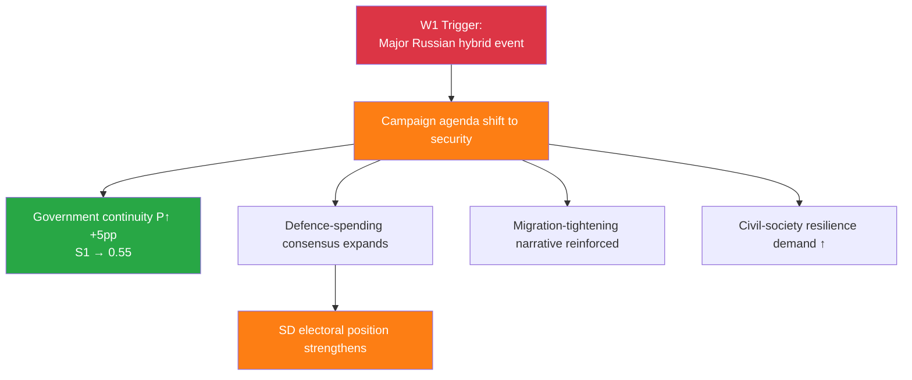
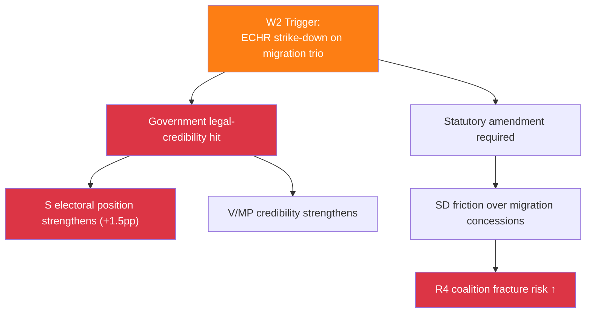

# 🔮 Scenario Analysis — Riksdag Week 16, 2026

| Field | Value |
|-------|-------|
| **SCN-ID** | SCN-2026-W16 |
| **Period Covered** | Forward horizon 2026-04-18 → 2026-Q4 (90-day base + post-Sep election) |
| **Methodology** | `ai-driven-analysis-guide.md` v5.1 §Scenario Analysis + Bayesian priors + ACH (Analysis of Competing Hypotheses) |
| **Scenarios** | 3 base + 2 wildcards |
| **Confidence Scale** | ⬛ VL · 🟥 L · 🟧 M · 🟩 H · 🟦 VH |

---

## 🎯 Three Base Scenarios — Probability Bands

| # | Scenario | Probability | Trigger Cluster | Pre-Sep / Post-Sep |
|:-:|----------|:-----------:|----------------|:-------------------:|
| **S1** | **Continuity (M+KD+L+SD repeated)** | **P = 0.50** | Macro improvement Q3 + JuU15 majority holds + Russian hybrid containable | Both |
| **S2** | **Opposition success (S-led minority)** | **P = 0.35** | Cost-of-living + Nordic-GDP gap + climate critique converge | Post-Sep |
| **S3** | **Coalition collapse (S+V+MP majority)** | **P = 0.15** | Coalition fracture pre-Sep OR S+V+MP campaigns successfully on KU33 + migration + climate | Post-Sep |

**Wildcards (low base probability, high impact)**:

| # | Wildcard | Probability | Impact if realised |
|:-:|----------|:-----------:|-------------------|
| **W1** | **Russian hybrid escalation** materially shifts campaign agenda | P = 0.20 (rising) | Adds ~5 pp to government continuity probability; shifts S3 → ~0.05 |
| **W2** | **ECHR strike-down on inhibition orders** lands pre-Sep | P = 0.15 | Damages government legal credibility; shifts S2 → ~0.40 |

---

## 📊 S1 — Continuity Scenario (P = 0.50)

### Description

The M+KD+L government, supported in Riksdag by SD, is re-confirmed after Sep 2026. The Tidö working majority extends. Vårpropositionens fiscal architecture executes; KU32 + KU33 grundlag amendments ratify in second reading; tribunal architecture operationalises; NATO eFP fully deploys.

### Necessary Conditions

| # | Condition | Required Indicator | Probability |
|---|-----------|--------------------|:------------:|
| 1 | Q3 2026 macro improvement (GDP > 1.5 % run-rate, unemployment ↓ to ~8.3 %) | KI Konjunkturinstitutet + SCB Q3 report | 🟧 M (~0.55) |
| 2 | JuU15 vote pattern repeats (no SD defection on subsequent close votes) | Voteringsregister | 🟩 H (~0.70) |
| 3 | KU33 second reading passes (post-election Riksdag composition supports) | Sep 2026 election result | 🟧 M (~0.50) |
| 4 | Russian hybrid response containable (no major event triggering crisis) | SÄPO bulletins | 🟧 M (~0.65) |
| 5 | ECHR migration challenge does not strike down pre-Sep | Strasbourg docket | 🟩 H (~0.80) |

### Indicators to Monitor

- Q2/Q3 2026 macro data (KI, SCB)
- Coalition close-vote frequency post-2026-04-15
- SÄPO threat-actor bulletins
- ECHR docket on inhibition-orders cases
- Polls trajectory (M+KD+L+SD vs S+V+MP+C)

### Implications

- ✅ Fiscal trilogy executes; KU33 ratifies; tribunal operationalises; NATO Bn-task-group deploys
- ✅ Election message: "ekonomin tryggare, brotten färre, försvaret starkare"
- ⚠️ Climate-credibility erosion continues; W4/T6 manifests
- ⚠️ Continued L-party identity strain on migration trio

---

## 📊 S2 — Opposition Success Scenario (S-led minority)  (P = 0.35)

### Description

S becomes largest party Sep 2026. Government coalition forms on **S minority** + occasional V/MP/C cooperation. KU33 second reading **fails** (or is rewritten). Vårpropositionens fiscal arithmetic re-opened. Migration trio retained but reformed. Ukraine + NATO + KU32 retained intact.

### Necessary Conditions

| # | Condition | Required Indicator | Probability |
|---|-----------|--------------------|:------------:|
| 1 | Cost-of-living salience captures voters | Pre-Sep poll trajectory | 🟧 M (~0.55) |
| 2 | Q3 2026 macro disappoints (GDP < 1.0 %, unemployment > 8.5 %) | KI + SCB | 🟧 M (~0.45) |
| 3 | Climate-credibility erosion mobilises MP/V attentive voters (~1.5 pp) | Polls | 🟧 M (~0.50) |
| 4 | S leadership crystallises post-election coalition arithmetic credibly | Andersson behaviour | 🟩 H (~0.70) |

### Indicators to Monitor

- Cost-of-living poll questions + party-of-best-economic-stewardship
- Climate-policy salience trajectory
- S counter-budget public reception
- Government close-vote frequency (signalling weakness)

### Implications

- ⚠️ Vårpropositionens fiscal architecture re-opened (welfare ↑, försvar ↔)
- ✅ Climate-policy re-prioritisation (ev fuel-tax retention; HD03240 acceleration)
- ⚠️ KU33 second reading fails → grundlag status quo retained → press-freedom NGO win
- ✅ Migration trio reformed (judicial-review compatibility added; Strasbourg risk reduced)
- ✅ Ukraine + NATO + KU32 retained (cross-party consensus durability)

---

## 📊 S3 — Coalition Collapse / S+V+MP Majority  (P = 0.15)

### Description

S + V + MP combined exceed 175 seats Sep 2026. MP/V enter government. KU33 second reading explicitly rejected. Vårproposition reversed in significant part. Migration trio reversed or partially rewritten. Ukraine + NATO retained.

### Necessary Conditions

| # | Condition | Required Indicator | Probability |
|---|-----------|--------------------|:------------:|
| 1 | Major coalition fracture pre-Sep (multi-vote government losses) | Voteringsregister | 🟥 L (~0.20) |
| 2 | KU33 + migration + climate critiques converge as single campaign frame | Polls + media | 🟧 M (~0.30) |
| 3 | Russian hybrid event does not catalyse security-frame (would benefit government) | SÄPO bulletins | 🟧 M (~0.55) |
| 4 | C survives at >5 % parliamentary threshold | Polls | 🟧 M (~0.55) |
| 5 | V-MP coalition arithmetic with S accepted | Polls + leadership statements | 🟧 M (~0.50) |

### Indicators to Monitor

- Government close-vote frequency
- Press-freedom-incident catalysing (KU33 trigger event)
- Climate-policy salience (Q2/Q3)
- Polls trajectory (S+V+MP vs M+KD+L+SD)

### Implications

- ⚠️ Reversal of significant Tidö-deal architecture
- ✅ Climate-policy strong re-prioritisation
- ✅ KU33 second reading explicitly rejected
- ✅ Migration trio reformed (more closely to V/MP positions)
- ✅ Ukraine + NATO retained
- ⚠️ Cabinet learning-curve dampens early-term execution

---

## 🌪️ W1 — Russian Hybrid Escalation Wildcard (P = 0.20, rising)

### Trigger Events

- Major attribution-confirmed cyber attack on Swedish critical infrastructure
- Sabotage / destruction of Nordic submarine cable
- Instrumentalised migration on Finnish border (Finnish 2023–24 precedent)
- Election-disinformation campaign with measurable poll-swing impact

### Cascading Consequences

### Implications for Base Scenarios

- S1 probability rises to ~0.55
- S2 probability falls to ~0.30
- S3 probability falls to ~0.05

---

## 🌪️ W2 — ECHR Strike-Down Pre-Sep (P = 0.15)

### Trigger Events

- Strasbourg admits V/C/MP case to merits + issues judgment
- Partial requirement to add appeal mechanism in inhibition-orders regime
- Government legal-credibility narrative damaged

### Cascading Consequences

### Implications for Base Scenarios

- S1 probability falls to ~0.42
- S2 probability rises to ~0.40
- S3 probability rises to ~0.18

---

## 🎯 ACH (Analysis of Competing Hypotheses) — Sep 2026 Outcome

> **Doctrine**: ACH evaluates each scenario against each indicator; scenarios that **survive contradiction** with most indicators rank highest.

| Indicator | S1 (Continuity) | S2 (S-led) | S3 (S+V+MP) |
|-----------|:---------------:|:----------:|:------------:|
| Q3 macro improves (≥ 1.5 % GDP) | C | I | I |
| Q3 macro disappoints (≤ 1.0 %) | I | C | C |
| Major Russian hybrid event | C | I | I |
| ECHR strike-down pre-Sep | I | C | C |
| Climate salience top-3 | I | C | C |
| Cost-of-living top-1 | C | C | I (S+V+MP arithmetic) |
| Coalition fracture (multi-vote losses) | I | C | C |
| Universal Ukraine consensus durable | C | C | C |
| KU33 chilling case pre-Sep | I | C | C |

**C = consistent with scenario · I = inconsistent**

---

## 🕰️ 90-Day Monitoring Indicators (with Triggers and Bayesian Updates)

| Indicator | Source | Reading Frequency | Direction → Scenario |
|-----------|--------|------------------|---------------------|
| Q2/Q3 GDP / unemployment data | KI + SCB | Quarterly | Up → S1; Down → S2 |
| Coalition close-vote count | Voteringsregister | Continuous | Many → S2/S3; Few → S1 |
| SÄPO hybrid bulletins | SÄPO open assessment | Continuous | Major event → W1 → S1↑ |
| Strasbourg ECHR docket | ECtHR | Continuous | Admission → W2 → S2/S3↑ |
| Press-freedom NGO incidents | RSF + SJF | Continuous | Trigger event → S2/S3↑ |
| KU33 second-reading polls | SVT/SCB | Quarterly | S+V+MP advantage → S3↑ |
| Lagrådet KU32/KU33 yttrande | Lagrådet | One-off | Strict scoping → R2↓ |
| Climate-policy salience polls | Polls | Continuous | High salience → S2/S3↑ |
| Polls (party-by-party) | Demoskop, Sifo, Inizio | Continuous | M+KD+L+SD ≥ 175 → S1; S+V+MP+C ≥ 175 → S3 |

---

## 🗳️ Election 2026 Implications (mandatory)

| Lens | S1 | S2 | S3 |
|------|----|----|-----|
| **Electoral Impact** | Government re-elected | S largest, minority | S+V+MP majority |
| **Coalition Scenarios** | M+KD+L+SD repeated | S minority + cooperation | S+V+MP government |
| **Voter Salience** | Security + economy | Cost-of-living + climate | Civil-rights + climate + cost-of-living |
| **Campaign Vulnerability** | Climate self-contradiction | Coalition arithmetic | Cabinet learning-curve |
| **Policy Legacy** | KU33 ratifies; fiscal architecture executes | Fiscal re-opened; KU33 fails | Fiscal reversed; KU33 fails; migration reformed |

---

## 📎 Cross-References

- [`risk-assessment.md`](risk-assessment.md) §Top Risk Indicators feed scenario triggers (R1=W1, R3=W2, R4=S2/S3)
- [`threat-analysis.md`](threat-analysis.md) §T1 = W1 trigger
- [`comparative-international.md`](comparative-international.md) §Diplomatic-Response calibrates W1 magnitude
- [`stakeholder-perspectives.md`](stakeholder-perspectives.md) maps scenario implications by stakeholder
- [`swot-analysis.md`](swot-analysis.md) §TOWS Cross-Cluster Interference identifies the centres of gravity that drive each scenario

---

**Classification**: Public · **Next Review**: 2026-04-25 (event-driven; immediate update if W1/W2 trigger fires) · **Methodology**: `ai-driven-analysis-guide.md` v5.1 §Scenario Analysis + Bayesian + ACH
