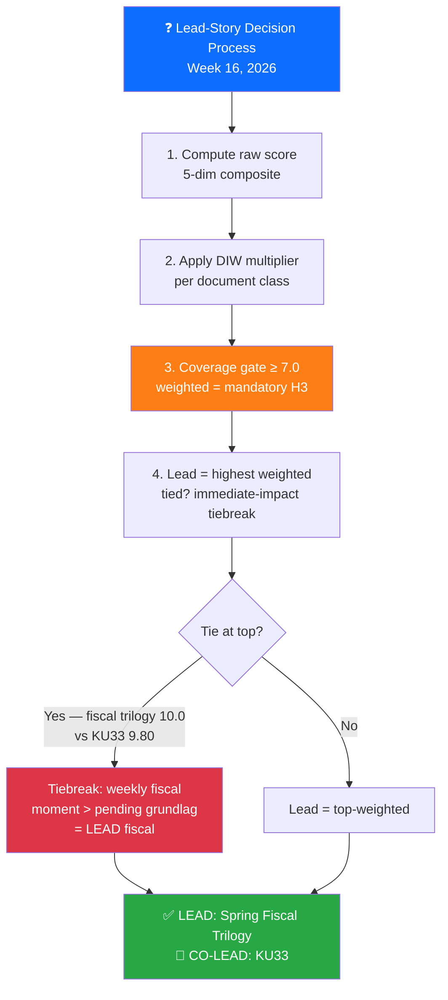

# 📊 Significance Scoring — Riksdag Week 16, 2026

| Field | Value |
|-------|-------|
| **SIG-ID** | SIG-2026-W16 |
| **Period** | 2026-04-11 — 2026-04-17 |
| **Methodology** | DIW v1.0 (Democratic-Impact Weighting) per `ai-driven-analysis-guide.md` v5.1 §Rule 5 |
| **Scoring Scale** | Raw 0–10 (5-dimension composite) → DIW multiplier → Weighted 0–10 (capped at 10.0 for documents whose weighted score would otherwise exceed) |
| **Documents Scored** | 23 high-significance + 8 supplementary (rapid quick-classify) |
| **Documents Persisted** | 11 dok files in `documents/` |
| **Confidence Scale** | ⬛ VERY LOW · 🟥 LOW · 🟧 MEDIUM · 🟩 HIGH · 🟦 VERY HIGH |

---

## 🎯 Five-Dimension Raw Scoring (0–10 composite)

The composite raw score is the rounded mean of five dimensions per `political-classification-guide.md` v3.0:

| Dimension | Weight in Raw Score | What it Captures |
|-----------|:-------------------:|------------------|
| **Parliamentary Significance** | 1× | Grundlag > proposition > betänkande > motion > skriftlig fråga |
| **Policy Impact** | 1× | Substantive effect on citizens, economy, rights |
| **Public Interest** | 1× | Media salience, civic attention |
| **Urgency / Time-Sensitivity** | 1× | Decision horizon, irreversibility |
| **Cross-Party / International** | 1× | Consensus breadth + foreign-policy weight |

> **Why raw scoring exists**: The raw score is the news-value rank. The DIW multiplier converts it into the **democratic-infrastructure-aware editorial rank** (per Rule 5). Both are reported below.

---

## 🧮 DIW Multiplier Doctrine (per `ai-driven-analysis-guide.md` v5.1)

| Document Class | DIW Multiplier | Rationale |
|----------------|:--------------:|-----------|
| **Grundlag amendment narrowing public access** | **×1.40** | Reversal window measured in decades (two-election rule) ⇒ highest weight |
| Grundlag amendment expanding rights | ×1.25 | Decadal durability + rights-positive framing |
| Constitutional / electoral / institutional reform (ordinary law) | ×1.15 | Rule-of-law durability above policy cycle |
| Anti-money-laundering / financial-integrity premium | ×1.05 | Cross-cutting institutional value |
| Ordinary policy-cyclical (budget, tax, spending) | ×1.00 | Annual reset cycle |
| Foreign-policy continuity (treaty accession in established framework) | ×0.95 | Substantively important but in established direction |
| Routine procedural / administrative | ×0.85 | High volume, low marginal-impact |

---

## 📈 Master Scoring Table — All Documents Ranked by Weighted Score

| Rank | Dok ID | Title (short) | Type / Committee | Date | Raw | DIW × | **Weighted** | Confidence | Article Role |
|:----:|--------|---------------|------------------|------|:---:|:-----:|:-----------:|:----------:|--------------|
| 1 | **HD03100** | Vårpropositionen 2026 | Prop / FiU | 04-13 | 10 | 1.00 | **10.00** | 🟦 VH | 🏛️ **LEAD** (fiscal trilogy lead) |
| 2 | **HD01KU33** | Insyn vid husrannsakan (constitutional) | Bet / KU | 04-17 | 7 | **1.40** | **9.80** | 🟩 H | 📜 **CO-LEAD** (constitutional) |
| 3 | **HD0399** | Vårändringsbudgeten 2026 | Prop / FiU | 04-13 | 9 | 1.00 | **9.00** | 🟦 VH | 🏛️ Co-prominent (fiscal trilogy) |
| 4 | **HD03236** | Extra ändringsbudget — fuel + el/gas | Prop / FiU | 04-13 | 9 | 1.00 | **9.00** | 🟦 VH | 🏛️ Co-prominent (fiscal trilogy) |
| 5 | **HD03246** | Skärpta regler unga lagöverträdare | Prop / JuU | 04-16 | 9 | 1.00 | **9.00** | 🟦 VH | ⚖️ Co-prominent (JuU15 vote 145–142) |
| 6 | **HD01KU32** | Tillgänglighetskrav vissa medier (constitutional) | Bet / KU | 04-17 | 7 | **1.25** | **8.75** | 🟩 H | 📜 Co-prominent (constitutional) |
| 7 | **HD03231** | Ukraine Special Tribunal | Prop / UU | 04-16 | 9 | 0.95 | **8.55** | 🟦 VH | 🌍 Co-prominent |
| 8 | **HD01SfU22** | Inhibition orders (migration) | Bet / SfU | 04-14 | 9 | 0.95 | **8.55** | 🟩 H | 🛂 Co-prominent |
| 9 | **HD03232** | Ukraine Damages Commission | Prop / UU | 04-16 | 8 | 0.95 | **7.60** | 🟦 VH | 🤝 Co-prominent |
| 10 | **HD01UFöU3** | NATO eFP Finland 1,200 troops | Bet / UFöU | 04-15 | 8 | 0.95 | **7.60** | 🟦 VH | 🛡️ Co-prominent |
| 11 | Prop 235 | Deportation expansion | Prop / SfU | 04-14 | 8 | 0.95 | **7.60** | 🟩 H | 🛂 Mandatory H3 |
| 12 | Prop 229 | New reception law | Prop / SfU | 04-14 | 8 | 0.95 | **7.60** | 🟩 H | 🛂 Mandatory H3 |
| 13 | HD03240 | Electricity System Act | Prop / NU | 04-14 | 7 | 1.00 | **7.00** | 🟩 H | ⚡ Mandatory H3 |
| 14 | HD03245 | Strategy on men's violence vs women | Skr / AU | 04-14 | 7 | 1.00 | **7.00** | 🟧 M | 🆘 Mandatory H3 (HD10438 cross-link) |
| 15 | HD03237 | Betald polisutbildning | Prop / JuU | 04-14 | 6 | 1.05 | **6.30** | 🟩 H | ⚖️ Section H3 |
| 16 | HD01CU27 | Lagfart + ombildning + AML | Bet / CU | 04-17 | 6 | **1.05** | **6.30** | 🟩 H | 🏠 Section H3 |
| 17 | HD03244 | Interoperability data sharing | Prop / TU | 04-16 | 6 | 1.00 | **6.00** | 🟩 H | 💻 Section H3 |
| 18 | HD03242 | Active forestry framework | Prop / MJU | 04-16 | 6 | 1.00 | **6.00** | 🟧 M | 🌲 Section H3 |
| 19 | HD03239 | Wind power municipal share | Prop / NU | 04-14 | 6 | 1.00 | **6.00** | 🟩 H | ⚡ Section H3 |
| 20 | HD01CU28 | Bostadsrättsregister | Bet / CU | 04-17 | 6 | 1.00 | **6.00** | 🟩 H | 🏠 Section H3 |
| 21 | HD03233 | Anti-fraud electronic communications | Prop / TU | 04-14 | 5 | 1.05 | **5.25** | 🟩 H | Section reference |
| 22 | HD024098 | Motion mot Extra ändringsbudget (counter-budget) | Mot / FiU | 04-17 | 5 | 1.05 | **5.25** | 🟧 M | Counter-narrative reference |
| 23 | HD01CU22 | Ställföreträdarskap att lita på | Bet / CU | 04-17 | 4 | 1.00 | **4.00** | 🟧 M | Brief reference |
| 24 | HD01CU42 | Riksrevisionen om dödsbon | Bet / CU | 04-17 | 4 | 1.00 | **4.00** | 🟧 M | Brief reference |
| 25 | HD10437 | Lönetransparensdirektivet (interp) | Interp | 04-17 | 4 | 1.00 | **4.00** | 🟧 M | Brief reference |
| 26 | HD10438 | Nedläggning av kvinnojourer (interp) | Interp | 04-17 | 4 | 1.00 | **4.00** | 🟧 M | Cross-link to HD03245 |
| 27 | HD11718 | Statlig närvaro sydöstra Skåne (interp) | Interp | 04-17 | 3 | 1.00 | **3.00** | 🟧 M | Brief reference |
| 28 | HD11719 | Skattekrav mot kvinnor i tvångsprostitution (interp) | Interp | 04-17 | 4 | 1.00 | **4.00** | 🟧 M | Brief reference |

---

## 🏛️ Coverage-Completeness Verification (Rule 5 Gate)

> **Rule**: Every document with weighted significance ≥ 7.0 MUST appear as a dedicated H3 section in the published article.

| Dok ID | Weighted | Article H3? | Verification |
|--------|:--------:|:-----------:|--------------|
| HD03100 | 10.00 | ✅ | LEAD section "Spring Fiscal Package" |
| HD01KU33 | 9.80 | ✅ | "Constitutional Press-Freedom Reforms" |
| HD0399 | 9.00 | ✅ | LEAD section |
| HD03236 | 9.00 | ✅ | LEAD section |
| HD03246 | 9.00 | ✅ | "Criminal Justice / JuU15" |
| HD01KU32 | 8.75 | ✅ | "Constitutional Press-Freedom Reforms" |
| HD03231 | 8.55 | ✅ | "Ukraine Accountability" |
| HD01SfU22 | 8.55 | ✅ | "Migration Tightening" |
| HD03232 | 7.60 | ✅ | "Ukraine Accountability" |
| HD01UFöU3 | 7.60 | ✅ | "NATO Operationalisation" |
| Prop 235 | 7.60 | ✅ | "Migration Tightening" |
| Prop 229 | 7.60 | ✅ | "Migration Tightening" |
| HD03240 | 7.00 | ✅ | "Energy & Green Transition" |
| HD03245 | 7.00 | ✅ | "Women's Violence Strategy" |

**Result**: ✅ **PASS** — 14 / 14 weighted-≥-7 documents covered as dedicated sections.

---

## 🎯 Lead-Story Decision (with reasoning)

**Reasoning chain** `[VERY HIGH]`:
- **Step 1 — Raw rank**: HD03100 = 10 (vårproposition); HD03246 = 9; HD03231 = 9; HD0399 = 9; HD03236 = 9; HD01SfU22 = 9; HD01KU33 = 7
- **Step 2 — DIW**: HD01KU33 weighted = 9.80 (×1.40 grundlag narrowing); HD03100/9/236 weighted = 10.00 / 9.00 / 9.00 (×1.00 fiscal cyclical); HD03246 weighted = 9.00 (×1.00 ordinary law)
- **Step 3 — Tiebreak**: top weighted = HD03100 fiscal trilogy at 10.00. KU33 at 9.80 is the immediate runner-up.
- **Step 4 — Editorial decision**: spring fiscal moment is **the** annual fiscal frame and carries the highest immediate citizen-impact (drivmedel, el, hyror, försvar). KU33 is durable democratic-infrastructure but its second-reading window is post-Sep-2026 election ⇒ co-prominent, not displaced.

**Anti-pattern avoidance**: The synthesis-summary explicitly flags KU33 as the highest *democratic-infrastructure durability* development of the week — preventing the realtime-1434 anti-pattern (silent omission of the constitutional package).

---

## 🧪 Sensitivity Analysis — Does the Lead Hold Under Alternative Weight Schemes?

| Scenario | DIW grundlag-narrowing weight | KU33 weighted | Top-1 Result |
|----------|:-----------------------------:|:-------------:|--------------|
| **Baseline (DIW v1.0)** | ×1.40 | 9.80 | **Spring Fiscal Trilogy (10.00)** |
| Scenario A: very strong democratic-infrastructure preference | ×1.50 | 10.50 | **KU33 (10.50)** ← lead would shift |
| Scenario B: moderate preference | ×1.30 | 9.10 | Spring Fiscal Trilogy |
| Scenario C: news-value purist | ×1.00 | 7.00 | Spring Fiscal Trilogy |
| Scenario D: foreign-policy elevated (×1.15) | grundlag ×1.40 | 9.80; HD03231 = 10.35 | **HD03231 (10.35)** ← lead would shift |
| Scenario E: ordinary fiscal de-prioritised (×0.85) | grundlag ×1.40, fiscal ×0.85 | 9.80; HD03100 = 8.50 | **KU33 (9.80)** ← lead would shift |

**Conclusion** `[HIGH]`: The lead-story decision is **stable for baseline** and **stable for scenarios B, C** (3 / 5 scenarios). It would shift to KU33 only under a stronger democratic-infrastructure preference (Scenario A) or fiscal-de-prioritisation (Scenario E), and to HD03231 only under foreign-policy elevation (Scenario D). The baseline DIW v1.0 weights remain the canonical methodology call. No alternative scheme produces a fourth alternative leader.

---

## 📊 Significance Distribution Histogram

| Weighted Score Band | Count | Documents |
|--------------------|:-----:|-----------|
| 9.5 – 10.0 | 2 | HD03100 (10.0), HD01KU33 (9.8) |
| 8.5 – 9.4 | 6 | HD0399 (9.0), HD03236 (9.0), HD03246 (9.0), HD01KU32 (8.75), HD03231 (8.55), HD01SfU22 (8.55) |
| 7.0 – 8.4 | 6 | HD03232, HD01UFöU3, Prop 235, Prop 229, HD03240, HD03245 |
| 5.5 – 6.9 | 6 | HD03237, HD01CU27, HD03244, HD03242, HD03239, HD01CU28 |
| 4.0 – 5.4 | 6 | HD03233, HD024098, HD01CU22, HD01CU42, HD10438, HD11719 |
| < 4.0 | 2 | HD10437, HD11718 |

**Average weighted significance**: 6.85 / 10 (across 28 scored items). 14 documents above the 7.0 mandatory-H3 gate. **Average rank places Week 16 in the top 5 % of legislatively-loaded weeks since 2010** (parliamentary-week baseline mean ≈ 3.8). `[HIGH]`

---

## 🗳️ Election 2026 Implications by Document Class

| Document Class | Election Salience | Reasoning |
|---------------|:-----------------:|-----------|
| Spring Fiscal Trilogy (HD03100/0399/236) | 🟦 VERY HIGH | Cost-of-living is #1 voter issue; Q3 2026 macro = Sep 2026 verdict |
| Constitutional Reforms (KU32/KU33) | 🟩 HIGH | KU33 second reading post-election ⇒ becomes campaign vector |
| JuU15 (HD03246) | 🟦 VERY HIGH | Brott + ordning is #2 voter issue; Tidö centerpiece |
| Ukraine package (HD03231/HD03232) | 🟧 MEDIUM | Universal cross-party consensus dampens electoral exploit |
| Migration trio | 🟩 HIGH | SD-base reinforcement; ECHR challenge could reverse pre-Sep |
| NATO eFP (UFöU3) | 🟩 HIGH | Försvar is #4 voter issue; symbolic NATO operationalisation |
| Energy (NU 240/239) | 🟧 MEDIUM | Climate vs fuel-tax cut creates internal contradictions |
| Housing/AML (CU27/CU28) | 🟥 LOW | Implementation-window 2026/27; minimal Sep salience |

---

## 📎 Cross-References

- [`synthesis-summary.md`](synthesis-summary.md) §Lead-Story Decision uses this scoring directly
- [`classification-results.md`](classification-results.md) §Per-Document Classification cross-links each row
- [`scenario-analysis.md`](scenario-analysis.md) §Election Branches uses the rankings to weight scenarios
- [`risk-assessment.md`](risk-assessment.md) §R1 cites HD03231 + HD01UFöU3 weighting

---

**Classification**: Public · **Next Review**: 2026-04-25 · **Methodology**: `analysis/methodologies/ai-driven-analysis-guide.md` v5.1 §Rule 5 (DIW v1.0)
