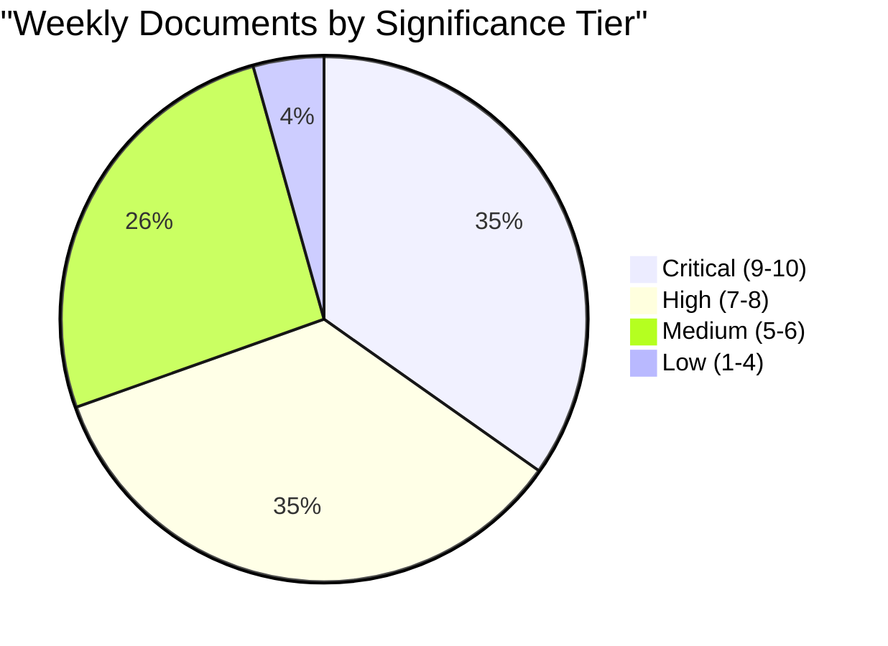

# Significance Scoring — Weekly Review 2026-W16 (April 11–17)

**Generated**: 2026-04-18 09:15 UTC (AI-enhanced)
**Method**: Multi-dimensional AI scoring per ai-driven-analysis-guide.md v5.0
**Week**: 2026-W16 | **Riksmöte**: 2025/26

---

## Scoring Matrix

| Dok_ID | Title | Policy Impact | Election Relevance | Public Salience | Legislative Advance | Intl/Constit | **Total** |
|--------|-------|:---:|:---:|:---:|:---:|:---:|:---:|
| HD03100 | Vårproposition 2026 | 2 | 2 | 2 | 2 | 1 | **10/10** |
| HD0399 | Vårändringsbudget 2026 | 2 | 2 | 2 | 2 | 0 | **9/10** |
| HD03236 | Extra ändringsbudget: Drivmedel + el/gas | 2 | 2 | 2 | 1 | 0 | **9/10** |
| HD03231 | Ukraine Aggression Tribunal | 1 | 2 | 2 | 2 | 2 | **9/10** |
| HD03232 | Ukraine Damages Commission | 1 | 2 | 2 | 2 | 2 | **9/10** |
| HD03246 | Stricter rules: Young offenders | 2 | 2 | 2 | 2 | 0 | **9/10** |
| HD01SfU22 | Inhibition order system: Deportation | 2 | 2 | 2 | 2 | 1 | **9/10** |
| HD01UFöU3 | NATO eFP Finland: 1,200 troops | 2 | 1 | 2 | 2 | 2 | **9/10** |
| JuU15 | 145–142 Vote on criminal justice | 1 | 2 | 1 | 2 | 0 | **8/10** |
| HD03240 | New Electricity System Laws | 2 | 1 | 2 | 2 | 1 | **8/10** |
| HD03239 | Wind Power in Municipalities | 2 | 1 | 1 | 2 | 1 | **7/10** |
| HD01CU28 | National Bostadsrätt Register | 1 | 1 | 2 | 2 | 0 | **7/10** |
| HD03238 | New Environmental Review Agency | 2 | 1 | 1 | 2 | 1 | **7/10** |
| HD03242 | Active Forestry Framework | 2 | 1 | 1 | 2 | 1 | **7/10** |
| HD01KU32 | Const. amendment: Media accessibility | 1 | 1 | 1 | 2 | 2 | **7/10** |
| HD01KU33 | Const. amendment: Search records | 1 | 1 | 1 | 2 | 2 | **7/10** |
| HD03244 | Interoperability: Public sector data | 1 | 0 | 1 | 2 | 1 | **6/10** |
| HD01CU22 | Guardianship reform | 1 | 1 | 1 | 2 | 0 | **6/10** |
| HD01CU27 | Identity: Land registration | 1 | 1 | 1 | 2 | 0 | **6/10** |
| HD01MJU19 | Waste/recycling reform | 1 | 0 | 1 | 2 | 1 | **6/10** |
| HD01SkU23 | EV charging tax exemption | 1 | 1 | 1 | 2 | 0 | **6/10** |
| HD03245 | Strategy: Violence against women | 2 | 1 | 2 | 0 | 0 | **6/10** |
| HD01TU16 | Remove driving intro course | 0 | 0 | 1 | 2 | 0 | **4/10** |

**Scoring dimensions** (0-2 each):
- **Policy Impact**: Direct legislative/regulatory change to Swedish law
- **Election Relevance**: Relevance to Sept 2026 campaign narratives
- **Public Salience**: Media attention and voter interest expected
- **Legislative Advance**: Stage of legislative process (tabled=1, approved=2)
- **International/Constitutional**: Cross-border or constitutional significance

---

## Weekly Significance Distribution

**Average Week 16 Significance: 7.5/10** — Exceptional (top 5% of parliamentary weeks)

---

## Highest-Impact Policy Cluster: Spring Fiscal Package

The spring fiscal trilogy (HD03100 + HD0399 + HD03236) represents coordinated pre-election economic positioning:
- **Vårproposition** frames economic recovery narrative (0.82% GDP growth 2024)
- **Spring Amendment Budget** adjusts actual expenditures
- **Extra Amendment Budget** cuts fuel taxes — direct voter benefit ahead of election
- Combined electoral risk: HIGH for opposition (difficult to oppose fuel tax cuts)
- Sweden unemployment at 8.7% (2025) provides opposition ammunition on structural issues

---

## Election 2026 Significance Index

| Policy Area | Election Impact | Swing Voter Relevance | Campaign Ready |
|-------------|:---:|:---:|:---:|
| Fiscal (budget/tax) | 🔴 CRITICAL | ⭐⭐⭐⭐⭐ | ✅ Yes |
| Criminal justice | 🔴 HIGH | ⭐⭐⭐⭐ | ✅ Yes |
| Migration | 🔴 HIGH | ⭐⭐⭐⭐ | ✅ Yes |
| Defense/NATO | 🟠 MEDIUM | ⭐⭐⭐ | ✅ Yes |
| Energy/environment | 🟠 MEDIUM | ⭐⭐⭐ | ⚠️ Contested |
| Housing | 🟡 LOW-MEDIUM | ⭐⭐ | 🔄 Developing |
