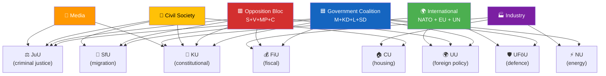

# 👥 Stakeholder Perspectives — Riksdag Week 16, 2026

| Field | Value |
|-------|-------|
| **STK-ID** | STK-2026-W16 |
| **Period** | 2026-04-11 — 2026-04-17 |
| **Methodology** | `analysis/methodologies/political-style-guide.md` (6-lens stakeholder analysis) + Election 2026 implication grid |
| **Stakeholder Lenses** | 6 — Government coalition · Parliamentary opposition · Civil society / general public · International / EU / NATO · Industry & business · Media & investigative journalism |
| **Confidence Scale** | ⬛ VL · 🟥 L · 🟧 M · 🟩 H · 🟦 VH |

---

## 🎯 Six-Lens Stakeholder Matrix

| Lens | Top Concern Week 16 | Top Action / Posture | Confidence |
|------|---------------------|---------------------|:----------:|
| 🟦 **Government coalition (M+KD+L) + SD** | Execute fiscal trilogy + JuU15 + KU + Ukraine package without coalition fracture | Sequencing discipline, narrative co-ordination, Lagrådet engagement | 🟦 VH |
| 🟥 **Parliamentary opposition (S, V, MP, C)** | Counter-budget, KU33 critique, migration counter-motions, climate framing | S budget presentation; V/MP attentive-voter mobilisation; C swing positioning; ECHR predicate | 🟦 VH |
| 👥 **Civil society / general public** | Cost-of-living, security, women's-violence services, regional services | Demand for relief; concern over R1 hybrid; vigilance on KU33 | 🟩 H |
| 🌍 **International / EU / NATO / Ukraine** | Sweden's eFP operationalisation; Council-of-Europe tribunal architecture | Coordinated tribunal advocacy; NATO operational integration | 🟦 VH |
| 🏭 **Industry & business** | Energy-system reform; forestry framework; bostadsregister; AML compliance; police-recruitment investment | Compliance preparation; investment alignment with HD03240 + HD03242; AML costs absorbed | 🟩 H |
| 📰 **Media & investigative journalism** | KU33 chilling-effect risk; cross-cluster rhetorical exposure; election-cycle disinformation pressure | Press-freedom NGO coordination; verification-discipline against T1 | 🟦 VH |

---

## 🟦 Lens 1 — Government Coalition (M+KD+L) + SD Parliamentary Support

### Stakeholder Map

| Actor | Role | Position Week 16 | Election 2026 Stake |
|-------|------|------------------|---------------------|
| **Ulf Kristersson** (M, PM) | Government leader, package signatory | Personally tabled fiscal trilogy + Ukraine architecture | Owns economic-stewardship narrative; Nuremberg framing for SD-friction prevention |
| **Elisabeth Svantesson** (M, FM) | Vårproposition author | Fiscal credibility custodian; defended Nordic-GDP gap with stimulus framing | Q3 2026 macro = Sep verdict |
| **Maria Malmer Stenergard** (M, FM) | Tribunal architect | Norm-entrepreneurship voice 2026-04-16 | Norm-leadership capital |
| **Gunnar Strömmer** (M, JM) | KU33 + JuU15 owner | Defines "formellt tillförd bevisning"; juvenile-offender execution | Legacy on rule-of-law definition |
| **Pål Jonson** (M, DM) | NATO eFP owner | Försvarsmakten operational owner | First-NATO-deployment legacy |
| **Ebba Busch** (KD, party leader, EM) | Coalition partner | Energy / law-and-order alignment | Coalition continuity stake |
| **Johan Pehrson** (L, party leader, AM) | Coalition partner | KU33 + migration trio identity strain | Liberal brand under pressure |
| **Jimmie Åkesson** (SD, leader) | Parliamentary support | 145-142 leverage; migration-trio political owner | Cabinet-entry post-Sep ambition |

### Key Documents Cited

`HD03100` · `HD0399` · `HD03236` · `HD03246` · `HD01KU32` · `HD01KU33` · `HD03231` · `HD03232` · `HD01UFöU3` · `HD01SfU22` · `HD03240`

### Election 2026 Lens

Coalition will run on a **four-pillar platform**: economic-stewardship (fiscal trilogy + macro execution), law-and-order (JuU15 + police-training HD03237), national security (NATO eFP + Ukraine architecture), migration tightening (SfU22 + Prop 235/229). Vulnerable on Nordic-GDP gap, climate self-contradiction, and L-party identity strain. `[HIGH]`

---

## 🟥 Lens 2 — Parliamentary Opposition (S, V, MP, C)

### Stakeholder Map

| Actor | Role | Position Week 16 | Election 2026 Stake |
|-------|------|------------------|---------------------|
| **Magdalena Andersson** (S, leader) | Opposition leader | Counter-budget arithmetic; KU33 position decisive variable | PM-candidate; coalition arithmetic owner |
| **Mikael Damberg** (S, finance spokesman) | Counter-budget architect | Cost-of-living narrative + Nordic-GDP-gap framing | Economic credibility duel with Svantesson |
| **Nooshi Dadgostar** (V, leader) | V leader | Against migration trio + KU33 + budget | Attentive-voter mobilisation 0.5–1.5 pp on KU33 |
| **Daniel Helldén** (MP, språkrör) | MP leader | Grundlag-protection advocate; climate-credibility critic | Green-vote ceiling expansion via fuel-tax-cut critique |
| **Muharrem Demirok** (C, leader) | Centre-bloc swing | Migration counter-motion architect | Survival via differentiation |
| **Märta Stenevi** (MP, språkrör) | MP leader | Co-leader on climate + KU33 | MP coalition leverage |

### Counter-Strategies This Week

- **S**: Counter-budget published 2026-04-18 (HD024098 motion class) emphasising Nordic-GDP gap, employment, welfare investment
- **V**: Sharp KU33 critique; structural opposition to migration trio; demand for Strasbourg challenge
- **MP**: Fuel-tax-cut climate critique; coalition with V on KU33; constructive engagement on Electricity System Act
- **C**: Migration counter-motion (with V + MP); own budget alternative; KU33 cross-party negotiation posture

### Election 2026 Lens

Opposition contests on **cost-of-living + climate + civil-rights**. S best-positioned to claim cost-of-living; V/MP attentive-voter mobilisation on KU33 + migration; C survives via differentiation from both blocs. Key risk: opposition fragmentation prevents single PM-alternative narrative. `[HIGH]`

---

## 👥 Lens 3 — Civil Society / General Public

### Concerns Mapped to Documents

| Public Concern | Top Document(s) | Direction |
|---------------|----------------|:---------:|
| Cost of living (fuel, electricity, food) | HD03236, HD0399, HD03100 | 🟢 Relief |
| Crime + safety | HD03246, HD03237, HD01CU27 | 🟢 Tightening |
| Women's violence services | HD03245, HD10438 | 🟡 Policy + funding gap |
| Press freedom + transparency | HD01KU33, HD01KU32 | 🟡 Mixed |
| Migration / asylum-seeker rights | HD01SfU22, Prop 235, Prop 229 | 🔴 Tightening |
| Climate + energy | HD03240, HD03239, HD03236, HD03242 | 🟡 Mixed |
| Housing market integrity | HD01CU27, HD01CU28 | 🟢 Improvement |
| Regional service equity | HD11718 (Skåne), HD11719 | 🔴 Concern |
| National security | HD01UFöU3, HD03231 | 🟢 Strengthening |

### Civil-Society Voices

- **Press-freedom NGOs** (SJF, TU, Utgivarna): joint statement on KU33 expected Q2 2026
- **Domestic-violence shelters** (Roks, Unizon): HD10438 interpellation reflects funding stress
- **Refugee-rights NGOs**: V/C/MP migration counter-motions echo their concerns
- **Climate / environmental NGOs** (Naturskyddsföreningen, KPR): fuel-tax-cut critique
- **Lantmäteriet citizen-impact**: bostadsregister change affects ~2 M bostadsrätter holders

### Election 2026 Lens

Public salience: cost-of-living > brott + ordning > försvar/Ukraina > klimat > migration > grundlag. KU33 only enters top-5 if a chilling-effect case breaks before Sep 2026. `[HIGH]`

---

## 🌍 Lens 4 — International / EU / NATO / Ukraine

### Stakeholder Map

| Actor | Role | Position Week 16 |
|-------|------|------------------|
| **Volodymyr Zelensky** (Ukraine) | Hague Convention Dec 2025 co-signatory | Tribunal political guarantor |
| **NATO HQ + Allied Command** | NATO eFP framework | Welcomes Sweden Bn-task-group as full-spectrum operational integration |
| **Council of Europe** | Tribunal framework | Founding-member processing for HD03231 |
| **Euroclear / Russian assets venues** | Reparations architecture | EUR 260 B immobilised — operational base for HD03232 |
| **EU Commission** | EAA implementation oversight (KU32) | Welcomes grundlag entrenchment |
| **UNHCR Sweden country office** | Migration-trio scrutiny | Concerns to be reflected in country report |
| **Russia (adversarial)** | Tribunal target + NATO opponent | Hybrid-response posture |
| **Nordic peers (DK, NO, FI)** | Comparative reference | DK fiscal stewardship benchmark; FI hybrid-response template; NO statutory-trigger model for KU33 |

### Election 2026 Lens

International reception of Sweden's Ukraine + NATO + grundlag posture is uniformly positive within EU/NATO; Russia + adversarial actors contribute to T1 risk. Cross-party Ukraine consensus precludes effective opposition exploitation; international dimension of campaign therefore **dampened relative to domestic dimensions**. `[HIGH]`

---

## 🏭 Lens 5 — Industry & Business

| Sector | Document Impact | Action |
|--------|----------------|--------|
| Energy (utilities, grid) | HD03240 (Electricity System Act) | Investment alignment for smart-grid + storage |
| Renewable energy | HD03239 (wind power municipal) | Re-engage stalled projects |
| Forestry | HD03242 (active forestry framework) | Resume deferred capital allocation |
| Telecom | HD03244 (interoperability) + HD03233 (anti-fraud) | Compliance + EU alignment |
| Fuel retail / logistics | HD03236 (fuel-tax cut) | Pricing pass-through; demand-side response |
| Real estate / housing | HD01CU27 + HD01CU28 + HD01CU22 | AML controls + register-data feed integration |
| Defence industry (Saab, BAE, etc.) | HD01UFöU3 + försvarsanslag | Operational support contracts |
| Police / public sector | HD03237 (paid police training) | Recruitment ramp-up |
| Banking & financial services | HD01CU27 (AML) | Onboarding-process update |

### Election 2026 Lens

Industry generally welcomes the stability of legislative pipeline; concerns on (a) climate signal coherence (HD03236 vs HD03240); (b) implementation timeline for housing register; (c) AML compliance burden. **No major industry actor opposes the package as a whole** — indicating coordinated stakeholder consultation in advance. `[HIGH]`

---

## 📰 Lens 6 — Media & Investigative Journalism

### Concerns

| Concern | Document(s) | Severity |
|---------|------------|:--------:|
| KU33 chilling effect on source-protection | HD01KU33 | 🟠 HIGH (decadal) |
| Cross-cluster rhetorical exposure (press-freedom-abroad-vs-home) | HD03231 + HD01KU33 juxtaposition | 🟠 HIGH (campaign cycle) |
| Election-cycle disinformation pressure (T1 vector) | T1 (threat-analysis.md) | 🔴 CRITICAL (continuous) |
| FOIA/offentlighet workflow disruption | HD01KU33 | 🟠 HIGH |
| Journalist-source confidentiality | HD01KU33 + JuU15 | 🟠 HIGH |

### Press-Freedom NGO Coordination

- **SJF (Svenska Journalistförbundet)**: prepares remissvar on KU33 + statutory-clarity demand
- **TU (Tidningsutgivarna)**: industry-association joint statement
- **Utgivarna**: editorial-independence platform
- **RSF + Freedom House**: international index implications

### Election 2026 Lens

Investigative journalism becomes a **double resource**: (a) the operational instrument for accountability through the campaign; (b) the *target* of disinformation under T1 vector. Newsroom resilience programmes + civil-society partnerships are critical defensive infrastructure. `[VERY HIGH]`

---

## 🌐 Influence-Network Map

---

## 🗳️ Election 2026 Implications by Stakeholder

| Stakeholder | Key Election Move | Decisive Window |
|-------------|------------------|:---------------:|
| Government | Fiscal-stewardship + JuU15 + NATO + Ukraine campaign messaging | 2026-Q2/Q3 (macro-data lock-in) |
| S | Counter-budget definition + KU33 second-reading position | 2026-Q3 (manifesto lock-in) |
| V | Single-issue mobilisation on KU33 + migration | Continuous |
| MP | Climate-credibility framing + KU33 alliance with V | Continuous |
| C | Centre-positioning + survival messaging | 2026-Q3 (poll trajectory) |
| SD | Migration-delivery showcase + Cabinet-entry signalling | Continuous |
| Civil society | Cost-of-living, services protection, KU33 vigilance | Continuous |
| International | EU/NATO solidarity in early Q3 if Russian hybrid event | Event-driven |
| Industry | Investment-stability messaging | 2026-Q2/Q3 |
| Media | Election-disinformation defensive operations | 2026-Q3 (campaign peak) |

---

## 📎 Cross-References

- [`synthesis-summary.md`](synthesis-summary.md) §Cross-Party Vote Matrix maps party-by-document positions
- [`swot-analysis.md`](swot-analysis.md) §Stakeholder SWOT compresses these perspectives into 4-quadrant grid
- [`risk-assessment.md`](risk-assessment.md) §R1 + §R3 = key civil-society + media risks
- [`scenario-analysis.md`](scenario-analysis.md) §Coalition Scenarios use stakeholder positions as scenario inputs
- [`comparative-international.md`](comparative-international.md) §Nordic engagement maps international stakeholder positions

---

**Classification**: Public · **Next Review**: 2026-04-25 · **Methodology**: 6-lens stakeholder analysis (`political-style-guide.md`) + Election 2026 implication grid (`ai-driven-analysis-guide.md` v5.1 §Rule 5 Election lens)
