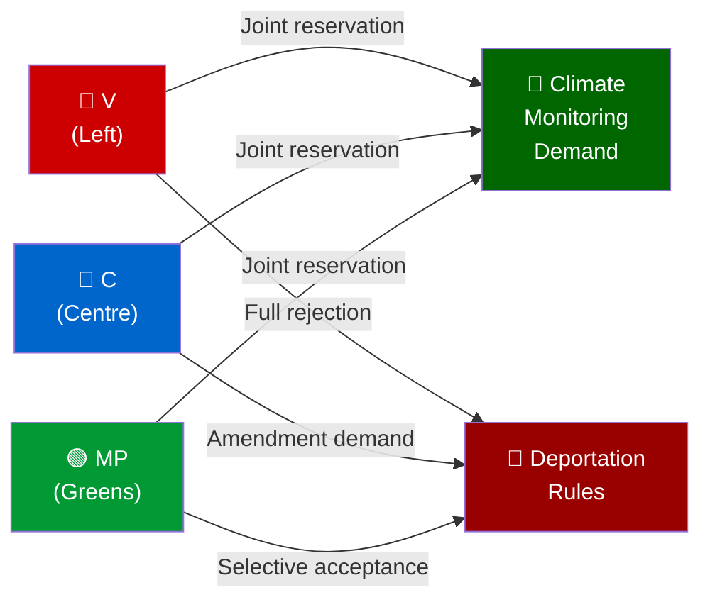

# SWOT Analysis — Week 16 (2026-04-11 to 2026-04-17)

**Generated**: 2026-04-18 09:16 UTC (AI-enhanced, 5 stakeholder perspectives)
**Context**: Swedish parliamentary weekly review — Spring Budget Week
**Framework**: Political SWOT with Election 2026 lens

---

## Condensed SWOT: Government (M+KD+L+SD Coalition)

### 🟩 STRENGTHS
1. **Fiscal narrative control**: Spring budget package positions Kristersson as economic manager (0.82% recovery after 2023 contraction)
2. **Security/defense leadership**: Ukraine tribunal + NATO Finland contribution signals strong Western alignment
3. **Criminal justice delivery**: Prop. 246 (youth crime) delivers on Tidöavtalet promise — tangible governance record
4. **Energy agenda**: Electricity system reform + wind power revenue sharing positions Sweden as green transition leader
5. **Housing reform**: National bostadsrätt register + identity requirements show competent property market regulation

### 🟥 WEAKNESSES
1. **Fragile majority**: JuU15 won by only 3 votes (145–142) — any defection could cause defeat
2. **Unemployment exposure**: 8.7% unemployment (2025) undermines economic success narrative
3. **Migration backlash risk**: Inhibition orders and tougher deportation rules attract coordinated three-party opposition (V+C+MP)
4. **Constitutional amendment timing**: First-reading constitutional changes (KU32, KU33) require second vote after Sept election — creates legislative uncertainty if government changes
5. **Fuel tax cut credibility gap**: Extra Amendment Budget cuts fuel taxes while simultaneously promoting green transition

### 🟧 OPPORTUNITIES
1. **Pre-election stimulus**: Fuel tax and energy price support directly benefits voters ahead of September election
2. **Ukraine leadership**: Joining tribunal and damages commission positions Sweden as principled NATO ally — differentiates from before-2022 neutrality
3. **Forestry deregulation**: New framework for active forestry could win rural and business votes
4. **Law and order closing argument**: Criminal justice package (youth crime + deportation) closes with SD-friendly messaging while satisfying M base

### 🟪 THREATS
1. **SD dependency risk**: Coalition survives only because SD votes with government — any SD defection breaks majority
2. **Opposition coordination**: S, V, MP, C filed simultaneous counter-motions on multiple propositions — signals coordinated campaign strategy
3. **Economic reversal risk**: If GDP stalls or unemployment rises further, fiscal package appears desperate rather than decisive
4. **Climate credibility**: V+C+MP joint reservation on climate monitoring (MJU20) signals future coalition negotiations will demand stronger climate commitments

---

## Stakeholder Perspective Analysis (5 Perspectives)

### 1. Socialdemokraterna (S) — Perspective
**Position**: OPPOSITION — Constructive on some reforms, resistant on fiscal/migration
**Key stance Week 16**:
- Filed 4 simultaneous counter-motions on migration, healthcare, energy, housing
- On Extra Amendment Budget: Demands government "return to Riksdag" with proper analysis before cutting fuel taxes
- On deportation inhibition orders: Supports stricter enforcement but questions implementation safeguards
- **Election strategy**: Position as fiscal responsibility alternative — "we would invest in welfare, not fuel tax cuts"
- **Strengths**: 94 seats — largest opposition party; economic credibility with unions
- **Vulnerabilities**: Cannot form majority without SD (unacceptable) or C+L (moving rightward)

### 2. Vänsterpartiet (V) — Perspective
**Position**: OPPOSITION — Full rejection across criminal justice, migration, arms export
**Key stance Week 16**:
- Filed motions against: deportation rules (mot. 4090), fuel tax cuts (mot. 4092), arms export regulations (mot. 4091)
- Opposes inhibition orders as undermining asylum rights and proportionality
- Joint V+C+MP reservation on climate monitoring (MJU20) — unusual cross-bloc alliance
- **Election strategy**: Clear left alternative — differentiate from S on progressive issues
- **Vulnerabilities**: Small base (24 seats), risk of being squeezed by S

### 3. Centerpartiet (C) — Perspective
**Position**: SELECTIVE OPPOSITION — Amendment-seeking, not wholesale rejection
**Key stance Week 16**:
- C counter-motions on deportation rules demand "systematic repeated crimes" threshold before deportation
- C motion on cybersecurity center (mot. 4093) demands more analysis
- C motion on new reception law (mot. 4089) protects municipal emergency assistance powers
- Consumer credit motion (mot. 4088) targets bank interest penalty charges
- C joins V+MP on climate monitoring joint reservation
- **Election strategy**: Occupy "reasonable center" — reform-minded but rights-protective
- **Vulnerabilities**: C-M relationship tense; wind energy revenue sharing (Prop. 239) may appeal to rural C voters

### 4. Sverigedemokraterna (SD) — Perspective
**Position**: GOVERNMENT SUPPORT — Critical enabler of all legislative victories
**Key stance Week 16**:
- Voted with government on JuU15 (criminal justice) — 73 votes contributing to 145-142 margin
- SD interpellations on mosque hate speech and free speech protection (HD10429, HD10430) signal internal base management
- SD benefits from: deportation hardening, youth crime crackdown, NATO military commitment
- **Election strategy**: Claim credit for Tidöavtalet delivery — position as indispensable governing partner
- **Vulnerabilities**: If perceived as "just supporting M agenda" without distinct SD wins, base may fragment to NSD/AfS

### 5. Miljöpartiet (MP) — Perspective
**Position**: OPPOSITION — Green transition advocates; selective constitutional sophistication
**Key stance Week 16**:
- Filed motion against fuel tax cuts (mot. 4098) — pure green position
- MP motion on deportation (mot. 4097) accepts proportionate provisions but rejects broad expansion — shows legal nuance
- MP motion on arms exports (mot. 4096) demands prohibition on exports to dictatorships and warring states
- MP motion on new reception law (mot. 4087) wants integration-promoting asylum housing
- Joint V+C+MP reservation on climate monitoring
- **Election strategy**: Green credibility + human rights positioning — target progressive urbanites
- **Vulnerabilities**: Currently below Riksdag threshold in polls; needs to consolidate green vote against S left flank

---

## Cross-Bloc Dynamics: Unusual Alliances Week 16

**Significance**: V+C+MP joint action on climate monitoring is the week's most unusual cross-bloc alliance — Centre joining forces with Left and Greens signals that environmental accountability is a credible future coalition glue.
