# 💪 SWOT Analysis — Riksdag Week 16, 2026

| Field | Value |
|-------|-------|
| **SWOT-ID** | SWOT-2026-W16 |
| **Period** | 2026-04-11 — 2026-04-17 |
| **Methodology** | `analysis/methodologies/political-swot-framework.md` v3.0 (TOWS interference + scenario branching + cross-bloc evaluation) |
| **Stakeholder Lenses** | Government coalition (M+KD+L) + parliamentary support (SD); Opposition blocs (S; V; MP; C); Civil society / general public — **6 distinct perspectives** |
| **Confidence Scale** | ⬛ VERY LOW · 🟥 LOW · 🟧 MEDIUM · 🟩 HIGH · 🟦 VERY HIGH |

---

## 🎯 Government Coalition SWOT (M + KD + L + SD parliamentary support)

### 🟢 Strengths

| # | Strength | Evidence (dok_id) | Confidence |
|---|----------|-------------------|:----------:|
| **S1** | **Tidö working majority operationally validated** — JuU15 vote 145–142, pure bloc, zero defections | JuU15 voteringsregister 2026-04-15; HD03246 | 🟦 VERY HIGH |
| **S2** | **Comprehensive legislative agenda execution** — fiscal trilogy + criminal-justice + migration + foreign-policy + energy delivered in single week | HD03100/0399/236; HD03246; SfU22; HD03231; HD03240 | 🟦 VERY HIGH |
| **S3** | **NATO operational integration** — first major Försvarsmakten deployment under eFP (1,200 troops to Finland); shifts from accession to operational posture | HD01UFöU3; UFöU committee record; Försvarsmakten timeline | 🟦 VERY HIGH |
| **S4** | **Cross-party Ukraine consensus** — tribunal + reparations propositions enjoy near-universal support (~349 MPs); pre-empts SD/domestic opposition via Nuremberg framing | HD03231; HD03232; FM Stenergard verbatim 2026-04-16 | 🟦 VERY HIGH |
| **S5** | **Cost-of-living relief instrument** — fuel-tax cut (82 öre) + el/gas relief responds to most-cited voter pain point | HD03236; KI Konjunkturinstitutet 2026-Q1 | 🟩 HIGH |
| **S6** | **Constitutional reform credibility** — KU advancing both KU32 (rights-positive accessibility) + KU33 (investigative integrity) at first reading shows constitutional craftsmanship capacity | HD01KU32; HD01KU33; KU committee record | 🟩 HIGH |

### 🟡 Weaknesses

| # | Weakness | Evidence | Confidence |
|---|----------|----------|:----------:|
| **W1** | **Razor-thin majority** — 3-vote margin (145-142) in JuU15 = no slack for further close votes; one defection ⇒ government loses | JuU15 protokoll | 🟦 VERY HIGH |
| **W2** | **Sweden underperforms Nordic peers** on growth — 0.82 % 2024 vs Denmark 3.5 %, Norway 2.1 % (World Bank); narrative vulnerability | `economic-data.json`; World Bank GDP series | 🟦 VERY HIGH |
| **W3** | **Unemployment at 8.7 % 2025** — highest since pandemic; structural challenge undermines fiscal-success framing | `economic-data.json`; SCB AKU | 🟦 VERY HIGH |
| **W4** | **Rhetorical self-contradiction** — fuel-tax cut (HD03236) undercuts simultaneous green-transition narrative (HD03240 + HD03239); MP/V exploit-ready | HD03236 + HD03240 + HD03239 juxtaposition; Klimatpolitiska rådet 2025 | 🟩 HIGH |
| **W5** | **Press-freedom-abroad-vs-home contradiction** — championing Nuremberg accountability (HD03231) while narrowing TF at home (HD01KU33) | TOWS S4 × T1; opposition rhetoric library | 🟩 HIGH |
| **W6** | **L-party identity strain** under migration trio (SfU22 + 235 + 229) — Pehrson must defend liberal brand vs SD-driven tightening | SfU committee record; L party programme | 🟧 MEDIUM |

### 🔵 Opportunities

| # | Opportunity | Evidence | Confidence |
|---|-------------|----------|:----------:|
| **O1** | **Norm-entrepreneurship dividend** from Ukraine tribunal — Sweden as Nordic accountability leader | HD03231; CoE framework | 🟩 HIGH |
| **O2** | **Coalition-stability narrative** if fiscal package executes without further close votes through Q2/Q3 | Voteringsregister; macro indicators | 🟩 HIGH |
| **O3** | **Cross-party constitutional statesmanship** if S endorses Norway-style statutory triggers in KU33 second reading | `comparative-international.md` §Nordic models | 🟧 MEDIUM |
| **O4** | **Energy modernisation legacy** — Electricity System Act (HD03240) + wind power (HD03239) lay foundation for 2030 100 % renewable target | HD03240; HD03239 | 🟦 VERY HIGH |
| **O5** | **Anti-money-laundering positioning** via housing reforms (HD01CU27 + HD01CU28) — international financial-integrity signalling | HD01CU27; HD01CU28; AMLD6 | 🟧 MEDIUM |
| **O6** | **Re-election platform consolidation** — fiscal + brott + ordning + försvar legislative blocks form coherent campaign architecture | HD03100; HD03246; HD01UFöU3 | 🟩 HIGH |

### 🔴 Threats

| # | Threat | Evidence | Confidence |
|---|--------|----------|:----------:|
| **T1** | **Russian hybrid retaliation** post-tribunal + NATO eFP — cyber, sabotage, disinformation, infrastructure harassment | SÄPO 2024 assessment; Baltic cable pattern; Finnish border instrumentalisation 2023–24 | 🟩 HIGH |
| **T2** | **KU33 narrow-interpretation entrenchment** — interpretive-frontier risk on "formellt tillförd bevisning"; chilling effect on investigative journalism | HD01KU33 betänkande; press-freedom NGO joint statement | 🟩 HIGH |
| **T3** | **Migration trio ECHR strike-down** — V/C/MP counter-motion text shows coordinated Strasbourg-litigation predicate | SfU22 + counter-motions; ECHR Article 8 + 13 | 🟩 HIGH |
| **T4** | **Coalition fracture under SD pressure** — 145-142 = SD as kingmaker on every paragraph; future close votes risky | JuU15 protokoll; SD parliamentary leverage | 🟧 MEDIUM |
| **T5** | **US tribunal non-cooperation** — undermines tribunal effectiveness and Swedish founding-member credibility | Public statements; ICC US history | 🟥 LOW |
| **T6** | **Climate-credibility erosion** — fuel-tax cut + activity-coupled forestry rules (HD03242) undermine green brand | HD03236; HD03242; Klimatpolitiska rådet | 🟩 HIGH |
| **T7** | **Q3 2026 macro shock** — fiscal stimulus fails to translate to measurable growth/employment improvement | KI prognos 2026-Q1; macro lag-time analysis | 🟧 MEDIUM |
| **T8** | **Lantmäteriet IT delivery slip** — bostadsregister (HD01CU28) Jan 2027 deadline at risk; political cost of delivery failure | Lantmäteriet capacity assessment | 🟧 MEDIUM |

---

## 🔁 TOWS Cross-Quadrant Interference Matrix

> **Doctrine** (per `political-swot-framework.md` v3.0): cross-quadrant interactions surface strategic centres of gravity that vanilla SWOT misses.

| Combination | Mechanism | Strategic Implication | Confidence |
|-------------|-----------|----------------------|:----------:|
| **S4 × T1** (Ukraine consensus × Russian retaliation) | Sweden's high-visibility Ukraine accountability push triggers proportional-or-greater hybrid response | Defensive posture (SÄPO/MSB) must match offensive norm-entrepreneurship; civil-society resilience programme priority | 🟩 HIGH |
| **S5 × W4** (cost-of-living relief × climate self-contradiction) | Fuel-tax cut serves voters but undermines climate brand; tension internal to coalition (M-KD comfort vs L unease) | Rhetorical management requires explicit transitional framing; opposition (MP/V) will exploit | 🟩 HIGH |
| **S2 × T4** (broad agenda × coalition fracture) | Wide legislative scope = many bilateral SD-deals; each deal creates new fracture risk | Sequencing discipline becomes critical post-145-142; controversial votes scheduled with maximum SD-buy-in | 🟦 VERY HIGH |
| **W5 × T2** (press-freedom contradiction × KU33 entrenchment) | Domestic narrowing while championing accountability abroad creates rhetorical exposure that compounds interpretive-frontier risk | Lagrådet engagement + statutory clarity in 2nd reading become strategic centre of gravity | 🟩 HIGH |
| **O1 × T1** (norm-entrepreneurship × Russian retaliation) | Bigger international leadership profile = bigger target; Finnish + Baltic precedent | Heightened security investment + EU/NATO solidarity diplomacy | 🟩 HIGH |
| **W1 × T4** (razor-thin majority × SD leverage) | Future SD-friction votes (especially anything tightening L's positions) may not pass | Government must secure SD-buy-in pre-vote; L may publicly distance to manage brand | 🟦 VERY HIGH |
| **O4 × W4** (energy modernisation × fuel-tax cut) | Genuine green policy under green-narrative pressure; Electricity System Act may be over-shadowed by fuel-tax-cut framing | Communications strategy needed to elevate HD03240 visibility | 🟧 MEDIUM |
| **S6 × O3** (constitutional craftsmanship × cross-party KU33) | KU advancing both KU32 + KU33 at first reading creates statesmanship moment; S could engage to negotiate stricter KU33 language | Government can offer S co-credit in exchange for second-reading buy-in | 🟧 MEDIUM |

**Strategic Centres of Gravity Identified by TOWS**:
1. **Sequencing of post-JuU15 close votes** (W1 × T4) — operational control variable
2. **KU33 interpretive language** (W5 × T2) — democratic-infrastructure variable
3. **Q3 2026 macro execution** (S5 × T7) — campaign-narrative variable
4. **Russian-hybrid response capacity** (S4 × T1; O1 × T1) — security variable

---

## 🌈 Stakeholder SWOT — 6 Distinct Perspectives

### 🟦 S — Socialdemokraterna (Magdalena Andersson)

| Quadrant | Top Item | Notes |
|----------|----------|-------|
| **S** | Cost-of-living + Nordic-GDP-gap critique armed with World Bank data | Counter-budget can frame fiscal-stewardship failure |
| **W** | Internal split on KU33 (gäng-agenda alignment vs press-freedom tradition) | Andersson personal position is decisive variable |
| **O** | Ukraine consensus participation = statesmanship credit; possible KU33 cross-party negotiation | Both available without giving up core identity |
| **T** | If KU33 second-reading strategy mishandled, alienates V/MP coalition partners post-Sep | Tactical care required |

### 🟥 V — Vänsterpartiet (Nooshi Dadgostar)

| Quadrant | Top Item | Notes |
|----------|----------|-------|
| **S** | Clear ideological position against migration trio + KU33 + fiscal package | Mobilises base efficiently |
| **W** | Limited coalition leverage; voter ceiling ~9-10 % | Dependent on S to operationalise positions |
| **O** | Attentive-voter mobilisation on KU33 (FRA-lagen 2008 precedent suggests 0.5-1.5 pp) | Single-issue framing possible |
| **T** | Russia's tribunal-retaliation narrative could divide V (anti-NATO faction vs accountability faction) | Internal management challenge |

### 🟢 C — Centerpartiet (Muharrem Demirok)

| Quadrant | Top Item | Notes |
|----------|----------|-------|
| **S** | Migration-counter-motion authority (rural / liberal voter coalition); fiscal alternatives credibility | Strategic position between blocs |
| **W** | Stuck below 5 % parliamentary threshold in some polls; existential risk | Must differentiate vs both blocs |
| **O** | KU33 cross-party leverage (could broker stricter language in second reading) | Statesmanship moment |
| **T** | If migration counter-motion fails Strasbourg, brand damaged | Litigation-risk exposure |

### 🟠 SD — Sverigedemokraterna (Jimmie Åkesson)

| Quadrant | Top Item | Notes |
|----------|----------|-------|
| **S** | Migration trio = direct policy delivery for SD-base; JuU15 145-142 confirms kingmaker leverage | Tidö-deal cashing in |
| **W** | No formal cabinet seats = limited credit-claiming on broad agenda | Wants more visible policy ownership |
| **O** | Further coalition leverage on next contentious vote; potentially Cabinet entry post-Sep | Strategic patience |
| **T** | If Russian hybrid escalation ⇒ campaign reframes to security ⇒ SD's traditional issue ownership questioned | Brand vulnerability |

### 🟢 MP — Miljöpartiet (Daniel Helldén)

| Quadrant | Top Item | Notes |
|----------|----------|-------|
| **S** | Unique green-credibility; KU33 + migration trio both align with MP identity | Voter-attentive items |
| **W** | Bloc dependency on S; ceiling ~6-7 %; no cabinet in 4 years | Operational constraints |
| **O** | Electricity System Act + wind-power municipal share offer climate-policy gains MP can claim | Constructive engagement |
| **T** | Russian hybrid-event reshapes campaign agenda away from climate | External shock risk |

### 👥 Civil Society / General Public

| Quadrant | Top Item | Notes |
|----------|----------|-------|
| **S** | Broad-based access to relief (fuel + el/gas + welfare); Ukrainian solidarity high; NATO membership consensus | Public legitimacy strong |
| **W** | Cost-of-living pain real (8.7 % unemp); regional inequality (sydöstra Skåne, HD11718); domestic-violence services strain (HD10438) | Distributional concerns |
| **O** | Bostadsregister + AML housing reforms could improve market integrity | Welfare-state modernisation |
| **T** | KU33 chilling effect could reduce investigative journalism; Russian hybrid could disrupt critical infrastructure | Institutional resilience risk |

---

## 🔁 Cross-Bloc Alliance Map (Mermaid)

```mermaid
graph TD
    GOV["🟦 Government<br/>M + KD + L<br/>(151 seats)"]
    SD["🟠 SD<br/>parliamentary support<br/>(73 seats)"]
    S["🟥 S<br/>opposition lead<br/>(108 seats)"]
    V["🟪 V<br/>(24 seats)"]
    MP["🟢 MP<br/>(18 seats)"]
    C["🟢 C<br/>swing<br/>(24 seats)"]

    UKRAINE["🌍 Ukraine package<br/>HD03231 + HD03232<br/>≈ 349 MPs"]
    NATO_eFP["🛡️ NATO eFP<br/>HD01UFöU3<br/>≈ 325 MPs"]
    JUU15["⚖️ JuU15<br/>HD03246<br/>145-142 (bloc vote)"]
    KU33["📜 KU33<br/>HD01KU33<br/>1st reading: gov + SD"]
    KU32["📜 KU32<br/>HD01KU32<br/>broad consensus"]
    MIGR["🛂 Migration trio<br/>SfU22 + Prop 235 + Prop 229<br/>gov + SD vs V + C + MP (counter-motions)"]
    BUDGET["💰 Spring Fiscal<br/>HD03100 + HD0399 + HD03236<br/>gov + SD vs S/V/MP/C own budgets"]
    ENERGY["⚡ Energy NU<br/>HD03240 + HD03239<br/>broad consensus"]

    GOV --> UKRAINE
    SD --> UKRAINE
    S --> UKRAINE
    V --> UKRAINE
    MP --> UKRAINE
    C --> UKRAINE

    GOV --> NATO_eFP
    SD --> NATO_eFP
    S --> NATO_eFP
    C --> NATO_eFP

    GOV --> JUU15
    SD --> JUU15

    GOV --> KU33
    SD --> KU33

    GOV --> KU32
    SD --> KU32
    S -.divided.-> KU32
    C --> KU32

    GOV --> MIGR
    SD --> MIGR
    V -.counter.-> MIGR
    C -.counter.-> MIGR
    MP -.counter.-> MIGR

    GOV --> BUDGET
    SD --> BUDGET

    GOV --> ENERGY
    SD --> ENERGY
    S --> ENERGY
    MP --> ENERGY
    C --> ENERGY

    style GOV fill:#0d6efd,color:#fff
    style SD fill:#fd7e14,color:#fff
    style S fill:#dc3545,color:#fff
    style V fill:#6f42c1,color:#fff
    style MP fill:#28a745,color:#fff
    style C fill:#20c997,color:#fff
    style UKRAINE fill:#28a745,color:#fff
    style NATO_eFP fill:#28a745,color:#fff
    style JUU15 fill:#dc3545,color:#fff
    style KU33 fill:#fd7e14,color:#fff
    style KU32 fill:#28a745,color:#fff
    style MIGR fill:#dc3545,color:#fff
    style BUDGET fill:#fd7e14,color:#fff
    style ENERGY fill:#28a745,color:#fff
```

---

## 🗳️ Election 2026 Implications (mandatory under Rules 5–6)

| Lens | Implication for Government Coalition | Implication for Opposition |
|------|-------------------------------------|----------------------------|
| **Electoral Impact** | Fiscal trilogy + JuU15 + NATO eFP form coherent campaign block; KU33 a manageable secondary risk | S best-positioned to capture cost-of-living; V/MP attentive-voter mobilisation on KU33; C-survival depends on differentiation |
| **Coalition Scenarios** | Continuity (P=0.50) preserves agenda; close-vote risk persists | S-led minority (P=0.35) plausible; S+V+MP (P=0.15) blocks KU33 second reading |
| **Voter Salience** | Cost-of-living + brott + ordning + försvar = government's selling deck | Climate + welfare + civil rights = opposition's deck |
| **Campaign Vulnerability** | Nordic-GDP gap + climate self-contradiction + cross-cluster tension | Universal-Ukraine consensus precludes effective opposition there |
| **Policy Legacy** | Fiscal annual + JuU15 4-year + KU33 decadal + NATO eFP strategic | Counter-motions establish opposition record but no immediate policy legacy |

---

## 📎 Cross-References

- [`synthesis-summary.md`](synthesis-summary.md) §Top-5 Findings + §TOWS Cross-Cluster Interference
- [`risk-assessment.md`](risk-assessment.md) §R1 + §R3 trace from T1 + T3 above
- [`scenario-analysis.md`](scenario-analysis.md) §Scenarios use these S/W/O/T as scenario inputs
- [`stakeholder-perspectives.md`](stakeholder-perspectives.md) expands the 6-perspective matrix
- [`comparative-international.md`](comparative-international.md) §Nordic models supports O3 + W2

---

**Classification**: Public · **Next Review**: 2026-04-25 · **Methodology**: `analysis/methodologies/political-swot-framework.md` v3.0 (TOWS + cross-bloc + scenario-branching)
