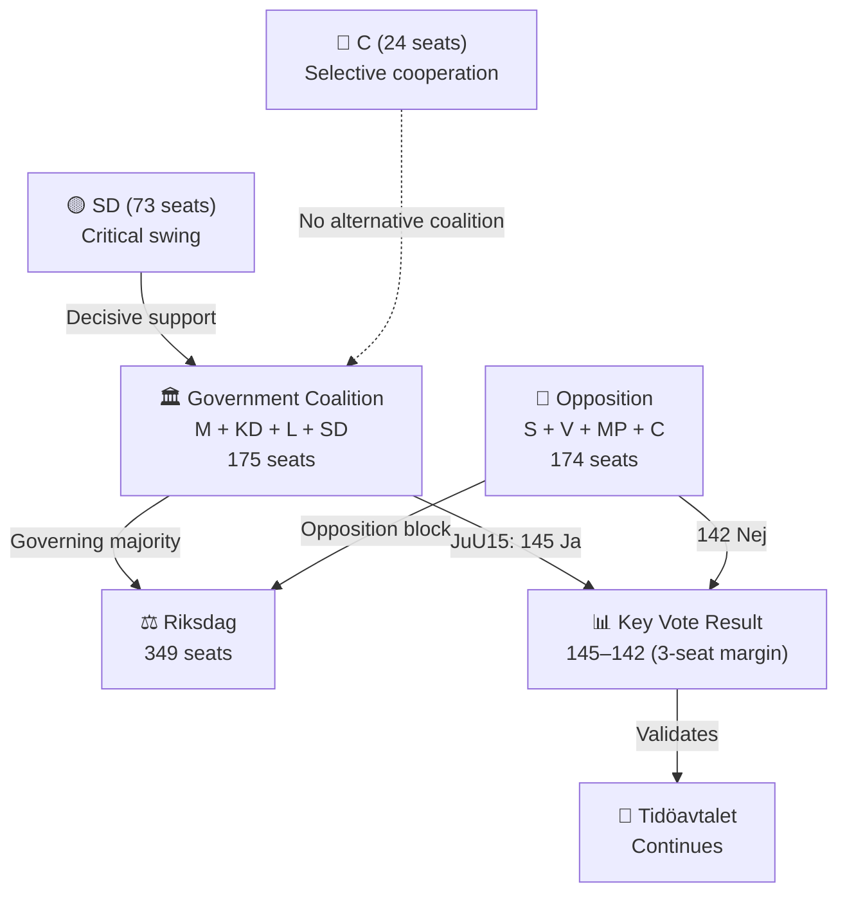

# Weekly Review Synthesis Summary — Week 16, 2026-04-11 to 2026-04-17

**Generated**: 2026-04-18 09:15 UTC (AI-enhanced, Pass 2)
**Period**: Monday 2026-04-11 – Friday 2026-04-17
**Week Label**: 2026-W16
**Riksmöte**: 2025/26
**Documents Analyzed**: 150+ across all daily article types
**Confidence**: HIGH 🟩
**Produced By**: AI-enhanced weekly review synthesis (news-weekly-review workflow)

---

## Executive Summary — The Spring Budget Week

Week 16 of 2026 was the **single most legislatively consequential week of the spring term**, defined by three interlocking developments that will shape Sweden's September 2026 election campaign:

1. **The Spring Fiscal Package**: Prime Minister Ulf Kristersson (M) delivered the government's defining economic statement — the 2026 Vårproposition (Spring Budget), Spring Amendment Budget, and a politically charged Extra Amendment Budget cutting fuel taxes. Against a backdrop of Sweden's 0.82% GDP growth in 2024 (recovering from -0.20% contraction in 2023) and elevated 8.7% unemployment (2025), this package constitutes the government's closing fiscal argument before voters.

2. **Ukraine Accountability Architecture**: Sweden took two landmark steps as a new NATO member — joining the Special Tribunal for the Crime of Aggression against Ukraine (Prop. 2025/26:231) and acceding to the International Damages Commission for Ukraine (Prop. 2025/26:232). These decisions cement Sweden's Western security alignment and close off any path to neutrality restoration.

3. **Migration and Criminal Justice Tightening**: The week saw unprecedented convergence of deportation reform (SfU22, Prop. 235), youth crime crackdown (Prop. 246), new reception law (Prop. 229), and tougher deportation rules contested by three opposition parties simultaneously.

### Key Vote: JuU15 — Razor-Thin Majority
The most consequential vote of the week (145 Ja / 142 Nej — a 3-vote margin) validated the Tidöavtalet coalition's narrow parliamentary mathematics. This was a pure government-vs-opposition split with zero cross-aisle voting.

---

## Week-in-Review: Top 5 Developments

| Rank | Development | Dok_ID | Significance | Confidence |
|------|-------------|--------|-------------|------------|
| 1 | Spring Budget Package (Vårproposition + amendments) | HD03100, HD0399, HD03236 | 10/10 | 🟦 VERY HIGH |
| 2 | Ukraine Accountability: Tribunal + Damages Commission | HD03231, HD03232 | 9/10 | 🟦 VERY HIGH |
| 3 | Youth Crime Crackdown (Stricter juvenile justice rules) | HD03246 | 9/10 | 🟩 HIGH |
| 4 | Migration Package: Inhibition orders + New reception law | HD01SfU22, HD03229 | 8/10 | 🟩 HIGH |
| 5 | NATO Enhanced Forward Presence: 1,200 troops to Finland | HD01UFöU3 | 8/10 | 🟩 HIGH |

---

## Legislative Outcomes Summary

### Bills/Propositions Tabled (Week 16)
- **HD03100** — 2026 Economic Spring Proposition (Vårproposition)
- **HD0399** — Spring Amendment Budget 2026
- **HD03236** — Extra Amendment Budget: Fuel tax cut + energy price support
- **HD03246** — Stricter rules for young offenders (Justitiedep.)
- **HD03242** — Clear rules for active forestry (Landsbygdsdep.)
- **HD03240** — New electricity system laws (Klimat- och näringsliv)
- **HD03239** — Wind power in municipalities: Revenue sharing law
- **HD03238** — New Environmental Review Agency (Klimat- och näringsliv)
- **HD03244** — Interoperability requirements for public sector data sharing
- **HD03233** — New rules against telecom fraud
- **HD03245** — National strategy: Men's violence against women

### Committee Reports Approved (Week 16)
- **HD01KU32** — Constitutional amendment: Accessibility requirements for media (first reading)
- **HD01KU33** — Constitutional amendment: Search/seizure records exemption (first reading)
- **HD01CU28** — National housing register for bostadsrätter ✅
- **HD01CU27** — Identity requirements for land registration + bostadsrätt anti-circumvention ✅
- **HD01CU22** — Legal guardianship (ställföreträdarskap) reform ✅
- **HD01SfU22** — New inhibition order system for deportation ✅
- **HD01TU16** — Removal of mandatory driving lesson introduction course ✅
- **HD01SkU23** — Permanent EV charging tax exemption at workplaces ✅
- **HD01MJU19** — Waste legislation reform for increased recycling ✅
- **HD01UFöU3** — Sweden contributes 1,200 troops to NATO eFP in Finland ✅

### Key Vote
- **JuU15 sakfrågan punkt 1** (2026-04-16 15:33): **145 Ja / 142 Nej** — Government won by 3 votes
  - Pure bloc vote: M+KD+L+SD vs S+V+MP+C
  - Confirms Tidöavtalet coalition's fragile but functional majority

---

## Committee Activity

| Committee | Documents | Policy Area | Activity Level |
|-----------|-----------|-------------|---------------|
| KU (Konstitutionsutskott) | 3 (KU32, KU33, KU44) | Constitutional amendments (first reading) | 🔴 HIGH |
| FiU (Finansutskott) | 3 (budget motions) | Spring budget opposition | 🔴 HIGH |
| SfU (Socialförsäkringsutskott) | 2 (SfU22, opposition motions) | Migration/deportation | 🔴 HIGH |
| CU (Civilutskott) | 3 (CU22, CU27, CU28) | Housing/property/guardianship | 🟠 MEDIUM-HIGH |
| MJU (Miljö- och jordbruksutskott) | 2 (MJU19, MJU20) | Environment/climate | 🟠 MEDIUM |
| TU (Trafikutskott) | 2 (TU16, TU19) | Transport regulation | 🟡 MEDIUM |
| UFöU (Utrikesutskott/Försvarsutskott) | 1 (UFöU3) | NATO/defense | 🔴 HIGH |
| SkU (Skatteutskott) | 2 (SkU23, SkU32) | Taxation | 🟡 MEDIUM |

---

## Political Dynamics: Power Balance Analysis

**Coalition Stability Assessment**: FUNCTIONAL but FRAGILE (4/10 risk of collapse before election)
- SD remains essential — without SD support no majority possible
- Opposition cannot form alternative majority (S needs either SD or C+L)
- JuU15 3-vote margin reveals no cushion for defections

---

## Article Decision: ✅ PUBLISH — Top-Priority Weekly Review
