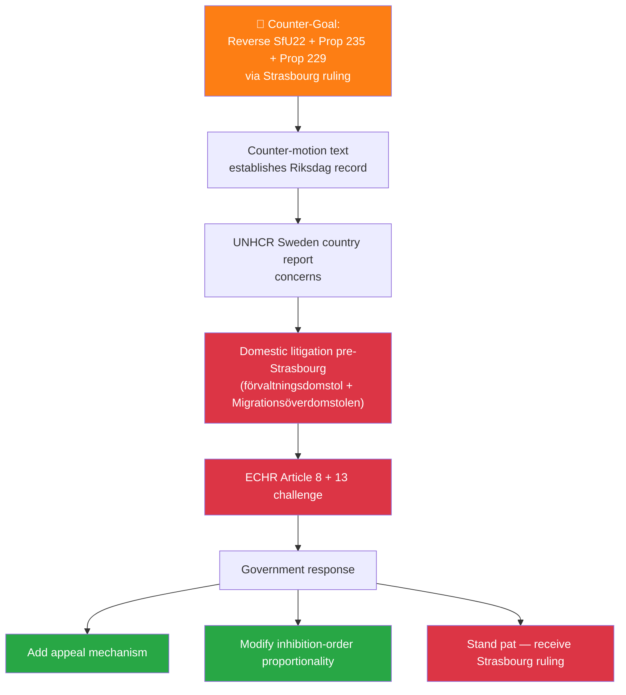

# 🛡️ Threat Analysis — Riksdag Week 16, 2026

| Field | Value |
|-------|-------|
| **THR-ID** | THR-2026-W16 |
| **Period** | 2026-04-11 — 2026-04-17 |
| **Methodology** | `analysis/methodologies/political-threat-framework.md` v2.0 (STRIDE · Attack Tree · Cyber Kill Chain · Diamond Model · Political Threat Taxonomy) |
| **Threat Inventory** | 3 priority vectors decomposed multi-framework + 4 watch-list |
| **Confidence Scale** | ⬛ VL · 🟥 L · 🟧 M · 🟩 H · 🟦 VH |

---

## 🎯 Three Priority Threat Vectors

| # | Vector | Severity | Confidence | Frameworks Applied |
|---|--------|:--------:|:----------:|--------------------|
| **T1** | **Russian hybrid retaliation** post-tribunal (HD03231) + NATO eFP (HD01UFöU3) | 🔴 CRITICAL | 🟩 HIGH | STRIDE + Cyber Kill Chain + Diamond Model |
| **T2** | **Constitutional accountability gap** — KU33 narrowing + opposition rhetorical exposure | 🟠 HIGH | 🟩 HIGH | Attack Tree + Political Threat Taxonomy |
| **T3** | **Migration-trio ECHR challenge** — V/C/MP coordinated litigation against SfU22 + Prop 235 + Prop 229 | 🟠 HIGH | 🟧 MEDIUM | Attack Tree + STRIDE on legal-process integrity |

---

## 🧨 T1 — Russian Hybrid Retaliation

### STRIDE Decomposition

| Letter | Threat Class | Manifestation in T1 | Severity |
|:------:|--------------|---------------------|:--------:|
| **S** | Spoofing | Disinformation impersonating Swedish government, parties, journalists — election-disinformation campaigns | 🔴 |
| **T** | Tampering | Cyber-intrusion of public-sector + critical-infrastructure systems (energy, water, hospitals) | 🔴 |
| **R** | Repudiation | Plausibly-deniable proxy operations (e.g. via third-country actors); attribution lag | 🟠 |
| **I** | Info Disclosure | Leak of classified materials to embarrass government or foment internal division | 🟠 |
| **D** | DoS | DDoS attacks on Riksdag, Försvarsmakten, Valmyndigheten, energy grid | 🟠 |
| **E** | Elevation of Privilege | Compromise of Försvarsmakten / SÄPO operational systems via supply-chain or credential attacks | 🔴 |

### Attack Tree

```mermaid
graph TD
    GOAL["🎯 Adversary Goal:<br/>Degrade Swedish capacity<br/>to support Ukraine + advance NATO eFP"]
    
    L1A["Cyber Operations"]
    L1B["Disinformation"]
    L1C["Physical / Sabotage"]
    L1D["Diplomatic / Hybrid Pressure"]

    GOAL --> L1A
    GOAL --> L1B
    GOAL --> L1C
    GOAL --> L1D

    L2A1["DDoS Riksdag/Valmyndigheten"]
    L2A2["Critical infra ransomware"]
    L2A3["Supply-chain compromise"]
    L2A4["Election-system probing"]
    L2B1["Election disinformation"]
    L2B2["Anti-tribunal narrative"]
    L2B3["Anti-NATO eFP narrative"]
    L2C1["Nordic cable sabotage"]
    L2C2["Critical-infra arson/vandalism"]
    L2C3["Embassy/diplomatic-staff harassment"]
    L2D1["Border instrumentalisation (migration)"]
    L2D2["Diplomatic protests"]
    L2D3["GRU proxy operations"]

    L1A --> L2A1
    L1A --> L2A2
    L1A --> L2A3
    L1A --> L2A4
    L1B --> L2B1
    L1B --> L2B2
    L1B --> L2B3
    L1C --> L2C1
    L1C --> L2C2
    L1C --> L2C3
    L1D --> L2D1
    L1D --> L2D2
    L1D --> L2D3

    style GOAL fill:#dc3545,color:#fff
    style L1A fill:#fd7e14,color:#fff
    style L1B fill:#fd7e14,color:#fff
    style L1C fill:#fd7e14,color:#fff
    style L1D fill:#fd7e14,color:#fff
    style L2A2 fill:#dc3545,color:#fff
    style L2C1 fill:#dc3545,color:#fff
    style L2D1 fill:#dc3545,color:#fff
    style L2B1 fill:#dc3545,color:#fff
```

### Cyber Kill Chain (Election-Disinformation Variant)

| Stage | Manifestation | Mitigation |
|-------|---------------|-----------|
| 1. Reconnaissance | Map Swedish political fault-lines (KU33 press-freedom, fuel-tax cut climate tension, migration trio) | OSINT defensive monitoring |
| 2. Weaponisation | Build deep-fake content; create amplification networks | MSB / SÄPO offensive intel |
| 3. Delivery | Social media + alternative-media seeding | Platform partnerships |
| 4. Exploitation | Trigger campaign narrative shift away from Sweden's chosen frames | Media-literacy programmes |
| 5. Installation | Establish persistent disinformation channels | Platform takedowns |
| 6. Command & Control | Coordinate amplification waves with offline events | Intel-sharing with Nordic-Baltic partners |
| 7. Actions on Objectives | Reduce coalition margins; suppress voter turnout in critical demographics | Civil-society resilience programmes |

### Diamond Model

| Vertex | Identification |
|--------|----------------|
| **Adversary** | GRU Unit 26165 (cyber); FSB (HUMINT + influence); Internet Research Agency successors (disinformation); proxy actors (RT, Sputnik successors) |
| **Capability** | Established cyber-offensive (NotPetya 2017, SolarWinds 2020, Viasat 2022); industrial-scale disinformation; demonstrated infrastructure-sabotage capacity (Nord Stream pipelines 2022 contested) |
| **Infrastructure** | C2 servers in third countries; social-media bot networks; insider-threat recruiters in diaspora communities |
| **Victim** | Swedish public sector + critical infrastructure + election integrity + civil-society confidence |

### Mitigation Status

| Mitigation | Owner | Status | Confidence |
|-----------|-------|:------:|:----------:|
| SÄPO threat-actor monitoring | SÄPO | 🟢 Active (heightened) | 🟦 VH |
| MSB civil-defence preparedness | MSB | 🟢 Active | 🟩 H |
| Critical-infrastructure hardening (NIS2) | Sektorsmyndigheter | 🟡 Implementation phase | 🟧 M |
| Election-infrastructure security | Valmyndigheten + SÄPO | 🟡 Pre-2026 hardening | 🟧 M |
| Nordic-Baltic intel sharing | NORDEFCO + NIC | 🟢 Operational | 🟩 H |
| Civil-society resilience programmes | MSB + Civil Defence Agency | 🟡 Underway | 🟧 M |
| Public information campaign (resilience) | MSB | 🟡 Planned for 2026 | 🟥 L |

### Source Attribution

- SÄPO Annual Open Threat Assessment 2024
- Försvarsmakten MUST quarterly briefings (open elements)
- Finnish SUPO threat assessment 2024 (instrumentalised migration analogue)
- Estonian KAPO + Lithuanian VSD periodic bulletins
- Hybrid CoE (Helsinki) — Russian sub-conventional operations dataset

---

## 🧨 T2 — Constitutional Accountability Gap (KU33 Narrowing)

### Attack Tree (Press-Freedom Erosion)

```mermaid
graph TD
    GOAL2["🎯 Threat Goal:<br/>Reduce investigative-journalism capacity<br/>over Swedish public sector"]
    
    A1["Statutory: KU33 narrowing"]
    A2["Interpretive drift over time"]
    A3["Cross-cluster rhetorical exposure"]
    A4["Chilling effect"]

    GOAL2 --> A1
    GOAL2 --> A2
    GOAL2 --> A3
    GOAL2 --> A4

    A1_1["First reading 2026-04-17 ✓"]
    A1_2["Lagrådet acceptance"]
    A1_3["Second reading post-Sep 2026"]
    A1_4["Entry into force 2027-01-01"]

    A2_1["Förvaltningsdomstol case-law trend"]
    A2_2["JO + KU silence"]
    A2_3["Ombudsman intervention failure"]

    A3_1["Government press-freedom-abroad credibility loss"]
    A3_2["Opposition rhetorical exploitation"]

    A4_1["Self-censorship by sources"]
    A4_2["Newsroom workflow chilling"]
    A4_3["RSF/FH index downgrade"]

    A1 --> A1_1
    A1 --> A1_2
    A1 --> A1_3
    A1 --> A1_4
    A2 --> A2_1
    A2 --> A2_2
    A2 --> A2_3
    A3 --> A3_1
    A3 --> A3_2
    A4 --> A4_1
    A4 --> A4_2
    A4 --> A4_3

    style GOAL2 fill:#fd7e14,color:#fff
    style A1 fill:#dc3545,color:#fff
    style A4 fill:#dc3545,color:#fff
    style A3 fill:#fd7e14,color:#fff
    style A1_1 fill:#28a745,color:#fff
    style A4_3 fill:#dc3545,color:#fff
```

### Political Threat Taxonomy Mapping

| Taxonomy Class | Match | Notes |
|----------------|:-----:|-------|
| Democratic-process integrity | ✅ | Press-freedom infrastructure compromise |
| Rule-of-law durability | ✅ | Grundlag narrowing without complete second-reading certainty |
| Civil-liberties baseline | ✅ | Investigative-journalism precondition |
| Electoral-process security | 🟨 partial | Indirect via campaign rhetoric reframing |

### Mitigation Status

| Mitigation | Owner | Status | Confidence |
|-----------|-------|:------:|:----------:|
| Lagrådet engagement | Justitiedepartementet | 🟢 Active | 🟦 VH |
| Press-freedom NGO coordination | SJF / TU / Utgivarna | 🟢 Active | 🟩 H |
| Statutory clarity in 2nd-reading amendment | KU + Justitiedepartementet | 🟡 Pending | 🟧 M |
| International benchmark adoption (Norway-style triggers) | KU | 🟡 Available, not adopted | 🟧 M |

### Source Attribution

- KU committee record HD01KU33
- Press-freedom NGO joint statement 2026-Q2 (forthcoming)
- RSF World Press Freedom Index 2025
- BVerfG Staatstrojaner ruling (1 BvR 2664/17, 2019) for comparative reasoning

---

## 🧨 T3 — Migration-Trio ECHR Challenge

### Attack Tree (Litigation Predicate)

### STRIDE on Legal-Process Integrity

| Letter | Concern | Mitigation |
|:------:|---------|-----------|
| **S** (Spoofing) | Misrepresentation of UNHCR or ECHR positions in domestic debate | Verbatim citation discipline |
| **T** (Tampering) | Procedural irregularities in inhibition-order issuance | JO + Justitiekanslern oversight |
| **R** (Repudiation) | Government denial of practice patterns | SfU + Regeringsförhör accountability |
| **I** (Info Disclosure) | Unauthorised release of asylum-seeker case data | DPO oversight per GDPR |
| **D** (DoS) | Court backlog in admissibility processing | Migrationsöverdomstolen capacity |
| **E** (Elev. Privilege) | Police authority over inhibition orders without judicial pre-review | Judicial-review compatibility text |

### Mitigation Status

| Mitigation | Owner | Status |
|-----------|-------|:------:|
| Government legal review | Justitiedepartementet | 🟢 Active |
| Appeal-mechanism build-out | Justitiedepartementet + SfU | 🟡 Considered |
| Judicial-review compatibility text | KU + Lagrådet | 🟡 Pending |
| UNHCR consultation discipline | UD | 🟢 Active |

### Source Attribution

- SfU22 betänkande
- V + C + MP counter-motion text
- ECHR Convention Article 8 (private + family life) + Article 13 (effective remedy)
- ECtHR jurisprudence (M.K. v. France 2020; X v. Sweden 2018)
- UNHCR Sweden country report

---

## 🚨 Watch-List Threats (Periodic Review)

| ID | Threat | Likelihood (now) | Status |
|---|---------|:----------------:|:------:|
| **T4** | Coalition fracture leading to election trigger | 🟧 M | Monitor close votes; SD-relations |
| **T5** | US public non-cooperation on Ukraine tribunal | 🟧 M | UD bilateral track |
| **T6** | Climate-credibility erosion enabling MP/V attentive-voter mobilisation | 🟩 H | Communications strategy |
| **T7** | Lantmäteriet IT-delivery failure on bostadsregister | 🟧 M | Procurement-portal monitoring |

---

## 🗳️ Election 2026 Implications (mandatory)

| Lens | Implication |
|------|-------------|
| **Electoral Impact** | T1 (Russian hybrid) most likely to reshape campaign agenda if event materialises; T2 (KU33) requires triggering case to register publicly; T3 (ECHR) damages government legal credibility if struck down pre-Sep |
| **Coalition Scenarios** | T1 event ⇒ security-frame consensus expands ⇒ government continuity probability ↑; T3 strike-down ⇒ S-led minority more plausible |
| **Voter Salience** | T1 = top-tier salience if event; T2 = low unless catalysed; T3 = medium if Strasbourg ruling pre-Sep |
| **Campaign Vulnerability** | Government vs T1 (preparedness narrative) + T3 (legal arrogance critique); Opposition vs T2 (constitutional craftsmanship critique) + T6 (climate critique) |
| **Policy Legacy** | T1 mitigation = decadal security-architecture investment; T2 = decadal grundlag durability; T3 = ECHR jurisprudence shapes future migration-policy boundaries |

---

## 📎 Cross-References

- [`risk-assessment.md`](risk-assessment.md) §R1 + §R2 + §R3 = same threats viewed as risk register
- [`scenario-analysis.md`](scenario-analysis.md) §Wildcards = T1 + T3 escalation paths (W1 → T1 Russian hybrid; W2 → T3 ECHR strike-down)
- [`comparative-international.md`](comparative-international.md) §Diplomatic-Response calibrates T1 magnitude (Finland, Estonia, Lithuania precedents)
- [`stakeholder-perspectives.md`](stakeholder-perspectives.md) maps actors most likely to respond to each threat

---

**Classification**: Public · **Next Review**: 2026-04-25 (event-driven; immediate update if T1 trigger fires) · **Methodology**: `analysis/methodologies/political-threat-framework.md` v2.0 (STRIDE + Attack Tree + Kill Chain + Diamond + Political Threat Taxonomy)
