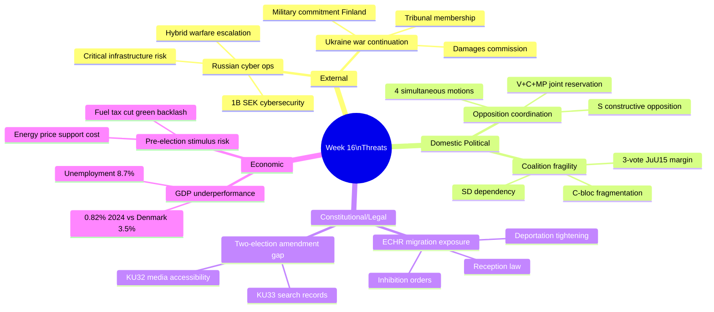

# Threat Analysis — Week 16 (2026-04-11 to 2026-04-17)

**Generated**: 2026-04-18 09:18 UTC (AI-enhanced)
**Method**: STRIDE-based parliamentary threat analysis

---

## Threat Landscape Overview

Week 16 reveals three distinct threat vectors for Swedish democratic governance:

### T01: Russian Hybrid Operations — Cybersecurity Threat
**Type**: External threat / democratic stability
**Evidence**: Minister Carl-Oskar Bohlin (M) warned of escalating Russian cyber operations targeting Swedish critical infrastructure. This was disclosed in the context of Prop. 2025/26:214 (cybersecurity center legislation) and C's counter-motion (mot. 4093) demanding further analysis.
**Significance**: Sweden's post-NATO-membership status makes it a higher-value target for Russian hybrid warfare
**Government response**: 1+ billion SEK committed to cybersecurity; national cybersecurity center legislation
**Confidence**: 🟦 VERY HIGH

### T02: Constitutional Vulnerability — Two-Election Amendment Gap
**Type**: Legislative/constitutional uncertainty
**Evidence**: KU32 and KU33 represent first-reading constitutional amendments requiring a second identical vote after the September 2026 election. If the government changes, new government may vote differently.
- KU32: Media accessibility requirements — affects press freedom balance
- KU33: Search/seizure records excluded from public access — affects transparency
**Significance**: Creates policy uncertainty; whoever wins 2026 election controls these amendments
**Confidence**: 🟩 HIGH

### T03: ECHR/EU Legal Challenge Risk — Migration Measures
**Type**: International legal challenge
**Evidence**: Three opposition parties (V, C, MP) filed simultaneous counter-motions against Prop. 235 (stricter deportation). V argues full incompatibility with asylum law; C demands proportionality test; MP accepts partial provisions. This triangulation suggests a prepared legal challenge strategy.
**Significance**: Inhibition order system (SfU22) and new reception law (Prop. 229) create exposure to ECHR Article 3 (prohibition of torture/inhuman treatment), Article 8 (family life), and EU Recast Reception Conditions Directive challenges
**Confidence**: 🟩 HIGH

---

## Weekly Threat Map

