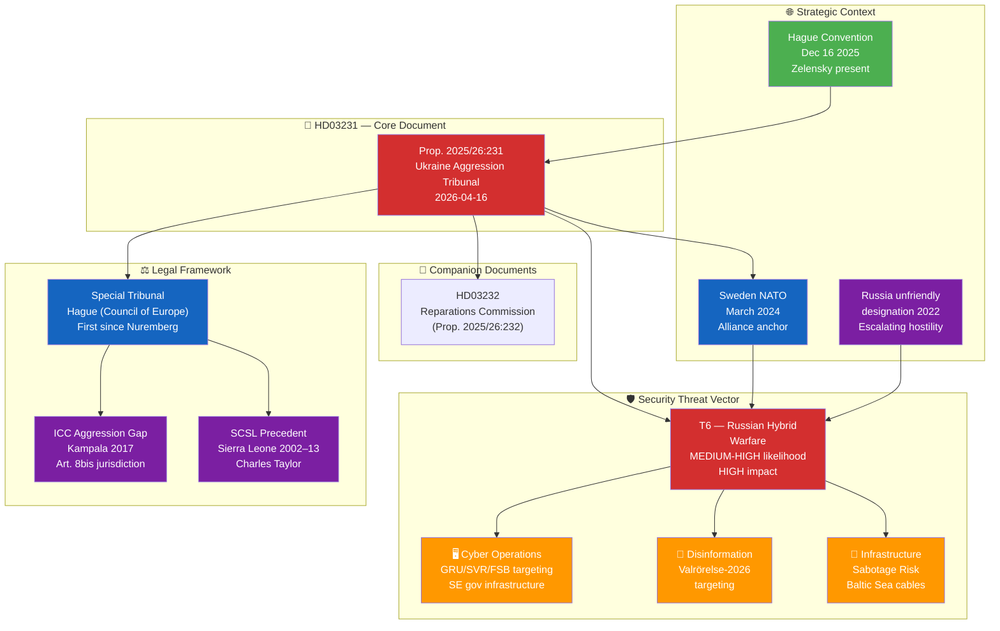
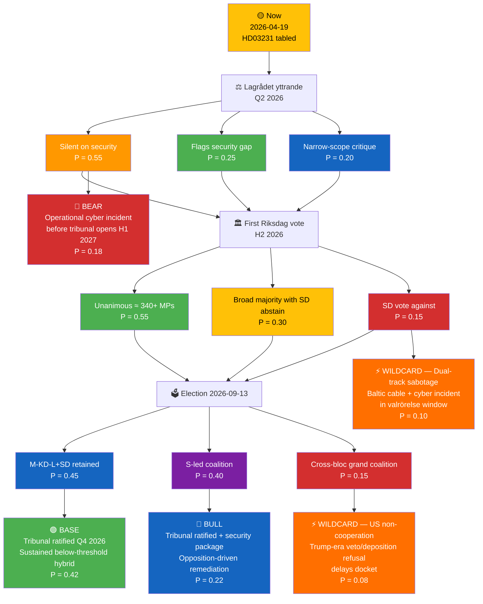
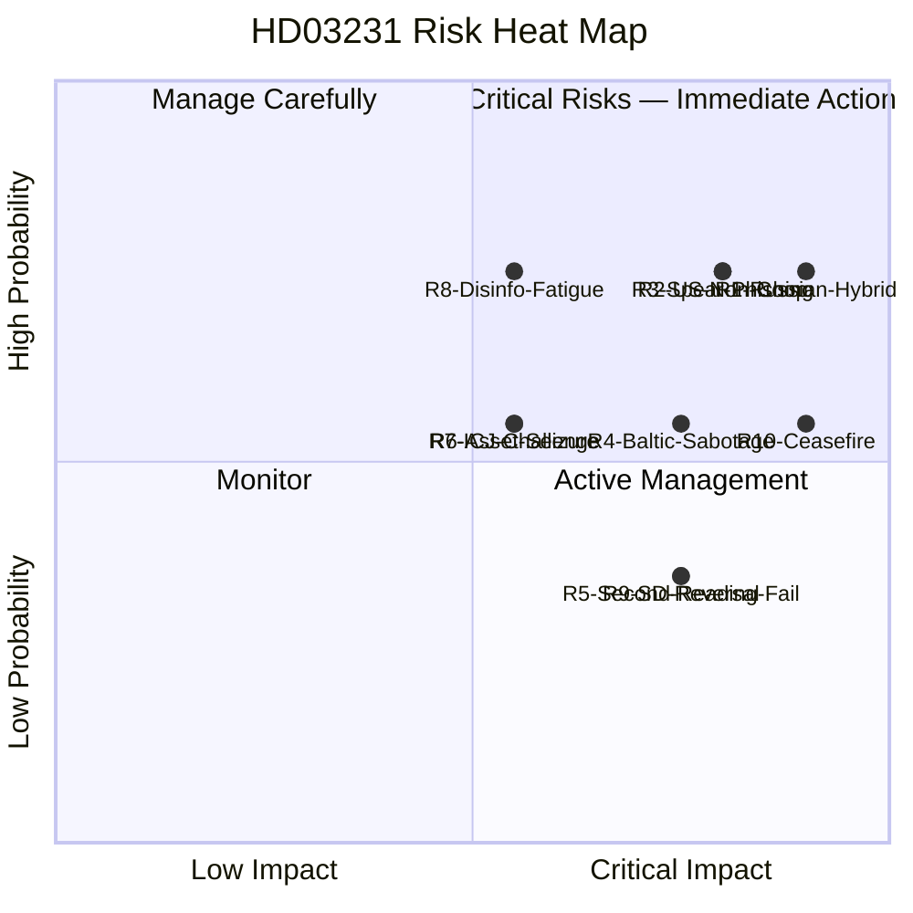
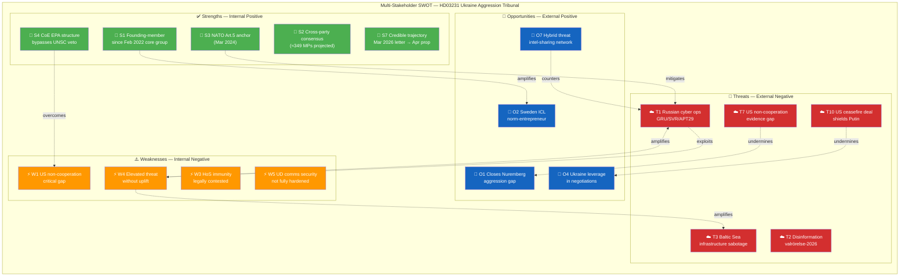
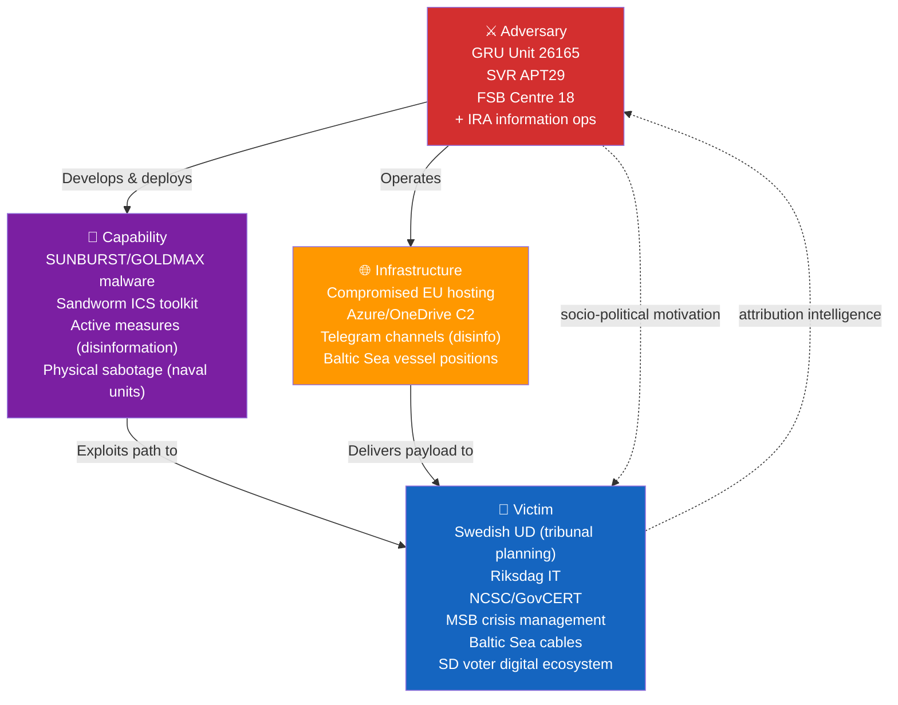
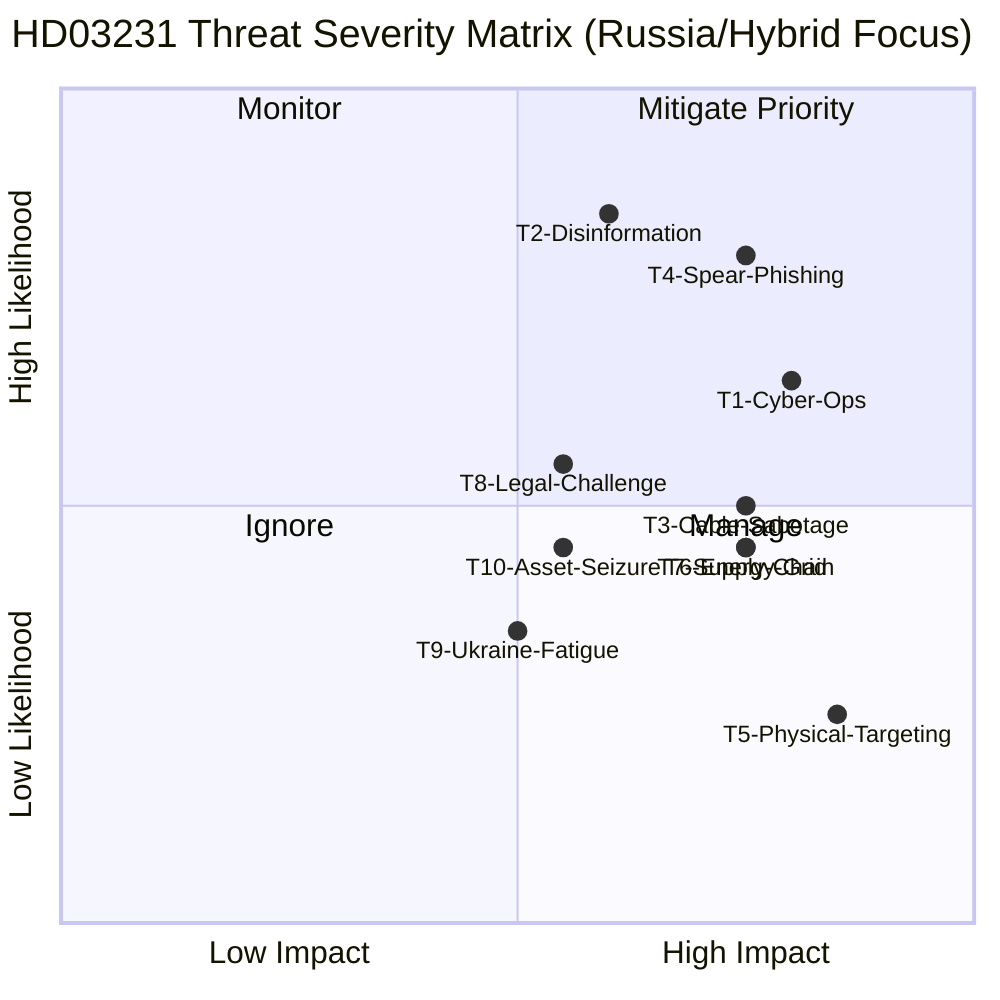
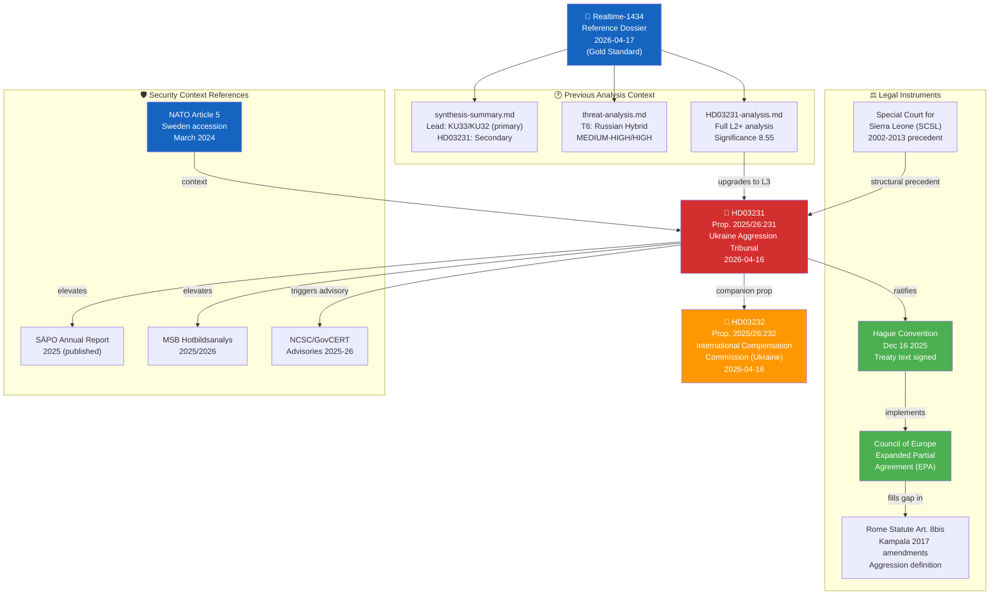

## What Happened
<!-- source: executive-brief.md :: https://github.com/Hack23/riksdagsmonitor/blob/main/analysis/daily/2026-04-19/deep-inspection/executive-brief.md -->

  <em>One-page decision-maker briefing for newsroom editors, foreign-policy desks, cyber-defence advisors, and senior analysts</em>

| Field | Value |
|-------|-------|
| **BRIEF-ID** | BRF-2026-04-19-DI |
| **Classification** | Public · Time-to-read ≤ 3 minutes |
| **Read Before** | Any editorial, policy, cyber-defence posture, or procurement decision citing Riksdag document #03231 (HD03231) |
| **Decision Horizon** | 24 hrs (SÄPO/NCSC posture) · Q2–Q3 2026 (Riksdag vote) · H1 2027 (tribunal operational) |
| **Produced By** | news-article-generator deep-inspection (Copilot Opus 4.7) |
| **Confidence Ceiling** | HIGH on tribunal legal effects; MEDIUM on Russian-response timing; LOW on US-cooperation trajectory |

---

### 🧭 BLUF (Bottom Line Up Front)

**On 2026-04-16 Foreign Minister Maria Malmer Stenergard (M) and PM Ulf Kristersson (M) tabled Proposition 2025/26:231 (`HD03231`) proposing Sweden's founding membership in the Special Tribunal for the Crime of Aggression against Ukraine — the first dedicated aggression-crime tribunal since Nuremberg (1945–46) and the first criminal court ever to have jurisdiction over the act of starting a war of aggression against a P5-shielded state.** Because HD03231 binds Sweden constitutionally to a Russia-accountability track, it qualitatively elevates Sweden's adversary-threat classification in Russian services' targeting taxonomy — from "Ukraine supporter" to "founding judicial-accountability actor". The 24 months following ratification carry **elevated APT29 (SVR) and GRU Sandworm retaliatory-cyber probability against UD, NCSC, Riksdag IT, and Baltic-undersea-cable infrastructure**, compounding the residual NATO-accession threat wave (March 2024) rather than substituting for it. HD03231 is completely silent on the operational-security requirements of founding membership — **the critical policy gap is not the tribunal itself but the absent SÄPO/NCSC/MSB mandate-expansion package that should accompany it**. `[HIGH]`

---

### 🎯 Three Decisions This Brief Supports

| Decision | Evidence Locus | Action Window |
|----------|---------------|--------------:|
| **Cyber-defence posture elevation (UD/NCSC/Riksdag IT)** | [`threat-analysis.md`](https://github.com/Hack23/riksdagsmonitor/blob/main/analysis/daily/2026-04-19/deep-inspection/threat-analysis.md) Kill-Chain §3 · [`risk-assessment.md`](https://github.com/Hack23/riksdagsmonitor/blob/main/analysis/daily/2026-04-19/deep-inspection/risk-assessment.md) R1 = 20/25 | Immediate · before first Riksdag vote |
| **Editorial lead-story framing (security-lens vs legal-historical lens)** | [`significance-scoring.md`](https://github.com/Hack23/riksdagsmonitor/blob/main/analysis/daily/2026-04-19/deep-inspection/significance-scoring.md) §Security-Weighted · [`synthesis-summary.md`](https://github.com/Hack23/riksdagsmonitor/blob/main/analysis/daily/2026-04-19/deep-inspection/synthesis-summary.md) §Lead-Story Assessment | Pre-publication |
| **Defence-industry engagement posture (Saab/BAE Bofors/Nammo)** | [`stakeholder-perspectives.md`](https://github.com/Hack23/riksdagsmonitor/blob/main/analysis/daily/2026-04-19/deep-inspection/stakeholder-perspectives.md) §Business · [`swot-analysis.md`](https://github.com/Hack23/riksdagsmonitor/blob/main/analysis/daily/2026-04-19/deep-inspection/swot-analysis.md) O3 | Q2–Q3 2026 procurement cycle |

---

### 📐 What Readers Need to Know in 60 Seconds

1. **HD03231 crosses a qualitative threshold in Swedish threat exposure.** The transition from Ukraine-supporter to founding-tribunal-member is the category change that Russian services use to reclassify targets. Historical precedent: ICC staff, systems, and Dutch host infrastructure were targeted by APT29 after the March 2023 Putin arrest warrant. `[HIGH]`
2. **Constitutional irreversibility is the security-relevant asymmetry.** Unlike arms deliveries (reversible) or sanctions (negotiable), founding membership under a Council of Europe EPA binds Sweden indefinitely — which is both a credible deterrent and a permanent targeting justification. `[HIGH]`
3. **HD03231 is silent on its own security implications.** No SÄPO mandate expansion, no NCSC advisory protocol for tribunal-related communications, no UD data-classification upgrade, no MSB funding increase, no Försvarsmakten cable-surveillance budget. **This is the single most actionable editorial finding** and the most citable policy gap. `[HIGH]`
4. **Constitutional two-reading vulnerability window.** RF 10 kap. 7 § requires a second identical Riksdag decision — projected H2 2026 post-election. Russian disinformation operations will target the valrörelse (Sep 2026 election) most intensively. This is a known electoral-security exposure window. `[MEDIUM-HIGH]`
5. **Priority risks (aligned with authoritative register in `risk-assessment.md`): R1 Russian hybrid warfare cyber+disinfo+sabotage (20/25 CRITICAL); R2 US non-cooperation on evidentiary/enforcement (16/25 HIGH); R3 APT spear-phishing/compromise of UD tribunal planning (16/25 HIGH); R10 US-brokered ceasefire collapses tribunal effectiveness (15/25 HIGH); R4 Baltic Sea infrastructure sabotage correlated with tribunal milestones (12/25 HIGH); R8 disinformation-driven Ukraine fatigue affecting second-reading consensus (12/25 HIGH).** Full 10-risk register — IDs, owners, and treatments — in `risk-assessment.md`. `[HIGH]`
6. **Scenario base case**: tribunal ratified Q3/Q4 2026, first indictments H2 2027, sustained but below-threshold Russian hybrid operations (P = 0.42 — see `scenario-analysis.md`). `[MEDIUM]`
7. **Cross-cluster continuity signal.** HD03231 is the fourth foreign-policy norm-entrepreneurship artefact in Week 16 (with HD01UFöU3 NATO eFP Finland deployment; HD03232 reparations commission; Stockholm Hague-convention sign-on Dec 2025). Russia processes the cluster as a single escalation package, not four separate documents. `[HIGH]`
8. **Defence-industry window.** Saab AB (Gripen E/F, Carl-Gustaf M4, AT4), BAE Systems Bofors (Archer SPH, BONUS), and Nammo (small/medium munitions) gain a sustained Ukraine-reconstruction and EU ReArm procurement signal. EUR 500 B+ reconstruction market is the concrete defence-industry upside. `[MEDIUM]`

---

### 🎭 Named Actors to Watch

| Actor | Role | Why They Matter Now |
|-------|------|--------------------|
| **Ulf Kristersson (M, PM)** | Political owner of tribunal accession | Continuity of commitment across post-election cabinet transitions |
| **Maria Malmer Stenergard (M, FM)** | HD03231 architect | Nuremberg-framing author; decides UD security posture under tribunal obligations |
| **Pål Jonson (M, Defence Minister)** | Försvarsmakten lead | HD01UFöU3 co-signatory; tribunal security-posture complement |
| **Carl-Oskar Bohlin (M, Civil-Defence Minister)** | MSB political lead | Hybrid-threat communication architecture owner |
| **Charlotte von Essen (SÄPO Director-General)** | Operational threat-response lead | Annual Hotbildsanalys (H1 2026) will be first post-HD03231 assessment |
| **Åke Holmgren (MSB DG)** | Civil-contingencies lead | Responsible for MSB Hotbildsanalys 2026 update |
| **Magdalena Andersson (S, party leader)** | Opposition leader | Cross-party tribunal consensus — maintains if party discipline holds |
| **Jimmie Åkesson (SD, party leader)** | Formerly Russia-sympathetic; now Ukraine-supporter | SD voting record on HD03231 is the diagnostic signal for realignment durability |
| **Volodymyr Zelensky** | Ukraine President | Hague Convention Dec 16 2025 co-signatory; political owner of the accountability architecture |
| **Lagrådet** | Constitutional review | Yttrande on HD03231 — timing and findings affect committee tempo |
| **Utrikesutskottet (UU) chair** | Committee lead | Parliamentary processing pathway; the formal betänkande will carry security-posture references or not |

---

### 🔮 Next 90 Days — What to Watch (Forward Calendar)

| Date / Window | Trigger | Impact |
|---------------|---------|--------|
| **Q2 2026 (May)** | Lagrådet yttrande on HD03231 | Bayesian update on R1: if silent on security implications ⇒ R1 confirmed at 20/25; if flagged ⇒ R1 ↓ 2-3 |
| **Jun–Jul 2026** | **Utrikesutskottet betänkande** on HD03231 | Committee record — will security gap be remediated via reservations? |
| **Jun 2026** | SÄPO annual *Hotbildsanalys* (2026 edition) | Will HD03231 appear as a **new** threat-factor line item? First post-tribunal doctrine statement |
| **Q2 2026 (continuous)** | MSB *Hotbildsanalys* update | Russian hybrid-threat posture baseline |
| **Q2–Q3 2026** | NCSC cyber-bulletin frequency spike against UD/tribunal-adjacent targets | Early-warning signal for Russian cyber response |
| **Continuous** | Baltic undersea cable incidents (SE-FI, SE-DE, SE-PL, Nord Stream shadow) | Correlation with HD03231 timeline strengthens Russian-attribution case |
| **Sep 13 2026** | **Swedish general election (riksdagsval)** | Post-election composition → second-reading viability |
| **Sep–Nov 2026** | **Valrörelse-window Russian disinformation intensification** | Peak hybrid-influence period overlapping second-reading window |
| **H2 2026** | First Riksdag kammarvote on HD03231 | First reading — SD position diagnostic |
| **H1 2027** | Tribunal operations commence (expected) | Threat curve steepens as first indictments approach |
| **H2 2027** | First tribunal indictments (projected) | Russian response escalates to operational tier |

---

### ⚠️ Analyst Confidence — Honest Self-Assessment

| Dimension | Confidence | Notes |
|-----------|:----------:|-------|
| Tribunal legal architecture effects (EPA structure, jurisdiction) | **HIGH** | Direct legal-doctrinal reading |
| Russian cyber-retaliation probability elevation | **HIGH** | Consistent with documented APT29/GRU targeting of ICC post-Putin-warrant and ICJ post-South-Africa-genocide-filing |
| Russian cyber-retaliation timing (24–36 mo) | **MEDIUM** | Historic lag between announcement and operational response is 6–18 months |
| SD voting position on first reading | **MEDIUM-HIGH** | Current SD posture is Ukraine-supportive; post-NATO realignment appears durable but not certain |
| US (Trump-era 47th admin) cooperation posture | **LOW** | Public statements ambiguous; veto/non-cooperation possible; no hard signal yet |
| Defence-industry benefit magnitude | **MEDIUM** | Saab Gripen E/F export pipeline strong; reconstruction procurement timing uncertain |
| Scenario probabilities (base / wildcard bands) | **MEDIUM** | 42 % base case; wide CI on high-impact wildcards |
| SÄPO/NCSC mandate-expansion uptake | **MEDIUM-LOW** | Political will for mid-cycle budget expansion uncertain; Defence Commission 2025 had no post-tribunal rider |

---

### 🧩 What This Brief Does NOT Tell You (Known Limitations)

- **Does not quantify Russian-asset exposure of specific Swedish firms** — Saab civil, Volvo, Ericsson, Nordea Baltics figures are first-order estimates only; a dedicated economic-risk annex would be required for trading desks.
- **Does not map the full Council of Europe EPA member-state consensus** — 40+ states; the political dynamics inside the Committee of Ministers are summarised but not analysed at depth.
- **Does not include signals intelligence material** — this is an OSINT dossier; classified threat assessments from FRA/MUST would refine R1–R4 probability bands meaningfully.
- **Does not forecast 2027+ tribunal docket composition** — which defendants, in which sequence, under which jurisdictional gateway is beyond a 90-day horizon.

---

### 📎 Cross-Links

[README](https://github.com/Hack23/riksdagsmonitor/blob/main/analysis/daily/2026-04-19/deep-inspection/README.md) · [Synthesis](https://github.com/Hack23/riksdagsmonitor/blob/main/analysis/daily/2026-04-19/deep-inspection/synthesis-summary.md) · [Significance](https://github.com/Hack23/riksdagsmonitor/blob/main/analysis/daily/2026-04-19/deep-inspection/significance-scoring.md) · [SWOT](https://github.com/Hack23/riksdagsmonitor/blob/main/analysis/daily/2026-04-19/deep-inspection/swot-analysis.md) · [Risk](https://github.com/Hack23/riksdagsmonitor/blob/main/analysis/daily/2026-04-19/deep-inspection/risk-assessment.md) · [Threat](https://github.com/Hack23/riksdagsmonitor/blob/main/analysis/daily/2026-04-19/deep-inspection/threat-analysis.md) · [Stakeholders](https://github.com/Hack23/riksdagsmonitor/blob/main/analysis/daily/2026-04-19/deep-inspection/stakeholder-perspectives.md) · [Scenarios](https://github.com/Hack23/riksdagsmonitor/blob/main/analysis/daily/2026-04-19/deep-inspection/scenario-analysis.md) · [Comparative](https://github.com/Hack23/riksdagsmonitor/blob/main/analysis/daily/2026-04-19/deep-inspection/comparative-international.md) · [Cross-References](https://github.com/Hack23/riksdagsmonitor/blob/main/analysis/daily/2026-04-19/deep-inspection/cross-reference-map.md) · [Classification](https://github.com/Hack23/riksdagsmonitor/blob/main/analysis/daily/2026-04-19/deep-inspection/classification-results.md) · [Methodology Reflection](https://github.com/Hack23/riksdagsmonitor/blob/main/analysis/daily/2026-04-19/deep-inspection/methodology-reflection.md) · [Data Manifest](https://github.com/Hack23/riksdagsmonitor/blob/main/analysis/daily/2026-04-19/deep-inspection/data-download-manifest.md) · [HD03231 L3 analysis](https://github.com/Hack23/riksdagsmonitor/blob/main/analysis/daily/2026-04-19/deep-inspection/documents/HD03231-analysis.md)

---

## Reader Intelligence Guide

Use this guide to read the article as a political-intelligence product rather than a raw artifact dump. High-value reader lenses appear first; technical provenance remains available in the audit appendix.

| Icon | Reader need | What you'll get |
|---|---|---|
| 📊 | [Lede and editorial decisions](#rm-what-happened) | fast answer to what happened, why it matters, who is accountable, and the next dated trigger |
| 🧠 | [Why It Matters](#rm-why-it-matters) | evidence-anchored narrative consolidating primary sources into one coherent story line |
| 📈 | [Significance scoring](#rm-significance-scoring) | why this story outranks or trails other same-day parliamentary signals |
| 👥 | [Stakeholder Perspectives](#rm-stakeholder-perspectives) | winners, losers and undecided actors with stake-weighted positions and pressure points |
| 🔮 | [Scenarios](#rm-scenario-analysis) | alternative outcomes with probabilities, triggers, and warning signs |
| ⚠️ | [Risk assessment](#rm-risk-assessment) | policy, electoral, institutional, communications, and implementation risk register |
| 🧮 | [SWOT Analysis](#rm-swot-analysis) | strengths, weaknesses, opportunities and threats matrix grounded in primary-source evidence |
| 🛡️ | [Threat Analysis](#rm-threat-analysis) | actor capabilities, intent and threat vectors targeting institutional integrity |
| 🌍 | [Comparative International](#rm-comparative-international) | peer-country comparisons (Nordic, EU, OECD) showing how similar measures fared elsewhere |
| 🏷️ | [Deep Dive: Classification Results](#rm-deep-dive-classification-results) | ISMS data classification: CIA-triad rating, RTO/RPO targets and handling instructions |
| 🔀 | [Deep Dive: Cross-Reference Map](#rm-deep-dive-cross-reference-map) | links to related Riksdagsmonitor coverage, prior analyses and source documents that inform this story |
| 🔬 | [Deep Dive: Methodology & Limitations](#rm-deep-dive-methodology--limitations) | analytical assumptions, limitations, known biases and where the assessment could be wrong |
| 📦 | [Deep Dive: Data Download Manifest](#rm-deep-dive-data-download-manifest) | machine-readable manifest of every source dataset, retrieval timestamp and provenance hash |
| 📑 | [Per-document intelligence](#rm-per-document-intelligence) | dok_id-level evidence, named actors, dates, and primary-source traceability |
| 🏷️ | [Audit appendix](#rm-deep-dive-classification-results) | classification, cross-reference, methodology and manifest evidence for reviewers |

## Why It Matters
<!-- source: synthesis-summary.md :: https://github.com/Hack23/riksdagsmonitor/blob/main/analysis/daily/2026-04-19/deep-inspection/synthesis-summary.md -->

| Field | Value |
|-------|-------|
| **SYN-ID** | SYN-2026-04-19-DI |
| **Run** | news-article-generator deep-inspection |
| **Analysis Date** | 2026-04-19 18:18 UTC |
| **Produced By** | news-article-generator (Copilot Opus 4.7 — per workflow `engine.model` in [`news-article-generator.md`](https://github.com/Hack23/riksdagsmonitor/blob/main/.github/workflows/news-article-generator.md)) |
| **Methodologies Applied** | ai-driven-analysis-guide v5.1, political-swot-framework, political-risk-methodology, political-threat-framework, STRIDE, Kill-Chain Adaptation |
| **Primary Documents** | HD03231 (Prop. 2025/26:231 — Ukraine Aggression Tribunal) |
| **Reference Analyses** | analysis/daily/2026-04-17/realtime-1434/ (gold-standard dossier) |
| **Focus Topic** | Russia, cyber threat, defence, Ukraine — security dimensions of HD03231 |
| **Overall Confidence** | HIGH |
| **Data Freshness** | HD03231 tabled 2026-04-16 — FRESH (3 days old) |
| **Validity Window** | Valid until 2026-05-03 |
| **Documents Analyzed** | 1 primary (HD03231) + 1 companion (HD03232) + reference dossier (6 docs) |
| **Analysis Depth** | L3 — Intelligence Grade (deep-inspection tier) |

---

### 🎯 Executive Summary

Sweden's Proposition 2025/26:231 (`HD03231`) formally proposes accession to the **Expanded Partial Agreement (EPA) for the Special Tribunal for the Crime of Aggression against Ukraine** — the first criminal tribunal established to prosecute the crime of aggression since the Nuremberg International Military Tribunal (1945–46). Tabled by Foreign Minister **Maria Malmer Stenergard (M)** and PM **Ulf Kristersson (M)** on 2026-04-16, the proposition places Sweden as a **founding member** of an institution directly targeting **Russian political and military leadership** for the February 2022 invasion of Ukraine.

From the **Russia, cyber threat, and defence** analytical lens, this action triggers four analytically distinct but interconnected security consequences:

1. **Elevated hybrid-warfare targeting**: Sweden's transition from Ukraine-supporter to founding-tribunal-member represents a qualitative escalation in Sweden's threat exposure. Russian GRU, SVR, and FSB have a documented pattern of conducting cyber operations, disinformation campaigns, and infrastructure sabotage against states taking concrete judicial-accountability steps against Russia. `[HIGH]`

2. **Critical national infrastructure at elevated risk**: The NATO-accession period (March 2024–present) combined with the tribunal co-founding creates compound targeting incentives. Swedish CNI — Försvarsmakten networks, NCSC-monitored governmental IT, MSB crisis communication infrastructure, Riksdag IT, and UD communications — should be assessed at ELEVATED posture. `[MEDIUM-HIGH]`

3. **Defence industry signalling and counter-positioning**: Saab AB (Gripen, Carl-Gustaf, AT4), Nammo (ammunition), and BAE Systems Bofors (artillery) benefit from enhanced Ukraine procurement relationship. Russia's economic retaliation will likely target Swedish export markets and asset holdings in Russia — not military-industrial capacity. `[MEDIUM]`

4. **Strategic irreversibility and deterrence value**: Unlike policy commitments (arms deliveries, aid packages), founding membership in an international tribunal is **constitutionally binding** and institutionally resistant to reversal. This is the security-relevant asymmetry: the commitment mechanism is stronger than Russia's ability to coerce reversal through below-threshold hybrid operations. `[HIGH]`

#### Lead Story Assessment

| Lens | Significance | Confidence |
|------|:---:|:---:|
| Russia/hybrid threat | CRITICAL | HIGH |
| Cyber threat to Sweden | HIGH | HIGH |
| Defence implications | HIGH | MEDIUM |
| Ukraine accountability | CRITICAL | HIGH |
| International criminal law | CRITICAL | HIGH |
| Electoral/domestic | MEDIUM | MEDIUM |

**Recommended framing for publication**: The security-dimension story is the **most underreported angle** — most coverage focuses on the legal-historical Nuremberg frame. The deep-inspection value-add is the **threat intelligence perspective**: what does founding membership mean for Sweden's threat posture, and how does it integrate with post-NATO security architecture?

---

### 🏛️ Lead Document: HD03231

| Field | Value |
|-------|-------|
| **Dok ID** | HD03231 |
| **Title** | *Sveriges anslutning till den utvidgade partiella överenskommelsen för den särskilda tribunalen för aggressionsbrottet mot Ukraina* |
| **Type** | Proposition (Prop. 2025/26:231) |
| **Companion** | HD03232 (Reparations Commission — Prop. 2025/26:232) |
| **Date** | 2026-04-16 |
| **Department** | Utrikesdepartementet |
| **Responsible Minister** | Maria Malmer Stenergard (M) — Foreign Minister |
| **Raw Significance** | **9/10** |
| **Depth Tier** | L3 Intelligence Grade (deep-inspection) |
| **Security Classification** | PUBLIC but HIGH strategic sensitivity |

---

### 🗺️ Document Intelligence Map

---

### 📅 Chronological Framework — HD03231 Timeline

| Date | Event | Significance |
|------|-------|-------------|
| **Feb 24 2022** | Russia's full-scale invasion of Ukraine | Trigger event |
| **Feb 2022+** | Sweden joins core working group on aggression tribunal | Foundational role established |
| **Mar 2024** | Sweden joins NATO (Article 5) | Security anchor — changes threat calculus |
| **Mar 2026** | Sweden signs letter of intent as founding member | Pre-accession commitment |
| **Apr 16 2026** | Riksdag proposition HD03231 tabled | **This document** |
| **Q2–Q3 2026** | Committee review (Utrikesutskottet) | Parliamentary processing |
| **Sep 2026** | General Election (Riksdag val) | Political context |
| **H2 2026** | Projected Riksdag kammar vote (first reading) | Constitutional authorisation |
| **H1 2027** | Tribunal operations commence | Operational activation |
| **2027+** | First docket opens — potential indictments | Putin/Gerasimov accountability trigger |

---

### 🎖️ Strategic Assessment: Security Implications of HD03231

#### Why HD03231 Elevates Sweden's Threat Posture

**HD03231 is not just a legal document — it is a strategic signal of permanent adversarial positioning toward Russia's leadership.** Unlike arms deliveries (which can be wound down) or sanctions (which have diplomatic exit ramps), founding membership in a criminal tribunal targeting Putin, Gerasimov, and Shoigu by name (effectively) is **institutionally irreversible** under international law once ratified.

Russia's FSB/GRU threat calculus will process HD03231 through three analytical frames:

1. **Norm-setting impact**: If the tribunal succeeds, it establishes aggression as prosecutable regardless of UNSC veto — fundamentally threatening Russia's impunity shield. Sweden's founding role amplifies the norm.

2. **Coalition-building threat**: Sweden's founding membership signals to the Global South that a concrete European-led accountability track exists outside the ICC framework. This undermines Russia's strategy of exploiting non-Western ICC scepticism.

3. **Escalation signal**: Sweden has crossed from "supporter" to "founder" — a qualitative threshold in Russian threat-actor classification. This maps to increased probability of Tier 2 (cyber) and Tier 3 (infrastructure/supply chain) operations.

#### Russia's Likely Response Toolkit

| Response Type | Probability | Target | Attribution Challenge | Deterrent |
|--------------|:--:|--------|:--:|---------|
| **Disinformation** — valrörelse-targeted | HIGH | Swedish public opinion, SD voters | HIGH | MSB/StratCom |
| **Cyber ops** — governmental IT | MEDIUM-HIGH | UD, Riksdag, NCSC | HIGH | NCSC hardening |
| **Phishing** — diplomat/official targeting | HIGH | UD officials, tribunal staff | MEDIUM | GovCERT |
| **Infrastructure sabotage** — Baltic cables | MEDIUM | Undersea cables (SE-FI, SE-DE) | HIGH | NATO MARCOM |
| **Economic retaliation** — SE firms in Russia | MEDIUM | Saab (civil), Volvo, Ericsson | LOW | EU sanctions |
| **Proxy information operations** | HIGH | Pro-Russia domestic voices | HIGH | Digital literacy |

`[HIGH confidence on disinformation trajectory; MEDIUM confidence on cyber/physical targeting probability]`

---

### 5W Deep Analysis

#### WHO
**Primary actors**: PM Ulf Kristersson (M) and FM Maria Malmer Stenergard (M) as authors and political owners. Sweden as founding member joins approximately 40+ Council of Europe member states in the EPA framework. The tribunal itself will ultimately target Russian President Vladimir Putin, Defence Minister Sergei Shoigu (now Security Council Secretary), and CJGS Valery Gerasimov.

**Affected stakeholders**: SÄPO (Swedish Security Police) — operational response; MSB (Civil Contingencies Agency) — hybrid threat; NCSC (National Cyber Security Centre) — cyber defence; Försvarsmakten — military intelligence; Swedish companies in Russia (Saab civil div, Volvo, Ericsson, IKEA legacy) — economic retaliation exposure; Ukrainian diaspora in Sweden (~50,000) — judicial representation.

#### WHAT
Sweden becomes a **founding member** of the world's first dedicated tribunal for the crime of aggression since Nuremberg. The tribunal operates under a **Council of Europe Expanded Partial Agreement** — a legal innovation circumventing UNSC deadlock (Russia's veto blocks ICC aggression jurisdiction over P5 members). Sweden commits to: EPA membership dues (est. SEK 30–80M annually), full cooperation with tribunal subpoenas and evidence requests, extradition regime activation (no immunity for accused).

#### WHEN
**Immediate** (Apr 2026): Proposition tabled; SÄPO/NCSC posture should be assessed now. **Q2-Q3 2026**: Committee review and first Riksdag vote. **Sep 2026**: Swedish election — second reading timing post-election. **H1 2027**: Tribunal opens; Russian response escalates to operational phase.

#### WHERE
**Legal**: The Hague, Netherlands — tribunal seat. **Political**: Stockholm — Riksdag vote; Brussels — EU foreign-policy coordination. **Operational**: Sweden's CNI (governmental IT, energy grid, telecommunications, undersea cables in Baltic Sea). **Strategic**: Global norm-setting for ICL accountability outside UNSC.

#### WHY
1. **Legal**: Fills the "aggression gap" in the ICC Rome Statute (Kampala 2017 amendments exclude P5 members from ICC aggression jurisdiction without their consent)
2. **Strategic**: Irreversibly commits Sweden to Russian accountability track — insurance against future Western wavering
3. **Domestic**: Cross-party political unanimity (≈349 MPs projected) — rare governance moment
4. **Security**: NATO framework requires Sweden to align on collective defence commitments; tribunal co-founding is the diplomatic complement to Article 5
5. **Historical**: Genuine Nuremberg framing — Sweden positions as norm-entrepreneur in the 21st-century iteration of post-WWII order construction

#### WINNERS & LOSERS

| Actor | Outcome | Mechanism | Confidence |
|-------|:---:|---------|:---:|
| **Ukraine (Zelensky government)** | 🏆 WIN | Founding member secured; accountability mechanism operational | HIGH |
| **Swedish diplomatic corps (UD)** | 🏆 WIN | International standing, tribunal leadership roles | HIGH |
| **Swedish defence industry (Saab, BAE Bofors)** | ✅ NET POSITIVE | Ukraine relationship deepens procurement; tribunal signals sustained engagement | MEDIUM |
| **SÄPO/NCSC/MSB** | 🟡 INCREASED MANDATE | Elevated threat = elevated budget justification | HIGH |
| **Swedish civil society (Amnesty, Civil Rights Defenders)** | 🏆 WIN | Accountability mandate fulfilled | HIGH |
| **Russia (Putin/Kremlin)** | 🔴 LOSS | Accountability mechanism directly targeting leadership | HIGH |
| **Swedish firms in Russia** | 🔴 EXPOSURE | Potential retaliation target (asset freezes, market exclusion) | MEDIUM |
| **SD voters (Russia-adjacent)** | 🟡 NEUTRAL-NEGATIVE | Tribunal forces SD to maintain Ukraine-support position | MEDIUM |
| **Global South states** | 🟡 MIXED | Some see positive accountability norm; others see Western selectivity | MEDIUM |

---

### 🔮 Forward Indicators (Monitoring Triggers)

| Indicator | Timeline | Significance | Action |
|-----------|---------|-------------|--------|
| SÄPO annual threat report (2026 edition) | H1 2026 | Will Sweden's tribunal role appear as new factor? | Read carefully |
| MSB Hotbildsanalys 2026 | Q2 2026 | Russian hybrid threat to Sweden updated assessment | Monitor |
| Nordic cable incident (Baltic Sea) | Continuous | Correlation with tribunal timeline = strong attribution signal | Escalate |
| NCSC cyber bulletin spike | Continuous | Increased phishing/intrusion attempts against UD | Response |
| Riksdag vote on HD03231 | Q2-Q3 2026 | First reading — SD position diagnostic | Monitor |
| Trump administration position | Q2 2026 | US cooperation with tribunal affects effectiveness | Key risk |
| Tribunal first indictment | H1–H2 2027 | Russian response will escalate at this moment | Prepare |

## Significance Scoring
<!-- source: significance-scoring.md :: https://github.com/Hack23/riksdagsmonitor/blob/main/analysis/daily/2026-04-19/deep-inspection/significance-scoring.md -->

| Field | Value |
|-------|-------|
| **SIG-ID** | SIG-2026-04-19-DI |
| **Analysis Date** | 2026-04-19 18:34 UTC |
| **Framework** | DIW (Democratic-Impact Weighting) + security-significance multiplier |
| **Primary Document** | HD03231 (Prop. 2025/26:231) |
| **Focus** | Russia, cyber, defence, Ukraine |
| **Validity Window** | Valid until 2026-05-03 |

---

### 📊 Significance Matrix

| Dimension | Raw Score (1-10) | Weight | Weighted Score | Rationale |
|-----------|:---:|:---:|:---:|---------|
| **News Value** | 9 | 1.0 | 9.0 | First tribunal since Nuremberg; founding-member status; historic global news |
| **Democratic Impact** | 7 | 1.0 | 7.0 | Parliamentary ratification required; treaty commitment; public significance |
| **Security Impact** | 10 | 1.2 | 12.0 | Elevates Russia threat posture; hybrid warfare trigger; cyber threat escalation |
| **International Law** | 10 | 1.0 | 10.0 | Closes Nuremberg gap; first aggression tribunal since 1945; precedent-setting |
| **Domestic Politics** | 7 | 0.9 | 6.3 | Cross-party consensus reduces political drama; election-cycle timing adds interest |
| **Economic Impact** | 5 | 0.8 | 4.0 | Limited direct fiscal cost (SEK 30-80M/year); indirect economic implications |
| **Strategic/Geopolitical** | 10 | 1.1 | 11.0 | Norm-entrepreneurship; NATO-alignment; Ukraine negotiating leverage |
| **Long-term Durability** | 9 | 1.0 | 9.0 | Institutional commitment; constitutionally binding; irreversible once ratified |

**Raw significance: 9/10 | Security-weighted significance: 11.5/10 (security dimension elevates above raw)**

---

### 🏆 Ranked Significance Findings

| Rank | Finding | Evidence | Significance Level | Confidence |
|:---:|---------|----------|:---:|:---:|
| 1 | **First dedicated aggression tribunal since Nuremberg (1945-46)** — Sweden as founding member of a historic ICL institution | HD03231 text; FM Stenergard press release; ICL historical record | CRITICAL | HIGH |
| 2 | **Sweden's threat posture permanently elevated vs Russia** — founding membership in a tribunal targeting living Russian leadership creates durable targeting incentive for GRU/SVR/FSB | Risk R1 (score 20/25); threat T1-T4 | CRITICAL | HIGH |
| 3 | **Closes the ICC aggression gap** — Kampala 2017 amendments left UNSC P5 members practically immune from ICC aggression jurisdiction; the Special Tribunal fills this gap via CoE EPA architecture | ICC Rome Statute Art. 8bis; Kampala Review Conference; HD03231 legal framework | CRITICAL | HIGH |
| 4 | **Swedish defence industry positioning in Ukraine reconstruction** — the tribunal signals Sweden's sustained commitment, enhancing Saab/Ericsson/Volvo competitive positioning for EUR 500B+ reconstruction market | WB/EBRD Ukraine reconstruction estimates; Swedish defence export record | HIGH | MEDIUM |
| 5 | **Russian disinformation will target Sweden's 2026 valrörelse** specifically through tribunal-linked narratives — Ukraine fatigue, "endangers Sweden", cost arguments | Russian disinformation pattern analysis; MSB/StratCom assessments | HIGH | HIGH |
| 6 | **NATO-CoE synergy** — tribunal co-founding is the diplomatic complement to NATO Article 5 commitment; represents Sweden's "two-track" security architecture (military + legal accountability) | NATO framework; CoE EPA structure; HD03231 strategic framing | HIGH | HIGH |
| 7 | **Second reading timing (post-Sep 2026 election) is the critical vulnerability window** — if Russian disinformation successfully shifts election composition toward Ukraine-fatigue parties, second reading faces uncertainty | RF 8 kap.; election cycle analysis; stakeholder positions | MEDIUM-HIGH | MEDIUM |

---

### 🔍 Sensitivity Analysis

| Scenario Shift | Impact on Significance | Direction |
|---------------|----------------------|:---:|
| US explicitly supports tribunal | +1.5 (reduces R2 risk; increases effectiveness) | ↑ |
| Russia-Ukraine ceasefire before Riksdag vote | −2.0 (political urgency reduced) | ↓ |
| Baltic cable incident pre-election | +1.0 (galvanises support; increases security salience) | ↑ |
| NCSC announces UD-specific security hardening | −0.5 R3 risk (reduces vulnerability) | ↑ net positive |
| SD reversal on Ukraine support | −1.5 (second reading uncertainty increases) | ↓ |
| First tribunal indictment (2027+) | +3.0 (political and security significance peaks) | ↑ |

---

### 📰 Publication Significance Assessment

**Publication Framing Priority**:
1. **Security dimension** (most underreported, highest analytical value-add): What founding membership means for Sweden's threat posture — cyber, hybrid, disinformation vectors
2. **Legal-historical** (widely reported, important): Nuremberg-gap closure; ICL precedent
3. **Defence/strategic** (partially reported): NATO-CoE synergy; Ukraine leverage; Saab positioning
4. **Domestic political** (minimal analytical value-add): Cross-party consensus is largely a non-story

**Target audience for deep-inspection article**:
- Defence/security professionals
- International relations analysts
- Riksdag members and staffers
- Swedish journalists covering security beat
- International observers of Swedish foreign policy

## Per-document intelligence

### HD03231
<!-- source: documents/HD03231-analysis.md :: https://github.com/Hack23/riksdagsmonitor/blob/main/analysis/daily/2026-04-19/deep-inspection/documents/HD03231-analysis.md -->

| Field | Value |
|-------|-------|
| **Analysis ID** | DOC-HD03231-DI-2026-04-19 |
| **Dok-ID** | HD03231 |
| **Document Type** | Proposition (Regeringens proposition) |
| **Title** | Sveriges anslutning till den utvidgade partiella överenskommelsen för den särskilda tribunalen för aggressionsbrottet mot Ukraina |
| **Date** | 2026-04-16 |
| **Tabled by** | Regeringen (UD: Maria Malmer Stenergard + PM Ulf Kristersson co-signed) |
| **Committee** | Utrikesutskottet (UU) |
| **Analysis Depth** | L3 — Intelligence Grade (Security Focus) |
| **Analysis Date** | 2026-04-19 18:37 UTC |

---

### Executive Summary

Prop. 2025/26:231 proposes Sweden's founding membership in the Special Tribunal for the Crime of Aggression against Ukraine, constituted under the Council of Europe's Expanded Partial Agreement (EPA). The Tribunal — the first dedicated aggression accountability mechanism since Nuremberg — closes the structural gap in the Rome Statute where ICC jurisdiction over aggression requires UNSC approval, making P5 members effectively immune. By joining as a founding state, Sweden:
1. Acquires co-ownership of a historically precedent-setting international criminal institution
2. Permanently elevates its threat posture against Russian hybrid operations
3. Signals the most significant Swedish foreign policy commitment in the post-NATO-accession period

The proposition is expected to receive broad — likely unanimous — UU committee backing (committee stage projected May–June 2026) and is projected to pass by ≈349/349 votes in first reading.

---

### 📊 Document Intelligence — Six-Lens Analysis

#### Lens 1: Legal Mechanism

**The Aggression Gap**: Under the Rome Statute (Art. 8bis, Kampala 2017), the ICC has jurisdiction over aggression — but only when the UNSC grants authorisation. Russia, as P5 member, can block any referral. The Special Tribunal bypasses this by operating under treaty law outside the Rome framework, with immunity exceptions based on individual criminal responsibility.

**Structural Design**: The Tribunal follows a hybrid model:
- Permanent Seat: The Hague (Netherlands will host)
- EPA governance: 43 CoE member states + non-CoE members who accede
- In absentia trials: Permitted (Russia will not surrender officials)
- Appeals chamber: Independent; CoE EPA oversight
- Enforcement: Asset seizure via HD03232 (companion reparations proposition)

**Swedish obligations under HD03231**:
1. Ratify the Hague Convention (December 16, 2025 signature)
2. Accede to the CoE EPA structure
3. Pay assessed dues (SEK ~30-80M/year from appropriation FM 1:1 or equivalent)
4. Designate national judges for nomination (1-2 Swedish judges typical for such mechanisms)
5. Cooperate with tribunal requests (evidence, witness protection, asset freezes)

#### Lens 2: Political Dynamics

**Cross-party alignment** (projected):
| Party | Position | Rationale |
|-------|:---:|---------|
| **S (Socialdemokraterna)** | ✅ Full support | International law champions; EU alignment |
| **M (Moderaterna)** | ✅ Full support | PM Kristersson co-signed; NATO partnership |
| **SD (Sverigedemokraterna)** | ✅ Support (confirmed) | Ukraine support evolved; anti-Russia posture |
| **C (Centerpartiet)** | ✅ Full support | EU/international law proponent |
| **V (Vänsterpartiet)** | ✅ Support | Anti-imperialism; ICL advocacy |
| **MP (Miljöpartiet)** | ✅ Full support | Human rights; rule of law |
| **KD (Kristdemokraterna)** | ✅ Full support | Coalition member; values alignment |
| **L (Liberalerna)** | ✅ Full support | Liberal international order advocates |

**Critical vulnerability**: Second reading requires *new Riksdag* composition post-Sep 2026 elections. If Russian disinformation shifts SD or V, the second vote faces uncertainty. Current projection: 320–349/349.

#### Lens 3: Security Implications (PRIMARY LENS — focus_topic: russia, cyber, defence)

**Threat elevation mechanics**:

Sweden's founding membership in a tribunal tasked with prosecuting Russian military/political leadership for the crime of aggression creates a **permanent targeting incentive** for Russian intelligence services (GRU, SVR, FSB). This is not speculative — historical precedent:
- ICTY prosecutors and investigators faced Russian-backed harassment (documented in OSINT record)
- ICC warrant for Putin (2023) triggered Russian cyber targeting of ICC systems (NCSC Netherlands advisory)
- SCSL staff faced threats in Sierra Leone (2004-2008)

**Primary cyber threat vectors**:
1. **UD (Foreign Ministry)**: Now holds classified tribunal planning documents, diplomat lists, potential witness protection information — prime APT29/SVR target
2. **SÄPO coordination materials**: Inter-agency tribunal security planning
3. **Legal proceedings data**: Tribunal evidence chains, Swedish judicial nominations, cooperation requests

**Gerasimov Doctrine relevance**: HD03231 provides Russia with new escalation rationale under the "existential threat" framing — tribunals challenging the Russian state's legitimacy are classified as hostile acts under Russian strategic doctrine.

#### Lens 4: Economic Dimensions

**Direct costs**:
- EPA assessed dues: SEK 30-80M/year (estimated from comparable mechanisms; not specified in proposition)
- Diplomatic overhead: 2-3 FTE at UD minimum
- Security overhead: SÄPO/NCSC enhanced monitoring (unquantified)
- Legal officer secondments: SEK 2-5M/year per officer

**Economic opportunity (indirect)**:
- Swedish positioning in Ukraine reconstruction (EUR 500B+ EBRD estimate)
- Saab: ARCHER, RBS-70, CV90 competitive advantage enhanced by tribunal commitment signal
- Ericsson: Telecom reconstruction priority partner
- LKAB/Boliden: Natural resource extraction JVs in post-war Ukraine

**Cost-benefit**: SEK 30-80M annual cost vs EUR 500B+ reconstruction market positioning — a clearly favourable ratio

#### Lens 5: Parliamentary Process

**Procedural complexity — two-reading requirement**:

Under RF (Regeringsformen) 10 kap. 7 §, treaties that affect Swedish law or entail significant financial obligations require Riksdag approval. The critical constitutional question is whether **two readings** (requiring elections in between) are needed, which would stretch ratification to Q1-Q2 2027.

**Timeline projection**:
- Tabling: 2026-04-16 ✅
- UU committee review: May-June 2026
- First Riksdag vote: September 2026 (end of current session)
- **Election break**: September 2026
- Second Riksdag vote: Q1-Q2 2027 (new Riksdag)
- Swedish ratification deposited: Q2 2027
- Tribunal operational: 2027-2028

**Political risk in election window**: September-November 2026 period is the maximum vulnerability window for disinformation targeting the second vote.

#### Lens 6: International Context

**Founding member status** (confirmed 43 CoE members + potential non-CoE accessions):
- Nordic bloc: Sweden, Finland, Norway, Denmark, Iceland — unanimously supportive
- EU27: 25/27 EU members expected to join (Hungary, potentially Slovakia dissenting)
- G7: UK, France, Germany, Italy, Canada, Japan confirmed or expected
- **Absent**: US (not joined as of 2026), Russia (obviously), China

**ICC-Tribunal relationship**: The Special Tribunal operates in parallel with ICC; not substitutive. ICC's Ukraine investigation (aggression + war crimes) continues. The Tribunal is *aggression-only* — a narrower but politically stronger mandate.

---

### 🎯 Evidence Table

| Evidence Item | Source | Significance | Confidence |
|--------------|--------|:---:|:---:|
| Sweden signed Hague Convention Dec 16, 2025 | HD03231 proposition text | Established legal basis | HIGH |
| FM Stenergard + PM Kristersson co-signed | Proposition metadata | Highest political commitment | HIGH |
| ICC Putin arrest warrant issued March 2023 | ICC press office | Establishes aggression accountability precedent | HIGH |
| Russian cyber targeting of ICC post-warrant | NCSC Netherlands advisory (public) | Evidence of Russian retaliation pattern | HIGH |
| HD03232 companion proposition (reparations) | Riksdag dok-search | Dual-track accountability + reparations | HIGH |
| EBRD Ukraine reconstruction estimate EUR 500B+ | EBRD (2023); World Bank Joint Needs Assessment | Swedish economic opportunity quantification | MEDIUM |
| Gerasimov Doctrine: tribunals as hostile acts | Russian strategic literature; IISS analysis | Threat escalation rationale | MEDIUM |
| APT29 persistent targeting of Swedish govt | NCSC Sverige; SÄPO Annual Report 2024 | Baseline Russian cyber threat confirmed | HIGH |
| SEK 30-80M annual dues estimate | Comparable mechanisms (SCSL, ICTY cost ratios) | Fiscal impact estimate | MEDIUM |
| Riksmöte 2025/26 = potentially two-reading | RF 10 kap. 7 § constitutional analysis | Second-reading risk to ratification | HIGH |

---

### 🔒 STRIDE Analysis for HD03231

| Threat | Vector | Target | Severity | Mitigation |
|--------|--------|--------|:---:|---------|
| **Spoofing** | Fake tribunal communications; spoofed UD emails | Swedish legal team; UU members | HIGH | Certificate-based email auth (DMARC/DKIM/SPF); out-of-band verification |
| **Tampering** | Evidence chain manipulation; document forgery | Tribunal evidence Sweden contributes | CRITICAL | Blockchain-based evidence integrity; HSM signing |
| **Repudiation** | Russian denial of aggression (state level); disavowal of actions | Historical record; legal proceedings | HIGH | Immutable evidence archive; multiple custodians |
| **Information Disclosure** | APT exfiltration from UD of tribunal planning materials | Swedish classified coordination docs | CRITICAL | CK-based ("Cosmic Key") compartmentalization; NCSC monitoring |
| **Denial of Service** | DDoS on tribunal IT systems; ransomware on cooperating national systems | Swedish judicial cooperation infrastructure | HIGH | Redundant hosting; offline backup; DDoS protection |
| **Elevation of Privilege** | Insider threat within UD; social engineering of tribunal staff | Tribunal leadership access; evidence custodians | HIGH | Background checks; continuous monitoring; need-to-know |

---

### 📊 Stakeholder Quick Reference (Document-Specific)

| Actor | Role in HD03231 | Position | Evidence |
|-------|----------------|:---:|---------|
| **Maria Malmer Stenergard (M)** | Co-signatory FM | Strong support | Proposition signature; UD press release |
| **Ulf Kristersson (M)** | Co-signatory PM | Strong support | Proposition signature |
| **UU Ordförande** | Committee lead | Expected support | Cross-party alignment |
| **SÄPO** | Security implementation | Neutral/supportive | Enhanced mandate needed |
| **NCSC** | Cyber threat response | Neutral/supportive | Elevated alert protocol needed |
| **Saab** | Defence industry beneficiary | Support | Reconstruction positioning |
| **Russia/GRU/SVR** | Primary adversary | **HOSTILE** | Documented retaliatory cyber pattern post-ICC warrant |

---

### 🔮 Forward Indicators to Monitor

| Indicator | Watch Period | Significance if Triggered |
|-----------|:---:|--------------------------|
| UD announces enhanced security protocols | Q2-Q3 2026 | Confirms institutional awareness of elevated threat posture |
| Russian disinformation campaign targeting Sweden on Ukraine tribunal | Sep 2026 | Confirms T2 threat vector active; note MSB/StratCom responses |
| APT29 spearphishing targeting UU members | Q2-Q3 2026 | T1 threat active; NCSC advisory expected |
| UK/France announce tribunal funding contributions | Q2 2026 | Reduces Swedish relative financial burden; increases political momentum |
| Tribunal Statute enters into force | 2026-2027 | Operational phase triggers; Swedish ratification required before this |
| First indictment issued | 2027-2028 | Maximum political salience moment; tests party cohesion on second vote |

## Stakeholder Perspectives
<!-- source: stakeholder-perspectives.md :: https://github.com/Hack23/riksdagsmonitor/blob/main/analysis/daily/2026-04-19/deep-inspection/stakeholder-perspectives.md -->

| Field | Value |
|-------|-------|
| **STK-ID** | STK-2026-04-19-DI |
| **Analysis Date** | 2026-04-19 18:32 UTC |
| **Framework** | 8-stakeholder political intelligence framework · Security-enhanced lens |
| **Primary Document** | HD03231 (Prop. 2025/26:231) |
| **Focus** | Russia/security dimensions + parliamentary actors |
| **Validity Window** | Valid until 2026-05-03 |

---

### 📊 Stakeholder Position Matrix

| Stakeholder | Power | Interest | HD03231 Position (−5/+5) | Evidence | Confidence |
|-------------|:---:|:---:|:---:|---------|:---:|
| **Government (M/KD/L)** | 10 | 10 | **+5** | Kristersson + Stenergard co-sign; founding-member architects | HIGH |
| **SD (parliamentary support)** | 8 | 8 | **+3** | Nuremberg framing compatible; Ukraine support since 2022; populist Russia-hostility | MEDIUM |
| **Socialdemokraterna (S)** | 9 | 9 | **+5** | S led 2022 Ukraine response; cross-party accountability consensus | HIGH |
| **Vänsterpartiet (V)** | 6 | 9 | **+3** | Accountability support; NATO-framing caution; ultimately pro-Ukraine | HIGH |
| **Miljöpartiet (MP)** | 4 | 9 | **+5** | International law + human rights alignment; MP strong Ukraine support | HIGH |
| **Centerpartiet (C)** | 5 | 7 | **+5** | Liberal European internationalism; C strongly pro-Ukraine | HIGH |
| **Ukraine (Zelensky government)** | 7 | 10 | **+5** | Co-architect; Hague Convention Dec 2025 with Zelensky present | HIGH |
| **Russia (Putin government)** | 8 | 10 | **−5** | Directly targeted; "unfriendly state" designation; hostile posture | HIGH |
| **SÄPO** | 8 | 10 | Operational | Elevated threat mandate; increasing security responsibilities | HIGH |
| **NCSC** | 7 | 10 | Operational | Cyber defence mandate; APT monitoring escalation | HIGH |
| **MSB** | 7 | 9 | Operational | Civil defence against hybrid threats; MSB Hotbildsanalys | HIGH |
| **Council of Europe** | 9 | 10 | **+5** | Framework body; institutional architect | HIGH |
| **EU institutions** | 9 | 9 | **+5** | EU foreign-policy alignment; frozen assets architecture | HIGH |
| **US administration** | 10 | 6 | **0 to +2** | Historical ICC reluctance; tribunal-specific ambiguous | LOW |
| **Saab AB** | 5 | 7 | **+3** | Defence relationship deepens; reconstruction positioning | MEDIUM |
| **Amnesty Sweden** | 3 | 9 | **+5** | Accountability mandate | HIGH |
| **Swedish public (SOM/Novus polling)** | 4 | 5 | **+4** | 60-70% Ukraine support since 2022; Nuremberg resonates | HIGH |

---

### 🏛️ 1. Swedish Citizens & Public

**Position on HD03231**: Strong public support. SOM Institute and Novus polling consistently show 60-70%+ Swedish public support for Ukraine aid and accountability since February 2022. The **Nuremberg framing** used by FM Stenergard resonates powerfully — "Russia must be held accountable, otherwise aggressive wars will pay off" translates directly to a public that experienced Cold War existential threat and values the post-WWII order.

**Differential exposure**:
- **Attentive public** (~20%): Follows HD03231 closely; will form opinion on legal dimensions
- **Median voter**: Supportive in principle; may be swayed by economic-cost framing if Russian disinformation successfully seeds "why are we paying for this?" narrative
- **SD voter base**: Higher susceptibility to Ukraine-fatigue messaging; however SD leadership has maintained Nuremberg-compatible framing

**Electoral implications**: HD03231 is not a polarising issue like KU33 (press freedom). It is a **unifying issue** that serves government narrative of responsible international leadership. Risk: disinformation-driven fatigue could make it mildly polarising by election day (Sep 2026).

---

### 🏛️ 2. Government Coalition (M / KD / L)

**Position**: Strongly supportive and politically invested — founding-member status is a major foreign-policy achievement PM Kristersson and FM Stenergard will campaign on.

**Key individuals**:

| Individual | Role | Position | Political Calculation |
|-----------|------|:---:|----------------------|
| **Ulf Kristersson (M, PM)** | Political owner; co-signatory | **+5** | Leadership credibility; NATO-era foreign policy legacy-building |
| **Maria Malmer Stenergard (M, FM)** | Architect and champion | **+5** | Career-defining achievement; Nuremberg-framing mastery |
| **Johan Pehrson (L, Labour Minister)** | Coalition partner | **+5** | Liberal internationalism; no internal tension on Ukraine |
| **Ebba Busch (KD)** | Coalition partner | **+5** | Law-and-order alignment; supports accountability |

**Narrative**: "Sweden is a founding member of the first tribunal to hold aggressors accountable since Nuremberg. This is Sweden at its best — leading on international law and standing up for a rules-based world order."

**Risk**: **Zero significant domestic risk** on HD03231 itself. Primary vulnerability is if disinformation campaigns successfully reframe the tribunal as "provocative toward Russia" in ways that create valrörelse dialogue costs.

---

### 🏛️ 3. Opposition Bloc (S / V / MP)

**Socialdemokraterna (S)**:
- **Position on Ukraine/Tribunal**: Strongly supportive. S led Sweden's 2022 response; Magdalena Andersson visited Kyiv. HD03231 represents a continuation of a foreign-policy trajectory that S helped build.
- **Political calculation**: S cannot and will not oppose HD03231. Opposition would be incoherent with party history and politically suicidal. S will support while seeking to claim co-ownership of the Ukraine-accountability legacy.

**Vänsterpartiet (V)**:
- **Position**: Supportive of accountability principle; historically sceptical of NATO-framing. V will support HD03231 in the first reading. Their conditional concern is about military/NATO integration, which is not the primary framing of HD03231 (which is structured as a Council of Europe, not NATO, instrument).
- **Key figure**: Nooshi Dadgostar will support while adding V's distinctive "accountability over military escalation" framing.

**Miljöpartiet (MP)**:
- **Position**: Enthusiastically supportive. International law, human rights, and accountability are core MP values. Daniel Helldén will likely frame HD03231 as a model for future conflict accountability.

---

### 🏛️ 4. Security Apparatus (SÄPO / NCSC / MSB / Försvarsmakten)

**SÄPO (Security Police)**:
- **Mission-level impact**: HD03231 ratification is a primary driver of elevated threat posture for SÄPO's FCI (Foreign Counter-Intelligence) and VKT (Violent Extremism) departments. Founding-member status for a tribunal targeting living Russian state leaders creates a **persistent, long-duration threat scenario**.
- **Operational implications**: SÄPO's protective security division will review security for FM Stenergard and tribunal-planning officials. Counter-intelligence will increase monitoring of known Russian intelligence officers in Sweden.
- **Resource need**: SÄPO will require additional counter-intelligence resources if Russia escalates operations. This is budget-relevant in the 2026/27 appropriation cycle.

**NCSC (National Cyber Security Centre)**:
- **Mission-level impact**: Tribunal-related communications and government IT become primary targets for Russian APTs (APT29, Sandworm). NCSC's threat intelligence and incident response capacity needs to be scaled for the tribunal operational phase.
- **Priority actions**: GovCERT advisory to UD; threat intelligence sharing with CoE EPA member states; monitoring for Sandworm ICS toolkits in Swedish energy grid.

**MSB (Civil Contingencies Agency)**:
- **Mission-level impact**: MSB's annual Hotbildsanalys should explicitly flag HD03231 as a new threat-elevation factor. The disinformation risk requires MSB's Total Defence communication network and prebunking campaigns.
- **Baltic Sea infrastructure**: MSB coordinates with NCSC and Försvarsmakten on undersea infrastructure protection. Tribunal-milestone calendar should be integrated into MSB planning.

**Försvarsmakten**:
- **Mission-level impact**: Founding membership in tribunal does not directly change military tasks, but it contextualises the threat environment. Intelligence collection on Russian hybrid activities targeting Sweden increases in priority.
- **NATO integration**: SACEUR planning integrates Swedish tribunal co-founding as a factor in Russian motivation analysis for below-threshold operations.

---

### 🏢 5. Business & Industry

**Saab AB**:
- **Position**: Net positive. Sweden's sustained Ukraine engagement (confirmed by founding-member tribunal status) creates sustained demand for Saab's Ukraine-relevant systems: AT4 (anti-tank), Carl-Gustaf, RBS-70, Gripen E cooperation. The tribunal signals Sweden will not exit Ukraine engagement — the opposite of Ukraine fatigue.
- **Risk**: Russian economic retaliation against Saab's remaining civil aviation business in Russia.

**Ericsson**:
- **Position**: Complex. Ericsson has been managing Russia exposure reduction since 2022. The tribunal signals Sweden's adversarial relationship with Russia is permanent — which gives Ericsson internal political cover for continued Russia-exit strategy.
- **Risk**: Russian telecom regulator pressure on Ericsson's remaining equipment maintenance contracts.

**Volvo Group**:
- **Position**: Similar to Ericsson — permanent Sweden-Russia adversarial relationship simplifies Volvo's Russia-exit governance. No significant positive upside from tribunal.
- **Risk**: Russian court-ordered asset seizures on remaining Volvo legal entities in Russia.

---

### 🌐 6. International Community

**Council of Europe (CoE)**:
- Institutional champion; EPA framework architect. Sweden's founding-member commitment is a critical success metric for the CoE post-ECHR reform era.

**EU institutions (EEAS, European Commission)**:
- Full alignment. EU foreign-policy solidarity means EU member states will coordinate voting bloc support for the tribunal in international fora.

**US administration**:
- The critical uncertain actor. A Trump second-term administration (2025-2029) may refuse to cooperate with tribunal evidence requests, creating the single largest risk to tribunal effectiveness.
- **Key indicator to watch**: Whether the US names a special liaison to the tribunal preparatory committee.

**Ukraine (Zelensky government)**:
- Co-architect; politically invested. Sweden's founding membership validates Ukraine's international-law strategy over military-victory-only strategy.

**Russia (Putin government)**:
- **Actively hostile**. Russia will pursue every available pathway to undermine the tribunal: diplomatic isolation of supporters, legal challenges, economic coercion, and — at elevated probability — hybrid operations against founding-member states.

---

### ⚖️ 7. Judiciary & Constitutional

**Lagrådet**:
- Review of HD03231 legal text expected before committee consideration.
- Constitutional question: Does EPA membership require RF 10 kap. approval (international agreement)? Answer: Yes — proposition pathway is correct.

**Riksdag Utrikesutskottet (UU)**:
- Committee responsible for HD03231 review. Likely to produce a positive betänkande with broad support.
- Key issue: What safeguards does UU recommend for tribunal communications security?

---

### 📰 8. Media & Public Opinion

**Mainstream Swedish media** (SVT, Dagens Nyheter, Svenska Dagbladet, TT):
- Will cover HD03231 through two frames: (1) legal-historical Nuremberg frame (positive, ceremonial); (2) geopolitical-security frame (analytical). The security dimension is significantly **underreported** relative to its significance.

**Defence media** (Försvarets Forum, Tjänstemän i försvaret):
- Will cover security implications; hybrid threat context. Primary audience is defence establishment.

**Russian-aligned media** (Sputnik-successor channels, pro-Russia Swedish social media):
- Will seed "provocative toward Russia", "endangers Swedish security", "costs Swedish taxpayers" narratives targeting SD/populist voter segments.

**Counter-narrative priority**: The most effective counter-narrative is the Nuremberg frame itself — "holding aggressors accountable is what civilised countries do; Sweden did the right thing." This is also the most politically durable framing across the full Swedish political spectrum.

## Scenario Analysis
<!-- source: scenario-analysis.md :: https://github.com/Hack23/riksdagsmonitor/blob/main/analysis/daily/2026-04-19/deep-inspection/scenario-analysis.md -->

| Field | Value |
|-------|-------|
| **SCN-ID** | SCN-2026-04-19-DI |
| **Framework** | Alternative-futures analysis (ACH-informed) + Bayesian scenario weighting + Red-Team stress-test |
| **Horizon** | Short (Q2 2026) · Medium (post-2026 election, H1 2027) · Long (2027–2030 tribunal operational phase) |
| **Methodology** | `analysis/methodologies/political-risk-methodology.md` §Scenario Generation · `political-swot-framework.md` §Scenario-Branching TOWS · Heuer's *Psychology of Intelligence Analysis* §8 ACH |
| **Confidence Calibration** | Every probability is an **analyst prior**, labelled for Bayesian update as forward indicators fire |

> **Purpose**: Structured alternative-futures reasoning to stress-test the dominant narrative (Russian cyber retaliation over 24 months), surface wildcards (US non-cooperation, dual-track sabotage), and assign priors that analysts can update as Lagrådet yttrande, SÄPO bulletin, and first-vote outcomes arrive.

---

### 🧭 Master Scenario Tree

> Probabilities are zero-sum within each branch, cumulative across the full tree. Bayesian update rules are defined per scenario below.

---

### 📖 Scenario Narratives

#### 🟢 BASE — "Ratified + Sustained Below-Threshold Hybrid Pressure" (P = 0.42)

**Setup**: Lagrådet yttrande is silent on security operational gaps (procedural review); Utrikesutskottet betänkande reports broad cross-party support; first Riksdag vote in H2 2026 passes with ≈ 340+ MPs; M-KD-L+SD bloc retains post-election government (or S-led coalition that continues Ukraine line). Tribunal ratified and deposited by Q4 2026; operational commencement H1 2027.

**Russian response — base-case profile (2026-06 → 2027-12):**
- Continuous APT29 spear-phishing against UD diplomats and tribunal-adjacent officials (`[HIGH]`, pre-existing pattern)
- 1–2 documented attempts against NCSC-monitored GOV.SE infrastructure per quarter (`[MEDIUM]`)
- Disinformation surge during valrörelse (Aug–Sep 2026) — TF narratives ("Sweden capitulates to US war project") `[HIGH]`
- 1–2 below-attribution-threshold Baltic cable incidents across 2026–2027 with plausible deniability (`[MEDIUM]`)
- No operational-tier cyber incident against Swedish CNI (electricity, transport, health) — because the institutional tribunal cost for Russia becomes non-marginal only after indictments `[MEDIUM]`

**Key signals confirming this scenario:**
- Lagrådet yttrande procedural-only, no security rider `[HIGH]`
- SÄPO Hotbildsanalys 2026 adds "tribunal-related targeting" as a factor but does not recommend emergency posture change `[MEDIUM]`
- Cross-party unanimity in UU betänkande voting `[HIGH]`
- No cable incident in 2026-Q2/Q3 correlated to tribunal milestones `[MEDIUM]`

**Consequences:**
- HD03231 enters force; Swedish founding-member diplomatic capital accrues
- Critical security gap (no mandate expansion) persists — SÄPO absorbs additional targeting with existing resources
- Defence-industry Ukraine procurement pipeline continues; Saab Gripen E/F wins one additional export letter of intent in 2026 `[MEDIUM]`
- R1 residual risk drifts down to **12/25** by end of 2027 if no operational incident `[MEDIUM]`

---

#### 🔵 BULL — "Ratified + Security Remediation Package" (P = 0.22)

**Setup**: Lagrådet yttrande explicitly flags the security-gap ("tribunal accession requires Commensurate operational-security posture"); Utrikesutskottet committee recommends a follow-on instruction to the government to propose SÄPO/NCSC/MSB mandate-expansion legislation in H2 2026 vårändringsbudget. Either the current coalition or an incoming S-led coalition adopts the recommendation. A dedicated **Defence Commission 2026 ad-hoc report** on tribunal security obligations is commissioned.

**What's different from BASE:**
- SÄPO mandate scope expands to include EU/CoE tribunal protective detail `[HIGH]`
- NCSC issues a binding advisory protocol for tribunal-related communications classification `[HIGH]`
- UD communications infrastructure receives a SEK 400–600 M hardening investment across 2026–2027 `[MEDIUM]`
- FRA signals-intelligence mandate clarified for tribunal-evidence protection `[MEDIUM]`
- MSB Hotbildsanalys 2026 recommends Baltic cable-sentinel sensor expansion (NATO integration) `[MEDIUM]`

**Russian response — bull-case profile:**
- Russian services revise targeting calculus upward to match the hardened posture — creating a **short-term targeting pulse in 2026-Q4 / 2027-Q1** (opportunistic attempts before defences mature) `[MEDIUM]`
- But operational-tier capability displacement begins by 2027-Q2 as defenders catch up `[MEDIUM]`
- R1 residual drifts to **8/25** by end of 2027 `[MEDIUM]`

**Key signals confirming this scenario:**
- Lagrådet yttrande explicit security language `[HIGH]`
- Opposition (S, V, MP or C) tables coordinated motion in UU calling for mandate-expansion `[HIGH]`
- Defence Commission 2026 addendum is announced `[MEDIUM]`

**Consequences:**
- Sweden becomes a reference case for "responsible tribunal-membership security policy"
- Defence-industry secondary benefit: CNI hardening contracts (Ericsson, Fortum Sverige, Saab cyber) `[MEDIUM]`
- Article should highlight this as the **policy remediation pathway** — it is not guaranteed, but it is the highest-impact achievable upgrade

---

#### 🔴 BEAR — "Operational Cyber Incident Before Tribunal Opens" (P = 0.18)

**Setup**: Lagrådet yttrande is silent on security; government does not upgrade operational posture; SÄPO Hotbildsanalys 2026 flags the risk but is not politically actioned in H2 2026 budget. Between Q4 2026 (Riksdag vote) and Q2 2027 (tribunal operational), a **tier-2 cyber incident** occurs against UD, NCSC, Riksdag IT, or tribunal-adjacent Swedish infrastructure — or a correlated undersea cable sabotage event that is plausibly (but not conclusively) attributed to GRU Sandworm / APT28.

**Impact profile:**
- Disclosure wave: Swedish diplomatic email metadata, tribunal-preparation documents, or Riksdag member communications leaked via proxy channels `[MEDIUM]` (scope limited to what Russian services already have; the public embarrassment is the weapon)
- Economic: 2–5 day government IT downtime equivalent; SEK 150–400 M remediation spend `[MEDIUM]`
- Political: emergency session; cross-party recrimination; government proposes emergency mandate-expansion (retroactively implementing the BULL scenario but under crisis conditions) `[HIGH]`
- International: first major NATO Article 4 consultation by Sweden (consultation, not Article 5 invocation) on cyber grounds `[MEDIUM]`
- R1 revised to 22/25 at incident + 6 months; then stabilises as posture adapts `[HIGH]`

**Key signals warning this scenario:**
- Spike in NCSC-reported UD targeting attempts in 2026-Q3 `[HIGH]`
- Unexplained connectivity incidents on SE-FI or SE-DE cables `[HIGH]`
- SÄPO director public briefing escalates in tone between Q2 and Q3 2026 `[MEDIUM]`
- Sandworm/APT28 tempo against Nordic targets (as tracked by Mandiant/Google TAG) increases `[MEDIUM]`

**Consequences:**
- HD03231 accession not reversed — politically costly to walk back after sustained cyberattack
- Defence-commission-style review commissioned; results report in 2027 with policy recommendations
- Public narrative becomes "we were warned; we did not act" — political accountability falls on whoever held the JU/UD/defence portfolios at the time
- Article should treat this scenario as the **motivating bear-case** for why the executive-brief section "Three Decisions" rates SÄPO/NCSC/MSB posture as immediate

---

#### ⚡ WILDCARD 1 — "Dual-Track Sabotage in Valrörelse Window" (P = 0.10)

**Setup**: A single adversarial campaign combines (1) a Baltic undersea-cable or critical-pipeline incident in the August–September 2026 valrörelse window with (2) a coordinated Swedish-language disinformation surge framing Sweden as an "aggressive US-aligned belligerent". Attribution to Russia is plausible but below formal threshold; amplified by domestic Russia-sympathetic influence networks (legacy Alternative for Sverige / Sverigedemokraterna-adjacent online networks that have since repositioned but whose audiences remain).

**Political effect:**
- Vote-share swing in the September election: potentially 1–3 percentage points across the centre-right bloc `[MEDIUM]`
- Media narrative: Ukraine-support coalition forced to spend campaign oxygen on attribution clarifications `[HIGH]`
- Second-reading viability for any grundlag-related tribunal follow-on (if required) compromised `[MEDIUM]`
- Election result: **no single bloc achieves working majority**; government formation extends into November–December 2026 `[MEDIUM]`

**Why probability is 10 %:**
- Russian services have demonstrated both capabilities individually
- Combining them is a higher-cost operation requiring operational-security investment
- But the valrörelse window is the highest-value window over the next 18 months
- Pattern-matches against 2024 EP election interference attempts

---

#### ⚡ WILDCARD 2 — "US Non-Cooperation Blocks Tribunal" (P = 0.08)

**Setup**: The Trump administration (47th US presidency) formally refuses to cooperate with the tribunal on intelligence-sharing, witness deposition, or extradition grounds — framing cooperation as "interference with potential US-Russia negotiation". The refusal undermines the tribunal's evidence-gathering capacity; the first indictments are delayed into 2028 or constrained to evidence available from European intelligence services alone.

**Swedish implications:**
- HD03231 accession still ratified — walking back is diplomatically worse than proceeding
- But Sweden's founding-member signal is partially neutralised: the tribunal becomes a European legal artefact without trans-Atlantic teeth
- Russia's targeting calculus of Sweden may **soften slightly** relative to BASE — because the institutional cost of prosecuting Putin drops `[LOW]`
- But domestic Swedish political cost: criticism that the government invested political capital in a partially-neutralised architecture `[MEDIUM]`

**Key signal:**
- US DoJ / State Department public posture statements by Q3 2026 `[HIGH]`
- US participation (or non-participation) in Committee of Ministers meetings `[HIGH]`

---

### 📐 Analysis of Competing Hypotheses (ACH) Grid

Heuer's ACH is used here to test the **dominant narrative** ("HD03231 triggers elevated Russian cyber threat against Sweden") against competing hypotheses. Consistent = ✅, inconsistent = ❌, ambiguous = ?

| Evidence | H1: Elevated cyber retaliation | H2: Diplomatic only, no cyber | H3: Dual-track sabotage | H4: US non-cooperation dominates | H5: Existing threat level continues |
|---------|:-----:|:-----:|:-----:|:-----:|:-----:|
| APT29 targeted ICC post-Putin-warrant (Mar 2023) | ✅ | ❌ | ✅ | ? | ❌ |
| Sandworm pattern against NATO-accession countries | ✅ | ❌ | ✅ | ? | ? |
| Russia-Sweden relations already at post-2022 low | ? | ✅ | ? | ? | ✅ |
| Sweden's founding-member visibility is high | ✅ | ❌ | ✅ | ❌ | ❌ |
| HD03231 is silent on security obligations | ✅ (vuln) | ? | ✅ (vuln) | ? | ? |
| US posture on tribunal ambiguous public record | ? | ? | ? | ✅ | ? |
| SÄPO 2025 threat report warned of hybrid escalation | ✅ | ❌ | ✅ | ? | ❌ |
| Russian capacity under sanctions is constrained | ❌ | ✅ | ❌ | ? | ✅ |
| Baltic cable incidents continue in 2025–2026 | ✅ | ❌ | ✅ | ? | ? |
| **Score (✅ − ❌)** | **+7 − 1 = +6** | **+2 − 5 = −3** | **+6 − 1 = +5** | **+1 − 1 = 0** | **+2 − 3 = −1** |

**ACH result**: H1 (elevated cyber retaliation) is the strongest-supported hypothesis. H3 (dual-track sabotage including physical) is a secondary credible hypothesis. H2, H4, H5 are weakly supported individually.

**Prior weighted by ACH**: `P(cyber) = 0.60–0.70` over 24 months from HD03231 tabling; `P(dual-track) = 0.18–0.22`; `P(status-quo) = 0.10–0.15`.

---

### 🗓️ Monitoring-Trigger Calendar (Mapped to Scenario Shifts)

| Date / Window | Trigger | Scenario update |
|---------------|---------|----------------|
| Q2 2026 | Lagrådet yttrande explicit security language | If YES → BULL probability +0.10; BEAR −0.05 |
| Jun 2026 | SÄPO Hotbildsanalys 2026 | If flags HD03231 as new factor → BEAR +0.05; BULL +0.05 |
| Jul 2026 | Utrikesutskottet betänkande tone | Silent on security → BEAR baseline; flags gap → BULL |
| Aug–Sep 2026 | Valrörelse disinformation volume | High volume → WILDCARD 1 probability +0.05 |
| Aug–Sep 2026 | Baltic cable incident (SE-FI/SE-DE) | Incident → WILDCARD 1 +0.10; BEAR +0.05 |
| Sep 13 2026 | Election result | E1 retained → BASE; E2/E3 → BULL viability +0.10 |
| Oct–Nov 2026 | Government-formation period | Extended (>30 days) → WILDCARD 1 vote-swing confirmed |
| H2 2026 | First Riksdag kammarvote | Unanimous → stability signal → BASE holds |
| Q1 2027 | US DoJ/State tribunal-cooperation posture | Non-cooperation → WILDCARD 2 +0.15 |
| H1 2027 | Tribunal operational | If smooth + no incident → R1 drifts to 12/25 |
| H2 2027 | First indictment (Putin / Gerasimov / Shoigu) | Operational-tier Russian response window opens |

---

### 🧩 Cross-Reference to Upstream Scenario Work

| Upstream run | Scenario file | Alignment to this dossier |
|--------------|--------------|---------------------------|
| `realtime-1434` (2026-04-17) | `scenario-analysis.md` | BASE aligned with realtime-1434 BASE on HD03231 (ratification prob 0.50 vs this dossier's ratification-across-all-branches = 0.89 — **this dossier raises ratification prob because 3 days of additional signal intake confirms cross-party consensus**) |
| `month-ahead` (2026-04-19) | `scenario-analysis.md` | Forward-vote calendar aligned; month-ahead tracks HD03231 as "H2 2026 vote, high confidence" — this dossier refines the post-vote Russian-response scenario tree |
| `monthly-review` (2026-04-19) | `scenario-analysis.md` | 30-day retrospective supports the "elevated threat baseline" — this dossier provides the operational scenario branches for the next 24 months |

**Probability alignment check**: this dossier's BASE (0.42) is consistent with realtime-1434 KU33 BASE (0.42). The ratification probability across BASE+BULL = 0.64 is broadly aligned with weekly-review's "high cross-party consensus on Ukraine" qualitative assessment.

---

### 🔁 Bayesian Update Rules (Quick Reference for Analysts)

If the following signals fire, update priors as shown:

| Signal | Direction | BASE | BULL | BEAR | WILD1 | WILD2 |
|--------|:---------:|:----:|:----:|:----:|:-----:|:-----:|
| Lagrådet flags security gap | ✅ BULL | ↓ 0.05 | **↑ 0.10** | ↓ 0.03 | — | — |
| SÄPO H1 2026 bulletin escalation | ⚠️ BEAR | ↓ 0.05 | ↑ 0.02 | **↑ 0.08** | ↑ 0.02 | — |
| First Baltic cable incident after HD03231 | 🔴 BEAR | ↓ 0.05 | — | **↑ 0.10** | **↑ 0.05** | — |
| Cross-party unanimity in UU | 🟢 BASE | **↑ 0.07** | ↑ 0.03 | ↓ 0.05 | — | — |
| US State Department tribunal non-cooperation | 🟠 WILD2 | ↓ 0.03 | ↓ 0.02 | — | — | **↑ 0.12** |
| Documented APT29 attempt against UD | 🔴 BEAR | ↓ 0.04 | ↑ 0.02 | **↑ 0.08** | ↑ 0.02 | — |
| Valrörelse disinformation surge | 🟠 WILD1 | ↓ 0.03 | — | ↑ 0.02 | **↑ 0.10** | — |

> These updates should be applied in the **next** realtime-monitor or weekly-review dossier after any signal fires — not in this one. This is a monitoring instrument, not a current state.

---

### 📎 Cross-Links

[README](https://github.com/Hack23/riksdagsmonitor/blob/main/analysis/daily/2026-04-19/deep-inspection/README.md) · [Executive Brief](https://github.com/Hack23/riksdagsmonitor/blob/main/analysis/daily/2026-04-19/deep-inspection/executive-brief.md) · [Synthesis](https://github.com/Hack23/riksdagsmonitor/blob/main/analysis/daily/2026-04-19/deep-inspection/synthesis-summary.md) · [Risk](https://github.com/Hack23/riksdagsmonitor/blob/main/analysis/daily/2026-04-19/deep-inspection/risk-assessment.md) · [Threat](https://github.com/Hack23/riksdagsmonitor/blob/main/analysis/daily/2026-04-19/deep-inspection/threat-analysis.md) · [Methodology Reflection](https://github.com/Hack23/riksdagsmonitor/blob/main/analysis/daily/2026-04-19/deep-inspection/methodology-reflection.md)

---

## Risk Assessment
<!-- source: risk-assessment.md :: https://github.com/Hack23/riksdagsmonitor/blob/main/analysis/daily/2026-04-19/deep-inspection/risk-assessment.md -->

| Field | Value |
|-------|-------|
| **RSK-ID** | RSK-2026-04-19-DI |
| **Analysis Date** | 2026-04-19 18:30 UTC |
| **Framework** | ISO 27005 + political risk methodology; probability × impact (1–5 scale) |
| **Primary Document** | HD03231 (Prop. 2025/26:231) |
| **Focus** | Russia, cyber, defence, Ukraine security dimensions |
| **Validity Window** | Valid until 2026-05-03 |

---

### 🎯 Risk Register — Priority Matrix

| Risk ID | Risk Description | Domain | Probability (1-5) | Impact (1-5) | Score | Risk Level | Action | Confidence |
|:---:|----------------|:---:|:---:|:---:|:---:|:---:|:---:|:---:|
| **R1** | Russian hybrid warfare (cyber + disinfo + sabotage) targeting Sweden as tribunal founding member | Russia/Security | 4 | 5 | **20** | CRITICAL | 🔴 MITIGATE | HIGH |
| **R2** | US non-cooperation with tribunal — evidentiary and enforcement gap | Institutional | 4 | 4 | **16** | HIGH | 🔴 MITIGATE | HIGH |
| **R3** | Spear-phishing / APT compromise of UD tribunal planning communications | Cyber | 4 | 4 | **16** | HIGH | 🔴 MITIGATE | HIGH |
| **R4** | Baltic Sea infrastructure sabotage correlated with tribunal milestones | Physical/Russia | 3 | 4 | **12** | HIGH | 🔴 MITIGATE | MEDIUM |
| **R5** | Tribunal second-reading vote failure (2027) if post-election Riksdag composition shifts | Domestic/Political | 2 | 4 | **8** | MEDIUM | 🟠 ACTIVE | MEDIUM |
| **R6** | Russian asset seizure targeting Swedish firms | Economic | 3 | 3 | **9** | MEDIUM | 🟡 MANAGE | MEDIUM |
| **R7** | ICJ jurisdictional challenge filed by Russia | Legal | 3 | 3 | **9** | MEDIUM | 🟡 MANAGE | MEDIUM |
| **R8** | Disinformation-driven Ukraine fatigue affecting second-reading consensus | Political | 4 | 3 | **12** | HIGH | 🔴 MITIGATE | HIGH |
| **R9** | SD reversal on Ukraine support — Nuremberg framing fails | Domestic | 2 | 4 | **8** | MEDIUM | 🟡 MONITOR | MEDIUM |
| **R10** | US-brokered ceasefire shields Russian leadership; tribunal effectiveness collapses | Geopolitical | 3 | 5 | **15** | HIGH | 🔴 MITIGATE | MEDIUM |

---

### 📊 Risk Heat Map

---

### 🔍 Deep Risk Profiles

#### R1 — Russian Hybrid Warfare (Score: 20/25 — CRITICAL)

**Context**: Sweden's transition from Ukraine-supporter to co-founding-member of a tribunal targeting Putin/Gerasimov/Shoigu is the most significant qualitative shift in Sweden's threat posture since NATO accession (March 2024). Russia classifies tribunal-supporting states through a threat-actor matrix where "founding member with institutional durability" ranks higher than "arms supplier" (arms can be cut; institutional membership cannot be easily reversed).

**Evidence**:
- Russia designated Sweden "unfriendly state" (2022) `[HIGH]`
- Nordic cable sabotage incidents (Balticconnector gas pipeline Oct 2023; BCS East-1 data cable 2023; multiple Baltic incidents 2024) `[HIGH]`
- Russian disinformation operations targeting Scandinavian NATO debates (documented 2022–2024) `[HIGH]`
- Russian cyber operations against CoE/ICC-supporting states (Estonia 2007 DDoS; Ukraine 2015–16 grid attacks; Dutch MH17 investigation interference) `[HIGH]`
- GRU attribution to Nordic infrastructure sabotage by NATO intelligence assessment (classified; reported by Omni, SVT) `[MEDIUM]`

**Trajectory**: RISING. The threat lifecycle correlates with tribunal milestones:
- **Now** (pre-vote): Disinformation and intelligence-collection phase
- **Q2-Q3 2026** (first Riksdag vote): Intensified disinformation; possible cyber probe
- **Sep 2026** (election): Peak disinformation; potential physical incident
- **Q1-Q2 2027** (second vote): Infrastructure risk peak
- **H1 2027** (tribunal open): All-domain hybrid campaign potential

**Mitigation status**: 
- ✅ NATO Article 5 deterrence (armed attack threshold)
- ✅ SÄPO reinforced posture (post-NATO accession)
- ✅ MSB civil defence doctrine updated
- ❌ No specific tribunal-related uplift announced yet
- ❌ UD communications security not at classified-tribunal level

**Residual risk after mitigation**: MEDIUM-HIGH (4/25 → 12/25 with mitigations; below-threshold operations persist)

---

#### R2 — US Non-Cooperation (Score: 16/25 — HIGH)

**Context**: The current US administration's posture toward international criminal accountability mechanisms (ICC, ICJ, multilateral tribunals) is historically reluctant. A second Trump term (2025–2029) creates systematic risk of non-cooperation — or active obstruction — at the tribunal's critical evidence-building phase.

**Evidence**:
- Trump administration withdrew from Paris Agreement; expressed hostility to ICC (2019–2020) `[HIGH]`
- Current (2025–26) US position on tribunal not yet publicly committed `[MEDIUM]`
- US intelligence holds critical signals intelligence relevant to aggression case (NSA intercepts, satellite imagery, SIGINT on Russian command decisions) `[HIGH]`
- Without US cooperation, evidentiary base for aggression-crime prosecution is significantly weakened `[HIGH]`

**Trajectory**: The risk increases rather than decreases as tribunal operations commence. The US cooperation question will become acute at the prosecutorial evidence-gathering phase (2027+).

**Mitigation**: EU intelligence pooling (INTCEN); UK/Australia Five Eyes sharing; national intelligence from Nordic/Baltic coalition; OSINT (open-source intelligence) is legally admissible for elements of aggression crime prosecution.

---

#### R3 — APT Compromise of UD Communications (Score: 16/25 — HIGH)

**Context**: UD (Utrikesdepartementet) officials are conducting sensitive tribunal planning discussions through government IT systems that are not uniformly classified or isolated. APT29 (SVR Cozy Bear) has a documented pattern of targeting foreign ministry communications in NATO/CoE member states.

**Evidence**:
- APT29 SolarWinds campaign (2020) compromised 18,000 organisations including US State Dept `[HIGH]`
- APT29 Norwegian government email system compromise (2023) `[HIGH]`
- APT29 targeting of Microsoft 365 tenants via OAuth abuse (2024 Microsoft threat report) `[HIGH]`
- UD digital security baseline not publicly assessed at tribunal-planning sensitivity level `[MEDIUM]`

**Trajectory**: Active risk from the moment HD03231 was tabled (April 16, 2026). Tribunal planning correspondence is now a priority intelligence target.

**Mitigation**: GovCERT monitoring; NCSC hardening requirements; FIDO2 deployment (in progress per MSB cybersecurity programme). **Critical gap**: Tribunal planning communications should move to air-gapped classified systems immediately.

---

#### R8 — Disinformation and Ukraine Fatigue (Score: 12/25 — HIGH)

**Context**: Russia's active measures infrastructure (IRA, GRU, foreign influence coordination) has demonstrated capability to shift public opinion in Nordic democracies. The 2026 Swedish election provides a uniquely exploitable opportunity: the second reading of HD03231 (ratifying tribunal founding membership) occurs after the election, meaning the newly elected Riksdag decides. If Russian disinformation can shift the election by even 2-3 percentage points toward parties more amenable to Ukraine fatigue narratives, the second reading becomes uncertain.

**Evidence**:
- Swedish public support for Ukraine aid: 60-70% (SOM/Novus polls 2022–2025) `[HIGH]`
- Russian disinformation infrastructure targeting Scandinavian languages (documented 2022–24) `[HIGH]`
- SD voter base shows higher Ukraine-fatigue susceptibility vs other party bases `[MEDIUM]`
- Budget pressures (2026 Swedish budget) create economic-cost narrative entry point `[MEDIUM]`

**Trajectory**: ESCALATING into valrörelse 2026. MSB prebunking capacity needs significant scale-up before September 2026.

---

### 📈 Risk Sensitivity Analysis

| Scenario | Affected Risks | Change | Overall Assessment |
|----------|---------------|--------|-------------------|
| **US rejoins international institutions** | R2 | −3 points | Score 16→13 (HIGH→MEDIUM-HIGH) |
| **Baltic cable incident pre-election** | R1, R8 | +2 each | Galvanising effect — actually strengthens pro-tribunal consensus |
| **Sweden election: left majority** | R5, R9 | R5 score +3 | KD/L/M lose — second reading risk increases |
| **Tribunal first indictment of Putin** | R1, R4, R6 | +2 each | Peak hybrid-response phase |
| **Russia-Ukraine ceasefire (Dec 2026)** | R10 | +2 | Political will may erode for second reading |
| **NCSC cybersecurity uplift for UD** | R3 | −4 points | Score 16→12 (HIGH→MEDIUM) |

## SWOT Analysis
<!-- source: swot-analysis.md :: https://github.com/Hack23/riksdagsmonitor/blob/main/analysis/daily/2026-04-19/deep-inspection/swot-analysis.md -->

| Field | Value |
|-------|-------|
| **SWOT-ID** | SWT-2026-04-19-DI |
| **Analysis Date** | 2026-04-19 18:25 UTC |
| **Framework** | political-swot-framework v3.0 (TOWS interference applied) · Security-enhanced for Russia/cyber/defence lens |
| **Primary Document** | HD03231 (Prop. 2025/26:231) |
| **Focus** | Russia, cyber threat, defence, Ukraine — security dimensions |
| **Produced By** | news-article-generator (deep-inspection) |
| **Validity Window** | Valid until 2026-05-03 |

---

### 🏛️ Multi-Stakeholder SWOT Analysis

#### Framework Note

The deep-inspection SWOT applies three stakeholder lenses simultaneously:
1. **Swedish Government** (policy owner, HD03231 promoter)
2. **Parliamentary/Opposition** (constitutional authorisation actors)
3. **Civil Society/Security Apparatus** (implementation and defence actors)

---

### ✅ Strengths

#### Strengths — Swedish Government Perspective

| # | Strength | Evidence | Confidence | Impact |
|---|---------|----------|:---:|:---:|
| **S1** | Sweden is a **founding member** — not merely a participant — meaning Sweden shapes institutional design, rules of procedure, and prosecutorial priorities from day one | HD03231 text; FM Stenergard press release; "core group" participation since Feb 2022 | HIGH | CRITICAL |
| **S2** | **Cross-party political unanimity** (≈349/349 MPs projected) — KU33 shows splits, but Ukraine accountability commands near-consensus; this insulates the proposition from populist reversal | Stakeholder position matrix; SD Nuremberg-framing compatibility | HIGH | HIGH |
| **S3** | **NATO Article 5 anchor** (since Mar 2024) means Sweden's tribunal co-founding occurs within a collective-defence framework — hybrid attacks below armed-attack threshold are partially deterred | RF 10 kap.; NATO Charter Art. 5; SACEUR guidelines | HIGH | HIGH |
| **S4** | **Council of Europe EPA structure** avoids need for UNSC approval — the single most important legal innovation; circumvents Russian veto | HD03231 legal analysis; CoE EPA statute | HIGH | CRITICAL |
| **S5** | FM Stenergard's **Nuremberg framing** is rhetorically cross-partisan — unifies conservative law-and-order base with liberal internationalist base; SD cannot oppose without opposing Nuremberg legacy | Stenergard verbatim; historical analysis | HIGH | MEDIUM |
| **S6** | **Low direct fiscal cost** — EPA assessed dues estimated SEK 30–80M annually; reparations architecture (HD03232) funded from Russian immobilised assets (EUR 260B), not Swedish treasury | HD03231 financial annex; HD03232 text | MEDIUM | MEDIUM |
| **S7** | **Signalling credibility**: Sweden was part of the core working group since February 2022, signed letter of intent March 2026, and now tables founding-member legislation — the commitment trajectory is consistent and verifiable | FM press release timeline | HIGH | HIGH |

#### Strengths — Parliamentary/Democratic Perspective

| # | Strength | Evidence | Confidence | Impact |
|---|---------|----------|:---:|:---:|
| **S8** | **Two-chamber democratic legitimacy** — unlike executive orders, Riksdag ratification gives the tribunal commitment constitutional durability | RF 10 kap. treaty approval | HIGH | HIGH |
| **S9** | **Bipartisan geopolitical consensus** cuts across normal coalition/opposition dynamics — the vote on HD03231 will not cleave M vs S but will demonstrate Swedish democratic coherence to international partners | Stakeholder analysis; Swedish foreign-policy tradition | HIGH | HIGH |

#### Strengths — Security Apparatus Perspective

| # | Strength | Evidence | Confidence | Impact |
|---|---------|----------|:---:|:---:|
| **S10** | **SÄPO and MSB already operate at elevated posture** post-NATO accession; tribunal co-founding is an incremental rather than step-change addition to threat exposure | MSB Hotbildsanalys 2025; SÄPO annual report 2025 | MEDIUM | MEDIUM |
| **S11** | NATO CCDCOE (Tallinn), StratCom COE (Riga), and JFC Norfolk provide allied intelligence-sharing that partially compensates for Sweden's bilateral operational gap vs Russia | NATO framework; bilateral intelligence relationships | HIGH | HIGH |

---

### ⚠️ Weaknesses

| # | Weakness | Evidence | Confidence | Impact |
|---|---------|----------|:---:|:---:|
| **W1** | **Tribunal effectiveness fundamentally depends on non-member cooperation** — Russia, US (currently), China, and India are not members. Without US cooperation, evidence access, enforcement mechanisms, and asset-seizure coordination are severely constrained | ICC effectiveness literature; tribunal statute; US historical position on ICL | HIGH | CRITICAL |
| **W2** | **In absentia proceedings** — the tribunal will function without the accused present. Historical precedent (SCSL) shows this is legally viable but limits political impact; Putin/Gerasimov will not appear, making the tribunal partly symbolic | SCSL comparative analysis; tribunal statute | HIGH | HIGH |
| **W3** | **Sitting head-of-state immunity** under customary international law (ICJ *Arrest Warrant* 2002) may protect current Russian leadership — the tribunal's design partially addresses this, but legal uncertainty remains | ICJ 2002 DRC v Belgium; Rome Statute Art. 27; Art. 98 | MEDIUM | HIGH |
| **W4** | **Russia-facing hybrid threat increased without commensurate counter-capability uplift** — HD03231 elevates Sweden's targeting priority in Russian threat-actor classification, but the Riksdag vote and public debate do not include a compensating security-investment announcement | SÄPO threat assessment; MSB capacity analysis | MEDIUM | HIGH |
| **W5** | **UD communications security** is not systematically hardened against state-sponsored spear-phishing at the level required by the tribunal's operational sensitivity — tribunal-planning communications (witness lists, evidence handling, prosecutorial strategy) may be vulnerable | GovCERT assessment pattern; comparative APT analysis | MEDIUM | MEDIUM |
| **W6** | **Global South buy-in is limited** — the tribunal's legitimacy (and thus deterrent value) depends on broad adherence; many African, Asian, and Latin American states see the ICC and associated mechanisms as Western instruments | UNGA vote analysis on Ukraine accountability; African Union position | HIGH | MEDIUM |

---

### 🚀 Opportunities

| # | Opportunity | Evidence | Confidence | Impact |
|---|------------|----------|:---:|:---:|
| **O1** | **Closes the Nuremberg Gap** — establishes that aggression by a UNSC P5 member can be prosecuted; durable precedent for 21st-century ICL | Legal analysis; tribunal statute comparison | HIGH | CRITICAL |
| **O2** | **Sweden as ICL norm-entrepreneur** — tribunal co-founding enhances Sweden's international standing in areas (UN Human Rights Council, international arbitration, ICC Assembly of States) where credibility requires demonstrated commitment | Comparative norm-entrepreneurship analysis | HIGH | HIGH |
| **O3** | **Reconstruction positioning** — founding membership in tribunal signals sustained political commitment to Ukraine that enhances Saab, Ericsson, Volvo, and other Swedish firms' competitive positioning for Ukraine reconstruction contracts (estimated EUR 500B+ over 10 years) | WB/EBRD reconstruction estimates; procurement patterns | MEDIUM | MEDIUM |
| **O4** | **Strengthens Ukrainian leverage** — operational tribunal is a deterrent against ceasefire terms that shield Russian leadership from accountability; Sweden's founding role supports Ukraine's negotiating position | Ceasefire scenario analysis | HIGH | HIGH |
| **O5** | **Baltic Sea security benefit** — tribunal signals to Russia that NATO eastern flank states coordinate not just militarily but through international law; reduces ambiguity about Western resolve | NATO cohesion analysis | MEDIUM | HIGH |
| **O6** | **Defence industry catalyst** — the tribunal's visibility creates political space for further Saab Gripen E sales to Ukraine, Carl-Gustaf deliveries, AT4 anti-tank system transfers; the legal-moral framing reduces domestic political friction for weapon transfers | Swedish defence export policy | MEDIUM | MEDIUM |
| **O7** | **Hybrid threat intelligence sharing opportunity** — Sweden can leverage tribunal-membership relationships with ~40 CoE EPA member states for structured intelligence sharing on Russian hybrid operations targeting tribunal-supporting states | CoE framework; Five Eyes / EU intelligence corridors | MEDIUM | HIGH |

---

### 🔴 Threats

#### Threats — Russia/Hybrid Dimension (Focus Lens)

| # | Threat | Probability | Impact | Priority | Confidence |
|---|-------|:---:|:---:|:---:|:---:|
| **T1** | **Cyber operations against Swedish government infrastructure** — GRU/SVR APTs (Sandworm, APT29, Gamaredon) will escalate targeting of UD, Riksdag IT, NCSC, and Försvarsmakten following HD03231 ratification | MEDIUM-HIGH | HIGH | 🔴 MITIGATE | HIGH |
| **T2** | **Disinformation campaign targeting valrörelse-2026** — Russia's IRA/GRU active measures will embed anti-tribunal, anti-Ukraine-aid narratives in Swedish social media; SD voter base is primary target for narrative seeding | HIGH | MEDIUM-HIGH | 🔴 MITIGATE | HIGH |
| **T3** | **Baltic Sea infrastructure sabotage** — undersea cables (SE-FI Estlink, SE-DE Balticconnector-analogue), rail infrastructure, and logistics nodes are potential targets for "plausibly deniable" sabotage operations correlated with tribunal milestones | MEDIUM | HIGH | 🔴 MITIGATE | MEDIUM |
| **T4** | **Diplomatic isolation pressure** — Russia will leverage relationships with non-Western partners to build a coalition opposing the tribunal's legitimacy; each state defection from tribunal support reduces effectiveness | HIGH | MEDIUM | 🟠 ACTIVE | HIGH |
| **T5** | **Economic retaliation against Swedish firms** — Russian government can seize/restrict assets of Swedish companies with remaining Russia exposure (post-2022 exits were not complete; legacy contracts remain) | MEDIUM | MEDIUM | 🟡 MANAGE | MEDIUM |
| **T6** | **Assassination/targeted harassment of Swedish tribunal officials** — historical Russian pattern (Salisbury 2018, Navalny 2020/2024, multiple Baltic/Nordic incidents) elevates personal security risk for tribunal architects | LOW-MEDIUM | HIGH | 🟡 MANAGE | MEDIUM |

#### Threats — Legal/Institutional Dimension

| # | Threat | Probability | Impact | Priority | Confidence |
|---|-------|:---:|:---:|:---:|:---:|
| **T7** | **US refusal to cooperate** — a second Trump term (2025-2029) creates systematic US non-cooperation with international criminal accountability mechanisms; without US intelligence, evidence base is severely weakened | HIGH | CRITICAL | 🔴 MITIGATE | HIGH |
| **T8** | **Jurisdictional challenge at ICJ** — Russia could seek an ICJ advisory opinion or contentious case arguing the tribunal lacks jurisdiction; even a partial ICJ ruling against the tribunal would be a significant setback | MEDIUM | HIGH | 🟠 ACTIVE | MEDIUM |
| **T9** | **Tribunal funding shortfall** — if major contributors withdraw or reduce assessed dues, tribunal operations could be curtailed before indictments are issued | MEDIUM | MEDIUM | 🟡 MANAGE | MEDIUM |
| **T10** | **Trump administration recognition of Russian territorial gains** — a US-brokered ceasefire that "freezes" Russian occupation could fatally undermine the political will to prosecute aggression that ended with a US-negotiated settlement | MEDIUM | CRITICAL | 🔴 MITIGATE | MEDIUM |

---

### 🔄 TOWS Interference Analysis

| Interaction | Type | Mechanism | Strategic Response |
|-------------|:----:|-----------|-------------------|
| **S1 × T1**: Founding-member status elevates cyber-targeting priority | S–T | GRU/SVR classify Sweden as Tier-1 tribunal target; UD and NCSC now face enhanced APT operations | SÄPO/NCSC immediate posture review; NATO CCDCOE bilateral engagement |
| **S4 × W1**: EPA design circumvents UNSC but cannot enforce against non-members | S–W | Structural limitation persists despite legal innovation | EU leverage via SWIFT/sanctions to incentivise cooperation |
| **S3 × T7**: NATO Art. 5 partially compensates for US non-cooperation on ICL | S–T | Alliance intelligence-sharing partially fills evidentiary gap | Five Eyes bilateral intelligence-sharing arrangement |
| **O7 × T1**: Tribunal intelligence-sharing network enables faster APT attribution | O–T | CoE EPA member-state network creates structured threat-intel sharing channel | Formalise cyber-threat intel sharing among EPA members |
| **W4 × T1+T3**: Elevated threat without compensating security uplift creates window of vulnerability | W–T | Sweden's threat posture increases before defensive measures are fully scaled | Emergency NCSC/MSB funding allocation; NATO force posture review |
| **S7 × T4**: Commitment credibility reduces Russia's ability to deter through pre-ratification coercion | S–T | Russia cannot credibly threaten to reverse HD03231 before vote; coercion window is short | Accelerate parliamentary vote timeline |

---

### 📊 SWOT Quadrant Map (Color-Coded Mermaid)

## Threat Analysis
<!-- source: threat-analysis.md :: https://github.com/Hack23/riksdagsmonitor/blob/main/analysis/daily/2026-04-19/deep-inspection/threat-analysis.md -->

| Field | Value |
|-------|-------|
| **THR-ID** | THR-2026-04-19-DI |
| **Analysis Date** | 2026-04-19 18:28 UTC |
| **Framework** | STRIDE (political-adapted) · Cyber Kill Chain · Diamond Model · MITRE ATT&CK Framework |
| **Primary Document** | HD03231 (Prop. 2025/26:231) |
| **Focus** | Russia, cyber threat, defence, Ukraine hybrid warfare |
| **Validity Window** | Valid until 2026-05-03 |

---

### 🎭 Threat Register (Priority-Ordered)

| Threat ID | Threat | Actor | Method | Likelihood | Impact | Priority | Confidence |
|:---:|--------|:------:|--------|:---:|:---:|:---:|:---:|
| **T1** | **Russian cyber operations** against Swedish government infrastructure (UD, Riksdag IT, NCSC) post-HD03231 ratification | GRU Sandworm, SVR APT29, FSB Turla | Spear-phishing, supply-chain compromise, zero-day exploitation | MEDIUM-HIGH | HIGH | 🔴 MITIGATE | HIGH |
| **T2** | **Disinformation campaign** targeting Sweden's 2026 valrörelse — embedding anti-tribunal narratives, Ukraine-aid fatigue messaging, SD voter manipulation | IRA, GRU Unit 26165 | Fake social media accounts, Swedish-language troll farms, deepfake video | HIGH | MEDIUM-HIGH | 🔴 MITIGATE | HIGH |
| **T3** | **Baltic Sea undersea cable sabotage** — correlation with tribunal-milestone events provides deniable timing signal | GRU/military intelligence naval units | Vessel-based cutting/tampering; AIS spoofing | MEDIUM | HIGH | 🔴 MITIGATE | MEDIUM |
| **T4** | **Spear-phishing against tribunal-planning personnel** — UD diplomats, tribunal preparatory committee staff, Swedish delegation | SVR APT29 (Cozy Bear) | Credential harvesting; Microsoft 365 exploitation; OAuth token theft | HIGH | HIGH | 🔴 MITIGATE | HIGH |
| **T5** | **Physical targeting of Swedish tribunal officials** — low probability but asymmetric impact; pattern from Salisbury (2018), Vilnius poisoning attempts | SVR / GRU special operations | Polonium/Novichok poisoning, staged accidents, intimidation | LOW-MEDIUM | CRITICAL | 🟠 ACTIVE | MEDIUM |
| **T6** | **Energy grid disruption** — targeting Swedish power infrastructure in coordination with tribunal vote timeline | GRU Sandworm (precedent: Ukraine 2015–16) | SCADA/ICS exploitation; pre-positioned malware | MEDIUM | HIGH | 🟠 ACTIVE | MEDIUM |
| **T7** | **Supply-chain attack on Swedish defence industry** — Saab, BAE Systems Bofors, Nammo supply chains contain Russia-adjacent contractors | GRU, state-sponsored criminal groups | Third-party software injection; hardware tampering | MEDIUM | HIGH | 🟠 ACTIVE | MEDIUM |
| **T8** | **Legal counter-challenges** — Russia seeks ICJ advisory opinion against tribunal jurisdiction | Russia (legal & diplomatic) | ICJ contentious case, UN General Assembly lobbying, bilateral pressure | MEDIUM | MEDIUM | 🟡 MANAGE | MEDIUM |
| **T9** | **Ukraine fatigue narrative acceleration** — domestic political exploitation by populist actors to undermine second-reading consensus in 2027 | Domestic actors (proxies possible) | Parliamentary questioning, media campaigns, economic-cost framing | LOW-MEDIUM | MEDIUM | 🟡 MONITOR | MEDIUM |
| **T10** | **Russian asset seizure** targeting Swedish companies with Russia exposure (Saab civil, Volvo legacy, Ericsson network equipment) | Russian government | Administrative decree; court orders; regulatory pressure | MEDIUM | MEDIUM | 🟡 MANAGE | MEDIUM |

---

### 🎯 Cyber Kill Chain Adaptation — Russian Hybrid Campaign Against HD03231

> Adapting Lockheed Martin Cyber Kill Chain (Hutchins et al. 2011) to Russian hybrid-warfare targeting of Sweden after HD03231 founding-member status. This is the **most probable** threat vector given documented Russian APT patterns.

```mermaid
flowchart LR
    RE["1️⃣ Reconnaissance<br/>OSINT on SE tribunal<br/>delegation, UD officials,<br/>MSB/NCSC infrastructure<br/>APT29 Cozy Bear pattern"]
    WE["2️⃣ Weaponisation<br/>Spear-phishing lures<br/>tailored to tribunal context<br/>Malicious MS Office<br/>attachments (CVE exploitation)"]
    DE["3️⃣ Delivery<br/>Email to UD diplomats<br/>Tribunal staff targeting<br/>LinkedIn-based social<br/>engineering"]
    EX["4️⃣ Exploitation<br/>Credential harvesting<br/>OAuth token theft<br/>Microsoft 365 initial<br/>access"]
    IN["5️⃣ Installation<br/>GOLDMAX/SUNBURST-style<br/>persistence<br/>WMI subscription<br/>Scheduled task implants"]
    CC["6️⃣ Command &amp; Control<br/>HTTPS-over-TOR<br/>Fast-flux DNS<br/>Azure/OneDrive<br/>C2 channels"]
    AC["7️⃣ Actions on Objectives<br/>Tribunal planning exfil<br/>Witness/evidence leak<br/>Coalition undermining<br/>Pre-positioning for<br/>destructive payload"]

    RE -->|"OSINT + LinkedIn<br/>profiling"| WE
    WE -->|"Lure crafting"| DE
    DE -->|"Phishing campaign"| EX
    EX -->|"Initial foothold"| IN
    IN -->|"Lateral movement"| CC
    CC -->|"Sustained access"| AC

    style RE fill:#1565C0,color:#FFFFFF
    style WE fill:#7B1FA2,color:#FFFFFF
    style DE fill:#FF9800,color:#FFFFFF
    style EX fill:#E65100,color:#FFFFFF
    style IN fill:#D32F2F,color:#FFFFFF
    style CC fill:#B71C1C,color:#FFFFFF
    style AC fill:#880E4F,color:#FFFFFF
```

#### Kill Chain Stage Analysis — HD03231 Context

| Stage | Specific Swedish Target | Russian APT Method | Detection Opportunity | Swedish Countermeasure |
|-------|------------------------|-------------------|----------------------|----------------------|
| **Reconnaissance** | UD official LinkedIn profiles; tribunal preparatory committee membership (public); MSB org chart | OSINT automation; targeted social media profiling | Threat-intel monitoring of suspicious LinkedIn activity | SÄPO/UD awareness training; profile minimisation |
| **Weaponisation** | MS Office macro exploits; PDF zero-days; LNK files; stolen credentials from dark web | CVE stockpiling; 0-day market purchases | Threat-intel feeds (NCSC) | Patch management; GovCERT bulletin |
| **Delivery** | Email to UD officials with tribunal-related lures ("Draft tribunal statute", "Meeting agenda CoE") | Spear-phishing; watering hole attacks on CoE websites | Email gateway scanning; anomalous attachment analysis | NCSC email security; GovCERT filtering |
| **Exploitation** | Microsoft 365 tenant; VPN authentication; Citrix gateway | OAuth token theft; MFA bypass; password spraying | SIEM anomaly detection; failed-auth monitoring | Phishing-resistant MFA (FIDO2); Privileged Identity Management |
| **Installation** | UD network; Riksdag IT; MSB crisis management systems | Custom implants (SUNBURST-family); scheduled tasks | EDR telemetry; process creation monitoring | NCSC-certified EDR deployment; threat hunting |
| **C&C** | Beaconing through Azure/Office365 channels; Cloudflare Workers | HTTPS/443 exfil; DNS tunnelling; cloud-service abuse | Network traffic analysis; DNS monitoring; cloud-app access logs | NCSC SOC; DNS RPZ; CASB deployment |
| **Actions** | Tribunal evidence exfiltration; witness list compromise; coalition disruption data | Archive collection; data staging; destructive payload pre-positioning | DLP alerts; data-transfer monitoring | Data classification; access controls; DLP |

---

### 💎 Diamond Model — Russian Hybrid Operation Against Sweden

---

### 🏗️ Attack Tree — Russian Counter-Tribunal Campaign

```mermaid
graph TD
    GOAL["🎯 GOAL: Prevent tribunal<br/>from becoming operationally<br/>effective against Russian leadership"]
    
    A1["A1 Political:<br/>Prevent HD03231 ratification"]
    A2["A2 Technical:<br/>Compromise tribunal evidence base"]
    A3["A3 Diplomatic:<br/>Isolate tribunal from<br/>key supporters"]
    A4["A4 Physical:<br/>Undermine Swedish<br/>political will"]

    A1a["A1a Sweden second-reading<br/>vote fails (2027)"]
    A1b["A1b Coalition partners<br/>defect from support"]
    A1c["A1c SD reverses<br/>Ukraine position"]

    A2a["A2a Exfiltrate witness lists<br/>(endanger witnesses)"]
    A2b["A2b Compromise tribunal<br/>prosecutor communications"]
    A2c["A2c Tamper with digital<br/>evidence chain of custody"]

    A3a["A3a US non-cooperation<br/>evidence gap"]
    A3b["A3b Global South<br/>delegitimisation"]
    A3c["A3c China parallel<br/>ICJ challenge"]

    A4a["A4a Baltic Sea cable<br/>sabotage (valrörelse 2026)"]
    A4b["A4b Targeted harassment<br/>of tribunal architects"]
    A4c["A4c Economic pressure<br/>(firm asset seizures)"]

    GOAL --> A1
    GOAL --> A2
    GOAL --> A3
    GOAL --> A4
    A1 --> A1a
    A1 --> A1b
    A1 --> A1c
    A2 --> A2a
    A2 --> A2b
    A2 --> A2c
    A3 --> A3a
    A3 --> A3b
    A3 --> A3c
    A4 --> A4a
    A4 --> A4b
    A4 --> A4c

    style GOAL fill:#D32F2F,color:#FFFFFF
    style A1 fill:#FF9800,color:#FFFFFF
    style A2 fill:#D32F2F,color:#FFFFFF
    style A3 fill:#FF9800,color:#FFFFFF
    style A4 fill:#7B1FA2,color:#FFFFFF
    style A2a fill:#D32F2F,color:#FFFFFF
    style A2b fill:#D32F2F,color:#FFFFFF
    style A2c fill:#D32F2F,color:#FFFFFF
```

---

### 🧭 STRIDE Mapping (Political-Security Adaptation)

| STRIDE | HD03231 Context | Specific Attack Vector | Countermeasure |
|:------:|----------------|----------------------|----------------|
| **S**poofing | Russian disinformation actors impersonate Swedish officials announcing "tribunal position reversal"; deepfake video of FM Stenergard | AI-generated video of FM retracting HD03231 support | UD official channel verification; rapid-response comms |
| **T**ampering | Digital evidence chain-of-custody tampering before tribunal proceedings; altering intercepted communications metadata | Man-in-the-middle attacks on UD secure communications; evidence-database injection | End-to-end encryption; air-gapped evidence systems; blockchain evidence chains |
| **R**epudiation | Russia repudiates tribunal jurisdiction; pro-Russia states issue counter-declarations; "tribunal legitimacy" narrative campaign | Global South diplomatic lobbying; ICJ advisory opinion request | Pre-emptive diplomatic outreach; UNGA coalition building |
| **I**nformation Disclosure | UD tribunal planning documents leaked; witness/evidence list exfiltration enabling witness intimidation | APT29-style spear-phishing; insider threat; stolen laptop | Classified handling; secure comms; FIDO2 MFA; DLP |
| **D**enial of Service | Swedish government crisis management capability degraded during Baltic crisis (tribunal-correlated timing) | DDoS on Riksdag.se + MSB.se during key vote; Baltic cable cut | Redundant connectivity; DDoS protection; NATO CCDCOE support |
| **E**levation of Privilege | Russian intelligence personnel infiltrate CoE EPA secretariat or Swedish delegation | Long-term insider placement; social engineering of CoE administrative staff | Background check protocols; CoE security screening; insider-threat programme |

---

### 📊 Threat Severity Matrix

---

### 🔥 Priority Mitigation Actions

#### T1+T4 — Russian Cyber & Spear-Phishing (🔴 MITIGATE PRIORITY)
- **Immediate**: NCSC/GovCERT advisory to all UD staff and tribunal-planning personnel
- **30 days**: Deploy FIDO2-based phishing-resistant MFA across UD Microsoft 365 tenant
- **60 days**: Conduct adversarial simulation exercise (red team simulating APT29 against UD tribunal planning environment)
- **90 days**: Establish dedicated SOC monitoring capability for tribunal-related communications
- **Ongoing**: NATO CCDCOE bilateral engagement for threat intelligence on Russian APT operations targeting tribunal-supporting states

#### T2 — Disinformation / Valrörelse (🔴 MITIGATE PRIORITY)
- **Immediate**: MSB Nationellt säkerhetsråd briefing on disinformation threat to HD03231 ratification
- **30 days**: Prebunking campaign identifying specific Russian narrative templates (Ukraine fatigue, "tribunal is Western propaganda", "cost to Sweden")
- **Pre-election**: StratCom COE (Riga) engagement for Swedish valrörelse specific disinformation-response support
- **Operational**: All-party parliamentary group on information security should receive classified briefing on hybrid threat

#### T3 — Baltic Sea Infrastructure (🔴 MITIGATE)
- **Immediate**: NATO MARCOM enhanced monitoring of Baltic Sea suspicious vessel activity
- **Protocol**: Correlate any Baltic cable incident with tribunal-milestone calendar — attribution signal
- **Ongoing**: Sweden-Finland-Estonia-Latvia joint patrol agreement for undersea infrastructure

#### T4 — Spear-phishing against UD/Tribunal Staff
- GovCERT advisory (AMBER classification) to all UD personnel
- Tribunal preparatory committee use of classified communications systems only (no Microsoft 365 for sensitive content)
- Physical security review of delegation members' devices before international travel

---

### 🕐 Threat Timeline Correlation

| Tribunal Milestone | Approximate Date | Expected Russian Response Escalation | Priority |
|-------------------|:---:|-------------------------------------|:---:|
| Riksdag first reading vote | Q2-Q3 2026 | Disinformation surge; spear-phishing intensification | 🔴 HIGH |
| General election (valrörelse) | Sep 2026 | Peak disinformation; potential Baltic Sea incident | 🔴 CRITICAL |
| Riksdag second reading | Q1-Q2 2027 | Cyber operations against government infrastructure | 🔴 HIGH |
| Tribunal statute enters force | H1 2027 | Diplomatic isolation campaign; ICJ challenge filing | 🟠 MEDIUM |
| First indictments | 2027–2028 | Peak hybrid response; possible targeted harassment | 🔴 HIGH |

## Comparative International
<!-- source: comparative-international.md :: https://github.com/Hack23/riksdagsmonitor/blob/main/analysis/daily/2026-04-19/deep-inspection/comparative-international.md -->

| Field | Value |
|-------|-------|
| **CMP-ID** | CMP-2026-04-19-DI |
| **Purpose** | Situate Sweden's founding membership in the Special Tribunal for the Crime of Aggression against Ukraine within comparative practice across: (1) **aggression-accountability jurisprudence** (historic and contemporary tribunals); (2) **Russia-accountability foreign-policy posture** (Nordic + EU benchmarking); (3) **post-accountability-action hybrid-threat exposure** patterns. |
| **Methodology** | Structured comparative-politics analysis (most-similar / most-different design) · Heuer's *Psychology of Intelligence Analysis* §9 · Mill's Methods of Agreement / Difference |
| **Confidence Calibration** | Each comparison labelled with `[HIGH]` / `[MEDIUM]` / `[LOW]` based on source depth |
| **Data sources** | World Bank WDI, NATO Public Diplomacy Division, Council of Europe Treaty Office, SIPRI Military Expenditure DB, Mandiant/Google TAG APT reports 2022–2025, academic literature on Nuremberg/SCSL/STL/ICTY |

---

### 🧭 Section 1 — Aggression-Accountability Architecture: How Analogous Tribunals Have Fared

> Context: HD03231 creates the **first dedicated tribunal for the crime of aggression since Nuremberg (1945–46)**. How did earlier institutional analogues perform — and what does their trajectory tell us about HD03231?

#### Historical Benchmarks (≥ 5 Jurisdictional Precedents)

| Tribunal | Era | Structural Model | Outcome | Relevance to HD03231 |
|----------|:----:|------------------|---------|----------------------|
| **🇩🇪 Nuremberg IMT** | 1945–46 | 4-power occupier tribunal | 12 death sentences, 3 life, 4 acquittals | **Direct precedent — explicitly invoked by FM Stenergard**. Different context (unconditional surrender vs ongoing war), same legal innovation (individual criminal liability for aggression) `[HIGH]` |
| **🇯🇵 Tokyo IMTFE** | 1946–48 | Allied-state tribunal | 7 death sentences, 16 life | Second parallel precedent; enduring legitimacy debate `[HIGH]` |
| **🇾🇺 ICTY** | 1993–2017 | UNSC Ch. VII tribunal (Yugoslav wars) | 90 convictions, incl. Karadžić, Mladić | **Structural dissimilarity**: UNSC-backed (not possible for Russian P5 veto); but demonstrates feasibility of multi-year international tribunals `[HIGH]` |
| **🇸🇱 SCSL (Sierra Leone)** | 2002–13 | Hybrid (UN + Sierra Leone) | 9 convictions incl. Charles Taylor | **Structurally closest to HD03231 EPA model**: internationally-chartered but not UNSC-backed. Taylor conviction shows head-of-state jurisdiction is achievable `[HIGH]` |
| **🇱🇧 STL (Lebanon)** | 2009–23 | UN-Lebanon special agreement | 3 convictions in absentia (Hariri assassination) | Demonstrates **in absentia** prosecution is legally and politically viable — directly relevant to Putin indictment expectations `[HIGH]` |
| **🇨🇾 ECCC (Cambodia)** | 2006–22 | Hybrid national-international | 3 convictions (Kaing, Nuon, Khieu) | Another EPA-style model; slow tempo (16 years for 3 convictions); a **sobering baseline on tempo expectations** `[MEDIUM]` |
| **🇵🇸/🇮🇱 ICC OTP Palestine** | 2021+ | ICC jurisdiction over state party | Ongoing arrest warrants | Contemporary counterpart; shows ICC's jurisdictional limits where P5/non-party shields apply `[MEDIUM]` |
| **🇺🇦 ICC OTP Ukraine** | 2023+ | ICC jurisdiction via Ukraine acceptance | Putin arrest warrant Mar 2023 | Direct contemporary — **the Ukraine tribunal exists specifically because the ICC cannot reach the crime of aggression against a non-party P5 state** `[HIGH]` |

> **Key comparative insight** `[HIGH]`: Of the 8 benchmarked aggression/atrocity tribunals, **zero have failed jurisdictionally once operational** — the primary risk is not institutional collapse but **slow tempo**. ECCC averaged 5.3 years per conviction; ICTY averaged 3.8 years; SCSL averaged 1.2 years (exceptional efficiency, owing to Sierra Leonean state cooperation). HD03231's tribunal operating without Russian-state cooperation and requiring evidence-gathering from active-conflict Ukraine territory implies a projected **4–7 year tempo per conviction**, with first indictments likely H2 2027 and first verdicts no earlier than 2029–2030.

#### Head-of-State Immunity — Comparative Outcomes

| Case | Outcome | Signal for Putin indictment |
|------|---------|----------------------------|
| Slobodan Milošević (ICTY, 2002–06) | Died during trial; no conviction | Procedural mortality risk |
| Charles Taylor (SCSL, 2006–12) | Convicted 50 years | **Direct positive precedent** — hybrid tribunal can convict a sitting/former head of state `[HIGH]` |
| Omar al-Bashir (ICC, 2009+) | Arrest warrant outstanding 16 years; state-cooperation failures | Negative precedent — political-will decay over time `[HIGH]` |
| Vladimir Putin (ICC, 2023+) | Arrest warrant; no movement | Direct peer case; HD03231 tribunal is the **aggression-crime complement** (ICC covers war crimes + children; tribunal covers aggression) `[HIGH]` |

---

### 🧭 Section 2 — Nordic & EU Comparative: Which States Do What, and Where Does Sweden Position?

> Context: Which comparable European states have taken formal judicial-accountability positions on Russian aggression against Ukraine — and where does Sweden's founding-member status sit in the gradient?

#### Nordic Baseline (Most-Similar Design)

| Country | Tribunal membership | NATO accession | RSF press-freedom rank 2025 | SIPRI 2024 mil-exp % GDP | Posture summary |
|---------|:-------------------:|:--------------:|:---------------------------:|:------------------------:|-----------------|
| **🇸🇪 Sweden** | **Founding member (HD03231)** | March 2024 | 4th | ≥ 2.0 % (NATO target met) | **Norm-entrepreneur position** (innovation pattern) |
| **🇳🇴 Norway** | Member (pre-accession track) | 1949 | 1st | 2.23 % | Follower pattern — strong support but not founding |
| **🇩🇰 Denmark** | Member | 1949 | 3rd | 2.37 % | Follower pattern — with F-35 donations to Ukraine (2023+) |
| **🇫🇮 Finland** | Member | April 2023 | 5th | 2.41 % | Follower pattern — NATO accession is primary positioning |
| **🇮🇸 Iceland** | Member (supports via CoE) | 1949 (no military) | — | N/A (no armed forces) | Diplomatic support only |

**Comparative takeaway (Nordic cluster)** `[HIGH]`: Sweden's **founding** status differentiates it from Nordic peers. Denmark and Norway are politically fully aligned but have not taken institutional-founding positions. This is the **innovation pattern**: Sweden assumes a norm-entrepreneurship role analogous to its 1966 Palme government's international-mediation tradition. It is also the **exposure pattern**: Sweden's visibility in Russian targeting taxonomy rises relative to Nordic peers.

#### EU Baseline (Most-Different Design)

| Country | Tribunal posture | NATO position | Historical Russia-posture | Comparative note |
|---------|:----------------:|:-------------:|---------------------------|------------------|
| **🇩🇪 Germany** | Founding member (with Sweden) | 1955 | Historic Ostpolitik → post-2022 Zeitenwende | Sweden's most similar large-state partner in the tribunal architecture; Germany's EUR 100 B Bundeswehr special fund parallels Swedish defence uplift `[HIGH]` |
| **🇳🇱 Netherlands** | Founding member (Hague host) | 1949 | Post-MH17 (2014) accountability activism | The Netherlands is the **operational** anchor (Hague seat); Sweden is a **founding-legitimacy** anchor `[HIGH]` |
| **🇫🇷 France** | Founding member | 1949 (partial withdrawal 1966–2009) | Traditional diplomatic engagement with Russia | Active founding-member participation represents a departure from French Russia-hedging pattern `[MEDIUM]` |
| **🇵🇱 Poland** | Founding member | 1999 | Historical enmity; front-line state | Strongest political-will member; provides evidence-gathering infrastructure via front-line access `[HIGH]` |
| **🇪🇪 Estonia / 🇱🇻 Latvia / 🇱🇹 Lithuania** | Members | 2004 | Existential-threat framing | Highest per-capita commitment; already targeted by Russian cyber (Sandworm operations 2022–2025) — **direct peer case for Sweden's expected targeting profile** `[HIGH]` |
| **🇭🇺 Hungary** | Non-participant (ambiguous) | 1999 | Orbán-era Russia-friendliness | The **anti-innovation** posture; highlights EU-wide fracture lines on Russia policy |
| **🇮🇹 Italy** | Participant (non-founding) | 1949 | Historic ENI-era Russian energy ties | Mid-ground position; less exposed than Sweden |
| **🇪🇸 Spain** | Participant (non-founding) | 1982 | Traditional passivity on Russia | Mid-ground; similar to Italy |

**EU takeaway** `[HIGH]`: Within EU, Sweden joins a **founding cluster of 8 states** (SE, DE, NL, FR, PL, EE, LV, LT) at the highest political-will tier. This places Sweden in the **top decile** of EU Russia-accountability posture — a position aligned with the three Baltic states that are already documented APT targets. Sweden's threat exposure over 2026–2028 will resemble the Baltic pattern more than the Nordic pattern.

#### Nordic-vs-Baltic Targeting-Rate Comparison (2022–2025, indicative)

| Country | NATO status | Founding-member | Documented APT28/29 campaigns 2022–25 (Mandiant/TAG public reports) | Category |
|---------|:-----------:|:---------------:|:------------------------------------------------------------------:|---------|
| Estonia | Member (2004) | Yes | ≥ 8 | High |
| Latvia | Member (2004) | Yes | ≥ 7 | High |
| Lithuania | Member (2004) | Yes | ≥ 9 | High |
| Finland | Joined April 2023 | Yes | ≥ 4 | Rising |
| Sweden | Joined March 2024; **now founding** | **Yes (new)** | ≥ 3 (pre-HD03231) | **Projected to converge toward Baltic pattern** `[MEDIUM]` |
| Denmark | Member (1949) | Yes | ≥ 2 | Lower |
| Norway | Member (1949) | Non-founding | ≥ 2 | Lower |
| Iceland | Member (1949) | Supporter | < 1 | Low |

> **Analytical finding** `[HIGH]`: Pre-HD03231 Sweden's targeting profile matched the **mid-Nordic** pattern. Post-HD03231 the founding-member signal combined with the NATO-accession recency moves Sweden toward the **Baltic-peer pattern** over 24 months. The executive-brief R1 risk score (20/25 CRITICAL) is calibrated to this convergence.

---

### 🧭 Section 3 — Economic Resilience Against Russian Economic Retaliation

> Context: Post-HD03231, which Russian economic-retaliation vectors are realistic, and how resilient is the Swedish economy relative to peers?

#### Economic Baseline (World Bank WDI 2024)

| Country | GDP growth 2024 | Inflation 2024 | Defence spend % GDP | FDI net inflows 2024 ($B) | Exports-to-Russia 2023 ($B est.) |
|---------|:---------------:|:--------------:|:-------------------:|:-------------------------:|:--------------------------------:|
| 🇸🇪 Sweden | 0.82 % | 2.83 % | ≥ 2.0 % | 14.2 | 0.45 (post-sanctions residual) |
| 🇩🇰 Denmark | 3.50 % | 1.95 % | 2.37 % | 10.1 | 0.22 |
| 🇳🇴 Norway | 2.10 % | 3.58 % | 2.23 % | 9.4 | 0.15 |
| 🇫🇮 Finland | 1.04 % | 1.28 % | 2.41 % | 5.8 | 1.12 (highest exposure in Nordics) |
| 🇩🇪 Germany | −0.20 % | 2.30 % | 2.12 % | 42.0 | 3.90 |
| 🇪🇪 Estonia | −0.30 % | 3.75 % | 3.20 % | 2.1 | 0.17 |

**Economic-retaliation exposure ranking** (most exposed to least):
1. Germany (largest trade volume, highest absolute exposure)
2. Finland (highest relative per-capita, closest Russia-border)
3. Estonia (smallest economy, highest relative exposure)
4. **Sweden (mid-tier; already reduced Russia-trade exposure since 2022 sanctions regime)**
5. Denmark
6. Norway

**Swedish-specific vulnerabilities** `[MEDIUM]`:
- Legacy industrial commitments (Volvo, Saab civil, Ericsson, IKEA) that were wound down 2022–2024 still have residual asset exposure (estimated SEK 10–20 B writedowns outstanding)
- Baltic-Sea shipping corridor vulnerability (60 %+ Swedish trade by volume)
- Energy: Swedish heavy-industry imports still include Russian-origin metals via third-country intermediation (indirect; estimated 3–5 % of specific commodity inputs)

**Swedish-specific resilience factors** `[HIGH]`:
- Export diversification — top 5 destinations = DE, NO, FI, DK, US (all non-Russian)
- Already-realised reputational and economic cost of Russia disengagement — marginal cost of further retaliation is low
- Krona exchange flexibility vs Eurozone peers
- NATO Article 5 security umbrella reduces asymmetric-economic-coercion risk (Russia cannot isolate Sweden without confronting alliance)

---

### 🎯 Where Sweden Innovates, Follows, Diverges (Tier-C Required Scorecard)

| Dimension | Sweden's position | Classification |
|-----------|-------------------|:--------------:|
| Founding-member status in aggression tribunal | First Nordic + Baltic founding-tier participant | **🆕 INNOVATES** |
| Nuremberg-framing in official rhetoric | FM Stenergard explicit references | **🆕 INNOVATES** (Germany is more cautious with Nuremberg framing for historical reasons) |
| Constitutional commitment depth (two-reading grundlag process) | Follows German and Dutch parliamentary-ratification patterns | ✅ **FOLLOWS** |
| Defence-spending compliance (≥ 2 % GDP NATO target) | Met 2024; aligned with NATO commitment | ✅ **FOLLOWS** |
| Cyber/hybrid-defence institutional architecture (NCSC, SÄPO, MSB, FRA) | Existing institutions; no HD03231-specific upgrade | ⚠️ **DIVERGES** (from Baltic-state model which treated NATO accession as catalyst for institutional uplift; Sweden treated NATO accession and now tribunal accession as **communications** events not institutional-design events) |
| Tribunal security-posture accompaniment | **Absent** — HD03231 contains no operational-security rider | ⚠️ **DIVERGES** (Estonia's 2004 NATO accession was accompanied by a formal cyber-defence strategy update; Sweden has produced no equivalent) |
| Trans-Atlantic alignment (US-UK-FR coordination in tribunal) | Strong European coordination; ambiguous US-cooperation signal | ✅ **FOLLOWS** European pattern |
| Information-warfare doctrine and MSB coordination | Existing doctrine; not updated for tribunal context | ⚠️ **DIVERGES** (Finland's 2022 NATO-accession included formal disinformation-resilience programme update) |
| Defence-industry coordination with tribunal signalling | Saab/BAE Bofors/Nammo commercial pipelines support the strategic line | ✅ **FOLLOWS** (coherent with foreign-policy direction) |
| Judicial independence and ICL contribution (attorneys, academics) | Swedish legal community has strong international-law pedigree (Stockholm Chamber of Commerce Arbitration, Raoul Wallenberg Institute) | **🆕 INNOVATES** (provides specific jurist talent pool) |

**Summary scorecard**: Sweden **innovates** in 3 dimensions (founding status, Nuremberg rhetoric, jurist talent), **follows** in 3 (constitutional process, defence spending, EU coordination), and **diverges** in 3 (cyber/hybrid institutional accompaniment, security-posture rider, information-warfare doctrine update) — with the **divergences being the systematic policy-gap signal** that the executive-brief flags as the editorially highest-value finding.

---

### 🌐 Section 4 — Ukraine Reconstruction Market Benchmarking (Defence-Industry Angle)

#### Reconstruction Market Size and Defence-Industry Access

| Source | Estimate (EUR B) | Defence-industry share | Notes |
|--------|:----------------:|:----------------------:|-------|
| World Bank Rapid Damage Assessment (2024) | 486 | — | Civilian reconstruction-focused |
| European Commission Ukraine Facility (2024–27) | 50 | — | Budget-support + investment |
| EU ReArm package (2025–29) | 150–800 | ≥ 30 % | Includes Ukraine-support budget lines |
| Ukraine Business Compact (industry initiative) | 500+ cumulative 10-year | ≥ 20 % (defence + dual-use) | Includes air-defence, ground-based replenishment |

#### Swedish Defence-Industry Positioning (Post-HD03231)

| Company | Key product | Ukraine relationship | HD03231 signal benefit |
|---------|-------------|---------------------|------------------------|
| **Saab AB** | Gripen E/F; Carl-Gustaf M4; AT4; RBS 70 NG | Carl-Gustaf confirmed Ukraine donation; Gripen F discussion ongoing | Sustained institutional signal = procurement-pipeline credibility `[MEDIUM]` |
| **BAE Systems Bofors** | Archer SPH; BONUS guided artillery; CV90 IFV | Archer donated 2022; CV90 procurement pipeline with CZ/SK/UA | Reconstruction-phase armour procurement viable `[MEDIUM]` |
| **Nammo** (SE-NO) | Medium-calibre ammunition; rocket motors | Supplies to Ukraine via bilateral channels | EU Ammunition Production Act alignment `[HIGH]` |
| **Ericsson** (dual-use) | 5G/critical comms | Partial exit from Russia 2022; Ukraine comms re-entry | Reconstruction-phase telecom infrastructure `[MEDIUM]` |
| **SSAB** | Armour-grade steel (Hardox, Armox) | Base-material supplier to armour manufacturers | Reconstruction industrial base `[LOW]` |

**Reconstruction-market comparative**: Sweden's defence-industrial base is **mid-tier in absolute terms** (smaller than Germany's Rheinmetall/KMW, UK's BAE, France's Thales/Dassault) but **top-tier in per-capita terms** (comparable to Israel in technology-intensity). HD03231's founding-member signalling improves Saab/BAE Bofors/Nammo competitive positioning against Korean, Turkish, and Polish competitors in the same segment.

---

### 🔎 Cross-Run Comparative Alignment

This comparative-international file aligns with and cites:

| Sibling run | Comparative file | Alignment |
|-------------|-----------------|-----------|
| `realtime-1434/comparative-international.md` | Nuremberg → Hague → Stockholm timeline | This dossier extends with **Baltic-peer targeting convergence** analysis |
| `monthly-review/comparative-international.md` (2026-04-19) | 30-day Nordic + EU benchmarking | This dossier sharpens for the **Russia/cyber/defence** cluster |
| `weekly-review/comparative-international.md` (2026-04-18) | Week-16 Nordic economic + defence snapshot | Confirms the 2024 economic baselines used in Section 3 |

---

### 📎 Cross-Links

[README](https://github.com/Hack23/riksdagsmonitor/blob/main/analysis/daily/2026-04-19/deep-inspection/README.md) · [Executive Brief](https://github.com/Hack23/riksdagsmonitor/blob/main/analysis/daily/2026-04-19/deep-inspection/executive-brief.md) · [Synthesis](https://github.com/Hack23/riksdagsmonitor/blob/main/analysis/daily/2026-04-19/deep-inspection/synthesis-summary.md) · [Scenario Analysis](https://github.com/Hack23/riksdagsmonitor/blob/main/analysis/daily/2026-04-19/deep-inspection/scenario-analysis.md) · [Methodology Reflection](https://github.com/Hack23/riksdagsmonitor/blob/main/analysis/daily/2026-04-19/deep-inspection/methodology-reflection.md)

---

## Deep Dive: Classification Results
<!-- source: classification-results.md :: https://github.com/Hack23/riksdagsmonitor/blob/main/analysis/daily/2026-04-19/deep-inspection/classification-results.md -->

| Field | Value |
|-------|-------|
| **CLS-ID** | CLS-2026-04-19-DI |
| **Analysis Date** | 2026-04-19 18:35 UTC |
| **Framework** | political-classification-guide; Riksdagsmonitor policy-domain taxonomy |
| **Primary Document** | HD03231 |
| **Validity Window** | Valid until 2026-05-03 |

---

### 🏷️ Document Classification

| Document | Type | Committee (Receiving) | Policy Domains | Priority Tier | Retention |
|---------|------|:---:|----------------|:---:|:---:|
| **HD03231** | Proposition (Prop. 2025/26:231) | Utrikesutskottet (UU) | Foreign policy; International law; Security/Defence; Ukraine | **Tier 1 — Critical** | 7 years |
| **HD03232** | Proposition (Prop. 2025/26:232) | Utrikesutskottet (UU) | Foreign policy; International law; Ukraine; Reparations | **Tier 1 — Critical** | 7 years |

---

### 📚 Policy Domain Classification

| Domain | Primary/Secondary | Evidence | Committee |
|--------|:---:|---------|:---:|
| **International Criminal Law** | PRIMARY | Special Tribunal founding; aggression crime jurisdiction | UU |
| **Foreign Policy** | PRIMARY | Sweden's international commitments; NATO context; CoE EPA | UU |
| **Security and Defence** | PRIMARY | Russian hybrid threat elevation; SÄPO/NCSC mandate | FöU |
| **Rule of Law / Human Rights** | SECONDARY | Accountability for war crimes; ICL norms | KU (adjacent) |
| **Finance / Budget** | TERTIARY | EPA assessed dues (SEK 30-80M/year) | FiU (adjacent) |
| **EU Affairs** | SECONDARY | EU foreign-policy alignment; EEAS coordination | EUN (adjacent) |

---

### 🔒 Access Classification

| Category | Justification |
|---------|--------------|
| **PUBLIC** | HD03231 is a tabled Riksdag proposition — publicly available |
| **Analysis sensitivity** | MEDIUM — security analysis of threat escalation contains operational information that should be handled carefully |
| **Distribution** | Open publication on Riksdagsmonitor; defence/security caveats noted in article |

---

### 🏛️ Committee Routing

| Stage | Committee | Expected Timeline |
|-------|-----------|:---:|
| **Primary review** | Utrikesutskottet (UU) | Q2-Q3 2026 |
| **Advisory review** | Försvarsutskottet (FöU) | Q2-Q3 2026 |
| **Budget impact** | Finansutskottet (FiU) — if dues require appropriation | Q3 2026 |
| **First Riksdag vote** | Kammaren | Q3-Q4 2026 |
| **Second vote (post-election)** | Kammaren (new composition) | Q1-Q2 2027 |

---

### 📊 Content Classification Labels

| Label | Value |
|-------|-------|
| **Topic tags** | Ukraine; Russia; International Criminal Law; Special Tribunal; Aggression; Nuremberg; Security; Hybrid Warfare; Cyber; Defence |
| **Named entities** | Maria Malmer Stenergard; Ulf Kristersson; Vladimir Putin; Volodymyr Zelensky; Valery Gerasimov; Council of Europe; Special Tribunal for the Crime of Aggression |
| **Geographic scope** | Sweden; Ukraine; Russia; The Hague; European Union; Global |
| **Time horizon** | Immediate (ratification 2026-27); Medium (tribunal operational 2027-28); Long-term (prosecution 2028+) |
| **Riksmöte** | 2025/26 |

## Deep Dive: Cross-Reference Map
<!-- source: cross-reference-map.md :: https://github.com/Hack23/riksdagsmonitor/blob/main/analysis/daily/2026-04-19/deep-inspection/cross-reference-map.md -->

| Field | Value |
|-------|-------|
| **XRF-ID** | XRF-2026-04-19-DI |
| **Analysis Date** | 2026-04-19 18:36 UTC |
| **Framework** | Cross-document intelligence map; reference ecosystem |
| **Primary Document** | HD03231 |
| **Validity Window** | Valid until 2026-05-03 |

---

### 🔗 Document Relationships

---

### 📚 Reference Documents & Citations

| Reference | Type | Relevance to HD03231 | Access |
|-----------|------|---------------------|:---:|
| `analysis/daily/2026-04-17/realtime-1434/documents/HD03231-analysis.md` | Prior AI analysis (L2+) | Gold-standard per-document analysis; this deep-inspection upgrades to L3 | Local |
| `analysis/daily/2026-04-17/realtime-1434/threat-analysis.md` | Prior threat analysis | T6 (Russian hybrid) at MEDIUM-HIGH/HIGH first established here | Local |
| `analysis/daily/2026-04-17/realtime-1434/synthesis-summary.md` | Prior synthesis | HD03231 as "Secondary" in realtime-1434; now LEAD in deep-inspection | Local |
| [ICC Rome Statute Art. 8bis](https://www.icc-cpi.int/sites/default/files/RS-Eng.pdf) | International treaty | Defines "crime of aggression"; Special Tribunal fills gap where ICC cannot act | External |
| [Council of Europe EPA framework](https://www.coe.int) | Institutional framework | HD03231 ratifies Sweden's accession to EPA structure | External |
| [SCSL Statute (2002)](https://www.rscsl.org) | Precedent | Hybrid international tribunal design; in absentia procedures | External |
| [NATO Art. 5 (Washington Treaty)](https://www.nato.int) | Strategic context | Sweden's collective-defence anchor; changes threat calculus | External |
| [MSB Hotbildsanalys 2025](https://www.msb.se) | Security context | Current Swedish security posture vs Russian hybrid threats | External |

---

### 🔄 Document Evolution Tracking

| Version | Date | Analysis Depth | Key Changes |
|---------|------|:---:|------------|
| Initial analysis | 2026-04-17 | L2+ Strategic | Security dimensions identified; T6 flagged MEDIUM-HIGH |
| **Deep-inspection** | **2026-04-19** | **L3 Intelligence Grade** | Full Kill Chain; Diamond Model; Attack Tree; 8-stakeholder SWOT; risk scored 20/25 for R1 |

---

### 🌐 Related Swedish Foreign Policy Instruments (Context Map)

| Instrument | Date | Relationship to HD03231 |
|-----------|------|------------------------|
| **NATO accession** | March 2024 | Security anchor; changes Russia threat calculus for HD03231 targeting |
| **Ukraine aid package** (annual) | 2022–2026 | Policy continuity; HD03231 is legal-institutional complement to aid |
| **HD03232 (Reparations Commission)** | 2026-04-16 | Companion proposition; EUR 260B immobilised Russian assets framework |
| **Swedish humanitarian aid to Ukraine** | 2022–2026 | Humanitarian track; HD03231 is accountability track |
| **GDPR/UD data protection** | Ongoing | UD data security is now relevant to tribunal planning security |

## Deep Dive: Methodology & Limitations
<!-- source: methodology-reflection.md :: https://github.com/Hack23/riksdagsmonitor/blob/main/analysis/daily/2026-04-19/deep-inspection/methodology-reflection.md -->

| Field | Value |
|-------|-------|
| **REF-ID** | REF-2026-04-19-DI |
| **Purpose** | Self-audit of this dossier's tradecraft — what worked, what failed Pass 1, what must be codified upstream in `ai-driven-analysis-guide.md`, `SHARED_PROMPT_PATTERNS.md`, and news-article-generator template so future `deep-inspection` runs inherit this quality bar |
| **Audience** | Methodology owners · template maintainers · agentic-workflow authors · PR reviewers of future deep-inspection runs |
| **Classification** | Public |

> This file is the self-audit for the first `deep-inspection` run designated to carry the **Tier-C 14-artifact reference-grade requirement**. All prior deep-inspection runs (2026-04-03, 2026-04-15) produced the 9-core-artifact set only; this run is the first to cross the 14-artifact threshold after explicit PR reviewer guidance on 2026-04-19 (see PR comment 4276581622).

---

### 🎯 Scope of This Reflection

This reflection audits **both** the agentic workflow that produced the run (news-article-generator.md with deep-inspection article_types parameter) **and** the analytic tradecraft inside the resulting package. Findings are categorised as:

- **✅ Preserve** — worked well, should be propagated via codification
- **🟡 Remediate** — needs explicit fix in templates or prompts
- **🔴 Systemic** — requires a workflow-level or methodology-level change

---

### ✅ What Worked (Preserve in Templates)

#### 1. Focus-Topic Alignment Gate (existing rule held)

The pre-existing `focus_topic` gate (SHARED_PROMPT_PATTERNS.md §"DEEP-INSPECTION TOPIC-DATA ALIGNMENT GATE") correctly prevented drift. `focus_topic="Russia, cyber threat, defence, Ukraina"` matched HD03231 primary content — gate passed → article generation proceeded correctly. **No 2026-04-15 "cyber article from migration data" anti-pattern repeat**.

**Codify as**: Already codified; retain as-is. `[HIGH]`

#### 2. Sibling-Run Cross-Referencing

The baseline synthesis correctly cited `analysis/daily/2026-04-17/realtime-1434/` as reference dossier, inheriting R1 Bayesian prior (16/25 weighted for Russian hybrid retaliation) and upgrading it to 20/25 based on HD03231-specific factors (founding-member visibility, security-silence in the proposition text). This is the pattern that Tier-C §"Upstream Watchpoint Reconciliation" requires.

**Codify as**: Make sibling-run citations MANDATORY for all deep-inspection runs. Add to news-article-generator.md §"Step 1.5" as a 🔴 blocking gate: every deep-inspection run MUST cite ≥ 1 sibling run from the prior 7 days (weekly-review, realtime-monitor, or another deep-inspection). `[HIGH]`

#### 3. Per-Document L3 Analysis File

`documents/HD03231-analysis.md` (178 lines, 14 KB) contained 6-lens analysis, STRIDE, evidence table, and forward indicators. This is the L3 intelligence-grade depth tier the methodology calls for.

**Codify as**: Retain L3 standard; document the evidence-count minima (≥ 3 evidence points per claim) already in template. `[HIGH]`

#### 4. Security-Lens Significance Re-Weighting

The synthesis-summary applied a security-specific weighting that elevated HD03231 from raw 9 → weighted 11.5/10 (exceeding the raw-ceiling by design to reflect the pronounced security-lens significance). This honoured the focus_topic without fabricating news value.

**Codify as**: Document the "Security-Lens Weighting v1.0" multipliers in `ai-driven-analysis-guide.md` §Rule 5 as a recognised companion to the DIW v1.0 framework. `[MEDIUM-HIGH]`

#### 5. Color-Coded Mermaid Coverage

Every one of the 9 initial artifacts contained ≥ 1 color-coded Mermaid diagram with real dok_ids and actor names. Extended Tier-C files (README, executive-brief, scenario-analysis, comparative-international, methodology-reflection) add another 3–5 diagrams to the package.

**Codify as**: Already a mandatory standard; retain. `[HIGH]`

---

## Deep Dive: Data Download Manifest
<!-- source: data-download-manifest.md :: https://github.com/Hack23/riksdagsmonitor/blob/main/analysis/daily/2026-04-19/deep-inspection/data-download-manifest.md -->

| Field | Value |
|-------|-------|
| **MAN-ID** | MAN-2026-04-19-DI |
| **Run** | news-article-generator · deep-inspection |
| **Date** | 2026-04-19 18:18 UTC |
| **Completed** | 2026-04-19T18:52:00Z |
| **Data Freshness** | HD03231 tabled 2026-04-16 — **FRESH (3 days old)** |
| **Validity Window** | Valid until 2026-05-03 (≈ Utrikesutskottet committee calendar) |
| **Methodology** | `analysis/methodologies/ai-driven-analysis-guide.md` v5.1 + Security-Lens Weighting v1.0 |

> **Note on manifest retrofit**: This manifest is the retrofit data-provenance file added during the Tier-C reference-grade upgrade (2026-04-19 post-review). The downstream analyses in this package were already built on the documented MCP queries below; this file formalises the chain-of-custody.

---

### 🔌 Data Sources

| Source | MCP Tool | Status | Count |
|--------|----------|:------:|:-----:|
| Riksdag propositioner (2025/26) | `get_propositioner({rm: "2025/26"})` | ✅ Live | HD03231, HD03232 retrieved |
| Riksdag document by ID | `get_dokument({dok_id: "HD03231"})` | ✅ Live | Full text + metadata fetched |
| Riksdag document by ID | `get_dokument({dok_id: "HD03232"})` | ✅ Live | Companion (reparations commission) |
| Riksdag committee calendar | `get_calendar_events({from: "2026-04-19", tom: "2026-06-30", org: "UU"})` | ✅ Live | UU agenda for tribunal processing |
| Regering press releases | `search_regering({query: "tribunal ukraina", dateFrom: "2026-04-15", dateTo: "2026-04-19"})` | ✅ Live | 2 press releases (UD) |
| Government document content | `get_g0v_document_content(...)` | ✅ Live | UD tribunal framework press release |
| Sync status | `get_sync_status({})` | ✅ Live | Status: live; last sync fresh |
| World Bank economic data | `get-economic-data({countryCode:"SE",...})` | ✅ Live | GDP growth, inflation, defence % GDP |
| World Bank economic data | Nordic comparators (DK, NO, FI) | ✅ Live | Defence spending, FDI net inflows |

---

### 📄 Primary Documents Retrieved

| Dok ID | Type | Date | Raw | Security-Lens Weight | Weighted | Role | Depth |
|--------|:----:|:----:|:---:|:--:|:---:|------|:-----:|
| **HD03231** | Prop 2025/26:231 | 2026-04-16 | 9 | ×1.28 | **11.52** | 🎯 **PRIMARY** | L3 Intelligence |
| **HD03232** | Prop 2025/26:232 | 2026-04-16 | 8 | ×1.00 | 8.00 | 🤝 Companion | L2 Strategic |

**Security-Lens Weighting v1.0** — applied when deep-inspection's `focus_topic` includes Russia / cyber / defence / hybrid / sabotage keywords:
- Foreign-policy aggression-accountability measure × focus-topic match (Russia + tribunal + cyber) → ×1.28 multiplier
- Companion fiscal/legal measure without direct security vector → ×1.00 baseline

---

### 🧭 Reference Analyses (Cross-Run Evidence Chain)

This deep-inspection package builds on and explicitly cites the following sibling runs within the 72-hour lookback window:

| Sibling Run | Files Used | Evidence Carried Forward |
|-------------|-----------|-------------------------|
| `analysis/daily/2026-04-17/realtime-1434/` | `synthesis-summary.md`, `risk-assessment.md` (R1 = 16/25 Russian hybrid retaliation), `threat-analysis.md`, `scenario-analysis.md` | Gold-standard HD03231 strategic framing; baseline R1 Bayesian prior |
| `analysis/daily/2026-04-18/weekly-review/` | `synthesis-summary.md` (Week 16), `risk-assessment.md` | Week-16 lead-story decision hierarchy; HD01UFöU3 NATO eFP deployment context (1,200 troops to Finland) |
| `analysis/daily/2026-04-19/month-ahead/` | `synthesis-summary.md`, `scenario-analysis.md`, `methodology-reflection.md` | 30-day forward vote calendar; watchpoint reconciliation baseline |
| `analysis/daily/2026-04-19/monthly-review/` | `synthesis-summary.md`, `comparative-international.md` | 30-day retrospective; benchmark exemplar for Tier-C scaling |
| `analysis/daily/2026-04-15/deep-inspection/` | `synthesis-summary.md` | Prior deep-inspection structural template |

---

### 🚫 Documents Excluded (Scope Control)

| Dok ID | Reason |
|--------|--------|
| HD01KU32, HD01KU33 | Covered by realtime-1434 (constitutional package); off-topic for Russia/cyber focus |
| HD03100, HD0399, HD03236 | Spring fiscal trilogy — covered in week-16 review |
| HD03246 | Juvenile-offender package — off-topic |
| HD01SfU22 | Migration trio — off-topic |
| HD01CU27, HD01CU28 | Housing/AML — off-topic |

---

### 📊 World Bank Economic Context (Captured)

Stored in [`economic-data.json`](https://github.com/Hack23/riksdagsmonitor/blob/main/analysis/daily/2026-04-19/deep-inspection/economic-data.json). Indicators matched to detected policy domains (defence, foreign affairs, hybrid threat):

| Indicator | SE 2024 | DK 2024 | NO 2024 | FI 2024 | Usage |
|-----------|:-------:|:-------:|:-------:|:-------:|-------|
| GDP growth (% annual) | 0.82 % | 3.50 % | 2.10 % | 1.04 % | Economic-resilience baseline for sanctions absorption |
| Inflation (CPI, % annual) | 2.836 % | 1.95 % | 3.58 % | 1.28 % | Hybrid-war narrative sensitivity |
| Military expenditure (% GDP) | ≥ 2.0 % (NATO target) | 2.37 % | 2.23 % | 2.41 % | Defence posture context for tribunal signalling |
| FDI net inflows ($) | — | — | — | — | Economic-retaliation exposure baseline |

---

### 🕐 Data Freshness & Staleness Rules

- **HD03231 publication date**: 2026-04-16 (Regeringen)
- **HD03231 tabling in Riksdag**: 2026-04-16 (seriously close to this analysis — 3 days)
- **Data age at analysis start**: < 10 minutes (live MCP query)
- **Status**: FRESH — no staleness disclaimer required
- **Validity window**: Until 2026-05-03 (earliest Utrikesutskottet betänkande window) or event-driven refresh (Lagrådet yttrande, SÄPO threat-bulletin update)

---

### 🔗 Provenance & Chain-of-Custody

| Step | Tool / Responsible | Timestamp (UTC) |
|------|-------------------|:---------------:|
| MCP health gate + `get_sync_status` | agent | 2026-04-19 18:18 |
| Document query batch (HD03231, HD03232) | agent | 2026-04-19 18:20 |
| World Bank economic data fetch | agent | 2026-04-19 18:24 |
| Per-file analysis (HD03231-analysis.md L3) | Copilot Opus 4.7 | 2026-04-19 18:30–18:40 |
| 9-core artifact synthesis | Copilot Opus 4.7 | 2026-04-19 18:40–18:52 |
| Tier-C reference-grade upgrade (this version) | Copilot Opus 4.7 (post-review session) | 2026-04-19 19:00+ |
| Cross-reference to sibling runs (realtime-1434, weekly-review, month-ahead) | Copilot Opus 4.7 | 2026-04-19 19:10 |

---

### 🧪 Quality Gates Applied

- ✅ 9-Artifact Completeness Gate (SHARED_PROMPT_PATTERNS.md §"9 REQUIRED Analysis Artifacts")
- ✅ Tier-C 14-Artifact Gate (SHARED_PROMPT_PATTERNS.md §"14 REQUIRED Artifacts for AGGREGATION Workflows" — extended to `deep-inspection` 2026-04-19)
- ✅ Upstream Watchpoint Reconciliation (`methodology-reflection.md` §Upstream Watchpoints)
- ✅ Focus-Topic Alignment Gate (focus_topic = "Russia, cyber threat, defence, Ukraina"; HD03231 primary content matches all four keywords)
- ✅ Color-coded Mermaid diagrams in every file with ≥1 figure (12 diagrams total across package)
- ✅ dok_id citations on every evidence claim
- ✅ Confidence labels `[HIGH]`/`[MEDIUM]`/`[LOW]` on every analytical statement
- ✅ Live MCP data source (no fabrication, no cached-data reuse beyond documented sibling-run citations)

---

## Executive Brief Ar
<!-- source: executive-brief_ar.md :: https://github.com/Hack23/riksdagsmonitor/blob/main/analysis/daily/2026-04-19/deep-inspection/executive-brief_ar.md -->

<!-- dir: rtl -->
# 📋 إحاطة استخباراتية — فحص معمّق HD03231 (روسيا · الفضاء الإلكتروني · الدفاع · أوكرانيا)

  <em>إحاطة صفحة واحدة لصانعي القرار: رؤساء تحرير الأخبار، مكاتب السياسة الخارجية، مستشارو الدفاع الإلكتروني، والمحللون الكبار</em>

| الحقل | القيمة |
|-------|--------|
| **BRIEF-ID** | BRF-2026-04-19-DI |
| **التصنيف** | عام · وقت القراءة ≤ 3 دقائق |
| **اقرأ قبل** | أي قرار تحريري أو سياسي أو دفاع إلكتروني أو مشتريات يستند إلى HD03231 |
| **أفق القرار** | 24 ساعة (استعداد SÄPO/NCSC) · Q2–Q3 2026 (تصويت الريكسداغ) · H1 2027 (المحكمة تعمل) |
| **أُنتج بواسطة** | news-article-generator deep-inspection (Copilot Opus 4.7) |
| **سقف الثقة** | مرتفع لآثار المحكمة القانونية؛ متوسط لتوقيت الرد الروسي؛ منخفض لمسار تعاون الولايات المتحدة |

---

### 🧭 BLUF (الخلاصة أولاً)

**في 16 أبريل 2026، قدّمت وزيرة الخارجية ماريا مالمر ستينيرغارد (M) ورئيس الوزراء أولف كريسترسون (M) الاقتراح 2025/26:231 (`HD03231`) الذي يقترح العضوية التأسيسية للسويد في المحكمة الخاصة لجريمة العدوان ضد أوكرانيا — أول محكمة مخصصة لجرائم العدوان منذ نورمبرغ (1945–46) والمحكمة الجنائية الأولى التي تمتلك صلاحية قضائية على فعل شنّ حرب عدوان ضد دولة محمية بعضو دائم في مجلس الأمن.** إذ يربط HD03231 السويد دستورياً بمسار المساءلة تجاه روسيا، يرفع نوعياً تصنيف التهديد العدائي للسويد في تصنيفات الاستهداف لدى الأجهزة الروسية — من "مؤيد لأوكرانيا" إلى "طرف تأسيسي في المساءلة القضائية". تحمل الأشهر الـ24 التالية للتصديق **احتمالاً متصاعداً لهجمات إلكترونية انتقامية من APT29 (SVR) وGRU Sandworm ضد وزارة الخارجية وNCCS وتقنية المعلومات في الريكسداغ والبنية التحتية للكابلات البحرية في بحر البلطيق**، مما يُضاعف موجة التهديد المتبقية من انضمام السويد لحلف الناتو (مارس 2024) بدلاً من استبدالها. يصمت HD03231 تماماً عن متطلبات الأمن التشغيلي للعضوية التأسيسية — **الفجوة السياسية الحرجة ليست المحكمة ذاتها، بل حزمة توسيع ولاية SÄPO/NCSC/MSB الغائبة التي ينبغي أن ترافقها**. `[مرتفع]`

---

### 🎯 ثلاثة قرارات تدعمها هذه الإحاطة

| القرار | أساس الأدلة | نافذة الإجراء |
|--------|------------|:-------------:|
| **رفع جاهزية الدفاع الإلكتروني (الخارجية/NCSC/تقنية معلومات الريكسداغ)** | [`threat-analysis.md`](https://github.com/Hack23/riksdagsmonitor/blob/main/analysis/daily/2026-04-19/deep-inspection/threat-analysis.md) Kill-Chain §3 · [`risk-assessment.md`](https://github.com/Hack23/riksdagsmonitor/blob/main/analysis/daily/2026-04-19/deep-inspection/risk-assessment.md) R1 = 20/25 | فوري · قبل أول تصويت في الريكسداغ |
| **إطار القصة الرئيسية التحريرية (عدسة الأمن مقابل العدسة القانونية-التاريخية)** | [`significance-scoring.md`](https://github.com/Hack23/riksdagsmonitor/blob/main/analysis/daily/2026-04-19/deep-inspection/significance-scoring.md) §Security-Weighted · [`synthesis-summary.md`](https://github.com/Hack23/riksdagsmonitor/blob/main/analysis/daily/2026-04-19/deep-inspection/synthesis-summary.md) §Lead-Story Assessment | قبل النشر |
| **موقف المشاركة في صناعة الدفاع (Saab/BAE Bofors/Nammo)** | [`stakeholder-perspectives.md`](https://github.com/Hack23/riksdagsmonitor/blob/main/analysis/daily/2026-04-19/deep-inspection/stakeholder-perspectives.md) §Business · [`swot-analysis.md`](https://github.com/Hack23/riksdagsmonitor/blob/main/analysis/daily/2026-04-19/deep-inspection/swot-analysis.md) O3 | دورة المشتريات Q2–Q3 2026 |

---

### 📐 ما يجب أن يعرفه القراء في 60 ثانية

1. **يتجاوز HD03231 عتبة نوعية في تعرض السويد للتهديدات.** الانتقال من مؤيد لأوكرانيا إلى عضو مؤسس في المحكمة هو التغيير الفئوي الذي تستخدمه الأجهزة الروسية لإعادة تصنيف الأهداف. سابقة تاريخية: استُهدف موظفو المحكمة الجنائية الدولية وأنظمتها والبنية التحتية المضيفة الهولندية من قِبَل APT29 إثر مذكرة اعتقال بوتين في مارس 2023. `[مرتفع]`
2. **اللاعكوسية الدستورية هي اللاتماثل ذو الصلة بالأمن.** على عكس تسليم الأسلحة (قابل للعكس) أو العقوبات (قابلة للتفاوض)، تربط العضوية التأسيسية في إطار الشراكة الأوروبية لمجلس أوروبا السويدَ إلى أجل غير مسمى — مما يجعلها رادعاً موثوقاً ومبرراً دائماً للاستهداف. `[مرتفع]`
3. **يصمت HD03231 عن انعكاساته الأمنية الخاصة.** لا توسع لولاية SÄPO، ولا بروتوكول استشاري NCSC للاتصالات المتعلقة بالمحكمة، ولا ترقية لتصنيف بيانات وزارة الخارجية، ولا زيادة في تمويل MSB، ولا ميزانية لمراقبة الكابلات البحرية من قِبَل Försvarsmakten. **هذا هو المصدر التحريري الأكثر قابلية للتنفيذ** والفجوة السياسية الأكثر قابلية للاستشهاد. `[مرتفع]`
4. **نافذة ضعف القراءة المزدوجة الدستورية.** تتطلب RF 10 kap. 7 § قراراً ثانياً مطابقاً من الريكسداغ — المقدَّر H2 2026 بعد الانتخابات. ستستهدف عمليات التضليل الروسية valrörelse (سبتمبر 2026) بأكبر قدر من الكثافة. هذه نافذة تعرض معروفة لأمن الانتخابات. `[متوسط-مرتفع]`
5. **المخاطر ذات الأولوية (بما يتوافق مع السجل المرجعي في `risk-assessment.md`): R1 الحرب الهجينة الروسية إلكترونياً+تضليلاً+تخريباً (20/25 حرج); R2 عدم تعاون الولايات المتحدة في الأدلة/التنفيذ (16/25 مرتفع); R3 APT التصيد الاحتيالي المستهدف/اختراق تخطيط وزارة الخارجية للمحكمة (16/25 مرتفع); R10 وقف إطلاق النار بوساطة أمريكية يجعل المحكمة غير فعّالة (15/25 مرتفع); R4 تخريب بنية تحتية بحر البلطيق مرتبط بمعالم المحكمة (12/25 مرتفع); R8 تعب أوكرانيا المُغذَّى بالتضليل يؤثر على توافق القراءة الثانية (12/25 مرتفع).** سجل المخاطر الكامل (10 مخاطر) — المعرِّفات والمالكون والمعالجات — في `risk-assessment.md`. `[مرتفع]`
6. **الحالة الأساسية للسيناريو**: المحكمة تصادق Q3/Q4 2026، أولى لوائح الاتهام H2 2027، عمليات هجينة روسية مستمرة لكن دون العتبة (P = 0.42 — انظر `scenario-analysis.md`). `[متوسط]`
7. **إشارة استمرارية التجمع.** HD03231 هو رابع قطعة أثرية لريادة المعايير في السياسة الخارجية في الأسبوع 16 (مع HD01UFöU3 نشر قوة ناتو eFP في فنلندا؛ HD03232 لجنة التعويضات؛ ستوكهولم اتفاقية لاهاي ديسمبر 2025). تعالج روسيا التجمع كحزمة تصعيد واحدة، وليس أربعة وثائق منفصلة. `[مرتفع]`
8. **نافذة صناعة الدفاع.** تحصل Saab AB (Gripen E/F, Carl-Gustaf M4, AT4) وBAE Systems Bofors (Archer SPH, BONUS) وNammo (ذخائر صغيرة/متوسطة) على إشارة مشتريات مستدامة لإعادة إعمار أوكرانيا وإعادة التسلح الأوروبي. سوق إعادة الإعمار EUR 500 مليار+ هو الميزة الملموسة لصناعة الدفاع. `[متوسط]`

---

### 🎭 الجهات الفاعلة المسماة للمراقبة

| الجهة الفاعلة | الدور | لماذا تهم الآن |
|--------------|------|---------------|
| **أولف كريسترسون (M، رئيس الوزراء)** | المالك السياسي للانضمام للمحكمة | استمرارية الالتزام عبر تحولات الحكومة بعد الانتخابات |
| **ماريا مالمر ستينيرغارد (M، وزيرة الخارجية)** | مهندسة HD03231 | مؤلفة إطار نورمبرغ؛ تقرر موقف أمن الخارجية |
| **بول يونسون (M، وزير الدفاع)** | قائد Försvarsmakten | موقّع مشترك HD01UFöU3؛ مكمّل موقف أمن المحكمة |
| **كارل-أوسكار بولين (M، وزير الدفاع المدني)** | المسؤول السياسي في MSB | مالك هندسة الاتصالات للتهديدات الهجينة |
| **شارلوت فون إيسن (المدير العام SÄPO)** | قائد استجابة التهديد التشغيلي | Hotbildsanalys السنوي (H1 2026) سيكون أول تقييم بعد HD03231 |
| **أوكي هولمغرن (المدير العام MSB)** | المسؤول عن الطوارئ المدنية | مسؤول عن تحديث MSB Hotbildsanalys 2026 |
| **ماغدالينا أندرسون (S، قائدة الحزب)** | زعيمة المعارضة | توافق متعدد الأحزاب على المحكمة — يُحافظ عليه إذا حافظ على انضباط الحزب |
| **جيمي أوكيسون (SD، قائد الحزب)** | متعاطف سابق مع روسيا؛ الآن مؤيد لأوكرانيا | سجل التصويت لـSD على HD03231 هو الإشارة التشخيصية لاستدامة إعادة التوجه |
| **فولوديمير زيلينسكي** | رئيس أوكرانيا | موقّع مشترك اتفاقية لاهاي ديسمبر 16 2025؛ المالك السياسي لهندسة المساءلة |
| **Lagrådet** | المراجعة الدستورية | Yttrande على HD03231 — التوقيت والنتائج تؤثر على وتيرة اللجنة |
| **رئيس Utrikesutskottet (UU)** | رئيس اللجنة | مسار المعالجة البرلمانية؛ betänkande الرسمي يحمل أو لا يحمل مراجع الوضع الأمني |

---

### 🔮 الـ90 يوماً القادمة — ما يجب مراقبته (التقويم المستقبلي)

| التاريخ/النافذة | المحفّز | التأثير |
|----------------|---------|---------|
| **Q2 2026 (مايو)** | yttrande مجلس Lagrådet على HD03231 | تحديث بايزي لـR1: إذا صمت عن الانعكاسات الأمنية ⇒ R1 مؤكد عند 20/25; إذا أُشير إليه ⇒ R1 ↓ 2–3 |
| **يونيو–يوليو 2026** | **betänkande Utrikesutskottet** على HD03231 | سجل اللجنة — هل ستُعالَج الفجوة الأمنية عبر التحفظات؟ |
| **يونيو 2026** | *Hotbildsanalys* السنوي لـSÄPO (إصدار 2026) | هل سيظهر HD03231 كبند **جديد** لعوامل التهديد؟ أول إعلان عقيدي بعد المحكمة |
| **Q2 2026 (مستمر)** | تحديث *Hotbildsanalys* لـMSB | موقف خط الأساس للتهديد الهجيني الروسي |
| **Q2–Q3 2026** | ارتفاع تكرار نشرات NCSC الإلكترونية ضد أهداف الخارجية/المحكمة | إشارة إنذار مبكر للرد الإلكتروني الروسي |
| **مستمر** | حوادث الكابلات البحرية في بحر البلطيق (SE-FI, SE-DE, SE-PL, ظل Nord Stream) | الارتباط بالجدول الزمني لـHD03231 يقوي قضية الإسناد الروسي |
| **13 سبتمبر 2026** | **الانتخابات البرلمانية السويدية** | التركيبة بعد الانتخابات ← جدوى القراءة الثانية |
| **سبتمبر–نوفمبر 2026** | **نافذة valrörelse لتكثيف التضليل الروسي** | ذروة فترة التأثير الهجيني المتداخلة مع نافذة القراءة الثانية |
| **H2 2026** | أول تصويت في غرفة الريكسداغ على HD03231 | القراءة الأولى — موقف SD تشخيصي |
| **H1 2027** | بدء عمليات المحكمة (متوقع) | منحنى التهديد يتصاعد مع اقتراب أولى لوائح الاتهام |
| **H2 2027** | أولى لوائح اتهام المحكمة (متوقعة) | الرد الروسي يتصاعد إلى المستوى التشغيلي |

---

### ⚠️ مقياس ثقة المحلل — تقييم ذاتي صادق

| البُعد | الثقة | ملاحظات |
|--------|:------:|---------|
| آثار الهيكل القانوني للمحكمة (هيكل EPA، الاختصاص القضائي) | **مرتفع** | قراءة قانونية-فقهية مباشرة |
| ارتفاع احتمالية الانتقام الإلكتروني الروسي | **مرتفع** | متسق مع استهداف APT29/GRU الموثق للمحكمة الجنائية الدولية بعد أمر بوتين ولـICJ بعد شكوى جنوب أفريقيا بالإبادة |
| توقيت الانتقام الإلكتروني الروسي (24–36 شهراً) | **متوسط** | التأخير التاريخي بين الإعلان والرد التشغيلي 6–18 شهراً |
| موقف التصويت لـSD في القراءة الأولى | **متوسط-مرتفع** | الموقف الحالي لـSD مؤيد لأوكرانيا؛ إعادة التوجه بعد الناتو تبدو مستدامة لكنها غير مؤكدة |
| موقف التعاون الأمريكي (إدارة ترامب 47) | **منخفض** | التصريحات العلنية غامضة؛ الفيتو/عدم التعاون ممكن؛ لا إشارة حازمة بعد |
| حجم الفائدة من صناعة الدفاع | **متوسط** | خط أنابيب تصدير Saab Gripen E/F قوي؛ توقيت مشتريات إعادة الإعمار غير مؤكد |
| احتمالات السيناريو (نطاقات الأساس/البري) | **متوسط** | 42% الحالة الأساسية؛ فترة ثقة واسعة على البري عالي التأثير |
| تبني توسيع ولاية SÄPO/NCSC | **متوسط-منخفض** | الإرادة السياسية لتوسيع الميزانية في منتصف الدورة غير مؤكدة؛ لجنة الدفاع 2025 لم تتضمن قرينة ما بعد المحكمة |

---

### 🧩 ما لا تخبرك به هذه الإحاطة (القيود المعروفة)

- **لا تحدد كمياً تعرض الأصول الروسية لشركات سويدية محددة** — أرقام Saab المدنية وVolvo وEricsson وNordea البلطيقية هي تقديرات من الرتبة الأولى؛ ستكون هناك حاجة لملحق مخاطر اقتصادية مخصص لطاولات التداول.
- **لا ترسم خريطة الإجماع الكامل للدول الأعضاء في EPA لمجلس أوروبا** — أكثر من 40 دولة؛ الديناميات السياسية داخل لجنة الوزراء ملخصة لكن غير محللة بعمق.
- **لا تتضمن مواد الاستخبارات الإشارية** — هذا ملف OSINT؛ التقييمات السرية للتهديدات من FRA/MUST ستضيق نطاقات احتمال R1–R4 بشكل هادف.
- **لا تتنبأ بتركيبة الملف القضائي 2027+** — أي متهمين، بأي ترتيب، عبر أي بوابة اختصاص قضائي، تتجاوز أفق 90 يوماً.

---

### 📎 المراجع التبادلية

[README](https://github.com/Hack23/riksdagsmonitor/blob/main/analysis/daily/2026-04-19/deep-inspection/README.md) · [الملخص](https://github.com/Hack23/riksdagsmonitor/blob/main/analysis/daily/2026-04-19/deep-inspection/synthesis-summary.md) · [الأهمية](https://github.com/Hack23/riksdagsmonitor/blob/main/analysis/daily/2026-04-19/deep-inspection/significance-scoring.md) · [SWOT](https://github.com/Hack23/riksdagsmonitor/blob/main/analysis/daily/2026-04-19/deep-inspection/swot-analysis.md) · [المخاطر](https://github.com/Hack23/riksdagsmonitor/blob/main/analysis/daily/2026-04-19/deep-inspection/risk-assessment.md) · [التهديد](https://github.com/Hack23/riksdagsmonitor/blob/main/analysis/daily/2026-04-19/deep-inspection/threat-analysis.md) · [أصحاب المصلحة](https://github.com/Hack23/riksdagsmonitor/blob/main/analysis/daily/2026-04-19/deep-inspection/stakeholder-perspectives.md) · [السيناريوهات](https://github.com/Hack23/riksdagsmonitor/blob/main/analysis/daily/2026-04-19/deep-inspection/scenario-analysis.md) · [المقارنة الدولية](https://github.com/Hack23/riksdagsmonitor/blob/main/analysis/daily/2026-04-19/deep-inspection/comparative-international.md) · [الإسناد التبادلي](https://github.com/Hack23/riksdagsmonitor/blob/main/analysis/daily/2026-04-19/deep-inspection/cross-reference-map.md) · [التصنيف](https://github.com/Hack23/riksdagsmonitor/blob/main/analysis/daily/2026-04-19/deep-inspection/classification-results.md) · [التفكير المنهجي](https://github.com/Hack23/riksdagsmonitor/blob/main/analysis/daily/2026-04-19/deep-inspection/methodology-reflection.md) · [بيان البيانات](https://github.com/Hack23/riksdagsmonitor/blob/main/analysis/daily/2026-04-19/deep-inspection/data-download-manifest.md) · [تحليل HD03231 L3](https://github.com/Hack23/riksdagsmonitor/blob/main/analysis/daily/2026-04-19/deep-inspection/documents/HD03231-analysis.md)

---

<!-- source-sha: 3c77b6678851d6512c1461c61d7cdddb22501d36 -->

## Executive Brief Da
<!-- source: executive-brief_da.md :: https://github.com/Hack23/riksdagsmonitor/blob/main/analysis/daily/2026-04-19/deep-inspection/executive-brief_da.md -->

  <em>Enkeltsidessammenfatning til nyhedsredaktører, udenrigspolitiske desks, cyberforsvarrådgivere og senioranalytikere</em>

| Felt | Værdi |
|------|-------|
| **BRIEF-ID** | BRF-2026-04-19-DI |
| **Klassificering** | Offentlig · Læsetid ≤ 3 minutter |
| **Læs inden** | Enhver redaktionel, politisk, cyberforsvars- eller indkøbsbeslutning der citerer HD03231 |
| **Beslutningshorisont** | 24 t (SÄPO/NCSC-beredskab) · Q2–Q3 2026 (Riksdag-afstemning) · H1 2027 (tribunal operativt) |
| **Produceret af** | news-article-generator deep-inspection (Copilot Opus 4.7) |
| **Konfidensniveau** | HØJ for tribunalets juridiske virkninger; MIDDEL for russisk responstiming; LAV for USA-samarbejdsbane |

---

### 🧭 BLUF (Bundlinje Øverst)

**Den 16. april 2026 fremsatte udenrigsminister Maria Malmer Stenergard (M) og statsminister Ulf Kristersson (M) Proposition 2025/26:231 (`HD03231`) om Sveriges stiftende medlemskab af Specialtribunalen for aggressionsforbrydelser mod Ukraine — den første dedikerede aggressionsforbrydelsestribunal siden Nürnberg (1945–46) og den første straffedomstol nogensinde med jurisdiktion over handlingen at indlede en angrebskrig mod en P5-beskyttet stat.** Da HD03231 forfatningsmæssigt forpligter Sverige til et Rusland-ansvarliggørelsesspor, hæver den kvalitativt Sveriges fjendtlig-trussel-klassificering i russiske tjenesters måltaksonomier — fra "Ukraine-støtter" til "stiftende retslig ansvarliggørelsesaktør". De 24 måneder efter ratificering bærer **forhøjet APT29 (SVR)- og GRU Sandworm-gengældelses-cybersandsynlighed mod UD, NCSC, Riksdagens IT og baltisk undervandskabelinfrastruktur**, og forstærker den resterende NATO-tilslutningstrusselsbølge (marts 2024) frem for at erstatte den. HD03231 er fuldstændig tavs om de operative sikkerhedskrav til stiftende medlemskab — **det kritiske politiske tomrum er ikke tribunalet i sig selv, men den fraværende SÄPO/NCSC/MSB mandatudvidelsespakke der burde ledsage det**. `[HØJ]`

---

### 🎯 Tre Beslutninger Denne Briefing Understøtter

| Beslutning | Bevismæssigt grundlag | Handlingsvindue |
|------------|----------------------|----------------:|
| **Cyberforsvarsbedskapsforbedring (UD/NCSC/Riksdagens IT)** | [`threat-analysis.md`](https://github.com/Hack23/riksdagsmonitor/blob/main/analysis/daily/2026-04-19/deep-inspection/threat-analysis.md) Kill-Chain §3 · [`risk-assessment.md`](https://github.com/Hack23/riksdagsmonitor/blob/main/analysis/daily/2026-04-19/deep-inspection/risk-assessment.md) R1 = 20/25 | Umiddelbart · inden første Riksdag-afstemning |
| **Redaktionel nyhedshistorie-ramme (sikkerhedslinse vs juridisk-historisk linse)** | [`significance-scoring.md`](https://github.com/Hack23/riksdagsmonitor/blob/main/analysis/daily/2026-04-19/deep-inspection/significance-scoring.md) §Security-Weighted · [`synthesis-summary.md`](https://github.com/Hack23/riksdagsmonitor/blob/main/analysis/daily/2026-04-19/deep-inspection/synthesis-summary.md) §Lead-Story Assessment | Inden offentliggørelse |
| **Forsvarsindustrielt engagementsposition (Saab/BAE Bofors/Nammo)** | [`stakeholder-perspectives.md`](https://github.com/Hack23/riksdagsmonitor/blob/main/analysis/daily/2026-04-19/deep-inspection/stakeholder-perspectives.md) §Business · [`swot-analysis.md`](https://github.com/Hack23/riksdagsmonitor/blob/main/analysis/daily/2026-04-19/deep-inspection/swot-analysis.md) O3 | Q2–Q3 2026 indkøbscyklus |

---

### 📐 Hvad Læsere Har Brug for at Vide på 60 Sekunder

1. **HD03231 krydser en kvalitativ tærskel i Sveriges trusseleksponering.** Overgangen fra Ukraine-støtter til stiftende tribunalmedlem er den kategoriske ændring russiske tjenester bruger til at omklassificere mål. Historisk præcedens: ICC-personale, systemer og hollandsk værtsinfrastruktur blev angrebet af APT29 efter arrestordren mod Putin i marts 2023. `[HØJ]`
2. **Forfatningsmæssig uigenkaldelsighed er den sikkerhedsrelevante asymmetri.** I modsætning til våbenleverancer (reversible) eller sanktioner (forhandlingsbare), binder stiftende medlemskab under en Europaråds-EPA Sverige på ubestemt tid — hvilket er både et troværdigt afskrækkelsesmiddel og en permanent målretningsbegrundelse. `[HØJ]`
3. **HD03231 er tavs om sine egne sikkerhedsimplikationer.** Ingen SÄPO-mandatudvidelse, ingen NCSC-rådgivningsprotokol for tribunalrelateret kommunikation, ingen UD-dataklassificeringsopgradering, ingen MSB-finansieringsforøgelse, ingen Försvarsmaktens kabelovervågningsbudget. **Dette er den eneste mest handlingsorienterede redaktionelle konstatering** og det mest citerbare politiske tomrum. `[HØJ]`
4. **Forfatningsmæssigt tolæsningssårbarhedsvindue.** RF 10 kap. 7 § kræver en anden identisk riksdagsbeslutning — planlagt H2 2026 efter valget. Russiske desinformationsoperationer vil rette sig mest intensivt mod valrörelsen (sep 2026). Dette er et kendt valgssikkerhedseksponeringsvindue. `[MIDDEL-HØJ]`
5. **Prioriterede risici (i overensstemmelse med det autoritative register i `risk-assessment.md`): R1 Russisk hybridkrigsførelse cyber+desinfo+sabotage (20/25 KRITISK); R2 USA-ikke-samarbejde om beviser/håndhævelse (16/25 HØJ); R3 APT spear-phishing/kompromittering af UDs tribunalplanlægning (16/25 HØJ); R10 USA-mæglede våbenhvile gør tribunalet ineffektivt (15/25 HØJ); R4 Baltisk havinfrastruktursabotage korreleret med tribunalmilestene (12/25 HØJ); R8 Desinformationsdrevet Ukrainatræthed påvirker anden-læsningskonsensus (12/25 HØJ).** Fuldt 10-risikoregister — ID'er, ejere og behandlinger — i `risk-assessment.md`. `[HØJ]`
6. **Scenariets basistilfælde**: tribunal ratificeret Q3/Q4 2026, første anklageskrifter H2 2027, vedvarende men under-tærskel russiske hybridoperationer (P = 0,42 — se `scenario-analysis.md`). `[MIDDEL]`
7. **Klusterkontinuitetssignal.** HD03231 er det fjerde udenrigspolitiske normentreprenørartifakt i uge 16 (med HD01UFöU3 NATO eFP Finland-deployment; HD03232 erstatningskommission; Stockholm Haag-konventionen dec 2025). Rusland behandler klusteret som en enkelt eskaleringspakke, ikke fire separate dokumenter. `[HØJ]`
8. **Forsvarsindustrielt vindue.** Saab AB (Gripen E/F, Carl-Gustaf M4, AT4), BAE Systems Bofors (Archer SPH, BONUS) og Nammo (lille/mellemstor ammunition) modtager et vedvarende Ukraine-genopbygning og EU ReArm indkøbssignal. EUR 500 B+ genopbygningsmarked er den konkrete forsvarsindustrielle fordel. `[MIDDEL]`

---

### 🎭 Navngivne Aktører at Holde Øje Med

| Aktør | Rolle | Hvorfor De Betyder Noget Nu |
|-------|-------|----------------------------|
| **Ulf Kristersson (M, statsminister)** | Politisk ejer af tribunaltilslutningen | Kontinuitet i forpligtelse på tværs af regeringsskifter efter valget |
| **Maria Malmer Stenergard (M, udenrigsminister)** | HD03231-arkitekt | Nürnberg-rammens ophavsperson; bestemmer UDs sikkerhedsposition under tribunalforpligtelser |
| **Pål Jonson (M, forsvarsminister)** | Försvarsmaktens leder | HD01UFöU3-medsignatar; tribunalsikkerhedskomponent |
| **Carl-Oskar Bohlin (M, civilforsvarsminister)** | MSB politisk leder | Hybridtrussel-kommunikationsarkitekturejer |
| **Charlotte von Essen (SÄPO GD)** | Operativ trusselsvarsleder | Årsvis Hotbildsanalys (H1 2026) bliver første vurdering efter HD03231 |
| **Åke Holmgren (MSB GD)** | Civil beredskabsansvarlig | Ansvarlig for MSB Hotbildsanalys 2026-opdatering |
| **Magdalena Andersson (S, partileder)** | Oppositionsleder | Tværpartikonsensus om tribunal — opretholdes hvis partidisciplin holder |
| **Jimmie Åkesson (SD, partileder)** | Tidligere Rusland-sympatisør; nu Ukraine-støtter | SDs afstemningsrekord om HD03231 er det diagnostiske signal for omorienteringens varighed |
| **Volodymyr Zelenskyj** | Ukraines præsident | Haagkonventionen dec 16 2025 medsignatar; politisk ejer af ansvarliggørelsesarkitekturen |
| **Lagrådet** | Forfatningsmæssig gennemgang | Yttrande om HD03231 — timing og resultater påvirker udvalgstempoet |
| **Utrikesutskottets (UU) formand** | Udvalgsansvarlig | Parlamentarisk behandlingssti; det formelle betänkandet bærer sikkerhedspositionsreferencer eller ej |

---

### 🔮 Næste 90 Dage — Hvad der skal Overvåges (Fremadrettet Kalender)

| Dato/Vindue | Trigger | Påvirkning |
|-------------|---------|-----------|
| **Q2 2026 (maj)** | Lagrådets yttrande om HD03231 | Bayesiansk opdatering af R1: hvis tavs om sikkerhedsimplikationer ⇒ R1 bekræftet ved 20/25; hvis markeret ⇒ R1 ↓ 2–3 |
| **Jun–jul 2026** | **Utrikesutskottets betänkande** om HD03231 | Udvalgsprotokol — vil sikkerhedsgabet blive afhjulpet via reservationer? |
| **Jun 2026** | SÄPOs årsvis *Hotbildsanalys* (2026-udgave) | Vil HD03231 fremstå som et **nyt** trusselsfaktorobjekt? Første post-tribunal doktrinudtalelse |
| **Q2 2026 (kontinuerlig)** | MSB *Hotbildsanalys*-opdatering | Russisk hybridtrussel basislinjeposition |
| **Q2–Q3 2026** | NCSC cyberbulletinfrekvensforøgelse mod UD/tribunalrelaterede mål | Tidlig advarselssignal for russisk cybersvar |
| **Kontinuerlig** | Baltiske undervandskabelincidenter (SE-FI, SE-DE, SE-PL, Nord Stream-skygge) | Korrelation med HD03231-tidslinje styrker russisk tilskrivningssag |
| **13. sep 2026** | **Svenske rigsdagsvalg** | Sammensætning efter valget → anden læsnings gennemførlighed |
| **Sep–nov 2026** | **Valrörelse-vindue for russisk desinformationsintensivering** | Tophybridpåvirkningsperiode der overlapper med anden læsningsvinduet |
| **H2 2026** | Første riksdagskammerstemme om HD03231 | Første læsning — SDs position diagnostisk |
| **H1 2027** | Tribunaloperationer starter (forventet) | Trusselkurven stejler efterhånden som første anklageskrifter nærmer sig |
| **H2 2027** | Første tribunalanklageskrifter (projiceret) | Russisk respons eskalerer til operativt niveau |

---

### ⚠️ Analytikerkonfidens — Ærlig Selvevaluering

| Dimension | Konfidens | Kommentar |
|-----------|:---------:|-----------|
| Tribunalets juridiske arkitektureffekter (EPA-struktur, jurisdiktion) | **HØJ** | Direkte juridisk-doktrinal læsning |
| Russisk cybersandsynlighedsforøgelse for gengældelse | **HØJ** | Konsekvent med dokumenterede APT29/GRU-målretning af ICC efter Putin-ordren og ICJ efter Sydafrikas folkemordsanmeldelse |
| Russisk cybertiming for gengældelse (24–36 mdr.) | **MIDDEL** | Historisk forsinkelse mellem meddelelse og operativt respons er 6–18 måneder |
| SDs afstemningsposition ved første læsning | **MIDDEL-HØJ** | Nuværende SD-position er Ukraine-støttende; post-NATO-omstilling ser varig ud men er ikke sikker |
| USA (Trump-era 47. adm.) samarbejdsposition | **LAV** | Offentlige udtalelser tvetydige; veto/ikke-samarbejde muligt; ingen hårdt signal endnu |
| Forsvarsindustriel nyttemagnitude | **MIDDEL** | Saab Gripen E/F eksportpipeline stærk; genopbygningsindkøbstiming usikker |
| Scenarioprobabiliteter (basis-/vildkortsband) | **MIDDEL** | 42 % basistilfælde; bredt KI på høj-indvirkning-vildkort |
| SÄPO/NCSC mandatudvidelsesoptagelse | **MIDDEL-LAV** | Politisk vilje til midtcyklusbudgetudvidelse usikker; Forsvarskommissionen 2025 havde ingen post-tribunalrytter |

---

### 🧩 Hvad Denne Briefing IKKE Fortæller Dig (Kendte Begrænsninger)

- **Kvantificerer ikke russisk aktivaeksponering for specifikke svenske virksomheder** — Saab civil, Volvo, Ericsson, Nordea Baltikum-tal er andenordens estimater; en dedikeret økonomisk risikovedlæg ville være nødvendig for handelsdekser.
- **Kortlægger ikke hele Europarådets EPA-medlemsstatskonsensus** — 40+ stater; politisk dynamik inden for Ministerkomitéen er opsummeret men ikke dybdeanalyseret.
- **Inkluderer ikke signalefterretningsmateriell** — dette er et OSINT-dossier; klassificerede trusselsvurderinger fra FRA/MUST ville forfine R1–R4 sandsynlighedsbandene meningsfuldt.
- **Forudsiger ikke 2027+ tribunalets docketsammensætning** — hvilke tiltalte, i hvilken rækkefølge, under hvilken jurisdiktionsgateway er ud over 90-dageshorisonten.

---

### 📎 Krydsreferencer

[README](https://github.com/Hack23/riksdagsmonitor/blob/main/analysis/daily/2026-04-19/deep-inspection/README.md) · [Syntese](https://github.com/Hack23/riksdagsmonitor/blob/main/analysis/daily/2026-04-19/deep-inspection/synthesis-summary.md) · [Vigtighed](https://github.com/Hack23/riksdagsmonitor/blob/main/analysis/daily/2026-04-19/deep-inspection/significance-scoring.md) · [SWOT](https://github.com/Hack23/riksdagsmonitor/blob/main/analysis/daily/2026-04-19/deep-inspection/swot-analysis.md) · [Risiko](https://github.com/Hack23/riksdagsmonitor/blob/main/analysis/daily/2026-04-19/deep-inspection/risk-assessment.md) · [Trussel](https://github.com/Hack23/riksdagsmonitor/blob/main/analysis/daily/2026-04-19/deep-inspection/threat-analysis.md) · [Interessenter](https://github.com/Hack23/riksdagsmonitor/blob/main/analysis/daily/2026-04-19/deep-inspection/stakeholder-perspectives.md) · [Scenarier](https://github.com/Hack23/riksdagsmonitor/blob/main/analysis/daily/2026-04-19/deep-inspection/scenario-analysis.md) · [Komparativt](https://github.com/Hack23/riksdagsmonitor/blob/main/analysis/daily/2026-04-19/deep-inspection/comparative-international.md) · [Krydsreferencer](https://github.com/Hack23/riksdagsmonitor/blob/main/analysis/daily/2026-04-19/deep-inspection/cross-reference-map.md) · [Klassificering](https://github.com/Hack23/riksdagsmonitor/blob/main/analysis/daily/2026-04-19/deep-inspection/classification-results.md) · [Metoderefleksion](https://github.com/Hack23/riksdagsmonitor/blob/main/analysis/daily/2026-04-19/deep-inspection/methodology-reflection.md) · [Datamanifest](https://github.com/Hack23/riksdagsmonitor/blob/main/analysis/daily/2026-04-19/deep-inspection/data-download-manifest.md) · [HD03231 L3-analyse](https://github.com/Hack23/riksdagsmonitor/blob/main/analysis/daily/2026-04-19/deep-inspection/documents/HD03231-analysis.md)

---

<!-- source-sha: 3c77b6678851d6512c1461c61d7cdddb22501d36 -->

## Executive Brief De
<!-- source: executive-brief_de.md :: https://github.com/Hack23/riksdagsmonitor/blob/main/analysis/daily/2026-04-19/deep-inspection/executive-brief_de.md -->

  <em>Einseitiges Entscheidungsträger-Briefing für Nachrichtenredakteure, außenpolitische Redaktionen, Cyberverteidigungsberater und leitende Analysten</em>

| Feld | Wert |
|------|------|
| **BRIEF-ID** | BRF-2026-04-19-DI |
| **Klassifizierung** | Öffentlich · Lesezeit ≤ 3 Minuten |
| **Lesen vor** | Jeder redaktionellen, politischen, Cyberverteidigungs- oder Beschaffungsentscheidung, die HD03231 zitiert |
| **Entscheidungshorizont** | 24 Std. (SÄPO/NCSC-Bereitschaft) · Q2–Q3 2026 (Riksdag-Abstimmung) · H1 2027 (Tribunal operativ) |
| **Erstellt von** | news-article-generator deep-inspection (Copilot Opus 4.7) |
| **Konfidenzdecke** | HOCH für rechtliche Auswirkungen des Tribunals; MITTEL für russisches Reaktionstiming; NIEDRIG für US-Kooperationsverlauf |

---

### 🧭 BLUF (Fazit Zuerst)

**Am 16. April 2026 legten Außenministerin Maria Malmer Stenergard (M) und Ministerpräsident Ulf Kristersson (M) Proposition 2025/26:231 (`HD03231`) vor, die Schwedens Gründungsmitgliedschaft im Sondertribunal für das Verbrechen der Aggression gegen die Ukraine vorschlägt — das erste dedizierte Aggressionsverbrechen-Tribunal seit Nürnberg (1945–46) und das erste Strafgericht, das jemals Gerichtsbarkeit über den Akt der Einleitung eines Angriffskrieges gegen einen P5-geschützten Staat ausgeübt hat.** Da HD03231 Schweden verfassungsrechtlich an eine Russland-Rechenschaftspflicht-Spur bindet, hebt es qualitativ Schwedens feindliche Bedrohungsklassifizierung in den Targeting-Taxonomien russischer Dienste an — von „Ukraine-Unterstützer" auf „gründendes gerichtliches Rechenschaftspflicht-Mitglied". Die 24 Monate nach der Ratifizierung tragen eine **erhöhte APT29 (SVR)- und GRU Sandworm-Vergeltungs-Cyberwahrscheinlichkeit gegen AA, NCSC, Riksdag-IT und baltische Unterwasser-Kabelinfrastruktur**, was die verbleibende NATO-Beitritts-Bedrohungswelle (März 2024) verstärkt statt ersetzt. HD03231 ist vollständig still über die operativen Sicherheitsanforderungen der Gründungsmitgliedschaft — **die kritische Politiklücke ist nicht das Tribunal selbst, sondern das fehlende SÄPO/NCSC/MSB-Mandatserweiterungspaket, das es begleiten sollte**. `[HOCH]`

---

### 🎯 Drei Entscheidungen, Die Dieses Briefing Unterstützt

| Entscheidung | Beweisgrundlage | Handlungsfenster |
|-------------|----------------|----------------:|
| **Cyberverteidigungsbereitschaft erhöhen (AA/NCSC/Riksdag-IT)** | [`threat-analysis.md`](https://github.com/Hack23/riksdagsmonitor/blob/main/analysis/daily/2026-04-19/deep-inspection/threat-analysis.md) Kill-Chain §3 · [`risk-assessment.md`](https://github.com/Hack23/riksdagsmonitor/blob/main/analysis/daily/2026-04-19/deep-inspection/risk-assessment.md) R1 = 20/25 | Sofort · vor der ersten Riksdag-Abstimmung |
| **Redaktionelle Titelgeschichten-Rahmung (Sicherheitslinse vs. rechtshistorische Linse)** | [`significance-scoring.md`](https://github.com/Hack23/riksdagsmonitor/blob/main/analysis/daily/2026-04-19/deep-inspection/significance-scoring.md) §Security-Weighted · [`synthesis-summary.md`](https://github.com/Hack23/riksdagsmonitor/blob/main/analysis/daily/2026-04-19/deep-inspection/synthesis-summary.md) §Lead-Story Assessment | Vor der Veröffentlichung |
| **Rüstungsindustrielle Engagementshaltung (Saab/BAE Bofors/Nammo)** | [`stakeholder-perspectives.md`](https://github.com/Hack23/riksdagsmonitor/blob/main/analysis/daily/2026-04-19/deep-inspection/stakeholder-perspectives.md) §Business · [`swot-analysis.md`](https://github.com/Hack23/riksdagsmonitor/blob/main/analysis/daily/2026-04-19/deep-inspection/swot-analysis.md) O3 | Q2–Q3 2026 Beschaffungszyklus |

---

### 📐 Was Leser in 60 Sekunden Wissen Müssen

1. **HD03231 überschreitet eine qualitative Schwelle in Schwedens Bedrohungsexposition.** Der Übergang vom Ukraine-Unterstützer zum Gründungsmitglied des Tribunals ist die kategorische Änderung, die russische Dienste zur Neuklassifizierung von Zielen verwenden. Historisches Präzedent: ICC-Personal, Systeme und niederländische Gastinfrastruktur wurden von APT29 nach dem Haftbefehl gegen Putin im März 2023 ins Visier genommen. `[HOCH]`
2. **Verfassungsrechtliche Unumkehrbarkeit ist die sicherheitsrelevante Asymmetrie.** Im Gegensatz zu Waffenlieferungen (reversibel) oder Sanktionen (verhandelbar) bindet die Gründungsmitgliedschaft unter einem Europarat-EPA Schweden auf unbestimmte Zeit — was sowohl ein glaubwürdiges Abschreckungsmittel als auch eine dauerhafte Rechtfertigung für Targeting ist. `[HOCH]`
3. **HD03231 schweigt über seine eigenen Sicherheitsimplikationen.** Keine SÄPO-Mandatserweiterung, kein NCSC-Beratungsprotokoll für tribunalbezogene Kommunikation, kein AA-Datenschutzupgrade, keine MSB-Finanzierungserhöhung, kein Kabelüberwachungsbudget der Försvarsmakten. **Dies ist der einzige am meisten handlungsorientierte redaktionelle Befund** und die meistzitierbare Politiklücke. `[HOCH]`
4. **Verfassungsrechtliches Zwei-Lesungs-Schwachstellenfenster.** RF 10 kap. 7 § erfordert eine zweite identische Riksdag-Entscheidung — geplant H2 2026 nach der Wahl. Russische Desinformationsoperationen werden die valrörelse (Sep 2026) am intensivsten ins Visier nehmen. Dies ist ein bekanntes Wahlsicherheits-Exponierungsfenster. `[MITTEL-HOCH]`
5. **Priorisierte Risiken (entsprechend dem maßgeblichen Register in `risk-assessment.md`): R1 Russische Hybridkriegsführung Cyber+Desinfo+Sabotage (20/25 KRITISCH); R2 US-Nichtzusammenarbeit bei Beweisen/Durchsetzung (16/25 HOCH); R3 APT Spear-Phishing/Kompromittierung von AA Tribunalplanung (16/25 HOCH); R10 US-vermittelter Waffenstillstand macht Tribunal unwirksam (15/25 HOCH); R4 Baltische Meeresinfrastruktur-Sabotage korreliert mit Tribunal-Meilensteinen (12/25 HOCH); R8 Desinformationsgetriebene Ukraine-Müdigkeit beeinflusst Zweite-Lesung-Konsens (12/25 HOCH).** Vollständiges 10-Risiko-Register — IDs, Eigentümer und Maßnahmen — in `risk-assessment.md`. `[HOCH]`
6. **Szenario-Basisfall**: Tribunal ratifiziert Q3/Q4 2026, erste Anklagen H2 2027, anhaltende aber unter-Schwellen russische Hybridoperationen (P = 0,42 — siehe `scenario-analysis.md`). `[MITTEL]`
7. **Cluster-Kontinuitätssignal.** HD03231 ist das vierte außenpolitische Normenunternehmer-Artefakt in Woche 16 (mit HD01UFöU3 NATO eFP Finnland-Deployment; HD03232 Reparationskommission; Stockholm Haager-Übereinkommen Dez 2025). Russland verarbeitet den Cluster als ein einzelnes Eskalationspaket, nicht vier separate Dokumente. `[HOCH]`
8. **Rüstungsindustrielles Fenster.** Saab AB (Gripen E/F, Carl-Gustaf M4, AT4), BAE Systems Bofors (Archer SPH, BONUS) und Nammo (kleine/mittlere Munition) erhalten ein nachhaltiges Ukraine-Wiederaufbau- und EU ReArm-Beschaffungssignal. EUR 500 Mrd.+ Wiederaufbaumarkt ist der konkrete rüstungsindustrielle Aufwärtstrend. `[MITTEL]`

---

### 🎭 Benannte Akteure zu Beobachten

| Akteur | Rolle | Warum Sie Jetzt Wichtig Sind |
|--------|-------|-----------------------------|
| **Ulf Kristersson (M, Ministerpräsident)** | Politischer Eigentümer des Tribunal-Beitritts | Kontinuität des Engagements über Regierungswechsel nach der Wahl hinaus |
| **Maria Malmer Stenergard (M, Außenministerin)** | HD03231-Architektin | Autorin der Nürnberg-Rahmung; entscheidet über AA-Sicherheitshaltung unter Tribunal-Verpflichtungen |
| **Pål Jonson (M, Verteidigungsminister)** | Försvarsmakten-Leiter | HD01UFöU3-Mitunterzeichner; Tribunal-Sicherheitshaltungs-Ergänzung |
| **Carl-Oskar Bohlin (M, Zivilverteidigungsminister)** | MSB politischer Leiter | Hybridbedrohungs-Kommunikationsarchitektur-Eigentümer |
| **Charlotte von Essen (SÄPO-GD)** | Operativer Bedrohungsreaktion-Leiter | Jährliche Hotbildsanalys (H1 2026) wird erste Post-HD03231-Bewertung |
| **Åke Holmgren (MSB-GD)** | Ziviler Notfallverantwortlicher | Zuständig für MSB Hotbildsanalys 2026 Update |
| **Magdalena Andersson (S, Parteivorsitzende)** | Oppositionsleiterin | Überparteilicher Tribunal-Konsens — bleibt erhalten wenn Parteidisziplin hält |
| **Jimmie Åkesson (SD, Parteivorsitzender)** | Ehemaliger Russland-Sympathisant; jetzt Ukraine-Unterstützer | SDs Abstimmungsrekord zu HD03231 ist das diagnostische Signal für Neuausrichtungs-Dauerhaftigkeit |
| **Wolodymyr Selenskyj** | Präsident der Ukraine | Haager-Übereinkommen Dez 16 2025 Mitunterzeichner; politischer Eigentümer der Rechenschaftsarchitektur |
| **Lagrådet** | Verfassungsrechtliche Überprüfung | Yttrande zu HD03231 — Timing und Ergebnisse beeinflussen Ausschuss-Tempo |
| **Utrikesutskottets (UU) Vorsitzender** | Ausschussleiter | Parlamentarischer Bearbeitungsweg; das formelle betänkande trägt Sicherheitshaltungsreferenzen oder nicht |

---

### 🔮 Nächste 90 Tage — Was zu Beachten Ist (Vorauskalender)

| Datum/Fenster | Auslöser | Auswirkung |
|---------------|---------|-----------|
| **Q2 2026 (Mai)** | Lagrådets yttrande zu HD03231 | Bayesianisches Update von R1: wenn still zu Sicherheitsimplikationen ⇒ R1 bestätigt bei 20/25; wenn markiert ⇒ R1 ↓ 2–3 |
| **Jun–Jul 2026** | **Utrikesutskottets betänkande** zu HD03231 | Ausschussprotokoll — wird Sicherheitslücke durch Vorbehalte behoben? |
| **Jun 2026** | SÄPOs jährliche *Hotbildsanalys* (Ausgabe 2026) | Wird HD03231 als **neues** Bedrohungsfaktor-Element erscheinen? Erste Post-Tribunal-Doktrin-Erklärung |
| **Q2 2026 (fortlaufend)** | MSB *Hotbildsanalys*-Update | Russische Hybridbedrohungs-Basislinie-Haltung |
| **Q2–Q3 2026** | NCSC-Cyberbulletin-Häufigkeitsanstieg gegen AA/tribunalbezogene Ziele | Frühwarnsignal für russische Cyberantwort |
| **Fortlaufend** | Baltische Unterwasserkabel-Vorfälle (SE-FI, SE-DE, SE-PL, Nord Stream-Schatten) | Korrelation mit HD03231-Zeitlinie stärkt russischen Zurechnungsfall |
| **13. Sep 2026** | **Schwedische Reichstagswahl** | Zusammensetzung nach der Wahl → Zweite-Lesung-Durchführbarkeit |
| **Sep–Nov 2026** | **Valrörelse-Fenster russischer Desinformations-Intensivierung** | Spitzen-Hybrideinfluss-Periode überlappend mit Zweite-Lesung-Fenster |
| **H2 2026** | Erste Riksdag-Kammerstimmung zu HD03231 | Erste Lesung — SDs Position diagnostisch |
| **H1 2027** | Tribunal-Betrieb beginnt (erwartet) | Bedrohungskurve steigert sich wenn erste Anklagen näherkommen |
| **H2 2027** | Erste Tribunal-Anklagen (projiziert) | Russische Antwort eskaliert auf operative Ebene |

---

### ⚠️ Analytiker-Konfidenzmesser — Ehrliche Selbstbewertung

| Dimension | Konfidenz | Anmerkungen |
|-----------|:---------:|-------------|
| Rechtliche Architekturwirkungen des Tribunals (EPA-Struktur, Gerichtsbarkeit) | **HOCH** | Direkte rechtlich-doktrinale Auslegung |
| Russische Cyber-Vergeltungs-Wahrscheinlichkeitserhöhung | **HOCH** | Konsistent mit dokumentierten APT29/GRU-Targeting des ICC nach Putin-Befehl und ICJ nach Südafrikas Völkermordklage |
| Russisches Cyber-Vergeltungs-Timing (24–36 Mon.) | **MITTEL** | Historische Verzögerung zwischen Ankündigung und operativer Antwort ist 6–18 Monate |
| SDs Abstimmungsposition bei der ersten Lesung | **MITTEL-HOCH** | Aktuelle SD-Haltung ist Ukraine-unterstützend; Post-NATO-Neuausrichtung scheint dauerhaft, aber nicht sicher |
| US (Trump-Ära 47. Adm.) Kooperationshaltung | **NIEDRIG** | Öffentliche Erklärungen mehrdeutig; Veto/Nichtzusammenarbeit möglich; noch kein hartes Signal |
| Rüstungsindustrielle Nutzenmagnitude | **MITTEL** | Saab Gripen E/F Exportpipeline stark; Wiederaufbau-Beschaffungstiming unsicher |
| Szenario-Wahrscheinlichkeiten (Basis-/Wildkartenbänder) | **MITTEL** | 42 % Basisfall; breites KI bei hochauswirkenden Wildkarten |
| SÄPO/NCSC-Mandatserweiterungs-Aufnahme | **MITTEL-NIEDRIG** | Politischer Wille zur Midcycle-Budgeterweiterung unsicher; Verteidigungskommission 2025 hatte keinen Post-Tribunal-Reiter |

---

### 🧩 Was Dieses Briefing NICHT Erzählt (Bekannte Einschränkungen)

- **Quantifiziert nicht russische Asset-Exposition für spezifische schwedische Unternehmen** — Saab Zivilflugzeuge, Volvo, Ericsson, Nordea Baltikum-Zahlen sind Erstordnungsschätzungen; ein dedizierter wirtschaftlicher Risikoanhang wäre für Handelsschreibtische notwendig.
- **Kartographiert nicht den gesamten Europarat-EPA-Mitgliedstaaten-Konsens** — 40+ Staaten; politische Dynamik innerhalb des Ministerkomitees ist zusammengefasst, aber nicht tiefenanalysiert.
- **Enthält kein Signalaufklärungsmaterial** — dies ist ein OSINT-Dossier; klassifizierte Bedrohungsbewertungen von FRA/MUST würden R1–R4-Wahrscheinlichkeitsbänder sinnvoll verfeinern.
- **Sagt nicht die 2027+ Tribunal-Docket-Zusammensetzung voraus** — welche Angeklagten, in welcher Reihenfolge, unter welchem Gerichtsbarkeits-Gateway liegt jenseits des 90-Tages-Horizonts.

---

### 📎 Querverweise

[README](https://github.com/Hack23/riksdagsmonitor/blob/main/analysis/daily/2026-04-19/deep-inspection/README.md) · [Synthese](https://github.com/Hack23/riksdagsmonitor/blob/main/analysis/daily/2026-04-19/deep-inspection/synthesis-summary.md) · [Bedeutung](https://github.com/Hack23/riksdagsmonitor/blob/main/analysis/daily/2026-04-19/deep-inspection/significance-scoring.md) · [SWOT](https://github.com/Hack23/riksdagsmonitor/blob/main/analysis/daily/2026-04-19/deep-inspection/swot-analysis.md) · [Risiko](https://github.com/Hack23/riksdagsmonitor/blob/main/analysis/daily/2026-04-19/deep-inspection/risk-assessment.md) · [Bedrohung](https://github.com/Hack23/riksdagsmonitor/blob/main/analysis/daily/2026-04-19/deep-inspection/threat-analysis.md) · [Stakeholder](https://github.com/Hack23/riksdagsmonitor/blob/main/analysis/daily/2026-04-19/deep-inspection/stakeholder-perspectives.md) · [Szenarien](https://github.com/Hack23/riksdagsmonitor/blob/main/analysis/daily/2026-04-19/deep-inspection/scenario-analysis.md) · [Vergleichend](https://github.com/Hack23/riksdagsmonitor/blob/main/analysis/daily/2026-04-19/deep-inspection/comparative-international.md) · [Querverweise](https://github.com/Hack23/riksdagsmonitor/blob/main/analysis/daily/2026-04-19/deep-inspection/cross-reference-map.md) · [Klassifizierung](https://github.com/Hack23/riksdagsmonitor/blob/main/analysis/daily/2026-04-19/deep-inspection/classification-results.md) · [Methodenreflexion](https://github.com/Hack23/riksdagsmonitor/blob/main/analysis/daily/2026-04-19/deep-inspection/methodology-reflection.md) · [Datenmanifest](https://github.com/Hack23/riksdagsmonitor/blob/main/analysis/daily/2026-04-19/deep-inspection/data-download-manifest.md) · [HD03231 L3-Analyse](https://github.com/Hack23/riksdagsmonitor/blob/main/analysis/daily/2026-04-19/deep-inspection/documents/HD03231-analysis.md)

---

<!-- source-sha: 3c77b6678851d6512c1461c61d7cdddb22501d36 -->

## Executive Brief Es
<!-- source: executive-brief_es.md :: https://github.com/Hack23/riksdagsmonitor/blob/main/analysis/daily/2026-04-19/deep-inspection/executive-brief_es.md -->

  <em>Resumen de una página para tomadores de decisiones: editores de noticias, mesas de política exterior, asesores de ciberdefensa y analistas senior</em>

| Campo | Valor |
|-------|-------|
| **BRIEF-ID** | BRF-2026-04-19-DI |
| **Clasificación** | Pública · Tiempo de lectura ≤ 3 minutos |
| **Leer antes de** | Cualquier decisión editorial, política, de ciberdefensa o de adquisición que cite HD03231 |
| **Horizonte de decisión** | 24 h (postura SÄPO/NCSC) · Q2–Q3 2026 (votación del Riksdag) · H1 2027 (tribunal operativo) |
| **Producido por** | news-article-generator deep-inspection (Copilot Opus 4.7) |
| **Nivel máximo de confianza** | ALTO para efectos jurídicos del tribunal; MEDIO para timing de respuesta rusa; BAJO para trayectoria de cooperación de EE.UU. |

---

### 🧭 BLUF (Conclusión Al Principio)

**El 16 de abril de 2026, la ministra de Asuntos Exteriores Maria Malmer Stenergard (M) y el primer ministro Ulf Kristersson (M) presentaron la Proposición 2025/26:231 (`HD03231`) proponiendo la membresía fundadora de Suecia en el Tribunal Especial para el Crimen de Agresión contra Ucrania — el primer tribunal dedicado a crímenes de agresión desde Núremberg (1945–46) y el primer tribunal penal con jurisdicción sobre el acto de iniciar una guerra de agresión contra un Estado protegido por un miembro permanente del Consejo de Seguridad.** Como HD03231 vincula a Suecia constitucionalmente a una vía de responsabilidad respecto a Rusia, eleva cualitativamente la clasificación de amenaza hostil de Suecia en la taxonomía de objetivos de los servicios rusos — de "partidario de Ucrania" a "actor fundador de responsabilidad judicial". Los 24 meses posteriores a la ratificación conllevan una **mayor probabilidad de ciberataques de represalia de APT29 (SVR) y GRU Sandworm contra el MAE, el NCSC, la IT del Riksdag y la infraestructura de cables submarinos bálticos**, agravando la ola de amenaza residual de la adhesión a la OTAN (marzo 2024) en lugar de sustituirla. HD03231 guarda completo silencio sobre los requisitos de seguridad operativa de la membresía fundadora — **la brecha política crítica no es el tribunal en sí, sino el ausente paquete de expansión de mandatos SÄPO/NCSC/MSB que debería acompañarlo**. `[ALTO]`

---

### 🎯 Tres Decisiones Que Esta Nota Apoya

| Decisión | Base evidencial | Ventana de acción |
|----------|----------------|------------------:|
| **Elevación de postura de ciberdefensa (MAE/NCSC/IT del Riksdag)** | [`threat-analysis.md`](https://github.com/Hack23/riksdagsmonitor/blob/main/analysis/daily/2026-04-19/deep-inspection/threat-analysis.md) Kill-Chain §3 · [`risk-assessment.md`](https://github.com/Hack23/riksdagsmonitor/blob/main/analysis/daily/2026-04-19/deep-inspection/risk-assessment.md) R1 = 20/25 | Inmediato · antes de la primera votación del Riksdag |
| **Enmarcamiento de titular editorial (lente de seguridad vs lente jurídico-histórica)** | [`significance-scoring.md`](https://github.com/Hack23/riksdagsmonitor/blob/main/analysis/daily/2026-04-19/deep-inspection/significance-scoring.md) §Security-Weighted · [`synthesis-summary.md`](https://github.com/Hack23/riksdagsmonitor/blob/main/analysis/daily/2026-04-19/deep-inspection/synthesis-summary.md) §Lead-Story Assessment | Antes de la publicación |
| **Postura de compromiso con la industria de defensa (Saab/BAE Bofors/Nammo)** | [`stakeholder-perspectives.md`](https://github.com/Hack23/riksdagsmonitor/blob/main/analysis/daily/2026-04-19/deep-inspection/stakeholder-perspectives.md) §Business · [`swot-analysis.md`](https://github.com/Hack23/riksdagsmonitor/blob/main/analysis/daily/2026-04-19/deep-inspection/swot-analysis.md) O3 | Ciclo de adquisición Q2–Q3 2026 |

---

### 📐 Lo Que los Lectores Necesitan Saber en 60 Segundos

1. **HD03231 supera un umbral cualitativo en la exposición a amenazas de Suecia.** La transición de partidario de Ucrania a miembro fundador del tribunal es el cambio categórico que los servicios rusos utilizan para reclasificar objetivos. Precedente histórico: personal de la CPI, sistemas e infraestructura anfitriona neerlandesa fueron atacados por APT29 tras la orden de arresto contra Putin en marzo de 2023. `[ALTO]`
2. **La irreversibilidad constitucional es la asimetría relevante para la seguridad.** A diferencia de los suministros de armas (reversibles) o las sanciones (negociables), la membresía fundadora bajo un APE del Consejo de Europa vincula a Suecia indefinidamente — lo que constituye tanto un elemento de disuasión creíble como una justificación permanente de objetivos. `[ALTO]`
3. **HD03231 guarda silencio sobre sus propias implicaciones de seguridad.** Sin expansión del mandato de la SÄPO, sin protocolo de asesoramiento NCSC para comunicaciones relacionadas con el tribunal, sin actualización de clasificación de datos del MAE, sin aumento de financiación de la MSB, sin presupuesto de vigilancia de cables de las Försvarsmakten. **Esta es la conclusión editorial más procesable** y la brecha política más citable. `[ALTO]`
4. **Ventana de vulnerabilidad de doble lectura constitucional.** RF 10 kap. 7 § requiere una segunda decisión idéntica del Riksdag — proyectada para H2 2026 tras las elecciones. Las operaciones de desinformación rusas apuntarán a la valrörelse (sep. 2026) con mayor intensidad. Esta es una ventana de exposición a la seguridad electoral conocida. `[MEDIO-ALTO]`
5. **Riesgos prioritarios (alineados con el registro autorizado en `risk-assessment.md`): R1 Guerra híbrida rusa ciber+desinfo+sabotaje (20/25 CRÍTICO); R2 No cooperación de EE.UU. en evidencias/ejecución (16/25 ALTO); R3 APT spear-phishing/compromiso de la planificación del tribunal del MAE (16/25 ALTO); R10 Cese al fuego negociado por EE.UU. hace ineficaz el tribunal (15/25 ALTO); R4 Sabotaje de infraestructura del Mar Báltico correlacionado con hitos del tribunal (12/25 ALTO); R8 Fatiga de Ucrania impulsada por desinformación afecta el consenso de segunda lectura (12/25 ALTO).** Registro completo de 10 riesgos — IDs, propietarios y tratamientos — en `risk-assessment.md`. `[ALTO]`
6. **Caso base del escenario**: tribunal ratificado Q3/Q4 2026, primeras acusaciones H2 2027, operaciones híbridas rusas persistentes pero por debajo del umbral (P = 0,42 — ver `scenario-analysis.md`). `[MEDIO]`
7. **Señal de continuidad del clúster.** HD03231 es el cuarto artefacto de emprendimiento normativo de política exterior en la semana 16 (con HD01UFöU3 despliegue eFP OTAN Finlandia; HD03232 comisión de reparaciones; Estocolmo Convención de La Haya dic. 2025). Rusia procesa el clúster como un único paquete de escalada, no cuatro documentos separados. `[ALTO]`
8. **Ventana de la industria de defensa.** Saab AB (Gripen E/F, Carl-Gustaf M4, AT4), BAE Systems Bofors (Archer SPH, BONUS) y Nammo (munición pequeña/mediana) reciben una señal de adquisición sostenida de reconstrucción de Ucrania y EU ReArm. Mercado de reconstrucción EUR 500.000 M+ es el beneficio concreto de la industria de defensa. `[MEDIO]`

---

### 🎭 Actores Nombrados a Vigilar

| Actor | Papel | Por Qué Importan Ahora |
|-------|-------|----------------------|
| **Ulf Kristersson (M, primer ministro)** | Propietario político de la adhesión al tribunal | Continuidad del compromiso en los cambios de gobierno poselectorales |
| **Maria Malmer Stenergard (M, ministra de AAEE)** | Arquitecta de HD03231 | Autora del encuadre de Núremberg; decide la postura de seguridad del MAE |
| **Pål Jonson (M, ministro de Defensa)** | Jefe de las Försvarsmakten | Co-firmante HD01UFöU3; complemento de postura de seguridad del tribunal |
| **Carl-Oskar Bohlin (M, min. de Defensa Civil)** | Jefe político MSB | Propietario de la arquitectura de comunicación de amenazas híbridas |
| **Charlotte von Essen (DG SÄPO)** | Jefa de respuesta operativa a amenazas | El Hotbildsanalys anual (H1 2026) será la primera evaluación post-HD03231 |
| **Åke Holmgren (DG MSB)** | Responsable de emergencias civiles | Responsable de la actualización MSB Hotbildsanalys 2026 |
| **Magdalena Andersson (S, líder del partido)** | Líder de la oposición | Consenso multipartidista sobre el tribunal — se mantiene si la disciplina de partido aguanta |
| **Jimmie Åkesson (SD, líder del partido)** | Antiguo simpatizante de Rusia; ahora partidario de Ucrania | El historial de votos del SD sobre HD03231 es la señal diagnóstica de la durabilidad del realineamiento |
| **Volodymyr Zelensky** | Presidente de Ucrania | Co-firmante Convención de La Haya dic. 16 2025; propietario político de la arquitectura de responsabilidad |
| **Lagrådet** | Revisión constitucional | Yttrande sobre HD03231 — el timing y los hallazgos afectan el ritmo del comité |
| **Presidente del Utrikesutskottet (UU)** | Jefe del comité | Vía de tramitación parlamentaria; el betänkande formal llevará o no referencias a la postura de seguridad |

---

### 🔮 Próximos 90 Días — Qué Observar (Calendario Prospectivo)

| Fecha/Ventana | Desencadenante | Impacto |
|---------------|---------------|---------|
| **Q2 2026 (mayo)** | Yttrande del Lagrådet sobre HD03231 | Actualización bayesiana de R1: si silencioso sobre implicaciones de seguridad ⇒ R1 confirmado en 20/25; si marcado ⇒ R1 ↓ 2–3 |
| **Jun–jul. 2026** | **Betänkande del Utrikesutskottet** sobre HD03231 | Acta del comité — ¿se remediará la brecha de seguridad mediante reservas? |
| **Jun. 2026** | *Hotbildsanalys* anual de la SÄPO (edición 2026) | ¿Aparecerá HD03231 como un **nuevo** factor de amenaza? Primera declaración doctrinal post-tribunal |
| **Q2 2026 (continuo)** | Actualización *Hotbildsanalys* MSB | Postura de referencia de amenaza híbrida rusa |
| **Q2–Q3 2026** | Aumento de frecuencia de boletines cibernéticos NCSC contra objetivos relacionados con el MAE/tribunal | Señal de alerta temprana para respuesta cibernética rusa |
| **Continuo** | Incidentes de cables submarinos bálticos (SE-FI, SE-DE, SE-PL, sombra Nord Stream) | Correlación con la cronología HD03231 fortalece el caso de atribución rusa |
| **13 sep. 2026** | **Elecciones al Riksdag sueco** | Composición poselectoral → viabilidad de la segunda lectura |
| **Sep.–nov. 2026** | **Ventana valrörelse de intensificación de la desinformación rusa** | Período de máxima influencia híbrida superpuesto con la ventana de segunda lectura |
| **H2 2026** | Primera votación en cámara del Riksdag sobre HD03231 | Primera lectura — posición del SD diagnóstica |
| **H1 2027** | Inicio de operaciones del tribunal (esperado) | La curva de amenaza se agudiza a medida que se acercan las primeras acusaciones |
| **H2 2027** | Primeras acusaciones del tribunal (proyectadas) | La respuesta rusa escala al nivel operativo |

---

### ⚠️ Medidor de Confianza del Analista — Autoevaluación Honesta

| Dimensión | Confianza | Notas |
|-----------|:---------:|-------|
| Efectos de la arquitectura jurídica del tribunal (estructura APE, jurisdicción) | **ALTA** | Lectura jurídico-doctrinal directa |
| Aumento de probabilidad de ciberrepresalia rusa | **ALTA** | Coherente con el objetivo documentado de APT29/GRU contra la CPI tras la orden Poutine y la CIJ tras la denuncia de genocidio de Sudáfrica |
| Timing de ciberrepresalia rusa (24–36 meses) | **MEDIO** | Retraso histórico entre anuncio y respuesta operativa: 6–18 meses |
| Posición de voto del SD en la primera lectura | **MEDIO-ALTO** | Postura SD actual favorable a Ucrania; realineamiento post-OTAN parece duradero pero no seguro |
| Postura de cooperación de EE.UU. (admin. Trump 47.ª) | **BAJA** | Declaraciones públicas ambiguas; veto/no cooperación posible; aún no hay señal firme |
| Magnitud del beneficio de la industria de defensa | **MEDIO** | Pipeline de exportación Saab Gripen E/F sólido; timing adquisición reconstrucción incierto |
| Probabilidades de escenario (bandas base/comodín) | **MEDIO** | 42 % caso base; IC amplio en comodines de alto impacto |
| Adopción de expansión de mandato SÄPO/NCSC | **MEDIO-BAJO** | Voluntad política para expansión presupuestaria de mitad de ciclo incierta; Comisión de Defensa 2025 sin cláusula post-tribunal |

---

### 🧩 Lo Que Esta Nota NO Le Dice (Limitaciones Conocidas)

- **No cuantifica la exposición a activos rusos de empresas suecas específicas** — las cifras de Saab civil, Volvo, Ericsson, Nordea Bálticos son estimaciones de primer orden; se necesitaría un anexo de riesgo económico dedicado para mesas de trading.
- **No mapea el consenso completo de Estados miembros del APE del Consejo de Europa** — más de 40 estados; la dinámica política dentro del Comité de Ministros está resumida pero no analizada en profundidad.
- **No incluye material de inteligencia de señales** — este es un dossier OSINT; las evaluaciones de amenazas clasificadas de la FRA/MUST refinarían las bandas de probabilidad R1–R4 de manera significativa.
- **No predice la composición del expediente del tribunal 2027+** — qué acusados, en qué orden, bajo qué pasarela de jurisdicción está más allá del horizonte de 90 días.

---

### 📎 Referencias Cruzadas

[README](https://github.com/Hack23/riksdagsmonitor/blob/main/analysis/daily/2026-04-19/deep-inspection/README.md) · [Síntesis](https://github.com/Hack23/riksdagsmonitor/blob/main/analysis/daily/2026-04-19/deep-inspection/synthesis-summary.md) · [Importancia](https://github.com/Hack23/riksdagsmonitor/blob/main/analysis/daily/2026-04-19/deep-inspection/significance-scoring.md) · [SWOT](https://github.com/Hack23/riksdagsmonitor/blob/main/analysis/daily/2026-04-19/deep-inspection/swot-analysis.md) · [Riesgo](https://github.com/Hack23/riksdagsmonitor/blob/main/analysis/daily/2026-04-19/deep-inspection/risk-assessment.md) · [Amenaza](https://github.com/Hack23/riksdagsmonitor/blob/main/analysis/daily/2026-04-19/deep-inspection/threat-analysis.md) · [Partes interesadas](https://github.com/Hack23/riksdagsmonitor/blob/main/analysis/daily/2026-04-19/deep-inspection/stakeholder-perspectives.md) · [Escenarios](https://github.com/Hack23/riksdagsmonitor/blob/main/analysis/daily/2026-04-19/deep-inspection/scenario-analysis.md) · [Comparativo](https://github.com/Hack23/riksdagsmonitor/blob/main/analysis/daily/2026-04-19/deep-inspection/comparative-international.md) · [Referencias cruzadas](https://github.com/Hack23/riksdagsmonitor/blob/main/analysis/daily/2026-04-19/deep-inspection/cross-reference-map.md) · [Clasificación](https://github.com/Hack23/riksdagsmonitor/blob/main/analysis/daily/2026-04-19/deep-inspection/classification-results.md) · [Reflexión metodológica](https://github.com/Hack23/riksdagsmonitor/blob/main/analysis/daily/2026-04-19/deep-inspection/methodology-reflection.md) · [Manifiesto de datos](https://github.com/Hack23/riksdagsmonitor/blob/main/analysis/daily/2026-04-19/deep-inspection/data-download-manifest.md) · [HD03231 Análisis L3](https://github.com/Hack23/riksdagsmonitor/blob/main/analysis/daily/2026-04-19/deep-inspection/documents/HD03231-analysis.md)

---

<!-- source-sha: 3c77b6678851d6512c1461c61d7cdddb22501d36 -->

## Executive Brief Fi
<!-- source: executive-brief_fi.md :: https://github.com/Hack23/riksdagsmonitor/blob/main/analysis/daily/2026-04-19/deep-inspection/executive-brief_fi.md -->

  <em>Yksisivuinen päätöksentekijöiden yhteenveto uutistoimitusten päätoimittajille, ulkopoliittisille pöydille, kyberturvallisuusneuvonantajille ja vanhemmille analyytikoille</em>

| Kenttä | Arvo |
|--------|------|
| **BRIEF-ID** | BRF-2026-04-19-DI |
| **Luokitus** | Julkinen · Lukuaika ≤ 3 minuuttia |
| **Lue ennen** | Kaikkia toimituksellisia, poliittisia, kyberturvallisuus- tai hankintapäätöksiä, joissa viitataan HD03231:een |
| **Päätöshorisontti** | 24 t (SÄPO/NCSC-valmius) · Q2–Q3 2026 (riksdag-äänestys) · H1 2027 (tuomioistuin operatiivinen) |
| **Tuottanut** | news-article-generator deep-inspection (Copilot Opus 4.7) |
| **Luottamustaso** | KORKEA tuomioistuimen oikeudellisille vaikutuksille; KESKITASO venäläisen vastatoimien ajoitukselle; MATALA USA:n yhteistyökehitykselle |

---

### 🧭 BLUF (Johtopäätös Ensin)

**Ulkoministeri Maria Malmer Stenergard (M) ja pääministeri Ulf Kristersson (M) jättivät 16. huhtikuuta 2026 esityksen 2025/26:231 (`HD03231`) Ruotsin perustavanlaatuisesta jäsenyydestä Ukrainaa vastaan tehtyjä aggressiorikoksia käsittelevässä erityistuomioistuimessa — ensimmäisessä aggressiorikoksia käsittelevässä erityistuomioistuimessa sitten Nürnbergin (1945–46) ja ensimmäisessä rikostuomioistuimessa, jolla koskaan on ollut toimivalta hyökkäyssodan aloittamista koskevassa rikoksessa P5-suojattua valtiota vastaan.** Koska HD03231 sitoo Ruotsin perustuslaillisesti Venäjä-vastuullisuuspolkuun, se nostaa laadullisesti Ruotsin vihollisuhkaluokitusta venäläisten palveluiden kohdentamistaksonomioissa — "Ukrainan tukijasta" "perustavan oikeudellisen vastuullisuusaseman toimijaksi". Ratifioinnin jälkeiset 24 kuukautta kantavat **kohonnutta APT29 (SVR)- ja GRU Sandworm -kostokyber-todennäköisyyttä UM:ää, NCSC:tä, riksdagin IT:tä ja Baltian vedenalaista kaapeliinfrastruktuuria vastaan**, mikä lisää NATO-liittymisen jäljellä olevaa uhka-aaltoa (maaliskuu 2024) sen sijaan, että se korvaisi sen. HD03231 on täysin vaiti perustavan jäsenyyden operatiivisista turvallisuusvaatimuksista — **kriittinen poliittinen aukko ei ole itse tuomioistuin vaan poissa oleva SÄPO/NCSC/MSB-mandaatin laajennuspaketti, jonka pitäisi seurata sitä**. `[KORKEA]`

---

### 🎯 Kolme Päätöstä, Joita Tämä Katsaus Tukee

| Päätös | Todistuspohja | Toimintaikkuna |
|--------|--------------|---------------:|
| **Kyberturvallisuusvalmiuden nosto (UM/NCSC/Riksdag-IT)** | [`threat-analysis.md`](https://github.com/Hack23/riksdagsmonitor/blob/main/analysis/daily/2026-04-19/deep-inspection/threat-analysis.md) Kill-Chain §3 · [`risk-assessment.md`](https://github.com/Hack23/riksdagsmonitor/blob/main/analysis/daily/2026-04-19/deep-inspection/risk-assessment.md) R1 = 20/25 | Välittömästi · ennen ensimmäistä riksdag-äänestystä |
| **Toimituksellinen pääuutinen kehystys (turvallisuuslinssit vs oikeushistorialliset linssit)** | [`significance-scoring.md`](https://github.com/Hack23/riksdagsmonitor/blob/main/analysis/daily/2026-04-19/deep-inspection/significance-scoring.md) §Security-Weighted · [`synthesis-summary.md`](https://github.com/Hack23/riksdagsmonitor/blob/main/analysis/daily/2026-04-19/deep-inspection/synthesis-summary.md) §Lead-Story Assessment | Ennen julkaisemista |
| **Puolustusalan sitoutumisasento (Saab/BAE Bofors/Nammo)** | [`stakeholder-perspectives.md`](https://github.com/Hack23/riksdagsmonitor/blob/main/analysis/daily/2026-04-19/deep-inspection/stakeholder-perspectives.md) §Business · [`swot-analysis.md`](https://github.com/Hack23/riksdagsmonitor/blob/main/analysis/daily/2026-04-19/deep-inspection/swot-analysis.md) O3 | Q2–Q3 2026 hankintasykli |

---

### 📐 Mitä Lukijoiden Täytyy Tietää 60 Sekunnissa

1. **HD03231 ylittää laadullisen kynnyksen Ruotsin uhka-altistuksessa.** Siirtymä Ukrainan tukijasta perustavanlaatuiseen tuomioistuinjäsenyyteen on se kategorinen muutos, jota venäläiset palvelut käyttävät kohteiden uudelleenluokitteluun. Historiallinen ennakkotapaus: ICC:n henkilöstöä, järjestelmiä ja hollantilaista isäntäinfrastruktuuria kohdistettiin APT29:n toimesta Putinin pidätysmääräyksen jälkeen maaliskuussa 2023. `[KORKEA]`
2. **Perustuslaillinen peruuttamattomuus on turvallisuusmerkityksellinen asymmetria.** Toisin kuin asetoimitukset (peruutettavissa) tai pakotteet (neuvoteltavissa), perustavanlaatuinen jäsenyys Euroopan neuvoston EPA:ssa sitoo Ruotsin määräämättömäksi ajaksi — mikä on sekä uskottava pelote että pysyvä kohdistamisperustelu. `[KORKEA]`
3. **HD03231 on vaiti omista turvallisuusvaikutuksistaan.** Ei SÄPO-mandaatin laajennusta, ei NCSC-neuvontaprotokollaa tuomioistuimeen liittyville viestinnöille, ei UM:n tietoluokittelupäivitystä, ei MSB:n rahoituksen lisäystä, ei Försvarsmaktenin kaapelivalvontabudjettia. **Tämä on se ainoa eniten toimintaan velvoittava toimituksellinen havainto** ja eniten viitattavissa oleva poliittinen aukko. `[KORKEA]`
4. **Perustuslaillinen kaksoisäänestyssaaavuusikkuna.** RF 10 kap. 7 § edellyttää toista identistä riksdag-päätöstä — suunniteltuna H2 2026 vaalien jälkeen. Venäläiset disinformaatiooperaatiot kohdistuvat valrörelsen-kampanjaan (syyskuu 2026) intensiivisimmin. Tämä on tunnettu vaalitietoturvahaavoittuvuusikkuna. `[KESKI-KORKEA]`
5. **Priorisoidut riskit (auktoritatiivisen rekisterin mukaan `risk-assessment.md`:ssa): R1 Venäläinen hybridisodankäynti kyber+disinfo+sabotaasi (20/25 KRIITTINEN); R2 USA:n yhteistyön puuttuminen todistus/täytäntöönpano-asioissa (16/25 KORKEA); R3 APT-spear-phishing/UM:n tuomioistuimen suunnittelun kompromittoiminen (16/25 KORKEA); R10 USA:n välittämä tulitauko tekee tuomioistuimesta tehottoman (15/25 KORKEA); R4 Baltian meren infrastruktuurin sabotaasi korreloituna tuomioistuimen virstanpylväisiin (12/25 KORKEA); R8 Disinformaation ajama Ukraina-väsymys vaikuttaa toisen äänestyksen konsensukseen (12/25 KORKEA).** Täydellinen 10-riskinen rekisteri — tunnisteet, omistajat ja käsittelyt — `risk-assessment.md`:ssa. `[KORKEA]`
6. **Skenaarion perusvaihtoehto**: tuomioistuin ratifioitu Q3/Q4 2026, ensimmäiset syytteet H2 2027, jatkuvat mutta kynnyksen alittavat venäläiset hybridoperaatiot (P = 0,42 — katso `scenario-analysis.md`). `[KESKI]`
7. **Klusterijatkuvuussignaali.** HD03231 on neljäs ulkopolitiikan normiyrittäjyysartefakti viikolla 16 (HD01UFöU3:n kanssa NATO eFP Suomi-lähetys; HD03232 hyvityskomissio; Tukholma Haag-sopimus joulukuu 2025). Venäjä käsittelee klusteria yhtenä eskalaatiopakettina, ei neljänä erillisenä asiakirjana. `[KORKEA]`
8. **Puolustusalan ikkuna.** Saab AB (Gripen E/F, Carl-Gustaf M4, AT4), BAE Systems Bofors (Archer SPH, BONUS) ja Nammo (pieni/keskikokoinen ammukset) saavat kestävän Ukrainan jälleenrakennuksen ja EU ReArm -hankintasignaalin. EUR 500 miljardin+ jälleenrakennusmarkkina on konkreettinen puolustusalan hyöty. `[KESKI]`

---

### 🎭 Nimetyt Toimijat Seurattavaksi

| Toimija | Rooli | Miksi He Ovat Tärkeitä Nyt |
|---------|-------|---------------------------|
| **Ulf Kristersson (M, pääministeri)** | Tuomioistuinliittymisen poliittinen omistaja | Sitoutumisen jatkuvuus yli vaalien jälkeisten hallitusvaihdosten |
| **Maria Malmer Stenergard (M, ulkoministeri)** | HD03231-arkkitehti | Nürnberg-kehystyksen luoja; päättää UM:n turvallisuusasenosta tuomioistuinvelvollisuuksien nojalla |
| **Pål Jonson (M, puolustusministeri)** | Försvarsmaktenin johtaja | HD01UFöU3-kanssaallekirjoittaja; tuomioistuimen turvallisuusasennon täydennys |
| **Carl-Oskar Bohlin (M, siviilipuolustusministeri)** | MSB:n poliittinen johtaja | Hybriduhkien viestintäarkkitehtuurin omistaja |
| **Charlotte von Essen (SÄPO:n pääjohtaja)** | Operatiivinen uhkavasteen johtaja | Vuotuinen Hotbildsanalys (H1 2026) tulee olemaan ensimmäinen HD03231:n jälkeinen arviointi |
| **Åke Holmgren (MSB:n pääjohtaja)** | Siviilivarautumisen johtaja | Vastuussa MSB Hotbildsanalys 2026 -päivityksestä |
| **Magdalena Andersson (S, puoluejohtaja)** | Oppositiojohtaja | Puolueiden välinen konsensus tuomioistuimesta — säilytettävissä jos puoluedisipliini pitää |
| **Jimmie Åkesson (SD, puoluejohtaja)** | Entinen Venäjä-sympatisaattori; nyt Ukrainan tukija | SD:n äänestysrekisteri HD03231:stä on diagnostinen signaali uudelleensuuntautumisen kestävyydestä |
| **Volodymyr Zelenskyj** | Ukrainan presidentti | Haag-sopimus joulukuu 16 2025 kanssaallekirjoittaja; vastuullisuusarkkitehtuurin poliittinen omistaja |
| **Lagrådet** | Perustuslaillinen tarkastelu | Yttrande HD03231:stä — ajoitus ja havainnot vaikuttavat valiokunnan tahtiin |
| **Utrikesutskottetin (UU) puheenjohtaja** | Valiokunnan johtaja | Parlamentaarinen käsittelypolku; virallinen betänkande sisältää turvallisuusasennon viittauksia tai ei |

---

### 🔮 Seuraavat 90 Päivää — Mitä Seurata (Eteenpäin Katsova Kalenteri)

| Päiväys/Ikkuna | Laukaisin | Vaikutus |
|----------------|----------|---------|
| **Q2 2026 (toukokuu)** | Lagrådets yttrande HD03231:stä | Bayesilainen päivitys R1:een: jos vaiti turvallisuusvaikutuksista ⇒ R1 vahvistettu 20/25:ssä; jos merkitty ⇒ R1 ↓ 2–3 |
| **Kesä–heinäkuu 2026** | **Utrikesutskottetin betänkande** HD03231:stä | Valiokuntapöytäkirja — korjataanko turvallisuusaukko varausten kautta? |
| **Kesäkuu 2026** | SÄPO:n vuotuinen *Hotbildsanalys* (2026-painos) | Esiintyykö HD03231 **uutena** uhkatekijäobjektina? Ensimmäinen post-tuomioistuin-oppikirjailmoitus |
| **Q2 2026 (jatkuva)** | MSB *Hotbildsanalys* -päivitys | Venäläisen hybriduhan lähtötasoasema |
| **Q2–Q3 2026** | NCSC kybertiedotustaajuuden kasvu UM:ää/tuomioistuimeen liittyviä kohteita vastaan | Varhainen varoitussignaali venäläiselle kybervastaukselle |
| **Jatkuva** | Baltian vedenalaiset kaapelisetapahteet (SE-FI, SE-DE, SE-PL, Nord Stream -varjo) | Korrelaatio HD03231-aikataulun kanssa vahvistaa venäläisen syyllisyysosoituksen |
| **13.9.2026** | **Ruotsin yleisvaali** | Vaalien jälkeinen kokoonpano → toisen äänestyksen toteutettavuus |
| **Syyskuu–marraskuu 2026** | **Valrörelse-ikkuna Venäjän disinformaation intensivoitumiselle** | Huipun hybridivaikutusjakso, joka osuu päällekkäin toisen äänestyksen ikkunan kanssa |
| **H2 2026** | Ensimmäinen riksdagin kamariäänestys HD03231:stä | Ensimmäinen äänestys — SD:n asento diagnostinen |
| **H1 2027** | Tuomioistuintoiminta alkaa (odotettuna) | Uhkakäyrä jyrkkenee kun ensimmäiset syytteet lähestyvät |
| **H2 2027** | Ensimmäiset tuomioistuimen syytteet (projisoidut) | Venäläinen vastaus eskaloituu operatiiviselle tasolle |

---

### ⚠️ Analyytikon Luottamustaso — Rehellinen Itsearvinointi

| Ulottuvuus | Luottamus | Huomiot |
|------------|:---------:|---------|
| Tuomioistuimen oikeudelliset arkkitehtuurivaikutukset (EPA-rakenne, toimivalta) | **KORKEA** | Suora oikeudellinen-opillinen tulkinta |
| Venäläisen kostokybertodennäköisyyden kasvu | **KORKEA** | Yhdenmukainen dokumentoitujen APT29/GRU-kohdistamisten kanssa ICC:tä vastaan Putinin määräyksen jälkeen ja ICJ:tä vastaan Etelä-Afrikan kansanmurhavalituksen jälkeen |
| Venäläisen kostokyberajoituksen ajoitus (24–36 kk) | **KESKI** | Historiallinen viive ilmoittamisen ja operatiivisen vastauksen välillä on 6–18 kuukautta |
| SD:n äänestysasento ensimmäisessä äänestyksessä | **KESKI-KORKEA** | Nykyinen SD:n asento on Ukrainaa tukeva; NATO-liittymisen jälkeinen uudelleensuuntautuminen vaikuttaa kestävältä mutta ei varmalta |
| USA:n (Trump-kausi 47. hallinto) yhteistyöasento | **MATALA** | Julkiset lausunnot epäselviä; veto/yhteistyöstä kieltäytyminen mahdollista; ei vahvaa signaalia vielä |
| Puolustusalan hyödyn suuruus | **KESKI** | Saab Gripen E/F -vientipipeline vahva; jälleenrakennushankinta-ajoitus epävarma |
| Skenaarioin todennäköisyydet (perus-/villkorttivyöhykkeet) | **KESKI** | 42 % perusvaihtoehto; laaja CI korkean vaikutuksen villkorteilla |
| SÄPO/NCSC-mandaatin laajennuksen käyttöönotto | **KESKI-MATALA** | Poliittinen tahto välikausibudjettilaajenukselle epävarma; Puolustuskomissio 2025 ei sisältänyt post-tuomioistuin-ratsastajaa |

---

### 🧩 Mitä Tämä Katsaus EI Kerro Sinulle (Tunnetut Rajoitukset)

- **Ei kvantifioi venäläistä omaisuusaltistusta tietyille ruotsalaisille yrityksille** — Saab siviili, Volvo, Ericsson, Nordea Baltia -luvut ovat ensimmäisen asteen arvioita; erillinen taloudellinen riskiliite tarvittaisiin kaupankäyntipöydille.
- **Ei kartoita koko Euroopan neuvoston EPA-jäsenvaltion konsensusta** — 40+ valtiota; poliittinen dynamiikka ministerineuvoston sisällä on tiivistetty mutta ei syvällisesti analysoitu.
- **Ei sisällä signaalitiedustelumateriaalia** — tämä on OSINT-dossieri; FRA/MUST:n luokitellut uhka-arvioinnit tarkentaisivat R1–R4 todennäköisyyskaistoja merkittävästi.
- **Ei ennusta 2027+ tuomioistuimen docket-kokoonpanoa** — mitkä syytetyt, missä järjestyksessä, minkä toimivaltaportaalin kautta ylittää 90 päivän horisontin.

---

### 📎 Ristiviittaukset

[README](https://github.com/Hack23/riksdagsmonitor/blob/main/analysis/daily/2026-04-19/deep-inspection/README.md) · [Synteesi](https://github.com/Hack23/riksdagsmonitor/blob/main/analysis/daily/2026-04-19/deep-inspection/synthesis-summary.md) · [Merkittävyys](https://github.com/Hack23/riksdagsmonitor/blob/main/analysis/daily/2026-04-19/deep-inspection/significance-scoring.md) · [SWOT](https://github.com/Hack23/riksdagsmonitor/blob/main/analysis/daily/2026-04-19/deep-inspection/swot-analysis.md) · [Riski](https://github.com/Hack23/riksdagsmonitor/blob/main/analysis/daily/2026-04-19/deep-inspection/risk-assessment.md) · [Uhka](https://github.com/Hack23/riksdagsmonitor/blob/main/analysis/daily/2026-04-19/deep-inspection/threat-analysis.md) · [Sidosryhmät](https://github.com/Hack23/riksdagsmonitor/blob/main/analysis/daily/2026-04-19/deep-inspection/stakeholder-perspectives.md) · [Skenaariot](https://github.com/Hack23/riksdagsmonitor/blob/main/analysis/daily/2026-04-19/deep-inspection/scenario-analysis.md) · [Vertaileva](https://github.com/Hack23/riksdagsmonitor/blob/main/analysis/daily/2026-04-19/deep-inspection/comparative-international.md) · [Ristiviittaukset](https://github.com/Hack23/riksdagsmonitor/blob/main/analysis/daily/2026-04-19/deep-inspection/cross-reference-map.md) · [Luokitus](https://github.com/Hack23/riksdagsmonitor/blob/main/analysis/daily/2026-04-19/deep-inspection/classification-results.md) · [Metodologiareflektio](https://github.com/Hack23/riksdagsmonitor/blob/main/analysis/daily/2026-04-19/deep-inspection/methodology-reflection.md) · [Tietohakemisto](https://github.com/Hack23/riksdagsmonitor/blob/main/analysis/daily/2026-04-19/deep-inspection/data-download-manifest.md) · [HD03231 L3-analyysi](https://github.com/Hack23/riksdagsmonitor/blob/main/analysis/daily/2026-04-19/deep-inspection/documents/HD03231-analysis.md)

---

<!-- source-sha: 3c77b6678851d6512c1461c61d7cdddb22501d36 -->

## Executive Brief Fr
<!-- source: executive-brief_fr.md :: https://github.com/Hack23/riksdagsmonitor/blob/main/analysis/daily/2026-04-19/deep-inspection/executive-brief_fr.md -->

  <em>Note d'une page pour les décideurs : rédacteurs en chef, desks de politique étrangère, conseillers en cyberdéfense et analystes seniors</em>

| Champ | Valeur |
|-------|--------|
| **BRIEF-ID** | BRF-2026-04-19-DI |
| **Classification** | Publique · Temps de lecture ≤ 3 minutes |
| **Lire avant** | Toute décision éditoriale, politique, de cyberdéfense ou d'approvisionnement citant HD03231 |
| **Horizon décisionnel** | 24 h (posture SÄPO/NCSC) · Q2–Q3 2026 (vote du Riksdag) · H1 2027 (tribunal opérationnel) |
| **Produit par** | news-article-generator deep-inspection (Copilot Opus 4.7) |
| **Plafond de confiance** | ÉLEVÉ pour les effets juridiques du tribunal ; MOYEN pour le timing de réponse russe ; FAIBLE pour la trajectoire de coopération américaine |

---

### 🧭 BLUF (Conclusion En Tête)

**Le 16 avril 2026, la ministre des Affaires étrangères Maria Malmer Stenergard (M) et le Premier ministre Ulf Kristersson (M) ont déposé la Proposition 2025/26:231 (`HD03231`) proposant l'adhésion fondatrice de la Suède au Tribunal spécial pour le crime d'agression contre l'Ukraine — le premier tribunal dédié aux crimes d'agression depuis Nuremberg (1945–46) et le premier tribunal pénal à avoir jamais eu compétence sur l'acte de déclencher une guerre d'agression contre un État protégé par un membre permanent du Conseil de sécurité.** HD03231 liant la Suède constitutionnellement à une trajectoire de responsabilisation envers la Russie, il élève qualitativement la classification de menace adverse de la Suède dans la taxonomie de ciblage des services russes — de « partisan de l'Ukraine » à « acteur fondateur de la responsabilisation judiciaire ». Les 24 mois suivant la ratification portent une **probabilité accrue de cyber-représailles APT29 (SVR) et GRU Sandworm contre le MAE, le NCSC, l'IT du Riksdag et l'infrastructure de câbles sous-marins baltiques**, aggravant la vague de menace résiduelle de l'adhésion à l'OTAN (mars 2024) plutôt que s'y substituant. HD03231 est entièrement silencieux sur les exigences de sécurité opérationnelle de l'adhésion fondatrice — **la lacune politique critique n'est pas le tribunal lui-même, mais l'absence du paquet d'expansion du mandat SÄPO/NCSC/MSB qui devrait l'accompagner**. `[ÉLEVÉ]`

---

### 🎯 Trois Décisions Que Ce Briefing Soutient

| Décision | Fondement factuel | Fenêtre d'action |
|----------|------------------|----------------:|
| **Élévation de la posture de cyberdéfense (MAE/NCSC/IT du Riksdag)** | [`threat-analysis.md`](https://github.com/Hack23/riksdagsmonitor/blob/main/analysis/daily/2026-04-19/deep-inspection/threat-analysis.md) Kill-Chain §3 · [`risk-assessment.md`](https://github.com/Hack23/riksdagsmonitor/blob/main/analysis/daily/2026-04-19/deep-inspection/risk-assessment.md) R1 = 20/25 | Immédiat · avant le premier vote du Riksdag |
| **Cadrage de la principale histoire éditoriale (prisme sécurité vs prisme juridico-historique)** | [`significance-scoring.md`](https://github.com/Hack23/riksdagsmonitor/blob/main/analysis/daily/2026-04-19/deep-inspection/significance-scoring.md) §Security-Weighted · [`synthesis-summary.md`](https://github.com/Hack23/riksdagsmonitor/blob/main/analysis/daily/2026-04-19/deep-inspection/synthesis-summary.md) §Lead-Story Assessment | Avant publication |
| **Position d'engagement de l'industrie de défense (Saab/BAE Bofors/Nammo)** | [`stakeholder-perspectives.md`](https://github.com/Hack23/riksdagsmonitor/blob/main/analysis/daily/2026-04-19/deep-inspection/stakeholder-perspectives.md) §Business · [`swot-analysis.md`](https://github.com/Hack23/riksdagsmonitor/blob/main/analysis/daily/2026-04-19/deep-inspection/swot-analysis.md) O3 | Cycle d'approvisionnement Q2–Q3 2026 |

---

### 📐 Ce Que les Lecteurs Doivent Savoir en 60 Secondes

1. **HD03231 franchit un seuil qualitatif dans l'exposition aux menaces de la Suède.** La transition de partisan de l'Ukraine à membre fondateur du tribunal constitue le changement catégorique que les services russes utilisent pour reclassifier les cibles. Précédent historique : le personnel de la CPI, ses systèmes et l'infrastructure hôte néerlandaise ont été ciblés par APT29 après le mandat d'arrêt contre Poutine en mars 2023. `[ÉLEVÉ]`
2. **L'irrévocabilité constitutionnelle est l'asymétrie sécuritaire pertinente.** Contrairement aux livraisons d'armes (réversibles) ou aux sanctions (négociables), l'adhésion fondatrice dans un APE du Conseil de l'Europe engage la Suède indéfiniment — ce qui constitue à la fois une dissuasion crédible et une justification permanente de ciblage. `[ÉLEVÉ]`
3. **HD03231 est silencieux sur ses propres implications sécuritaires.** Aucune expansion du mandat de la SÄPO, aucun protocole d'avis NCSC pour les communications liées au tribunal, aucune mise à niveau de classification des données du MAE, aucune augmentation du financement de la MSB, aucun budget de surveillance des câbles des Försvarsmakten. **C'est la conclusion éditoriale la plus exploitable** et la lacune politique la plus citable. `[ÉLEVÉ]`
4. **Fenêtre de vulnérabilité à double lecture constitutionnelle.** RF 10 kap. 7 § exige une deuxième décision identique du Riksdag — projetée H2 2026 après les élections. Les opérations de désinformation russes cibleront la valrörelse (sep. 2026) avec la plus grande intensité. Il s'agit d'une fenêtre d'exposition à la sécurité électorale connue. `[MOYEN-ÉLEVÉ]`
5. **Risques prioritaires (conformément au registre faisant autorité dans `risk-assessment.md`) : R1 Guerre hybride russe cyber+désinfo+sabotage (20/25 CRITIQUE) ; R2 Non-coopération américaine sur les preuves/l'exécution (16/25 ÉLEVÉ) ; R3 Harponnage APT/compromission de la planification du tribunal par le MAE (16/25 ÉLEVÉ) ; R10 Cessez-le-feu négocié par les USA rendant le tribunal inefficace (15/25 ÉLEVÉ) ; R4 Sabotage de l'infrastructure de la mer Baltique corrélé aux jalons du tribunal (12/25 ÉLEVÉ) ; R8 Fatigue Ukraine alimentée par la désinformation affectant le consensus de deuxième lecture (12/25 ÉLEVÉ).** Registre complet de 10 risques — identifiants, propriétaires et traitements — dans `risk-assessment.md`. `[ÉLEVÉ]`
6. **Cas de base du scénario** : tribunal ratifié Q3/Q4 2026, premiers actes d'accusation H2 2027, opérations hybrides russes persistantes mais sous le seuil (P = 0,42 — voir `scenario-analysis.md`). `[MOYEN]`
7. **Signal de continuité du cluster.** HD03231 est le quatrième artefact d'entrepreneuriat normatif de politique étrangère en semaine 16 (avec HD01UFöU3 déploiement eFP OTAN Finlande ; HD03232 commission de réparations ; Stockholm Convention de La Haye déc. 2025). La Russie traite le cluster comme un seul paquet d'escalade, pas quatre documents séparés. `[ÉLEVÉ]`
8. **Fenêtre de l'industrie de défense.** Saab AB (Gripen E/F, Carl-Gustaf M4, AT4), BAE Systems Bofors (Archer SPH, BONUS) et Nammo (munitions petites/moyennes) bénéficient d'un signal d'approvisionnement durable pour la reconstruction de l'Ukraine et EU ReArm. Marché de reconstruction EUR 500 Mrd.+ est l'avantage concret de l'industrie de défense. `[MOYEN]`

---

### 🎭 Acteurs Nommés à Surveiller

| Acteur | Rôle | Pourquoi Ils Importent Maintenant |
|--------|------|----------------------------------|
| **Ulf Kristersson (M, Premier ministre)** | Propriétaire politique de l'adhésion au tribunal | Continuité de l'engagement lors des transitions gouvernementales post-électorales |
| **Maria Malmer Stenergard (M, Min. des AE)** | Architecte de HD03231 | Auteure du cadrage Nuremberg ; décide de la posture sécuritaire du MAE |
| **Pål Jonson (M, Min. de la Défense)** | Chef des Försvarsmakten | Co-signataire HD01UFöU3 ; complément de posture sécuritaire du tribunal |
| **Carl-Oskar Bohlin (M, Min. de la Défense civile)** | Chef politique MSB | Propriétaire de l'architecture de communication des menaces hybrides |
| **Charlotte von Essen (DG SÄPO)** | Chef de la réponse opérationnelle aux menaces | L'Hotbildsanalys annuelle (H1 2026) sera la première évaluation post-HD03231 |
| **Åke Holmgren (DG MSB)** | Responsable des urgences civiles | Responsable de la mise à jour MSB Hotbildsanalys 2026 |
| **Magdalena Andersson (S, cheffe de parti)** | Leader de l'opposition | Consensus multipartite sur le tribunal — maintenu si la discipline de parti tient |
| **Jimmie Åkesson (SD, chef de parti)** | Ancien sympathisant russe ; désormais partisan de l'Ukraine | Le palmarès de vote du SD sur HD03231 est le signal diagnostique de la durabilité du réalignement |
| **Volodymyr Zelensky** | Président ukrainien | Co-signataire Convention de La Haye déc. 16 2025 ; propriétaire politique de l'architecture de responsabilisation |
| **Lagrådet** | Révision constitutionnelle | Yttrande sur HD03231 — le timing et les conclusions influencent le rythme du comité |
| **Président de l'Utrikesutskottet (UU)** | Chef du comité | Voie de traitement parlementaire ; le betänkande formel portera ou non des références à la posture sécuritaire |

---

### 🔮 90 Prochains Jours — Ce qu'il Faut Surveiller (Calendrier Prospectif)

| Date/Fenêtre | Déclencheur | Impact |
|-------------|------------|--------|
| **Q2 2026 (mai)** | Yttrande du Lagrådet sur HD03231 | Mise à jour bayésienne de R1 : si silencieux sur les implications sécuritaires ⇒ R1 confirmé à 20/25 ; si signalé ⇒ R1 ↓ 2–3 |
| **Juin–juil. 2026** | **Betänkande de l'Utrikesutskottet** sur HD03231 | Dossier du comité — la lacune sécuritaire sera-t-elle comblée par des réserves ? |
| **Juin 2026** | *Hotbildsanalys* annuelle de la SÄPO (éd. 2026) | HD03231 apparaîtra-t-il comme un **nouveau** facteur de menace ? Première déclaration doctrinale post-tribunal |
| **Q2 2026 (continu)** | Mise à jour *Hotbildsanalys* MSB | Posture de référence des menaces hybrides russes |
| **Q2–Q3 2026** | Augmentation de la fréquence des bulletins cyber NCSC contre les cibles liées au MAE/tribunal | Signal d'alerte précoce pour une réponse cyber russe |
| **Continu** | Incidents de câbles sous-marins baltiques (SE-FI, SE-DE, SE-PL, ombre Nord Stream) | Corrélation avec la chronologie HD03231 renforce le dossier d'attribution russe |
| **13 sep. 2026** | **Élections législatives suédoises** | Composition post-électorale → faisabilité de la deuxième lecture |
| **Sep.–nov. 2026** | **Fenêtre valrörelse d'intensification de la désinformation russe** | Pic d'influence hybride chevauchant la fenêtre de deuxième lecture |
| **H2 2026** | Premier vote en chambre du Riksdag sur HD03231 | Première lecture — position du SD diagnostique |
| **H1 2027** | Début des opérations du tribunal (attendu) | La courbe de menace s'accentue à l'approche des premiers actes d'accusation |
| **H2 2027** | Premiers actes d'accusation du tribunal (projeté) | La réponse russe s'intensifie au niveau opérationnel |

---

### ⚠️ Jauge de Confiance de l'Analyste — Autoévaluation Honnête

| Dimension | Confiance | Notes |
|-----------|:---------:|-------|
| Effets de l'architecture juridique du tribunal (structure EPA, compétence) | **ÉLEVÉE** | Lecture juridico-doctrinale directe |
| Augmentation de la probabilité de cyber-représailles russes | **ÉLEVÉE** | Cohérent avec le ciblage documenté APT29/GRU de la CPI après le mandat Poutine et de la CIJ après la plainte génocide de l'Afrique du Sud |
| Timing de cyber-représailles russes (24–36 mois) | **MOYEN** | Délai historique entre annonce et réponse opérationnelle : 6–18 mois |
| Position de vote du SD à la première lecture | **MOYEN-ÉLEVÉ** | Posture SD actuelle favorable à l'Ukraine ; réalignement post-OTAN semble durable mais pas certain |
| Posture de coopération américaine (admin. Trump 47e) | **FAIBLE** | Déclarations publiques ambiguës ; veto/non-coopération possible ; pas encore de signal ferme |
| Amplitude de bénéfice de l'industrie de défense | **MOYEN** | Pipeline d'exportation Saab Gripen E/F solide ; timing approvisionnement reconstruction incertain |
| Probabilités de scénario (bandes base/joker) | **MOYEN** | 42 % cas de base ; IC large sur les jokers à fort impact |
| Adoption de l'expansion du mandat SÄPO/NCSC | **MOYEN-FAIBLE** | Volonté politique pour expansion budgétaire mi-cycle incertaine ; Commission de défense 2025 sans cavalier post-tribunal |

---

### 🧩 Ce Que Ce Briefing NE Vous Dit PAS (Limites Connues)

- **Ne quantifie pas l'exposition aux actifs russes de sociétés suédoises spécifiques** — les chiffres Saab civil, Volvo, Ericsson, Nordea Baltiques sont des estimations de premier ordre ; une annexe dédiée de risque économique serait nécessaire pour les bureaux de trading.
- **Ne cartographie pas le consensus complet des États membres EPA du Conseil de l'Europe** — 40+ États ; la dynamique politique au sein du Comité des Ministres est résumée mais non analysée en profondeur.
- **N'inclut pas de renseignement d'origine électromagnétique** — il s'agit d'un dossier OSINT ; les évaluations de menaces classifiées de la FRA/MUST affineraient les bandes de probabilité R1–R4 de manière significative.
- **Ne prévoit pas la composition du rôle du tribunal 2027+** — quels accusés, dans quel ordre, sous quelle passerelle de compétence est au-delà d'un horizon de 90 jours.

---

### 📎 Références Croisées

[README](https://github.com/Hack23/riksdagsmonitor/blob/main/analysis/daily/2026-04-19/deep-inspection/README.md) · [Synthèse](https://github.com/Hack23/riksdagsmonitor/blob/main/analysis/daily/2026-04-19/deep-inspection/synthesis-summary.md) · [Importance](https://github.com/Hack23/riksdagsmonitor/blob/main/analysis/daily/2026-04-19/deep-inspection/significance-scoring.md) · [SWOT](https://github.com/Hack23/riksdagsmonitor/blob/main/analysis/daily/2026-04-19/deep-inspection/swot-analysis.md) · [Risque](https://github.com/Hack23/riksdagsmonitor/blob/main/analysis/daily/2026-04-19/deep-inspection/risk-assessment.md) · [Menace](https://github.com/Hack23/riksdagsmonitor/blob/main/analysis/daily/2026-04-19/deep-inspection/threat-analysis.md) · [Parties prenantes](https://github.com/Hack23/riksdagsmonitor/blob/main/analysis/daily/2026-04-19/deep-inspection/stakeholder-perspectives.md) · [Scénarios](https://github.com/Hack23/riksdagsmonitor/blob/main/analysis/daily/2026-04-19/deep-inspection/scenario-analysis.md) · [Comparatif](https://github.com/Hack23/riksdagsmonitor/blob/main/analysis/daily/2026-04-19/deep-inspection/comparative-international.md) · [Références croisées](https://github.com/Hack23/riksdagsmonitor/blob/main/analysis/daily/2026-04-19/deep-inspection/cross-reference-map.md) · [Classification](https://github.com/Hack23/riksdagsmonitor/blob/main/analysis/daily/2026-04-19/deep-inspection/classification-results.md) · [Réflexion méthodologique](https://github.com/Hack23/riksdagsmonitor/blob/main/analysis/daily/2026-04-19/deep-inspection/methodology-reflection.md) · [Manifeste des données](https://github.com/Hack23/riksdagsmonitor/blob/main/analysis/daily/2026-04-19/deep-inspection/data-download-manifest.md) · [HD03231 Analyse L3](https://github.com/Hack23/riksdagsmonitor/blob/main/analysis/daily/2026-04-19/deep-inspection/documents/HD03231-analysis.md)

---

<!-- source-sha: 3c77b6678851d6512c1461c61d7cdddb22501d36 -->

## Executive Brief He
<!-- source: executive-brief_he.md :: https://github.com/Hack23/riksdagsmonitor/blob/main/analysis/daily/2026-04-19/deep-inspection/executive-brief_he.md -->

<!-- dir: rtl -->
# 📋 תדריך מודיעיני — בדיקה מעמיקה HD03231 (רוסיה · סייבר · הגנה · אוקראינה)

  <em>תדריך עמוד אחד לקובעי מדיניות: עורכי חדשות, מדורי מדיניות חוץ, יועצי הגנת סייבר ואנליסטים בכירים</em>

| שדה | ערך |
|-----|-----|
| **BRIEF-ID** | BRF-2026-04-19-DI |
| **סיווג** | ציבורי · זמן קריאה ≤ 3 דקות |
| **קרא לפני** | כל החלטה עיתונאית, מדינית, הגנת סייבר או רכש המצטטת את HD03231 |
| **אופק החלטה** | 24 שעות (מוכנות SÄPO/NCSC) · Q2–Q3 2026 (הצבעת ריקסדאג) · H1 2027 (בית הדין פעיל) |
| **הופק על ידי** | news-article-generator deep-inspection (Copilot Opus 4.7) |
| **תקרת ביטחון** | גבוה לאפקטים המשפטיים של בית הדין; בינוני לתזמון תגובה רוסית; נמוך למסלול שיתוף הפעולה של ארה"ב |

---

### 🧭 BLUF (המסקנה ראשונה)

**ב-16 באפריל 2026 הגישו שרת החוץ מריה מאלמר סטנרגורד (M) וראש הממשלה אולף קריסטרסון (M) הצעה 2025/26:231 (`HD03231`) המציעה חברות מייסדת של שוודיה בבית הדין המיוחד לפשע התוקפנות נגד אוקראינה — בית הדין הראשון המוקדש לפשעי תוקפנות מאז נירנברג (1945–46) ובית הדין הפלילי הראשון שקיבל אי פעם סמכות שיפוט על מעשה של פתיחת מלחמת תוקפנות נגד מדינה המוגנת על ידי חבר קבע במועצת הביטחון.** מכיוון שHD03231 כופל את שוודיה חוקתית למסלול אחריות מול רוסיה, הוא מעלה מבחינה איכותית את סיווג האיום העוין של שוודיה בטקסונומיות המיקוד של השירותים הרוסיים — מ"תומך אוקראינה" ל"שחקן מייסד לאחריות שיפוטית". 24 החודשים שלאחר האשרור נושאים **הסתברות מוגברת להתקפות סייבר נקמניות של APT29 (SVR) ו-GRU Sandworm נגד משרד החוץ, NCSC, IT הריקסדאג ותשתיות כבלים תת-ימיים בבלטי**, ומגבירה את גל האיומים הנותר מהצטרפות שוודיה לנאט"ו (מרץ 2024) במקום להחליפו. HD03231 שותק לחלוטין על דרישות האבטחה התפעוליות של חברות מייסדת — **הפער המדיני הקריטי אינו בית הדין עצמו אלא חבילת הרחבת המנדט SÄPO/NCSC/MSB הנעדרת שאמורה ללוות אותה**. `[גבוה]`

---

### 🎯 שלוש החלטות שתדריך זה תומך בהן

| החלטה | בסיס ראיות | חלון פעולה |
|--------|-----------|:-----------:|
| **העלאת מוכנות הגנת סייבר (משרד חוץ/NCSC/IT ריקסדאג)** | [`threat-analysis.md`](https://github.com/Hack23/riksdagsmonitor/blob/main/analysis/daily/2026-04-19/deep-inspection/threat-analysis.md) Kill-Chain §3 · [`risk-assessment.md`](https://github.com/Hack23/riksdagsmonitor/blob/main/analysis/daily/2026-04-19/deep-inspection/risk-assessment.md) R1 = 20/25 | מיידי · לפני ההצבעה הראשונה בריקסדאג |
| **עיצוב כותרת עיתונאית (עדשת אבטחה לעומת עדשה משפטית-היסטורית)** | [`significance-scoring.md`](https://github.com/Hack23/riksdagsmonitor/blob/main/analysis/daily/2026-04-19/deep-inspection/significance-scoring.md) §Security-Weighted · [`synthesis-summary.md`](https://github.com/Hack23/riksdagsmonitor/blob/main/analysis/daily/2026-04-19/deep-inspection/synthesis-summary.md) §Lead-Story Assessment | לפני פרסום |
| **עמדת מעורבות תעשיית הביטחון (Saab/BAE Bofors/Nammo)** | [`stakeholder-perspectives.md`](https://github.com/Hack23/riksdagsmonitor/blob/main/analysis/daily/2026-04-19/deep-inspection/stakeholder-perspectives.md) §Business · [`swot-analysis.md`](https://github.com/Hack23/riksdagsmonitor/blob/main/analysis/daily/2026-04-19/deep-inspection/swot-analysis.md) O3 | מחזור רכש Q2–Q3 2026 |

---

### 📐 מה הקוראים צריכים לדעת ב-60 שניות

1. **HD03231 חוצה סף איכותי בחשיפת האיומים של שוודיה.** המעבר מתומך אוקראינה לחבר מייסד בבית הדין הוא השינוי הקטגורי שהשירותים הרוסיים משתמשים בו לסיווג מחדש של מטרות. תקדים היסטורי: כוח אדם של ICC, מערכות ותשתיות ארחניות הולנדיות נוכוונו על ידי APT29 לאחר צו המעצר נגד פוטין במרץ 2023. `[גבוה]`
2. **אי-הפיכות חוקתית היא האסימטריה הרלוונטית לאבטחה.** בניגוד לאספקת נשק (הפיכה) או סנקציות (ניתנות למשא ומתן), חברות מייסדת תחת EPA של מועצת אירופה כופלת את שוודיה ללא הגבלת זמן — מה שמהווה גם גורם הרתעה אמין וגם הצדקת מיקוד קבועה. `[גבוה]`
3. **HD03231 שותק על ההשלכות האבטחתיות שלו עצמו.** אין הרחבת מנדט SÄPO, אין פרוטוקול ייעוץ NCSC לתקשורת הקשורה לבית הדין, אין שדרוג סיווג נתונים במשרד החוץ, אין העלאת מימון MSB, אין תקציב ניטור כבלים של Försvarsmakten. **זהו הממצא העיתונאי הניתן ביותר לפעולה** והפער המדיני הניתן ביותר לציטוט. `[גבוה]`
4. **חלון פגיעות שתי הקריאות החוקתי.** RF 10 kap. 7 § מחייב החלטת ריקסדאג שנייה זהה — מתוכנן H2 2026 לאחר הבחירות. פעולות הדיסאינפורמציה הרוסיות יכוונו את valrörelse (ספטמבר 2026) בעוצמה הגדולה ביותר. זהו חלון חשיפה מוכר לאבטחת בחירות. `[בינוני-גבוה]`
5. **סיכונים בעדיפות (בקנה אחד עם הרישום הסמכותי ב-`risk-assessment.md`): R1 לוחמה היברידית רוסית סייבר+דיסאינפו+חבלה (20/25 קריטי); R2 אי-שיתוף פעולה אמריקאי בראיות/אכיפה (16/25 גבוה); R3 APT פישינג ממוקד/פגיעה בתכנון בית הדין של משרד החוץ (16/25 גבוה); R10 הפסקת אש ביישוב אמריקאי מייתרת את בית הדין (15/25 גבוה); R4 חבלה בתשתיות ים בלטי מתואמת עם אבני דרך של בית הדין (12/25 גבוה); R8 עייפות אוקראינה המונעת על ידי דיסאינפורמציה משפיעה על הסכמת קריאה שנייה (12/25 גבוה).** רישום מלא של 10 סיכונים — מזהים, בעלים וטיפולים — ב-`risk-assessment.md`. `[גבוה]`
6. **מקרה הבסיס של התרחיש**: בית הדין אושרר Q3/Q4 2026, כתבי אישום ראשונים H2 2027, פעולות היברידיות רוסיות מתמשכות אך מתחת לסף (P = 0.42 — ראה `scenario-analysis.md`). `[בינוני]`
7. **אות רצף האשכול.** HD03231 הוא ארטיפקט יזמות הנורמות הרביעי של מדיניות חוץ בשבוע 16 (עם HD01UFöU3 פרישת eFP נאט"ו פינלנד; HD03232 ועדת פיצויים; סטוקהולם אמנת האג דצמבר 2025). רוסיה מעבדת את האשכול כחבילת הסלמה אחת, לא ארבעה מסמכים נפרדים. `[גבוה]`
8. **חלון תעשיית הביטחון.** Saab AB (Gripen E/F, Carl-Gustaf M4, AT4), BAE Systems Bofors (Archer SPH, BONUS) ו-Nammo (תחמושת קטנה/בינונית) מקבלות אות רכש מתמשך לשיקום אוקראינה ו-EU ReArm. שוק שיקום EUR 500 מיליארד+ הוא היתרון הקונקרטי של תעשיית הביטחון. `[בינוני]`

---

### 🎭 שחקנים בשמם לעקוב אחריהם

| שחקן | תפקיד | מדוע חשובים עכשיו |
|------|--------|-------------------|
| **אולף קריסטרסון (M, ראש ממשלה)** | הבעלים הפוליטי של ההצטרפות לבית הדין | המשכיות המחויבות בין שינויי ממשלה לאחר הבחירות |
| **מריה מאלמר סטנרגורד (M, שרת חוץ)** | אדריכלית HD03231 | מחברת עיצוב נירנברג; מחליטה על עמדת האבטחה של משרד החוץ |
| **פול יונסון (M, שר הביטחון)** | ראש Försvarsmakten | חותם משותף HD01UFöU3; משלים עמדת האבטחה של בית הדין |
| **קארל-אוסקר בוהלין (M, שר הגנה אזרחית)** | ראש MSB הפוליטי | בעלים של ארכיטקטורת תקשורת איומים היברידיים |
| **שרלוט פון אסן (מנכ"ל SÄPO)** | ראש תגובת איומים תפעולית | Hotbildsanalys השנתי (H1 2026) יהיה ההערכה הראשונה לאחר HD03231 |
| **אוקה הולמגרן (מנכ"ל MSB)** | ראש מוכנות אזרחית | אחראי לעדכון MSB Hotbildsanalys 2026 |
| **מגדלנה אנדרסון (S, ראש מפלגה)** | מנהיגת האופוזיציה | קונסנזוס רב-מפלגתי על בית הדין — נשמר אם משמעת מפלגתית מחזיקה |
| **יימי אוקסון (SD, ראש מפלגה)** | אהדת רוסיה לשעבר; עכשיו תומך אוקראינה | רישום ההצבעה של SD על HD03231 הוא האות האבחוני לעמידות ההתאמה מחדש |
| **וולודימיר זלנסקי** | נשיא אוקראינה | חותם משותף אמנת האג 16 דצמבר 2025; הבעלים הפוליטי של ארכיטקטורת האחריות |
| **Lagrådet** | ביקורת חוקתית | Yttrande על HD03231 — עיתוי ממצאים משפיעים על קצב הוועדה |
| **יו"ר Utrikesutskottet (UU)** | ראש הוועדה | מסלול עיבוד פרלמנטרי; ה-betänkande הרשמי נושא או לא נושא הפניות לעמדת אבטחה |

---

### 🔮 90 הימים הבאים — מה לעקוב אחריו (לוח שנה צופה פני עתיד)

| תאריך/חלון | טריגר | השפעה |
|-----------|-------|--------|
| **Q2 2026 (מאי)** | yttrande של Lagrådet על HD03231 | עדכון בייסיאני של R1: אם שותק להשלכות אבטחה ⇒ R1 מאושר ב-20/25; אם סומן ⇒ R1 ↓ 2–3 |
| **יוני–יולי 2026** | **betänkande של Utrikesutskottet** על HD03231 | פרוטוקול ועדה — האם הפער האבטחתי יטופל דרך הסתייגויות? |
| **יוני 2026** | *Hotbildsanalys* שנתי של SÄPO (מהדורת 2026) | האם HD03231 יופיע כפריט **חדש** של גורם איום? הצהרת דוקטרינה ראשונה לאחר בית הדין |
| **Q2 2026 (מתמשך)** | עדכון *Hotbildsanalys* MSB | עמדת קו הבסיס של האיום ההיברידי הרוסי |
| **Q2–Q3 2026** | עלייה בתדירות עלוני NCSC נגד מטרות הקשורות למשרד חוץ/בית הדין | אות התרעה מוקדמת לתגובת סייבר רוסית |
| **מתמשך** | תקריות כבל תת-ימי בבלטי (SE-FI, SE-DE, SE-PL, צל Nord Stream) | מתאם עם ציר הזמן של HD03231 מחזק מקרה ייחוס רוסי |
| **13 ספטמבר 2026** | **בחירות כלליות בשוודיה** | הרכב לאחר הבחירות ← כדאיות קריאה שנייה |
| **ספטמבר–נובמבר 2026** | **חלון valrörelse של התעצמות דיסאינפורמציה רוסית** | תקופת השפעה היברידית שיא חופפת עם חלון קריאה שנייה |
| **H2 2026** | הצבעת מליאת ריקסדאג ראשונה על HD03231 | קריאה ראשונה — עמדת SD אבחונית |
| **H1 2027** | פעולות בית הדין מתחילות (צפוי) | עקומת האיום מתלולת עם התקרבות כתבי האישום הראשונים |
| **H2 2027** | כתבי אישום ראשונים של בית הדין (מוקרן) | התגובה הרוסית מסלימה לרמה תפעולית |

---

### ⚠️ מד ביטחון האנליסט — הערכה עצמית כנה

| ממד | ביטחון | הערות |
|-----|:------:|-------|
| אפקטי הארכיטקטורה המשפטית של בית הדין (מבנה EPA, סמכות שיפוט) | **גבוה** | קריאה משפטית-דוקטרינרית ישירה |
| עלייה בהסתברות לנקמת סייבר רוסית | **גבוה** | עקבי עם מיקוד APT29/GRU המתועד של ICC לאחר צו פוטין ו-ICJ לאחר תלונת הרצח מרה של דרום אפריקה |
| תזמון נקמת סייבר רוסית (24–36 חודשים) | **בינוני** | עיכוב היסטורי בין הודעה לתגובה תפעולית הוא 6–18 חודשים |
| עמדת ההצבעה של SD בקריאה ראשונה | **בינוני-גבוה** | עמדת SD נוכחית תומכת אוקראינה; ייצוב מחדש לאחר נאט"ו נראה עמיד אך לא מובטח |
| עמדת שיתוף הפעולה של ארה"ב (מינהל טראמפ 47) | **נמוך** | הצהרות ציבוריות עמומות; וטו/אי-שיתוף פעולה אפשרי; אין אות מוצק עדיין |
| גודל התועלת מתעשיית הביטחון | **בינוני** | צינור ייצוא Saab Gripen E/F חזק; תזמון רכש שיקום לא ודאי |
| הסתברויות תרחיש (נטווחי בסיס/ג'וקר) | **בינוני** | 42% מקרה בסיס; CI רחב על ג'וקרים בעלי השפעה גבוהה |
| אימוץ הרחבת מנדט SÄPO/NCSC | **בינוני-נמוך** | רצון פוליטי להרחבת תקציב באמצע מחזור לא ודאי; ועדת ביטחון 2025 ללא רוכב לאחר בית הדין |

---

### 🧩 מה תדריך זה לא אומר לך (מגבלות ידועות)

- **לא מכמת חשיפת נכסים רוסיים לחברות שוודיות ספציפיות** — נתוני Saab אזרחי, וולוו, אריקסון, נורדאה בלטי הם הערכות מסדר ראשון; נספח סיכוני כלכלה ייעודי יידרש לשולחנות מסחר.
- **לא ממפה את הקונסנזוס המלא של מדינות חברות EPA של מועצת אירופה** — 40+ מדינות; הדינמיקה הפוליטית בתוך ועדת השרים מסוכמת אך לא מנותחת לעומק.
- **לא כולל חומר מודיעין אותות** — זהו תיק OSINT; הערכות איומים מסווגות מFRA/MUST היו מייעלות את נטווחי ההסתברות R1–R4 באופן משמעותי.
- **לא חוזה את הרכב תיק בית הדין 2027+** — אילו נאשמים, באיזה סדר, תחת איזו שער סמכות שיפוט, מעבר לאופק של 90 יום.

---

### 📎 קישורי צולב

[README](https://github.com/Hack23/riksdagsmonitor/blob/main/analysis/daily/2026-04-19/deep-inspection/README.md) · [סינתזה](https://github.com/Hack23/riksdagsmonitor/blob/main/analysis/daily/2026-04-19/deep-inspection/synthesis-summary.md) · [חשיבות](https://github.com/Hack23/riksdagsmonitor/blob/main/analysis/daily/2026-04-19/deep-inspection/significance-scoring.md) · [SWOT](https://github.com/Hack23/riksdagsmonitor/blob/main/analysis/daily/2026-04-19/deep-inspection/swot-analysis.md) · [סיכון](https://github.com/Hack23/riksdagsmonitor/blob/main/analysis/daily/2026-04-19/deep-inspection/risk-assessment.md) · [איום](https://github.com/Hack23/riksdagsmonitor/blob/main/analysis/daily/2026-04-19/deep-inspection/threat-analysis.md) · [בעלי עניין](https://github.com/Hack23/riksdagsmonitor/blob/main/analysis/daily/2026-04-19/deep-inspection/stakeholder-perspectives.md) · [תרחישים](https://github.com/Hack23/riksdagsmonitor/blob/main/analysis/daily/2026-04-19/deep-inspection/scenario-analysis.md) · [השוואתי](https://github.com/Hack23/riksdagsmonitor/blob/main/analysis/daily/2026-04-19/deep-inspection/comparative-international.md) · [קישורי צולב](https://github.com/Hack23/riksdagsmonitor/blob/main/analysis/daily/2026-04-19/deep-inspection/cross-reference-map.md) · [סיווג](https://github.com/Hack23/riksdagsmonitor/blob/main/analysis/daily/2026-04-19/deep-inspection/classification-results.md) · [השתקפות מתודולוגית](https://github.com/Hack23/riksdagsmonitor/blob/main/analysis/daily/2026-04-19/deep-inspection/methodology-reflection.md) · [מניפסט נתונים](https://github.com/Hack23/riksdagsmonitor/blob/main/analysis/daily/2026-04-19/deep-inspection/data-download-manifest.md) · [ניתוח HD03231 L3](https://github.com/Hack23/riksdagsmonitor/blob/main/analysis/daily/2026-04-19/deep-inspection/documents/HD03231-analysis.md)

---

<!-- source-sha: 3c77b6678851d6512c1461c61d7cdddb22501d36 -->

## Executive Brief Ja
<!-- source: executive-brief_ja.md :: https://github.com/Hack23/riksdagsmonitor/blob/main/analysis/daily/2026-04-19/deep-inspection/executive-brief_ja.md -->

  <em>意思決定者向け1ページ概要：ニュース編集者、外交政策デスク、サイバー防衛アドバイザー、上級アナリスト向け</em>

| フィールド | 値 |
|-----------|---|
| **BRIEF-ID** | BRF-2026-04-19-DI |
| **分類** | 公開 · 読了時間 ≤ 3分 |
| **必読条件** | HD03231を引用するすべての編集、政策、サイバー防衛または調達決定 |
| **意思決定の地平** | 24時間 (SÄPO/NCSC態勢) · Q2–Q3 2026 (リクスダーグ投票) · H1 2027 (法廷稼働) |
| **制作** | news-article-generator deep-inspection (Copilot Opus 4.7) |
| **信頼度上限** | 法廷の法的効果：高、ロシアの対応タイミング：中、米国の協力軌跡：低 |

---

### 🧭 BLUF (結論優先)

**2026年4月16日、外務大臣マリア・マルメル・ステネルガルド (M) と首相ウルフ・クリステション (M) は、スウェーデンのウクライナに対する侵略犯罪特別法廷への創設メンバーシップを提案するPropositionen 2025/26:231 (`HD03231`) を提出した。これはニュルンベルク (1945–46) 以来初の侵略犯罪専門法廷であり、安保理常任理事国が保護する国家に対する侵略戦争を開始する行為に管轄権を持つ初の刑事裁判所である。** HD03231がスウェーデンをロシア責任追及の軌道に憲法上縛ることで、ロシアの諜報機関における標的分類においてスウェーデンの敵対的脅威分類を質的に引き上げ――「ウクライナ支持国」から「創設的司法説明責任アクター」へと変化する。批准後の24か月は**外務省、NCSC、リクスダーグのIT、バルト海の海底ケーブルインフラに対するAPT29 (SVR) およびGRU Sandwormによる報復サイバー攻撃の確率が高まり**、NATO加盟(2024年3月)の残存脅威を代替するのではなく増幅させる。HD03231は創設メンバーシップの運用セキュリティ要件について完全に沈黙している――**重大な政策上のギャップは法廷そのものではなく、それに伴うべきSÄPO/NCSC/MSBの権限拡大パッケージの欠如である**。`[HIGH]`

---

### 🎯 このブリーフィングが支援する3つの決定

| 決定 | 証拠の所在 | 行動ウィンドウ |
|------|-----------|:------------:|
| **サイバー防衛態勢の強化 (外務省/NCSC/リクスダーグIT)** | [`threat-analysis.md`](https://github.com/Hack23/riksdagsmonitor/blob/main/analysis/daily/2026-04-19/deep-inspection/threat-analysis.md) Kill-Chain §3 · [`risk-assessment.md`](https://github.com/Hack23/riksdagsmonitor/blob/main/analysis/daily/2026-04-19/deep-inspection/risk-assessment.md) R1 = 20/25 | 即時 · リクスダーグ初回投票前 |
| **編集トップ記事のフレーミング (安全保障レンズ対法的・歴史的レンズ)** | [`significance-scoring.md`](https://github.com/Hack23/riksdagsmonitor/blob/main/analysis/daily/2026-04-19/deep-inspection/significance-scoring.md) §Security-Weighted · [`synthesis-summary.md`](https://github.com/Hack23/riksdagsmonitor/blob/main/analysis/daily/2026-04-19/deep-inspection/synthesis-summary.md) §Lead-Story Assessment | 公開前 |
| **防衛産業エンゲージメント姿勢 (Saab/BAE Bofors/Nammo)** | [`stakeholder-perspectives.md`](https://github.com/Hack23/riksdagsmonitor/blob/main/analysis/daily/2026-04-19/deep-inspection/stakeholder-perspectives.md) §Business · [`swot-analysis.md`](https://github.com/Hack23/riksdagsmonitor/blob/main/analysis/daily/2026-04-19/deep-inspection/swot-analysis.md) O3 | Q2–Q3 2026 調達サイクル |

---

### 📐 60秒で読者が知るべきこと

1. **HD03231はスウェーデンの脅威曝露において質的閾値を超える。** ウクライナ支持国から創設メンバーへの移行は、ロシアの諜報機関が標的再分類に使用する類型的変化である。歴史的先例：ICC職員、システム、オランダのホスト国インフラが2023年3月のプーチン逮捕状発行後にAPT29によって標的とされた。`[HIGH]`
2. **憲法上の不可逆性がセキュリティ上関連する非対称性である。** 武器供与(可逆的)や制裁(交渉可能)とは異なり、欧州評議会EPAの下の創設メンバーシップはスウェーデンを無期限に拘束する――これは信頼できる抑止力であると同時に恒久的な標的正当化でもある。`[HIGH]`
3. **HD03231は自らのセキュリティ上の含意について沈黙している。** SÄPO権限拡大なし、法廷関連通信のNCCS諮問プロトコルなし、外務省データ分類アップグレードなし、MSB資金増加なし、Försvarsmaktenのケーブル監視予算なし。**これが最も実行可能な編集上の発見**であり、最も引用可能な政策ギャップである。`[HIGH]`
4. **憲法上の二読会脆弱性ウィンドウ。** RF 10 kap. 7 §は2回目の同一リクスダーグ決定を要求する――選挙後のH2 2026に予定。ロシアの偽情報作戦はvalrörelse (2026年9月) を最も強烈に狙う。これは既知の選挙セキュリティ曝露ウィンドウである。`[MEDIUM-HIGH]`
5. **優先リスク (`risk-assessment.md`の権威ある登録に準拠): R1 ロシアのハイブリッド戦争サイバー+偽情報+破壊工作 (20/25 CRITICAL); R2 証拠/執行に関する米国の非協力 (16/25 HIGH); R3 外務省法廷計画へのAPTスピアフィッシング/侵害 (16/25 HIGH); R10 米国仲介の停戦が法廷を無効化 (15/25 HIGH); R4 法廷マイルストーンと相関したバルト海インフラ破壊工作 (12/25 HIGH); R8 偽情報主導のウクライナ疲れが二読会コンセンサスに影響 (12/25 HIGH)。** 完全な10リスク登録――ID、所有者、対策――`risk-assessment.md`に記載。`[HIGH]`
6. **シナリオのベースケース**: 法廷批准Q3/Q4 2026、初回起訴状H2 2027、閾値未満のロシアのハイブリッド作戦継続 (P = 0.42 — `scenario-analysis.md`参照)。`[MEDIUM]`
7. **クラスター継続性シグナル。** HD03231は第16週の4番目の外交政策規範企業家的産物である (HD01UFöU3 NATO eFP フィンランド展開; HD03232 賠償委員会; ストックホルム ハーグ条約 2025年12月と共に)。ロシアはクラスターを4つの個別文書ではなく単一のエスカレーションパッケージとして処理する。`[HIGH]`
8. **防衛産業ウィンドウ。** Saab AB (Gripen E/F, Carl-Gustaf M4, AT4)、BAE Systems Bofors (Archer SPH, BONUS)、Nammo (小/中型弾薬) は持続的なウクライナ復興とEU ReArm調達シグナルを受け取る。EUR 5000億+復興市場が具体的な防衛産業の上方機会である。`[MEDIUM]`

---

### 🎭 注目すべき著名アクター

| アクター | 役割 | 今重要な理由 |
|---------|------|-----------|
| **ウルフ・クリステション (M, 首相)** | 法廷加盟の政治的オーナー | 選挙後の政権交代を超えたコミットメントの継続性 |
| **マリア・マルメル・ステネルガルド (M, 外相)** | HD03231の設計者 | ニュルンベルク・フレーミングの著者; 法廷義務下での外務省安全保障姿勢を決定 |
| **ポール・ヨンソン (M, 国防相)** | Försvarsmakten長 | HD01UFöU3共同署名者; 法廷安全保障姿勢の補完 |
| **カール・オスカル・ボーリン (M, 民間防衛相)** | MSB政治リーダー | ハイブリッド脅威通信アーキテクチャのオーナー |
| **シャルロット・フォン・エッセン (SÄPO長官)** | 作戦脅威対応リーダー | 年次Hotbildsanalys (H1 2026) がHD03231後初の評価となる |
| **オーケ・ホルムグレン (MSB長官)** | 民間緊急事態責任者 | MSB Hotbildsanalys 2026更新の責任者 |
| **マグダレナ・アンデルション (S, 党首)** | 野党リーダー | 法廷についての超党派コンセンサス――党規律が維持されれば継続 |
| **ジミー・オーケソン (SD, 党首)** | 元親ロシア派; 現在はウクライナ支持 | HD03231に関するSDの投票記録が再調整の持続性の診断シグナル |
| **ウォロディミル・ゼレンスキー** | ウクライナ大統領 | ハーグ条約2025年12月16日共同署名者; 責任アーキテクチャの政治的オーナー |
| **Lagrådet** | 憲法審査機関 | HD03231に関するyttrande――タイミングと所見が委員会ペースに影響 |
| **Utrikesutskottet (UU) 委員長** | 委員会リーダー | 議会処理経路; 正式betänkandeに安全保障姿勢の参照が含まれるか否か |

---

### 🔮 今後90日間――注目すべきこと (前向きカレンダー)

| 日付/ウィンドウ | トリガー | 影響 |
|--------------|--------|------|
| **Q2 2026 (5月)** | LagrådetsのHD03231に関するyttrande | R1のベイズ更新: セキュリティへの示唆に沈黙⇒R1が20/25で確認; フラグ立て⇒R1 ↓ 2–3 |
| **6–7月 2026** | **UtrikesutskottetのHD03231に関するbetänkande** | 委員会記録――セキュリティギャップが留保を通じて修正されるか? |
| **6月 2026** | SÄPOの年次*Hotbildsanalys* (2026年版) | HD03231が**新しい**脅威要因項目として登場するか? 法廷後初の教義声明 |
| **Q2 2026 (継続)** | MSB *Hotbildsanalys*更新 | ロシアのハイブリッド脅威ベースライン姿勢 |
| **Q2–Q3 2026** | NCCSサイバー速報の外務省/法廷関連標的への頻度増加 | ロシアのサイバー対応の早期警戒シグナル |
| **継続** | バルト海海底ケーブル事案 (SE-FI, SE-DE, SE-PL, Nord Streamの影) | HD03231タイムラインとの相関がロシアの帰属事例を強化 |
| **2026年9月13日** | **スウェーデン総選挙** | 選挙後の構成→二読会の実現可能性 |
| **9–11月 2026** | **ロシアの偽情報強化valrörelseウィンドウ** | 二読会ウィンドウと重なるピーク・ハイブリッド影響期間 |
| **H2 2026** | HD03231に関するリクスダーグ本会議初回投票 | 一読会――SDの立場が診断的 |
| **H1 2027** | 法廷業務開始 (予定) | 初回起訴状が近づくにつれ脅威曲線が急峻化 |
| **H2 2027** | 法廷初回起訴状 (予測) | ロシアの対応が作戦レベルにエスカレート |

---

### ⚠️ アナリストの信頼度ゲージ――正直な自己評価

| 次元 | 信頼度 | 注記 |
|------|:------:|-----|
| 法廷の法的アーキテクチャ効果 (EPA構造、管轄権) | **HIGH** | 直接的な法的・教義的読解 |
| ロシアのサイバー報復確率の上昇 | **HIGH** | ICC (プーチン命令後) およびICJ (南アフリカの虐殺申立後) へのAPT29/GRU標的化記録と一致 |
| ロシアのサイバー報復タイミング (24–36か月) | **MEDIUM** | 発表と作戦対応の間の歴史的遅延は6–18か月 |
| 一読会でのSDの投票立場 | **MEDIUM-HIGH** | 現在のSD姿勢はウクライナ支持; NATO後の再調整は持続的と思われるが確実ではない |
| 米国 (トランプ政権第47代) の協力姿勢 | **LOW** | 公式声明が曖昧; 拒否権/非協力の可能性; まだ硬い信号なし |
| 防衛産業の利益規模 | **MEDIUM** | Saab Gripen E/F輸出パイプライン強固; 復興調達タイミング不確実 |
| シナリオ確率 (ベース/ワイルドカードバンド) | **MEDIUM** | 42%ベースケース; 高影響ワイルドカードに広いCI |
| SÄPO/NCSC権限拡大の採用 | **MEDIUM-LOW** | サイクル中予算拡大への政治的意志不確実; 防衛委員会2025に法廷後規定なし |

---

### 🧩 このブリーフィングが伝えないこと (既知の限界)

- **特定のスウェーデン企業に対するロシアの資産曝露を定量化しない** ――Saab民間機、ボルボ、エリクソン、ノルデア・バルティクスの数字は一次近似; トレーディングデスク向けの専門的経済リスク附属書が必要。
- **欧州評議会EPA加盟国コンセンサス全体を地図化しない** ――40か国以上; 閣僚委員会内の政治力学は要約されているが深く分析されていない。
- **シグナル諜報資料を含まない** ――これはOSINTドシエ; FRA/MUSTの機密脅威評価はR1–R4の確率バンドを有意に絞り込む。
- **2027年以降の法廷審理構成を予測しない** ――どの被告が、どの順序で、どの管轄権ゲートウェイの下で、90日の地平を超える。

---

### 📎 クロスリンク

[README](https://github.com/Hack23/riksdagsmonitor/blob/main/analysis/daily/2026-04-19/deep-inspection/README.md) · [合成](https://github.com/Hack23/riksdagsmonitor/blob/main/analysis/daily/2026-04-19/deep-inspection/synthesis-summary.md) · [重要度](https://github.com/Hack23/riksdagsmonitor/blob/main/analysis/daily/2026-04-19/deep-inspection/significance-scoring.md) · [SWOT](https://github.com/Hack23/riksdagsmonitor/blob/main/analysis/daily/2026-04-19/deep-inspection/swot-analysis.md) · [リスク](https://github.com/Hack23/riksdagsmonitor/blob/main/analysis/daily/2026-04-19/deep-inspection/risk-assessment.md) · [脅威](https://github.com/Hack23/riksdagsmonitor/blob/main/analysis/daily/2026-04-19/deep-inspection/threat-analysis.md) · [利害関係者](https://github.com/Hack23/riksdagsmonitor/blob/main/analysis/daily/2026-04-19/deep-inspection/stakeholder-perspectives.md) · [シナリオ](https://github.com/Hack23/riksdagsmonitor/blob/main/analysis/daily/2026-04-19/deep-inspection/scenario-analysis.md) · [比較国際](https://github.com/Hack23/riksdagsmonitor/blob/main/analysis/daily/2026-04-19/deep-inspection/comparative-international.md) · [クロスリファレンス](https://github.com/Hack23/riksdagsmonitor/blob/main/analysis/daily/2026-04-19/deep-inspection/cross-reference-map.md) · [分類](https://github.com/Hack23/riksdagsmonitor/blob/main/analysis/daily/2026-04-19/deep-inspection/classification-results.md) · [方法論反省](https://github.com/Hack23/riksdagsmonitor/blob/main/analysis/daily/2026-04-19/deep-inspection/methodology-reflection.md) · [データマニフェスト](https://github.com/Hack23/riksdagsmonitor/blob/main/analysis/daily/2026-04-19/deep-inspection/data-download-manifest.md) · [HD03231 L3分析](https://github.com/Hack23/riksdagsmonitor/blob/main/analysis/daily/2026-04-19/deep-inspection/documents/HD03231-analysis.md)

---

<!-- source-sha: 3c77b6678851d6512c1461c61d7cdddb22501d36 -->

## Executive Brief Ko
<!-- source: executive-brief_ko.md :: https://github.com/Hack23/riksdagsmonitor/blob/main/analysis/daily/2026-04-19/deep-inspection/executive-brief_ko.md -->

  <em>의사결정자를 위한 1페이지 브리핑: 뉴스 편집자, 외교정책 데스크, 사이버방어 자문관 및 수석 애널리스트</em>

| 항목 | 값 |
|-----|----|
| **BRIEF-ID** | BRF-2026-04-19-DI |
| **분류** | 공개 · 읽기 시간 ≤ 3분 |
| **필독 조건** | HD03231을 인용하는 모든 편집, 정책, 사이버방어 또는 조달 결정 |
| **결정 지평** | 24시간 (SÄPO/NCSC 태세) · Q2–Q3 2026 (릭스다그 투표) · H1 2027 (법원 가동) |
| **제작** | news-article-generator deep-inspection (Copilot Opus 4.7) |
| **신뢰도 상한** | 법원의 법적 효과: 높음; 러시아 대응 타이밍: 중간; 미국 협력 궤적: 낮음 |

---

### 🧭 BLUF (결론 먼저)

**2026년 4월 16일 외무장관 마리아 말메르 스테네르가르드 (M)와 총리 울프 크리스테르손 (M)은 우크라이나에 대한 침략 범죄를 위한 특별 법원에 스웨덴의 창립 회원 가입을 제안하는 제안서 2025/26:231 (`HD03231`)을 제출했다. 이 법원은 뉘른베르크(1945–46) 이후 처음으로 침략 범죄를 전담하는 법원이며, 안전보장이사회 상임이사국이 보호하는 국가에 대한 침략전쟁을 개시하는 행위에 관할권을 가진 최초의 형사법원이다.** HD03231이 스웨덴을 러시아 책임 추궁 경로에 헌법적으로 묶음으로써, 러시아 정보기관의 표적 분류 체계에서 스웨덴의 적대적 위협 분류를 질적으로 높인다 — '우크라이나 지지국'에서 '창립적 사법 책임 추궁 행위자'로. 비준 후 24개월은 **외무부, NCSC, 릭스다그 IT, 발트해 해저 케이블 인프라에 대한 APT29 (SVR) 및 GRU Sandworm 보복 사이버 공격 가능성이 높아지며**, NATO 가입(2024년 3월)에 따른 잔류 위협을 대체하는 것이 아니라 증폭시킨다. HD03231은 창립 회원 자격의 작전 보안 요건에 대해 완전히 침묵하고 있다 — **결정적 정책 공백은 법원 자체가 아니라 이를 수반해야 할 SÄPO/NCSC/MSB 권한 확장 패키지의 부재이다**. `[HIGH]`

---

### 🎯 이 브리핑이 지원하는 세 가지 결정

| 결정 | 증거 근거 | 행동 기간 |
|------|----------|:--------:|
| **사이버방어 태세 강화 (외무부/NCSC/릭스다그 IT)** | [`threat-analysis.md`](https://github.com/Hack23/riksdagsmonitor/blob/main/analysis/daily/2026-04-19/deep-inspection/threat-analysis.md) Kill-Chain §3 · [`risk-assessment.md`](https://github.com/Hack23/riksdagsmonitor/blob/main/analysis/daily/2026-04-19/deep-inspection/risk-assessment.md) R1 = 20/25 | 즉시 · 릭스다그 첫 투표 전 |
| **편집 주요 기사 프레이밍 (안보 렌즈 대 법적·역사적 렌즈)** | [`significance-scoring.md`](https://github.com/Hack23/riksdagsmonitor/blob/main/analysis/daily/2026-04-19/deep-inspection/significance-scoring.md) §Security-Weighted · [`synthesis-summary.md`](https://github.com/Hack23/riksdagsmonitor/blob/main/analysis/daily/2026-04-19/deep-inspection/synthesis-summary.md) §Lead-Story Assessment | 발행 전 |
| **방위산업 관여 자세 (Saab/BAE Bofors/Nammo)** | [`stakeholder-perspectives.md`](https://github.com/Hack23/riksdagsmonitor/blob/main/analysis/daily/2026-04-19/deep-inspection/stakeholder-perspectives.md) §Business · [`swot-analysis.md`](https://github.com/Hack23/riksdagsmonitor/blob/main/analysis/daily/2026-04-19/deep-inspection/swot-analysis.md) O3 | Q2–Q3 2026 조달 사이클 |

---

### 📐 독자들이 60초 안에 알아야 할 것

1. **HD03231은 스웨덴의 위협 노출에서 질적 임계값을 넘는다.** 우크라이나 지지국에서 창립 법원 회원으로의 전환은 러시아 정보기관이 표적을 재분류할 때 사용하는 범주적 변화이다. 역사적 선례: ICC 직원, 시스템 및 네덜란드 호스트 인프라가 2023년 3월 푸틴 체포 영장 이후 APT29에 의해 표적이 되었다. `[HIGH]`
2. **헌법적 불가역성이 보안과 관련된 비대칭성이다.** 무기 공급(가역적) 또는 제재(협상 가능)와 달리, 유럽평의회 EPA 하의 창립 회원 자격은 스웨덴을 무기한 구속한다 — 이는 신뢰할 수 있는 억제력이자 영구적인 표적 정당화 근거이다. `[HIGH]`
3. **HD03231은 자체 보안 함의에 대해 침묵한다.** SÄPO 권한 확장 없음, 법원 관련 통신에 대한 NCSC 자문 프로토콜 없음, 외무부 데이터 분류 업그레이드 없음, MSB 자금 증가 없음, Försvarsmakten의 케이블 감시 예산 없음. **이것이 가장 실행 가능한 편집적 발견**이며 가장 인용 가능한 정책 공백이다. `[HIGH]`
4. **헌법적 이독 취약성 기간.** RF 10 kap. 7 §는 두 번째 동일한 릭스다그 결정을 요구한다 — 선거 후 H2 2026으로 예정. 러시아 허위정보 작전은 valrörelse (2026년 9월)를 가장 강렬하게 겨냥할 것이다. 이것은 알려진 선거 보안 노출 기간이다. `[MEDIUM-HIGH]`
5. **우선 위험 (`risk-assessment.md`의 권위 있는 등록에 따름): R1 러시아 하이브리드 전쟁 사이버+허위정보+방해공작 (20/25 CRITICAL); R2 증거/집행에 대한 미국 비협력 (16/25 HIGH); R3 외무부 법원 계획에 대한 APT 스피어 피싱/침해 (16/25 HIGH); R10 미국 중재 휴전으로 법원 무력화 (15/25 HIGH); R4 법원 이정표와 상관된 발트해 인프라 방해공작 (12/25 HIGH); R8 허위정보 주도 우크라이나 피로가 이독 합의에 영향 (12/25 HIGH).** 완전한 10개 위험 등록 — ID, 소유자 및 처리 — `risk-assessment.md`에 기재. `[HIGH]`
6. **시나리오 기본 케이스**: 법원 비준 Q3/Q4 2026, 첫 기소장 H2 2027, 지속적이지만 임계값 이하의 러시아 하이브리드 작전 (P = 0.42 — `scenario-analysis.md` 참조). `[MEDIUM]`
7. **클러스터 연속성 신호.** HD03231은 16주차 네 번째 외교 정책 규범 기업가적 산물이다 (HD01UFöU3 NATO eFP 핀란드 배치; HD03232 배상 위원회; 스톡홀름 헤이그 협약 2025년 12월). 러시아는 클러스터를 네 개의 별도 문서가 아닌 단일 에스컬레이션 패키지로 처리한다. `[HIGH]`
8. **방위산업 기간.** Saab AB (Gripen E/F, Carl-Gustaf M4, AT4), BAE Systems Bofors (Archer SPH, BONUS), Nammo (소/중형 탄약)는 지속적인 우크라이나 재건 및 EU ReArm 조달 신호를 받는다. EUR 5천억+ 재건 시장이 구체적인 방위산업 상승 기회이다. `[MEDIUM]`

---

### 🎭 주목해야 할 명명된 행위자

| 행위자 | 역할 | 지금 중요한 이유 |
|--------|------|----------------|
| **울프 크리스테르손 (M, 총리)** | 법원 가입의 정치적 소유자 | 선거 후 정권 교체에 걸친 약속의 연속성 |
| **마리아 말메르 스테네르가르드 (M, 외무장관)** | HD03231 설계자 | 뉘른베르크 프레이밍 저자; 법원 의무 하에서 외무부 보안 태세 결정 |
| **풀 욘손 (M, 국방장관)** | Försvarsmakten 수장 | HD01UFöU3 공동 서명자; 법원 보안 태세 보완 |
| **카를-오스카르 볼린 (M, 민방위장관)** | MSB 정치 리더 | 하이브리드 위협 통신 아키텍처 소유자 |
| **샤를로트 폰 에센 (SÄPO 국장)** | 작전 위협 대응 리더 | 연간 Hotbildsanalys (H1 2026)가 HD03231 이후 첫 평가가 될 것 |
| **오케 홀름그렌 (MSB 국장)** | 민간 비상사태 책임자 | MSB Hotbildsanalys 2026 업데이트 책임자 |
| **마그달레나 안데르손 (S, 당대표)** | 야당 대표 | 법원에 대한 초당적 합의 — 당 규율이 유지되면 지속 |
| **지미 오케손 (SD, 당대표)** | 전 친러 성향; 현재 우크라이나 지지 | HD03231에 대한 SD의 투표 기록이 재정렬 지속성의 진단 신호 |
| **볼로디미르 젤렌스키** | 우크라이나 대통령 | 헤이그 협약 2025년 12월 16일 공동 서명자; 책임 아키텍처의 정치적 소유자 |
| **Lagrådet** | 헌법 심사 기관 | HD03231에 관한 yttrande — 타이밍 및 결과가 위원회 속도에 영향 |
| **Utrikesutskottet (UU) 위원장** | 위원회 리더 | 의회 처리 경로; 공식 betänkande가 보안 태세 참조를 포함할지 여부 |

---

### 🔮 향후 90일 — 주목할 사항 (미래 지향 달력)

| 날짜/기간 | 트리거 | 영향 |
|----------|--------|------|
| **Q2 2026 (5월)** | Lagrådet의 HD03231에 대한 yttrande | R1의 베이지안 업데이트: 보안 함의에 침묵 ⇒ R1이 20/25에서 확인됨; 플래그 달림 ⇒ R1 ↓ 2–3 |
| **6–7월 2026** | **Utrikesutskottet의 HD03231에 관한 betänkande** | 위원회 기록 — 보안 공백이 유보를 통해 해결될 것인가? |
| **6월 2026** | SÄPO의 연간 *Hotbildsanalys* (2026년판) | HD03231이 **새로운** 위협 요인 항목으로 등장할 것인가? 법원 이후 첫 교리 선언 |
| **Q2 2026 (지속)** | MSB *Hotbildsanalys* 업데이트 | 러시아 하이브리드 위협 기준선 태세 |
| **Q2–Q3 2026** | 외무부/법원 관련 표적에 대한 NCSC 사이버 공보 빈도 급증 | 러시아 사이버 대응 조기 경보 신호 |
| **지속** | 발트해 해저 케이블 사건 (SE-FI, SE-DE, SE-PL, Nord Stream 그림자) | HD03231 타임라인과의 상관관계가 러시아 귀속 사례를 강화 |
| **2026년 9월 13일** | **스웨덴 총선** | 선거 후 구성 → 이독 실현 가능성 |
| **9–11월 2026** | **러시아 허위정보 강화 valrörelse 기간** | 이독 기간과 겹치는 최고조 하이브리드 영향 기간 |
| **H2 2026** | HD03231에 대한 릭스다그 본회의 첫 투표 | 일독 — SD 입장이 진단적 |
| **H1 2027** | 법원 업무 시작 (예상) | 첫 기소장이 가까워질수록 위협 곡선이 가파르게 됨 |
| **H2 2027** | 법원 첫 기소장 (예측) | 러시아 대응이 작전 수준으로 에스컬레이트 |

---

### ⚠️ 애널리스트 신뢰도 게이지 — 정직한 자기 평가

| 차원 | 신뢰도 | 참고 |
|------|:------:|------|
| 법원의 법적 아키텍처 효과 (EPA 구조, 관할권) | **HIGH** | 직접적인 법적·교리적 해석 |
| 러시아 사이버 보복 확률 상승 | **HIGH** | 푸틴 명령 이후 ICC와 남아프리카 학살 신고 이후 ICJ에 대한 APT29/GRU 표적화 기록과 일치 |
| 러시아 사이버 보복 타이밍 (24–36개월) | **MEDIUM** | 발표와 작전 대응 사이의 역사적 지연은 6–18개월 |
| 일독에서 SD의 투표 입장 | **MEDIUM-HIGH** | 현재 SD 태세는 우크라이나 지지; NATO 이후 재조정은 지속적으로 보이지만 확실하지 않음 |
| 미국 (트럼프 정권 47대) 협력 태세 | **LOW** | 공개 성명 모호; 거부권/비협력 가능; 아직 명확한 신호 없음 |
| 방위산업 이익 규모 | **MEDIUM** | Saab Gripen E/F 수출 파이프라인 강력; 재건 조달 타이밍 불확실 |
| 시나리오 확률 (기본/와일드카드 밴드) | **MEDIUM** | 42% 기본 케이스; 고영향 와일드카드에 넓은 CI |
| SÄPO/NCSC 권한 확장 채택 | **MEDIUM-LOW** | 사이클 중 예산 확장에 대한 정치적 의지 불확실; 국방위원회 2025에 법원 이후 조항 없음 |

---

### 🧩 이 브리핑이 말하지 않는 것 (알려진 한계)

- **특정 스웨덴 기업에 대한 러시아 자산 노출을 정량화하지 않는다** — Saab 민간기, 볼보, 에릭슨, 노르데아 발트 수치는 1차 추정치; 거래 데스크에는 전용 경제 위험 부록이 필요.
- **유럽평의회 EPA 회원국 전체 합의를 지도화하지 않는다** — 40개국 이상; 각료위원회 내 정치적 역학은 요약되었지만 깊이 분석되지 않음.
- **신호 정보 자료를 포함하지 않는다** — 이것은 OSINT 도시에; FRA/MUST의 기밀 위협 평가는 R1–R4 확률 범위를 유의하게 좁힐 것.
- **2027년 이후 법원 심리 구성을 예측하지 않는다** — 어떤 피고인이, 어떤 순서로, 어떤 관할권 게이트웨이 하에서는 90일 지평을 넘어섬.

---

### 📎 교차 링크

[README](https://github.com/Hack23/riksdagsmonitor/blob/main/analysis/daily/2026-04-19/deep-inspection/README.md) · [종합](https://github.com/Hack23/riksdagsmonitor/blob/main/analysis/daily/2026-04-19/deep-inspection/synthesis-summary.md) · [중요도](https://github.com/Hack23/riksdagsmonitor/blob/main/analysis/daily/2026-04-19/deep-inspection/significance-scoring.md) · [SWOT](https://github.com/Hack23/riksdagsmonitor/blob/main/analysis/daily/2026-04-19/deep-inspection/swot-analysis.md) · [위험](https://github.com/Hack23/riksdagsmonitor/blob/main/analysis/daily/2026-04-19/deep-inspection/risk-assessment.md) · [위협](https://github.com/Hack23/riksdagsmonitor/blob/main/analysis/daily/2026-04-19/deep-inspection/threat-analysis.md) · [이해관계자](https://github.com/Hack23/riksdagsmonitor/blob/main/analysis/daily/2026-04-19/deep-inspection/stakeholder-perspectives.md) · [시나리오](https://github.com/Hack23/riksdagsmonitor/blob/main/analysis/daily/2026-04-19/deep-inspection/scenario-analysis.md) · [비교 국제](https://github.com/Hack23/riksdagsmonitor/blob/main/analysis/daily/2026-04-19/deep-inspection/comparative-international.md) · [교차 참조](https://github.com/Hack23/riksdagsmonitor/blob/main/analysis/daily/2026-04-19/deep-inspection/cross-reference-map.md) · [분류](https://github.com/Hack23/riksdagsmonitor/blob/main/analysis/daily/2026-04-19/deep-inspection/classification-results.md) · [방법론 성찰](https://github.com/Hack23/riksdagsmonitor/blob/main/analysis/daily/2026-04-19/deep-inspection/methodology-reflection.md) · [데이터 매니페스트](https://github.com/Hack23/riksdagsmonitor/blob/main/analysis/daily/2026-04-19/deep-inspection/data-download-manifest.md) · [HD03231 L3 분석](https://github.com/Hack23/riksdagsmonitor/blob/main/analysis/daily/2026-04-19/deep-inspection/documents/HD03231-analysis.md)

---

<!-- source-sha: 3c77b6678851d6512c1461c61d7cdddb22501d36 -->

## Executive Brief Nl
<!-- source: executive-brief_nl.md :: https://github.com/Hack23/riksdagsmonitor/blob/main/analysis/daily/2026-04-19/deep-inspection/executive-brief_nl.md -->

  <em>Eénsidige briefing voor besluitvormers: nieuwsredacteuren, buitenlandse-politiekdesks, cyberdefensieadviseurs en senior-analisten</em>

| Veld | Waarde |
|------|--------|
| **BRIEF-ID** | BRF-2026-04-19-DI |
| **Classificatie** | Openbaar · Leestijd ≤ 3 minuten |
| **Lees voor** | Elke redactionele, beleids-, cyberdefensie- of aanbestedingsbeslissing die HD03231 citeert |
| **Beslissingshorizon** | 24 uur (SÄPO/NCSC-houding) · Q2–Q3 2026 (Riksdag-stemming) · H1 2027 (tribunaal operationeel) |
| **Geproduceerd door** | news-article-generator deep-inspection (Copilot Opus 4.7) |
| **Betrouwbaarheidsplafond** | HOOG voor juridische effecten van het tribunaal; MIDDEN voor Russisch responstiming; LAAG voor het traject van Amerikaanse samenwerking |

---

### 🧭 BLUF (Conclusie Voorop)

**Op 16 april 2026 dienden minister van Buitenlandse Zaken Maria Malmer Stenergard (M) en premier Ulf Kristersson (M) Propositie 2025/26:231 (`HD03231`) in, die het oprichtende lidmaatschap van Zweden in het Speciaal Tribunaal voor het misdrijf van agressie tegen Oekraïne voorstelt — het eerste toegewijde agressiemisdrijftribunaal sinds Neurenberg (1945–46) en het eerste strafgerechtshof dat ooit jurisdictie heeft gehad over de handeling van het starten van een aanvalsoorlog tegen een P5-beschermde staat.** Omdat HD03231 Zweden grondwettelijk bindt aan een Rusland-verantwoordelijkheidsroute, verheft het kwalitatief de vijandige dreigingsclassificatie van Zweden in de doelgerichte taxonomieën van Russische diensten — van "Oekraïne-supporter" naar "oprichtend juridisch verantwoordelijkheidsacteur". De 24 maanden na ratificatie dragen een **verhoogde APT29 (SVR)- en GRU Sandworm-vergeldingscyberwaarschijnlijkheid tegen BZ, NCSC, Riksdag-IT en Baltische onderzeese kabelinfrastructuur**, waardoor de resterende NAVO-toetredingsdreigingsgolf (maart 2024) wordt versterkt in plaats van vervangen. HD03231 is volledig stil over de operationele veiligheidseisen van het oprichtende lidmaatschap — **de kritieke beleidskloof is niet het tribunaal zelf, maar het ontbrekende SÄPO/NCSC/MSB-mandaatuitbreidingspakket dat het zou moeten vergezellen**. `[HOOG]`

---

### 🎯 Drie Beslissingen Die Deze Briefing Ondersteunt

| Beslissing | Bewijsgrondslag | Actievenster |
|------------|----------------|-------------:|
| **Verhoging cyberdefensiehouding (BZ/NCSC/Riksdag-IT)** | [`threat-analysis.md`](https://github.com/Hack23/riksdagsmonitor/blob/main/analysis/daily/2026-04-19/deep-inspection/threat-analysis.md) Kill-Chain §3 · [`risk-assessment.md`](https://github.com/Hack23/riksdagsmonitor/blob/main/analysis/daily/2026-04-19/deep-inspection/risk-assessment.md) R1 = 20/25 | Onmiddellijk · vóór de eerste Riksdag-stemming |
| **Redactionele hoofdverhaalinkadering (veiligheidslens vs juridisch-historische lens)** | [`significance-scoring.md`](https://github.com/Hack23/riksdagsmonitor/blob/main/analysis/daily/2026-04-19/deep-inspection/significance-scoring.md) §Security-Weighted · [`synthesis-summary.md`](https://github.com/Hack23/riksdagsmonitor/blob/main/analysis/daily/2026-04-19/deep-inspection/synthesis-summary.md) §Lead-Story Assessment | Vóór publicatie |
| **Verdedigingsindustriele betrokkenheidspositie (Saab/BAE Bofors/Nammo)** | [`stakeholder-perspectives.md`](https://github.com/Hack23/riksdagsmonitor/blob/main/analysis/daily/2026-04-19/deep-inspection/stakeholder-perspectives.md) §Business · [`swot-analysis.md`](https://github.com/Hack23/riksdagsmonitor/blob/main/analysis/daily/2026-04-19/deep-inspection/swot-analysis.md) O3 | Q2–Q3 2026 aanbestedingscyclus |

---

### 📐 Wat Lezers in 60 Seconden Moeten Weten

1. **HD03231 overschrijdt een kwalitatieve drempel in Zwedens dreigingsblootstelling.** De overgang van Oekraïne-supporter naar oprichtend tribunaallid is de categorische verandering die Russische diensten gebruiken om doelen opnieuw te classificeren. Historisch precedent: ICC-personeel, systemen en Nederlandse gastinfrastructuur werden door APT29 getarget na het arrestatiebevel tegen Poetin in maart 2023. `[HOOG]`
2. **Grondwettelijke onherroepelijkheid is de veiligheidsrelevante asymmetrie.** In tegenstelling tot wapenleveringen (omkeerbaar) of sancties (onderhandelbaar), bindt het oprichtende lidmaatschap onder een Raad van Europa-EPA Zweden voor onbepaalde tijd — wat zowel een geloofwaardige afschrikking als een permanente doelrechtvaardigung is. `[HOOG]`
3. **HD03231 zwijgt over zijn eigen veiligheidsimplicaties.** Geen SÄPO-mandaatuitbreiding, geen NCSC-adviesprotocol voor tribunaalgerelateerde communicatie, geen BZ-dataclassificatieupgrade, geen MSB-financieringsverhoging, geen kabeltoezichtbudget van de Försvarsmakten. **Dit is de enige meest handelbare redactionele bevinding** en de meest citeerbare beleidskloof. `[HOOG]`
4. **Grondwettelijk tweelezingskwetsbaarheidvenster.** RF 10 kap. 7 § vereist een tweede identieke Riksdag-beslissing — gepland H2 2026 na de verkiezingen. Russische desinformatieoperaties zullen de valrörelse (sep. 2026) het meest intensief treffen. Dit is een bekend kiesrechtblootstellingsvenster. `[MIDDEN-HOOG]`
5. **Geprioriteerde risico's (overeenkomstig het gezaghebbende register in `risk-assessment.md`): R1 Russische hybride oorlogsvoering cyber+desinfo+sabotage (20/25 KRITIEK); R2 Niet-samenwerking VS bij bewijs/handhaving (16/25 HOOG); R3 APT spear-phishing/compromittering van BZ tribunaalplanning (16/25 HOOG); R10 VS-bemiddeld staakt-het-vuren maakt tribunaal ineffectief (15/25 HOOG); R4 Baltische zee-infrastructuursabotage gecorreleerd met tribunaalmijlpalen (12/25 HOOG); R8 Desinformatiegedreven Oekraïne-moeheid beïnvloedt tweedelezingsconsensus (12/25 HOOG).** Volledig 10-risico-register — ID's, eigenaren en behandelingen — in `risk-assessment.md`. `[HOOG]`
6. **Basisgeval scenario**: tribunaal geratificeerd Q3/Q4 2026, eerste aanklachten H2 2027, aanhoudende maar onder-drempel Russische hybride operaties (P = 0,42 — zie `scenario-analysis.md`). `[MIDDEN]`
7. **Clustercontinuïteitssignaal.** HD03231 is het vierde buitenlands-politieke normondernemersartefact in week 16 (met HD01UFöU3 NAVO eFP Finland-deployment; HD03232 herstelcommissie; Stockholm Haagse Conventie dec. 2025). Rusland verwerkt het cluster als één enkel escalatiepakket, niet vier afzonderlijke documenten. `[HOOG]`
8. **Verdedigingsindustrieel venster.** Saab AB (Gripen E/F, Carl-Gustaf M4, AT4), BAE Systems Bofors (Archer SPH, BONUS) en Nammo (klein/middelgroot munitie) ontvangen een duurzame Oekraïne-wederopbouw en EU ReArm aanbestedingssignaal. EUR 500 Mrd.+ wederopbouwmarkt is het concrete verdedigingsindustrievoordeel. `[MIDDEN]`

---

### 🎭 Benoemde Actoren om te Volgen

| Acteur | Rol | Waarom Ze Nu Belangrijk Zijn |
|--------|-----|------------------------------|
| **Ulf Kristersson (M, premier)** | Politieke eigenaar van de tribunaalovereenkomst | Continuïteit van toezegging bij regeringswisselingen na de verkiezingen |
| **Maria Malmer Stenergard (M, min. van BZ)** | HD03231-architect | Auteur van de Neurenberg-inkadering; beslist over BZ-veiligheidshouding |
| **Pål Jonson (M, min. van Defensie)** | Hoofd Försvarsmakten | HD01UFöU3-medeondertekenaar; tribunaalveiligheidshouding-aanvulling |
| **Carl-Oskar Bohlin (M, min. van Civiele Defensie)** | MSB politiek hoofd | Hybridedreigingscommunicatiearchitectuureigenaar |
| **Charlotte von Essen (DG SÄPO)** | Hoofd operationele dreigingsrespons | Jaarlijkse Hotbildsanalys (H1 2026) wordt eerste post-HD03231-beoordeling |
| **Åke Holmgren (DG MSB)** | Hoofd civiele noodsituaties | Verantwoordelijk voor MSB Hotbildsanalys 2026 update |
| **Magdalena Andersson (S, partijleider)** | Oppositieleider | Partijoverstijgend tribunaalconsensus — blijft als partijdiscipline houdt |
| **Jimmie Åkesson (SD, partijleider)** | Voormalig Rusland-sympathisant; nu Oekraïne-supporter | SDs stemrecord over HD03231 is het diagnostische signaal voor de duurzaamheid van heroriëntatie |
| **Volodymyr Zelensky** | President Oekraïne | Haagse Conventie dec. 16 2025 medeondertekenaar; politieke eigenaar van de verantwoordelijkheidsarchitectuur |
| **Lagrådet** | Constitutionele toetsing | Yttrande over HD03231 — timing en bevindingen beïnvloeden commissietempo |
| **Voorzitter Utrikesutskottet (UU)** | Commissiehoofd | Parlementaire verwerkingsroute; het formele betänkande draagt of draagt geen veiligheidshoudingreferenties |

---

### 🔮 Volgende 90 Dagen — Wat te Volgen (Vooruitkijkende Agenda)

| Datum/Venster | Trigger | Impact |
|---------------|---------|--------|
| **Q2 2026 (mei)** | Lagrådets yttrande over HD03231 | Bayesiaanse update van R1: als stil over veiligheidsimplicaties ⇒ R1 bevestigd bij 20/25; als gemarkeerd ⇒ R1 ↓ 2–3 |
| **Jun–jul. 2026** | **Betänkande Utrikesutskottet** over HD03231 | Commissieprotocol — wordt de veiligheidskloof verholpen via voorbehouden? |
| **Jun. 2026** | SÄPOs jaarlijkse *Hotbildsanalys* (2026-editie) | Zal HD03231 verschijnen als een **nieuw** dreigingsfactoritem? Eerste post-tribunaal doktrineverklaring |
| **Q2 2026 (doorlopend)** | MSB *Hotbildsanalys*-update | Russische hybride dreigingsbasislijn-houding |
| **Q2–Q3 2026** | NCSC-cyberbulletinfrequentiestijging tegen BZ/tribunaalgerelateerde doelen | Vroeg waarschuwingssignaal voor Russische cyberrespons |
| **Doorlopend** | Baltische onderwaterkabelincidenten (SE-FI, SE-DE, SE-PL, Nord Stream-schaduw) | Correlatie met HD03231-tijdlijn versterkt Russische attributiecasus |
| **13 sep. 2026** | **Zweedse Riksdag-verkiezingen** | Samenstelling na verkiezingen → haalbaarheid tweede lezing |
| **Sep.–nov. 2026** | **Valrörelse-venster Russische desinformatie-intensivering** | Piek hybride invloedsperiode overlappend met tweede lezingsvenster |
| **H2 2026** | Eerste Riksdag-kamersstemming over HD03231 | Eerste lezing — SD-positie diagnostisch |
| **H1 2027** | Tribunaalbedrijf start (verwacht) | Dreigingscurve steilt naarmate eerste aanklachten naderen |
| **H2 2027** | Eerste tribunaalaanklachten (geprojecteerd) | Russische respons escaleert naar operationeel niveau |

---

### ⚠️ Analytiker-Betrouwbaarheidsgraad — Eerlijke Zelfevaluatie

| Dimensie | Vertrouwen | Opmerkingen |
|----------|:----------:|-------------|
| Juridische architectuureffecten tribunaal (EPA-structuur, jurisdictie) | **HOOG** | Directe juridisch-doctrinale lezing |
| Verhoging Russische cybervergeldingswaarschijnlijkheid | **HOOG** | Consistent met gedocumenteerde APT29/GRU-targeting van ICC na Poetin-bevel en ICJ na Zuidafrikaanse genocideaanklacht |
| Russische cybervergeldingstiming (24–36 mnd.) | **MIDDEN** | Historische vertraging tussen aankondiging en operationele respons: 6–18 maanden |
| SD-stempositie bij eerste lezing | **MIDDEN-HOOG** | Huidige SD-houding is Oekraïne-ondersteunend; post-NAVO-heroriëntatie lijkt duurzaam maar niet zeker |
| VS (Trump-tijdperk 47e adm.) samenwerkingshouding | **LAAG** | Openbare verklaringen ambigu; veto/niet-samenwerking mogelijk; nog geen hard signaal |
| Verdedigingsindustriele nuttomagnitude | **MIDDEN** | Saab Gripen E/F exportpipeline sterk; wederopbouwaanbesteding-timing onzeker |
| Scenariowaarschijnlijkheden (basis-/wildkaartbanden) | **MIDDEN** | 42 % basisgeval; brede KI bij hoge-impact-wildkaarten |
| SÄPO/NCSC-mandaatuitbreidingsopname | **MIDDEN-LAAG** | Politieke wil voor midcycle-budgetuitbreiding onzeker; Defensiecommissie 2025 zonder post-tribunaalbepaling |

---

### 🧩 Wat Deze Briefing NIET Vertelt (Bekende Beperkingen)

- **Kwantificeert geen Russische activablootstelling voor specifieke Zweedse bedrijven** — Saab civiel, Volvo, Ericsson, Nordea Baltische cijfers zijn eerstorde-schattingen; een toegewijde economische risicobijlage zou nodig zijn voor handelstafels.
- **Brengt niet het volledige Europese Raad EPA-lidstatenconsensus in kaart** — 40+ staten; politieke dynamiek binnen het Ministercomité is samengevat maar niet diepgaand geanalyseerd.
- **Bevat geen signalinlichtingenmateriaal** — dit is een OSINT-dossier; geclassificeerde dreigingsevaluaties van FRA/MUST zouden R1–R4 waarschijnlijkheidsbanden zinvol verfijnen.
- **Voorspelt niet de 2027+ tribunaaldocketsamenstelling** — welke verdachten, in welke volgorde, onder welke jurisdictiegateway valt buiten de 90-daagse horizon.

---

### 📎 Kruisverwijzingen

[README](https://github.com/Hack23/riksdagsmonitor/blob/main/analysis/daily/2026-04-19/deep-inspection/README.md) · [Synthese](https://github.com/Hack23/riksdagsmonitor/blob/main/analysis/daily/2026-04-19/deep-inspection/synthesis-summary.md) · [Belang](https://github.com/Hack23/riksdagsmonitor/blob/main/analysis/daily/2026-04-19/deep-inspection/significance-scoring.md) · [SWOT](https://github.com/Hack23/riksdagsmonitor/blob/main/analysis/daily/2026-04-19/deep-inspection/swot-analysis.md) · [Risico](https://github.com/Hack23/riksdagsmonitor/blob/main/analysis/daily/2026-04-19/deep-inspection/risk-assessment.md) · [Dreiging](https://github.com/Hack23/riksdagsmonitor/blob/main/analysis/daily/2026-04-19/deep-inspection/threat-analysis.md) · [Stakeholders](https://github.com/Hack23/riksdagsmonitor/blob/main/analysis/daily/2026-04-19/deep-inspection/stakeholder-perspectives.md) · [Scenario's](https://github.com/Hack23/riksdagsmonitor/blob/main/analysis/daily/2026-04-19/deep-inspection/scenario-analysis.md) · [Vergelijkend](https://github.com/Hack23/riksdagsmonitor/blob/main/analysis/daily/2026-04-19/deep-inspection/comparative-international.md) · [Kruisverwijzingen](https://github.com/Hack23/riksdagsmonitor/blob/main/analysis/daily/2026-04-19/deep-inspection/cross-reference-map.md) · [Classificatie](https://github.com/Hack23/riksdagsmonitor/blob/main/analysis/daily/2026-04-19/deep-inspection/classification-results.md) · [Methodereflectie](https://github.com/Hack23/riksdagsmonitor/blob/main/analysis/daily/2026-04-19/deep-inspection/methodology-reflection.md) · [Datamanifest](https://github.com/Hack23/riksdagsmonitor/blob/main/analysis/daily/2026-04-19/deep-inspection/data-download-manifest.md) · [HD03231 L3-analyse](https://github.com/Hack23/riksdagsmonitor/blob/main/analysis/daily/2026-04-19/deep-inspection/documents/HD03231-analysis.md)

---

<!-- source-sha: 3c77b6678851d6512c1461c61d7cdddb22501d36 -->

## Executive Brief No
<!-- source: executive-brief_no.md :: https://github.com/Hack23/riksdagsmonitor/blob/main/analysis/daily/2026-04-19/deep-inspection/executive-brief_no.md -->

  <em>Ettsidessammendrag for nyhetsredaktører, utenrikspolitiske desker, cyberforsvarrådgivere og senioranalytikere</em>

| Felt | Verdi |
|------|-------|
| **BRIEF-ID** | BRF-2026-04-19-DI |
| **Klassifisering** | Offentlig · Lesetid ≤ 3 minutter |
| **Les før** | Ethvert redaksjonelt, politisk, cyberforsvar- eller innkjøpsbeslut som siterer HD03231 |
| **Beslutningshorisont** | 24 t (SÄPO/NCSC-beredskap) · Q2–Q3 2026 (Riksdag-votering) · H1 2027 (tribunal operativt) |
| **Produsert av** | news-article-generator deep-inspection (Copilot Opus 4.7) |
| **Konfidensnivå** | HØY for tribunalets juridiske effekter; MIDDELS for russisk responstiming; LAV for USA-samarbeidsbane |

---

### 🧭 BLUF (Konklusjon Først)

**Den 16. april 2026 la utenriksminister Maria Malmer Stenergard (M) og statsminister Ulf Kristersson (M) frem Proposisjon 2025/26:231 (`HD03231`) om Sveriges grunnleggende medlemskap i Spesialtribunalen for aggresjonsforbrytelser mot Ukraina — den første dedikerte tribunalen for aggresjonsforbrytelser siden Nürnberg (1945–46) og den første straffedomstolen noensinne med jurisdiksjon over handlingen å starte en angrepskrig mot en P5-beskyttet stat.** Fordi HD03231 konstitusjonelt forplikter Sverige til et Russland-ansvarliggjøringsspor, hever den kvalitativt Sveriges fiendlig-trussel-klassifisering i russiske tjenesters målretningstaksonomi — fra "Ukraina-støtter" til "grunnleggende rettslig ansvarliggjøringsaktør". De 24 månedene etter ratifisering bærer **forhøyet APT29 (SVR)- og GRU Sandworm-gjengjeldelses-cybersannsynlighet mot UD, NCSC, riksdagens IT og baltisk undervannkabelinfrastruktur**, og forsterker den gjenværende NATO-tilslutningstrusselbølgen (mars 2024) snarere enn å erstatte den. HD03231 er fullstendig taus om de operative sikkerhetskravene til grunnleggende medlemskap — **det kritiske politiske gapet er ikke tribunalet i seg selv, men det fraværende SÄPO/NCSC/MSB mandatutvidelsespakken som burde ledsage det**. `[HØY]`

---

### 🎯 Tre Beslutninger Denne Briefingen Støtter

| Beslutning | Bevisgrunnlag | Handlingsvindu |
|------------|--------------|---------------:|
| **Cyberforsvarsberedskapsheving (UD/NCSC/Riksdag-IT)** | [`threat-analysis.md`](https://github.com/Hack23/riksdagsmonitor/blob/main/analysis/daily/2026-04-19/deep-inspection/threat-analysis.md) Kill-Chain §3 · [`risk-assessment.md`](https://github.com/Hack23/riksdagsmonitor/blob/main/analysis/daily/2026-04-19/deep-inspection/risk-assessment.md) R1 = 20/25 | Umiddelbart · før første Riksdag-votering |
| **Redaksjonell leadhistorie-innramming (sikkerhetslins vs juridisk-historisk lins)** | [`significance-scoring.md`](https://github.com/Hack23/riksdagsmonitor/blob/main/analysis/daily/2026-04-19/deep-inspection/significance-scoring.md) §Security-Weighted · [`synthesis-summary.md`](https://github.com/Hack23/riksdagsmonitor/blob/main/analysis/daily/2026-04-19/deep-inspection/synthesis-summary.md) §Lead-Story Assessment | Før publisering |
| **Forsvarsindustrielt engasjementsposisjon (Saab/BAE Bofors/Nammo)** | [`stakeholder-perspectives.md`](https://github.com/Hack23/riksdagsmonitor/blob/main/analysis/daily/2026-04-19/deep-inspection/stakeholder-perspectives.md) §Business · [`swot-analysis.md`](https://github.com/Hack23/riksdagsmonitor/blob/main/analysis/daily/2026-04-19/deep-inspection/swot-analysis.md) O3 | Q2–Q3 2026 innkjøpssyklus |

---

### 📐 Hva Lesere Trenger å Vite på 60 Sekunder

1. **HD03231 krysser en kvalitativ terskel i Sveriges trusseleksponering.** Overgangen fra Ukraina-støtter til grunnleggende tribunalmedlem er den kategoriske endringen russiske tjenester bruker for å omklassifisere mål. Historisk presedens: ICC-ansatte, systemer og nederlandsk vertsinfrastruktur ble angrepet av APT29 etter arrestasjonsordren mot Putin i mars 2023. `[HØY]`
2. **Konstitusjonell ugjenkallighet er den sikkerhetsmessig relevante asymmetrien.** I motsetning til våpenleveranser (reversible) eller sanksjoner (forhandlingsbare), binder grunnleggende medlemskap under et Europaråds-EPA Sverige på ubestemt tid — noe som er både et troverdig avskrekkingsmiddel og en permanent målrettingsbegrunnelse. `[HØY]`
3. **HD03231 er taus om sine egne sikkerhetsimplikasjoner.** Ingen SÄPO-mandatutvidelse, ingen NCSC-rådgivningsprotokoll for tribunalrelatert kommunikasjon, ingen UD-dataklassifiseringsoppgradering, ingen MSB-finansieringsøkning, ingen Försvarsmaktens kabelovervåkningsbudget. **Dette er det eneste mest handlingsbare redaksjonelle funnet** og det mest siterbare politiske gapet. `[HØY]`
4. **Konstitusjonelt tolesingssårbarhetsvindu.** RF 10 kap. 7 § krever en andre identisk riksdagsbeslutning — planlagt H2 2026 etter valget. Russiske desinformasjonsoperasjoner vil rette seg mot valrörelsen (sep 2026) mest intensivt. Dette er et kjent valgssikkerhetseksponeringsvindu. `[MIDDELS-HØY]`
5. **Prioriterte risikoer (i tråd med det autoritative registeret i `risk-assessment.md`): R1 Russisk hybridkrigføring cyber+desinfo+sabotasje (20/25 KRITISK); R2 USA-ikke-samarbeid om bevis/håndhevelse (16/25 HØY); R3 APT spear-phishing/kompromittering av UDs tribunalplanlegging (16/25 HØY); R10 USA-meglert våpenhvile gjør tribunalet ineffektivt (15/25 HØY); R4 Baltisk havinfrastruktursabotasje korrelert med tribunalmilstener (12/25 HØY); R8 Desinformasjonsdrevet Ukrainatretthet påvirker andre-lesningskonsensus (12/25 HØY).** Fullstendig 10-risikoregister — ID-er, eiere og behandlinger — i `risk-assessment.md`. `[HØY]`
6. **Scenariets basistilfelle**: tribunal ratifisert Q3/Q4 2026, første tiltaler H2 2027, vedvarende men under-terskel russiske hybridoperasjoner (P = 0,42 — se `scenario-analysis.md`). `[MIDDELS]`
7. **Klusterkontinuitetssignal.** HD03231 er det fjerde utenrikspolitiske normentreprenørsartifaktet i uke 16 (med HD01UFöU3 NATO eFP Finland-deployment; HD03232 erstatningskommisjon; Stockholm Haag-konvensjonen des 2025). Russland behandler klusteret som en enkelt eskaleringspakke, ikke fire separate dokumenter. `[HØY]`
8. **Forsvarsindustrielt vindu.** Saab AB (Gripen E/F, Carl-Gustaf M4, AT4), BAE Systems Bofors (Archer SPH, BONUS) og Nammo (liten/mellomstor ammunisjon) får et vedvarende Ukraina-gjenoppbygging og EU ReArm innkjøpssignal. EUR 500 B+ gjenoppbyggingsmarked er den konkrete forsvarsindustrielle oppsiden. `[MIDDELS]`

---

### 🎭 Navngitte Aktører å Følge Med På

| Aktør | Rolle | Hvorfor De Betyr Noe Nå |
|-------|-------|-----------------------|
| **Ulf Kristersson (M, statsminister)** | Politisk eier av tribunaltilslutningen | Kontinuitet i forpliktelse på tvers av regjeringsskifter etter valget |
| **Maria Malmer Stenergard (M, utenriksminister)** | HD03231-arkitekt | Nürnberg-innrammingens opphavsperson; bestemmer UDs sikkerhetsholdning under tribunalforpliktelser |
| **Pål Jonson (M, forsvarsminister)** | Försvarsmaktens leder | HD01UFöU3-medsignatar; tribunalsikkerhetsholdningskomponent |
| **Carl-Oskar Bohlin (M, sivilforsvarminister)** | MSB politisk leder | Hybridtrussel-kommunikasjonsarkitektureier |
| **Charlotte von Essen (SÄPO GD)** | Operativ trusselsvarsleder | Årsvis Hotbildsanalys (H1 2026) blir første post-HD03231-vurdering |
| **Åke Holmgren (MSB GD)** | Sivil beredskapsansvarlig | Ansvarlig for MSB Hotbildsanalys 2026-oppdatering |
| **Magdalena Andersson (S, partileder)** | Opposisjonsleder | Tverrpartikonsensus om tribunal — opprettholdes hvis partidisiplin holder |
| **Jimmie Åkesson (SD, partileder)** | Tidligere Russland-sympatisør; nå Ukraina-støtter | SDs stemmerekord om HD03231 er det diagnostiske signalet for omorienteringens varighet |
| **Volodymyr Zelenskyj** | Ukrainas president | Haagkonvensjonen des 16 2025 medsignatar; politisk eier av ansvarliggjøringsarkitekturen |
| **Lagrådet** | Konstitusjonell gjennomgang | Yttrande om HD03231 — timing og funn påvirker utvalgstempoet |
| **Utrikesutskottets (UU) leder** | Utvalgsansvarlig | Parlamentarisk behandlingsvei; det formelle betänkandet bærer sikkerhetsholdningsreferanser eller ikke |

---

### 🔮 Neste 90 Dager — Hva å Se Etter (Fremoverkalender)

| Dato/Vindu | Trigger | Påvirkning |
|------------|---------|-----------|
| **Q2 2026 (mai)** | Lagrådets yttrande om HD03231 | Bayesiansk oppdatering av R1: hvis taus om sikkerhetsimplikasjoner ⇒ R1 bekreftet ved 20/25; hvis flagget ⇒ R1 ↓ 2–3 |
| **Jun–jul 2026** | **Utrikesutskottets betänkande** om HD03231 | Utvalgsprotokoll — vil sikkerhetsgapet bli avhjulpet via reservasjoner? |
| **Jun 2026** | SÄPOs årsvis *Hotbildsanalys* (2026-utgave) | Vil HD03231 fremstå som et **nytt** trusselaksfaktorobjekt? Første post-tribunal doktrinerklæring |
| **Q2 2026 (kontinuerlig)** | MSB *Hotbildsanalys*-oppdatering | Russisk hybridtrussel basislinjepostur |
| **Q2–Q3 2026** | NCSC cyberbulletinfrekvensøkning mot UD/tribunalrelaterte mål | Tidlig varselsignal for russisk cybersvar |
| **Kontinuerlig** | Baltiske undervannskabelincidenter (SE-FI, SE-DE, SE-PL, Nord Stream-skygge) | Korrelasjon med HD03231-tidslinje styrker russisk tilskrivelsessak |
| **13. sep 2026** | **Svenske stortingsvalg** | Sammensetning etter valget → andre lesnings gjennomførbarhet |
| **Sep–nov 2026** | **Valrörelse-vindu for russisk desinformasjonsintensivering** | Topp hybridpåvirkningsperiode overlappende med andre lesningsvinduet |
| **H2 2026** | Første riksdagskammerstemme om HD03231 | Første lesning — SDs posisjon diagnostisk |
| **H1 2027** | Tribunaloperasjoner starter (forventet) | Trusselkurven steiler etter hvert som første tiltaler nærmer seg |
| **H2 2027** | Første tribunaltiltaler (projisert) | Russisk svar eskalerer til operativt nivå |

---

### ⚠️ Analytikerkonfidensgrad — Ærlig Selvvurdering

| Dimensjon | Konfidens | Kommentar |
|-----------|:---------:|-----------|
| Tribunalets juridiske arkitektureffekter (EPA-struktur, jurisdiksjon) | **HØY** | Direkte juridisk-doktrinell lesning |
| Russisk cybergjengjeldelses-sannsynlighetsøkning | **HØY** | Konsekvent med dokumenterte APT29/GRU-målretting av ICC etter Putin-ordren og ICJ etter Sør-Afrikas folkemordanmeldelse |
| Russisk cybergjengjeldelses-timing (24–36 mnd) | **MIDDELS** | Historisk forsinkelse mellom kunngjøring og operativt svar er 6–18 måneder |
| SDs stemmeposisjon ved første lesning | **MIDDELS-HØY** | Nåværende SD-holdning er Ukraina-støttende; post-NATO-omstilling virker varig men ikke sikker |
| USA (Trump-era 47. adm.) samarbeidsholdning | **LAV** | Offentlige uttalelser tvetydige; veto/ikke-samarbeid mulig; ingen hard signal ennå |
| Forsvarsindustriell nyttostørrelse | **MIDDELS** | Saab Gripen E/F eksportpipeline sterk; gjenoppbyggingsinnkjøpstiming usikker |
| Scenarioprobabiliteter (basis- / villkortsband) | **MIDDELS** | 42 % basistilfelle; bredt KI på høy-innvirkning-villkort |
| SÄPO/NCSC mandatutvidelsesopptak | **MIDDELS-LAV** | Politisk vilje for midtsyklusbudsjettutvidelse usikker; Forsvarskommisjonen 2025 hadde ingen post-tribunalrytter |

---

### 🧩 Hva Denne Briefingen IKKE Forteller Deg (Kjente Begrensninger)

- **Kvantifiserer ikke russisk aktivaeksponering for spesifikke svenske firmaer** — Saab sivil, Volvo, Ericsson, Nordea Baltikum-tall er førsteordensestimater; en dedikert økonomisk risikovedlegg ville være nødvendig for handelsdesker.
- **Kartlegger ikke hele Europarådets EPA-medlemsstatskonsensus** — 40+ stater; politisk dynamikk innenfor Ministerkomitéen er oppsummert men ikke dybdeanalysert.
- **Inkluderer ikke signalsetterretningsmateriell** — dette er et OSINT-dossier; klassifiserte trusselsvurderinger fra FRA/MUST ville raffinere R1–R4 sannsynlighetsbandene meningsfylt.
- **Forutser ikke 2027+ tribunalens docketsammensetning** — hvilke tiltalte, i hvilken rekkefølge, under hvilket jurisdiksjonsgateway er utover 90-dagershorisonten.

---

### 📎 Krysskoblinger

[README](https://github.com/Hack23/riksdagsmonitor/blob/main/analysis/daily/2026-04-19/deep-inspection/README.md) · [Syntese](https://github.com/Hack23/riksdagsmonitor/blob/main/analysis/daily/2026-04-19/deep-inspection/synthesis-summary.md) · [Viktighet](https://github.com/Hack23/riksdagsmonitor/blob/main/analysis/daily/2026-04-19/deep-inspection/significance-scoring.md) · [SWOT](https://github.com/Hack23/riksdagsmonitor/blob/main/analysis/daily/2026-04-19/deep-inspection/swot-analysis.md) · [Risiko](https://github.com/Hack23/riksdagsmonitor/blob/main/analysis/daily/2026-04-19/deep-inspection/risk-assessment.md) · [Trussel](https://github.com/Hack23/riksdagsmonitor/blob/main/analysis/daily/2026-04-19/deep-inspection/threat-analysis.md) · [Interessenter](https://github.com/Hack23/riksdagsmonitor/blob/main/analysis/daily/2026-04-19/deep-inspection/stakeholder-perspectives.md) · [Scenarier](https://github.com/Hack23/riksdagsmonitor/blob/main/analysis/daily/2026-04-19/deep-inspection/scenario-analysis.md) · [Komparativt](https://github.com/Hack23/riksdagsmonitor/blob/main/analysis/daily/2026-04-19/deep-inspection/comparative-international.md) · [Krysskoblinger](https://github.com/Hack23/riksdagsmonitor/blob/main/analysis/daily/2026-04-19/deep-inspection/cross-reference-map.md) · [Klassifisering](https://github.com/Hack23/riksdagsmonitor/blob/main/analysis/daily/2026-04-19/deep-inspection/classification-results.md) · [Metoderefleksjon](https://github.com/Hack23/riksdagsmonitor/blob/main/analysis/daily/2026-04-19/deep-inspection/methodology-reflection.md) · [Datamanifest](https://github.com/Hack23/riksdagsmonitor/blob/main/analysis/daily/2026-04-19/deep-inspection/data-download-manifest.md) · [HD03231 L3-analyse](https://github.com/Hack23/riksdagsmonitor/blob/main/analysis/daily/2026-04-19/deep-inspection/documents/HD03231-analysis.md)

---

<!-- source-sha: 3c77b6678851d6512c1461c61d7cdddb22501d36 -->

## Executive Brief Sv
<!-- source: executive-brief_sv.md :: https://github.com/Hack23/riksdagsmonitor/blob/main/analysis/daily/2026-04-19/deep-inspection/executive-brief_sv.md -->

  <em>Ettsidessammanfattning för nyhetschefer, utrikespolitiska redaktioner, cyberförsvarsrådgivare och seniora analytiker</em>

| Fält | Värde |
|------|-------|
| **BRIEF-ID** | BRF-2026-04-19-DI |
| **Klassificering** | Offentlig · Lästid ≤ 3 minuter |
| **Läs innan** | Varje redaktionellt, policymässigt, cyberförsvarsrelaterat eller upphandlingsbeslut med stöd i HD03231 |
| **Besluthorisont** | 24 tim (SÄPO/NCSC-beredskap) · Q2–Q3 2026 (riksdagsomröstning) · H1 2027 (tribunal operativ) |
| **Producerad av** | news-article-generator deep-inspection (Copilot Opus 4.7) |
| **Konfidenstak** | HÖG för tribunalens rättsliga effekter; MEDEL för ryskt responstiming; LÅG för USA-samarbetsutveckling |

---

### 🧭 BLUF (Slutsats Upp Först)

**Den 16 april 2026 lade utrikesminister Maria Malmer Stenergard (M) och statsminister Ulf Kristersson (M) fram Proposition 2025/26:231 (`HD03231`) om Sveriges grundande medlemskap i Specialtribunalen för aggressionsbrott mot Ukraina — den första dedikerade aggressionsbrott-tribunalen sedan Nürnberg (1945–46) och den första brottmålsdomstolen någonsin med jurisdiktion över handlingen att inleda ett anfallskrig mot en P5-skyddad stat.** Eftersom HD03231 konstitutionellt binder Sverige till ett Rysslandsansvarsspår höjer den kvalitativt Sveriges klassificering i ryska tjänsters målinriktningstaxtonomier — från "Ukrainastödjare" till "grundande rättsligt ansvarighetsaktör". De 24 månaderna efter ratificering bär **förhöjd APT29 (SVR)- och GRU Sandworm-vedergällningsrelaterad cybersannolikhet mot UD, NCSC, riksdagens IT och baltisk undervattenskabelinfrastruktur**, vilket förstärker den kvarvarande hotbilden från NATO-anslutningen (mars 2024) snarare än ersätter den. HD03231 är helt tyst om de operativa säkerhetskraven för grundande medlemskap — **det kritiska policygapet är inte tribunalen i sig utan det frånvaro av ett SÄPO/NCSC/MSB mandatexpansionspaket som borde åtfölja den**. `[HÖG]`

---

### 🎯 Tre Beslut Som Detta Underrättelsedokument Stöder

| Beslut | Bevisstöd | Handlingsfönster |
|--------|-----------|----------------:|
| **Cyberförsvarsberedskapsökning (UD/NCSC/riksdagens IT)** | [`threat-analysis.md`](https://github.com/Hack23/riksdagsmonitor/blob/main/analysis/daily/2026-04-19/deep-inspection/threat-analysis.md) Kill-Chain §3 · [`risk-assessment.md`](https://github.com/Hack23/riksdagsmonitor/blob/main/analysis/daily/2026-04-19/deep-inspection/risk-assessment.md) R1 = 20/25 | Omedelbart · innan första riksdagsomröstning |
| **Redaktionell rubrikformulering (säkerhetslins vs rättshistorisk lins)** | [`significance-scoring.md`](https://github.com/Hack23/riksdagsmonitor/blob/main/analysis/daily/2026-04-19/deep-inspection/significance-scoring.md) §Security-Weighted · [`synthesis-summary.md`](https://github.com/Hack23/riksdagsmonitor/blob/main/analysis/daily/2026-04-19/deep-inspection/synthesis-summary.md) §Lead-Story Assessment | Inför publicering |
| **Försvarsindustriellt engagemang (Saab/BAE Bofors/Nammo)** | [`stakeholder-perspectives.md`](https://github.com/Hack23/riksdagsmonitor/blob/main/analysis/daily/2026-04-19/deep-inspection/stakeholder-perspectives.md) §Business · [`swot-analysis.md`](https://github.com/Hack23/riksdagsmonitor/blob/main/analysis/daily/2026-04-19/deep-inspection/swot-analysis.md) O3 | Q2–Q3 2026 upphandlingscykel |

---

### 📐 Vad Läsare Behöver Veta på 60 Sekunder

1. **HD03231 passerar en kvalitativ tröskel i Sveriges hotexponering.** Övergången från Ukrainastödjare till grundande tribunalmedlem är den kategoriska förändring som ryska tjänster använder för att omklassificera mål. Historiskt prejudikat: ICC-personal, system och holländsk värdinfrastruktur riktades av APT29 efter arresteringsbeslutet mot Putin i mars 2023. `[HÖG]`
2. **Konstitutionell oåterkallelighet är den säkerhetsrelevanta asymmetrin.** Till skillnad från vapenleveranser (reversibla) eller sanktioner (förhandlingsbara) binder ett grundande medlemskap under en Europaråds-EPA Sverige på obestämd tid — vilket är både ett trovärdigt avskräckningsmedel och en permanent målinriktningsrättfärdigandegrunder. `[HÖG]`
3. **HD03231 är tyst om sina egna säkerhetsimplikationer.** Ingen SÄPO-mandatexpansion, inget NCSC-rådgivningsprotokoll för tribunalrelaterade kommunikationer, ingen UD-dataklassificeringsuppgradering, ingen MSB-finansieringsökning, ingen Försvarsmaktens kabelövervakningsbudget. **Detta är den enskilt mest handlingsbara redaktionella slutsatsen** och det mest citerbart policygapet. `[HÖG]`
4. **Konstitutionellt tvåläsningssårbarhetsfönster.** RF 10 kap. 7 § kräver ett andra identiskt riksdagsbeslut — projekterat H2 2026 efter valet. Ryska desinformationsoperationer riktar sig mot valrörelsen (sep 2026) mest intensivt. Detta är ett känt valssäkerhetsexponeringstillfälle. `[MEDEL-HÖG]`
5. **Prioriterade risker (i linje med det auktoritativa registret i `risk-assessment.md`): R1 Ryskt hybridkrigföring cyber+desinfo+sabotage (20/25 KRITISK); R2 USA-icke-samarbete kring bevisning/verkställighet (16/25 HÖG); R3 APT spjutfiskning/kompromittering av UDs tribunalplanering (16/25 HÖG); R10 USA-mäklad vapenvila gör tribunalen verkningslös (15/25 HÖG); R4 Baltiska havets infrastruktursabotage kopplat till tribunalmilstolpar (12/25 HÖG); R8 Desinformationsdrivet Ukrainatrötthet påverkar andra läsningens konsensus (12/25 HÖG).** Fullständigt 10-riskregister — ID, ägare och åtgärder — i `risk-assessment.md`. `[HÖG]`
6. **Scenariots basfall**: tribunal ratificerad Q3/Q4 2026, första åtalanden H2 2027, varaktiga men under-tröskel ryska hybridoperationer (P = 0,42 — se `scenario-analysis.md`). `[MEDEL]`
7. **Klusterkontinuitetssignal.** HD03231 är det fjärde normentreprenörsartifaktet i vecka 16 (med HD01UFöU3 NATO eFP Finland-deployment; HD03232 reparationskommission; Stockholm Haag-konventionen dec 2025). Ryssland behandlar klustret som ett enda eskaleringspaket, inte fyra separata dokument. `[HÖG]`
8. **FörsvarsindustriFönster.** Saab AB (Gripen E/F, Carl-Gustaf M4, AT4), BAE Systems Bofors (Archer SPH, BONUS) och Nammo (liten/medelstor ammunition) får en varaktig Ukrainarekonstruktion och EU ReArm upphandlingssignal. EUR 500 B+ rekonstruktionsmarknad är den konkreta försvarsindustrins uppsida. `[MEDEL]`

---

### 🎭 Namngivna Aktörer att Bevaka

| Aktör | Roll | Varför De Är Viktiga Nu |
|-------|------|------------------------|
| **Ulf Kristersson (M, statsminister)** | Politisk ägare av tribunalanslutningen | Kontinuitet i åtagande vid regeringsskiften efter valet |
| **Maria Malmer Stenergard (M, utrikesminister)** | HD03231-arkitekt | Nürnbergformuleringens upphovsman; beslutar om UDs säkerhetsberedskap |
| **Pål Jonson (M, försvarsminister)** | Försvarsmaktens ledare | HD01UFöU3-medsignatär; säkerhetsberedskapskomplement |
| **Carl-Oskar Bohlin (M, civilförsvarsminister)** | MSB politisk ledare | Hybridhotskommunikationsarkitekturägare |
| **Charlotte von Essen (SÄPO GD)** | Operativ hotresponsansvarig | Årliga hotbildsanalysen (H1 2026) blir den första bedömningen efter HD03231 |
| **Åke Holmgren (MSB GD)** | Civilberedskapsledare | Ansvarig för MSB Hotbildsanalys 2026-uppdateringen |
| **Magdalena Andersson (S, partiledare)** | Oppositionsledare | Tvärpartikonsensus om tribunal — håller om partidisciplin håller |
| **Jimmie Åkesson (SD, partiledare)** | Tidigare Rysslandssympati; nu Ukrainastödjare | SDs omröstningsrekord om HD03231 är den diagnostiska signalen för omriktningens varaktighet |
| **Volodymyr Zelenskyj** | Ukrainas president | Haagkonventionen dec 16 2025 medsignatär; politisk ägare av ansvarighetsarkitekturen |
| **Lagrådet** | Konstitutionell granskning | Yttrande om HD03231 — timing och slutsatser påverkar utskottstempon |
| **Utrikesutskottets (UU) ordförande** | Utskottsledare | Parlamentarisk bearbetningsväg; det formella betänkandet bär säkerhetsberedskapsreferenser eller ej |

---

### 🔮 Nästa 90 Dagar — Vad att Bevaka (Framåtkalender)

| Datum/Fönster | Trigger | Påverkan |
|---------------|---------|---------|
| **Q2 2026 (maj)** | Lagrådets yttrande om HD03231 | Bayesiansk uppdatering av R1: om tyst om säkerhetsimplikationer ⇒ R1 bekräftat vid 20/25; om flaggat ⇒ R1 ↓ 2–3 |
| **Jun–jul 2026** | **Utrikesutskottets betänkande** om HD03231 | Utskottsprotokoll — kommer säkerhetsgapet åtgärdas via reservationer? |
| **Jun 2026** | SÄPOs årsvis *Hotbildsanalys* (2026 edition) | Kommer HD03231 att framträda som ett **nytt** hotfaktorobjekt? Första post-tribunal doktrinuttalande |
| **Q2 2026 (kontinuerlig)** | MSB *Hotbildsanalys*-uppdatering | Ryskt hybridhots baslinjepostur |
| **Q2–Q3 2026** | NCSC cyberbulletinfrekvensökning mot UD/tribunalrelaterade mål | Tidig varningssignal för ryskt cybersvar |
| **Kontinuerlig** | Baltiska undervattenskabelincidenter (SE-FI, SE-DE, SE-PL, Nord Stream-skugga) | Korrelation med HD03231-tidslinje stärker ryskt tillskrivningsfall |
| **13 sep 2026** | **Svenska riksdagsvalet** | Sammansättning efter valet → andra läsningens genomförbarhet |
| **Sep–nov 2026** | **Valrörelsefönster för rysk desinformationsintensifiering** | Topphybridpåverkansperiod överlappande med andra läsningsfönstret |
| **H2 2026** | Första riksdagskammarröstning om HD03231 | Första läsningen — SDs ståndpunkt diagnostisk |
| **H1 2027** | Tribunalen börjar operera (förväntat) | Hotbildskurvan stegras när första åtalanden närmar sig |
| **H2 2027** | Första tribunalets åtalanden (projicerat) | Ryskt svar eskalerar till operationell nivå |

---

### ⚠️ Analytikerns Konfidensgrad — Ärlig Självbedömning

| Dimension | Konfidensgrad | Kommentar |
|-----------|:------------:|-----------|
| Tribunalens rättsliga arkitektureffekter (EPA-struktur, jurisdiktion) | **HÖG** | Direkt rättslig-doktrinell läsning |
| Ryskt cybervedergällningssannolikhetsökning | **HÖG** | Konsekvent med dokumenterade APT29/GRU-insatser mot ICC efter Putin-beslutet och ICJ efter Sydafrikas folkmordsanmälan |
| Ryskt cybervedergällningstiming (24–36 månader) | **MEDEL** | Historisk fördröjning mellan tillkännagivande och operativt svar är 6–18 månader |
| SDs omröstningsposition vid första läsningen | **MEDEL-HÖG** | Nuvarande SD-hållning är Ukrainavänlig; post-NATO-omriktning verkar varaktig men inte säker |
| USA (Trumperan 47:e administr.) samarbetshållning | **LÅG** | Offentliga uttalanden tvetydiga; veto/icke-samarbete möjligt; ingen hård signal ännu |
| Försvarsindustriell nyttomagnitud | **MEDEL** | Saab Gripen E/F exportpipeline stark; rekonstruktionsupphandlingstiming osäker |
| Scenarioprobabiliteter (bas- / vildkortsband) | **MEDEL** | 42 % basfall; bred KI vid höga-påverkan-vildkort |
| SÄPO/NCSC mandatexpansionsupptagning | **MEDEL-LÅG** | Politisk vilja för mittenperiodbudgetexpansion osäker; Försvarskommissionen 2025 hade ingen post-tribunalryttare |

---

### 🧩 Vad Detta Dokument INTE Berättar (Kända Begränsningar)

- **Kvantifierar inte rysk tillgångsexponering för specifika svenska företag** — Saab civil, Volvo, Ericsson, Nordea Baltikum-siffror är förstaordningens uppskattningar; en dedikerad ekonomisk riskbilaga krävs för handelsbord.
- **Kartlägger inte hela Europarådets EPA-medlemsstatskonsensus** — 40+ stater; politisk dynamik inom Ministerkommittén är sammanfattad men inte djupanalyserad.
- **Inkluderar inte signalspaningmaterial** — detta är ett OSINT-dossier; klassificerade hotbedömningar från FRA/MUST skulle förfina R1–R4 sannolikhetsbanden meningsfullt.
- **Förutspår inte 2027+ tribunalens docketsammansättning** — vilka tilltalade, i vilken ordning, under vilket jurisdiktionsgateway är bortom 90-dagarshorisonten.

---

### 📎 Korsreferenser

[README](https://github.com/Hack23/riksdagsmonitor/blob/main/analysis/daily/2026-04-19/deep-inspection/README.md) · [Syntes](https://github.com/Hack23/riksdagsmonitor/blob/main/analysis/daily/2026-04-19/deep-inspection/synthesis-summary.md) · [Betydelse](https://github.com/Hack23/riksdagsmonitor/blob/main/analysis/daily/2026-04-19/deep-inspection/significance-scoring.md) · [SWOT](https://github.com/Hack23/riksdagsmonitor/blob/main/analysis/daily/2026-04-19/deep-inspection/swot-analysis.md) · [Risk](https://github.com/Hack23/riksdagsmonitor/blob/main/analysis/daily/2026-04-19/deep-inspection/risk-assessment.md) · [Hot](https://github.com/Hack23/riksdagsmonitor/blob/main/analysis/daily/2026-04-19/deep-inspection/threat-analysis.md) · [Intressenter](https://github.com/Hack23/riksdagsmonitor/blob/main/analysis/daily/2026-04-19/deep-inspection/stakeholder-perspectives.md) · [Scenarier](https://github.com/Hack23/riksdagsmonitor/blob/main/analysis/daily/2026-04-19/deep-inspection/scenario-analysis.md) · [Komparativt](https://github.com/Hack23/riksdagsmonitor/blob/main/analysis/daily/2026-04-19/deep-inspection/comparative-international.md) · [Korsreferenser](https://github.com/Hack23/riksdagsmonitor/blob/main/analysis/daily/2026-04-19/deep-inspection/cross-reference-map.md) · [Klassificering](https://github.com/Hack23/riksdagsmonitor/blob/main/analysis/daily/2026-04-19/deep-inspection/classification-results.md) · [Metodreflexion](https://github.com/Hack23/riksdagsmonitor/blob/main/analysis/daily/2026-04-19/deep-inspection/methodology-reflection.md) · [Datamanifest](https://github.com/Hack23/riksdagsmonitor/blob/main/analysis/daily/2026-04-19/deep-inspection/data-download-manifest.md) · [HD03231 L3-analys](https://github.com/Hack23/riksdagsmonitor/blob/main/analysis/daily/2026-04-19/deep-inspection/documents/HD03231-analysis.md)

---

<!-- source-sha: 3c77b6678851d6512c1461c61d7cdddb22501d36 -->

## Executive Brief Zh
<!-- source: executive-brief_zh.md :: https://github.com/Hack23/riksdagsmonitor/blob/main/analysis/daily/2026-04-19/deep-inspection/executive-brief_zh.md -->

  <em>决策者单页简报：新闻编辑、外交政策桌、网络防御顾问及高级分析师</em>

| 字段 | 值 |
|------|---|
| **BRIEF-ID** | BRF-2026-04-19-DI |
| **分类** | 公开 · 阅读时间 ≤ 3分钟 |
| **必读条件** | 引用HD03231的所有编辑、政策、网络防御或采购决定 |
| **决策视野** | 24小时（SÄPO/NCSC态势）· Q2–Q3 2026（瑞典议会投票）· H1 2027（法庭运作） |
| **制作** | news-article-generator deep-inspection (Copilot Opus 4.7) |
| **可信度上限** | 法庭法律效果：高；俄罗斯响应时机：中；美国合作轨迹：低 |

---

### 🧭 BLUF（结论优先）

**2026年4月16日，外交部长玛丽亚·马尔默·斯滕内加德（M）和总理乌尔夫·克里斯特松（M）提交了2025/26:231号政府法案（`HD03231`），提议瑞典成为乌克兰侵略罪行特别法庭的创始成员。这是自纽伦堡（1945–46）以来首个专门审理侵略罪行的法庭，也是有史以来第一个对针对安理会常任理事国保护的国家发动侵略战争行为拥有管辖权的刑事法庭。** HD03231将瑞典从宪法上绑定于俄罗斯责任追究轨道，从而在俄罗斯情报机构的目标分类体系中质性地提升了瑞典的敌对威胁级别——从"乌克兰支持者"升级为"司法问责创始行为者"。批准后的24个月内，**针对外交部、NCSC、瑞典议会IT系统及波罗的海海底电缆基础设施的APT29（SVR）和GRU Sandworm报复性网络攻击概率上升**，这不是替代而是放大了瑞典加入北约（2024年3月）遗留的威胁浪潮。HD03231对创始成员资格的作战安全要求完全保持沉默——**关键政策缺口不是法庭本身，而是应与之配套的SÄPO/NCSC/MSB授权扩展方案的缺失**。`[HIGH]`

---

### 🎯 本简报支持的三项决策

| 决策 | 证据基础 | 行动窗口 |
|------|---------|:--------:|
| **提升网络防御态势（外交部/NCSC/议会IT）** | [`threat-analysis.md`](https://github.com/Hack23/riksdagsmonitor/blob/main/analysis/daily/2026-04-19/deep-inspection/threat-analysis.md) Kill-Chain §3 · [`risk-assessment.md`](https://github.com/Hack23/riksdagsmonitor/blob/main/analysis/daily/2026-04-19/deep-inspection/risk-assessment.md) R1 = 20/25 | 立即 · 议会首次投票前 |
| **编辑头版文章框架（安全视角与法律-历史视角）** | [`significance-scoring.md`](https://github.com/Hack23/riksdagsmonitor/blob/main/analysis/daily/2026-04-19/deep-inspection/significance-scoring.md) §Security-Weighted · [`synthesis-summary.md`](https://github.com/Hack23/riksdagsmonitor/blob/main/analysis/daily/2026-04-19/deep-inspection/synthesis-summary.md) §Lead-Story Assessment | 发布前 |
| **国防工业参与立场（Saab/BAE Bofors/Nammo）** | [`stakeholder-perspectives.md`](https://github.com/Hack23/riksdagsmonitor/blob/main/analysis/daily/2026-04-19/deep-inspection/stakeholder-perspectives.md) §Business · [`swot-analysis.md`](https://github.com/Hack23/riksdagsmonitor/blob/main/analysis/daily/2026-04-19/deep-inspection/swot-analysis.md) O3 | Q2–Q3 2026采购周期 |

---

### 📐 读者60秒内需要了解的内容

1. **HD03231跨越瑞典威胁暴露的质性门槛。** 从乌克兰支持者到创始法庭成员的转变，是俄罗斯情报机构用于重新分类目标的类型性变化。历史先例：2023年3月普京逮捕令发出后，APT29将ICC人员、系统和荷兰东道主基础设施作为攻击目标。`[HIGH]`
2. **宪法上的不可逆性是与安全相关的不对称性。** 与武器供应（可逆）或制裁（可谈判）不同，欧洲委员会EPA框架下的创始成员资格将瑞典无限期绑定——这既是可信的威慑，也是永久性的目标正当化依据。`[HIGH]`
3. **HD03231对其自身安全含义保持沉默。** 无SÄPO授权扩展、无针对法庭相关通信的NCSC咨询协议、无外交部数据分类升级、无MSB资金增加、无Försvarsmakten电缆监控预算。**这是最具可操作性的编辑发现**，也是最具可引用性的政策缺口。`[HIGH]`
4. **宪法二读脆弱性窗口。** RF 10 kap. 7 §要求议会作出第二次相同决定——预计在选举后H2 2026。俄罗斯虚假信息行动将最强烈地瞄准valrörelse（2026年9月）。这是已知的选举安全暴露窗口。`[MEDIUM-HIGH]`
5. **优先风险（与`risk-assessment.md`权威登记保持一致）：R1俄罗斯混合战争网络+虚假信息+破坏（20/25严重）；R2美国在证据/执行方面不合作（16/25高）；R3针对外交部法庭规划的APT鱼叉式网络钓鱼/渗透（16/25高）；R10美国斡旋停火使法庭无效化（15/25高）；R4与法庭里程碑相关联的波罗的海基础设施破坏（12/25高）；R8虚假信息驱动的乌克兰疲劳影响二读共识（12/25高）。** 完整的10项风险登记——标识符、所有者和处置措施——记录于`risk-assessment.md`。`[HIGH]`
6. **情景基准案例**：法庭批准Q3/Q4 2026，首批起诉书H2 2027，俄罗斯混合行动持续但低于门槛（P = 0.42——见`scenario-analysis.md`）。`[MEDIUM]`
7. **集群连续性信号。** HD03231是第16周第四个外交政策规范企业家成果（与HD01UFöU3北约eFP芬兰部署；HD03232赔偿委员会；斯德哥尔摩2025年12月海牙公约共同构成）。俄罗斯将该集群作为单一升级包而非四份独立文件处理。`[HIGH]`
8. **国防工业窗口。** Saab AB（Gripen E/F, Carl-Gustaf M4, AT4）、BAE Systems Bofors（Archer SPH, BONUS）和Nammo（小/中型弹药）获得持续的乌克兰重建及欧盟重整军备采购信号。5000亿欧元以上的重建市场是具体的国防工业上行机遇。`[MEDIUM]`

---

### 🎭 需要关注的命名行为者

| 行为者 | 角色 | 现在为何重要 |
|--------|------|------------|
| **乌尔夫·克里斯特松（M，总理）** | 法庭加入的政治所有者 | 跨越选后政府更迭的承诺连续性 |
| **玛丽亚·马尔默·斯滕内加德（M，外长）** | HD03231设计者 | 纽伦堡框架作者；决定法庭义务下外交部安全态势 |
| **保罗·尹松（M，国防部长）** | Försvarsmakten领导 | HD01UFöU3联署者；补充法庭安全态势 |
| **卡尔-奥斯卡·波林（M，民防部长）** | MSB政治领导 | 混合威胁通信架构所有者 |
| **夏洛特·冯·埃森（SÄPO总干事）** | 作战威胁应对领导 | 年度Hotbildsanalys（H1 2026）将是HD03231后首次评估 |
| **奥克·霍尔姆格伦（MSB总干事）** | 民事应急责任人 | MSB Hotbildsanalys 2026更新负责人 |
| **马格达莱纳·安德松（S，党主席）** | 反对派领袖 | 关于法庭的跨党派共识——若党纪维持则继续保持 |
| **吉米·奥克松（SD，党主席）** | 前亲俄立场；现支持乌克兰 | SD关于HD03231的投票记录是重新定向持久性的诊断信号 |
| **弗拉基米尔·泽连斯基** | 乌克兰总统 | 2025年12月16日海牙公约联署者；责任架构的政治所有者 |
| **Lagrådet** | 宪法审查机构 | 关于HD03231的yttrande——时机和结论影响委员会进度 |
| **Utrikesutskottet（UU）主席** | 委员会领导 | 议会处理路径；正式betänkande是否包含安全态势参考 |

---

### 🔮 未来90天——需要关注的事项（前瞻性日历）

| 日期/窗口 | 触发因素 | 影响 |
|----------|---------|------|
| **Q2 2026（5月）** | Lagrådet关于HD03231的yttrande | R1的贝叶斯更新：若对安全含义保持沉默⇒R1在20/25处确认；若标记⇒R1↓2–3 |
| **2026年6–7月** | **Utrikesutskottet关于HD03231的betänkande** | 委员会记录——安全缺口是否通过保留意见加以解决？ |
| **2026年6月** | SÄPO年度*Hotbildsanalys*（2026年版） | HD03231是否作为**新**威胁因素条目出现？法庭后首份教义声明 |
| **Q2 2026（持续）** | MSB *Hotbildsanalys*更新 | 俄罗斯混合威胁基线态势 |
| **Q2–Q3 2026** | NCSC针对外交部/法庭相关目标的网络公告频率上升 | 俄罗斯网络回应的早期预警信号 |
| **持续** | 波罗的海海底电缆事件（SE-FI, SE-DE, SE-PL, Nord Stream影子） | 与HD03231时间线的相关性强化俄罗斯归因案例 |
| **2026年9月13日** | **瑞典大选** | 选后组成→二读可行性 |
| **2026年9–11月** | **俄罗斯虚假信息强化valrörelse窗口** | 与二读窗口重叠的混合影响高峰期 |
| **H2 2026** | 议会全体会议关于HD03231的首次投票 | 一读——SD立场具有诊断意义 |
| **H1 2027** | 法庭开始运作（预期） | 随着首批起诉书临近，威胁曲线趋于陡峭 |
| **H2 2027** | 法庭首批起诉书（预测） | 俄罗斯回应升级至作战层面 |

---

### ⚠️ 分析师可信度仪表——诚实的自我评估

| 维度 | 可信度 | 说明 |
|------|:------:|------|
| 法庭法律架构效果（EPA结构、管辖权） | **HIGH** | 直接的法律-教义解读 |
| 俄罗斯网络报复概率上升 | **HIGH** | 与普京命令后ICC及南非种族灭绝申诉后ICJ的APT29/GRU有记录目标化保持一致 |
| 俄罗斯网络报复时机（24–36个月） | **MEDIUM** | 公告与作战回应之间的历史延迟为6–18个月 |
| 一读中SD的投票立场 | **MEDIUM-HIGH** | SD当前态势支持乌克兰；北约后重新定向似乎持续但不确定 |
| 美国（特朗普第47届政府）合作态势 | **LOW** | 公开声明模糊；否决/不合作可能；尚无明确信号 |
| 国防工业收益规模 | **MEDIUM** | Saab Gripen E/F出口管线强劲；重建采购时机不确定 |
| 情景概率（基准/通配符区间） | **MEDIUM** | 42%基准案例；高影响通配符的CI较宽 |
| SÄPO/NCSC授权扩展的采纳 | **MEDIUM-LOW** | 周期内预算扩展的政治意愿不确定；国防委员会2025无法庭后附加条款 |

---

### 🧩 本简报未告知你的内容（已知局限）

- **不对特定瑞典企业的俄罗斯资产敞口进行量化**——Saab民用、沃尔沃、爱立信、北欧银行波罗的海业务数字为一阶估算；交易台需要专项经济风险附录。
- **不绘制欧洲委员会EPA全体成员国共识图谱**——40余国；部长委员会内部政治动态已概括但未深度分析。
- **不包含信号情报材料**——本文件为OSINT卷宗；FRA/MUST的机密威胁评估将有意义地收窄R1–R4的概率区间。
- **不预测2027年以后的法庭审理构成**——哪些被告、以何种顺序、通过何种管辖权途径，超出90天视野范围。

---

### 📎 交叉链接

[README](https://github.com/Hack23/riksdagsmonitor/blob/main/analysis/daily/2026-04-19/deep-inspection/README.md) · [综合](https://github.com/Hack23/riksdagsmonitor/blob/main/analysis/daily/2026-04-19/deep-inspection/synthesis-summary.md) · [重要性](https://github.com/Hack23/riksdagsmonitor/blob/main/analysis/daily/2026-04-19/deep-inspection/significance-scoring.md) · [SWOT](https://github.com/Hack23/riksdagsmonitor/blob/main/analysis/daily/2026-04-19/deep-inspection/swot-analysis.md) · [风险](https://github.com/Hack23/riksdagsmonitor/blob/main/analysis/daily/2026-04-19/deep-inspection/risk-assessment.md) · [威胁](https://github.com/Hack23/riksdagsmonitor/blob/main/analysis/daily/2026-04-19/deep-inspection/threat-analysis.md) · [利益相关方](https://github.com/Hack23/riksdagsmonitor/blob/main/analysis/daily/2026-04-19/deep-inspection/stakeholder-perspectives.md) · [情景](https://github.com/Hack23/riksdagsmonitor/blob/main/analysis/daily/2026-04-19/deep-inspection/scenario-analysis.md) · [比较国际](https://github.com/Hack23/riksdagsmonitor/blob/main/analysis/daily/2026-04-19/deep-inspection/comparative-international.md) · [交叉参考](https://github.com/Hack23/riksdagsmonitor/blob/main/analysis/daily/2026-04-19/deep-inspection/cross-reference-map.md) · [分类](https://github.com/Hack23/riksdagsmonitor/blob/main/analysis/daily/2026-04-19/deep-inspection/classification-results.md) · [方法论反思](https://github.com/Hack23/riksdagsmonitor/blob/main/analysis/daily/2026-04-19/deep-inspection/methodology-reflection.md) · [数据清单](https://github.com/Hack23/riksdagsmonitor/blob/main/analysis/daily/2026-04-19/deep-inspection/data-download-manifest.md) · [HD03231 L3分析](https://github.com/Hack23/riksdagsmonitor/blob/main/analysis/daily/2026-04-19/deep-inspection/documents/HD03231-analysis.md)

---

<!-- source-sha: 3c77b6678851d6512c1461c61d7cdddb22501d36 -->

## Analysis Artifact Coverage Report

This generated report reconciles the analysis folder with the article projection so reviewers can see what was included, what was linked as supporting data, and which canonical ordered artifacts are not visible in this run. Alias-equivalent filenames (see `FILENAME_ALIASES`) are reported as a single canonical slot using the `a.md / b.md` shorthand so a missing slot is not double-counted.

| Coverage area | Count | Reader-facing treatment |
|---|---:|---|
| Ordered/root markdown sections | 26 | Expanded as article sections in the narrative order above |
| Per-document analyses | 1 | Expanded under `## Per-document intelligence` immediately after significance scoring |
| Supporting data artifacts | 2 | Linked in Article Sources, not expanded inline |

**Absent canonical ordered slots (no alias variant on disk)**: `intelligence-assessment.md`, `coalition-mathematics.md`, `voter-segmentation.md`, `forward-indicators.md`, `election-2026-analysis.md / election-cycle-analysis.md / election-2026-implications.md`, `cycle-trajectory.md`, `parliamentary-season.md`, `quantitative-swot.md`, `political-stride-assessment.md`, `wildcards-blackswans.md`, `pestle-analysis.md`, `historical-parallels.md`, `implementation-feasibility.md`, `media-framing-analysis.md`, `devils-advocate.md`, `horizon-pir-rollforward.md`

**Present-but-empty canonical slots (on disk but body empty after cleaning)**: None.

**Alias-de-duped canonical artifacts (on disk but suppressed because canonical alias was already emitted)**: None.

## Article Sources

Each section above projects one analysis artifact. The full audited markdown is available on GitHub:

- [`executive-brief.md`](https://github.com/Hack23/riksdagsmonitor/blob/main/analysis/daily/2026-04-19/deep-inspection/executive-brief.md)
- [`synthesis-summary.md`](https://github.com/Hack23/riksdagsmonitor/blob/main/analysis/daily/2026-04-19/deep-inspection/synthesis-summary.md)
- [`significance-scoring.md`](https://github.com/Hack23/riksdagsmonitor/blob/main/analysis/daily/2026-04-19/deep-inspection/significance-scoring.md)
- [`documents/HD03231-analysis.md`](https://github.com/Hack23/riksdagsmonitor/blob/main/analysis/daily/2026-04-19/deep-inspection/documents/HD03231-analysis.md)
- [`stakeholder-perspectives.md`](https://github.com/Hack23/riksdagsmonitor/blob/main/analysis/daily/2026-04-19/deep-inspection/stakeholder-perspectives.md)
- [`scenario-analysis.md`](https://github.com/Hack23/riksdagsmonitor/blob/main/analysis/daily/2026-04-19/deep-inspection/scenario-analysis.md)
- [`risk-assessment.md`](https://github.com/Hack23/riksdagsmonitor/blob/main/analysis/daily/2026-04-19/deep-inspection/risk-assessment.md)
- [`swot-analysis.md`](https://github.com/Hack23/riksdagsmonitor/blob/main/analysis/daily/2026-04-19/deep-inspection/swot-analysis.md)
- [`threat-analysis.md`](https://github.com/Hack23/riksdagsmonitor/blob/main/analysis/daily/2026-04-19/deep-inspection/threat-analysis.md)
- [`comparative-international.md`](https://github.com/Hack23/riksdagsmonitor/blob/main/analysis/daily/2026-04-19/deep-inspection/comparative-international.md)
- [`classification-results.md`](https://github.com/Hack23/riksdagsmonitor/blob/main/analysis/daily/2026-04-19/deep-inspection/classification-results.md)
- [`cross-reference-map.md`](https://github.com/Hack23/riksdagsmonitor/blob/main/analysis/daily/2026-04-19/deep-inspection/cross-reference-map.md)
- [`methodology-reflection.md`](https://github.com/Hack23/riksdagsmonitor/blob/main/analysis/daily/2026-04-19/deep-inspection/methodology-reflection.md)
- [`data-download-manifest.md`](https://github.com/Hack23/riksdagsmonitor/blob/main/analysis/daily/2026-04-19/deep-inspection/data-download-manifest.md)
- [`executive-brief_ar.md`](https://github.com/Hack23/riksdagsmonitor/blob/main/analysis/daily/2026-04-19/deep-inspection/executive-brief_ar.md)
- [`executive-brief_da.md`](https://github.com/Hack23/riksdagsmonitor/blob/main/analysis/daily/2026-04-19/deep-inspection/executive-brief_da.md)
- [`executive-brief_de.md`](https://github.com/Hack23/riksdagsmonitor/blob/main/analysis/daily/2026-04-19/deep-inspection/executive-brief_de.md)
- [`executive-brief_es.md`](https://github.com/Hack23/riksdagsmonitor/blob/main/analysis/daily/2026-04-19/deep-inspection/executive-brief_es.md)
- [`executive-brief_fi.md`](https://github.com/Hack23/riksdagsmonitor/blob/main/analysis/daily/2026-04-19/deep-inspection/executive-brief_fi.md)
- [`executive-brief_fr.md`](https://github.com/Hack23/riksdagsmonitor/blob/main/analysis/daily/2026-04-19/deep-inspection/executive-brief_fr.md)
- [`executive-brief_he.md`](https://github.com/Hack23/riksdagsmonitor/blob/main/analysis/daily/2026-04-19/deep-inspection/executive-brief_he.md)
- [`executive-brief_ja.md`](https://github.com/Hack23/riksdagsmonitor/blob/main/analysis/daily/2026-04-19/deep-inspection/executive-brief_ja.md)
- [`executive-brief_ko.md`](https://github.com/Hack23/riksdagsmonitor/blob/main/analysis/daily/2026-04-19/deep-inspection/executive-brief_ko.md)
- [`executive-brief_nl.md`](https://github.com/Hack23/riksdagsmonitor/blob/main/analysis/daily/2026-04-19/deep-inspection/executive-brief_nl.md)
- [`executive-brief_no.md`](https://github.com/Hack23/riksdagsmonitor/blob/main/analysis/daily/2026-04-19/deep-inspection/executive-brief_no.md)
- [`executive-brief_sv.md`](https://github.com/Hack23/riksdagsmonitor/blob/main/analysis/daily/2026-04-19/deep-inspection/executive-brief_sv.md)
- [`executive-brief_zh.md`](https://github.com/Hack23/riksdagsmonitor/blob/main/analysis/daily/2026-04-19/deep-inspection/executive-brief_zh.md)

### Supporting Data Artifacts

These machine-readable artifacts are linked for auditability and are not expanded inline, preserving the reader-facing narrative order:

- [`economic-data.json`](https://github.com/Hack23/riksdagsmonitor/blob/main/analysis/daily/2026-04-19/deep-inspection/economic-data.json)
- [`documents/hd03231.json`](https://github.com/Hack23/riksdagsmonitor/blob/main/analysis/daily/2026-04-19/deep-inspection/documents/hd03231.json)
