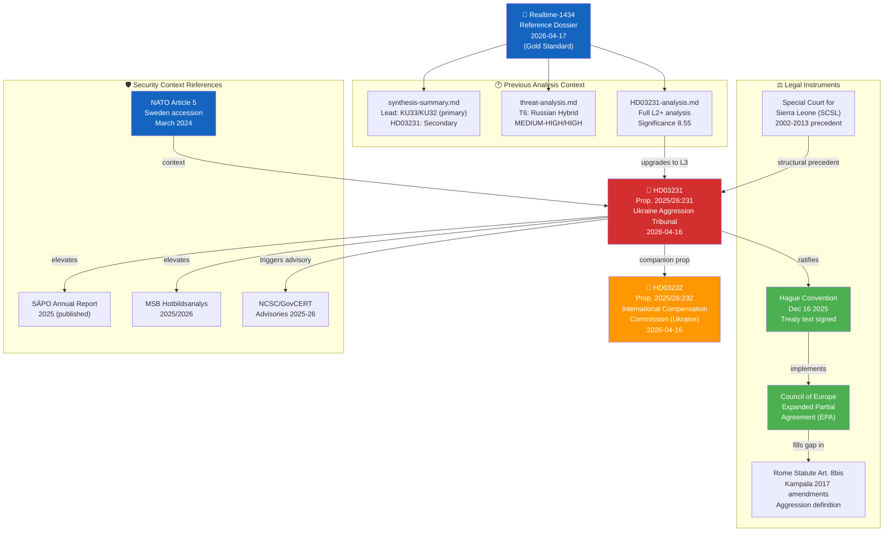

# Cross-Reference Map — Deep Inspection: HD03231 Ukraine Aggression Tribunal

| Field | Value |
|-------|-------|
| **XRF-ID** | XRF-2026-04-19-DI |
| **Analysis Date** | 2026-04-19 18:36 UTC |
| **Framework** | Cross-document intelligence map; reference ecosystem |
| **Primary Document** | HD03231 |
| **Validity Window** | Valid until 2026-05-03 |

---

## 🔗 Document Relationships

---

## 📚 Reference Documents & Citations

| Reference | Type | Relevance to HD03231 | Access |
|-----------|------|---------------------|:---:|
| `analysis/daily/2026-04-17/realtime-1434/documents/HD03231-analysis.md` | Prior AI analysis (L2+) | Gold-standard per-document analysis; this deep-inspection upgrades to L3 | Local |
| `analysis/daily/2026-04-17/realtime-1434/threat-analysis.md` | Prior threat analysis | T6 (Russian hybrid) at MEDIUM-HIGH/HIGH first established here | Local |
| `analysis/daily/2026-04-17/realtime-1434/synthesis-summary.md` | Prior synthesis | HD03231 as "Secondary" in realtime-1434; now LEAD in deep-inspection | Local |
| [ICC Rome Statute Art. 8bis](https://www.icc-cpi.int/sites/default/files/RS-Eng.pdf) | International treaty | Defines "crime of aggression"; Special Tribunal fills gap where ICC cannot act | External |
| [Council of Europe EPA framework](https://www.coe.int) | Institutional framework | HD03231 ratifies Sweden's accession to EPA structure | External |
| [SCSL Statute (2002)](https://www.rscsl.org) | Precedent | Hybrid international tribunal design; in absentia procedures | External |
| [NATO Art. 5 (Washington Treaty)](https://www.nato.int) | Strategic context | Sweden's collective-defence anchor; changes threat calculus | External |
| [MSB Hotbildsanalys 2025](https://www.msb.se) | Security context | Current Swedish security posture vs Russian hybrid threats | External |

---

## 🔄 Document Evolution Tracking

| Version | Date | Analysis Depth | Key Changes |
|---------|------|:---:|------------|
| Initial analysis | 2026-04-17 | L2+ Strategic | Security dimensions identified; T6 flagged MEDIUM-HIGH |
| **Deep-inspection** | **2026-04-19** | **L3 Intelligence Grade** | Full Kill Chain; Diamond Model; Attack Tree; 8-stakeholder SWOT; risk scored 20/25 for R1 |

---

## 🌐 Related Swedish Foreign Policy Instruments (Context Map)

| Instrument | Date | Relationship to HD03231 |
|-----------|------|------------------------|
| **NATO accession** | March 2024 | Security anchor; changes Russia threat calculus for HD03231 targeting |
| **Ukraine aid package** (annual) | 2022–2026 | Policy continuity; HD03231 is legal-institutional complement to aid |
| **HD03232 (Reparations Commission)** | 2026-04-16 | Companion proposition; EUR 260B immobilised Russian assets framework |
| **Swedish humanitarian aid to Ukraine** | 2022–2026 | Humanitarian track; HD03231 is accountability track |
| **GDPR/UD data protection** | Ongoing | UD data security is now relevant to tribunal planning security |
