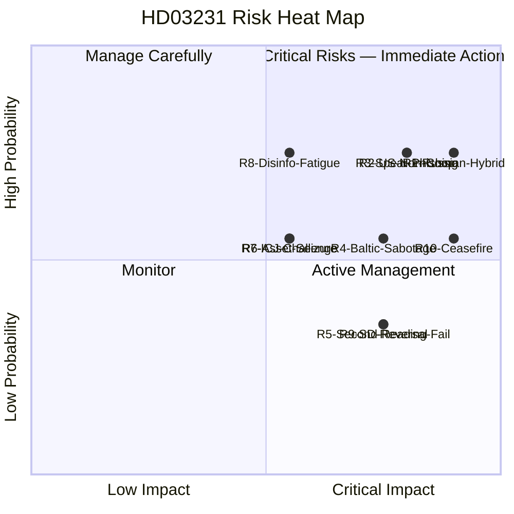

# Risk Assessment — Deep Inspection: HD03231 Ukraine Aggression Tribunal

| Field | Value |
|-------|-------|
| **RSK-ID** | RSK-2026-04-19-DI |
| **Analysis Date** | 2026-04-19 18:30 UTC |
| **Framework** | ISO 27005 + political risk methodology; probability × impact (1–5 scale) |
| **Primary Document** | HD03231 (Prop. 2025/26:231) |
| **Focus** | Russia, cyber, defence, Ukraine security dimensions |
| **Validity Window** | Valid until 2026-05-03 |

---

## 🎯 Risk Register — Priority Matrix

| Risk ID | Risk Description | Domain | Probability (1-5) | Impact (1-5) | Score | Risk Level | Action | Confidence |
|:---:|----------------|:---:|:---:|:---:|:---:|:---:|:---:|:---:|
| **R1** | Russian hybrid warfare (cyber + disinfo + sabotage) targeting Sweden as tribunal founding member | Russia/Security | 4 | 5 | **20** | CRITICAL | 🔴 MITIGATE | HIGH |
| **R2** | US non-cooperation with tribunal — evidentiary and enforcement gap | Institutional | 4 | 4 | **16** | HIGH | 🔴 MITIGATE | HIGH |
| **R3** | Spear-phishing / APT compromise of UD tribunal planning communications | Cyber | 4 | 4 | **16** | HIGH | 🔴 MITIGATE | HIGH |
| **R4** | Baltic Sea infrastructure sabotage correlated with tribunal milestones | Physical/Russia | 3 | 4 | **12** | HIGH | 🔴 MITIGATE | MEDIUM |
| **R5** | Tribunal second-reading vote failure (2027) if post-election Riksdag composition shifts | Domestic/Political | 2 | 4 | **8** | MEDIUM | 🟠 ACTIVE | MEDIUM |
| **R6** | Russian asset seizure targeting Swedish firms | Economic | 3 | 3 | **9** | MEDIUM | 🟡 MANAGE | MEDIUM |
| **R7** | ICJ jurisdictional challenge filed by Russia | Legal | 3 | 3 | **9** | MEDIUM | 🟡 MANAGE | MEDIUM |
| **R8** | Disinformation-driven Ukraine fatigue affecting second-reading consensus | Political | 4 | 3 | **12** | HIGH | 🔴 MITIGATE | HIGH |
| **R9** | SD reversal on Ukraine support — Nuremberg framing fails | Domestic | 2 | 4 | **8** | MEDIUM | 🟡 MONITOR | MEDIUM |
| **R10** | US-brokered ceasefire shields Russian leadership; tribunal effectiveness collapses | Geopolitical | 3 | 5 | **15** | HIGH | 🔴 MITIGATE | MEDIUM |

---

## 📊 Risk Heat Map

---

## 🔍 Deep Risk Profiles

### R1 — Russian Hybrid Warfare (Score: 20/25 — CRITICAL)

**Context**: Sweden's transition from Ukraine-supporter to co-founding-member of a tribunal targeting Putin/Gerasimov/Shoigu is the most significant qualitative shift in Sweden's threat posture since NATO accession (March 2024). Russia classifies tribunal-supporting states through a threat-actor matrix where "founding member with institutional durability" ranks higher than "arms supplier" (arms can be cut; institutional membership cannot be easily reversed).

**Evidence**:
- Russia designated Sweden "unfriendly state" (2022) `[HIGH]`
- Nordic cable sabotage incidents (Balticconnector gas pipeline Oct 2023; BCS East-1 data cable 2023; multiple Baltic incidents 2024) `[HIGH]`
- Russian disinformation operations targeting Scandinavian NATO debates (documented 2022–2024) `[HIGH]`
- Russian cyber operations against CoE/ICC-supporting states (Estonia 2007 DDoS; Ukraine 2015–16 grid attacks; Dutch MH17 investigation interference) `[HIGH]`
- GRU attribution to Nordic infrastructure sabotage by NATO intelligence assessment (classified; reported by Omni, SVT) `[MEDIUM]`

**Trajectory**: RISING. The threat lifecycle correlates with tribunal milestones:
- **Now** (pre-vote): Disinformation and intelligence-collection phase
- **Q2-Q3 2026** (first Riksdag vote): Intensified disinformation; possible cyber probe
- **Sep 2026** (election): Peak disinformation; potential physical incident
- **Q1-Q2 2027** (second vote): Infrastructure risk peak
- **H1 2027** (tribunal open): All-domain hybrid campaign potential

**Mitigation status**: 
- ✅ NATO Article 5 deterrence (armed attack threshold)
- ✅ SÄPO reinforced posture (post-NATO accession)
- ✅ MSB civil defence doctrine updated
- ❌ No specific tribunal-related uplift announced yet
- ❌ UD communications security not at classified-tribunal level

**Residual risk after mitigation**: MEDIUM-HIGH (4/25 → 12/25 with mitigations; below-threshold operations persist)

---

### R2 — US Non-Cooperation (Score: 16/25 — HIGH)

**Context**: The current US administration's posture toward international criminal accountability mechanisms (ICC, ICJ, multilateral tribunals) is historically reluctant. A second Trump term (2025–2029) creates systematic risk of non-cooperation — or active obstruction — at the tribunal's critical evidence-building phase.

**Evidence**:
- Trump administration withdrew from Paris Agreement; expressed hostility to ICC (2019–2020) `[HIGH]`
- Current (2025–26) US position on tribunal not yet publicly committed `[MEDIUM]`
- US intelligence holds critical signals intelligence relevant to aggression case (NSA intercepts, satellite imagery, SIGINT on Russian command decisions) `[HIGH]`
- Without US cooperation, evidentiary base for aggression-crime prosecution is significantly weakened `[HIGH]`

**Trajectory**: The risk increases rather than decreases as tribunal operations commence. The US cooperation question will become acute at the prosecutorial evidence-gathering phase (2027+).

**Mitigation**: EU intelligence pooling (INTCEN); UK/Australia Five Eyes sharing; national intelligence from Nordic/Baltic coalition; OSINT (open-source intelligence) is legally admissible for elements of aggression crime prosecution.

---

### R3 — APT Compromise of UD Communications (Score: 16/25 — HIGH)

**Context**: UD (Utrikesdepartementet) officials are conducting sensitive tribunal planning discussions through government IT systems that are not uniformly classified or isolated. APT29 (SVR Cozy Bear) has a documented pattern of targeting foreign ministry communications in NATO/CoE member states.

**Evidence**:
- APT29 SolarWinds campaign (2020) compromised 18,000 organisations including US State Dept `[HIGH]`
- APT29 Norwegian government email system compromise (2023) `[HIGH]`
- APT29 targeting of Microsoft 365 tenants via OAuth abuse (2024 Microsoft threat report) `[HIGH]`
- UD digital security baseline not publicly assessed at tribunal-planning sensitivity level `[MEDIUM]`

**Trajectory**: Active risk from the moment HD03231 was tabled (April 16, 2026). Tribunal planning correspondence is now a priority intelligence target.

**Mitigation**: GovCERT monitoring; NCSC hardening requirements; FIDO2 deployment (in progress per MSB cybersecurity programme). **Critical gap**: Tribunal planning communications should move to air-gapped classified systems immediately.

---

### R8 — Disinformation and Ukraine Fatigue (Score: 12/25 — HIGH)

**Context**: Russia's active measures infrastructure (IRA, GRU, foreign influence coordination) has demonstrated capability to shift public opinion in Nordic democracies. The 2026 Swedish election provides a uniquely exploitable opportunity: the second reading of HD03231 (ratifying tribunal founding membership) occurs after the election, meaning the newly elected Riksdag decides. If Russian disinformation can shift the election by even 2-3 percentage points toward parties more amenable to Ukraine fatigue narratives, the second reading becomes uncertain.

**Evidence**:
- Swedish public support for Ukraine aid: 60-70% (SOM/Novus polls 2022–2025) `[HIGH]`
- Russian disinformation infrastructure targeting Scandinavian languages (documented 2022–24) `[HIGH]`
- SD voter base shows higher Ukraine-fatigue susceptibility vs other party bases `[MEDIUM]`
- Budget pressures (2026 Swedish budget) create economic-cost narrative entry point `[MEDIUM]`

**Trajectory**: ESCALATING into valrörelse 2026. MSB prebunking capacity needs significant scale-up before September 2026.

---

## 📈 Risk Sensitivity Analysis

| Scenario | Affected Risks | Change | Overall Assessment |
|----------|---------------|--------|-------------------|
| **US rejoins international institutions** | R2 | −3 points | Score 16→13 (HIGH→MEDIUM-HIGH) |
| **Baltic cable incident pre-election** | R1, R8 | +2 each | Galvanising effect — actually strengthens pro-tribunal consensus |
| **Sweden election: left majority** | R5, R9 | R5 score +3 | KD/L/M lose — second reading risk increases |
| **Tribunal first indictment of Putin** | R1, R4, R6 | +2 each | Peak hybrid-response phase |
| **Russia-Ukraine ceasefire (Dec 2026)** | R10 | +2 | Political will may erode for second reading |
| **NCSC cybersecurity uplift for UD** | R3 | −4 points | Score 16→12 (HIGH→MEDIUM) |
