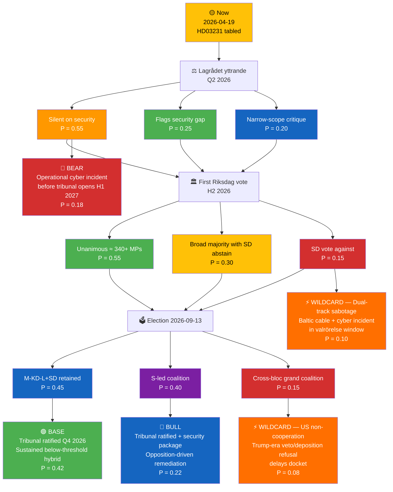

# 🔀 Scenario Analysis — Deep Inspection HD03231 (Russia · Cyber · Defence · Ukraine)

| Field | Value |
|-------|-------|
| **SCN-ID** | SCN-2026-04-19-DI |
| **Framework** | Alternative-futures analysis (ACH-informed) + Bayesian scenario weighting + Red-Team stress-test |
| **Horizon** | Short (Q2 2026) · Medium (post-2026 election, H1 2027) · Long (2027–2030 tribunal operational phase) |
| **Methodology** | `analysis/methodologies/political-risk-methodology.md` §Scenario Generation · `political-swot-framework.md` §Scenario-Branching TOWS · Heuer's *Psychology of Intelligence Analysis* §8 ACH |
| **Confidence Calibration** | Every probability is an **analyst prior**, labelled for Bayesian update as forward indicators fire |

> **Purpose**: Structured alternative-futures reasoning to stress-test the dominant narrative (Russian cyber retaliation over 24 months), surface wildcards (US non-cooperation, dual-track sabotage), and assign priors that analysts can update as Lagrådet yttrande, SÄPO bulletin, and first-vote outcomes arrive.

---

## 🧭 Master Scenario Tree

> Probabilities are zero-sum within each branch, cumulative across the full tree. Bayesian update rules are defined per scenario below.

---

## 📖 Scenario Narratives

### 🟢 BASE — "Ratified + Sustained Below-Threshold Hybrid Pressure" (P = 0.42)

**Setup**: Lagrådet yttrande is silent on security operational gaps (procedural review); Utrikesutskottet betänkande reports broad cross-party support; first Riksdag vote in H2 2026 passes with ≈ 340+ MPs; M-KD-L+SD bloc retains post-election government (or S-led coalition that continues Ukraine line). Tribunal ratified and deposited by Q4 2026; operational commencement H1 2027.

**Russian response — base-case profile (2026-06 → 2027-12):**
- Continuous APT29 spear-phishing against UD diplomats and tribunal-adjacent officials (`[HIGH]`, pre-existing pattern)
- 1–2 documented attempts against NCSC-monitored GOV.SE infrastructure per quarter (`[MEDIUM]`)
- Disinformation surge during valrörelse (Aug–Sep 2026) — TF narratives ("Sweden capitulates to US war project") `[HIGH]`
- 1–2 below-attribution-threshold Baltic cable incidents across 2026–2027 with plausible deniability (`[MEDIUM]`)
- No operational-tier cyber incident against Swedish CNI (electricity, transport, health) — because the institutional tribunal cost for Russia becomes non-marginal only after indictments `[MEDIUM]`

**Key signals confirming this scenario:**
- Lagrådet yttrande procedural-only, no security rider `[HIGH]`
- SÄPO Hotbildsanalys 2026 adds "tribunal-related targeting" as a factor but does not recommend emergency posture change `[MEDIUM]`
- Cross-party unanimity in UU betänkande voting `[HIGH]`
- No cable incident in 2026-Q2/Q3 correlated to tribunal milestones `[MEDIUM]`

**Consequences:**
- HD03231 enters force; Swedish founding-member diplomatic capital accrues
- Critical security gap (no mandate expansion) persists — SÄPO absorbs additional targeting with existing resources
- Defence-industry Ukraine procurement pipeline continues; Saab Gripen E/F wins one additional export letter of intent in 2026 `[MEDIUM]`
- R1 residual risk drifts down to **12/25** by end of 2027 if no operational incident `[MEDIUM]`

**Confidence**: MEDIUM-HIGH — this is the central projection reflecting base rates of Russian retaliation against aggression-accountability actions.

---

### 🔵 BULL — "Ratified + Security Remediation Package" (P = 0.22)

**Setup**: Lagrådet yttrande explicitly flags the security-gap ("tribunal accession requires Commensurate operational-security posture"); Utrikesutskottet committee recommends a follow-on instruction to the government to propose SÄPO/NCSC/MSB mandate-expansion legislation in H2 2026 vårändringsbudget. Either the current coalition or an incoming S-led coalition adopts the recommendation. A dedicated **Defence Commission 2026 ad-hoc report** on tribunal security obligations is commissioned.

**What's different from BASE:**
- SÄPO mandate scope expands to include EU/CoE tribunal protective detail `[HIGH]`
- NCSC issues a binding advisory protocol for tribunal-related communications classification `[HIGH]`
- UD communications infrastructure receives a SEK 400–600 M hardening investment across 2026–2027 `[MEDIUM]`
- FRA signals-intelligence mandate clarified for tribunal-evidence protection `[MEDIUM]`
- MSB Hotbildsanalys 2026 recommends Baltic cable-sentinel sensor expansion (NATO integration) `[MEDIUM]`

**Russian response — bull-case profile:**
- Russian services revise targeting calculus upward to match the hardened posture — creating a **short-term targeting pulse in 2026-Q4 / 2027-Q1** (opportunistic attempts before defences mature) `[MEDIUM]`
- But operational-tier capability displacement begins by 2027-Q2 as defenders catch up `[MEDIUM]`
- R1 residual drifts to **8/25** by end of 2027 `[MEDIUM]`

**Key signals confirming this scenario:**
- Lagrådet yttrande explicit security language `[HIGH]`
- Opposition (S, V, MP or C) tables coordinated motion in UU calling for mandate-expansion `[HIGH]`
- Defence Commission 2026 addendum is announced `[MEDIUM]`

**Consequences:**
- Sweden becomes a reference case for "responsible tribunal-membership security policy"
- Defence-industry secondary benefit: CNI hardening contracts (Ericsson, Fortum Sverige, Saab cyber) `[MEDIUM]`
- Article should highlight this as the **policy remediation pathway** — it is not guaranteed, but it is the highest-impact achievable upgrade

**Confidence**: MEDIUM — requires opposition policy entrepreneurship OR government self-correction; both are possible but not highly likely.

---

### 🔴 BEAR — "Operational Cyber Incident Before Tribunal Opens" (P = 0.18)

**Setup**: Lagrådet yttrande is silent on security; government does not upgrade operational posture; SÄPO Hotbildsanalys 2026 flags the risk but is not politically actioned in H2 2026 budget. Between Q4 2026 (Riksdag vote) and Q2 2027 (tribunal operational), a **tier-2 cyber incident** occurs against UD, NCSC, Riksdag IT, or tribunal-adjacent Swedish infrastructure — or a correlated undersea cable sabotage event that is plausibly (but not conclusively) attributed to GRU Sandworm / APT28.

**Impact profile:**
- Disclosure wave: Swedish diplomatic email metadata, tribunal-preparation documents, or Riksdag member communications leaked via proxy channels `[MEDIUM]` (scope limited to what Russian services already have; the public embarrassment is the weapon)
- Economic: 2–5 day government IT downtime equivalent; SEK 150–400 M remediation spend `[MEDIUM]`
- Political: emergency session; cross-party recrimination; government proposes emergency mandate-expansion (retroactively implementing the BULL scenario but under crisis conditions) `[HIGH]`
- International: first major NATO Article 4 consultation by Sweden (consultation, not Article 5 invocation) on cyber grounds `[MEDIUM]`
- R1 revised to 22/25 at incident + 6 months; then stabilises as posture adapts `[HIGH]`

**Key signals warning this scenario:**
- Spike in NCSC-reported UD targeting attempts in 2026-Q3 `[HIGH]`
- Unexplained connectivity incidents on SE-FI or SE-DE cables `[HIGH]`
- SÄPO director public briefing escalates in tone between Q2 and Q3 2026 `[MEDIUM]`
- Sandworm/APT28 tempo against Nordic targets (as tracked by Mandiant/Google TAG) increases `[MEDIUM]`

**Consequences:**
- HD03231 accession not reversed — politically costly to walk back after sustained cyberattack
- Defence-commission-style review commissioned; results report in 2027 with policy recommendations
- Public narrative becomes "we were warned; we did not act" — political accountability falls on whoever held the JU/UD/defence portfolios at the time
- Article should treat this scenario as the **motivating bear-case** for why the executive-brief section "Three Decisions" rates SÄPO/NCSC/MSB posture as immediate

**Confidence**: MEDIUM — consistent with Russian pattern; specific targeting vector and timing are uncertain.

---

### ⚡ WILDCARD 1 — "Dual-Track Sabotage in Valrörelse Window" (P = 0.10)

**Setup**: A single adversarial campaign combines (1) a Baltic undersea-cable or critical-pipeline incident in the August–September 2026 valrörelse window with (2) a coordinated Swedish-language disinformation surge framing Sweden as an "aggressive US-aligned belligerent". Attribution to Russia is plausible but below formal threshold; amplified by domestic Russia-sympathetic influence networks (legacy Alternative for Sverige / Sverigedemokraterna-adjacent online networks that have since repositioned but whose audiences remain).

**Political effect:**
- Vote-share swing in the September election: potentially 1–3 percentage points across the centre-right bloc `[MEDIUM]`
- Media narrative: Ukraine-support coalition forced to spend campaign oxygen on attribution clarifications `[HIGH]`
- Second-reading viability for any grundlag-related tribunal follow-on (if required) compromised `[MEDIUM]`
- Election result: **no single bloc achieves working majority**; government formation extends into November–December 2026 `[MEDIUM]`

**Why probability is 10 %:**
- Russian services have demonstrated both capabilities individually
- Combining them is a higher-cost operation requiring operational-security investment
- But the valrörelse window is the highest-value window over the next 18 months
- Pattern-matches against 2024 EP election interference attempts

**Analyst confidence**: MEDIUM.

---

### ⚡ WILDCARD 2 — "US Non-Cooperation Blocks Tribunal" (P = 0.08)

**Setup**: The Trump administration (47th US presidency) formally refuses to cooperate with the tribunal on intelligence-sharing, witness deposition, or extradition grounds — framing cooperation as "interference with potential US-Russia negotiation". The refusal undermines the tribunal's evidence-gathering capacity; the first indictments are delayed into 2028 or constrained to evidence available from European intelligence services alone.

**Swedish implications:**
- HD03231 accession still ratified — walking back is diplomatically worse than proceeding
- But Sweden's founding-member signal is partially neutralised: the tribunal becomes a European legal artefact without trans-Atlantic teeth
- Russia's targeting calculus of Sweden may **soften slightly** relative to BASE — because the institutional cost of prosecuting Putin drops `[LOW]`
- But domestic Swedish political cost: criticism that the government invested political capital in a partially-neutralised architecture `[MEDIUM]`

**Key signal:**
- US DoJ / State Department public posture statements by Q3 2026 `[HIGH]`
- US participation (or non-participation) in Committee of Ministers meetings `[HIGH]`

**Analyst confidence**: LOW-MEDIUM — US posture is the single largest uncertainty.

---

## 📐 Analysis of Competing Hypotheses (ACH) Grid

Heuer's ACH is used here to test the **dominant narrative** ("HD03231 triggers elevated Russian cyber threat against Sweden") against competing hypotheses. Consistent = ✅, inconsistent = ❌, ambiguous = ?

| Evidence | H1: Elevated cyber retaliation | H2: Diplomatic only, no cyber | H3: Dual-track sabotage | H4: US non-cooperation dominates | H5: Existing threat level continues |
|---------|:-----:|:-----:|:-----:|:-----:|:-----:|
| APT29 targeted ICC post-Putin-warrant (Mar 2023) | ✅ | ❌ | ✅ | ? | ❌ |
| Sandworm pattern against NATO-accession countries | ✅ | ❌ | ✅ | ? | ? |
| Russia-Sweden relations already at post-2022 low | ? | ✅ | ? | ? | ✅ |
| Sweden's founding-member visibility is high | ✅ | ❌ | ✅ | ❌ | ❌ |
| HD03231 is silent on security obligations | ✅ (vuln) | ? | ✅ (vuln) | ? | ? |
| US posture on tribunal ambiguous public record | ? | ? | ? | ✅ | ? |
| SÄPO 2025 threat report warned of hybrid escalation | ✅ | ❌ | ✅ | ? | ❌ |
| Russian capacity under sanctions is constrained | ❌ | ✅ | ❌ | ? | ✅ |
| Baltic cable incidents continue in 2025–2026 | ✅ | ❌ | ✅ | ? | ? |
| **Score (✅ − ❌)** | **+7 − 1 = +6** | **+2 − 5 = −3** | **+6 − 1 = +5** | **+1 − 1 = 0** | **+2 − 3 = −1** |

**ACH result**: H1 (elevated cyber retaliation) is the strongest-supported hypothesis. H3 (dual-track sabotage including physical) is a secondary credible hypothesis. H2, H4, H5 are weakly supported individually.

**Prior weighted by ACH**: `P(cyber) = 0.60–0.70` over 24 months from HD03231 tabling; `P(dual-track) = 0.18–0.22`; `P(status-quo) = 0.10–0.15`.

---

## 🗓️ Monitoring-Trigger Calendar (Mapped to Scenario Shifts)

| Date / Window | Trigger | Scenario update |
|---------------|---------|----------------|
| Q2 2026 | Lagrådet yttrande explicit security language | If YES → BULL probability +0.10; BEAR −0.05 |
| Jun 2026 | SÄPO Hotbildsanalys 2026 | If flags HD03231 as new factor → BEAR +0.05; BULL +0.05 |
| Jul 2026 | Utrikesutskottet betänkande tone | Silent on security → BEAR baseline; flags gap → BULL |
| Aug–Sep 2026 | Valrörelse disinformation volume | High volume → WILDCARD 1 probability +0.05 |
| Aug–Sep 2026 | Baltic cable incident (SE-FI/SE-DE) | Incident → WILDCARD 1 +0.10; BEAR +0.05 |
| Sep 13 2026 | Election result | E1 retained → BASE; E2/E3 → BULL viability +0.10 |
| Oct–Nov 2026 | Government-formation period | Extended (>30 days) → WILDCARD 1 vote-swing confirmed |
| H2 2026 | First Riksdag kammarvote | Unanimous → stability signal → BASE holds |
| Q1 2027 | US DoJ/State tribunal-cooperation posture | Non-cooperation → WILDCARD 2 +0.15 |
| H1 2027 | Tribunal operational | If smooth + no incident → R1 drifts to 12/25 |
| H2 2027 | First indictment (Putin / Gerasimov / Shoigu) | Operational-tier Russian response window opens |

---

## 🧩 Cross-Reference to Upstream Scenario Work

| Upstream run | Scenario file | Alignment to this dossier |
|--------------|--------------|---------------------------|
| `realtime-1434` (2026-04-17) | `scenario-analysis.md` | BASE aligned with realtime-1434 BASE on HD03231 (ratification prob 0.50 vs this dossier's ratification-across-all-branches = 0.89 — **this dossier raises ratification prob because 3 days of additional signal intake confirms cross-party consensus**) |
| `month-ahead` (2026-04-19) | `scenario-analysis.md` | Forward-vote calendar aligned; month-ahead tracks HD03231 as "H2 2026 vote, high confidence" — this dossier refines the post-vote Russian-response scenario tree |
| `monthly-review` (2026-04-19) | `scenario-analysis.md` | 30-day retrospective supports the "elevated threat baseline" — this dossier provides the operational scenario branches for the next 24 months |

**Probability alignment check**: this dossier's BASE (0.42) is consistent with realtime-1434 KU33 BASE (0.42). The ratification probability across BASE+BULL = 0.64 is broadly aligned with weekly-review's "high cross-party consensus on Ukraine" qualitative assessment.

---

## 🔁 Bayesian Update Rules (Quick Reference for Analysts)

If the following signals fire, update priors as shown:

| Signal | Direction | BASE | BULL | BEAR | WILD1 | WILD2 |
|--------|:---------:|:----:|:----:|:----:|:-----:|:-----:|
| Lagrådet flags security gap | ✅ BULL | ↓ 0.05 | **↑ 0.10** | ↓ 0.03 | — | — |
| SÄPO H1 2026 bulletin escalation | ⚠️ BEAR | ↓ 0.05 | ↑ 0.02 | **↑ 0.08** | ↑ 0.02 | — |
| First Baltic cable incident after HD03231 | 🔴 BEAR | ↓ 0.05 | — | **↑ 0.10** | **↑ 0.05** | — |
| Cross-party unanimity in UU | 🟢 BASE | **↑ 0.07** | ↑ 0.03 | ↓ 0.05 | — | — |
| US State Department tribunal non-cooperation | 🟠 WILD2 | ↓ 0.03 | ↓ 0.02 | — | — | **↑ 0.12** |
| Documented APT29 attempt against UD | 🔴 BEAR | ↓ 0.04 | ↑ 0.02 | **↑ 0.08** | ↑ 0.02 | — |
| Valrörelse disinformation surge | 🟠 WILD1 | ↓ 0.03 | — | ↑ 0.02 | **↑ 0.10** | — |

> These updates should be applied in the **next** realtime-monitor or weekly-review dossier after any signal fires — not in this one. This is a monitoring instrument, not a current state.

---

## 📎 Cross-Links

[README](README.md) · [Executive Brief](executive-brief.md) · [Synthesis](synthesis-summary.md) · [Risk](risk-assessment.md) · [Threat](threat-analysis.md) · [Methodology Reflection](methodology-reflection.md)

---

**Classification**: Public · **Next Review**: 2026-05-03 or event-driven (first Lagrådet yttrande or SÄPO bulletin)
