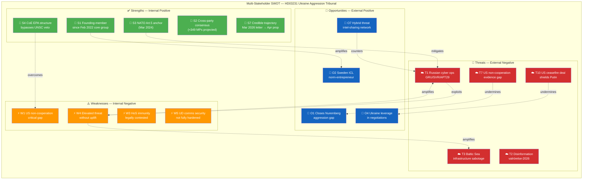

# SWOT Analysis — Deep Inspection: HD03231 Ukraine Aggression Tribunal

| Field | Value |
|-------|-------|
| **SWOT-ID** | SWT-2026-04-19-DI |
| **Analysis Date** | 2026-04-19 18:25 UTC |
| **Framework** | political-swot-framework v3.0 (TOWS interference applied) · Security-enhanced for Russia/cyber/defence lens |
| **Primary Document** | HD03231 (Prop. 2025/26:231) |
| **Focus** | Russia, cyber threat, defence, Ukraine — security dimensions |
| **Produced By** | news-article-generator (deep-inspection) |
| **Validity Window** | Valid until 2026-05-03 |

---

## 🏛️ Multi-Stakeholder SWOT Analysis

### Framework Note

The deep-inspection SWOT applies three stakeholder lenses simultaneously:
1. **Swedish Government** (policy owner, HD03231 promoter)
2. **Parliamentary/Opposition** (constitutional authorisation actors)
3. **Civil Society/Security Apparatus** (implementation and defence actors)

---

## ✅ Strengths

### Strengths — Swedish Government Perspective

| # | Strength | Evidence | Confidence | Impact |
|---|---------|----------|:---:|:---:|
| **S1** | Sweden is a **founding member** — not merely a participant — meaning Sweden shapes institutional design, rules of procedure, and prosecutorial priorities from day one | HD03231 text; FM Stenergard press release; "core group" participation since Feb 2022 | HIGH | CRITICAL |
| **S2** | **Cross-party political unanimity** (≈349/349 MPs projected) — KU33 shows splits, but Ukraine accountability commands near-consensus; this insulates the proposition from populist reversal | Stakeholder position matrix; SD Nuremberg-framing compatibility | HIGH | HIGH |
| **S3** | **NATO Article 5 anchor** (since Mar 2024) means Sweden's tribunal co-founding occurs within a collective-defence framework — hybrid attacks below armed-attack threshold are partially deterred | RF 10 kap.; NATO Charter Art. 5; SACEUR guidelines | HIGH | HIGH |
| **S4** | **Council of Europe EPA structure** avoids need for UNSC approval — the single most important legal innovation; circumvents Russian veto | HD03231 legal analysis; CoE EPA statute | HIGH | CRITICAL |
| **S5** | FM Stenergard's **Nuremberg framing** is rhetorically cross-partisan — unifies conservative law-and-order base with liberal internationalist base; SD cannot oppose without opposing Nuremberg legacy | Stenergard verbatim; historical analysis | HIGH | MEDIUM |
| **S6** | **Low direct fiscal cost** — EPA assessed dues estimated SEK 30–80M annually; reparations architecture (HD03232) funded from Russian immobilised assets (EUR 260B), not Swedish treasury | HD03231 financial annex; HD03232 text | MEDIUM | MEDIUM |
| **S7** | **Signalling credibility**: Sweden was part of the core working group since February 2022, signed letter of intent March 2026, and now tables founding-member legislation — the commitment trajectory is consistent and verifiable | FM press release timeline | HIGH | HIGH |

### Strengths — Parliamentary/Democratic Perspective

| # | Strength | Evidence | Confidence | Impact |
|---|---------|----------|:---:|:---:|
| **S8** | **Two-chamber democratic legitimacy** — unlike executive orders, Riksdag ratification gives the tribunal commitment constitutional durability | RF 10 kap. treaty approval | HIGH | HIGH |
| **S9** | **Bipartisan geopolitical consensus** cuts across normal coalition/opposition dynamics — the vote on HD03231 will not cleave M vs S but will demonstrate Swedish democratic coherence to international partners | Stakeholder analysis; Swedish foreign-policy tradition | HIGH | HIGH |

### Strengths — Security Apparatus Perspective

| # | Strength | Evidence | Confidence | Impact |
|---|---------|----------|:---:|:---:|
| **S10** | **SÄPO and MSB already operate at elevated posture** post-NATO accession; tribunal co-founding is an incremental rather than step-change addition to threat exposure | MSB Hotbildsanalys 2025; SÄPO annual report 2025 | MEDIUM | MEDIUM |
| **S11** | NATO CCDCOE (Tallinn), StratCom COE (Riga), and JFC Norfolk provide allied intelligence-sharing that partially compensates for Sweden's bilateral operational gap vs Russia | NATO framework; bilateral intelligence relationships | HIGH | HIGH |

---

## ⚠️ Weaknesses

| # | Weakness | Evidence | Confidence | Impact |
|---|---------|----------|:---:|:---:|
| **W1** | **Tribunal effectiveness fundamentally depends on non-member cooperation** — Russia, US (currently), China, and India are not members. Without US cooperation, evidence access, enforcement mechanisms, and asset-seizure coordination are severely constrained | ICC effectiveness literature; tribunal statute; US historical position on ICL | HIGH | CRITICAL |
| **W2** | **In absentia proceedings** — the tribunal will function without the accused present. Historical precedent (SCSL) shows this is legally viable but limits political impact; Putin/Gerasimov will not appear, making the tribunal partly symbolic | SCSL comparative analysis; tribunal statute | HIGH | HIGH |
| **W3** | **Sitting head-of-state immunity** under customary international law (ICJ *Arrest Warrant* 2002) may protect current Russian leadership — the tribunal's design partially addresses this, but legal uncertainty remains | ICJ 2002 DRC v Belgium; Rome Statute Art. 27; Art. 98 | MEDIUM | HIGH |
| **W4** | **Russia-facing hybrid threat increased without commensurate counter-capability uplift** — HD03231 elevates Sweden's targeting priority in Russian threat-actor classification, but the Riksdag vote and public debate do not include a compensating security-investment announcement | SÄPO threat assessment; MSB capacity analysis | MEDIUM | HIGH |
| **W5** | **UD communications security** is not systematically hardened against state-sponsored spear-phishing at the level required by the tribunal's operational sensitivity — tribunal-planning communications (witness lists, evidence handling, prosecutorial strategy) may be vulnerable | GovCERT assessment pattern; comparative APT analysis | MEDIUM | MEDIUM |
| **W6** | **Global South buy-in is limited** — the tribunal's legitimacy (and thus deterrent value) depends on broad adherence; many African, Asian, and Latin American states see the ICC and associated mechanisms as Western instruments | UNGA vote analysis on Ukraine accountability; African Union position | HIGH | MEDIUM |

---

## 🚀 Opportunities

| # | Opportunity | Evidence | Confidence | Impact |
|---|------------|----------|:---:|:---:|
| **O1** | **Closes the Nuremberg Gap** — establishes that aggression by a UNSC P5 member can be prosecuted; durable precedent for 21st-century ICL | Legal analysis; tribunal statute comparison | HIGH | CRITICAL |
| **O2** | **Sweden as ICL norm-entrepreneur** — tribunal co-founding enhances Sweden's international standing in areas (UN Human Rights Council, international arbitration, ICC Assembly of States) where credibility requires demonstrated commitment | Comparative norm-entrepreneurship analysis | HIGH | HIGH |
| **O3** | **Reconstruction positioning** — founding membership in tribunal signals sustained political commitment to Ukraine that enhances Saab, Ericsson, Volvo, and other Swedish firms' competitive positioning for Ukraine reconstruction contracts (estimated EUR 500B+ over 10 years) | WB/EBRD reconstruction estimates; procurement patterns | MEDIUM | MEDIUM |
| **O4** | **Strengthens Ukrainian leverage** — operational tribunal is a deterrent against ceasefire terms that shield Russian leadership from accountability; Sweden's founding role supports Ukraine's negotiating position | Ceasefire scenario analysis | HIGH | HIGH |
| **O5** | **Baltic Sea security benefit** — tribunal signals to Russia that NATO eastern flank states coordinate not just militarily but through international law; reduces ambiguity about Western resolve | NATO cohesion analysis | MEDIUM | HIGH |
| **O6** | **Defence industry catalyst** — the tribunal's visibility creates political space for further Saab Gripen E sales to Ukraine, Carl-Gustaf deliveries, AT4 anti-tank system transfers; the legal-moral framing reduces domestic political friction for weapon transfers | Swedish defence export policy | MEDIUM | MEDIUM |
| **O7** | **Hybrid threat intelligence sharing opportunity** — Sweden can leverage tribunal-membership relationships with ~40 CoE EPA member states for structured intelligence sharing on Russian hybrid operations targeting tribunal-supporting states | CoE framework; Five Eyes / EU intelligence corridors | MEDIUM | HIGH |

---

## 🔴 Threats

### Threats — Russia/Hybrid Dimension (Focus Lens)

| # | Threat | Probability | Impact | Priority | Confidence |
|---|-------|:---:|:---:|:---:|:---:|
| **T1** | **Cyber operations against Swedish government infrastructure** — GRU/SVR APTs (Sandworm, APT29, Gamaredon) will escalate targeting of UD, Riksdag IT, NCSC, and Försvarsmakten following HD03231 ratification | MEDIUM-HIGH | HIGH | 🔴 MITIGATE | HIGH |
| **T2** | **Disinformation campaign targeting valrörelse-2026** — Russia's IRA/GRU active measures will embed anti-tribunal, anti-Ukraine-aid narratives in Swedish social media; SD voter base is primary target for narrative seeding | HIGH | MEDIUM-HIGH | 🔴 MITIGATE | HIGH |
| **T3** | **Baltic Sea infrastructure sabotage** — undersea cables (SE-FI Estlink, SE-DE Balticconnector-analogue), rail infrastructure, and logistics nodes are potential targets for "plausibly deniable" sabotage operations correlated with tribunal milestones | MEDIUM | HIGH | 🔴 MITIGATE | MEDIUM |
| **T4** | **Diplomatic isolation pressure** — Russia will leverage relationships with non-Western partners to build a coalition opposing the tribunal's legitimacy; each state defection from tribunal support reduces effectiveness | HIGH | MEDIUM | 🟠 ACTIVE | HIGH |
| **T5** | **Economic retaliation against Swedish firms** — Russian government can seize/restrict assets of Swedish companies with remaining Russia exposure (post-2022 exits were not complete; legacy contracts remain) | MEDIUM | MEDIUM | 🟡 MANAGE | MEDIUM |
| **T6** | **Assassination/targeted harassment of Swedish tribunal officials** — historical Russian pattern (Salisbury 2018, Navalny 2020/2024, multiple Baltic/Nordic incidents) elevates personal security risk for tribunal architects | LOW-MEDIUM | HIGH | 🟡 MANAGE | MEDIUM |

### Threats — Legal/Institutional Dimension

| # | Threat | Probability | Impact | Priority | Confidence |
|---|-------|:---:|:---:|:---:|:---:|
| **T7** | **US refusal to cooperate** — a second Trump term (2025-2029) creates systematic US non-cooperation with international criminal accountability mechanisms; without US intelligence, evidence base is severely weakened | HIGH | CRITICAL | 🔴 MITIGATE | HIGH |
| **T8** | **Jurisdictional challenge at ICJ** — Russia could seek an ICJ advisory opinion or contentious case arguing the tribunal lacks jurisdiction; even a partial ICJ ruling against the tribunal would be a significant setback | MEDIUM | HIGH | 🟠 ACTIVE | MEDIUM |
| **T9** | **Tribunal funding shortfall** — if major contributors withdraw or reduce assessed dues, tribunal operations could be curtailed before indictments are issued | MEDIUM | MEDIUM | 🟡 MANAGE | MEDIUM |
| **T10** | **Trump administration recognition of Russian territorial gains** — a US-brokered ceasefire that "freezes" Russian occupation could fatally undermine the political will to prosecute aggression that ended with a US-negotiated settlement | MEDIUM | CRITICAL | 🔴 MITIGATE | MEDIUM |

---

## 🔄 TOWS Interference Analysis

| Interaction | Type | Mechanism | Strategic Response |
|-------------|:----:|-----------|-------------------|
| **S1 × T1**: Founding-member status elevates cyber-targeting priority | S–T | GRU/SVR classify Sweden as Tier-1 tribunal target; UD and NCSC now face enhanced APT operations | SÄPO/NCSC immediate posture review; NATO CCDCOE bilateral engagement |
| **S4 × W1**: EPA design circumvents UNSC but cannot enforce against non-members | S–W | Structural limitation persists despite legal innovation | EU leverage via SWIFT/sanctions to incentivise cooperation |
| **S3 × T7**: NATO Art. 5 partially compensates for US non-cooperation on ICL | S–T | Alliance intelligence-sharing partially fills evidentiary gap | Five Eyes bilateral intelligence-sharing arrangement |
| **O7 × T1**: Tribunal intelligence-sharing network enables faster APT attribution | O–T | CoE EPA member-state network creates structured threat-intel sharing channel | Formalise cyber-threat intel sharing among EPA members |
| **W4 × T1+T3**: Elevated threat without compensating security uplift creates window of vulnerability | W–T | Sweden's threat posture increases before defensive measures are fully scaled | Emergency NCSC/MSB funding allocation; NATO force posture review |
| **S7 × T4**: Commitment credibility reduces Russia's ability to deter through pre-ratification coercion | S–T | Russia cannot credibly threaten to reverse HD03231 before vote; coercion window is short | Accelerate parliamentary vote timeline |

---

## 📊 SWOT Quadrant Map (Color-Coded Mermaid)

