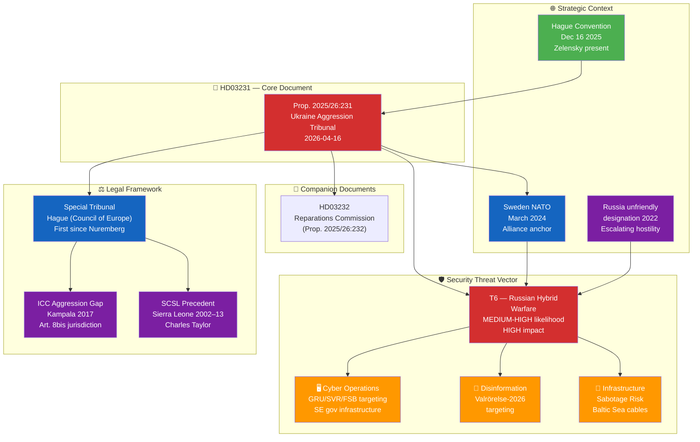

# Synthesis Summary — Deep Inspection: HD03231 Ukraine Aggression Tribunal

| Field | Value |
|-------|-------|
| **SYN-ID** | SYN-2026-04-19-DI |
| **Run** | news-article-generator deep-inspection |
| **Analysis Date** | 2026-04-19 18:18 UTC |
| **Produced By** | news-article-generator (Claude Sonnet 4.6) |
| **Methodologies Applied** | ai-driven-analysis-guide v5.1, political-swot-framework, political-risk-methodology, political-threat-framework, STRIDE, Kill-Chain Adaptation |
| **Primary Documents** | HD03231 (Prop. 2025/26:231 — Ukraine Aggression Tribunal) |
| **Reference Analyses** | analysis/daily/2026-04-17/realtime-1434/ (gold-standard dossier) |
| **Focus Topic** | Russia, cyber threat, defence, Ukraine — security dimensions of HD03231 |
| **Overall Confidence** | HIGH |
| **Data Freshness** | HD03231 tabled 2026-04-16 — FRESH (3 days old) |
| **Validity Window** | Valid until 2026-05-03 |
| **Documents Analyzed** | 1 primary (HD03231) + 1 companion (HD03232) + reference dossier (6 docs) |
| **Analysis Depth** | L3 — Intelligence Grade (deep-inspection tier) |

---

## 🎯 Executive Summary

Sweden's Proposition 2025/26:231 (`HD03231`) formally proposes accession to the **Expanded Partial Agreement (EPA) for the Special Tribunal for the Crime of Aggression against Ukraine** — the first criminal tribunal established to prosecute the crime of aggression since the Nuremberg International Military Tribunal (1945–46). Tabled by Foreign Minister **Maria Malmer Stenergard (M)** and PM **Ulf Kristersson (M)** on 2026-04-16, the proposition places Sweden as a **founding member** of an institution directly targeting **Russian political and military leadership** for the February 2022 invasion of Ukraine.

From the **Russia, cyber threat, and defence** analytical lens, this action triggers four analytically distinct but interconnected security consequences:

1. **Elevated hybrid-warfare targeting**: Sweden's transition from Ukraine-supporter to founding-tribunal-member represents a qualitative escalation in Sweden's threat exposure. Russian GRU, SVR, and FSB have a documented pattern of conducting cyber operations, disinformation campaigns, and infrastructure sabotage against states taking concrete judicial-accountability steps against Russia. `[HIGH]`

2. **Critical national infrastructure at elevated risk**: The NATO-accession period (March 2024–present) combined with the tribunal co-founding creates compound targeting incentives. Swedish CNI — Försvarsmakten networks, NCSC-monitored governmental IT, MSB crisis communication infrastructure, Riksdag IT, and UD communications — should be assessed at ELEVATED posture. `[MEDIUM-HIGH]`

3. **Defence industry signalling and counter-positioning**: Saab AB (Gripen, Carl-Gustaf, AT4), Nammo (ammunition), and BAE Systems Bofors (artillery) benefit from enhanced Ukraine procurement relationship. Russia's economic retaliation will likely target Swedish export markets and asset holdings in Russia — not military-industrial capacity. `[MEDIUM]`

4. **Strategic irreversibility and deterrence value**: Unlike policy commitments (arms deliveries, aid packages), founding membership in an international tribunal is **constitutionally binding** and institutionally resistant to reversal. This is the security-relevant asymmetry: the commitment mechanism is stronger than Russia's ability to coerce reversal through below-threshold hybrid operations. `[HIGH]`

### Lead Story Assessment

| Lens | Significance | Confidence |
|------|:---:|:---:|
| Russia/hybrid threat | CRITICAL | HIGH |
| Cyber threat to Sweden | HIGH | HIGH |
| Defence implications | HIGH | MEDIUM |
| Ukraine accountability | CRITICAL | HIGH |
| International criminal law | CRITICAL | HIGH |
| Electoral/domestic | MEDIUM | MEDIUM |

**Recommended framing for publication**: The security-dimension story is the **most underreported angle** — most coverage focuses on the legal-historical Nuremberg frame. The deep-inspection value-add is the **threat intelligence perspective**: what does founding membership mean for Sweden's threat posture, and how does it integrate with post-NATO security architecture?

---

## 🏛️ Lead Document: HD03231

| Field | Value |
|-------|-------|
| **Dok ID** | HD03231 |
| **Title** | *Sveriges anslutning till den utvidgade partiella överenskommelsen för den särskilda tribunalen för aggressionsbrottet mot Ukraina* |
| **Type** | Proposition (Prop. 2025/26:231) |
| **Companion** | HD03232 (Reparations Commission — Prop. 2025/26:232) |
| **Date** | 2026-04-16 |
| **Department** | Utrikesdepartementet |
| **Responsible Minister** | Maria Malmer Stenergard (M) — Foreign Minister |
| **Raw Significance** | **9/10** |
| **Depth Tier** | L3 Intelligence Grade (deep-inspection) |
| **Security Classification** | PUBLIC but HIGH strategic sensitivity |

---

## 🗺️ Document Intelligence Map

---

## 📅 Chronological Framework — HD03231 Timeline

| Date | Event | Significance |
|------|-------|-------------|
| **Feb 24 2022** | Russia's full-scale invasion of Ukraine | Trigger event |
| **Feb 2022+** | Sweden joins core working group on aggression tribunal | Foundational role established |
| **Mar 2024** | Sweden joins NATO (Article 5) | Security anchor — changes threat calculus |
| **Mar 2026** | Sweden signs letter of intent as founding member | Pre-accession commitment |
| **Apr 16 2026** | Riksdag proposition HD03231 tabled | **This document** |
| **Q2–Q3 2026** | Committee review (Utrikesutskottet) | Parliamentary processing |
| **Sep 2026** | General Election (Riksdag val) | Political context |
| **H2 2026** | Projected Riksdag kammar vote (first reading) | Constitutional authorisation |
| **H1 2027** | Tribunal operations commence | Operational activation |
| **2027+** | First docket opens — potential indictments | Putin/Gerasimov accountability trigger |

---

## 🎖️ Strategic Assessment: Security Implications of HD03231

### Why HD03231 Elevates Sweden's Threat Posture

**HD03231 is not just a legal document — it is a strategic signal of permanent adversarial positioning toward Russia's leadership.** Unlike arms deliveries (which can be wound down) or sanctions (which have diplomatic exit ramps), founding membership in a criminal tribunal targeting Putin, Gerasimov, and Shoigu by name (effectively) is **institutionally irreversible** under international law once ratified.

Russia's FSB/GRU threat calculus will process HD03231 through three analytical frames:

1. **Norm-setting impact**: If the tribunal succeeds, it establishes aggression as prosecutable regardless of UNSC veto — fundamentally threatening Russia's impunity shield. Sweden's founding role amplifies the norm.

2. **Coalition-building threat**: Sweden's founding membership signals to the Global South that a concrete European-led accountability track exists outside the ICC framework. This undermines Russia's strategy of exploiting non-Western ICC scepticism.

3. **Escalation signal**: Sweden has crossed from "supporter" to "founder" — a qualitative threshold in Russian threat-actor classification. This maps to increased probability of Tier 2 (cyber) and Tier 3 (infrastructure/supply chain) operations.

### Russia's Likely Response Toolkit

| Response Type | Probability | Target | Attribution Challenge | Deterrent |
|--------------|:--:|--------|:--:|---------|
| **Disinformation** — valrörelse-targeted | HIGH | Swedish public opinion, SD voters | HIGH | MSB/StratCom |
| **Cyber ops** — governmental IT | MEDIUM-HIGH | UD, Riksdag, NCSC | HIGH | NCSC hardening |
| **Phishing** — diplomat/official targeting | HIGH | UD officials, tribunal staff | MEDIUM | GovCERT |
| **Infrastructure sabotage** — Baltic cables | MEDIUM | Undersea cables (SE-FI, SE-DE) | HIGH | NATO MARCOM |
| **Economic retaliation** — SE firms in Russia | MEDIUM | Saab (civil), Volvo, Ericsson | LOW | EU sanctions |
| **Proxy information operations** | HIGH | Pro-Russia domestic voices | HIGH | Digital literacy |

`[HIGH confidence on disinformation trajectory; MEDIUM confidence on cyber/physical targeting probability]`

---

## 5W Deep Analysis

### WHO
**Primary actors**: PM Ulf Kristersson (M) and FM Maria Malmer Stenergard (M) as authors and political owners. Sweden as founding member joins approximately 40+ Council of Europe member states in the EPA framework. The tribunal itself will ultimately target Russian President Vladimir Putin, Defence Minister Sergei Shoigu (now Security Council Secretary), and CJGS Valery Gerasimov.

**Affected stakeholders**: SÄPO (Swedish Security Police) — operational response; MSB (Civil Contingencies Agency) — hybrid threat; NCSC (National Cyber Security Centre) — cyber defence; Försvarsmakten — military intelligence; Swedish companies in Russia (Saab civil div, Volvo, Ericsson, IKEA legacy) — economic retaliation exposure; Ukrainian diaspora in Sweden (~50,000) — judicial representation.

### WHAT
Sweden becomes a **founding member** of the world's first dedicated tribunal for the crime of aggression since Nuremberg. The tribunal operates under a **Council of Europe Expanded Partial Agreement** — a legal innovation circumventing UNSC deadlock (Russia's veto blocks ICC aggression jurisdiction over P5 members). Sweden commits to: EPA membership dues (est. SEK 30–80M annually), full cooperation with tribunal subpoenas and evidence requests, extradition regime activation (no immunity for accused).

### WHEN
**Immediate** (Apr 2026): Proposition tabled; SÄPO/NCSC posture should be assessed now. **Q2-Q3 2026**: Committee review and first Riksdag vote. **Sep 2026**: Swedish election — second reading timing post-election. **H1 2027**: Tribunal opens; Russian response escalates to operational phase.

### WHERE
**Legal**: The Hague, Netherlands — tribunal seat. **Political**: Stockholm — Riksdag vote; Brussels — EU foreign-policy coordination. **Operational**: Sweden's CNI (governmental IT, energy grid, telecommunications, undersea cables in Baltic Sea). **Strategic**: Global norm-setting for ICL accountability outside UNSC.

### WHY
1. **Legal**: Fills the "aggression gap" in the ICC Rome Statute (Kampala 2017 amendments exclude P5 members from ICC aggression jurisdiction without their consent)
2. **Strategic**: Irreversibly commits Sweden to Russian accountability track — insurance against future Western wavering
3. **Domestic**: Cross-party political unanimity (≈349 MPs projected) — rare governance moment
4. **Security**: NATO framework requires Sweden to align on collective defence commitments; tribunal co-founding is the diplomatic complement to Article 5
5. **Historical**: Genuine Nuremberg framing — Sweden positions as norm-entrepreneur in the 21st-century iteration of post-WWII order construction

### WINNERS & LOSERS

| Actor | Outcome | Mechanism | Confidence |
|-------|:---:|---------|:---:|
| **Ukraine (Zelensky government)** | 🏆 WIN | Founding member secured; accountability mechanism operational | HIGH |
| **Swedish diplomatic corps (UD)** | 🏆 WIN | International standing, tribunal leadership roles | HIGH |
| **Swedish defence industry (Saab, BAE Bofors)** | ✅ NET POSITIVE | Ukraine relationship deepens procurement; tribunal signals sustained engagement | MEDIUM |
| **SÄPO/NCSC/MSB** | 🟡 INCREASED MANDATE | Elevated threat = elevated budget justification | HIGH |
| **Swedish civil society (Amnesty, Civil Rights Defenders)** | 🏆 WIN | Accountability mandate fulfilled | HIGH |
| **Russia (Putin/Kremlin)** | 🔴 LOSS | Accountability mechanism directly targeting leadership | HIGH |
| **Swedish firms in Russia** | 🔴 EXPOSURE | Potential retaliation target (asset freezes, market exclusion) | MEDIUM |
| **SD voters (Russia-adjacent)** | 🟡 NEUTRAL-NEGATIVE | Tribunal forces SD to maintain Ukraine-support position | MEDIUM |
| **Global South states** | 🟡 MIXED | Some see positive accountability norm; others see Western selectivity | MEDIUM |

---

## 🔮 Forward Indicators (Monitoring Triggers)

| Indicator | Timeline | Significance | Action |
|-----------|---------|-------------|--------|
| SÄPO annual threat report (2026 edition) | H1 2026 | Will Sweden's tribunal role appear as new factor? | Read carefully |
| MSB Hotbildsanalys 2026 | Q2 2026 | Russian hybrid threat to Sweden updated assessment | Monitor |
| Nordic cable incident (Baltic Sea) | Continuous | Correlation with tribunal timeline = strong attribution signal | Escalate |
| NCSC cyber bulletin spike | Continuous | Increased phishing/intrusion attempts against UD | Response |
| Riksdag vote on HD03231 | Q2-Q3 2026 | First reading — SD position diagnostic | Monitor |
| Trump administration position | Q2 2026 | US cooperation with tribunal affects effectiveness | Key risk |
| Tribunal first indictment | H1–H2 2027 | Russian response will escalate at this moment | Prepare |
