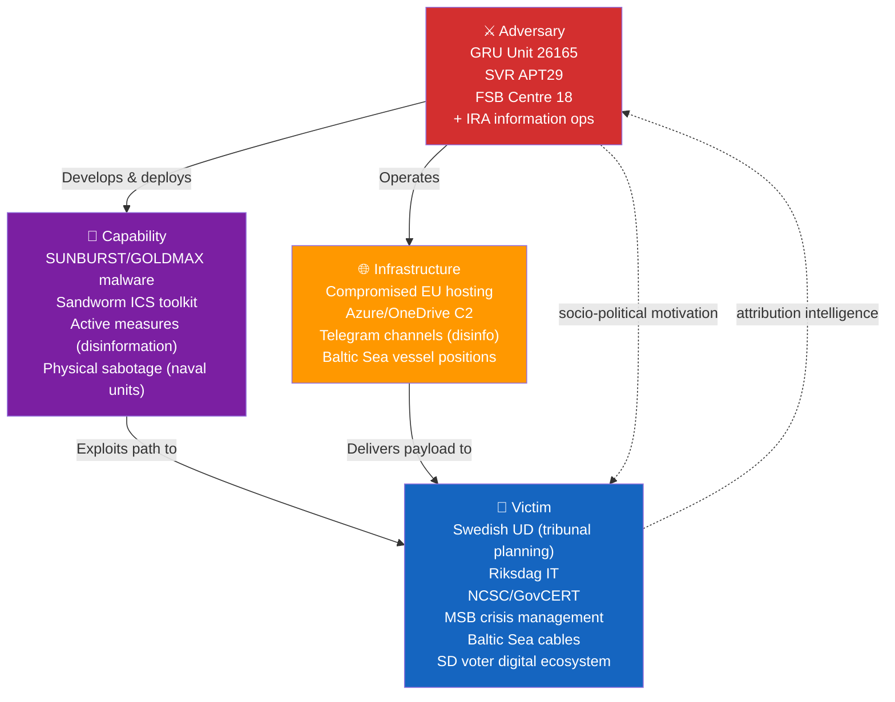
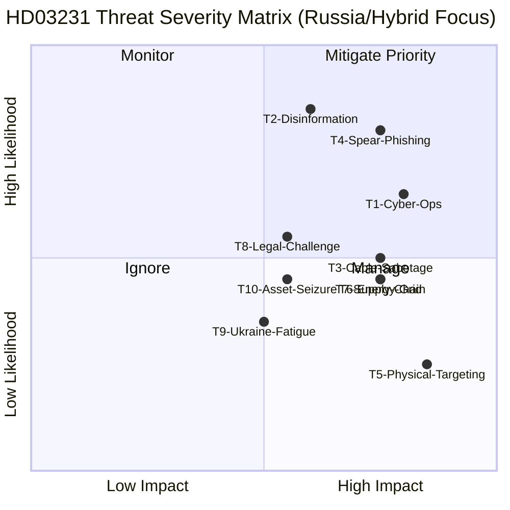

# Threat Analysis — Deep Inspection: HD03231 Ukraine Aggression Tribunal

| Field | Value |
|-------|-------|
| **THR-ID** | THR-2026-04-19-DI |
| **Analysis Date** | 2026-04-19 18:28 UTC |
| **Framework** | STRIDE (political-adapted) · Cyber Kill Chain · Diamond Model · MITRE ATT&CK Framework |
| **Primary Document** | HD03231 (Prop. 2025/26:231) |
| **Focus** | Russia, cyber threat, defence, Ukraine hybrid warfare |
| **Validity Window** | Valid until 2026-05-03 |

---

## 🎭 Threat Register (Priority-Ordered)

| Threat ID | Threat | Actor | Method | Likelihood | Impact | Priority | Confidence |
|:---:|--------|:------:|--------|:---:|:---:|:---:|:---:|
| **T1** | **Russian cyber operations** against Swedish government infrastructure (UD, Riksdag IT, NCSC) post-HD03231 ratification | GRU Sandworm, SVR APT29, FSB Turla | Spear-phishing, supply-chain compromise, zero-day exploitation | MEDIUM-HIGH | HIGH | 🔴 MITIGATE | HIGH |
| **T2** | **Disinformation campaign** targeting Sweden's 2026 valrörelse — embedding anti-tribunal narratives, Ukraine-aid fatigue messaging, SD voter manipulation | IRA, GRU Unit 26165 | Fake social media accounts, Swedish-language troll farms, deepfake video | HIGH | MEDIUM-HIGH | 🔴 MITIGATE | HIGH |
| **T3** | **Baltic Sea undersea cable sabotage** — correlation with tribunal-milestone events provides deniable timing signal | GRU/military intelligence naval units | Vessel-based cutting/tampering; AIS spoofing | MEDIUM | HIGH | 🔴 MITIGATE | MEDIUM |
| **T4** | **Spear-phishing against tribunal-planning personnel** — UD diplomats, tribunal preparatory committee staff, Swedish delegation | SVR APT29 (Cozy Bear) | Credential harvesting; Microsoft 365 exploitation; OAuth token theft | HIGH | HIGH | 🔴 MITIGATE | HIGH |
| **T5** | **Physical targeting of Swedish tribunal officials** — low probability but asymmetric impact; pattern from Salisbury (2018), Vilnius poisoning attempts | SVR / GRU special operations | Polonium/Novichok poisoning, staged accidents, intimidation | LOW-MEDIUM | CRITICAL | 🟠 ACTIVE | MEDIUM |
| **T6** | **Energy grid disruption** — targeting Swedish power infrastructure in coordination with tribunal vote timeline | GRU Sandworm (precedent: Ukraine 2015–16) | SCADA/ICS exploitation; pre-positioned malware | MEDIUM | HIGH | 🟠 ACTIVE | MEDIUM |
| **T7** | **Supply-chain attack on Swedish defence industry** — Saab, BAE Systems Bofors, Nammo supply chains contain Russia-adjacent contractors | GRU, state-sponsored criminal groups | Third-party software injection; hardware tampering | MEDIUM | HIGH | 🟠 ACTIVE | MEDIUM |
| **T8** | **Legal counter-challenges** — Russia seeks ICJ advisory opinion against tribunal jurisdiction | Russia (legal & diplomatic) | ICJ contentious case, UN General Assembly lobbying, bilateral pressure | MEDIUM | MEDIUM | 🟡 MANAGE | MEDIUM |
| **T9** | **Ukraine fatigue narrative acceleration** — domestic political exploitation by populist actors to undermine second-reading consensus in 2027 | Domestic actors (proxies possible) | Parliamentary questioning, media campaigns, economic-cost framing | LOW-MEDIUM | MEDIUM | 🟡 MONITOR | MEDIUM |
| **T10** | **Russian asset seizure** targeting Swedish companies with Russia exposure (Saab civil, Volvo legacy, Ericsson network equipment) | Russian government | Administrative decree; court orders; regulatory pressure | MEDIUM | MEDIUM | 🟡 MANAGE | MEDIUM |

---

## 🎯 Cyber Kill Chain Adaptation — Russian Hybrid Campaign Against HD03231

> Adapting Lockheed Martin Cyber Kill Chain (Hutchins et al. 2011) to Russian hybrid-warfare targeting of Sweden after HD03231 founding-member status. This is the **most probable** threat vector given documented Russian APT patterns.

```mermaid
flowchart LR
    RE["1️⃣ Reconnaissance<br/>OSINT on SE tribunal<br/>delegation, UD officials,<br/>MSB/NCSC infrastructure<br/>APT29 Cozy Bear pattern"]
    WE["2️⃣ Weaponisation<br/>Spear-phishing lures<br/>tailored to tribunal context<br/>Malicious MS Office<br/>attachments (CVE exploitation)"]
    DE["3️⃣ Delivery<br/>Email to UD diplomats<br/>Tribunal staff targeting<br/>LinkedIn-based social<br/>engineering"]
    EX["4️⃣ Exploitation<br/>Credential harvesting<br/>OAuth token theft<br/>Microsoft 365 initial<br/>access"]
    IN["5️⃣ Installation<br/>GOLDMAX/SUNBURST-style<br/>persistence<br/>WMI subscription<br/>Scheduled task implants"]
    CC["6️⃣ Command &amp; Control<br/>HTTPS-over-TOR<br/>Fast-flux DNS<br/>Azure/OneDrive<br/>C2 channels"]
    AC["7️⃣ Actions on Objectives<br/>Tribunal planning exfil<br/>Witness/evidence leak<br/>Coalition undermining<br/>Pre-positioning for<br/>destructive payload"]

    RE -->|"OSINT + LinkedIn<br/>profiling"| WE
    WE -->|"Lure crafting"| DE
    DE -->|"Phishing campaign"| EX
    EX -->|"Initial foothold"| IN
    IN -->|"Lateral movement"| CC
    CC -->|"Sustained access"| AC

    style RE fill:#1565C0,color:#FFFFFF
    style WE fill:#7B1FA2,color:#FFFFFF
    style DE fill:#FF9800,color:#FFFFFF
    style EX fill:#E65100,color:#FFFFFF
    style IN fill:#D32F2F,color:#FFFFFF
    style CC fill:#B71C1C,color:#FFFFFF
    style AC fill:#880E4F,color:#FFFFFF
```

### Kill Chain Stage Analysis — HD03231 Context

| Stage | Specific Swedish Target | Russian APT Method | Detection Opportunity | Swedish Countermeasure |
|-------|------------------------|-------------------|----------------------|----------------------|
| **Reconnaissance** | UD official LinkedIn profiles; tribunal preparatory committee membership (public); MSB org chart | OSINT automation; targeted social media profiling | Threat-intel monitoring of suspicious LinkedIn activity | SÄPO/UD awareness training; profile minimisation |
| **Weaponisation** | MS Office macro exploits; PDF zero-days; LNK files; stolen credentials from dark web | CVE stockpiling; 0-day market purchases | Threat-intel feeds (NCSC) | Patch management; GovCERT bulletin |
| **Delivery** | Email to UD officials with tribunal-related lures ("Draft tribunal statute", "Meeting agenda CoE") | Spear-phishing; watering hole attacks on CoE websites | Email gateway scanning; anomalous attachment analysis | NCSC email security; GovCERT filtering |
| **Exploitation** | Microsoft 365 tenant; VPN authentication; Citrix gateway | OAuth token theft; MFA bypass; password spraying | SIEM anomaly detection; failed-auth monitoring | Phishing-resistant MFA (FIDO2); Privileged Identity Management |
| **Installation** | UD network; Riksdag IT; MSB crisis management systems | Custom implants (SUNBURST-family); scheduled tasks | EDR telemetry; process creation monitoring | NCSC-certified EDR deployment; threat hunting |
| **C&C** | Beaconing through Azure/Office365 channels; Cloudflare Workers | HTTPS/443 exfil; DNS tunnelling; cloud-service abuse | Network traffic analysis; DNS monitoring; cloud-app access logs | NCSC SOC; DNS RPZ; CASB deployment |
| **Actions** | Tribunal evidence exfiltration; witness list compromise; coalition disruption data | Archive collection; data staging; destructive payload pre-positioning | DLP alerts; data-transfer monitoring | Data classification; access controls; DLP |

---

## 💎 Diamond Model — Russian Hybrid Operation Against Sweden

---

## 🏗️ Attack Tree — Russian Counter-Tribunal Campaign

```mermaid
graph TD
    GOAL["🎯 GOAL: Prevent tribunal<br/>from becoming operationally<br/>effective against Russian leadership"]
    
    A1["A1 Political:<br/>Prevent HD03231 ratification"]
    A2["A2 Technical:<br/>Compromise tribunal evidence base"]
    A3["A3 Diplomatic:<br/>Isolate tribunal from<br/>key supporters"]
    A4["A4 Physical:<br/>Undermine Swedish<br/>political will"]

    A1a["A1a Sweden second-reading<br/>vote fails (2027)"]
    A1b["A1b Coalition partners<br/>defect from support"]
    A1c["A1c SD reverses<br/>Ukraine position"]

    A2a["A2a Exfiltrate witness lists<br/>(endanger witnesses)"]
    A2b["A2b Compromise tribunal<br/>prosecutor communications"]
    A2c["A2c Tamper with digital<br/>evidence chain of custody"]

    A3a["A3a US non-cooperation<br/>evidence gap"]
    A3b["A3b Global South<br/>delegitimisation"]
    A3c["A3c China parallel<br/>ICJ challenge"]

    A4a["A4a Baltic Sea cable<br/>sabotage (valrörelse 2026)"]
    A4b["A4b Targeted harassment<br/>of tribunal architects"]
    A4c["A4c Economic pressure<br/>(firm asset seizures)"]

    GOAL --> A1
    GOAL --> A2
    GOAL --> A3
    GOAL --> A4
    A1 --> A1a
    A1 --> A1b
    A1 --> A1c
    A2 --> A2a
    A2 --> A2b
    A2 --> A2c
    A3 --> A3a
    A3 --> A3b
    A3 --> A3c
    A4 --> A4a
    A4 --> A4b
    A4 --> A4c

    style GOAL fill:#D32F2F,color:#FFFFFF
    style A1 fill:#FF9800,color:#FFFFFF
    style A2 fill:#D32F2F,color:#FFFFFF
    style A3 fill:#FF9800,color:#FFFFFF
    style A4 fill:#7B1FA2,color:#FFFFFF
    style A2a fill:#D32F2F,color:#FFFFFF
    style A2b fill:#D32F2F,color:#FFFFFF
    style A2c fill:#D32F2F,color:#FFFFFF
```

---

## 🧭 STRIDE Mapping (Political-Security Adaptation)

| STRIDE | HD03231 Context | Specific Attack Vector | Countermeasure |
|:------:|----------------|----------------------|----------------|
| **S**poofing | Russian disinformation actors impersonate Swedish officials announcing "tribunal position reversal"; deepfake video of FM Stenergard | AI-generated video of FM retracting HD03231 support | UD official channel verification; rapid-response comms |
| **T**ampering | Digital evidence chain-of-custody tampering before tribunal proceedings; altering intercepted communications metadata | Man-in-the-middle attacks on UD secure communications; evidence-database injection | End-to-end encryption; air-gapped evidence systems; blockchain evidence chains |
| **R**epudiation | Russia repudiates tribunal jurisdiction; pro-Russia states issue counter-declarations; "tribunal legitimacy" narrative campaign | Global South diplomatic lobbying; ICJ advisory opinion request | Pre-emptive diplomatic outreach; UNGA coalition building |
| **I**nformation Disclosure | UD tribunal planning documents leaked; witness/evidence list exfiltration enabling witness intimidation | APT29-style spear-phishing; insider threat; stolen laptop | Classified handling; secure comms; FIDO2 MFA; DLP |
| **D**enial of Service | Swedish government crisis management capability degraded during Baltic crisis (tribunal-correlated timing) | DDoS on Riksdag.se + MSB.se during key vote; Baltic cable cut | Redundant connectivity; DDoS protection; NATO CCDCOE support |
| **E**levation of Privilege | Russian intelligence personnel infiltrate CoE EPA secretariat or Swedish delegation | Long-term insider placement; social engineering of CoE administrative staff | Background check protocols; CoE security screening; insider-threat programme |

---

## 📊 Threat Severity Matrix

---

## 🔥 Priority Mitigation Actions

### T1+T4 — Russian Cyber & Spear-Phishing (🔴 MITIGATE PRIORITY)
- **Immediate**: NCSC/GovCERT advisory to all UD staff and tribunal-planning personnel
- **30 days**: Deploy FIDO2-based phishing-resistant MFA across UD Microsoft 365 tenant
- **60 days**: Conduct adversarial simulation exercise (red team simulating APT29 against UD tribunal planning environment)
- **90 days**: Establish dedicated SOC monitoring capability for tribunal-related communications
- **Ongoing**: NATO CCDCOE bilateral engagement for threat intelligence on Russian APT operations targeting tribunal-supporting states

### T2 — Disinformation / Valrörelse (🔴 MITIGATE PRIORITY)
- **Immediate**: MSB Nationellt säkerhetsråd briefing on disinformation threat to HD03231 ratification
- **30 days**: Prebunking campaign identifying specific Russian narrative templates (Ukraine fatigue, "tribunal is Western propaganda", "cost to Sweden")
- **Pre-election**: StratCom COE (Riga) engagement for Swedish valrörelse specific disinformation-response support
- **Operational**: All-party parliamentary group on information security should receive classified briefing on hybrid threat

### T3 — Baltic Sea Infrastructure (🔴 MITIGATE)
- **Immediate**: NATO MARCOM enhanced monitoring of Baltic Sea suspicious vessel activity
- **Protocol**: Correlate any Baltic cable incident with tribunal-milestone calendar — attribution signal
- **Ongoing**: Sweden-Finland-Estonia-Latvia joint patrol agreement for undersea infrastructure

### T4 — Spear-phishing against UD/Tribunal Staff
- GovCERT advisory (AMBER classification) to all UD personnel
- Tribunal preparatory committee use of classified communications systems only (no Microsoft 365 for sensitive content)
- Physical security review of delegation members' devices before international travel

---

## 🕐 Threat Timeline Correlation

| Tribunal Milestone | Approximate Date | Expected Russian Response Escalation | Priority |
|-------------------|:---:|-------------------------------------|:---:|
| Riksdag first reading vote | Q2-Q3 2026 | Disinformation surge; spear-phishing intensification | 🔴 HIGH |
| General election (valrörelse) | Sep 2026 | Peak disinformation; potential Baltic Sea incident | 🔴 CRITICAL |
| Riksdag second reading | Q1-Q2 2027 | Cyber operations against government infrastructure | 🔴 HIGH |
| Tribunal statute enters force | H1 2027 | Diplomatic isolation campaign; ICJ challenge filing | 🟠 MEDIUM |
| First indictments | 2027–2028 | Peak hybrid response; possible targeted harassment | 🔴 HIGH |
