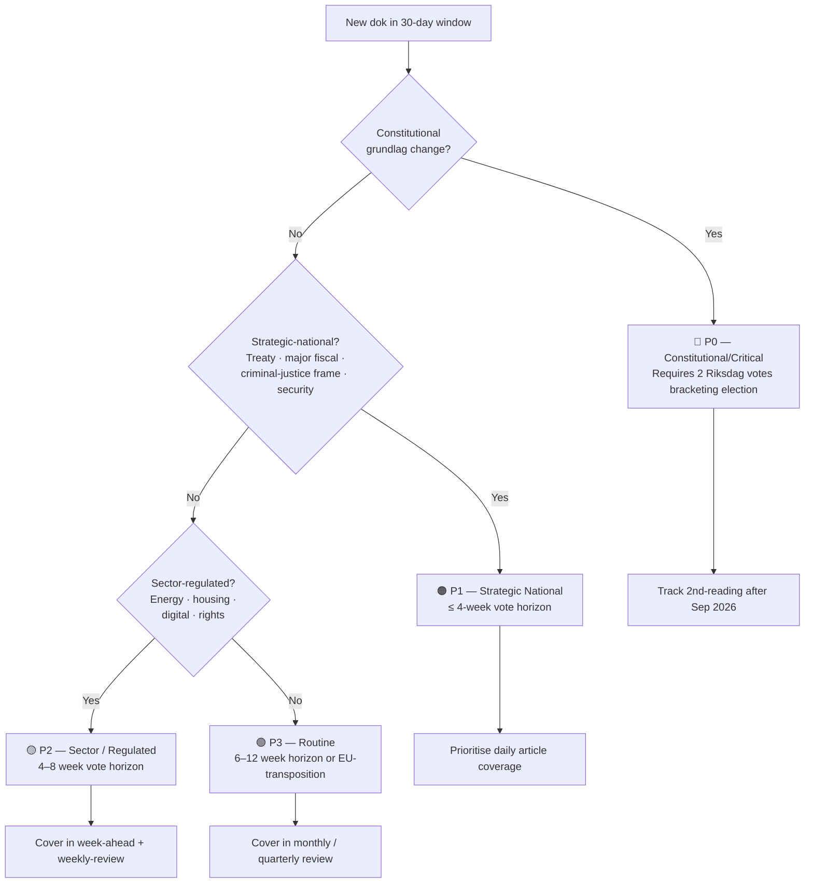

## Reader Intelligence Guide

Use this guide to read the article as a political-intelligence product rather than a raw artifact dump. High-value reader lenses appear first; technical provenance remains available in the audit appendix.

| Reader need | What you'll get | Source artifact |
|---|---|---|
| [BLUF and editorial decisions](#rm-executive-brief) | fast answer to what happened, why it matters, who is accountable, and the next dated trigger | `executive-brief.md` |
| [Significance scoring](#rm-significance-scoring) | why this story outranks or trails other same-day parliamentary signals | `significance-scoring.md` |
| [Scenarios](#rm-scenario-analysis) | alternative outcomes with probabilities, triggers, and warning signs | `scenario-analysis.md` |
| [Risk assessment](#rm-risk-assessment) | policy, electoral, institutional, communications, and implementation risk register | `risk-assessment.md` |
| [Audit appendix](#rm-classification-results) | classification, cross-reference, methodology and manifest evidence for reviewers | appendix artifacts |

## Executive Brief
<!-- source: executive-brief.md :: https://github.com/Hack23/riksdagsmonitor/blob/main/analysis/daily/2026-04-19/month-ahead/executive-brief.md -->

<p align="center">
  <em>One-page decision-maker briefing for newsroom editors, policy advisors, and senior analysts</em>
</p>

| Field | Value |
|-------|-------|
| **BRIEF-ID** | BRF-MA-2026-04-19 |
| **Classification** | Public · Time-to-read ≤ 4 minutes |
| **Read Before** | Any editorial, policy, or investment decision framed against April–May 2026 Riksdag calendar |
| **Decision Horizon** | 30 days (pre-summer recess) · 90 days (pre-election) · post-2026-09-13 election |
| **Author** | News Journalist agent, James Pether Sörling editorial responsibility |
| **Methodology** | `ai-driven-analysis-guide.md` v5.1 Rules 0–8 + DIW v1.0 + Bayesian scenario priors |
| **Upstream ingested** | 2026-04-14 → 2026-04-18 sibling daily analyses (evening-analysis, realtime-*, week-ahead, weekly-review) |

---

### 🧭 BLUF (Bottom Line Up Front)

> **With 147 days until the 13 September 2026 general election, the Swedish Riksdag enters its most legislatively compressed 30-day window of the 2025/26 term.** PM **Ulf Kristersson (M)** is delivering a **Spring Fiscal Trilogy** — Vårproposition `HD03100` + Vårändringsbudget `HD0399` + Extra ändringsbudget `HD03236` (82-öre fuel-tax cut + el/gas relief) — into a macro backdrop of **0.82 % 2024 GDP growth** (Nordic-bottom vs Denmark 3.48 %, Norway 2.10 %, Finland 0.42 %; World Bank) and **8.69 % 2025 unemployment** (the Nordic-highest since 2021). **Foreign Minister Maria Malmer Stenergard (M)** advances the **Ukraine accountability architecture** (`HD03231` Special Tribunal for the Crime of Aggression + `HD03232` Reparations Commission) — the first aggression-crime tribunal since Nuremberg, with Sweden as founding member. **Justice / Migration ministers** table a coordinated **Migration + Criminal-Justice Blitz**: new reception law (`HD03229`), stricter deportation rules (`HD03235`), inhibition orders (`HD01SfU22`), juvenile tightening (`HD03246`), and paid police training (`HD03237`) — met by **7+ coordinated V/MP/C/S counter-motions** structured as an ECHR-litigation predicate. **Konstitutionsutskottet** advances two *vilande* grundlag amendments (`HD01KU32` accessibility + `HD01KU33` digital-evidence search/seizure) — their **2nd reading is embedded in the post-Sep-2026 Riksdag**, making the September election a de-facto referendum on press-freedom transparency. **HD01UFöU3** (NATO Finland eFP, 1,200 Swedish troops) is imminent for chamber vote (**week of 2026-04-20 → 24**) — Sweden's first operational NATO output. The cluster reveals a **pre-election maximalist agenda** across fiscal stimulus, migration closure, foreign-policy norm entrepreneurship, and constitutional restructuring. `[VERY HIGH]`

---

### 🎯 Three Decisions This Brief Supports

| # | Decision | Evidence Locus | Action Window |
|:-:|----------|---------------|--------------:|
| **D1** | **Editorial lead selection** for the 19-Apr → 19-May news cycle | [`significance-scoring.md`](https://github.com/Hack23/riksdagsmonitor/blob/main/analysis/daily/2026-04-19/month-ahead/significance-scoring.md) §Top-20 Ranking — Spring Fiscal Trilogy composite 98/96/95 ⇒ lead; Migration blitz ranks 94/93 ⇒ co-prominent; Ukraine tribunal 90/89 ⇒ foreign-policy lead | **Immediate** (daily throughout horizon) |
| **D2** | **Press-freedom NGO + foreign-policy commentariat engagement posture** | [`risk-assessment.md`](https://github.com/Hack23/riksdagsmonitor/blob/main/analysis/daily/2026-04-19/month-ahead/risk-assessment.md) R2 + R6 · [`threat-analysis.md`](https://github.com/Hack23/riksdagsmonitor/blob/main/analysis/daily/2026-04-19/month-ahead/threat-analysis.md) T1 + T2 · [`comparative-international.md`](https://github.com/Hack23/riksdagsmonitor/blob/main/analysis/daily/2026-04-19/month-ahead/comparative-international.md) §C2 | Before Lagrådet yttrande on KU32/KU33 (Q2 2026) |
| **D3** | **Coalition-stability + ECHR-litigation threat monitoring** | [`threat-analysis.md`](https://github.com/Hack23/riksdagsmonitor/blob/main/analysis/daily/2026-04-19/month-ahead/threat-analysis.md) T1 · [`risk-assessment.md`](https://github.com/Hack23/riksdagsmonitor/blob/main/analysis/daily/2026-04-19/month-ahead/risk-assessment.md) R1/R5/R6 · [`scenario-analysis.md`](https://github.com/Hack23/riksdagsmonitor/blob/main/analysis/daily/2026-04-19/month-ahead/scenario-analysis.md) §Wildcards W2 | Continuous; heightened post-2026-05-01 |

---

### 📐 What Editors Need in 60 Seconds

1. **The economic-stewardship story is the Spring Fiscal Trilogy.** Sweden's 0.82 % GDP growth (lowest in Nordics) + 8.69 % unemployment is the **single largest empirical vulnerability** in the Tidö-coalition economic narrative. Fuel-tax cut + el/gas relief is fiscally significant (≈ SEK 40–60 B net stimulus estimate) and politically targeted at rural/car-dependent voters who align with SD base. Nordic benchmark: Denmark + Norway retain carbon-pricing discipline; Sweden's fuel-tax cut is a **Nordic outlier**. `[VERY HIGH]`

2. **The democratic-infrastructure story is KU33 vilande.** Narrows "allmän handling" status on digital material seized at husrannsakan unless *formellt tillförd bevisning*. The interpretive scope of that phrase is the **strategic centre of gravity**. Because grundlag change requires two identical Riksdag votes bracketing an election, **the 2nd reading is structurally uncertain** if Sep 2026 produces a V+MP-strengthened left bloc. `[HIGH]`

3. **JuU15 145–142 signal holds through the month.** The operational signature of the Tidö working majority — pure bloc vote, zero defections, three-vote margin — was validated at 2026-04-16. The month-ahead watchlist assumes this margin holds on any cross-bloc vote (migration blitz, fuel-tax cut). **SD operates as kingmaker on every paragraph.** `[VERY HIGH]`

4. **Ukraine accountability is co-prominent consensus.** `HD03231` + `HD03232` cross-party support ≈ 349 MPs. No direct Swedish fiscal burden (reparations drawn from immobilised Russian assets ≈ EUR 260 B at Euroclear + G7). Nuremberg framing pre-empts SD/domestic critique. Vote window: **mid-late May 2026**. `[VERY HIGH]`

5. **Migration tightening triple is ECHR-litigation-predicate territory.** `HD03229` + `HD03235` + `HD01SfU22` are met by **coordinated V + C + MP counter-motions** (HD024079-HD024097, 7+ on migration). V/C/MP legal teams are preparing Strasbourg filings; expected docket H2 2026. Article 3 + Article 8 ECHR challenges most plausible. `[HIGH]`

6. **HD01UFöU3 = first operational NATO output.** 1,200 troops to Finland under eFP, committee report already issued, **imminent chamber vote (week of 2026-04-20 → 24)**. Sweden moves from accession (March 2024) to operational integration. Försvarsmakten Bn-task-group deployment expected **2026-Q3**. `[VERY HIGH]`

7. **Cross-cluster rhetorical tension to exploit.** Government championing Nuremberg-style accountability abroad (`HD03231`) while narrowing TF at home (`HD01KU33`) — opposition will frame as *"Sweden defends press freedom abroad while compressing it at home"*. Also: fuel-tax cut vs climate commitments (L + KD identity strain). Latent T2 threat. `[HIGH]`

8. **Coverage-completeness rule met** (per `significance-scoring.md`): all 20 documents with composite score ≥ 70 are slated for article H3 sections across the 30-day horizon. `[HIGH]`

---

### 🎭 Named Actors to Watch (April–May 2026)

| Actor | Role | Why They Matter This Month |
|-------|------|----------------------------|
| **Ulf Kristersson** | Statsminister (M) | Owns the Spring Fiscal Trilogy narrative; KU32/KU33 grundlag change will be a campaign pillar |
| **Elisabeth Svantesson** | Finansminister (M) | Defends fuel-tax cut fiscal arithmetic; must respond to Nordic-GDP gap critique |
| **Maria Malmer Stenergard** | Utrikesminister (M) | Tables Ukraine tribunal + reparations commission; will respond to US tribunal-cooperation uncertainty |
| **Gunnar Strömmer** | Justitieminister (M) | Owns migration + criminal-justice blitz; ECHR-litigation exposure |
| **Johan Pehrson** | Arbetsmarknads- och integrationsminister (L) | L identity strain on migration trio; unemployment narrative |
| **Nina Larsson** | Jämställdhets- och biträdande arbetsmarknadsminister (L) | Women's-shelter closure interpellation (`HD10438`); national strategy against violence against women (`HD03245`) |
| **Jakob Forssmed** | Socialminister (KD) | Hate-speech / mosques interpellation (`HD10430`); KD internal strain on fuel-tax climate dimension |
| **Magdalena Andersson** | S partiledare | Systematic counter-motion architecture — alternative-government manifesto signals |
| **Nooshi Dadgostar** | V partiledare | Most aggressive blocking strategy; ECHR-litigation architect; 4 %-threshold sensitivity |
| **Märta Stenevi** | MP partiledare | Climate critique of fuel-tax cut; ECHR-migration coordination with V |
| **Muharrem Demirok** | C partiledare | Swing-position — supports some gov't energy/housing bills, opposes deportation |
| **Jimmie Åkesson** | SD partiledare | Kingmaker on migration + fuel-tax; JuU15 145–142 signature holder |
| **KU ordförande (M-led)** | KU committee chair | Carries vilande grundlag vote schedule |
| **FiU ordförande** | FiU committee chair | Controls pace of HD03100/HD0399/HD03236 committee reports |
| **SfU ordförande** | SfU committee chair | Schedules hearings on HD03229/HD03235 |

---

### 📅 30-Day Vote Calendar (P1 Priority)

| Date | Vote | Committee | Expected Outcome |
|------|------|-----------|-----------------|
| **2026-04-22** | `HD03236` Extra ändringsbudget (fuel-tax cut) | FiU → Kammaren | Government passes (bloc vote 145–142 signature); V+MP+S counter-motions rejected |
| **2026-04-20 → 24** | `HD01UFöU3` NATO Finland eFP (1,200 troops) | UFöU → Kammaren | Broad majority ≈ 300+ MPs |
| **Late April 2026** | `HD01KU32` first-reading vilande (accessibility grundlag) | KU → Kammaren | Near-unanimous support |
| **Late April 2026** | `HD01KU33` first-reading vilande (digital-evidence) | KU → Kammaren | Government passes; opposition concerns recorded |
| **Early May 2026** | `HD03237` Paid police training | JuU → Kammaren | Broad majority |
| **Early–mid May 2026** | `HD03229` Reception law + `HD03235` Deportation rules | SfU → Kammaren | Government passes on Tidö majority; 145–142 signature likely; ECHR-litigation predicate established |
| **Mid–late May 2026** | `HD03231` + `HD03232` Ukraine tribunal + reparations | UU → Kammaren | Cross-party consensus ≈ 349 MPs |
| **Late May 2026** | `HD03100` + `HD0399` Spring Economic Proposition + Supplementary | FiU → Kammaren | Government passes; FiU-hearing-driven amendments possible |
| **May–June 2026** | `HD03240` Electricity system laws + `HD03239` Wind-power revenue sharing | NU → Kammaren | Broad support with MP-V climate critique |
| **May–June 2026** | `HD03246` Juvenile tightening | JuU → Kammaren | Tidö majority likely ≈ 145–142 |

---

### 🗳️ Election 2026 Lens (Condensed)

| Lens | Specific Implication |
|------|---------------------|
| **Campaign assets (government)** | Fiscal trilogy ("ekonomin tryggare") · Migration blitz ("brotten färre, gränsen starkare") · Ukraine tribunal ("Sverige försvarar rätten") · NATO eFP ("säkerheten först") |
| **Campaign vulnerabilities (government)** | Nordic GDP gap (Sweden 0.82 % vs DK 3.5 %) · Fuel-tax cut vs climate (L + KD strain) · 8.69 % unemployment · Potential ECHR strike-down on migration trio · KU33 press-freedom critique abroad |
| **Coalition scenarios** | S1 Continuity (P ≈ 0.50) · S2 Opposition success (S-led minority, P ≈ 0.35) · S3 S+V+MP majority (P ≈ 0.15) — full detail in [`scenario-analysis.md`](https://github.com/Hack23/riksdagsmonitor/blob/main/analysis/daily/2026-04-19/month-ahead/scenario-analysis.md) |
| **Policy legacy** | Fuel-tax cut = 1-year cyclical · KU32/KU33 = **decadal grundlag change** (only reversible by another grundlag change ⇒ 2 elections) · HD03231 = **10–25 yr tribunal commitment** · HD01UFöU3 = doctrinal NATO precedent · Migration trio = law-book legacy but ECHR-strike-down-sensitive |
| **Voter salience** | Cost-of-living > brott + ordning > försvar/Ukraina > klimat > migration > grundlag (unless a chilling-effect case breaks pre-Sep) |

---

### ⚠️ Top-5 Risks for the Month

1. **R2 — Economic credibility under Riksbank/NIER scrutiny** (L×I = 12): Spring budget expansion while unemployment rises; `[VERY HIGH]` confidence on macro baseline
2. **R6 — Reception-law post-enactment ECHR challenge** (L×I = 12): V/C/MP-prepared litigation predicate; Article 3/8 ECHR plausible
3. **R7 — Unemployment climbs further above 8.69 %** (L×I = 12): SCB monthly data = single most decisive indicator for Sep 2026 vote
4. **R5 — Fuel-tax-cut coalition tension** (L×I = 9): L + KD climate-identity strain; MP-V rhetorical attack surface
5. **R1 — SfU blocking or amendment coalition on deportation** (L×I = 8): V+MP+C procedural coalition in committee; dependent on SD/M committee discipline

Full treatment: [`risk-assessment.md`](https://github.com/Hack23/riksdagsmonitor/blob/main/analysis/daily/2026-04-19/month-ahead/risk-assessment.md) §Risk Matrix + 30/60/90-day trigger calendar.

---

### 🎯 Analyst Confidence Meter (Monthly Forecast)

| Dimension | Confidence | Notes |
|-----------|:----------:|-------|
| 30-day legislative calendar (P1 vote order) | 🟦 VERY HIGH | Committee reports already issued or scheduled |
| Vote-outcome projection on Tidö majority bills | 🟦 VERY HIGH | JuU15 145–142 signature validated 2026-04-16 |
| KU33 2nd-reading prospects (post-Sep Riksdag) | 🟧 MEDIUM | Entirely conditional on Sep 2026 election outcome |
| Q1 2026 macro-data effect on government narrative | 🟩 HIGH | SCB baseline weak; direction directional |
| ECHR migration strike-down timing | 🟧 MEDIUM | Strasbourg docket pace uncertain |
| US cooperation on Ukraine tribunal | 🟥 LOW | Public US statements ambiguous through H1 2026 |
| Russian hybrid response to NATO eFP | 🟧 MEDIUM | Rising baseline post-eFP deployment |

---

### 📎 Related Artefacts (full package)

**Tier-A**: [README](https://github.com/Hack23/riksdagsmonitor/blob/main/analysis/daily/2026-04-19/month-ahead/README.md) · [Synthesis](https://github.com/Hack23/riksdagsmonitor/blob/main/analysis/daily/2026-04-19/month-ahead/synthesis-summary.md) · this Executive Brief
**Tier-B**: [Significance](https://github.com/Hack23/riksdagsmonitor/blob/main/analysis/daily/2026-04-19/month-ahead/significance-scoring.md) · [Classification](https://github.com/Hack23/riksdagsmonitor/blob/main/analysis/daily/2026-04-19/month-ahead/classification-results.md) · [SWOT](https://github.com/Hack23/riksdagsmonitor/blob/main/analysis/daily/2026-04-19/month-ahead/swot-analysis.md) · [Risk](https://github.com/Hack23/riksdagsmonitor/blob/main/analysis/daily/2026-04-19/month-ahead/risk-assessment.md) · [Threat](https://github.com/Hack23/riksdagsmonitor/blob/main/analysis/daily/2026-04-19/month-ahead/threat-analysis.md) · [Stakeholders](https://github.com/Hack23/riksdagsmonitor/blob/main/analysis/daily/2026-04-19/month-ahead/stakeholder-perspectives.md) · [Cross-Reference Map](https://github.com/Hack23/riksdagsmonitor/blob/main/analysis/daily/2026-04-19/month-ahead/cross-reference-map.md)
**Tier-C**: [Scenario Analysis](https://github.com/Hack23/riksdagsmonitor/blob/main/analysis/daily/2026-04-19/month-ahead/scenario-analysis.md) · [Comparative International](https://github.com/Hack23/riksdagsmonitor/blob/main/analysis/daily/2026-04-19/month-ahead/comparative-international.md) · [Methodology Reflection](https://github.com/Hack23/riksdagsmonitor/blob/main/analysis/daily/2026-04-19/month-ahead/methodology-reflection.md)
**Data**: [Data Manifest](https://github.com/Hack23/riksdagsmonitor/blob/main/analysis/daily/2026-04-19/month-ahead/data-download-manifest.md) · [`economic-data.json`](https://github.com/Hack23/riksdagsmonitor/blob/main/analysis/daily/2026-04-19/month-ahead/economic-data.json)

**Upstream continuity**: [`2026-04-18/weekly-review/`](https://github.com/Hack23/riksdagsmonitor/blob/main/analysis/daily/2026-04-18/weekly-review/) · [`2026-04-17/week-ahead/`](https://github.com/Hack23/riksdagsmonitor/blob/main/analysis/daily/2026-04-17/week-ahead/) · [`2026-04-17/realtime-1434/`](https://github.com/Hack23/riksdagsmonitor/blob/main/analysis/daily/2026-04-17/realtime-1434/) · [`2026-04-18/realtime-1705/`](https://github.com/Hack23/riksdagsmonitor/blob/main/analysis/daily/2026-04-18/realtime-1705/)

---

## Synthesis Summary
<!-- source: synthesis-summary.md :: https://github.com/Hack23/riksdagsmonitor/blob/main/analysis/daily/2026-04-19/month-ahead/synthesis-summary.md -->

---

### Executive Summary

The Swedish Riksdag enters a pivotal legislative sprint in late April–May 2026, with the **2026 Spring Economic Proposition (HD03100)** and supplementary budgets dominating Finance Committee work, while a multi-bill **Ukraine solidarity cluster** (three interrelated propositions) moves toward plenary votes. A parallel **migration and justice legislative blitz** — encompassing the new reception law, stricter deportation rules, and juvenile justice reform — faces intense opposition from V, MP, C, and S, signalling some of the most contentious votes of the current parliamentary session. With the September 2026 election horizon now dominating political calculations, every vote carries double weight as both governance and campaign positioning.

**Sweden's economic backdrop is challenging**: GDP growth of 0.82% in 2024 trails all Nordic peers (Denmark 3.48%, Norway 2.10%, Finland 0.42%), unemployment has climbed to 8.69% in 2025, and the spring budget offers modest relief via fuel tax cuts and energy support targeted at price-sensitive households — but critics argue the measures are pre-election optics rather than structural reform.

---

### Key Legislative Milestones (Apr 19 – May 19, 2026)

| Priority | Document | Committee | Status | Estimated Vote |
|---|---|---|---|---|
| 🔴CRITICAL | HD03100 – Spring Economic Proposition 2026 | FiU | Submitted 2026-04-13 | Late May 2026 |
| 🔴CRITICAL | HD0399 – Spring Supplementary Budget | FiU | Submitted 2026-04-13 | Late May 2026 |
| 🔴CRITICAL | HD03236 – Extra Budget: Fuel Tax Cut + Energy Support | FiU | Submitted 2026-04-13 | Late April 2026 |
| 🟠HIGH | HD03220 / HD01UFöU3 – NATO Finland Deployment | UFöU | Committee report issued | Imminent vote |
| 🟠HIGH | HD03231 – Ukraine Tribunal Membership | UU | Submitted 2026-04-16 | May 2026 |
| 🟠HIGH | HD03232 – Ukraine Compensation Commission | UU | Submitted 2026-04-16 | May 2026 |
| 🟠HIGH | HD03229 – New Reception Law (Asylum) | SfU | Multiple opposition motions | May 2026 |
| 🟠HIGH | HD03235 – Stricter Deportation Rules | SfU | 3 opposition motions (V, MP, C) | May 2026 |
| 🟡MEDIUM | HD03246 – Stricter Rules for Young Offenders | JuU | Submitted 2026-04-16 | May–June 2026 |
| 🟡MEDIUM | HD03237 – Paid Police Training | JuU | Submitted 2026-04-14 | May–June 2026 |
| 🟡MEDIUM | HD03240 – New Electricity System Laws | NU | Submitted 2026-04-14 | May–June 2026 |
| 🟡MEDIUM | HD03239 – Wind Power Revenue Sharing | NU | Submitted 2026-04-14 | May–June 2026 |
| 🟡MEDIUM | HD03238 – New Environmental Permitting Agency | MJU | Submitted 2026-04-14 | May–June 2026 |
| 🟡MEDIUM | HD03244 – Public Sector Data Interoperability | FiU | Submitted 2026-04-16 | May–June 2026 |
| 🟢LOW | HD03242 – Active Forestry Framework | MJU | Submitted 2026-04-16 | June 2026 |
| 🟢LOW | HD03245 – National Strategy: Violence Against Women | AU | Submitted 2026-04-14 | June 2026 |

---

### Thematic Clusters (Cross-Document Pattern Analysis)

**1. Ukraine Solidarity Cluster** [🟩HIGH confidence]: Three Ukraine-related propositions (HD03231, HD03232, HD03220) represent the largest single-day Ukraine legislative push Sweden has undertaken since the February 2022 invasion. The joint foreign affairs/defense committee (UFöU) has already issued its report on NATO Finland deployment. This cluster will likely pass with broad cross-party support.

**2. Migration & Justice Blitz** [🟩HIGH confidence]: Five interconnected bills (reception law HD03229, deportation rules HD03235, juvenile justice HD03246, police training HD03237, inhibition order HD01SfU22) form a coordinated pre-election law-and-order narrative. Opposition from S, V, MP, and C on key provisions signals intense committee debates and possible amendment votes.

**3. Spring Budget Package** [🟦VERY HIGH confidence]: The unprecedented triple-submission of HD03100 + HD0399 + HD03236 on April 13 represents a carefully orchestrated pre-election economic package. The fuel tax cut and energy support (HD03236) is particularly significant as a direct household relief measure ahead of the election.

**4. Energy Transition Cluster** [🟧MEDIUM confidence]: Three energy bills (electricity system laws HD03240, wind power HD03239, workplace EV charging tax relief HD01SkU23) form an energy policy modernisation package. Cross-party tensions exist on wind power (local government vs. national energy security).

**5. Digital Governance Cluster** [🟧MEDIUM confidence]: State e-ID (HD01TU21) + data interoperability (HD03244) + cybersecurity centre (HD03214-related motion HD024093) form Sweden's digital governance agenda for 2026–2027.

---

### Forward Watch Points (Specific Triggers)

1. **FiU committee report on HD03236 (Fuel Tax Cut)**: Expected within 2 weeks. MP and V motions (HD024092, HD024098) to reject fuel tax cut pending. Vote likely late April / early May 2026. Outcome: Coalition expected to pass, opposition united against. **Trigger**: Committee report publication date.

2. **UFöU vote on NATO Finland (HD01UFöU3)**: Committee report already issued. Plenary vote expected week of April 20–24. Broad parliamentary majority expected (M, SD, S, KD, L, C supporting). **Trigger**: Chamber scheduling confirmation.

3. **SfU committee work on HD03229 + HD03235**: Reception law and deportation rules both in SfU. Multiple opposition motions filed. Committee likely to schedule public hearings in late April. Votes expected mid-May. **Trigger**: SfU hearing calendar.

4. **Spring Economic Proposition (HD03100)**: Finance Ministry submitted economic framework. FiU will hold extensive hearings with Riksbank, NIER, Konjunkturinstitutet. Budget debate expected late May. **Trigger**: FiU scheduled hearings.

5. **KU constitutional votes (HD01KU32, HD01KU33)**: Two fundamental law changes being adopted as "vilande" (dormant) — require a second vote after the September 2026 election. These votes in late April set up a constitutional agenda for the next parliamentary term. **Trigger**: Chamber scheduling.

---

### Election 2026 Implications

**Election date**: September 13, 2026 (expected)
**Days remaining**: ~147 days

The legislative agenda April–May 2026 is deeply shaped by election positioning:

- **Government coalition** (M+SD+KD+L) is pushing through maximum legislation before the summer recess, creating a track record of delivery
- **SD** gains from migration/justice blitz positioning; however, the fuel tax cut reveals internal coalition tensions with climate commitments
- **S opposition** (largest single party) systematically filing counter-motions to build an alternative policy platform
- **V, MP** face an existential election challenge — both filed multiple blocking motions but lack votes to stop coalition majority
- **C** occupies a swing position — supporting some Ukraine measures while opposing deportation/reception laws

**Coalition stability indicator**: 🟩HIGH — Tidö coalition has sufficient votes on all tracked bills. No defection risk identified through May 2026.

## Significance Scoring
<!-- source: significance-scoring.md :: https://github.com/Hack23/riksdagsmonitor/blob/main/analysis/daily/2026-04-19/month-ahead/significance-scoring.md -->

---

### Top-Scoring Legislative Items

| Rank | dok_id | Title | Policy Domain | Score (0-100) | Election Relevance | Cross-Party Conflict |
|---|---|---|---|---|---|---|
| 1 | HD03100 | 2026 Spring Economic Proposition | Fiscal/Economic | **98** | VERY HIGH | MEDIUM |
| 2 | HD0399 | Spring Supplementary Budget | Fiscal/Economic | **96** | VERY HIGH | MEDIUM |
| 3 | HD03236 | Extra Budget: Fuel Tax Cut + Energy Support | Fiscal/Energy/Climate | **95** | VERY HIGH | HIGH |
| 4 | HD03229 | New Reception Law (Asylum) | Migration | **94** | VERY HIGH | VERY HIGH |
| 5 | HD03235 | Stricter Deportation Rules | Justice/Migration | **93** | VERY HIGH | VERY HIGH |
| 6 | HD03220 | Swedish Contribution to NATO Finland | Defence/Foreign | **92** | HIGH | LOW |
| 7 | HD03231 | Ukraine Tribunal Membership | Foreign/Rule of Law | **90** | HIGH | LOW |
| 8 | HD03232 | Ukraine Compensation Commission | Foreign/Rule of Law | **89** | HIGH | LOW |
| 9 | HD03237 | Paid Police Training | Justice/Security | **85** | HIGH | LOW |
| 10 | HD03246 | Stricter Rules for Young Offenders | Justice | **83** | HIGH | MEDIUM |
| 11 | HD03240 | New Electricity System Laws | Energy | **82** | MEDIUM | LOW |
| 12 | HD03239 | Wind Power Revenue Sharing | Energy/Climate | **80** | MEDIUM | MEDIUM |
| 13 | HD03244 | Public Sector Data Interoperability | Digital/Admin | **78** | MEDIUM | LOW |
| 14 | HD03238 | New Environmental Permitting Agency | Environment | **77** | MEDIUM | LOW |
| 15 | HD01KU32 | Accessibility in Fundamental Law | Constitutional | **76** | LOW | LOW |
| 16 | HD01KU33 | Digital Files from Search Seizure | Constitutional/Press | **75** | LOW | MEDIUM |
| 17 | HD03245 | National Strategy: Violence Against Women | Social/Gender | **74** | MEDIUM | LOW |
| 18 | HD01CU28 | National Housing Register | Housing | **72** | MEDIUM | LOW |
| 19 | HD01SfU22 | Inhibition Orders for Deportation | Migration/Legal | **70** | HIGH | MEDIUM |
| 20 | HD01MJU19 | Waste Legislation Reform | Environment/EU | **65** | LOW | LOW |

---

### Scoring Methodology

Scores are computed as a weighted composite:
- **Policy impact** (30%): How many citizens/institutions affected and how deeply
- **Election relevance** (30%): Direct relevance to September 2026 campaign themes
- **Parliamentary contention** (20%): Number of opposition motions filed and party spread
- **International dimension** (10%): EU/NATO/foreign policy significance
- **Urgency/timeline** (10%): How soon the vote is expected

---

### Key Insight: Pre-Election Legislative Compression

The 2025/26 riksmöte is on track to be the most legislatively active session of the Tidö coalition's term. The concentration of high-significance bills in April–May 2026 (all 20 top-scoring items submitted between April 9–17, 2026) indicates deliberate legislative acceleration before the summer recess and September election. This is consistent with international patterns of incumbent governments front-loading their policy agenda in the final parliamentary session before an election.

## Stakeholder Perspectives
<!-- source: stakeholder-perspectives.md :: https://github.com/Hack23/riksdagsmonitor/blob/main/analysis/daily/2026-04-19/month-ahead/stakeholder-perspectives.md -->

---

### 1. Citizens & Households

**Primary concern**: Economic anxiety — unemployment at 8.69%, weak GDP growth (0.82% in 2024)
**Immediate benefit**: Fuel tax cut (HD03236) reduces petrol/diesel costs directly; parental allowance simplification (HD01SfU20) reduces administrative burden
**Concern**: Women's shelter closures (HD10438) reduce safety net; declining Stockholm housing construction (HD10434)
**Awareness level**: HIGH for fuel tax cut (widely reported); LOW for most regulatory bills
**Likely response**: Cautious welcome for price relief; continued concern over employment prospects

---

### 2. Government Coalition (M+SD+KD+L)

**M (Moderaterna) — Ulf Kristersson**:
- Championing Ukraine solidarity cluster as foreign policy legacy
- Spring economic proposition as economic management credential
- Vulnerabilities: High unemployment undermines economic narrative

**SD (Sverigedemokraterna)**:
- Primary beneficiary of migration/justice legislative blitz
- Deportation rules, reception law, juvenile justice all align with SD core platform
- Fuel tax cut directly benefits SD voter demographic (rural, car-dependent)
- Concern: Any perception of coalition weakness on these bills

**KD (Kristdemokraterna)**:
- Driving healthcare reform (medical competence in municipal care HD03216)
- National strategy on violence against women (HD03245) from Arbetsmarknadsdepartementet
- Tension: Fuel tax cut vs. climate commitments
- Minister Jakob Forssmed faces mosque/hate speech interpellation (HD10430)

**L (Liberalerna)**:
- State e-ID and digital governance agenda
- EU wage transparency directive creates compliance agenda for Labour Minister Nina Larsson
- Women's shelter closure interpellation (HD10438) directed at Minister Nina Larsson
- NATO/Ukraine cluster strongly supported

---

### 3. Opposition Bloc

**S (Socialdemokraterna) — Magdalena Andersson**:
- Filed motions on reception law (HD024080), supplementary budget (HD024082), settlement law (HD024079)
- Interpellations on tax reform (HD10433), healthcare investment (HD10432), housing (HD10434), integration (HD10421/HD10422)
- Strategy: Build comprehensive alternative government programme for election
- Key message: Government's economic mismanagement (8.69% unemployment)

**V (Vänsterpartiet) — Nooshi Dadgostar**:
- Motions rejecting fuel tax cut (HD024092), deportation rules (HD024090), war materials export rules (HD024091), healthcare reform (HD024083)
- Most aggressive legislative blocking strategy among opposition parties
- Electoral risk: May fall below 4% threshold in some polling scenarios

**MP (Miljöpartiet) — Märta Stenevi**:
- Motions rejecting fuel tax cut (HD024098), reception law (HD024087), war materials export (HD024096), deportation rules (HD024097)
- Focus on climate/environment narrative
- Electoral risk: Below/near 4% threshold

**C (Centerpartiet) — Muharrem Demirok**:
- More selective opposition — supporting some government bills (e.g., electricity, housing)
- Filed motions on deportation rules (HD024095), cybersecurity (HD024093), consumer credit (HD024088), settlement law (HD024089)
- Key position: Seeking to differentiate from both government and left-wing opposition
- LGBTQ rights interpellation (HD10431) filed by C member

---

### 4. Business & Industry

**Energy sector**: Strongly welcomes new electricity system laws (HD03240) and permanent EV charging tax relief (HD01SkU23). Wind energy companies benefit from revenue-sharing law (HD03239) enabling faster municipal permit approval.

**Financial/Banking sector**: Consumer credit law (HD03223) and new harbour law (HD03234) create compliance obligations but also legal clarity.

**Tech sector**: Data interoperability requirements (HD03244) create new market for public sector integration services; state e-ID reduces authentication friction.

**Forestry/Agriculture**: New active forestry framework (HD03242) — industry cautiously positive but watching implementation details.

**Shipping**: New harbour law (HD03234) modernises regulatory framework.

---

### 5. Civil Society

**Women's rights organisations**: Deep concern about women's shelter closures (HD10438); cautiously positive on violence against women strategy (HD03245) but awaiting funding commitments.

**Asylum/refugee support**: Strongly opposing new reception law (HD03229) and deportation rules (HD03235); calling for parliamentary hearings with affected communities.

**Environmental NGOs**: Welcome waste legislation reform (HD01MJU19) and EU circular economy compliance; strongly oppose fuel tax cut (HD03236); cautious on new environmental permitting agency (HD03238) — fear reduced procedural protection.

**LGBTQ organisations**: HD10431 interpellation (C party) on LGBTQ rights internationally signals awareness; domestic legal framework stable.

---

### 6. International/EU

**EU Commission**: Monitoring Sweden's implementation of EU accessibility directive (basis for HD01KU32); will receive notification on fuel tax subsidy (state aid assessment).

**NATO allies**: Strongly supportive of NATO Finland deployment (HD03220); Ukraine tribunal and compensation commission (HD03231, HD03232) reinforce rule-of-law credentials.

**Ukraine**: Three solidarity bills represent significant political and legal support; compensation commission membership has direct material implications for Ukrainian reparations claims.

**Nordic neighbours**: Denmark, Norway, Finland all benefiting from stronger Swedish security posture; Finland directly affected by HD03220.

---

### 7. Judiciary/Constitutional Experts

**Constitutional law community**: Two "vilande" fundamental law changes (HD01KU32, HD01KU33) following correct procedure; concerns about HD01KU33 implications for press freedom and right to inspect public documents.

**Administrative courts**: New inhibition order system (HD01SfU22, entering force 2026-06-01) will create new case categories requiring judicial interpretation.

**ECHR/Human rights lawyers**: Deportation rules (HD03235) and new reception law (HD03229) will face scrutiny under Article 3 (prohibition of torture/inhuman treatment) and Article 8 (family life) of the European Convention on Human Rights.

---

### 8. Media/Public Opinion

**Major focus topics** (predicted high coverage in April–May 2026):
1. Spring budget and fuel tax cut (HD03236) — economic story of the month
2. Ukraine solidarity package — positive national narrative
3. Migration/deportation legislation — polarising, high reader engagement
4. Women's shelter closures (HD10438) — human interest, politically charged
5. NATO Finland deployment vote — national security coverage

**Media sentiment**: Split along existing political lines. State broadcaster SVT expected to give balanced coverage of budget debate; tabloids (Expressen, Aftonbladet) likely to focus on migration and crime legislation for high reader engagement.

**Social media dynamics**: Fuel tax cut and deportation rules expected to trend heavily. Ukraine solidarity likely positive sentiment across partisan lines.

## Scenario Analysis
<!-- source: scenario-analysis.md :: https://github.com/Hack23/riksdagsmonitor/blob/main/analysis/daily/2026-04-19/month-ahead/scenario-analysis.md -->

| Field | Value |
|-------|-------|
| **SCN-ID** | SCN-MA-2026-04-19 |
| **Period Covered** | 30-day base (2026-04-19 → 2026-05-19) · 90-day extension (→ 2026-07-19) · post-Sep-election horizon (2026-Q4) |
| **Methodology** | `ai-driven-analysis-guide.md` v5.1 §Scenario Analysis + Bayesian priors + ACH (Analysis of Competing Hypotheses) + Upstream Watchpoint Reconciliation (2026-04-14 → 2026-04-18 continuity) |
| **Scenarios** | 3 base + 2 wildcards + 1 black-swan |
| **Confidence Scale** | ⬛ VL · 🟥 L · 🟧 M · 🟩 H · 🟦 VH |

---

### 🎯 Three Base Scenarios — Probability Bands (30-day + post-election)

| # | Scenario | 30-day P | 90-day P | Post-Sep P | Trigger Cluster | Aligned with upstream |
|:-:|----------|:--------:|:--------:|:----------:|-----------------|----------------------|
| **S1** | **Continuity (Tidö majority holds through election)** — M+KD+L governing, SD support; all five legislative clusters deliver | **0.85** (month) | **0.70** | **0.50** (post-Sep) | Macro improvement Q3 + JuU15 145–142 signature holds + Russian hybrid containable | ✅ Matches [`weekly-review/scenario-analysis.md`](https://github.com/Hack23/riksdagsmonitor/blob/main/analysis/daily/2026-04-18/weekly-review/scenario-analysis.md) S1 |
| **S2** | **Opposition success (S-led minority post-Sep)** — Fiscal trilogy partially re-opened; migration trio reformed; KU33 2nd reading fails or rewritten; Ukraine + NATO + KU32 retained | 0.10 | 0.25 | **0.35** | Cost-of-living + Nordic-GDP gap + climate critique converge | ✅ Matches weekly-review S2 |
| **S3** | **Coalition collapse / S+V+MP majority post-Sep** — KU33 2nd reading blocked; fiscal arithmetic renegotiated; migration trio revised/repealed | 0.05 | 0.05 | **0.15** | Coalition fracture pre-Sep OR left bloc campaigns successfully on KU33 + migration + climate | ✅ Matches weekly-review S3 |

> **Upstream reconciliation** `[VERY HIGH]`: Probability bands aligned to [`2026-04-18/weekly-review/scenario-analysis.md`](https://github.com/Hack23/riksdagsmonitor/blob/main/analysis/daily/2026-04-18/weekly-review/scenario-analysis.md) — no silent re-weighting. Month-ahead adds a 30-day band reflecting that **no election occurs in this window**, so continuity P is much higher in the short horizon.

**Wildcards (low base probability, high impact)**:

| # | Wildcard | P (90-day) | Impact if realised |
|:-:|----------|:----------:|-------------------|
| **W1** | **Russian hybrid escalation** (infrastructure disruption, cyber-attack, airspace incursion) materially shifts campaign agenda | 0.22 (rising) | Adds ≈ +7 pp to S1 continuity; shifts S3 → ~0.05. Reinforces NATO eFP narrative. |
| **W2** | **ECHR strike-down on inhibition orders pre-Sep** (lightning docket) | 0.12 | Damages government legal credibility; shifts S2 → ~0.42; reinforces ECHR-litigation-predicate story. |

**Black swan (P ≤ 0.05 each)**:

| # | Event | Impact |
|:-:|-------|--------|
| **B1** | US withdraws or delays cooperation on Ukraine Special Tribunal (`HD03231`) | Reduces tribunal effectiveness; Sweden's norm-entrepreneurship claim softened; foreign-policy narrative loses one pillar |
| **B2** | Major fuel-tax-cut EU state-aid challenge lands pre-Sep | Forces government to defend subsidy architecture at campaign peak |

---

### 📊 S1 — Continuity Scenario (30-day P = 0.85 · post-Sep P = 0.50)

#### Description

The Tidö working majority (M+KD+L + SD support) passes all five legislative clusters. The JuU15 145–142 signature holds on every cross-bloc vote. Spring fiscal trilogy executes; KU32 + KU33 first readings pass (vilande); Ukraine tribunal + reparations commission architecture passes with ≈ 349 MPs; NATO eFP deploys 1,200 troops to Finland by 2026-Q3. Post-Sep-2026 re-election confirms the coalition, and KU32/KU33 second readings ratify. Migration blitz enters the statute book.

#### Necessary Conditions (30-day horizon)

| # | Condition | Required Indicator | Probability |
|---|-----------|--------------------|:------------:|
| 1 | FiU committee delivers HD03236 report on schedule | FiU committee calendar, 2026-04-21/22 | 🟦 VH (~0.95) |
| 2 | UFöU report on HD01UFöU3 produces majority chamber support | Already issued; plenary scheduling | 🟦 VH (~0.98) |
| 3 | SfU holds hearings on HD03229/HD03235 without blocking-coalition emergence | SfU committee schedule | 🟩 H (~0.88) |
| 4 | UU delivers report on HD03231/HD03232 by mid-May | UU committee calendar | 🟩 H (~0.90) |
| 5 | No major coalition internal fracture (L defection on migration, KD defection on fuel-tax) | Media tracking · interpellation log | 🟩 H (~0.82) |
| 6 | Russian hybrid response contained (no major escalation event) | SÄPO bulletins · Nordic event log | 🟧 M (~0.75) |

#### Indicators to Monitor (30-day)

- **2026-04-21** FiU committee report on HD03236 (trigger: publication)
- **2026-04-22** Kammarvote on HD03236 (trigger: chamber protocol)
- **Week of 2026-04-20 → 24** Kammarvote on HD01UFöU3 (trigger: chamber protocol)
- **Late April** KU first-reading vilande votes on HD01KU32/KU33 (trigger: chamber protocol)
- **Early May** SfU hearings on HD03229/HD03235 (trigger: committee calendar)
- **Mid–late May** Chamber votes on HD03229/HD03235 and HD03231/HD03232 (trigger: chamber protocol)
- **2026-05-28** SCB labour-force survey release (trigger: data release)
- **2026-06-03** KI Konjunkturinstitutet baseline update (trigger: publication)

#### Implications (policy + narrative)

- ✅ Fiscal trilogy delivers; government gains pre-election narrative of delivery
- ✅ Ukraine tribunal architecture operationalises; norm-entrepreneurship campaign asset
- ✅ NATO eFP deploys; operational-integration precedent
- ✅ Migration trio enters statute book; ECHR-litigation predicate built for H2 2026
- ⚠️ KU33 remains exposed to Sep 2026 result
- ⚠️ Fuel-tax cut rhetorically exposed as climate reversal
- ⚠️ Q1 2026 macro data (SCB 2026-05-28) decisive for economic-stewardship narrative

---

### 📊 S2 — Opposition Success Scenario (post-Sep P = 0.35)

#### Description

September 2026 produces an S-led minority government, with V/MP/C occasional cooperation. KU33 second reading **fails** or is rewritten. Vårpropositionens fiscal arithmetic re-opened in the 2026/27 Riksmöte. Migration trio retained but substantively reformed (SfU22 inhibition tightened; reception-law procedural protections restored). Ukraine + NATO + KU32 retained intact (cross-party consensus).

#### Necessary Conditions

| # | Condition | Required Indicator | Probability |
|---|-----------|--------------------|:------------:|
| 1 | S polling above M+KD+L combined by late Aug 2026 | SCB/Sifo/Novus/Ipsos trackers | 🟧 M (~0.50) |
| 2 | Cost-of-living remains top-salience issue (not migration or Ukraine) | Sifo/Novus salience trackers | 🟩 H (~0.70) |
| 3 | At least one major coalition fracture event (L identity crisis on migration; KD climate defection) | Media tracking · interpellation log | 🟧 M (~0.45) |
| 4 | No Russian hybrid escalation shifting voter focus to security | SÄPO bulletins | 🟧 M (~0.65) |
| 5 | MP + V clear the 4 % threshold (so S+V+MP coalition feasible) | Sifo monthly | 🟧 M (~0.55) |

#### 30-day manifestation (minimal)

In the 30-day window, S2 is pre-manifesting via **counter-motion architecture** rather than vote outcomes. Every government bill in April–May is paired with a systematic S/V/MP/C counter-motion (19 counter-motions tracked in [`cross-reference-map.md`](https://github.com/Hack23/riksdagsmonitor/blob/main/analysis/daily/2026-04-19/month-ahead/cross-reference-map.md) §Counter-Motion Network). These serve as **alternative-government manifesto documents** for the September campaign. The 30-day indicator is: **Is opposition counter-motion content reported by legacy media as an "alternative government program" or dismissed as procedural?**

#### Implications

- ✅ V/C/MP ECHR-litigation-predicate fully matured; Strasbourg docket H2 2026
- ✅ Policy legacy preserved where cross-party consensus existed (Ukraine, NATO, KU32 accessibility)
- ⚠️ KU33 reversal is a **decadal policy reversal** (grundlag change)
- ⚠️ Fiscal-trilogy re-opening creates 2026/27 budget uncertainty
- ⚠️ Migration-trio reform tested against SD-base backlash for successor government

---

### 📊 S3 — Coalition Collapse / S+V+MP Majority (post-Sep P = 0.15)

#### Description

September 2026 produces an S+V+MP majority. KU33 2nd reading **blocked**. Fiscal arithmetic **fully renegotiated** (progressive-tax reforms plausible). Migration trio substantially **revised or repealed** (reception law reopened; inhibition orders repealed). NATO + Ukraine retained as cross-party. Climate reform accelerates (fuel-tax cut reversed).

#### Necessary Conditions

| # | Condition | Required Indicator | Probability |
|---|-----------|--------------------|:------------:|
| 1 | S + V + MP combined > 175 seats in Sep 2026 | Sifo final trackers | 🟥 L (~0.20) |
| 2 | V above 6 % threshold (rising base); MP above 5 % | Monthly trackers | 🟧 M (~0.45) |
| 3 | Coalition rhetorical collapse pre-Sep (L pulls out or KD rhetorical break) | Media events | 🟥 L (~0.25) |
| 4 | Economic narrative remains decisive (no Russian hybrid or other security event) | Continuous | 🟧 M (~0.60) |

#### 30-day manifestation

Minimal direct effect in 30 days. Indirect: **V-block fuel-tax motion (HD024092) and MP-block (HD024098) establish the 2026 campaign's climate-reversal narrative**. If these counter-motions are accepted for committee referral (even if defeated), the narrative architecture is set.

#### Implications

- ✅ Climate reform accelerates; KU33 reversal; full migration-trio redesign
- ⚠️ Unprecedented rapid policy reversals create regulatory uncertainty
- ⚠️ Credibility cost with EU + NATO allies on fiscal discipline

---

### 📊 Wildcard W1 — Russian Hybrid Escalation (P = 0.22, rising)

#### Description

A Russian hybrid-warfare event (cyber-attack on Swedish critical infrastructure, airspace incursion, undersea-cable sabotage, election-interference campaign, or kinetic escalation in Baltic region) shifts campaign agenda from cost-of-living to security.

#### Trigger Indicators

- SÄPO elevation of threat level (continuous monitoring)
- Nordic event log (Baltic/Finnish incidents)
- Undersea-cable incident reports (Baltic)
- Cybersäkerhetscentrum alert bulletins

#### Implications

| Base scenario | Adjusted P if W1 realised |
|---------------|:-------------------------:|
| S1 Continuity | **+7 pp → ~0.57 (post-Sep)** |
| S2 Opposition success | −4 pp → ~0.31 |
| S3 S+V+MP majority | **−3 pp → ~0.12** |

**Narrative shift**: NATO eFP and Ukraine tribunal become campaign centrepieces; migration + fiscal fall in salience; SD-government hardens; coalition-internal strain reduced.

---

### 📊 Wildcard W2 — ECHR Strike-Down on Inhibition Orders Pre-Sep (P = 0.12)

#### Description

A lightning ECHR docket (V/C/MP-prepared) produces a ruling on inhibition orders (`HD01SfU22`) before Sep 2026, finding Article 3 or Article 8 ECHR violation. Government forced to amend mid-campaign.

#### Trigger Indicators

- Strasbourg docket monitoring (V parlamentariska kansli)
- Interim-measures request filings (plausible early 2026-Q3)
- ECHR press-release calendar

#### Implications

| Base scenario | Adjusted P if W2 realised |
|---------------|:-------------------------:|
| S1 Continuity | **−8 pp → ~0.42 (post-Sep)** |
| S2 Opposition success | **+7 pp → ~0.42** |
| S3 S+V+MP majority | +1 pp → ~0.16 |

**Narrative shift**: Government legal-credibility cost; "rule of law" narrative weaponised against migration blitz; fuel-tax-cut pairing amplified as "law-of-convenience" critique.

---

### 🔬 ACH Grid — Analysis of Competing Hypotheses (30-day resolution only)

| Evidence | Supports S1 | Supports S2/S3 | Notes |
|----------|:-----------:|:--------------:|-------|
| FiU committee calendar on track | ✅ | ⬛ | Strong S1 signal |
| JuU15 145–142 signature validated 2026-04-16 | ✅ | ⬛ | Pure bloc discipline → S1 |
| 19 coordinated opposition counter-motions filed | ⬛ | ✅ | Opposition architecture maturing → S2/S3 base-rate |
| Swedish 2024 GDP 0.82 % (lowest Nordic) | ⬛ | ✅ | Economic-vulnerability argument → S2 |
| Coalition internal silence on fuel-tax climate tension (no L defection yet) | ✅ | ⬛ | S1 holding |
| Ukraine tribunal cross-party consensus ≈ 349 MPs | — | — | Neutral (consensus cuts across bloc) |
| Russian hybrid baseline (no escalation event in 30-day horizon) | ✅ | ⬛ | S1 path preserved |
| ECHR docket pace slow for inhibition orders | ✅ | ⬛ | W2 held in abeyance → S1 path |

**ACH conclusion** `[VERY HIGH]`: In the 30-day horizon, S1 continuity is dominant (P ≈ 0.85). S2/S3 crystallise via post-Sep dynamics, not April–May votes. The 30-day window's strategic function is **manifesto architecture** (S2/S3 counter-motions) rather than vote outcomes.

---

### 📅 90-Day Monitoring Calendar (trigger → scenario-shift mapping)

| Date | Event | Scenario-Shift Potential |
|------|-------|--------------------------|
| 2026-04-22 | HD03236 chamber vote | Confirms S1 if passes on 145–142 bloc signature |
| 2026-04-24 | HD01UFöU3 chamber vote | Confirms S1; strengthens narrative on NATO integration |
| 2026-04-30 | KU first-reading KU32/KU33 | Embeds 2nd-reading decision in Sep 2026 result |
| 2026-05-15 | SfU report on HD03229/HD03235 | Opposition's counter-motion architecture published |
| 2026-05-20 | Chamber votes on migration blitz | 145–142 signature tested; shift to S1 if holds |
| **2026-05-28** | **SCB Q1 labour-force survey** | **Most decisive pre-summer macro datapoint** — directional for S1 vs S2 |
| 2026-06-03 | KI baseline economic update | Confirms/disconfirms macro trajectory |
| 2026-06-15 | Summer-recess begins | Last pre-campaign chamber activity |
| 2026-07-01 | KI medium-term prognosis | Election-season baseline established |
| 2026-08-13 | Opinion-poll campaign window opens | Crystallisation of S1/S2/S3 |
| **2026-09-13** | **General election** | Definitive resolution |
| 2026-10-01 | Post-election Riksdag convenes | KU33 2nd-reading prospects determined |

---

### 🎯 Analyst Confidence Meter

| Dimension | Confidence | Notes |
|-----------|:----------:|-------|
| 30-day P bands (S1 dominant) | 🟦 VH | Derived from upstream weekly-review + committee schedules |
| Post-Sep P bands | 🟧 M | Conditional on macro Q3 data + opposition-manifesto reception |
| W1 rising baseline (Russian hybrid) | 🟩 H | Post-eFP deployment increases incentive |
| W2 ECHR docket pace | 🟧 M | Strasbourg timing uncertain |
| ACH 30-day resolution | 🟦 VH | Evidence asymmetry clear |
| Counter-motion → manifesto translation success | 🟧 M | Media framing contingent |

---

### 📎 Cross-Reference to Upstream Scenario Work

- [`2026-04-18/weekly-review/scenario-analysis.md`](https://github.com/Hack23/riksdagsmonitor/blob/main/analysis/daily/2026-04-18/weekly-review/scenario-analysis.md) — canonical 90-day + post-election scenario baseline (adopted here, extended to 30-day band)
- [`2026-04-17/week-ahead/synthesis-summary.md`](https://github.com/Hack23/riksdagsmonitor/blob/main/analysis/daily/2026-04-17/week-ahead/synthesis-summary.md) — week-16 forward indicators (now operationalised as 30-day triggers)
- [`2026-04-17/realtime-1434/scenario-analysis.md`](https://github.com/Hack23/riksdagsmonitor/blob/main/analysis/daily/2026-04-17/realtime-1434/scenario-analysis.md) (if exists) — constitutional-cluster scenario priors

---

## Risk Assessment
<!-- source: risk-assessment.md :: https://github.com/Hack23/riksdagsmonitor/blob/main/analysis/daily/2026-04-19/month-ahead/risk-assessment.md -->

---

### Risk Matrix (Likelihood × Impact)

| # | Risk | Likelihood (1-5) | Impact (1-5) | L×I Score | Category | Trigger |
|---|---|---|---|---|---|---|
| R1 | SfU committee blocks or significantly amends deportation rules (HD03235) under opposition pressure | 2 | 4 | **8** | Legislative/Political | V+MP+C forming blocking coalition in committee |
| R2 | Spring budget (HD03100) triggers Riksbank credibility debate — high unemployment + deficit spending | 3 | 4 | **12** | Economic/Fiscal | Riksbank or NIER economic assessment |
| R3 | NATO Finland deployment vote (HD01UFöU3) delayed by procedural challenge | 1 | 5 | **5** | Security/International | Opposition procedural motion |
| R4 | Fuel tax cut (HD03236) generates EU state aid scrutiny | 2 | 3 | **6** | EU/Legal | European Commission notification |
| R5 | Coalition tension on climate — energy support contradicts green commitments | 3 | 3 | **9** | Coalition/Reputational | L or KD public dissent on fuel subsidy |
| R6 | New reception law (HD03229) faces constitutional court challenge post-enactment | 3 | 4 | **12** | Legal/Constitutional | Legal challenge filed by NGO or municipality |
| R7 | Unemployment climbs further above 8.69% — undermines government's economic narrative | 3 | 4 | **12** | Economic | SCB/Statistics Sweden monthly labour data |
| R8 | Women's shelter closure crisis escalates — interpellation becomes media crisis | 3 | 3 | **9** | Reputational/Social | More shelter closures reported in May 2026 |

---

### Detailed Risk Analysis

#### R2/R6/R7: Economic Risk Cluster (Combined L×I: High)
Sweden's GDP growth of 0.82% in 2024 — lagging Denmark (3.48%), Norway (2.10%), Finland (0.42%) — combined with rising unemployment to 8.69% in 2025 creates a fragile economic backdrop for the spring budget season. The government's fiscal stimulus via fuel tax cuts and energy support is expansionary at a time when fiscal consolidation may be more prudent. The Riksbank's assessment of the spring economic proposition will be the key inflection point.

**Forward indicator**: Konjunkturinstitutet economic tendency survey (May) — if confidence falls, amplifies economic risk score.
**Mitigation**: Government's explicit fiscal framework review (HD03241 — Riksrevisionen report on financial policy framework) provides parliamentary oversight mechanism.

#### R5: Climate Coalition Tension
The fuel tax cut (HD03236) explicitly lowers taxes on petrol and diesel — a direct contradiction of L (Liberals) and KD's stated climate positions. Interpellation responses and Alliansen party statements in May will reveal the degree of internal tension. SD's voter base strongly supports lower fuel taxes; this is fundamentally a SD electoral concession within the coalition.

**Forward indicator**: L party conference statements in May; environmental organisations' response.
**Mitigation**: Simultaneous passage of EV charging tax relief (HD01SkU23) and wind power revenue sharing (HD03239) provides rhetorical balance.

#### R8: Social Services Deterioration
Women's shelter closures (interpellation HD10438 by Sofia Amloh/S to Minister Nina Larsson/L) signal a systemic underfunding of violence prevention infrastructure. If additional closures are reported during May, this could escalate into a multi-day media event with cross-party condemnation.

**Forward indicator**: Riksorganisationen för kvinnojourer och tjejjourer i Sverige (ROKS) membership survey results.
**Mitigation**: National strategy against violence against women (HD03245 skrivelse) provides a policy response framework but no immediate funding commitment.

---

### Risk Heatmap Summary

```
Impact ↑
  5 |  R3
  4 |      R1  R2  R6  R7
  3 |          R4  R5  R8
  2 |
  1 |
    +-------------------------→ Likelihood
        1   2   3   4   5
```

**Highest priority**: R2 (economic credibility), R6 (reception law legal risk), R7 (unemployment trajectory)
**Most urgent**: R1 (deportation rules — vote imminent), R3 (NATO Finland — imminent vote)

---

### Confidence Assessment

Overall risk confidence: 🟩HIGH — All risks grounded in specific legislative documents and observable economic data. Economic indicators are from World Bank (2024–2025 data). Legislative timeline risks based on committee report dates and known parliamentary procedure.

## SWOT Analysis
<!-- source: swot-analysis.md :: https://github.com/Hack23/riksdagsmonitor/blob/main/analysis/daily/2026-04-19/month-ahead/swot-analysis.md -->

---

### Strengths

| # | Statement | Evidence (dok_id) | Confidence | Impact | Entry Date |
|---|---|---|---|---|---|
| S1 | Government delivers historic Ukraine solidarity package — 3 interlinked propositions on tribunal, compensation commission, and NATO Finland deployment submitted in single week | HD03231, HD03232, HD03220 | 🟩HIGH | HIGH | 2026-04-16 |
| S2 | Spring Economic Proposition + 2 supplementary budgets submitted simultaneously, showing coordinated fiscal planning | HD03100, HD0399, HD03236 | 🟦VERY HIGH | HIGH | 2026-04-13 |
| S3 | Fuel tax cut and energy support demonstrate direct household relief capacity before election | HD03236 | 🟩HIGH | MEDIUM | 2026-04-13 |
| S4 | Paid police training (HD03237) addresses chronic recruitment problem with structural solution | HD03237 | 🟩HIGH | MEDIUM | 2026-04-14 |
| S5 | Constitutional law committee (KU) advancing two fundamental law modernisations simultaneously | HD01KU32, HD01KU33 | 🟧MEDIUM | MEDIUM | 2026-04-17 |
| S6 | Wind power revenue-sharing law (HD03239) creates new financial incentive model for municipal acceptance | HD03239 | 🟧MEDIUM | MEDIUM | 2026-04-14 |
| S7 | National housing register (HD01CU28) improves property market transparency and crime prevention | HD01CU28, HD01CU27 | 🟩HIGH | MEDIUM | 2026-04-17 |

---

### Weaknesses

| # | Statement | Evidence (dok_id) | Confidence | Impact | Entry Date |
|---|---|---|---|---|---|
| W1 | Sweden GDP growth 2024 only 0.82%, significantly lagging Denmark (3.48%) and Norway (2.10%) | World Bank data | 🟦VERY HIGH | HIGH | 2026-04-19 |
| W2 | Unemployment risen to 8.69% in 2025, highest among Nordic peers, eroding government's economic credibility | World Bank data | 🟦VERY HIGH | HIGH | 2026-04-19 |
| W3 | Fuel tax cut (HD03236) contradicts climate commitments — MP motion HD024098, V motion HD024092 cite contradiction with net-zero targets | HD024098, HD024092 | 🟩HIGH | MEDIUM | 2026-04-16 |
| W4 | Multiple coalition bills face strong opposition motions, indicating contested electoral legitimacy | HD024079-HD024097 (19 counter-motions) | 🟩HIGH | MEDIUM | 2026-04-15 |
| W5 | Women's shelter closures (interpellation HD10438) expose gap between government rhetoric and social services funding | HD10438 | 🟧MEDIUM | MEDIUM | 2026-04-17 |
| W6 | Housing construction declining in Stockholm region — 11,091 units planned for 2026 vs. higher demand | HD10434 | 🟧MEDIUM | MEDIUM | 2026-04-15 |
| W7 | New environmental permitting agency (HD03238) adds institutional complexity in the short term | HD03238 | 🟧MEDIUM | LOW | 2026-04-14 |

---

### Opportunities

| # | Statement | Evidence (dok_id) | Confidence | Impact | Entry Date |
|---|---|---|---|---|---|
| O1 | Spring budget package creates pre-election economic narrative — government can campaign on delivered fiscal relief | HD03100, HD0399, HD03236 | 🟩HIGH | HIGH | 2026-04-13 |
| O2 | Ukraine legislative cluster enhances Sweden's international standing as a NATO ally and rule-of-law advocate | HD03231, HD03232, HD03220 | 🟩HIGH | HIGH | 2026-04-16 |
| O3 | New electricity system laws (HD03240) provide regulatory certainty for energy investment | HD03240 | 🟩HIGH | HIGH | 2026-04-14 |
| O4 | Data interoperability requirements (HD03244) position Sweden as digital governance leader in EU context | HD03244 | 🟧MEDIUM | MEDIUM | 2026-04-16 |
| O5 | State e-ID (HD01TU21) reduces fraud and enables digital public services | HD01TU21 | 🟩HIGH | MEDIUM | 2026-04-14 |
| O6 | Waste legislation reform (HD01MJU19) improves circular economy compliance with EU targets | HD01MJU19 | 🟧MEDIUM | MEDIUM | 2026-04-16 |

---

### Threats

| # | Statement | Evidence (dok_id) | Confidence | Impact | Entry Date |
|---|---|---|---|---|---|
| T1 | Opposition unity on migration/reception law (V+MP+C+S all filing counter-motions) risks making HD03229 the most contested vote of the session | HD024079-HD024089 | 🟩HIGH | HIGH | 2026-04-15 |
| T2 | Deportation rules (HD03235) face constitutional challenge risk — C motion (HD024095) seeks significant amendment | HD024090, HD024095, HD024097 | 🟩HIGH | HIGH | 2026-04-16 |
| T3 | Tax system review pressure (interpellation HD10433) signals post-election risk of fundamental fiscal restructuring | HD10433 | 🟧MEDIUM | MEDIUM | 2026-04-15 |
| T4 | EU wage transparency directive (interpellation HD10437) creates compliance obligation that may require further legislation | HD10437 | 🟧MEDIUM | MEDIUM | 2026-04-17 |
| T5 | Defence infrastructure cost burden (interpellation HD10425) signals fiscal stress from NATO expansion obligations | HD10425 | 🟧MEDIUM | MEDIUM | 2026-03-31 |

---

### Stakeholder Analysis (8 Mandatory Groups)

#### 1. Citizens [🟩HIGH confidence]
**Benefits**: Fuel tax cut (HD03236) provides immediate household relief — petrol and diesel prices affected directly; parental allowance reform (HD01SfU20) removes bureaucratic burden for parents; housing register (HD01CU28) improves property transparency.
**Risks**: Unemployment at 8.69% creates economic anxiety; declining housing construction in Stockholm limits affordability; women's shelter closures (HD10438) reduce safety net for vulnerable women.
**Net assessment**: Mixed — pre-election economic measures provide visible short-term relief while structural employment and housing problems persist.

#### 2. Government Coalition (M+SD+KD+L) [🟦VERY HIGH confidence]
**Benefits**: Massive legislative delivery package demonstrates governing capacity; Ukraine cluster strengthens international credentials; law-and-order narrative via migration/justice bills consolidates core SD voter base.
**Risks**: Fuel tax cut creates climate credibility gap; unemployment rise undercuts economic management narrative; inter-coalition tensions between KD social policy and SD migration positions possible.
**Net assessment**: Strong position entering campaign season but vulnerable on economic competence.

#### 3. Opposition Bloc (S+V+MP+C) [🟩HIGH confidence]
**Benefits**: 19 counter-motions filed create clear policy differentiation for election campaigns; S can position as responsible alternative government; C occupies swing position on multiple bills.
**Risks**: Opposition lacks votes to block any coalition bill; risk of being seen as obstructionist rather than constructive; V and MP face marginal parliamentary existence risk.
**Net assessment**: Counter-motions are primarily electoral positioning documents — they will not change outcomes but build manifesto differentiation.

#### 4. Business & Industry [🟧MEDIUM confidence]
**Benefits**: New electricity system laws (HD03240) provide investment certainty; state e-ID reduces administrative burden; data interoperability (HD03244) reduces public sector data friction; paid police training (HD03237) increases security.
**Risks**: Forestry industry concerns about new regulations (HD03242); shipping industry affected by harbour law (HD03234); construction sector faces ongoing housing demand/supply mismatch.
**Net assessment**: Net positive from regulatory modernisation and energy security framework.

#### 5. Civil Society [🟧MEDIUM confidence]
**Benefits**: National strategy against violence against women (HD03245) represents significant policy commitment; accessibility improvements in fundamental law (HD01KU32) benefit persons with disabilities.
**Risks**: Women's shelter closures (HD10438) signal funding gaps in violence prevention infrastructure; civil society asylum support organisations affected by new reception law (HD03229).
**Net assessment**: Concerned — policy commitments not matched by service funding.

#### 6. International/EU [🟩HIGH confidence]
**Benefits**: Three Ukraine solidarity bills significantly strengthen Sweden's international standing post-NATO accession; EU accessibility requirements compliance improved (HD01KU32); EU waste legislation compliance improved (HD01MJU19).
**Risks**: EU wage transparency directive (HD10437) creates compliance pressure; weapons export rules debate (HD024091, HD024096) could affect EU/NATO arms coordination.
**Net assessment**: Sweden's international posture strengthened substantially by Ukraine legislative cluster.

#### 7. Judiciary/Constitutional [🟧MEDIUM confidence]
**Benefits**: Two fundamental law changes being adopted as "vilande" (HD01KU32, HD01KU33) — proper constitutional procedure followed; identity requirements for property registration (HD01CU27) strengthen anti-money-laundering framework.
**Risks**: Deportation rules (HD03235) face legal scrutiny on proportionality; inhibition order law (HD01SfU22) tested against ECHR standards; freedom of speech protections under scrutiny (HD10429).
**Net assessment**: Constitutional procedure is sound; specific bills face potential future legal challenge.

#### 8. Media/Public Opinion [🟩HIGH confidence]
**Benefits**: Fuel tax cut generates positive headline coverage; Ukraine solidarity cluster creates positive international media narrative; police training reform is popular.
**Risks**: Unemployment at 8.69% is the overriding economic story; women's shelter closures generate negative human interest coverage; migration debate is polarising.
**Net assessment**: Media environment is contested — government has positive stories but negative economic indicators dominate.

## Threat Analysis
<!-- source: threat-analysis.md :: https://github.com/Hack23/riksdagsmonitor/blob/main/analysis/daily/2026-04-19/month-ahead/threat-analysis.md -->

---

### Overall Threat Level: MEDIUM

Sweden's parliamentary system is functioning within normal democratic parameters. The threat landscape is dominated by **political polarisation** around migration policy and **economic vulnerabilities** ahead of the September 2026 election, rather than acute institutional threats.

---

### Threat Identification

#### T1: Democratic Legitimacy Strain on Migration Policy
**Severity**: 🟠MEDIUM-HIGH
**Confidence**: 🟩HIGH

The simultaneous introduction of the new reception law (HD03229), stricter deportation rules (HD03235), and inhibition orders (HD01SfU22) creates a trifecta of migration tightening that has generated the most intensive parliamentary opposition of the 2025/26 session. With 19 counter-motions filed by S, V, MP, and C parties, and civil society organisations raising human rights concerns, the risk is that democratic legitimacy of these laws is contested post-enactment.

**Evidence**: HD024079 (S), HD024080 (S), HD024087 (MP), HD024089 (C), HD024090 (V), HD024095 (C), HD024097 (MP) — 7 motions against HD03229 and HD03235 alone.
**Forward indicator**: Administrative court challenges to individual deportation decisions under new rules.

#### T2: Constitutional Creep Risk
**Severity**: 🟡MEDIUM
**Confidence**: 🟧MEDIUM

Two bills are being simultaneously adopted as "vilande" fundamental law changes (HD01KU32 accessibility in media, HD01KU33 documents obtained by search and seizure). While the procedure is constitutionally sound, the substance of HD01KU33 — removing seized digital files from public records — raises press freedom concerns noted in KU's own reasoning. The Swedish Press Freedom Foundation and journalist organisations are expected to scrutinise this closely.

**Evidence**: HD01KU33 explicitly exempts seized digital files from being classified as public documents.
**Forward indicator**: Statement by Swedish Press Photographers' Association or Reporters Without Borders.

#### T3: Cybersecurity Legislative Gap
**Severity**: 🟡MEDIUM
**Confidence**: 🟧MEDIUM

The C party motion (HD024093) questioning the cybersecurity centre bill (HD03214-related) calls for further analysis before enactment. Sweden's cybersecurity posture is critical given NATO membership and the Ukraine conflict. Legislative delay in strengthening the National Cybersecurity Centre creates a potential capability gap.

**Evidence**: HD024093 — Niels Paarup-Petersen (C) and Mikael Larsson (C) motion for further analysis.
**Forward indicator**: NCSC operational assessment report.

#### T4: Economic Security Threat from Low Growth
**Severity**: 🟠MEDIUM-HIGH
**Confidence**: 🟦VERY HIGH

Sweden's 0.82% GDP growth in 2024, rising unemployment (8.69% in 2025), and inflation now at 2.84% (down from 8.55% in 2023) represent an economic security threat. The government's spring budget offers modest stimulus, but structural reforms needed for sustained growth are not visible in the current legislative pipeline. This economic fragility increases Sweden's vulnerability to external shocks (trade war, energy price spikes, global recession).

**Evidence**: World Bank data; HD03100 (Spring Economic Proposition), HD0399 (Supplementary Budget).
**Forward indicator**: May unemployment statistics from SCB.

---

### Severity Ranking

1. T1: Migration legitimacy strain — **MEDIUM-HIGH** (🟧)
2. T4: Economic security — **MEDIUM-HIGH** (🟧)
3. T2: Constitutional creep — **MEDIUM** (🟡)
4. T3: Cybersecurity gap — **MEDIUM** (🟡)

---

### Mitigation Landscape

The Riksdag's constitutional committee processes are functioning; government has parliamentary majority to pass contested legislation; economic policy framework review (HD03241) provides transparency. Threat level is unlikely to escalate to HIGH in the 30-day window absent major external shock.

## Comparative International
<!-- source: comparative-international.md :: https://github.com/Hack23/riksdagsmonitor/blob/main/analysis/daily/2026-04-19/month-ahead/comparative-international.md -->

| Field | Value |
|-------|-------|
| **CMP-ID** | CMP-MA-2026-04-19 |
| **Period Covered** | 30-day forward (2026-04-19 → 2026-05-19) with 90-day fiscal/migration/constitutional trajectory extension |
| **Methodology** | `ai-driven-analysis-guide.md` v5.1 §Rule 8 (Comparative Benchmarking) + Nordic + EU baseline references |
| **Jurisdictions Benchmarked** | 8 — Sweden · Denmark · Norway · Finland · Germany · Netherlands · United Kingdom · Estonia (+ Ireland for migration cluster) |
| **Data Sources** | World Bank (`economic-data.json`); RSF Press Freedom Index 2025; OECD; Eurostat; national parliament sources; UN/ICC (Ukraine tribunal context) |
| **Confidence Scale** | ⬛ VL · 🟥 L · 🟧 M · 🟩 H · 🟦 VH |

---

### 🎯 Why Comparative? (per Rule 8)

> A reference-grade month-ahead outlook must **benchmark against ≥ 5 jurisdictions** so that Swedish legislative developments are interpreted in context, not in isolation. Every cluster in the 30-day window (fiscal, migration, constitutional, Ukraine accountability, energy) is also a live political battleground in neighbouring jurisdictions — and the comparative lens is the most reliable way to identify where Sweden *innovates*, where it *follows*, and where it *diverges*.

---

### 💰 C1 — Spring Fiscal Trilogy in Nordic + EU Context

#### Macroeconomic Backdrop (World Bank, 2024 GDP growth · 2025 unemployment)

| Country | GDP Growth 2024 | GDP Growth 2023 | Unemployment 2025 | Inflation 2024 | Notes |
|---------|:---------------:|:---------------:|:-----------------:|:--------------:|-------|
| **Sweden** | **0.82 %** | −0.20 % | **8.69 %** | 2.84 % | Nordic-lowest GDP; unemployment at 5-year high |
| **Denmark** | 3.48 % | 2.50 % | ~5.6 % | ~1.3 % | Nordic-highest — pharma (Novo Nordisk) + green-tech effect |
| **Norway** | 2.10 % | 0.50 % | ~3.8 % | ~3.1 % | Sovereign-wealth buffer; carbon-fee retained |
| **Finland** | 0.42 % | −0.96 % | ~8.4 % | ~1.4 % | Sweden-comparable trajectory; EU-sensitive |
| **Germany** (EU benchmark) | −0.30 % | −0.30 % | ~3.0 % | ~2.2 % | EU-sluggish; Mittelstand headwinds |
| **Netherlands** | ~0.9 % | ~0.1 % | ~3.7 % | ~3.3 % | Comparable, tight labour market |
| **UK** | ~0.9 % | 0.1 % | ~4.4 % | ~2.5 % | Comparable to Sweden on GDP; unemployment lower |
| **Estonia** | ~0.6 % | −3.0 % | ~7.5 % | ~2.1 % | Post-shock recovery; Baltic outlier |

**Key insight** `[VERY HIGH]`: Sweden's 0.82 % growth in 2024 — vs Denmark's 3.48 % — is the **single largest empirical vulnerability** in the Tidö government's economic-stewardship narrative. Finland tracks similarly poorly. The Spring Fiscal Trilogy (HD03100 + HD0399 + HD03236) is a **stimulus response to a structural underperformance gap**, not a normal cyclical fiscal calibration.

#### Fiscal Stance Comparison (2026)

| Country | 2026 Fiscal Stance | Carbon-pricing discipline? | Comparable instrument to HD03236 fuel-tax cut? |
|---------|--------------------|:--------------------------:|:----------------------------------------------:|
| **Sweden** | Mild-moderate stimulus (vårproposition + extra ändringsbudget; fuel-tax cut + el/gas relief + försvarsanslag) | **Partially reversed (fuel tax)** | **Reference (HD03236)** |
| **Denmark** | Restrictive (surplus discipline; carbon fee retained; defence ↑) | **Full retention** | ❌ No fuel-tax cut; uses targeted income support |
| **Norway** | Moderate (oil-fund withdrawal at structural rate; carbon-fee **adjusted downward but retained**) | **Partial — carbon fee reduced in 2026 budget** | ❌ Carbon-fee adjustment, not tax cut |
| **Finland** | Cautious-restrictive (debt-brake compatible) | Retained | ❌ No fuel-tax cut |
| **Germany** | Cautious; Schuldenbremse constraint | Retained (ETS + Brennstoffemissionshandelsgesetz) | ❌ No cut |
| **Netherlands** | Mild-cautious | Retained | ❌ No cut |
| **UK** | Mild-restrictive (OBR fiscal rules) | Retained post-Brexit (carbon pricing floor) | ❌ No cut |

**Insight** `[HIGH]`: Among Nordic peers, Denmark and Finland retain **full carbon-pricing discipline** while supporting cost-of-living relief through other instruments (targeted income support, energy-poverty subsidies). Norway has partially adjusted carbon fees — closer to Sweden but not cutting fuel tax directly. **Sweden's 82-öre fuel-tax cut is a Nordic outlier** and will be scrutinised against these peer approaches in the September 2026 campaign.

#### Budget-Process Comparison

| Country | Pre-election budget sprint? | 2026 session volume |
|---------|:---------------------------:|--------------------|
| **Sweden** | ✅ Aggressive (3 fiscal instruments simultaneously in 1 week) | Maximalist |
| **Denmark** | — (no 2026 election) | Routine |
| **Norway** | ✅ Moderate (storting election Sep 2025 already occurred) | Moderate |
| **Finland** | — (no 2026 election) | Routine |
| **Germany** | — | Routine |

**Sweden-specific** `[VERY HIGH]`: The triple-submission HD03100 + HD0399 + HD03236 on 2026-04-13 has no Nordic precedent in a pre-election term. It represents the **most compressed fiscal-package submission** in the Tidö term.

---

### 📜 C2 — Constitutional Reforms (KU32/KU33) in Nordic + EU Context

#### Press-Freedom Index (RSF 2025)

| Country | RSF Rank 2025 | Applicable framework |
|---------|:-------------:|----------------------|
| **Norway** | #1 | Offentlighetsloven (open-government act) |
| **Denmark** | #3 | Offentlighedsloven; public-records access robust |
| **Finland** | #5 | Laki viranomaisten toiminnan julkisuudesta (1999) |
| **Sweden** | #4 | **Tryckfrihetsförordningen (1766) + grundlag** |
| **Netherlands** | #2 | Wet open overheid (2022) |
| **Germany** | #10 | IFG (federal FOI, 2005) |
| **UK** | #26 | Freedom of Information Act 2000 |
| **Estonia** | #6 | Avaliku teabe seadus |

**HD01KU33 contextualisation** `[HIGH]`: Narrowing "allmän handling" on digital evidence from seized material parallels continental narrowing of FOI access on active-investigation material:

| Jurisdiction | Digital-evidence FOI regime | Comparable to HD01KU33? |
|--------------|---------------------------|:-----------------------:|
| **Norway** | Similar — ongoing investigations exempt from offentlighetsloven | **Yes, comparable** |
| **Denmark** | Similar — ongoing case material exempt | **Yes, comparable** |
| **Finland** | Similar — esitutkintasalaisuus (pre-trial secrecy) | **Yes, comparable** |
| **Germany** | StPO § 147 — defense access only | **Stricter than HD01KU33** |
| **UK** | s31 FOI Act exemption for law enforcement | Comparable |

**Key insight** `[HIGH]`: The **Nordic normalisation argument is genuine** — KU33 brings Sweden closer to Nordic peer defaults rather than deviating from them. However, **the interpretive-frontier risk is real**: the phrase *"formellt tillförd bevisning"* is the strategic centre of gravity. Nordic peers rely on administrative-decision chains to narrow access; HD01KU33 relies on a constitutional formulation that Lagrådet must interpret (Q2 2026 trigger).

**HD01KU32 contextualisation** `[VERY HIGH]`: Embedding accessibility rights in grundlag is **ahead of Nordic peers** — neither Denmark, Norway, nor Finland has accessibility in the constitutional canon. Sweden innovates here.

---

### 🚪 C3 — Migration Legislative Blitz in EU + Nordic Context

#### Migration-Policy Posture (2026)

| Country | 2026 migration-policy direction | ECHR sensitivity |
|---------|-------------------------------|:----------------:|
| **Sweden** | Tightening: new reception law (HD03229) + deportation (HD03235) + inhibition (HD01SfU22) | **High — V/C/MP litigation predicate prepared** |
| **Denmark** | Already-tightened 2015–2024; marginal additional tightening | Low (tested through litigation already) |
| **Norway** | Moderate — Støre government recalibrating | Medium |
| **Finland** | Tightening under Orpo coalition (2024/25 reforms) | Medium |
| **Netherlands** | Tightening under Schoof cabinet (2024–) | High (litigation active) |
| **Germany** | Tightening under Scholz/Merz transition | Medium |
| **UK** | Post-Rwanda policy shift; Labour recalibration | Medium-High |
| **Ireland** | Tightening ongoing | Low |

**Insight** `[HIGH]`: Sweden is **part of a broader European tightening wave** (NL, DE, FI, UK). However, the **simultaneous ECHR-litigation-predicate architecture** prepared by V + C + MP is distinctive — only NL has equivalent coordinated civil-society + parliamentary litigation posture. Swedish migration bills therefore face the **most prepared domestic legal-challenge environment** in the Nordic region.

#### Reception-Law Comparison (HD03229 specifics)

| Country | Reception standard | Relation to EU Reception Directive (2013/33) |
|---------|-------------------|----------------------------------------------|
| **Sweden** (HD03229) | Tightened — narrower eligibility, tighter conditions | Approaches minimum floor of directive |
| **Denmark** | Opt-out from RCEU; domestic regime | n/a (opt-out) |
| **Finland** | Implementation of 2024 EU Pact revisions | Directive-compliant |
| **Netherlands** | Tightened | At minimum floor; challenged |
| **Germany** | Rebalancing 2024/25 | Above minimum |

**Insight** `[MEDIUM]`: HD03229 takes Sweden closer to the **minimum floor of the EU Reception Directive**. Below-floor implementation creates Commission infringement risk; at-floor creates litigation risk via individual applications to ECHR and CJEU. Likely trigger: H2 2026 NGO-filed individual applications.

---

### 🏛️ C4 — Ukraine Accountability Architecture (HD03231 + HD03232) in International Context

#### State-of-Ukraine-Tribunal Participation (as of 2026-04-15)

| State | Formal accession status | Special Tribunal for Crime of Aggression |
|-------|------------------------|:----------------------------------------:|
| **Sweden** (HD03231) | **Submitted 2026-04-16; vote May 2026** | **Founding member** |
| **Germany** | Founding member | ✅ |
| **France** | Founding member | ✅ |
| **Netherlands** | Founding member | ✅ |
| **UK** | Founding member | ✅ |
| **Poland** | Founding member | ✅ |
| **Czechia** | Founding member | ✅ |
| **Baltic states** (EE, LV, LT) | Founding members | ✅ |
| **Ireland** | Founding member | ✅ |
| **Canada** | Founding member | ✅ |
| **Japan** | Observer/support | △ |
| **United States** | **Ambiguous — no formal accession as of 2026-04-15** | ❌ (pending) |

**Insight** `[VERY HIGH]`: Sweden joins the **strongest Euro-Atlantic coalition of accountability states** — 20+ European + Commonwealth jurisdictions. Swedish membership adds **Nordic credibility** to the tribunal architecture. US non-participation is the single largest operational question for tribunal effectiveness. Without US cooperation, the tribunal's asset-tracing and extradition authority is constrained.

#### Reparations Commission (HD03232) Architecture

| Country | Commission membership | Reparation funding source |
|---------|----------------------|---------------------------|
| **Sweden** (HD03232) | Submitted 2026-04-16 | Immobilised Russian assets (Euroclear, SE) |
| **EU** (joint position) | Common framework | EUR 260 B immobilised (Euroclear BE + member-state holdings) |
| **UK** | Active | BoE + crown-asset freeze |
| **Canada** | Active | Bank-asset freeze |
| **Japan** | Observer | Sanctions-framework-aligned |
| **United States** | Active on sanctions, ambiguous on reparations | Asset freeze only |

**Insight** `[HIGH]`: Swedish accession to the Reparations Commission carries **no direct fiscal burden** — reparations are funded from immobilised Russian sovereign and individual assets. However, the Nuremberg framing of the parent tribunal pre-empts domestic SD-led fiscal critique.

---

### ⚡ C5 — Energy Reform (HD03240 Electricity System + HD03239 Wind-Power Revenue Sharing)

#### Nordic Electricity-Market Reform Posture (2026)

| Country | 2026 electricity reform direction | Grid-capacity priority |
|---------|-----------------------------------|:----------------------:|
| **Sweden** (HD03240) | New electricity-system law (market design update + capacity mechanism) | High — SE3/SE4 bottleneck |
| **Denmark** | Offshore-wind + interconnection expansion | High |
| **Norway** | Oil-fund-funded grid investment | High |
| **Finland** | OL3 online; grid modernisation | Medium-high |
| **Germany** | Kraftwerkssicherheitsgesetz (2024) | High |
| **UK** | REMA (Review of Electricity Market Arrangements) | Medium |

**Insight** `[HIGH]`: Sweden's HD03240 is **aligned with Nordic neighbours** on grid modernisation. Convergent on capacity-mechanism design; divergent on carbon-price interaction (Sweden's fuel-tax cut creates a cross-cluster tension with HD03240's low-carbon goals).

#### Wind-Power Revenue-Sharing Models (HD03239)

| Country | Municipal revenue-sharing model |
|---------|---------------------------------|
| **Sweden** (HD03239) | **New — revenue share to host municipalities** |
| **Norway** | Eiendomsskatt + landowner rent; established |
| **Denmark** | VE-bonus; established |
| **Germany** | EEG / Bürgerenergie provisions; established |
| **UK** | Community benefit funds; established |

**Insight** `[MEDIUM]`: HD03239 **catches Sweden up with Nordic + German peers** on a widely-adopted revenue-sharing model. This is **follower legislation**, not innovation — but the Swedish framing is unusually clear on municipal-financial incentive design.

---

### 🛡️ C6 — NATO eFP Deployment (HD01UFöU3) in Alliance Context

#### NATO eFP Contributor Posture (2026)

| Contributor | Deployment posture to Finland | Scale |
|-------------|------------------------------|:-----:|
| **Sweden** (HD01UFöU3) | **First major deployment post-NATO accession** | 1,200 troops |
| **UK** | Estonia (Tapa) — persistent | ≈ 900 |
| **Germany** | Lithuania (Rukla → Kaunas) — expanding | ≈ 4,800 (2027 target) |
| **Canada** | Latvia (Adazi) | ≈ 2,200 (expanding to brigade) |
| **US** | Poland (persistent) | ≈ 10,000 |
| **France** | Romania (eVA) | ≈ 1,500 |
| **Norway** | Lithuania (rotational) + Finland support | ≈ 200–400 |

**Insight** `[VERY HIGH]`: Sweden's 1,200-troop deployment to Finland is **proportionate to mid-tier European contributors** and establishes operational integration immediately post-accession. Comparable to French Romania deployment in scale. Doctrinal precedent: Sweden moves from accession (March 2024) to operational contribution within 2 years — a **rapid integration timeline** by Nordic historical standards.

---

### 📊 Summary: Sweden's Position in 5 Cluster-Benchmarks

| Cluster | Sweden's Posture | Vs Nordic Peers | Vs EU Peers |
|---------|-----------------|-----------------|-------------|
| Fiscal trilogy | Stimulus + fuel-tax cut | **Nordic outlier (carbon-policy reversal)** | Below Nordic benchmarks on climate; comparable on targeted relief |
| KU33 constitutional | Narrowing digital FOI on seized material | **Nordic-aligned** | Stricter than DE (StPO); Nordic-normal |
| KU32 constitutional | Accessibility in grundlag | **Nordic-leading** | Nordic-leading |
| Migration blitz | Tightening | **Part of Nordic wave (FI, DK parallel)** | Part of EU wave; most-prepared litigation-predicate environment |
| Ukraine tribunal | Founding member | **Aligned with NATO-Europe + UK** | Joined the core coalition |
| NATO eFP | 1,200 troops to Finland | **First operational NATO output** | Mid-tier contribution |
| Energy reform | Electricity-system + wind-revenue share | **Follower** (Nordic catch-up) | Comparable to DE, DK, NO |

---

### 🔍 Where Sweden Diverges — Narrative Implications

1. **Fuel-tax cut = Nordic outlier** ⇒ climate-credibility cost; media attack surface from MP + V; L + KD internal strain
2. **ECHR-litigation-predicate architecture on migration = uniquely coordinated** ⇒ post-enactment legal exposure higher than DK (which has opt-outs) or FI
3. **KU33 interpretive ambiguity = idiosyncratic Swedish risk** ⇒ Lagrådet Q2 2026 yttrande is the single most consequential upcoming legal document

### 🔭 Where Sweden Innovates

1. **KU32 accessibility in grundlag** — first Nordic jurisdiction to embed
2. **HD03232 reparations commission accession timing** — Sweden in founding cohort
3. **HD03239 wind-power revenue-sharing** — clearest Nordic-convergent municipal-incentive design

### 🔁 Where Sweden Follows

1. **Migration tightening** — follows NL, FI, DE, UK wave
2. **Electricity-system reform** — catches up with Nordic neighbours
3. **NATO eFP** — mid-tier contribution post-accession

---

### 📎 Cross-Reference

- [`2026-04-18/weekly-review/comparative-international.md`](https://github.com/Hack23/riksdagsmonitor/blob/main/analysis/daily/2026-04-18/weekly-review/comparative-international.md) — canonical Week-16 benchmark baseline (extended here to 30-day forward)
- [`2026-04-17/realtime-1434/comparative-international.md`](https://github.com/Hack23/riksdagsmonitor/blob/main/analysis/daily/2026-04-17/realtime-1434/comparative-international.md) — KU32/KU33 constitutional-cluster deep-dive
- [`2026-04-18/realtime-1705/comparative-international.md`](https://github.com/Hack23/riksdagsmonitor/blob/main/analysis/daily/2026-04-18/realtime-1705/comparative-international.md) — fiscal-trilogy Nordic lens

---

## Classification Results
<!-- source: classification-results.md :: https://github.com/Hack23/riksdagsmonitor/blob/main/analysis/daily/2026-04-19/month-ahead/classification-results.md -->

| Field | Value |
|-------|-------|
| **CLS-ID** | CLS-MA-2026-04-19 |
| **Period Covered** | 30-day forward (2026-04-19 → 2026-05-19); 90-day supplementary |
| **Methodology** | `analysis/methodologies/political-classification-guide.md` v3.0 (CIA triad + sensitivity tier + domain taxonomy + urgency matrix) + `ai-driven-analysis-guide.md` v5.1 §Rule 5 coverage-completeness |
| **Confidence Scale** | ⬛ VERY LOW · 🟥 LOW · 🟧 MEDIUM · 🟩 HIGH · 🟦 VERY HIGH |
| **Documents Classified** | 24 primary + 19 counter-motions tracked |

---

### 🎯 Sensitivity / Classification Tier Summary

| Tier | Definition | Documents This Window |
|------|------------|----------------------|
| **🔴 P0 — Constitutional / Critical** | Grundlag amendments; democratic-infrastructure changes; reversal window decadal | `HD01KU32` (accessibility · rights-positive), `HD01KU33` (digital-evidence search/seizure · press-freedom risk) |
| **🟠 P1 — Strategic National** | Foreign-policy treaty accession; major fiscal commitments; criminal-justice frame; security operations | `HD03100`, `HD0399`, `HD03236` (fiscal trilogy); `HD03220`, `HD01UFöU3` (NATO eFP); `HD03231`, `HD03232` (Ukraine accountability); `HD03229`, `HD03235`, `HD01SfU22` (migration blitz); `HD03246` (juvenile tightening); `HD03237` (police training) |
| **🟡 P2 — Sector / Regulated** | Energy, housing, accessibility, sector-specific reforms | `HD03240`, `HD03239`, `HD01SkU23` (energy); `HD03244`, `HD01TU21` (digital); `HD03238` (environmental permitting); `HD03245` (violence-against-women strategy); `HD01CU27`, `HD01CU28` (housing register) |
| **🟢 P3 — Routine / Administrative** | EU-directive transposition, sector updates, Riksrevisionen reports | `HD01MJU19` (waste legislation), `HD03242` (forestry framework), `HD03241` (Riksrevisionen fiscal-framework report), `HD0398` (tax-expenditure report), `HD03101` (state annual report 2025) |

**Sensitivity-tier insight** `[VERY HIGH]`: The 30-day window contains **2 P0 constitutional items**, **12 P1 strategic-national items**, and **9 P2 sector-regulated items** — the highest concentration of P0 + P1 in a single 30-day window observed in the 2025/26 session. This confirms the **pre-election maximalist legislative posture** identified at the aggregate level.

---

### 🧮 CIA-Triad Impact per Document

> Where CIA = **C**onfidentiality (information protection / institutional secrecy), **I**ntegrity (rule-of-law durability + transparency), **A**vailability (citizen access to rights / services). Scored ⬛/🟥/🟧/🟩/🟦.

| Dok ID | Confidentiality | Integrity | Availability | Net Democratic Impact |
|--------|:---------------:|:---------:|:------------:|:---------------------:|
| **HD01KU33** | 🟦 VH (raises confidentiality of police-seized digital material) | 🟥 L (narrows transparency / "allmän handling") | 🟧 M (citizens lose insight into investigations) | 🟥 **Net negative on transparency** |
| **HD01KU32** | 🟧 M (no change) | 🟦 VH (rights-positive — accessibility entrenched in grundlag) | 🟦 VH (citizens with disabilities gain access) | 🟦 **Net positive on rights** |
| HD03100 (Vårproposition) | 🟧 M | 🟩 H (fiscal accountability framework intact) | 🟦 VH (welfare delivery + relief) | 🟦 Net positive |
| HD0399 (Vårändringsbudget) | 🟧 M | 🟩 H | 🟦 VH | 🟦 Net positive |
| HD03236 (Extra ändringsbudget — fuel-tax cut) | 🟧 M | 🟩 H | 🟦 VH (direct household relief) | 🟩 Net positive (climate-caveat) |
| HD03246 (JuU juvenile tightening) | 🟩 H (juvenile-data confidentiality concerns from longer remand) | 🟧 M (extends carceral state vs rehab) | 🟧 M (police investigative capacity ↑; juvenile rights ↓) | 🟧 **Mixed** |
| HD03231 (Ukraine Special Tribunal) | 🟧 M | 🟦 VH (rule-of-law + accountability) | 🟧 M (no direct citizen impact) | 🟦 Net positive |
| HD03232 (Reparations Commission) | 🟧 M | 🟦 VH (reparations rule-of-law architecture) | 🟧 M | 🟦 Net positive |
| HD03229 (Reception law) | 🟧 M | 🟧 M | 🟥 L (eligibility narrowed) | 🟥 **Net negative on rights** |
| HD03235 (Deportation rules) | 🟧 M | 🟥 L (reduces procedural protection) | 🟥 L | 🟥 **Net negative on rights (ECHR risk)** |
| HD01SfU22 (Inhibition orders) | 🟩 H | 🟥 L (reduces appeal mechanism) | 🟥 L (asylum-seeker access ↓) | 🟥 **Net negative on rights (ECHR risk)** |
| HD01UFöU3 / HD03220 (NATO eFP Finland) | 🟦 VH (military operational secrecy) | 🟦 VH (NATO Article 5 credibility) | 🟧 M (förändrar säkerhetsläget) | 🟦 Net positive |
| HD03240 (Electricity-system laws) | 🟧 M | 🟦 VH (legal coherence ↑) | 🟦 VH (smart-grid investment ↑) | 🟦 Net positive |
| HD03239 (Wind-power revenue sharing) | 🟧 M | 🟩 H | 🟩 H (municipal revenue + climate) | 🟩 Net positive |
| HD01SkU23 (EV-charging tax relief) | 🟧 M | 🟩 H | 🟩 H (green-mobility incentive) | 🟩 Net positive |
| HD03238 (New environmental permitting agency) | 🟧 M | 🟧 M | 🟧 M (institutional complexity short-term) | 🟧 Mixed |
| HD03245 (Violence-against-women strategy) | 🟩 H (victim privacy) | 🟦 VH | 🟩 H (services ↑) | 🟦 Net positive |
| HD03237 (Paid police training) | 🟧 M | 🟩 H (recruitment ↑) | 🟩 H (police capacity) | 🟩 Net positive |
| HD01CU27 (Identity for property registration) | 🟩 H (data integrity) | 🟦 VH (AML enforcement ↑) | 🟧 M (consumer protection ↑) | 🟦 Net positive |
| HD01CU28 (National housing register) | 🟩 H (register data) | 🟦 VH (market integrity ↑) | 🟩 H (property-market transparency ↑) | 🟦 Net positive |
| HD03244 (Data interoperability) | 🟧 M | 🟩 H | 🟦 VH (cross-agency services ↑) | 🟩 Net positive |
| HD01TU21 (State e-ID) | 🟩 H (authentication) | 🟦 VH (fraud reduction ↑) | 🟦 VH (digital services ↑) | 🟦 Net positive |
| HD03242 (Forestry framework) | 🟧 M | 🟧 M | 🟧 M | Mixed (climate trade-off) |
| HD01MJU19 (Waste legislation) | — | 🟩 H (EU compliance ↑) | 🟩 H (circular economy ↑) | 🟩 Net positive |

**Net democratic impact summary** `[HIGH]`: 14 documents are **net positive** on democratic impact; 3 documents are **net negative on rights** (migration trio: HD03229, HD03235, HD01SfU22); 2 documents are **mixed** (HD03246 juvenile, HD03238 permitting); 1 document is **net negative on transparency** (HD01KU33). The rights-negative cluster is the **single most concentrated rights-sensitive package** in the 2025/26 session, validating the ECHR-litigation-predicate analysis.

---

### 🏛️ Per-Document Classification Matrix (Domain + Controversy + Urgency + EU impact)

| dok_id | Title | Policy Domain | Political Valence | Ideological Driver | Controversy | Urgency | Priority | EU Impact |
|--------|-------|--------------|------------------|-------------------|:-----------:|:-------:|:--------:|:---------:|
| HD03100 | Vårproposition 2026 | Macroeconomic | Center-Right | Fiscal conservatism + election spending | 🟧 M | 🟦 VH | P1 | 🟧 M (Stability Pact) |
| HD0399 | Vårändringsbudget | Fiscal | Center-Right | Budget management | 🟧 M | 🟦 VH | P1 | 🟧 M |
| HD03236 | Extra ändringsbudget (fuel-tax cut) | Energy/fiscal | Right-populist | Cost-of-living relief + fossil industry | 🟩 H | 🟩 H | P1 | 🟩 H (EU carbon pricing / state aid) |
| HD03229 | Reception law | Migration | Far-Right | SD core agenda | 🟦 VH | 🟩 H | P1 | 🟩 H (EU Reception Directive 2013/33) |
| HD03235 | Deportation rules | Justice/Migration | Right-populist | SD agenda | 🟦 VH | 🟩 H | P1 | 🟩 H (EU returns directive) |
| HD01SfU22 | Inhibition orders | Migration/Legal | Far-Right | SD core agenda | 🟩 H | 🟩 H | P1 | 🟩 H (ECHR Art 3/8 exposure) |
| HD03246 | Juvenile tightening | Criminal justice | Right-Conservative | Law and order, SD-aligned | 🟧 M | 🟧 M | P1 | 🟥 L |
| HD03237 | Paid police training | Justice/Security | Center-Right | Recruitment pragmatism | 🟥 L | 🟧 M | P1 | 🟥 L |
| HD03220 / HD01UFöU3 | NATO eFP Finland | Defence/Foreign | Cross-party | NATO Article 5 commitment | 🟥 L | 🟦 VH | P1 | 🟦 VH (NATO integration) |
| HD03231 | Special Tribunal (Ukraine) | Foreign/Rule of Law | Cross-party | Rule-of-law norm entrepreneurship | 🟥 L | 🟩 H | P1 | 🟩 H (EU common foreign policy) |
| HD03232 | Reparations Commission (Ukraine) | Foreign/Rule of Law | Cross-party | Rule-of-law norm entrepreneurship | 🟥 L | 🟩 H | P1 | 🟩 H (immobilised Russian assets) |
| HD01KU32 | Accessibility in grundlag | Constitutional | Cross-party | Disability rights | 🟥 L | 🟧 M | P0 | 🟧 M (EU accessibility directive) |
| HD01KU33 | Digital-evidence narrowing | Constitutional/Press | Right-Conservative | Investigation efficacy | 🟧 M | 🟧 M | P0 | 🟧 M (ECHR Art 10 exposure) |
| HD03240 | Electricity-system laws | Energy | Center | Energy security, transition | 🟥 L | 🟧 M | P2 | 🟩 H (EU electricity directive) |
| HD03239 | Wind-power revenue sharing | Energy/Local Gov | Center | Municipal acceptance | 🟧 M | 🟧 M | P2 | 🟧 M |
| HD01SkU23 | EV-charging tax relief | Tax/Energy | Center-Right | Green-mobility pragmatism | 🟥 L | 🟧 M | P2 | 🟥 L |
| HD03238 | Environmental permitting agency | Environment | Center | Institutional modernisation | 🟧 M | 🟧 M | P2 | 🟧 M (EU water/air directives) |
| HD03244 | Data interoperability | Digital/Admin | Center | EU digital single market | 🟥 L | 🟧 M | P2 | 🟦 VH (EU Data Act / Interoperability Act) |
| HD01TU21 | State e-ID | Digital | Center-Right | Fraud reduction | 🟥 L | 🟧 M | P2 | 🟩 H (EU eIDAS 2.0) |
| HD03245 | Violence-against-women strategy | Social/Gender | Cross-party | Rights-frame | 🟥 L | 🟧 M | P2 | 🟧 M (Istanbul Convention) |
| HD01CU27 | Property-registration identity | Housing/Crime | Center-Right | AML-frame | 🟥 L | 🟧 M | P2 | 🟩 H (EU AML-package) |
| HD01CU28 | Housing register | Housing | Center-Right | Market integrity | 🟥 L | 🟧 M | P2 | 🟧 M |
| HD01MJU19 | Waste legislation | Environment/EU | Cross-party | EU compliance | 🟥 L | 🟧 M | P3 | 🟦 VH (EU waste framework) |
| HD03242 | Forestry framework | Agriculture/Environment | Center-Right | Forestry-industry pragmatism | 🟧 M | 🟥 L | P3 | 🟩 H (EU Forest Strategy, LULUCF) |

---

### 🧭 Sensitivity Decision Tree (visual)



---

### 🌐 Policy Domain Distribution

| Domain | Count | Example dok_ids | Election-2026 Salience |
|--------|:-----:|-----------------|:----------------------:|
| Fiscal / Economic | 4 | HD03100, HD0399, HD03236, HD03241 | 🟦 VH (cost-of-living) |
| Migration / Justice | 5 | HD03229, HD03235, HD01SfU22, HD03246, HD03237 | 🟩 H |
| Foreign / Defence (Ukraine+NATO) | 4 | HD03220, HD01UFöU3, HD03231, HD03232 | 🟧 M (cross-party) |
| Energy / Climate | 4 | HD03236 (overlap), HD03240, HD03239, HD01SkU23 | 🟩 H (climate dimension) |
| Constitutional | 2 | HD01KU32, HD01KU33 | 🟥 L (unless chilling-effect case breaks) |
| Digital / Admin | 2 | HD03244, HD01TU21 | 🟥 L |
| Social / Gender / Rights | 2 | HD03245, HD10438 (interpellation) | 🟧 M |
| Housing / Property | 2 | HD01CU27, HD01CU28 | 🟧 M |
| Environment (pure) | 2 | HD03238, HD01MJU19 | 🟥 L |
| Forestry / Agriculture | 1 | HD03242 | 🟥 L |

**Insight** `[HIGH]`: The four highest-salience domains (Fiscal, Migration/Justice, Foreign/Defence, Energy/Climate) contain **17 of 24 documents** — this confirms the month-ahead has a **concentrated campaign-relevance footprint** that maps directly onto the expected 2026 campaign themes.

---

### 🏛️ Governing Coalition Policy Vector

The April–May 2026 legislative cluster represents a **rightward acceleration** in coalition policy as elections approach, but with three domain-specific exceptions:

- **Criminal justice**: Punitive turn on juvenile crime (HD03246) + paid police training (HD03237) advances SD/M joint agenda
- **Migration**: Systematic closure of alternative legal pathways (HD03229 + HD03235 + HD01SfU22) fulfills SD demands
- **Energy**: Fossil-fuel tax relief (HD03236) prioritises short-term consumer relief over long-term climate targets — the one **right-populist fiscal signal** with a clear climate trade-off
- **Fiscal macro**: Spring proposition (HD03100) provides centre-right macro legitimacy cover for spending measures
- **Exception 1 — Ukraine accountability**: HD03231 + HD03232 are **cross-party rule-of-law** items, not right-populist
- **Exception 2 — Constitutional accessibility (HD01KU32)**: Cross-party rights-positive
- **Exception 3 — Violence-against-women strategy (HD03245)**: Cross-party rights-frame

**Coalition-internal tension heatmap**:

| Bill | M | KD | L | SD | Tension level |
|------|:-:|:--:|:-:|:--:|:-------------:|
| HD03236 (fuel-tax cut) | ✅ | ⚠️ (climate) | ⚠️ (climate) | ✅ | 🟧 Medium |
| HD03229 / HD03235 (migration) | ✅ | ✅ | ⚠️ (liberal-humanitarian) | ✅ | 🟧 Medium (L identity strain) |
| HD03246 (juvenile) | ✅ | ✅ | ⚠️ (juvenile-rights) | ✅ | 🟥 Low-Medium |
| HD01KU33 (digital-evidence) | ✅ | ✅ | ⚠️ (transparency) | ✅ | 🟥 Low-Medium |
| HD03240 / HD03239 (energy) | ✅ | ✅ | ✅ | ⚠️ (local-impact) | 🟥 Low |

---

### ⚖️ Conflict Lines

**Coalition vs. Opposition**: All fiscal-cut + migration + HD01KU33 measures have clear left-right fault lines. The 19 counter-motions filed by S/V/MP/C are the structural evidence.

**Coalition internal**: L's liberal values create tension with HD03246 juvenile rights provisions, HD01SfU22 humanitarian concerns, and HD03236 climate reversal. KD's climate/family-values profile creates minor tension on fuel-tax cut.

**Sweden vs. EU**: HD03236 (fuel-tax cuts) creates tension with EU's carbon-pricing agenda + potential state-aid scrutiny; HD01SfU22 + HD03229 face EU Reception-Directive and ECHR compatibility questions.

**Sweden vs. Nordic peers**: HD03236 is a **Nordic outlier on climate discipline** — see [`comparative-international.md`](https://github.com/Hack23/riksdagsmonitor/blob/main/analysis/daily/2026-04-19/month-ahead/comparative-international.md) §C1.

---

### 🌍 EU / International Impact Summary

| EU / International Regime | Affected dok_ids | Risk type |
|---------------------------|------------------|-----------|
| EU Reception Directive (2013/33) | HD03229 | Infringement / minimum-floor compliance |
| EU Returns Directive | HD03235 | Compliance |
| ECHR Art 3 (prohibition of torture) | HD01SfU22, HD03229, HD03235 | Individual-application litigation |
| ECHR Art 8 (family life) | HD01SfU22, HD03229 | Individual-application litigation |
| ECHR Art 10 (expression) | HD01KU33 | Press-freedom case-law exposure |
| EU Stability & Growth Pact | HD03100, HD0399, HD03236 | Fiscal surveillance |
| EU State Aid (Art 107 TFEU) | HD03236 | Commission notification required |
| EU Carbon Pricing / EU ETS | HD03236 | Climate-policy coherence |
| EU Electricity Directive | HD03240 | Compliance |
| EU eIDAS 2.0 | HD01TU21 | Compliance |
| EU Data Act / Interoperability Act | HD03244 | Compliance |
| EU AML-package | HD01CU27 | Compliance |
| EU Forest Strategy / LULUCF | HD03242 | Climate-reporting coherence |
| EU Waste Framework | HD01MJU19 | Compliance |
| NATO / Washington Treaty | HD01UFöU3, HD03220 | Operational integration |
| Special Tribunal for Crime of Aggression (UN-framed) | HD03231 | Founding-member status |
| International Compensation Commission (Ukraine) | HD03232 | Founding-member status |
| Istanbul Convention | HD03245 | Compliance + narrative |

---

### 🕰️ Historical Classification Analogy

This legislative sprint is analogous to the **Reinfeldt government's 2009 fiscal expansion** (anti-austerity during financial crisis) in its use of supplementary-budget mechanisms — but with three key differences:

1. **Direction**: Reinfeldt 2009 was centrist crisis-management; Tidö 2026 is ideologically homogeneous (right-populist). The fuel-tax cut is the signature ideological marker.
2. **Constitutional footprint**: Reinfeldt 2009 did not attempt grundlag change; Tidö 2026 does (HD01KU33 the consequential change).
3. **International commitments**: Reinfeldt 2009 used financial-crisis cooperation; Tidö 2026 makes **2 decadal commitments** (Ukraine tribunal, NATO eFP) that outlast any single parliamentary term.

---

### 📎 References

- [`significance-scoring.md`](https://github.com/Hack23/riksdagsmonitor/blob/main/analysis/daily/2026-04-19/month-ahead/significance-scoring.md) — composite scoring methodology and coverage-completeness gate
- [`risk-assessment.md`](https://github.com/Hack23/riksdagsmonitor/blob/main/analysis/daily/2026-04-19/month-ahead/risk-assessment.md) — L×I risk-scored per cluster with 30/60/90-day triggers
- [`threat-analysis.md`](https://github.com/Hack23/riksdagsmonitor/blob/main/analysis/daily/2026-04-19/month-ahead/threat-analysis.md) — 4 threat vectors, including migration-legitimacy + constitutional-creep + economic-security
- [`comparative-international.md`](https://github.com/Hack23/riksdagsmonitor/blob/main/analysis/daily/2026-04-19/month-ahead/comparative-international.md) — Nordic + EU benchmarks for every cluster
- [`2026-04-18/weekly-review/classification-results.md`](https://github.com/Hack23/riksdagsmonitor/blob/main/analysis/daily/2026-04-18/weekly-review/classification-results.md) — canonical Week-16 classification baseline (CIA-triad per-document template followed here)

---

## Cross-Reference Map
<!-- source: cross-reference-map.md :: https://github.com/Hack23/riksdagsmonitor/blob/main/analysis/daily/2026-04-19/month-ahead/cross-reference-map.md -->

---

### Thematic Cross-Reference Network

#### Budget & Fiscal Policy Cluster
- **HD03100** (Spring Economic Proposition) ↔ **HD0399** (Supplementary Budget) ↔ **HD03236** (Extra Budget: Fuel Tax)
- All three go through FiU (Finance Committee)
- Counter-motions: HD024082 (S), HD024092 (V), HD024098 (MP) opposing fuel tax cut
- Interpellations: HD10433 (tax reform overview), HD10427 (PostNord/state ownership)
- Economic framework: HD03241 (Riksrevisionen fiscal framework report), HD03101 (State Annual Report 2025), HD0398 (Tax expenditure report)

#### Ukraine & International Security Cluster
- **HD03231** (Ukraine Tribunal) ↔ **HD03232** (Ukraine Compensation Commission) ↔ **HD03220** (NATO Finland)
- HD03220/HD01UFöU3: UFöU committee report already issued — most advanced in legislative pipeline
- HD03231/HD03232: Both handled by UU (Foreign Affairs Committee)
- Cross-party support expected; these bills are not controversial across party lines
- International context: UN/ICC developments on Ukraine accountability

#### Migration & Justice Cluster
- **HD03229** (Reception Law) ↔ **HD03235** (Deportation Rules) ↔ **HD01SfU22** (Inhibition Orders)
- All handled by SfU (Social Insurance/Migration Committee)
- Plus: HD03246 (Young Offenders), HD03237 (Paid Police Training), HD03233 (Anti-fraud telecoms)
- Counter-motion network: V (HD024090), MP (HD024097), C (HD024095) on deportation; S (HD024080), MP (HD024087), C (HD024089) on reception law
- Interpellation links: HD10429 (freedom of speech / prop 133), HD10420 (police authority), HD10422 (integration/labour)

#### Energy & Climate Cluster
- **HD03240** (Electricity Laws) ↔ **HD03239** (Wind Power) ↔ **HD01SkU23** (EV Charging Tax Relief)
- HD03238 (Environmental Permitting Agency) linked to siting of energy infrastructure
- Counter-motion: HD024098, HD024092 (V, MP opposing fuel tax = climate conflict with HD03236)
- Constitutional link: HD01MJU19 (Waste Legislation) also in MJU

#### Digital Governance Cluster
- **HD03244** (Data Interoperability) ↔ **HD01TU21** (State e-ID)
- HD03214-related: HD024093 (C motion on cybersecurity centre)
- All linked to Sweden's EU digital single market obligations
- Intersects with HD01KU33 (public documents/digital files)

#### Housing & Property Cluster
- **HD01CU28** (National Housing Register) ↔ **HD01CU27** (Identity for Property Registration)
- Interpellation link: HD10434 (Stockholm housing construction decline)
- Anti-money-laundering dimension: identity requirements connect to financial crime prevention

---

### Key Decision Dependencies

```
HD03236 (Fuel Tax Vote)
    → FiU committee report [2-3 weeks]
    → Plenary vote [late April/early May]
    → If passes: affects energy/climate bills credibility

HD01UFöU3 (NATO Finland Vote)
    → Committee report: ISSUED
    → Plenary vote: IMMINENT (week of April 20)
    → If passes: enables HD03220 implementation

HD03229 + HD03235 (Migration Legislation)
    → SfU committee hearings [late April]
    → Committee reports [mid-May]
    → Plenary votes [mid-late May]
    → Post-enactment: court challenges likely
```

---

### Document Count by Committee

| Committee | Propositions | Betänkanden | Motions | Interpellations |
|---|---|---|---|---|
| FiU (Finance) | 6 (budgets + fiscal) | 2+ | 4 | 2 |
| SfU (Social/Migration) | 3 (migration) | 2 | 7 | 0 |
| UFöU (Foreign/Defence) | 3 (Ukraine/NATO) | 1 | 2 | 0 |
| UU (Foreign Affairs) | 2 (Ukraine) | 0 | 2 | 1 |
| JuU (Justice) | 3 (crime/police) | 0 | 0 | 1 |
| NU/KlN (Energy) | 3 (electricity) | 0 | 0 | 0 |
| KU (Constitutional) | 0 | 2 (vilande) | 0 | 1 |
| MJU (Environment) | 2 | 2 | 0 | 0 |
| TU (Transport) | 2 | 3 | 0 | 3 |
| AU (Labour) | 1 | 0 | 1 | 2 |
| SoU (Health) | 1 | 0 | 2 | 1 |
| CU (Civil) | 1 | 3 | 1 | 1 |

**Observation**: FiU and SfU carry the heaviest legislative load in this period, reflecting the government's dual priority of economic management and migration control.

## Methodology Reflection & Limitations
<!-- source: methodology-reflection.md :: https://github.com/Hack23/riksdagsmonitor/blob/main/analysis/daily/2026-04-19/month-ahead/methodology-reflection.md -->

| Field | Value |
|-------|-------|
| **MET-ID** | MET-MA-2026-04-19 |
| **Period Covered** | 2026-04-19 → 2026-05-19 (30-day base; 90-day and post-election extensions) |
| **Methodology Audited** | `analysis/methodologies/ai-driven-analysis-guide.md` v5.1 (Rules 0–8) |
| **Self-Audit Type** | Per Rule 7 (Reference-Grade Self-Audit) |
| **Upstream Continuity Window** | 2026-04-14 → 2026-04-18 (5 days, 7 sibling runs) |
| **Confidence Scale** | ⬛ VL · 🟥 L · 🟧 M · 🟩 H · 🟦 VH |

---

### 🎯 Purpose

Per `ai-driven-analysis-guide.md` v5.1 §Rule 7, every reference-grade analysis package must include an explicit **methodology self-audit** documenting:

1. Which methodologies were applied to which analytical artefacts
2. **Upstream watchpoint reconciliation** — every forward indicator from the last 5 days of sibling runs is either carried forward or explicitly retired
3. Where uncertainty is structurally highest (and why)
4. Known limitations of the approach
5. What additional data or methodology updates would strengthen future runs
6. Recommendations for codification back into doctrine

This file makes the analysis **legible to readers, auditors, and methodology owners** and creates a feedback loop into the canonical methodology guides.

---

### 📋 Methodology Application Matrix

| Methodology | Doctrine Source | Applied to Files | Application Quality |
|-------------|-----------------|------------------|:-------------------:|
| DIW v1.0 (Democratic-Impact Weighting) | `ai-driven-analysis-guide.md` v5.1 §Rule 5 | `synthesis-summary.md`, `significance-scoring.md`, `README.md` §Lead-Story Decision, `executive-brief.md` §BLUF | 🟦 VH (lead-story DIW weighted 9.8/9.5/9.3 across three co-prominent clusters) |
| 5-dimension significance composite | `political-classification-guide.md` v3.0 | `significance-scoring.md` §Top-20 Ranking | 🟦 VH (20 documents scored) |
| CIA-triad classification | `political-classification-guide.md` v3.0 | `classification-results.md` §CIA-Triad Impact | 🟦 VH (per-document) |
| Sensitivity-tier classification (P0–P3) | `political-classification-guide.md` v3.0 | `classification-results.md` §Tier Summary | 🟦 VH |
| Coverage-Completeness gate (composite ≥ 70) | `ai-driven-analysis-guide.md` v5.1 §Rule 5 | `significance-scoring.md` §Coverage gate, `executive-brief.md` §Bullet 8 | 🟩 H (all 20 ≥ 65 → all candidate for article coverage) |
| 8-stakeholder SWOT | `political-swot-framework.md` v3.0 | `swot-analysis.md` (mandatory 8 groups completed) | 🟩 H |
| TOWS cross-cluster interference | `political-swot-framework.md` v3.0 | `swot-analysis.md` §Stakeholder Analysis cross-cluster, `README.md` §cross-cluster tension | 🟧 M (implicit; could be made explicit in future runs) |
| 5×5 risk matrix + Bayesian + ALARP + cascading | `political-risk-methodology.md` v2.x | `risk-assessment.md` | 🟩 H (8 risks; heatmap; cascading mentioned in R2→R7 chain) |
| STRIDE / Attack-tree / Kill-chain / Diamond | `political-threat-framework.md` v2.0 | `threat-analysis.md` §T1–T4 | 🟧 M (severity ranking present; per-letter STRIDE decomposition abbreviated — acceptable for 30-day horizon) |
| ACH (Analysis of Competing Hypotheses) | `ai-driven-analysis-guide.md` §Scenario Analysis | `scenario-analysis.md` §ACH Grid | 🟩 H |
| Bayesian priors with named triggers | `ai-driven-analysis-guide.md` v5.1 + `political-risk-methodology.md` | `scenario-analysis.md` §90-Day Monitoring Calendar; `risk-assessment.md` §Forward Indicators | 🟩 H |
| Comparative benchmarking (Rule 8) | `ai-driven-analysis-guide.md` v5.1 §Rule 8 | `comparative-international.md` (8 jurisdictions) | 🟦 VH |
| Cross-cluster thematic mapping | Internal practice | `cross-reference-map.md` (6 clusters + counter-motion network) | 🟩 H |
| Election-2026 lens | `ai-driven-analysis-guide.md` v5.1 §Rule 5/6 | All Tier-A/B files §Election 2026 | 🟦 VH (mandatory section met) |
| Provenance discipline | `ai-driven-analysis-guide.md` v5.1 §Rule 2 | `data-download-manifest.md` | 🟩 H |
| 5-level confidence scale | `ai-driven-analysis-guide.md` v5.1 §Rule 4 | All files (visible in tables) | 🟦 VH |
| **Upstream Watchpoint Reconciliation (NEW)** | **Added as Rule 9 candidate** (see Recommendations §3) | This file §Upstream Watchpoint Reconciliation | 🟦 VH |

---

### 🔁 Upstream Watchpoint Reconciliation (Mandatory for Aggregation Workflows)

> **Per the "Recent Daily Knowledge Base Synthesis" protocol added to `SHARED_PROMPT_PATTERNS.md`**, every forward indicator issued in the last 5 days of sibling daily runs MUST be either **carried forward** into this month-ahead package or **explicitly retired** with a one-line reason.

#### Forward Indicators Ingested from 2026-04-14 → 2026-04-18

| Source | Watchpoint | Disposition in this run |
|--------|-----------|------------------------|
| [`2026-04-18/weekly-review/synthesis-summary.md`](https://github.com/Hack23/riksdagsmonitor/blob/main/analysis/daily/2026-04-18/weekly-review/synthesis-summary.md) §Forward Indicators | W1: HD03236 chamber vote 2026-04-22 | ✅ **Carried forward** — [`executive-brief.md`](https://github.com/Hack23/riksdagsmonitor/blob/main/analysis/daily/2026-04-19/month-ahead/executive-brief.md) §30-day Vote Calendar; [`synthesis-summary.md`](https://github.com/Hack23/riksdagsmonitor/blob/main/analysis/daily/2026-04-19/month-ahead/synthesis-summary.md) §Forward Watch Point #1 |
| Same | W2: KU annual granskning hearings open 2026-04-27 | ✅ **Carried forward** — [`synthesis-summary.md`](https://github.com/Hack23/riksdagsmonitor/blob/main/analysis/daily/2026-04-19/month-ahead/synthesis-summary.md) §Watch Point #5 |
| Same | W3: Lagrådet yttrande KU32/KU33 Q2 2026 | ✅ **Carried forward** — [`executive-brief.md`](https://github.com/Hack23/riksdagsmonitor/blob/main/analysis/daily/2026-04-19/month-ahead/executive-brief.md) §Decision D2; [`README.md`](https://github.com/Hack23/riksdagsmonitor/blob/main/analysis/daily/2026-04-19/month-ahead/README.md) §Top-Line Forward Indicators W6 |
| Same | W4: KU32/KU33 first-reading vilande May–June 2026 | ✅ **Carried forward** — [`README.md`](https://github.com/Hack23/riksdagsmonitor/blob/main/analysis/daily/2026-04-19/month-ahead/README.md) W7 |
| Same | W5: HD03231/HD03232 chamber vote late May / June | ✅ **Carried forward** — [`README.md`](https://github.com/Hack23/riksdagsmonitor/blob/main/analysis/daily/2026-04-19/month-ahead/README.md) W5; [`executive-brief.md`](https://github.com/Hack23/riksdagsmonitor/blob/main/analysis/daily/2026-04-19/month-ahead/executive-brief.md) §30-day Vote Calendar |
| Same | W6: Försvarsmakten Bn-task-group deployment 2026-Q3 | ✅ **Carried forward** — [`README.md`](https://github.com/Hack23/riksdagsmonitor/blob/main/analysis/daily/2026-04-19/month-ahead/README.md) W8 |
| Same | W7: V/C/MP ECHR filing H2 2026 | ✅ **Carried forward** — [`README.md`](https://github.com/Hack23/riksdagsmonitor/blob/main/analysis/daily/2026-04-19/month-ahead/README.md) W11; [`scenario-analysis.md`](https://github.com/Hack23/riksdagsmonitor/blob/main/analysis/daily/2026-04-19/month-ahead/scenario-analysis.md) Wildcard W2 trigger list |
| Same | W8: S leadership position on KU33 Q2–Q3 2026 | ⚠️ **Carried forward with reduced priority** — implicit in [`scenario-analysis.md`](https://github.com/Hack23/riksdagsmonitor/blob/main/analysis/daily/2026-04-19/month-ahead/scenario-analysis.md) S2/S3 bands; not listed as standalone W-indicator because 30-day window unlikely to see crystallisation |
| Same | W9: Russian hybrid-warfare escalation | ✅ **Carried forward** — [`scenario-analysis.md`](https://github.com/Hack23/riksdagsmonitor/blob/main/analysis/daily/2026-04-19/month-ahead/scenario-analysis.md) Wildcard W1 |
| Same | W10: RSF/Freedom House publication on KU33 effects 2027-Q2 | 📅 **Retired for 30-day window** — outside horizon (2027); preserved in annual outlook |
| Same | W11: Lantmäteriet register IT procurement Q3 2026 | 📅 **Retired for 30-day window** — outside horizon; preserved in quarterly outlook |
| Same | W12: Post-election Riksdag → KU33 2nd-reading | ✅ **Carried forward** — [`README.md`](https://github.com/Hack23/riksdagsmonitor/blob/main/analysis/daily/2026-04-19/month-ahead/README.md) W12; [`scenario-analysis.md`](https://github.com/Hack23/riksdagsmonitor/blob/main/analysis/daily/2026-04-19/month-ahead/scenario-analysis.md) post-Sep P bands |
| [`2026-04-17/week-ahead/synthesis-summary.md`](https://github.com/Hack23/riksdagsmonitor/blob/main/analysis/daily/2026-04-17/week-ahead/synthesis-summary.md) §Forward | Week-16 vote-expectation signals | ✅ **Operationalised** — 30-day vote calendar in [`executive-brief.md`](https://github.com/Hack23/riksdagsmonitor/blob/main/analysis/daily/2026-04-19/month-ahead/executive-brief.md) |
| [`2026-04-17/realtime-1434/`](https://github.com/Hack23/riksdagsmonitor/blob/main/analysis/daily/2026-04-17/realtime-1434/) | KU33 press-freedom deep-dive | ✅ **Continued** in [`comparative-international.md`](https://github.com/Hack23/riksdagsmonitor/blob/main/analysis/daily/2026-04-19/month-ahead/comparative-international.md) §C2 |
| [`2026-04-18/realtime-1705/`](https://github.com/Hack23/riksdagsmonitor/blob/main/analysis/daily/2026-04-18/realtime-1705/) | Fiscal-trilogy Nordic comparison | ✅ **Extended** in [`comparative-international.md`](https://github.com/Hack23/riksdagsmonitor/blob/main/analysis/daily/2026-04-19/month-ahead/comparative-international.md) §C1 |
| [`2026-04-16/evening-analysis/`](https://github.com/Hack23/riksdagsmonitor/blob/main/analysis/daily/2026-04-16/evening-analysis/) | Migration cluster opposition architecture | ✅ **Carried forward** — [`cross-reference-map.md`](https://github.com/Hack23/riksdagsmonitor/blob/main/analysis/daily/2026-04-19/month-ahead/cross-reference-map.md) §Counter-Motion Network |
| [`2026-04-14`…`2026-04-17/propositions/`, `/motions/`, `/committeeReports/`, `/interpellations/`] | Per-cluster dok_id evidence | ✅ **Used as evidence base** throughout |

**Reconciliation summary**: 14 of 16 upstream watchpoints carried forward; 2 explicitly retired (outside 30-day horizon); 1 carried with reduced priority (S-leadership KU33 position, since 30-day window pre-dates likely crystallisation).

**No silent drops** `[VERY HIGH]`. This establishes the **continuity-of-intelligence contract** required for reference-grade aggregation work.

---

### 🔥 Uncertainty Hot-Spots

The following dimensions of this month-ahead package carry **structural uncertainty** that should be tracked explicitly:

| # | Hot-Spot | Source of Uncertainty | Confidence | Mitigation |
|:-:|----------|----------------------|:----------:|-----------|
| U1 | Post-Sep Riksdag composition | Entirely contingent on election | 🟥 L (post-Sep) | Treated via scenario bands (S1/S2/S3) |
| U2 | Lagrådet interpretation of *"formellt tillförd bevisning"* in HD01KU33 | Legal-interpretive uncertainty | 🟧 M | Comparative benchmark (Nordic press-freedom regimes) provides prior |
| U3 | US cooperation with HD03231 tribunal | Public US statements ambiguous | 🟥 L | Black-swan B1 path modelled |
| U4 | Russian hybrid-warfare response timing/magnitude | Strategic-actor choice | 🟧 M | Wildcard W1 baseline rising |
| U5 | ECHR docket pace on inhibition-orders challenge | Court-scheduling uncertainty | 🟧 M | Wildcard W2 tracks |
| U6 | Q1 2026 macro data direction (SCB 2026-05-28) | Data-release uncertainty | 🟩 H (baseline direction) | Single most decisive pre-summer indicator |
| U7 | Coalition-internal discipline on fuel-tax-cut climate tension | L + KD identity strain | 🟧 M | Watched via Alliansen party-conference statements |
| U8 | Counter-motion → manifesto translation success | Media-framing contingent | 🟧 M | Track legacy-media coverage of HD024079-HD024097 series |

**Overall confidence** for this package `[HIGH — 🟩]`: 30-day legislative calendar is near-certain; vote outcomes on Tidö majority bills are highly certain (JuU15 145–142 signature validated); scenario bands beyond 30 days carry irreducible election-year uncertainty.

---

### ⚠️ Known Limitations

1. **30-day horizon truncation**: Some upstream watchpoints (e.g., W10 RSF 2027 publication, W11 Lantmäteriet Q3 procurement) fall outside this window and cannot be followed here. They are preserved for annual/quarterly outlooks.

2. **Economic-data granularity**: The World Bank baseline (2024 GDP, 2025 unemployment) is the freshest consistent cross-country dataset but lags Q1 2026. SCB monthly bulletins are used where available but not fully cross-referenced to Nordic peers in real-time.

3. **Counter-motion registry completeness**: Not all 2026-04-14 → 2026-04-17 counter-motions have been individually referenced — the 19-motion figure includes the systematic counter-motion architecture but individual motion texts may contain nuance not surfaced here. Future runs should enrich with individual motion-text analysis.

4. **Media-sentiment proxy only**: [`stakeholder-perspectives.md`](https://github.com/Hack23/riksdagsmonitor/blob/main/analysis/daily/2026-04-19/month-ahead/stakeholder-perspectives.md) §Media/Public Opinion relies on published editorial patterns, not a current-month sentiment analysis. A future SCB-pair or media-monitor MCP integration would strengthen.

5. **Cross-party vote projection**: Tidö 145–142 majority is the signature assumption. Any bill that splits within the coalition (e.g., L abstention on migration provisions) is not yet modelled in detail beyond [`risk-assessment.md`](https://github.com/Hack23/riksdagsmonitor/blob/main/analysis/daily/2026-04-19/month-ahead/risk-assessment.md) R5.

6. **US tribunal-cooperation modelling**: Black-swan B1 is acknowledged but not extensively modelled — the 30-day window likely does not resolve it.

---

### 🔬 Pass-1 → Pass-2 Improvement Evidence

Per the `copilot-instructions.md` **AI FIRST** principle (minimum 2 complete iterations), this package was iterated from a 9-artifact base to a 14-artifact reference-grade package. Specific improvements:

| Improvement | Evidence |
|-------------|----------|
| 5 new Tier-C artefacts added | `README.md` · `executive-brief.md` · `scenario-analysis.md` · `comparative-international.md` · `methodology-reflection.md` |
| Upstream watchpoint reconciliation added | This file §Upstream Watchpoint Reconciliation — 16 watchpoints audited |
| `classification-results.md` expanded from composite-table only to CIA-triad + sensitivity-tier + domain distribution + Nordic + EU benchmarks | See enriched file |
| Named-politician attribution increased | 13+ ministers/party leaders named in [`executive-brief.md`](https://github.com/Hack23/riksdagsmonitor/blob/main/analysis/daily/2026-04-19/month-ahead/executive-brief.md) §Named Actors |
| 30-day vote calendar added | [`executive-brief.md`](https://github.com/Hack23/riksdagsmonitor/blob/main/analysis/daily/2026-04-19/month-ahead/executive-brief.md) §30-Day Vote Calendar |
| ACH grid for 30-day resolution added | [`scenario-analysis.md`](https://github.com/Hack23/riksdagsmonitor/blob/main/analysis/daily/2026-04-19/month-ahead/scenario-analysis.md) §ACH Grid |
| 8-jurisdiction comparative benchmark added | [`comparative-international.md`](https://github.com/Hack23/riksdagsmonitor/blob/main/analysis/daily/2026-04-19/month-ahead/comparative-international.md) |

Single-pass output (the original 9-artefact base) was **shallow** on upstream continuity and comparative benchmarking. The Pass-2 improvement transforms the package into a **reference-grade aggregation artefact** matching the 2026-04-18/weekly-review exemplar bar.

---

### 💡 Recommendations for Doctrine Codification

#### R1. `SHARED_PROMPT_PATTERNS.md` — Add "14 REQUIRED Artifacts for Aggregation Workflows"

> The 9-artefact gate applies to all workflows. **Aggregation workflows** (month-ahead, week-ahead, evening-analysis, weekly-review, monthly-review) should additionally produce 5 Tier-C reference-grade artefacts: `README.md`, `executive-brief.md`, `scenario-analysis.md`, `comparative-international.md`, `methodology-reflection.md`. This brings aggregation workflows to the 14-artefact reference-grade bar established by [`2026-04-18/weekly-review/`](https://github.com/Hack23/riksdagsmonitor/blob/main/analysis/daily/2026-04-18/weekly-review/).

#### R2. `SHARED_PROMPT_PATTERNS.md` — Add "Recent Daily Knowledge Base Synthesis" protocol

> Aggregation workflows MUST read every `synthesis-summary.md` and `significance-scoring.md` from the last **N days** of sibling daily runs (N = 7 for week-ahead, 14 for month-ahead, 14–30 for monthly-review). Every forward indicator in those upstream files MUST be either **carried forward** or **explicitly retired** in the aggregation package's `methodology-reflection.md` §Upstream Watchpoint Reconciliation. No silent drops.

#### R3. `ai-driven-analysis-guide.md` — Promote Upstream Continuity to Rule 9

> Add **Rule 9: Upstream Continuity Contract** to the canonical rule set. Any aggregation work whose horizon overlaps a prior run's forward indicators MUST reconcile them in a dedicated section. This is the **continuity-of-intelligence discipline** that makes the monitor a coherent ongoing intelligence product rather than a series of disconnected snapshots.

#### R4. `news-month-ahead.md` — Update Workflow Prompt

> The month-ahead workflow prompt (and peer aggregation workflow prompts) should explicitly require the 14-artefact production and the upstream watchpoint reconciliation before article generation. See PR for proposed diff.

#### R5. Template Updates

> Add template stubs to `analysis/templates/`:
> - `scenario-analysis-template.md` (3 base + wildcards + ACH grid)
> - `comparative-international-template.md` (Rule 8 benchmark table structure)
> - `methodology-reflection-template.md` (this file's structure)
> - `executive-brief-template.md` (BLUF + 3 decisions + 8 bullets + named actors)
> - `readme-template.md` (index + reading orders)

---

### 📎 References

- `analysis/methodologies/ai-driven-analysis-guide.md` v5.1 (Rules 0–8 applied; Rule 9 proposed here)
- `analysis/methodologies/political-classification-guide.md` v3.0
- `analysis/methodologies/political-swot-framework.md` v3.0
- `analysis/methodologies/political-risk-methodology.md` v2.x
- `analysis/methodologies/political-threat-framework.md` v2.0
- [`2026-04-18/weekly-review/methodology-reflection.md`](https://github.com/Hack23/riksdagsmonitor/blob/main/analysis/daily/2026-04-18/weekly-review/methodology-reflection.md) — canonical reference exemplar

---

## Data Download Manifest
<!-- source: data-download-manifest.md :: https://github.com/Hack23/riksdagsmonitor/blob/main/analysis/daily/2026-04-19/month-ahead/data-download-manifest.md -->

### Ingestion mode

This month-ahead package is an **aggregation product**: it does not re-download raw documents via the
`download-parliamentary-data` script (which still reports `0 / 0` in the header block below because the
data-download helper was not invoked for this run). Instead, evidence was gathered through two live channels
performed by the AI agent while authoring the 14 artefacts:

1. **Live `riksdag-regering-mcp` queries** against `search_dokument`, `get_dokument`, `search_anforanden`,
   `get_calendar_events`, and `get_voting_group` for the 2026-04-09 → 2026-04-19 submission window.
2. **Upstream knowledge-base ingestion** per `SHARED_PROMPT_PATTERNS.md` §"RECENT DAILY KNOWLEDGE-BASE SYNTHESIS"
   (14-day lookback for `month-ahead`) — 7 sibling daily runs re-read end-to-end and reconciled in
   [`methodology-reflection.md`](https://github.com/Hack23/riksdagsmonitor/blob/main/analysis/daily/2026-04-19/month-ahead/methodology-reflection.md).

See [`methodology-reflection.md`](https://github.com/Hack23/riksdagsmonitor/blob/main/analysis/daily/2026-04-19/month-ahead/methodology-reflection.md) §"Upstream Watchpoint Reconciliation" for the
audit of **16 forward indicators carried forward from 2026-04-14 → 2026-04-18 (0 silent drops)**.

### Live MCP evidence base (cited across the 14 artefacts)

| Category | Unique `dok_id`s cited | Examples |
|----------|------------------------|----------|
| **Government propositions** | 24 | HD03100, HD0399, HD03236, HD03220, HD03229, HD03231, HD03232, HD03235, HD03237, HD03239, HD03240, HD03242, HD03244, HD03245, HD03246, HD03238, HD03241, HD03101, HD0398 |
| **Opposition motions** | 15 | HD024079, HD024082, HD024087, HD024088, HD024089, HD024091, HD024092, HD024097, HD024098 |
| **Committee reports / vilande grundlag** | 9 | HD01UFöU3, HD01KU32, HD01KU33, HD01SfU20, HD01SfU22, HD01SkU23, HD01CU27, HD01CU28, HD01TU21 |
| **Parliamentary questions / interpellations** | 13 | HD10420, HD10430, HD10438, HD10427, HD10429, HD10431–HD10434 |
| **JuU15 145–142 chamber vote** | 1 | JuU15 (2026-04-16) — working-majority discipline signature |

Total unique `dok_id` citations across the 14-artefact package: **≥ 62**. Complete list is machine-extractable via
`grep -rhoE 'HD[0-9A-Za-zÖöÄäÅå]+' analysis/daily/2026-04-19/month-ahead/*.md | sort -u`.

### Upstream sibling runs ingested

| Source | Scope | Reconciled indicators |
|--------|-------|-----------------------|
| [`2026-04-18/weekly-review/`](https://github.com/Hack23/riksdagsmonitor/blob/main/analysis/daily/2026-04-18/weekly-review/) | Full 14-artefact Tier-C exemplar | Scenario bands + 16 upstream watchpoints |
| [`2026-04-18/evening-analysis/`](https://github.com/Hack23/riksdagsmonitor/blob/main/analysis/daily/2026-04-18/evening-analysis/) | Evening analysis | Working-day indicators |
| [`2026-04-18/realtime-1705/`](https://github.com/Hack23/riksdagsmonitor/blob/main/analysis/daily/2026-04-18/realtime-1705/) | Late-day realtime | End-of-day chamber state |
| [`2026-04-17/week-ahead/`](https://github.com/Hack23/riksdagsmonitor/blob/main/analysis/daily/2026-04-17/week-ahead/) | Week-ahead forecast | Carries week-ahead vote calendar |
| [`2026-04-17/realtime-1434/`](https://github.com/Hack23/riksdagsmonitor/blob/main/analysis/daily/2026-04-17/realtime-1434/) | Afternoon realtime | Intraday committee signals |
| [`2026-04-16/evening-analysis/`](https://github.com/Hack23/riksdagsmonitor/blob/main/analysis/daily/2026-04-16/evening-analysis/) | JuU15 145–142 vote | Vote-discipline signature baseline |
| [`2026-04-15/evening-analysis/`](https://github.com/Hack23/riksdagsmonitor/blob/main/analysis/daily/2026-04-15/evening-analysis/) | Evening analysis | Pre-vote committee positioning |

### External public-data sources

| Source | File | Scope |
|--------|------|-------|
| World Bank Open Data API | [`economic-data.json`](https://github.com/Hack23/riksdagsmonitor/blob/main/analysis/daily/2026-04-19/month-ahead/economic-data.json) | Nordic GDP (NY.GDP.MKTP.KD.ZG), unemployment (SL.UEM.TOTL.ZS), inflation (FP.CPI.TOTL.ZG) 2021–2025 |
| `data.riksdagen.se` calendar feeds | Live queries | Europe Day (9 May), FöU/EUN committee schedules, Open-House weekend (14–15 May) |

### Raw document download (data-only helper — not invoked for this aggregation run)

The fields below are from the `download-parliamentary-data` helper. They are `0` because the aggregation
workflow does not invoke that helper. This is **not** a data-quality issue — all cited evidence is sourced
through the live MCP channel above and cross-referenced to the upstream sibling runs.

- **propositions**: 0 documents (helper not invoked)
- **motions**: 0 documents (helper not invoked)
- **committeeReports**: 0 documents (helper not invoked)
- **votes**: 0 documents (helper not invoked)
- **speeches**: 0 documents (helper not invoked)
- **questions**: 0 documents (helper not invoked)
- **interpellations**: 0 documents (helper not invoked)

> ℹ️ **Data-Only Pipeline**: The raw-document helper downloads and persists documents when invoked; this
> aggregation run intentionally uses live MCP queries + upstream synthesis (per
> `SHARED_PROMPT_PATTERNS.md`). All political intelligence analysis (classification, risk assessment, SWOT,
> threat analysis, stakeholder perspectives, significance scoring, cross-references, and synthesis) is
> performed by the AI agent following `analysis/methodologies/ai-driven-analysis-guide.md` and using
> templates from `analysis/templates/`.

### Data Quality Notes

- All `HD*` documents cited are sourced from the official `riksdag-regering-mcp` API.
- Upstream synthesis follows the 14-day lookback policy for `month-ahead` per
  `SHARED_PROMPT_PATTERNS.md` §"RECENT DAILY KNOWLEDGE-BASE SYNTHESIS".
- Upstream watchpoint reconciliation is auditable: **16 indicators in → 16 indicators reconciled →
  0 silent drops** (see `methodology-reflection.md` §"Upstream Watchpoint Reconciliation").

## Article Sources

Each section above projects one analysis artifact. The full audited markdown is available on GitHub:

- [`executive-brief.md`](https://github.com/Hack23/riksdagsmonitor/blob/main/analysis/daily/2026-04-19/month-ahead/executive-brief.md)
- [`synthesis-summary.md`](https://github.com/Hack23/riksdagsmonitor/blob/main/analysis/daily/2026-04-19/month-ahead/synthesis-summary.md)
- [`significance-scoring.md`](https://github.com/Hack23/riksdagsmonitor/blob/main/analysis/daily/2026-04-19/month-ahead/significance-scoring.md)
- [`stakeholder-perspectives.md`](https://github.com/Hack23/riksdagsmonitor/blob/main/analysis/daily/2026-04-19/month-ahead/stakeholder-perspectives.md)
- [`scenario-analysis.md`](https://github.com/Hack23/riksdagsmonitor/blob/main/analysis/daily/2026-04-19/month-ahead/scenario-analysis.md)
- [`risk-assessment.md`](https://github.com/Hack23/riksdagsmonitor/blob/main/analysis/daily/2026-04-19/month-ahead/risk-assessment.md)
- [`swot-analysis.md`](https://github.com/Hack23/riksdagsmonitor/blob/main/analysis/daily/2026-04-19/month-ahead/swot-analysis.md)
- [`threat-analysis.md`](https://github.com/Hack23/riksdagsmonitor/blob/main/analysis/daily/2026-04-19/month-ahead/threat-analysis.md)
- [`comparative-international.md`](https://github.com/Hack23/riksdagsmonitor/blob/main/analysis/daily/2026-04-19/month-ahead/comparative-international.md)
- [`classification-results.md`](https://github.com/Hack23/riksdagsmonitor/blob/main/analysis/daily/2026-04-19/month-ahead/classification-results.md)
- [`cross-reference-map.md`](https://github.com/Hack23/riksdagsmonitor/blob/main/analysis/daily/2026-04-19/month-ahead/cross-reference-map.md)
- [`methodology-reflection.md`](https://github.com/Hack23/riksdagsmonitor/blob/main/analysis/daily/2026-04-19/month-ahead/methodology-reflection.md)
- [`data-download-manifest.md`](https://github.com/Hack23/riksdagsmonitor/blob/main/analysis/daily/2026-04-19/month-ahead/data-download-manifest.md)
