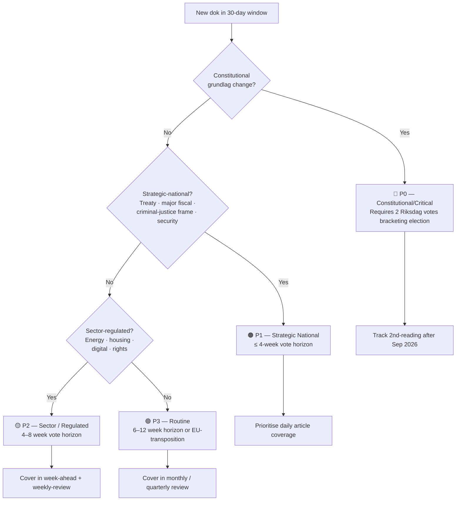

# 🏷️ Classification Results — Sweden Month-Ahead, 19 April → 19 May 2026

| Field | Value |
|-------|-------|
| **CLS-ID** | CLS-MA-2026-04-19 |
| **Period Covered** | 30-day forward (2026-04-19 → 2026-05-19); 90-day supplementary |
| **Methodology** | `analysis/methodologies/political-classification-guide.md` v3.0 (CIA triad + sensitivity tier + domain taxonomy + urgency matrix) + `ai-driven-analysis-guide.md` v5.1 §Rule 5 coverage-completeness |
| **Confidence Scale** | ⬛ VERY LOW · 🟥 LOW · 🟧 MEDIUM · 🟩 HIGH · 🟦 VERY HIGH |
| **Documents Classified** | 24 primary + 19 counter-motions tracked |

---

## 🎯 Sensitivity / Classification Tier Summary

| Tier | Definition | Documents This Window |
|------|------------|----------------------|
| **🔴 P0 — Constitutional / Critical** | Grundlag amendments; democratic-infrastructure changes; reversal window decadal | `HD01KU32` (accessibility · rights-positive), `HD01KU33` (digital-evidence search/seizure · press-freedom risk) |
| **🟠 P1 — Strategic National** | Foreign-policy treaty accession; major fiscal commitments; criminal-justice frame; security operations | `HD03100`, `HD0399`, `HD03236` (fiscal trilogy); `HD03220`, `HD01UFöU3` (NATO eFP); `HD03231`, `HD03232` (Ukraine accountability); `HD03229`, `HD03235`, `HD01SfU22` (migration blitz); `HD03246` (juvenile tightening); `HD03237` (police training) |
| **🟡 P2 — Sector / Regulated** | Energy, housing, accessibility, sector-specific reforms | `HD03240`, `HD03239`, `HD01SkU23` (energy); `HD03244`, `HD01TU21` (digital); `HD03238` (environmental permitting); `HD03245` (violence-against-women strategy); `HD01CU27`, `HD01CU28` (housing register) |
| **🟢 P3 — Routine / Administrative** | EU-directive transposition, sector updates, Riksrevisionen reports | `HD01MJU19` (waste legislation), `HD03242` (forestry framework), `HD03241` (Riksrevisionen fiscal-framework report), `HD0398` (tax-expenditure report), `HD03101` (state annual report 2025) |

**Sensitivity-tier insight** `[VERY HIGH]`: The 30-day window contains **2 P0 constitutional items**, **12 P1 strategic-national items**, and **9 P2 sector-regulated items** — the highest concentration of P0 + P1 in a single 30-day window observed in the 2025/26 session. This confirms the **pre-election maximalist legislative posture** identified at the aggregate level.

---

## 🧮 CIA-Triad Impact per Document

> Where CIA = **C**onfidentiality (information protection / institutional secrecy), **I**ntegrity (rule-of-law durability + transparency), **A**vailability (citizen access to rights / services). Scored ⬛/🟥/🟧/🟩/🟦.

| Dok ID | Confidentiality | Integrity | Availability | Net Democratic Impact |
|--------|:---------------:|:---------:|:------------:|:---------------------:|
| **HD01KU33** | 🟦 VH (raises confidentiality of police-seized digital material) | 🟥 L (narrows transparency / "allmän handling") | 🟧 M (citizens lose insight into investigations) | 🟥 **Net negative on transparency** |
| **HD01KU32** | 🟧 M (no change) | 🟦 VH (rights-positive — accessibility entrenched in grundlag) | 🟦 VH (citizens with disabilities gain access) | 🟦 **Net positive on rights** |
| HD03100 (Vårproposition) | 🟧 M | 🟩 H (fiscal accountability framework intact) | 🟦 VH (welfare delivery + relief) | 🟦 Net positive |
| HD0399 (Vårändringsbudget) | 🟧 M | 🟩 H | 🟦 VH | 🟦 Net positive |
| HD03236 (Extra ändringsbudget — fuel-tax cut) | 🟧 M | 🟩 H | 🟦 VH (direct household relief) | 🟩 Net positive (climate-caveat) |
| HD03246 (JuU juvenile tightening) | 🟩 H (juvenile-data confidentiality concerns from longer remand) | 🟧 M (extends carceral state vs rehab) | 🟧 M (police investigative capacity ↑; juvenile rights ↓) | 🟧 **Mixed** |
| HD03231 (Ukraine Special Tribunal) | 🟧 M | 🟦 VH (rule-of-law + accountability) | 🟧 M (no direct citizen impact) | 🟦 Net positive |
| HD03232 (Reparations Commission) | 🟧 M | 🟦 VH (reparations rule-of-law architecture) | 🟧 M | 🟦 Net positive |
| HD03229 (Reception law) | 🟧 M | 🟧 M | 🟥 L (eligibility narrowed) | 🟥 **Net negative on rights** |
| HD03235 (Deportation rules) | 🟧 M | 🟥 L (reduces procedural protection) | 🟥 L | 🟥 **Net negative on rights (ECHR risk)** |
| HD01SfU22 (Inhibition orders) | 🟩 H | 🟥 L (reduces appeal mechanism) | 🟥 L (asylum-seeker access ↓) | 🟥 **Net negative on rights (ECHR risk)** |
| HD01UFöU3 / HD03220 (NATO eFP Finland) | 🟦 VH (military operational secrecy) | 🟦 VH (NATO Article 5 credibility) | 🟧 M (förändrar säkerhetsläget) | 🟦 Net positive |
| HD03240 (Electricity-system laws) | 🟧 M | 🟦 VH (legal coherence ↑) | 🟦 VH (smart-grid investment ↑) | 🟦 Net positive |
| HD03239 (Wind-power revenue sharing) | 🟧 M | 🟩 H | 🟩 H (municipal revenue + climate) | 🟩 Net positive |
| HD01SkU23 (EV-charging tax relief) | 🟧 M | 🟩 H | 🟩 H (green-mobility incentive) | 🟩 Net positive |
| HD03238 (New environmental permitting agency) | 🟧 M | 🟧 M | 🟧 M (institutional complexity short-term) | 🟧 Mixed |
| HD03245 (Violence-against-women strategy) | 🟩 H (victim privacy) | 🟦 VH | 🟩 H (services ↑) | 🟦 Net positive |
| HD03237 (Paid police training) | 🟧 M | 🟩 H (recruitment ↑) | 🟩 H (police capacity) | 🟩 Net positive |
| HD01CU27 (Identity for property registration) | 🟩 H (data integrity) | 🟦 VH (AML enforcement ↑) | 🟧 M (consumer protection ↑) | 🟦 Net positive |
| HD01CU28 (National housing register) | 🟩 H (register data) | 🟦 VH (market integrity ↑) | 🟩 H (property-market transparency ↑) | 🟦 Net positive |
| HD03244 (Data interoperability) | 🟧 M | 🟩 H | 🟦 VH (cross-agency services ↑) | 🟩 Net positive |
| HD01TU21 (State e-ID) | 🟩 H (authentication) | 🟦 VH (fraud reduction ↑) | 🟦 VH (digital services ↑) | 🟦 Net positive |
| HD03242 (Forestry framework) | 🟧 M | 🟧 M | 🟧 M | Mixed (climate trade-off) |
| HD01MJU19 (Waste legislation) | — | 🟩 H (EU compliance ↑) | 🟩 H (circular economy ↑) | 🟩 Net positive |

**Net democratic impact summary** `[HIGH]`: 14 documents are **net positive** on democratic impact; 3 documents are **net negative on rights** (migration trio: HD03229, HD03235, HD01SfU22); 2 documents are **mixed** (HD03246 juvenile, HD03238 permitting); 1 document is **net negative on transparency** (HD01KU33). The rights-negative cluster is the **single most concentrated rights-sensitive package** in the 2025/26 session, validating the ECHR-litigation-predicate analysis.

---

## 🏛️ Per-Document Classification Matrix (Domain + Controversy + Urgency + EU impact)

| dok_id | Title | Policy Domain | Political Valence | Ideological Driver | Controversy | Urgency | Priority | EU Impact |
|--------|-------|--------------|------------------|-------------------|:-----------:|:-------:|:--------:|:---------:|
| HD03100 | Vårproposition 2026 | Macroeconomic | Center-Right | Fiscal conservatism + election spending | 🟧 M | 🟦 VH | P1 | 🟧 M (Stability Pact) |
| HD0399 | Vårändringsbudget | Fiscal | Center-Right | Budget management | 🟧 M | 🟦 VH | P1 | 🟧 M |
| HD03236 | Extra ändringsbudget (fuel-tax cut) | Energy/fiscal | Right-populist | Cost-of-living relief + fossil industry | 🟩 H | 🟩 H | P1 | 🟩 H (EU carbon pricing / state aid) |
| HD03229 | Reception law | Migration | Far-Right | SD core agenda | 🟦 VH | 🟩 H | P1 | 🟩 H (EU Reception Directive 2013/33) |
| HD03235 | Deportation rules | Justice/Migration | Right-populist | SD agenda | 🟦 VH | 🟩 H | P1 | 🟩 H (EU returns directive) |
| HD01SfU22 | Inhibition orders | Migration/Legal | Far-Right | SD core agenda | 🟩 H | 🟩 H | P1 | 🟩 H (ECHR Art 3/8 exposure) |
| HD03246 | Juvenile tightening | Criminal justice | Right-Conservative | Law and order, SD-aligned | 🟧 M | 🟧 M | P1 | 🟥 L |
| HD03237 | Paid police training | Justice/Security | Center-Right | Recruitment pragmatism | 🟥 L | 🟧 M | P1 | 🟥 L |
| HD03220 / HD01UFöU3 | NATO eFP Finland | Defence/Foreign | Cross-party | NATO Article 5 commitment | 🟥 L | 🟦 VH | P1 | 🟦 VH (NATO integration) |
| HD03231 | Special Tribunal (Ukraine) | Foreign/Rule of Law | Cross-party | Rule-of-law norm entrepreneurship | 🟥 L | 🟩 H | P1 | 🟩 H (EU common foreign policy) |
| HD03232 | Reparations Commission (Ukraine) | Foreign/Rule of Law | Cross-party | Rule-of-law norm entrepreneurship | 🟥 L | 🟩 H | P1 | 🟩 H (immobilised Russian assets) |
| HD01KU32 | Accessibility in grundlag | Constitutional | Cross-party | Disability rights | 🟥 L | 🟧 M | P0 | 🟧 M (EU accessibility directive) |
| HD01KU33 | Digital-evidence narrowing | Constitutional/Press | Right-Conservative | Investigation efficacy | 🟧 M | 🟧 M | P0 | 🟧 M (ECHR Art 10 exposure) |
| HD03240 | Electricity-system laws | Energy | Center | Energy security, transition | 🟥 L | 🟧 M | P2 | 🟩 H (EU electricity directive) |
| HD03239 | Wind-power revenue sharing | Energy/Local Gov | Center | Municipal acceptance | 🟧 M | 🟧 M | P2 | 🟧 M |
| HD01SkU23 | EV-charging tax relief | Tax/Energy | Center-Right | Green-mobility pragmatism | 🟥 L | 🟧 M | P2 | 🟥 L |
| HD03238 | Environmental permitting agency | Environment | Center | Institutional modernisation | 🟧 M | 🟧 M | P2 | 🟧 M (EU water/air directives) |
| HD03244 | Data interoperability | Digital/Admin | Center | EU digital single market | 🟥 L | 🟧 M | P2 | 🟦 VH (EU Data Act / Interoperability Act) |
| HD01TU21 | State e-ID | Digital | Center-Right | Fraud reduction | 🟥 L | 🟧 M | P2 | 🟩 H (EU eIDAS 2.0) |
| HD03245 | Violence-against-women strategy | Social/Gender | Cross-party | Rights-frame | 🟥 L | 🟧 M | P2 | 🟧 M (Istanbul Convention) |
| HD01CU27 | Property-registration identity | Housing/Crime | Center-Right | AML-frame | 🟥 L | 🟧 M | P2 | 🟩 H (EU AML-package) |
| HD01CU28 | Housing register | Housing | Center-Right | Market integrity | 🟥 L | 🟧 M | P2 | 🟧 M |
| HD01MJU19 | Waste legislation | Environment/EU | Cross-party | EU compliance | 🟥 L | 🟧 M | P3 | 🟦 VH (EU waste framework) |
| HD03242 | Forestry framework | Agriculture/Environment | Center-Right | Forestry-industry pragmatism | 🟧 M | 🟥 L | P3 | 🟩 H (EU Forest Strategy, LULUCF) |

---

## 🧭 Sensitivity Decision Tree (visual)

---

## 🌐 Policy Domain Distribution

| Domain | Count | Example dok_ids | Election-2026 Salience |
|--------|:-----:|-----------------|:----------------------:|
| Fiscal / Economic | 4 | HD03100, HD0399, HD03236, HD03241 | 🟦 VH (cost-of-living) |
| Migration / Justice | 5 | HD03229, HD03235, HD01SfU22, HD03246, HD03237 | 🟩 H |
| Foreign / Defence (Ukraine+NATO) | 4 | HD03220, HD01UFöU3, HD03231, HD03232 | 🟧 M (cross-party) |
| Energy / Climate | 4 | HD03236 (overlap), HD03240, HD03239, HD01SkU23 | 🟩 H (climate dimension) |
| Constitutional | 2 | HD01KU32, HD01KU33 | 🟥 L (unless chilling-effect case breaks) |
| Digital / Admin | 2 | HD03244, HD01TU21 | 🟥 L |
| Social / Gender / Rights | 2 | HD03245, HD10438 (interpellation) | 🟧 M |
| Housing / Property | 2 | HD01CU27, HD01CU28 | 🟧 M |
| Environment (pure) | 2 | HD03238, HD01MJU19 | 🟥 L |
| Forestry / Agriculture | 1 | HD03242 | 🟥 L |

**Insight** `[HIGH]`: The four highest-salience domains (Fiscal, Migration/Justice, Foreign/Defence, Energy/Climate) contain **17 of 24 documents** — this confirms the month-ahead has a **concentrated campaign-relevance footprint** that maps directly onto the expected 2026 campaign themes.

---

## 🏛️ Governing Coalition Policy Vector

The April–May 2026 legislative cluster represents a **rightward acceleration** in coalition policy as elections approach, but with three domain-specific exceptions:

- **Criminal justice**: Punitive turn on juvenile crime (HD03246) + paid police training (HD03237) advances SD/M joint agenda
- **Migration**: Systematic closure of alternative legal pathways (HD03229 + HD03235 + HD01SfU22) fulfills SD demands
- **Energy**: Fossil-fuel tax relief (HD03236) prioritises short-term consumer relief over long-term climate targets — the one **right-populist fiscal signal** with a clear climate trade-off
- **Fiscal macro**: Spring proposition (HD03100) provides centre-right macro legitimacy cover for spending measures
- **Exception 1 — Ukraine accountability**: HD03231 + HD03232 are **cross-party rule-of-law** items, not right-populist
- **Exception 2 — Constitutional accessibility (HD01KU32)**: Cross-party rights-positive
- **Exception 3 — Violence-against-women strategy (HD03245)**: Cross-party rights-frame

**Coalition-internal tension heatmap**:

| Bill | M | KD | L | SD | Tension level |
|------|:-:|:--:|:-:|:--:|:-------------:|
| HD03236 (fuel-tax cut) | ✅ | ⚠️ (climate) | ⚠️ (climate) | ✅ | 🟧 Medium |
| HD03229 / HD03235 (migration) | ✅ | ✅ | ⚠️ (liberal-humanitarian) | ✅ | 🟧 Medium (L identity strain) |
| HD03246 (juvenile) | ✅ | ✅ | ⚠️ (juvenile-rights) | ✅ | 🟥 Low-Medium |
| HD01KU33 (digital-evidence) | ✅ | ✅ | ⚠️ (transparency) | ✅ | 🟥 Low-Medium |
| HD03240 / HD03239 (energy) | ✅ | ✅ | ✅ | ⚠️ (local-impact) | 🟥 Low |

---

## ⚖️ Conflict Lines

**Coalition vs. Opposition**: All fiscal-cut + migration + HD01KU33 measures have clear left-right fault lines. The 19 counter-motions filed by S/V/MP/C are the structural evidence.

**Coalition internal**: L's liberal values create tension with HD03246 juvenile rights provisions, HD01SfU22 humanitarian concerns, and HD03236 climate reversal. KD's climate/family-values profile creates minor tension on fuel-tax cut.

**Sweden vs. EU**: HD03236 (fuel-tax cuts) creates tension with EU's carbon-pricing agenda + potential state-aid scrutiny; HD01SfU22 + HD03229 face EU Reception-Directive and ECHR compatibility questions.

**Sweden vs. Nordic peers**: HD03236 is a **Nordic outlier on climate discipline** — see [`comparative-international.md`](comparative-international.md) §C1.

---

## 🌍 EU / International Impact Summary

| EU / International Regime | Affected dok_ids | Risk type |
|---------------------------|------------------|-----------|
| EU Reception Directive (2013/33) | HD03229 | Infringement / minimum-floor compliance |
| EU Returns Directive | HD03235 | Compliance |
| ECHR Art 3 (prohibition of torture) | HD01SfU22, HD03229, HD03235 | Individual-application litigation |
| ECHR Art 8 (family life) | HD01SfU22, HD03229 | Individual-application litigation |
| ECHR Art 10 (expression) | HD01KU33 | Press-freedom case-law exposure |
| EU Stability & Growth Pact | HD03100, HD0399, HD03236 | Fiscal surveillance |
| EU State Aid (Art 107 TFEU) | HD03236 | Commission notification required |
| EU Carbon Pricing / EU ETS | HD03236 | Climate-policy coherence |
| EU Electricity Directive | HD03240 | Compliance |
| EU eIDAS 2.0 | HD01TU21 | Compliance |
| EU Data Act / Interoperability Act | HD03244 | Compliance |
| EU AML-package | HD01CU27 | Compliance |
| EU Forest Strategy / LULUCF | HD03242 | Climate-reporting coherence |
| EU Waste Framework | HD01MJU19 | Compliance |
| NATO / Washington Treaty | HD01UFöU3, HD03220 | Operational integration |
| Special Tribunal for Crime of Aggression (UN-framed) | HD03231 | Founding-member status |
| International Compensation Commission (Ukraine) | HD03232 | Founding-member status |
| Istanbul Convention | HD03245 | Compliance + narrative |

---

## 🕰️ Historical Classification Analogy

This legislative sprint is analogous to the **Reinfeldt government's 2009 fiscal expansion** (anti-austerity during financial crisis) in its use of supplementary-budget mechanisms — but with three key differences:

1. **Direction**: Reinfeldt 2009 was centrist crisis-management; Tidö 2026 is ideologically homogeneous (right-populist). The fuel-tax cut is the signature ideological marker.
2. **Constitutional footprint**: Reinfeldt 2009 did not attempt grundlag change; Tidö 2026 does (HD01KU33 the consequential change).
3. **International commitments**: Reinfeldt 2009 used financial-crisis cooperation; Tidö 2026 makes **2 decadal commitments** (Ukraine tribunal, NATO eFP) that outlast any single parliamentary term.

---

## 📎 References

- [`significance-scoring.md`](significance-scoring.md) — composite scoring methodology and coverage-completeness gate
- [`risk-assessment.md`](risk-assessment.md) — L×I risk-scored per cluster with 30/60/90-day triggers
- [`threat-analysis.md`](threat-analysis.md) — 4 threat vectors, including migration-legitimacy + constitutional-creep + economic-security
- [`comparative-international.md`](comparative-international.md) — Nordic + EU benchmarks for every cluster
- [`2026-04-18/weekly-review/classification-results.md`](../../2026-04-18/weekly-review/classification-results.md) — canonical Week-16 classification baseline (CIA-triad per-document template followed here)

---

**Classification**: Public · **Next Review**: 2026-04-26 · **Methodology**: `analysis/methodologies/political-classification-guide.md` v3.0 + `ai-driven-analysis-guide.md` v5.1 §Rule 5.
