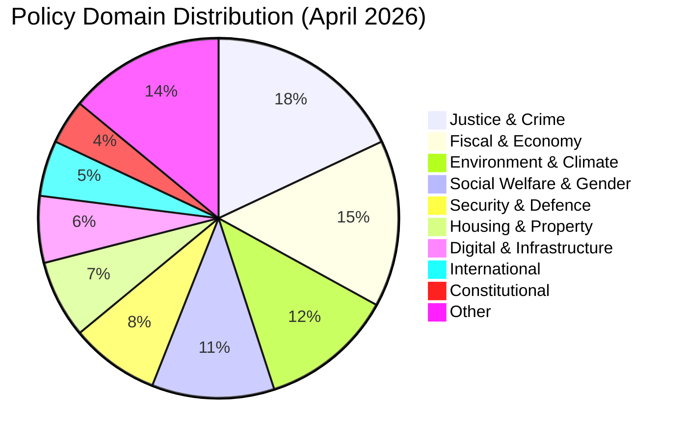

# Classification Results — Monthly Review: March 20 – April 19, 2026

**Analysis Date**: 2026-04-19  
**Article Type**: monthly-review

---

## Document Classification by Policy Domain

---

## Classification Matrix

| dok_id | Title (EN) | Domain | Type | Significance | Electoral Relevance |
|--------|-----------|--------|------|-------------|---------------------|
| HD03218 | Double penalties for criminal networks | Justice | Proposition | CRITICAL | HIGH |
| HD03100 | Spring Economic Proposition 2026 | Fiscal | Proposition | CRITICAL | VERY HIGH |
| HD03236 | Extra budget — fuel tax + energy | Fiscal | Proposition | CRITICAL | VERY HIGH |
| HD03220 | NATO Finland contribution | Defence | Proposition | HIGH | HIGH |
| HD03238 | New environmental permit agency | Environment | Proposition | HIGH | MEDIUM |
| HD03245 | National strategy against men's violence | Social | Proposition | HIGH | HIGH |
| HD03246 | Stricter youth offender rules | Justice | Proposition | HIGH | HIGH |
| HD03217 | Extended civil servant criminal liability | Justice | Proposition | HIGH | MEDIUM |
| HD03242 | Active forestry regulation | Environment | Proposition | HIGH | MEDIUM |
| HD03244 | Data interoperability public sector | Digital | Proposition | MEDIUM | LOW |
| HD03239 | Wind power in municipalities | Energy | Proposition | MEDIUM | MEDIUM |
| HD03240 | New electricity system law | Energy | Proposition | MEDIUM | MEDIUM |
| HD01CU28 | National condominium register | Housing | Committee | MEDIUM | LOW |
| HD01CU27 | Property ID requirements | Housing | Committee | MEDIUM | LOW |
| HD01KU32 | Media accessibility (vilande) | Constitutional | Committee | MEDIUM | LOW |
| HD01KU33 | Digital records in searches (vilande) | Constitutional | Committee | MEDIUM | LOW |
| HD10438 | Women's shelter closures | Social | Interpellation | HIGH | HIGH |
| HD10437 | Wage transparency directive | Labour | Interpellation | MEDIUM | MEDIUM |
| HD024098 | Motion — oppose fuel tax cut | Fiscal | Motion | MEDIUM | HIGH |

---

## Thematic Clusters

### Cluster 1: Pre-Election Crime Package (Very High Electoral Salience)
Documents: HD03218, HD03246, HD03217, HD03237
- Narrative: SD-driven agenda delivered through coalition legislation
- Opposition stance: S/V abstain or oppose, C partially supportive

### Cluster 2: Spring Budget Package (Very High Electoral Salience)
Documents: HD03100, HD0399, HD03236, HD03241, HD03243
- Narrative: Responsible budget + household relief
- Opposition stance: MP opposes fuel cuts; S demands structural investment

### Cluster 3: Environmental Reform Cluster (High EU/International Relevance)
Documents: HD03238, HD03239, HD03240, HD03242, MJU19
- Narrative: Streamlined regulation for green economy growth
- Opposition stance: V/MP strongly oppose deregulation; C mixed

### Cluster 4: Social Protection Gap (High Public Attention)
Documents: HD10438, HD10437, HD03245, HD11719
- Narrative: Gap between legislative intent and implementation funding
- Opportunity for S to campaign on welfare state restoration
