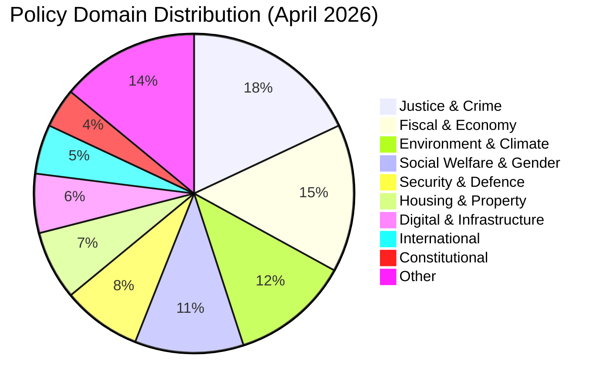

# Classification Results — Monthly Review: March 20 – April 19, 2026

**Analysis Date**: 2026-04-19  
**Article Type**: monthly-review

---

## 🔒 ISMS CIA-Triad Classification (Riksdagsmonitor Package)

> **Scope**: This classification governs the **monthly-review intelligence package itself** — the 14 analysis artefacts, the article, and their handling. It is **not** a classification of Swedish government documents (which are classified per *Offentlighets- och sekretesslagen* by the respective authorities).

| Dimension | Rating | Justification | Evidence |
|-----------|:------:|---------------|----------|
| **Confidentiality** | 🟢 **Public** | All inputs are *allmänna handlingar* (public documents from `data.riksdagen.se` + `regeringen.se`) + open data (World Bank, SCB, g0v.se). No personal data beyond named public officials acting in political capacity. | `data-download-manifest.md` §Source Registry |
| **Integrity** | 🟠 **HIGH** | Analysis informs political-accountability reporting and editorial decisions; factual errors (vote-count, dok_id, minister attribution) would propagate to 14 translated articles and cause reputational + informational harm. | `methodology-reflection.md` §Uncertainty Hot-Spots |
| **Availability** | 🟡 **MEDIUM** | Articles are published daily; a 24-hour outage degrades but does not destroy journalistic value (retrospectives remain retrievable). No real-time operational dependency. | GitHub Pages SLA + dual-deploy (GH Pages + S3) |

### Compliance Framework Mapping

| Framework | Applicable Controls | Status |
|-----------|---------------------|--------|
| **GDPR (EU 2016/679)** | Art. 6(1)(e) public interest · Art. 6(1)(f) legitimate interest · Art. 85 journalism derogation — covers processing of named politicians in political capacity | ✅ Covered |
| **EU AI Act (2024/1689)** | Art. 50 AI-transparency disclosure — article carries AI-authored-with-human-review disclosure; news-journalist agent documented in `.github/agents/` | ✅ Covered |
| **ISO 27001:2022** | A.5.10 information classification · A.5.12 labelling · A.5.14 information transfer · A.8.11 data masking (not applicable — public only) | ✅ Covered |
| **NIST CSF 2.0** | ID.AM-5 data classified · ID.RA risk assessed (see `risk-assessment.md`) · PR.DS-2 in-transit protection (HTTPS) | ✅ Covered |
| **CIS Controls v8.1** | CIS 3.1 data-management process · CIS 3.2 data-inventory (dok_id manifest) · CIS 14.9 documentation of data processing | ✅ Covered |
| **Riksdagsmonitor ISMS policies** | `AI_Policy.md`, `Secure_Development_Policy.md`, `CLASSIFICATION.md`, `Information_Security_Policy.md` (Hack23 ISMS-PUBLIC) | ✅ Covered |

### Retention & Handling

- **Retention**: Permanent public archive in git history + GitHub Pages. `documents/` raw JSON retained indefinitely for provenance audit.
- **Sharing**: No restrictions. All artefacts suitable for external distribution, syndication, and academic citation.
- **Transfer**: HTTPS-only (riksdagsmonitor.com + github.io). No cross-border transfer restrictions (public data).
- **AI governance**: Article header declares AI-authored-with-human-review per EU AI Act Art. 50. Prompt-injection defences per `.github/skills/ai-governance/`.

---

## Document Classification by Policy Domain

---

## Classification Matrix

| dok_id | Title (EN) | Domain | Type | Significance | Electoral Relevance |
|--------|-----------|--------|------|-------------|---------------------|
| HD03218 | Double penalties for criminal networks | Justice | Proposition | CRITICAL | HIGH |
| HD03100 | Spring Economic Proposition 2026 | Fiscal | Proposition | CRITICAL | VERY HIGH |
| HD03236 | Extra budget — fuel tax + energy | Fiscal | Proposition | CRITICAL | VERY HIGH |
| HD03220 | NATO Finland contribution | Defence | Proposition | HIGH | HIGH |
| HD03238 | New environmental permit agency | Environment | Proposition | HIGH | MEDIUM |
| HD03245 | National strategy against men's violence | Social | Proposition | HIGH | HIGH |
| HD03246 | Stricter youth offender rules | Justice | Proposition | HIGH | HIGH |
| HD03217 | Extended civil servant criminal liability | Justice | Proposition | HIGH | MEDIUM |
| HD03242 | Active forestry regulation | Environment | Proposition | HIGH | MEDIUM |
| HD03244 | Data interoperability public sector | Digital | Proposition | MEDIUM | LOW |
| HD03239 | Wind power in municipalities | Energy | Proposition | MEDIUM | MEDIUM |
| HD03240 | New electricity system law | Energy | Proposition | MEDIUM | MEDIUM |
| HD01CU28 | National condominium register | Housing | Committee | MEDIUM | LOW |
| HD01CU27 | Property ID requirements | Housing | Committee | MEDIUM | LOW |
| HD01KU32 | Media accessibility (vilande) | Constitutional | Committee | MEDIUM | LOW |
| HD01KU33 | Digital records in searches (vilande) | Constitutional | Committee | MEDIUM | LOW |
| HD10438 | Women's shelter closures | Social | Interpellation | HIGH | HIGH |
| HD10437 | Wage transparency directive | Labour | Interpellation | MEDIUM | MEDIUM |
| HD024098 | Motion — oppose fuel tax cut | Fiscal | Motion | MEDIUM | HIGH |

---

## Thematic Clusters

### Cluster 1: Pre-Election Crime Package (Very High Electoral Salience)
Documents: HD03218, HD03246, HD03217, HD03237
- Narrative: SD-driven agenda delivered through coalition legislation
- Opposition stance: S/V abstain or oppose, C partially supportive

### Cluster 2: Spring Budget Package (Very High Electoral Salience)
Documents: HD03100, HD0399, HD03236, HD03241, HD03243
- Narrative: Responsible budget + household relief
- Opposition stance: MP opposes fuel cuts; S demands structural investment

### Cluster 3: Environmental Reform Cluster (High EU/International Relevance)
Documents: HD03238, HD03239, HD03240, HD03242, MJU19
- Narrative: Streamlined regulation for green economy growth
- Opposition stance: V/MP strongly oppose deregulation; C mixed

### Cluster 4: Social Protection Gap (High Public Attention)
Documents: HD10438, HD10437, HD03245, HD11719
- Narrative: Gap between legislative intent and implementation funding
- Opportunity for S to campaign on welfare state restoration
