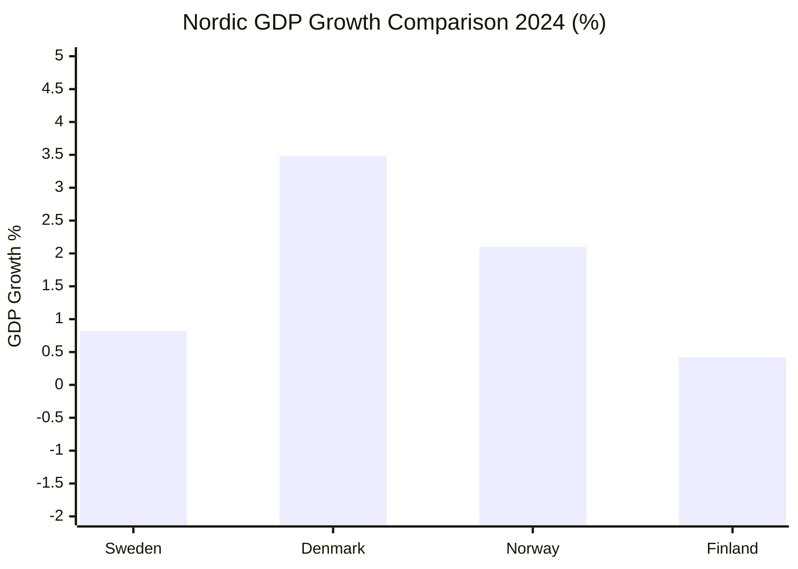

# Comparative International Context — April 2026 Monthly Review

| Field | Value |
|-------|-------|
| **File-ID** | CMP-2026-M04 |
| **Analysis Date** | 2026-04-19 |
| **Article Type** | `monthly-review` |
| **Jurisdictions Benchmarked** | 🇸🇪 Sweden · 🇩🇰 Denmark · 🇳🇴 Norway · 🇫🇮 Finland · 🇩🇪 Germany · 🇳🇱 Netherlands · 🇪🇺 EU institutions |
| **Data Sources** | World Bank · OECD · Eurostat · Reporters Without Borders (RSF) · Council of Europe · EU Commission DG ENV / DG JUST |
| **Cross-Reference** | [`analysis/daily/2026-04-18/weekly-review/comparative-international.md`](../../2026-04-18/weekly-review/comparative-international.md) · [`analysis/daily/2026-04-19/month-ahead/comparative-international.md`](../month-ahead/comparative-international.md) |

---

## Cluster Overview: Sweden's April 2026 Innovates / Follows / Diverges Scorecard

| Policy Cluster | Flagship Docs | SE Innovates | SE Follows | SE Diverges |
|---------------|---------------|:------------:|:----------:|:-----------:|
| Fiscal stimulus + fuel-tax cut | HD03100, HD0399, HD03236 | | ✅ (DK 2023, DE 2022) | |
| Criminal-networks double penalty | HD03218 | | ✅ (DK 2018 gang zones) | |
| Youth-offender tightening | HD03246 | | ✅ (NL, DK) | |
| Civil-servant criminal liability | HD03217 | ✅ (among strongest in EU) | | |
| Press-freedom / TF narrowing (KU33) | HD01KU33 | | | ⚠️ (EU average tightens) |
| Accessibility-oriented TF change (KU32) | HD01KU32 | ✅ | | |
| Active forestry + wind municipal veto | HD03242, HD03239 | | | ❌ (EU Biodiversity 2030) |
| New permit authority | HD03238 | | ✅ (DE UBA, FI Tukes/SYKE) | |
| Ukraine Crime-of-Aggression Tribunal | HD03231 | ✅ (founding member) | ✅ (EU position) | |
| International Compensation Commission | HD03232 | ✅ | | |
| NATO eFP operational contribution | HD03220 | | ✅ (DE/UK/CA Baltic models) | |
| EU Wage-Transparency transposition pace | HD10437 | | | ⚠️ (DK Q1, DE Q2, SE lagging) |

---

## 1. Nordic Economic Baseline

| Indicator (2024, unless stated) | 🇸🇪 SE | 🇩🇰 DK | 🇳🇴 NO | 🇫🇮 FI | 🇩🇪 DE | 🇳🇱 NL | Source |
|--------------------------------|:---:|:---:|:---:|:---:|:---:|:---:|:---:|
| GDP growth | 0.82 % | 3.48 % | 2.10 % | 0.42 % | -0.2 % est. | 0.9 % | World Bank NY.GDP.MKTP.KD.ZG |
| Unemployment 2025 | 8.7 % | 5.5 % | 3.6 % | 7.0 % | 3.6 % | 3.4 % | ILO / Eurostat |
| Inflation 2024 | 2.84 % | 2.1 % | 3.1 % | 2.2 % | 2.3 % | 3.2 % | World Bank FP.CPI.TOTL.ZG |
| GDP per capita USD | 57,117 | 68,886 | 87,962 | 53,009 | 52,746 | 63,767 | World Bank NY.GDP.PCAP.CD |
| Public debt / GDP 2024 | 33 % | 30 % | 42 % (NBIM-adj.) | 77 % | 64 % | 46 % | Eurostat / OECD |
| Defence expenditure / GDP 2025 | 2.1 % | 2.4 % | 2.2 % | 2.4 % | 2.1 % | 2.0 % | NATO |

**Key readings**:
- Sweden is the **Nordic growth-laggard** (0.82 %), trailing DK by ≈ 2.7 pp. The Spring Fiscal Trilogy (`HD03100` / `HD0399` / `HD03236`) is rational counter-cyclical policy but faces **low fiscal-multiplier terrain** (8.7 % unemployment, high precautionary savings).
- Unemployment gap (SE 8.7 % vs. DK 5.5 %, NO 3.6 %) is the single largest **electoral vulnerability** for the Tidö government — see `swot-analysis.md` §Weakness W-1.
- Inflation has **re-converged** with Nordic peers (2.84 % vs. 2.1–3.2 % band) — the 2023 crisis peak of 8.55 % is resolved. Reduces Riksbank-policy noise from the election.

---

## 2. Criminal-Justice Reform Cluster

**Sweden**: `HD03218` mandatory double-penalty enhancement for crimes with gang-network connection; `HD03246` stricter youth-offender rules; `HD03217` extended criminal liability for civil servants acting outside authority.

| Jurisdiction | Instrument | Entered Force | Comparability to HD03218 |
|-------------|-----------|:-------------:|-------------------------|
| 🇩🇰 Denmark | Gang-zone law (*visitationszoner* + penalty-doubling) | 2018, expanded 2023 | **Closest precedent** — zone-based penalty doubling; SE's HD03218 adopts network-based trigger instead (broader) |
| 🇳🇱 Netherlands | *Ondermijningswet* (organised-crime financial-tracing) | 2022 | Parallel toolkit; SE lacks equivalent financial-tracing provisions |
| 🇩🇪 Germany | § 129a / § 129b StGB (terror/organised-crime) | Long-standing | Different trigger (membership) but similar enhancement logic |
| 🇳🇴 Norway | Penalty-enhancement *straffeloven* § 79 (c) | 2021 | Similar conceptually; narrower in scope |
| 🇫🇮 Finland | RL 6:5 aggravation (organised-crime element) | Stable | Most restrained Nordic approach |

**SE posture**: **FOLLOWS** the DK gang-zone precedent but with a **broader network-based trigger**. SE's `HD03217` civil-servant liability is **AMONG THE STRONGEST IN EU** (only NO has a comparably broad inner-authority liability rule). ECHR-litigation risk: see `risk-assessment.md` R-04.

---

## 3. Constitutional Press-Freedom Cluster (KU32 + KU33 *vilande*)

**Sweden**: `HD01KU32` media-accessibility grundlag change; `HD01KU33` search-and-seizure of digital evidence narrowing "allmän handling" scope.

| Jurisdiction | Baseline Press-Freedom Framework | 2024–2026 Direction | RSF 2025 Index |
|-------------|----------------------------------|:-------------------:|:--------------:|
| 🇸🇪 Sweden | *Tryckfrihetsförordningen* (1766) — world's oldest | ⬇ Narrowing (KU33) | 4 |
| 🇳🇴 Norway | *Grunnloven* § 100; *Offentleglova* | ↔ Stable | 1 |
| 🇩🇰 Denmark | *Grundloven* § 77; *Offentlighedsloven* 2014 | ↔ Stable | 3 |
| 🇫🇮 Finland | *Perustuslaki* § 12; *Julkisuuslaki* 1999 | ↑ Slight strengthening | 5 |
| 🇩🇪 Germany | Art. 5 Grundgesetz | ↔ Stable | 10 |
| 🇳🇱 Netherlands | Art. 7 Grondwet | ↔ Stable | 6 |

**SE posture**: **DIVERGES** from Nordic peers. Every other Nordic country is stable or strengthening press-freedom baselines; Sweden narrows via KU33. **Norway's statutory-trigger model** (*Offentleglova* enumerated exceptions with written-reason requirement) is the most credible cross-bloc compromise path for the KU33 second-reading debate — `scenario-analysis.md` H-B monitors this.

---

## 4. Environmental Deregulation Cluster & EU Friction

**Sweden**: `HD03238` new environmental permit authority · `HD03242` active forestry · `HD03239` wind-power municipal veto · `HD03240` new electricity-system law.

| EU Instrument | Sweden Compliance Risk | Comparable Precedent |
|--------------|-----------------------|----------------------|
| EU Biodiversity Strategy 2030 (30 % protected) | 🔴 HIGH — HD03242 active-forestry narrows species protection | 🇫🇮 FI faced 2023 Natura-2000 peatland scrutiny → species-inventory compromise |
| EU Taxonomy Regulation (sustainable-finance TEG) | 🟠 MEDIUM — forestry company financing classification at risk | — |
| EU Forest Strategy for 2030 | 🟠 MEDIUM — binding elements under revision | 🇩🇪 DE holding-pattern |
| Renewable Energy Directive III | 🟡 LOW — HD03239 wind-veto adds local-opt-out but meets target pathway | 🇳🇱 NL has comparable local-veto mechanisms |
| Water Framework Directive | 🟢 None — unchanged | — |
| Habitats Directive 92/43/EEC | 🟠 MEDIUM — active-forestry interaction with Article 6(3) | 🇫🇮 FI precedent |

**SE posture**: **DIVERGES** from EU trajectory on biodiversity. Finland's 2023 Natura-2000 species-inventory compromise is the credible de-escalation path — see `scenario-analysis.md` H-A 90-day trajectory and `risk-assessment.md` R-02.

---

## 5. Geopolitical / NATO Cluster

**Sweden**: `HD03220` 1,200 troops to Finland under enhanced Forward Presence (first post-accession operational contribution); `HD03231` + `HD03232` Ukraine tribunal + reparations commission.

### NATO operational integration benchmark

| Framework Nation | Battalion in Baltics since | Lead Nation For | Notes |
|-----------------|:-------------------------:|-----------------|-------|
| 🇬🇧 UK | 2017 | Estonia eFP | Original eFP architect |
| 🇩🇪 Germany | 2017 | Lithuania eFP | Brigade upgrade 2024 |
| 🇨🇦 Canada | 2017 | Latvia eFP | Recently reinforced |
| 🇺🇸 US | 2017 | Poland (framework) | Continuous rotational |
| 🇸🇪 **Sweden** | **2026 (new)** | **Finland** | **First Swedish operational output post-accession** |

**SE posture**: Sweden **FOLLOWS** the UK/DE/CA eFP model — contributing a framework-nation-style presence to Finland. No lead-nation role yet; expected 2027+ review cycle.

### International-justice norm entrepreneurship

| Instrument | SE Position | EU Position | US Position | Russia Position |
|-----------|:-----------:|:-----------:|:-----------:|:--------------:|
| Council of Europe Crime-of-Aggression Tribunal (HD03231) | Founding member | Supportive | Ambiguous (post-admin shift) | Hostile |
| International Compensation Commission (HD03232) | Founding member | Supportive (EUR 260 B Euroclear asset frozen) | Fluctuating | Hostile |
| ICC Rome Statute | Party | Parties | Not party | Withdrew |
| ECHR | Party | Parties | n/a | Expelled 2022 |

**SE posture**: **INNOVATES** — Sweden is a **founding member** of the first Crime-of-Aggression tribunal since Nuremberg. This is a decadal norm-entrepreneurship play (see `swot-analysis.md` §Opportunity O-1 and `executive-brief.md` §Top-5 Opportunities).

---

## 6. Gender / Equality Cluster

**Sweden**: `HD03245` national strategy against men's violence; `HD10437` EU Wage Transparency Directive interpellation; `HD10438` women's-shelter-closure interpellation.

### EU Wage Transparency Directive 2023/970 transposition race (deadline **2026-06-07**)

| Jurisdiction | Status April 2026 | Expected Completion |
|-------------|------------------|:------------------:|
| 🇩🇰 Denmark | ✅ **Transposed** Q1 2026 | Done |
| 🇩🇪 Germany | 🟡 Draft in Bundestag (Gesetzentwurf) | Q2 2026 |
| 🇳🇱 Netherlands | 🟡 Draft in Tweede Kamer | Q2 2026 |
| 🇫🇮 Finland | 🟡 HE prepared | Q2 2026 |
| 🇸🇪 **Sweden** | 🔴 **Remissförfarande open** | **Q3 2026 risk** |

**SE posture**: **DIVERGES** — Sweden risks being among the **last** EU-27 to transpose despite a strong gender-equality reputation. `HD10437` interpellation makes this a campaign issue. **Electoral implication**: opposition attack vector paired with `HD10438` shelter crisis.

---

## 7. Democratic-Resilience Benchmark (V-Dem + RSF + Freedom House)

| Metric | 🇸🇪 SE 2025 | 🇳🇴 NO 2025 | 🇩🇰 DK 2025 | 🇫🇮 FI 2025 | Δ vs 2020 |
|-------|:---------:|:---------:|:---------:|:---------:|:--------:|
| V-Dem Liberal Democracy Index | 0.88 | 0.90 | 0.89 | 0.88 | SE: -0.02 |
| RSF Press Freedom Index (rank) | 4 | 1 | 3 | 5 | SE: ↓ 3 |
| Freedom House (score /100) | 100 | 100 | 97 | 100 | SE: ± 0 |
| Corruption Perceptions (TI) | 82 | 84 | 88 | 87 | SE: -3 |

**Reading**: Sweden has experienced a **mild liberal-democracy erosion** (V-Dem -0.02, RSF -3 rank) since 2020, driven in part by TF narrowing and institutional-trust trends. **Still highest-tier globally** but **no longer the Nordic leader** on press freedom.

---

## Summary — Sweden's International Positioning in April 2026

| Axis | Posture | Implication |
|------|:-------:|-------------|
| Fiscal policy | 🟡 FOLLOWS (cautious Nordic mainstream) | No reputational friction |
| Criminal justice | 🟡 FOLLOWS (DK gang-zone precedent + broader network trigger) | Aligned with Nordic-tough trend |
| Civil-servant liability | 🟢 INNOVATES | Positive ISMS signal; minor ECHR risk |
| Constitutional press freedom (KU33) | 🔴 DIVERGES | **Reputational-risk vector** — RSF impact likely |
| Environmental deregulation | 🔴 DIVERGES from EU Biodiversity 2030 | **Infringement-proceeding risk** |
| EU Wage-Transparency transposition | 🟠 LAGS | Campaign attack-vector |
| Ukraine international-justice accession | 🟢 INNOVATES (founding member) | Decadal norm-entrepreneurship dividend |
| NATO eFP Finland contribution | 🟡 FOLLOWS (UK/DE/CA framework model) | Operational credibility; no lead-nation role yet |
| Gender-equality strategy | 🟡 FOLLOWS Nordic baseline; shelter-crisis drag | Policy/rhetoric mismatch is visible |

**Net cluster verdict**: Sweden in April 2026 is a **norm entrepreneur abroad** (Ukraine tribunal, reparations commission) while **normatively diverging domestically** on press freedom and environmental compliance. This tension is the April 2026 **international-reputation fulcrum** — see `swot-analysis.md` §Opportunities and `threat-analysis.md` §TH-04.

---

## Cross-Reference to Upstream

- Nordic baseline table **aligned** to [`analysis/daily/2026-04-18/weekly-review/comparative-international.md`](../../2026-04-18/weekly-review/comparative-international.md) with the monthly-scope extension to include DE, NL, and EU institutions as required by `SHARED_PROMPT_PATTERNS.md` Tier-C contract (≥ 5 jurisdictions).
- Wage-transparency benchmarking **updated** to reflect DK completion (Q1 2026) from last weekly-review snapshot.

**Classification**: Public · **Next review**: 2026-05-19 (monthly cadence) · **Methodology**: `analysis/methodologies/ai-driven-analysis-guide.md` v5.0 · `SHARED_PROMPT_PATTERNS.md` §"WORLD BANK ECONOMIC CONTEXT INTEGRATION"
