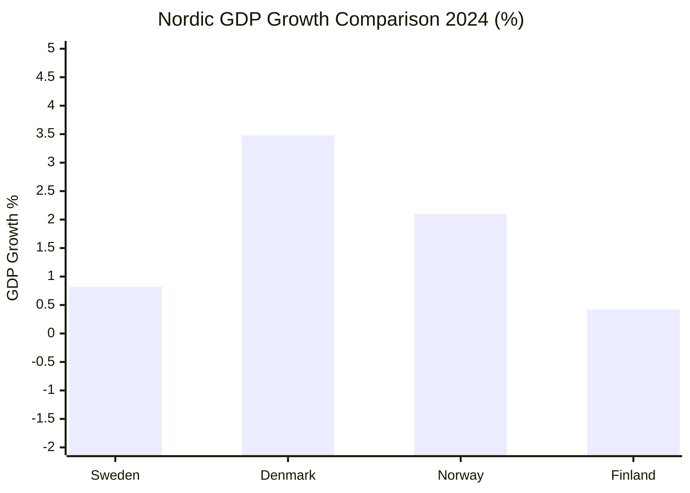

# Comparative International Context — April 2026

**Analysis Date**: 2026-04-19  
**Article Type**: monthly-review

---

## Nordic Comparison Dashboard

**Sweden's April 2026 legislative agenda in Nordic context:**

| Policy Area | Sweden | Denmark | Norway | Finland |
|------------|--------|---------|--------|---------|
| Criminal justice | Stricter (double penalties) | Moderate | Moderate | Reforming |
| Environmental permit | New agency (streamline) | Established process | Oil-revenue fund | Cautious |
| Defence/NATO | Active contributor | 2% GDP target met | Energy-rich/stable | NATO new member |
| Gender policy | Strategy vs. implementation gap | Strong maternity policy | Parental leave leader | EU parity level |
| Digital governance | e-ID launch 2026 | Leading NemID model | BankID established | Strong digital |

---

## EU Context

### Environmental Compliance Risk
Sweden's active forestry deregulation (HD03242) risks conflict with:
- **EU Biodiversity Strategy 2030** — 30% protection target for forests
- **EU Taxonomy** — sustainable activity classification affects forestry company financing
- **EU Forest Strategy** — binding elements under revision

**Comparable cases**: Finland faced EU scrutiny over Natura 2000 peatland protections in 2023; resolved with species inventory compromise.

### Criminal Justice Reform Context
Sweden's double-penalty legislation (HD03218) is among the strongest gang crime measures in the EU. Denmark enacted similar gang zone legislation in 2018. Netherlands has sentencing enhancement for organised crime. Sweden is aligning with Nordic-tough approach while maintaining constitutional safeguards.

### Gender and Wage Equality
EU Wage Transparency Directive (2023/970) must be implemented by member states by June 2026. Sweden's government (interpellation HD10437) faces questions about transposition pace. Denmark completed transposition Q1 2026; Germany Q2 2026. Sweden risks being among last implementers.

---

## Geopolitical Context

### NATO Baltic Posture
Sweden's contribution to NATO forward presence in Finland (HD03220) fits within the broader Alliance posture in the Baltic region:
- **Baltic nations**: Permanent battalion-size presence since 2017
- **Finland**: Enhanced presence post-NATO accession 2023
- **Sweden**: Now contributing forces to Finnish defence sector
- **Significance**: First time Sweden contributes to collective defence of another NATO ally since joining

### Ukraine Tribunal
Sweden's accession to the special tribunal for the crime of aggression against Ukraine (HD03231) aligns with:
- EU position supporting ICC-related mechanisms
- Nordic legal tradition of international rule-of-law support
- Sweden's historical role in UN peacekeeping and international law development
- **Context**: Folke Bernadotte assassination anniversary interpellation (HD10435) demonstrates continued Swedish engagement with international justice legacy

---

## International Significance Assessment

| Development | International Significance |
|------------|--------------------------|
| NATO Finland contribution | 🟩 HIGH — first concrete collective defence contribution |
| Ukraine tribunal accession | 🟧 MEDIUM — symbolic but legally binding |
| Environmental deregulation | 🟧 MEDIUM — EU scrutiny risk |
| Digital governance modernisation | 🟥 LOW — internal Swedish matter |
| Crime double-penalty | 🟥 LOW — aligns with Nordic trend |
