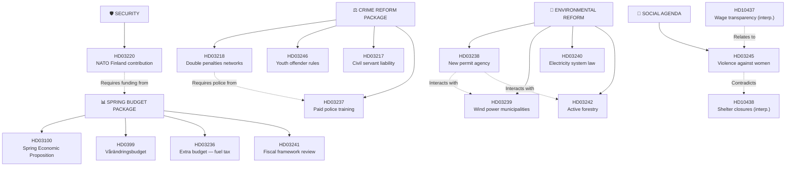
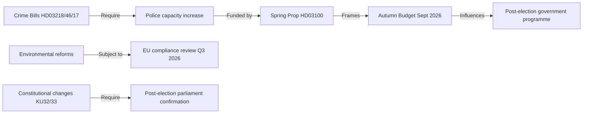

# Cross-Reference Map — Monthly Review: March 20 – April 19, 2026

**Analysis Date**: 2026-04-19  
**Article Type**: monthly-review

---

## Document Relationship Graph

---

## Cross-Reference Table

| Primary dok_id | Related dok_id | Relationship | Significance |
|---------------|----------------|-------------|-------------|
| HD03236 | HD03100 | Supplementary budget to spring prop | Critical fiscal linkage |
| HD03218 | HD03237 | Crime bill needs police capacity | Implementation dependency |
| HD03245 | HD10438 | Strategy vs. on-the-ground reality | Policy credibility gap |
| HD03238 | HD03239 | Same agency will handle wind power | Institutional overlap |
| HD03238 | HD03242 | Permit agency + forestry = deregulation agenda | Thematic cluster |
| HD03220 | HD0399 | NATO costs financed through spring budget | Budget dependency |
| HD01KU32 | HD01KU33 | Both constitutional changes — same vilande cycle | Process linkage |
| HD10437 | HD03245 | Wage gap + violence — gender equality cluster | Thematic |
| HD11719 | HD10438 | Both reveal state protection failures for women | Social cohesion signal |

---

## Sibling Article Type Connections

| This Article | Sibling Type | Connection |
|-------------|-------------|-----------|
| Monthly review (2026-04-19) | Week-ahead (2026-04-14) | Month-end review captures week-ahead items that concluded |
| Monthly review (2026-04-19) | Propositions (2026-04-14) | Validates proposition-level analysis with monthly synthesis |
| Monthly review (2026-04-19) | Monthly review (2026-03-19) | Prior month comparative baseline |

---

## Legislative Pipeline Dependencies

