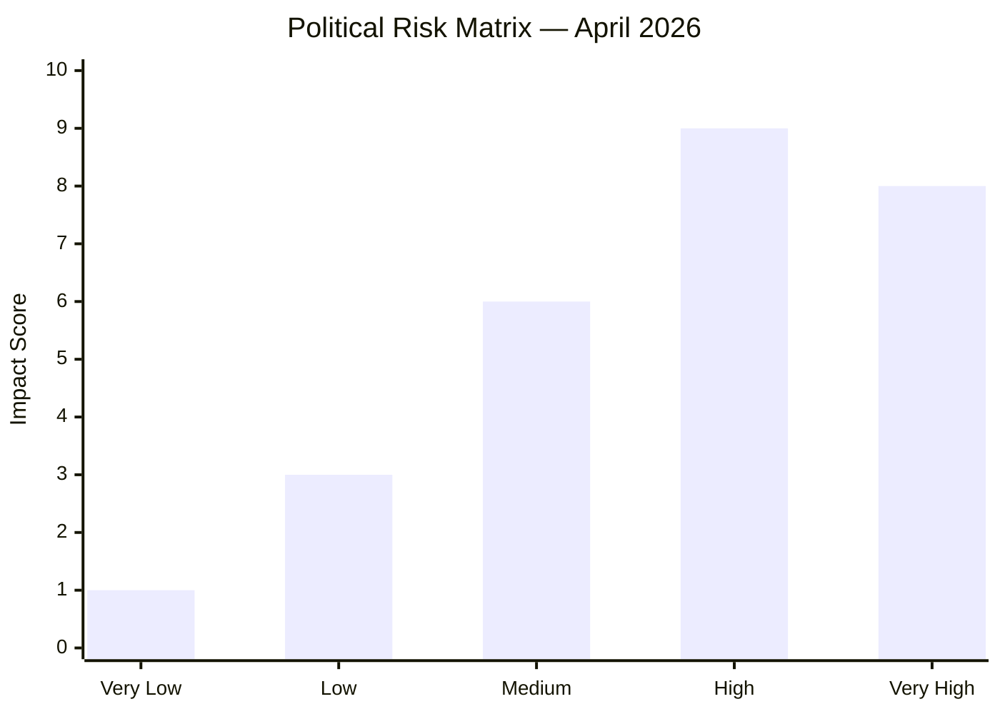
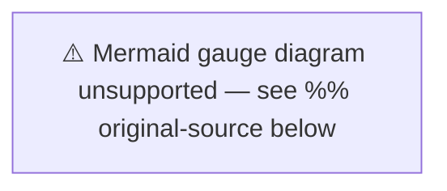

# Risk Assessment — Monthly Review: March 20 – April 19, 2026

**Analysis Date**: 2026-04-19  
**Article Type**: monthly-review  
**Risk Framework**: NIST CSF / Political Risk Matrix

---

## Risk Heat Map

---

## Risk Register

| Risk ID | Risk Description | Likelihood | Impact | Score | Mitigation |
|---------|-----------------|-----------|--------|-------|-----------|
| R-01 | Coalition fracture before Sept 2026 election | LOW | CRITICAL | 6/10 | Crime/budget package unifies coalition |
| R-02 | Economic growth stall — GDP below 1% in 2025 | MEDIUM | HIGH | 7/10 | Extra budget stimulus; Riksbank rate policy |
| R-03 | Women's shelter crisis escalation — media pressure | HIGH | MEDIUM | 7/10 | National violence strategy (HD03245) announced |
| R-04 | Environmental EU infringement (forestry HD03242) | MEDIUM | HIGH | 7/10 | Monitoring EU reaction; legal review |
| R-05 | NATO Finland cost overrun (HD03220) | LOW | HIGH | 5/10 | Budget allocation in vårändringsbudget |
| R-06 | Youth offender recidivism despite HD03246 | MEDIUM | MEDIUM | 5/10 | Rehabilitation components in bill |
| R-07 | Constitutional change (HD01KU32/33) rejection post-election | MEDIUM | LOW | 4/10 | Vilande process requires new parliament confirmation |
| R-08 | Digital infrastructure security (e-ID, HD03244) | LOW | HIGH | 5/10 | Government security review; NCSC oversight |
| R-09 | Wage transparency non-compliance (HD10437) | MEDIUM | MEDIUM | 5/10 | EU enforcement mechanism still being finalised |
| R-10 | Regional service withdrawal backlash (HD11718) | HIGH | LOW | 4/10 | Limited political capital to reverse |

---

## Top Risk Analysis

### R-02: Economic Growth Stall
Sweden's GDP growth at 0.82% in 2024 recovering from -0.20% contraction is fragile. Unemployment at 8.7% in 2025 exceeds the Nordic average. The extra budget fuel tax cut (HD03236) is a short-term stimulus that does not address structural competitiveness gaps. If the Riksbank holds rates elevated into Q3 2026, housing investment and consumer spending may remain suppressed through the election.

**Probability**: 45% | **Impact if realised**: GDP below 0.5% in 2025 triggers fiscal stimulus debate

### R-03: Women's Shelter Crisis
The interpellation on women's shelter closures (HD10438) from S signals a politically charged welfare issue. Dozens of shelters across Sweden have closed due to municipal funding cuts. The national violence strategy (HD03245) passed in April but is a framework without immediate ring-fenced funding. Social media amplification potential is high.

**Probability**: 70% | **Impact if realised**: Major opposition campaign issue from May–September 2026

### R-04: EU Environmental Infringement
Active forestry deregulation (HD03242) removing restrictions on clear-cutting and species protection in productive forests risks EU Taxonomy non-compliance and potential infringement proceedings under the EU Biodiversity Strategy. Sweden's forestry industry generates approximately 3% of GDP — conflict between economic and environmental interests.

**Probability**: 35% | **Impact if realised**: EU formal notice, international reputation damage

---

## Political Stability Assessment

**Overall assessment**: Coalition STABLE through election. Budget discipline, crime agenda alignment, and electoral incentives keep M–SD–KD–L unified. Primary risk is any SD demand that L or KD cannot accept in the final pre-election session.

---

## Confidence Levels (5-Point Scale)

| Assessment Area | Confidence |
|----------------|-----------|
| Legislative volume assessment | 🟦 VERY HIGH |
| Economic trend analysis | 🟩 HIGH |
| Electoral impact predictions | 🟧 MEDIUM |
| EU compliance risks | 🟧 MEDIUM |
| Coalition stability 6-month | 🟩 HIGH |
| Post-election scenarios | 🟥 LOW |
