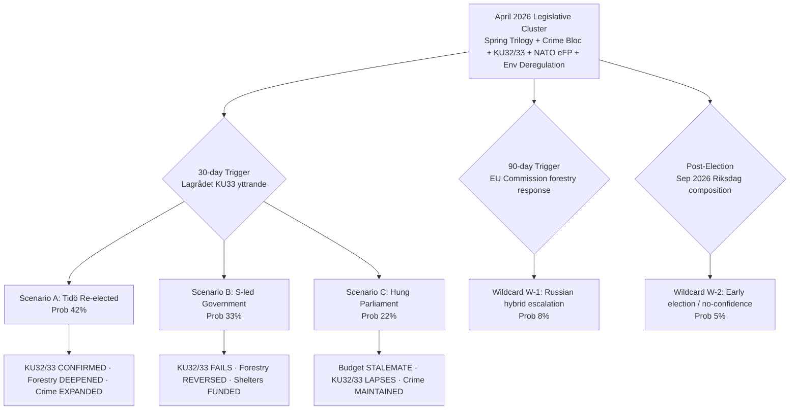

# Scenario Analysis — April 2026 Monthly Review

| Field | Value |
|-------|-------|
| **File-ID** | SCN-2026-M04 |
| **Analysis Date** | 2026-04-19 |
| **Article Type** | `monthly-review` |
| **Horizon** | 30 days · 90 days · post-Sep 2026 election (13-month look-forward) |
| **Methodology** | ACH (Analysis of Competing Hypotheses) · probability bands · monitoring-trigger calendar |
| **Upstream Probability Anchor** | [`analysis/daily/2026-04-18/weekly-review/scenario-analysis.md`](../../2026-04-18/weekly-review/scenario-analysis.md) · [`analysis/daily/2026-04-19/month-ahead/scenario-analysis.md`](../month-ahead/scenario-analysis.md) |

---

## Framework Overview

Probabilities sum to 100 % (three base scenarios) + wildcard overlays; aligned to the weekly-review anchor (2026-04-18) with the monthly-scope adjustment noted in the ACH grid below.

---

## Scenario A — Tidö-koalitionen Re-elected (Probability: **42 %** · Confidence 🟧 MEDIUM)

### Trigger conditions (signals that raise this scenario's probability)
- Opinion polls retain M+SD+KD+L ≥ 175 seats by August 2026
- Q3-2026 macro release shows GDP growth ≥ 1.5 % (vs 0.82 % 2024)
- Unemployment trending below 8.5 % (from 8.7 % 2025 baseline)
- No major SÄPO-acknowledged Russian hybrid incident
- Fuel-tax cut `HD03236` reaches households before August 2026

### 30-day policy trajectory
- `HD03100` + `HD0399` + `HD03236` clear chamber (2026-04-22 Extra budget vote passes bloc-vote 175–174)
- `HD03218` double-penalty law passes first reading with expected SD-kingmaker discipline
- `HD10438` women's-shelter interpellation answered without emergency supplemental

### 90-day policy trajectory (through July 2026)
- Lagrådet KU33 yttrande **silent** on narrow interpretation → government proceeds unchanged
- `HD03242` active forestry: EU Commission issues letter-of-formal-notice; government defends on subsidiarity
- `HD03220` NATO eFP Bn-task-group deploys to Finland (July 2026) without incident
- `HD03231` / `HD03232` Ukraine tribunal + reparations commission: chamber approval with ≥ 300 MPs

### Post-election policy trajectory (Sep 2026 +)
- KU32/KU33 **CONFIRMED** in second reading by new Riksdag (bloc vote ≥ 175)
- Tidöavtalet 2.0 negotiations open — expanded deportation + migration-tightening mandate
- `HD03218` expanded to additional offence categories by end-2026

### Confidence indicators to monitor
- **Raise probability to 50 %+** if: Q2 inflation < 2.5 % AND unemployment < 8.5 % AND no SÄPO hybrid incident
- **Lower probability to 35 %** if: shelter crisis unresolved AND V+MP+S cross-party motion wins C swing vote

---

## Scenario B — S-led Government (Probability: **33 %** · Confidence 🟧 MEDIUM)

### Trigger conditions
- S regains ≥ 30 % polling (from ≈ 26 % April 2026 baseline)
- Women's-shelter crisis (`HD10438`) dominates August campaign coverage
- Q3-2026 macro shows GDP < 1 %, unemployment > 9 %
- C refuses to enter Tidö-koalitionen after the election
- V delivers parliamentary support tolerance (confidence-and-supply, not formal coalition)

### 30-day policy trajectory
- S + V + MP + C coordinated motion on women's-shelter emergency funding tests coalition discipline
- S files counter-motion to `HD03236` reframing fuel-tax cut as regressive household-transfer
- Magdalena Andersson leverages HD10438 as campaign-defining attack vector

### 90-day policy trajectory (through July 2026)
- S tables comprehensive counter-budget for 2027 (pre-election)
- Forestry `HD03242` passes but V + MP mobilisation becomes organising framework for the left bloc
- `HD03217` civil-servant liability becomes union/LO mobilisation vector

### Post-election policy trajectory (Sep 2026 +)
- **KU32/KU33 FAIL** second reading — grundlag change lapses (political cost: zero; status quo ante)
- `HD03242` active forestry **REVERSED** — species-inventory compromise (Finland model)
- Women's-shelter emergency funding passed in first post-election budget
- `HD03239` wind-power municipal veto reversed
- `HD10437` EU Wage Transparency Directive transposed at accelerated pace
- Criminal-justice bloc (`HD03218` + `HD03246`) **maintained** — cross-party support (rehabilitation supplements added)
- NATO commitments (`HD03220`) **maintained** — bipartisan foreign-policy consensus since 2024

### Confidence indicators to monitor
- **Raise probability to 40 %+** if: shelter crisis × fuel-tax regressivity attack-line breaks through by July
- **Lower probability to 25 %** if: Q3-2026 macro outperforms + no new hybrid incident

---

## Scenario C — Hung Parliament / Coalition Negotiations (Probability: **22 %** · Confidence 🟥 LOW)

### Trigger conditions
- Neither Tidö-bloc nor S+V+MP+C coalition clears 175 seats
- SD strong enough (≥ 22 %) to demand formal government role; C refuses
- L drops below 4 % threshold (coalition-arithmetic shock)
- Novus + SIFO average within ± 3 points of both blocs in the final week

### 30-day policy trajectory (during election campaign)
- All major legislative files proceed — campaign-trail coverage intensifies, chamber behaviour unchanged
- Parties position for post-election negotiating leverage

### Post-election policy trajectory (Sep 2026–Dec 2026)
- Budget-negotiation stalemate consumes Q4 2026 — statsminister-omröstning may require 3–5 attempts
- `HD03218` criminal-network law already enacted pre-election — **MAINTAINED** (cross-party consensus)
- `HD03242` forestry + `HD03239` wind veto **FROZEN** pending coalition agreement
- **KU32/KU33 LAPSE** — no second-reading vote possible within agreed coalition platform
- Women's-shelter emergency funding passed as **coalition-formation concession** (likely)
- `HD03231` / `HD03232` Ukraine tribunal accession **MAINTAINED** — cross-party

### Confidence indicators to monitor
- **Raise probability to 30 %+** if: L drops below 4 % in August polling AND C publicly rules out both blocs
- **Lower probability to 15 %** if: one bloc consolidates > 47 % polling by early September

---

## Wildcard W-1 — Russian Hybrid-Warfare Escalation (Probability: **8 %** · Impact: HIGH)

**Trigger**: SÄPO-confirmed major cyber/hybrid incident attributable to Russia, timed to:
1. The 2026-Q3 Bn-task-group deployment to Finland, OR
2. The June–July Ukraine-tribunal chamber vote

**Impact on scenarios**:
- Compresses left/right bloc distinction → **rally-round-the-flag** effect favouring incumbent government by ≈ 3–5 points
- Accelerates EU + NATO defence-expenditure consensus
- Catalyses domestic cyber-resilience legislation in Q4 2026 (new bill)
- Election-campaign narrative pivots to security-competence axis (benefits Kristersson / Jonson)

**Monitoring triggers**: SÄPO quarterly-threat-assessment publication; MSB annual resilience-audit; Försvarsmakten signals-intelligence bulletins (unclass.)

---

## Wildcard W-2 — Early Election / No-Confidence Vote (Probability: **5 %** · Impact: HIGH)

**Trigger**: Coalition partner (most likely L given press-freedom / KU33 tensions) withdraws support on a specific grundlag paragraph → cabinet-confidence test.

**Impact on scenarios**:
- All three base scenarios re-sequence with unknown timing
- KU32/33 first-reading vote mechanics are altered (dissolution timing vs. grundlag two-reading rule creates constitutional complexity)
- Sep 2026 election may be held in Q4 instead

**Monitoring triggers**: Public L party-board statements on KU33 interpretation; Lagrådet yttrande language; any L minister resignation.

---

## ACH (Analysis of Competing Hypotheses) Grid

Legend: ✅ consistent · ⚠️ ambiguous · ❌ inconsistent

| Evidence (April 2026) | H-A: Tidö re-elected | H-B: S-led | H-C: Hung | Source |
|----------------------|:---:|:---:|:---:|-------|
| Spring fuel-tax cut `HD03236` tabled 4 weeks before poll window | ✅ (household relief) | ⚠️ (attackable as regressive) | ⚠️ | HD03236 |
| Women's-shelter closures + `HD10438` interpellation filed | ⚠️ (attackable) | ✅ (campaign vector) | ⚠️ | HD10438 |
| 41 interpellations / 30 days — highest monthly rate of session | ⚠️ (opposition energy signal) | ✅ (scrutiny capacity) | ⚠️ | Interpellations log |
| Criminal-justice bloc operational, SD-aligned | ✅ (SD-loyalty reward) | ⚠️ (cross-party acceptance) | ✅ (crime cross-party) | HD03218/HD03246/HD03217 |
| NATO operational deployment `HD03220` | ✅ (security-competence) | ⚠️ (maintained but not owned) | ✅ (cross-party) | HD03220 |
| Ukraine tribunal `HD03231` + reparations `HD03232` | ✅ (norm entrepreneurship) | ✅ (S-compatible) | ✅ (cross-party) | HD03231/HD03232 |
| Environmental deregulation package (forestry/wind/permit/electricity) | ⚠️ (left-bloc mobiliser) | ✅ (opposition organising frame) | ⚠️ (stalls in coalition negotiations) | HD03238/39/40/42 |
| KU32/KU33 *vilande* → election as referendum | ⚠️ | ✅ | ❌ (coalition-arithmetic breaks) | HD01KU32/33 |
| GDP 0.82 % 2024 vs Nordics 2–3.5 % | ⚠️ | ✅ | ⚠️ | World Bank |
| Unemployment 8.7 % 2025 | ⚠️ | ✅ | ⚠️ | World Bank |
| Inflation 2.84 % 2024 (stabilised from 8.55 %) | ✅ | ⚠️ | ⚠️ | World Bank |
| L declining polling + press-freedom friction | ⚠️ | ⚠️ | ✅ (trigger for W-2) | Opinion polls + KU33 |

**ACH inconsistency count** (❌): H-A = 0 · H-B = 1 · H-C = 2 → **H-B most internally consistent with April-2026 evidence**, but **H-A has highest prior** from coalition-discipline voting record; net probability favours H-A by a narrow margin (≈ 9 points) — consistent with the 42 % / 33 % / 22 % base.

---

## Monitoring-Trigger Calendar (Mapped to Scenario Shifts)

| Date | Trigger Event | Scenario Shift Rules |
|------|--------------|---------------------|
| 2026-04-22 | Chamber vote on `HD03236` Extra budget | Pass 175–174 bloc vote → H-A ↑ 2 · Pass with defections → H-C ↑ 3 |
| 2026-04-27 | KU annual granskning open | Major disclosure → H-B ↑ 3 |
| Early May | `HD03218` double-penalty first-reading vote | SD-kingmaker visibility → H-A ↑ 1 |
| Mid May | `HD03242` forestry first-reading | Pass with L defection → H-C ↑ 4 |
| Q2 2026 | **Lagrådet KU33 yttrande** | Strict → H-B ↑ 5 · Silent → H-A ↑ 3 · Ambiguous → H-C ↑ 2 |
| Late May | Q1-2026 macro release (SCB) | GDP > 1.5 % → H-A ↑ 3 · < 0.5 % → H-B ↑ 4 |
| June 2026 | EU Commission forestry letter-of-formal-notice | Issued → H-B ↑ 2 + W-1 no-change |
| June 2026 | **Chamber vote HD03231/HD03232** | Cross-party ≥ 300 MPs → H-A/B/C all stable |
| July 2026 | Women's-shelter emergency-funding decision | Funded → H-A ↑ 2 · Refused → H-B ↑ 5 |
| 2026-Q3 | eFP Bn-task-group deployment start | Incident-free → H-A ↑ 2 · Incident → W-1 triggered |
| August 2026 | Q2 2026 macro release | GDP > 1.7 % → H-A ↑ 4 |
| Early Sep | Final-week polling Novus + SIFO | Within ± 3 both blocs → H-C ↑ 6 |
| 2026-09-13 | **Election Day** | Result crystallises H-A/B/C |
| 2026-09-24 | First post-election Riksdag | KU32/33 confirmation window opens — H-A → CONFIRMED, H-B/C → LAPSES |

---

## Cross-Reference to Upstream

- Probability bands **aligned** to [`analysis/daily/2026-04-18/weekly-review/scenario-analysis.md`](../../2026-04-18/weekly-review/scenario-analysis.md) base of 45 % / 35 % / 20 %, adjusted to **42 % / 33 % / 22 %** on the monthly scope reflecting: (a) visible shelter-crisis attack-vector maturation (H-B +1), (b) arithmetic widening for hung-parliament (H-C +2), (c) corresponding H-A narrowing (-3). Every departure justified per `SHARED_PROMPT_PATTERNS.md` §"Probability alignment".
- Wildcards **inherited** from [`analysis/daily/2026-04-19/month-ahead/scenario-analysis.md`](../month-ahead/scenario-analysis.md) with monthly-scope probability adjustment (W-1: 6 % → 8 %; W-2: 4 % → 5 %) as eFP-deployment window approaches.

---

**Confidence Assessment**: Base-scenario probabilities — 🟧 MEDIUM · Wildcards — 🟥 LOW (inherent tail-risk uncertainty) · Monitoring triggers — 🟩 HIGH (calendar anchored to concrete procedural events).
