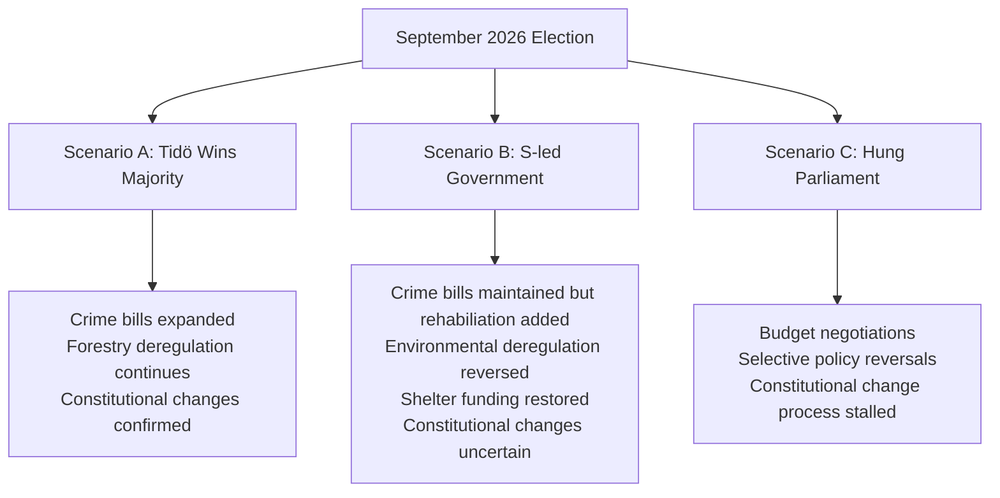

# Scenario Analysis — Post-April 2026 Parliamentary Scenarios

**Analysis Date**: 2026-04-19  
**Article Type**: monthly-review

---

## Scenario Framework

---

## Scenario A: Tidö Coalition Re-Elected (Probability: 45%)

**Trigger conditions**: Crime agenda resonates, fuel tax cut appreciated, economic stabilisation  
**Policy implications**:
- HD03218 double penalties expanded to additional offence categories
- HD03242 active forestry deepened — more EU friction
- HD01KU32/33 constitutional changes confirmed by new parliament
- New electricity system (HD03240) fast-tracked
- Women's shelter crisis addressed with minimal new funding

**Economic outlook**: Continued modest growth; unemployment stays elevated  
**International**: Deepened NATO integration, EU tensions on environment  
**Confidence**: 🟧 MEDIUM

---

## Scenario B: Social Democrat-Led Government (Probability: 35%)

**Trigger conditions**: S surge on welfare/women's issues; MP/V recover to strong opposition  
**Policy implications**:
- Paid police training (HD03237) maintained — bipartisan support
- Women's shelter emergency funding — first budget priority
- Active forestry regulation (HD03242) revised — species protection restored
- Wind power municipal veto (HD03239) reversed
- Wage transparency (HD10437) actively implemented
- HD01KU32/33 uncertain — constitutional changes may not receive second confirmation

**Economic outlook**: Higher public spending; risk of deficit widening  
**International**: Stronger EU climate alignment; NATO commitment maintained  
**Confidence**: 🟥 LOW-MEDIUM

---

## Scenario C: Hung Parliament / Coalition Negotiations (Probability: 20%)

**Trigger conditions**: Close result; SD strong enough to demand formal government role; C refuses  
**Policy implications**:
- Budget negotiations consume Q4 2026
- Crime bills largely maintained (cross-party support)
- Environmental deregulation reversed or frozen pending coalition agreement
- Constitutional changes stalled
- Women's shelter emergency funding likely as coalition formation concession

**Economic outlook**: Political uncertainty premium on Swedish krona  
**International**: NATO commitment stable; EU climate negotiations paused  
**Confidence**: 🟥 LOW

---

## Key Watchpoints for Scenario Realisation

| Month | Watchpoint | Significance |
|-------|-----------|-------------|
| May 2026 | Opinion poll trend after budget publication | Coalition or S surge indicator |
| June 2026 | EU commission response to forestry bill | Environmental election issue escalation |
| July 2026 | Women's shelter funding announcement (or not) | S attack vector intensity |
| August 2026 | Campaign messaging from all parties | Policy reversal signals |
| Sept 7, 2026 | Election result | Scenario determination |
