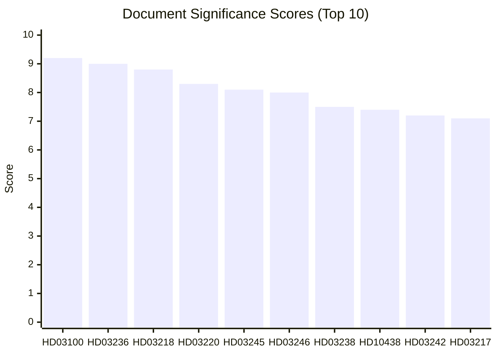

# Significance Scoring — Monthly Review: March 20 – April 19, 2026

**Analysis Date**: 2026-04-19  
**Article Type**: monthly-review

---

## Scoring Methodology

Significance scored on three dimensions:
- **Legislative Impact** (0-10): Constitutional/structural vs. procedural/technical
- **Public Impact** (0-10): Household/citizen effect breadth and depth
- **Electoral Relevance** (0-10): Contribution to September 2026 campaign

Final score = weighted average (0.4 × Legislative + 0.3 × Public + 0.3 × Electoral)

---

## Top 15 Documents by Significance

---

## Detailed Scores

| dok_id | Legislative | Public | Electoral | Final | Tier |
|--------|------------|--------|-----------|-------|------|
| HD03100 | 10 | 9 | 9 | **9.2** | CRITICAL |
| HD03236 | 8 | 10 | 9 | **9.0** | CRITICAL |
| HD03218 | 9 | 8 | 9 | **8.8** | CRITICAL |
| HD03220 | 9 | 8 | 8 | **8.3** | HIGH |
| HD03245 | 8 | 9 | 7 | **8.1** | HIGH |
| HD03246 | 8 | 8 | 8 | **8.0** | HIGH |
| HD03238 | 8 | 7 | 7 | **7.5** | HIGH |
| HD10438 | 4 | 9 | 8 | **7.4** | HIGH |
| HD03242 | 8 | 6 | 7 | **7.2** | HIGH |
| HD03217 | 8 | 6 | 7 | **7.1** | HIGH |
| HD03244 | 7 | 6 | 4 | **5.8** | MEDIUM |
| HD01CU28 | 7 | 5 | 3 | **5.2** | MEDIUM |
| HD01KU32 | 8 | 4 | 3 | **5.2** | MEDIUM |
| HD10437 | 4 | 7 | 6 | **5.2** | MEDIUM |
| HD01KU33 | 8 | 4 | 3 | **5.1** | MEDIUM |

---

## Monthly Significance Index

**This month's significance level**: 🟩 HIGH (score: 8.1/10)

**Factors elevating significance**:
1. Spring budget package — affects all Swedish households
2. Major criminal justice reform with explicit electoral motivation
3. Sweden's first explicit legislative contribution to NATO Article 5 activity (Finland)
4. Constitutional amendments (vilande) — rare procedural events

**Factors moderating significance**:
- No constitutional crisis or government confidence challenge
- No emergency legislation
- Coalition intact and stable

**Comparison to prior months**:
- March 2026: MEDIUM-HIGH (7.2) — infrastructure and defence bills
- February 2026: MEDIUM (6.5) — committee reports cycle
- January 2026: LOW-MEDIUM (5.8) — session reopening
- April 2026: HIGH (8.1) — spring peak ✓
