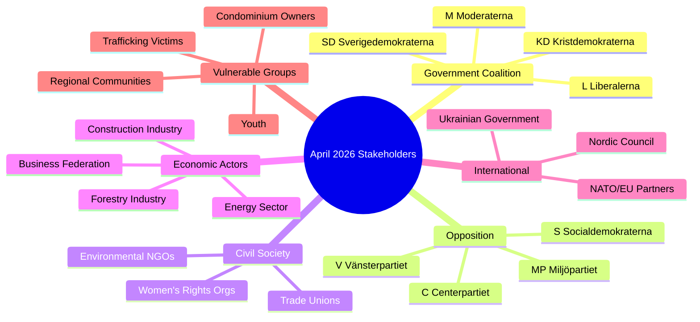

# Stakeholder Perspectives — Monthly Review: March 20 – April 19, 2026

**Analysis Date**: 2026-04-19  
**Article Type**: monthly-review  
**Minimum perspectives required**: 7 (deep depth)

---

## Stakeholder Map

---

## Perspective 1: Government Coalition (M–SD–KD–L)

**Stance**: Satisfied with April productivity  
**Key interests**: Electoral positioning, crime reduction, fiscal prudence with relief  
**Assessment**: The spring package delivers on all four coalition partners' priority lists:
- M: fiscal framework + digital modernisation
- SD: crime double-penalty + strict deportation
- KD: guardianship reform + social values
- L: e-ID + wage transparency acknowledgement

**Critical evidence**: 272 propositions in session, 4 budget propositions in one week (April 13–14)  
**Electoral calculation**: Moderate voters relieved by fuel tax cuts; conservative base satisfied with crime bills  
**Risk**: Women's shelter crisis creates visible S attack surface that KD in particular may find uncomfortable given its Christian social values platform

---

## Perspective 2: Social Democrats (S)

**Stance**: Actively confrontational but constructive on security  
**Key interests**: Welfare state integrity, workers' rights, regional equity  
**Assessment**: S is in effective pre-campaign mode. The 25+ interpellations in 30 days — on topics ranging from women's shelters (HD10438) to the Folke Bernadotte murder anniversary (HD10435) to housing in Stockholm (HD10434) to broad tax reform (HD10433) — constitute a deliberate narrative-building exercise. S supported NATO Finland contribution (HD03220) bipartisanly, demonstrating security credibility.

**Critical evidence**: HD10438 (women's shelters), HD10437 (wage transparency), HD10433 (tax review), HD10434 (housing Stockholm)  
**Electoral calculation**: Core S message: "Government builds prisons while closing shelters"  
**Vulnerability**: S must distance from perceived economic incompetence of 2021–2022 inflation surge under their watch

---

## Perspective 3: Sweden Democrats (SD)

**Stance**: Delivering on core programme through coalition  
**Key interests**: Crime reduction, immigration restriction, national security  
**Assessment**: SD's legislative fingerprints are visible on two flagship bills: double penalties for criminal networks (HD03218) and stricter youth offender rules (HD03246). Both were SD priorities in coalition negotiations. The interpellation on mosque extremism (HD10430) signals SD continuing to shape the debate agenda from inside the coalition orbit.

**Critical evidence**: HD03218 (criminal networks — SD primary demand), HD03246 (youth), HD10430 (mosques)  
**Electoral calculation**: SD consolidating right-of-centre crime voters; risk of losing voters to KD on social issues if welfare state perception hardens  
**Risk**: September election polling will determine whether SD holds current ~20% share or loses ground to M

---

## Perspective 4: Centerpartiet (C)

**Stance**: Selective constructive opposition  
**Key interests**: Rural business, entrepreneurship, personal liberty, NATO  
**Assessment**: C supported the NATO Finland contribution (HD03220) and the e-ID initiative (TU21) but has expressed reservations about active forestry deregulation details and women's shelter closures. C's positioning as a "liberal conscience" of Swedish politics means it is increasingly differentiating from both the government coalition and the S-led opposition.

**Critical evidence**: Interpellations on international LGBTQ+ rights (HD10431 from C), constructive security votes  
**Electoral calculation**: C aims to recover from 2022 below-4% scare; rural business voters attracted by forestry deregulation

---

## Perspective 5: Miljöpartiet (MP)

**Stance**: Principled opposition on environment and climate  
**Key interests**: Green transition, social justice, EU alignment  
**Assessment**: MP filed a motion directly opposing the extra budget fuel tax cut (HD024098), positioning itself as the uncompromising green option. MP's parliamentary group voted against the active forestry bill and the renewable energy permit changes. This positions MP to capture protest votes from climate-motivated centre-left voters who feel S has compromised too much on environment.

**Critical evidence**: HD024098 (motion opposing fuel tax cut), consistent committee votes against deregulation  
**Electoral calculation**: MP needs to reach 4% threshold in September 2026 — green mobilisation depends on environment being top-of-mind for voters

---

## Perspective 6: Business Community / Confederation of Swedish Enterprise (Svenskt Näringsliv)

**Stance**: Generally supportive of April package  
**Key interests**: Regulatory simplification, digital infrastructure, labour market flexibility  
**Assessment**: The business community welcomes the new environmental permit agency (HD03238) if it genuinely reduces permitting backlogs (currently 3–5 years for major industrial projects). The data interoperability proposition (HD03244) is welcomed as reducing administrative burden. Active forestry deregulation (HD03242) benefits timber companies. Energy price support (HD03236) reduces operational cost pressure.

**Critical evidence**: HD03238 (permit agency), HD03244 (interoperability), HD03240 (electricity law)  
**Concern**: Double civil servant liability (HD03217) creates regulatory uncertainty for public procurement interactions

---

## Perspective 7: Women's Rights and Civil Society Organisations

**Stance**: Alarmed — between legislative progress and implementation failures  
**Key interests**: Protection funding, wage equality, violence prevention  
**Assessment**: April 2026 presents a cruel paradox for women's rights advocates: the government tabled a National Strategy against Men's Violence (HD03245) on April 14 while women's shelters are closing across the country (interpellation HD10438 filed April 17). Wage transparency directive progress (interpellation HD10437) is stalled. The tax authority demanding back-taxes from trafficking victims (HD11719) represents a systemic failure of state protection.

**Critical evidence**: HD03245 vs. HD10438 (strategy vs. reality), HD11719 (tax demands on victims)  
**Demand**: Ring-fenced funding in autumn budget for shelter operations; immediate halt to prosecution of trafficking victims for tax arrears  
**Electoral mobilisation**: High potential — women's rights issues have strong social media resonance; S and MP will amplify

---

## Perspective 8: Swedish Local Government / SKR (Sveriges Kommuner och Regioner)

**Stance**: Concerned about unfunded mandates and service withdrawals  
**Key interests**: Municipal finance, service delivery standards, regional development  
**Assessment**: Multiple April propositions create implementation challenges for municipalities: paid police training (HD03237) requires coordination, new reception law (HD03229 — motions HD024080-89) imposes integration obligations, national violence strategy requires local co-funding. HD11718 (state service withdrawal from southeastern Skåne) illustrates the broader problem of national government retreating from peripheral communities.

**Critical evidence**: HD11718 (Skåne service withdrawal), HD024080-89 (reception law motions), HD01CU22 (guardianship — local authority implications)  
**Risk**: Municipal election results in 2026 may see urban-rural divide exploited by all parties
