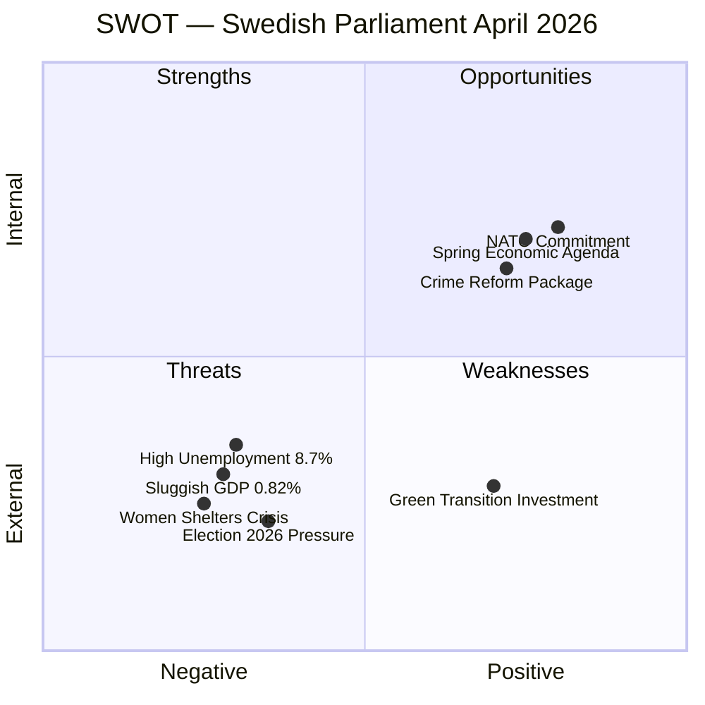

# SWOT Analysis — Monthly Review: March 20 – April 19, 2026

**Analysis Date**: 2026-04-19  
**Article Type**: monthly-review  
**Analysis Depth**: deep (5+ stakeholder perspectives per quadrant)

---

## SWOT Matrix Overview

---

## STRENGTHS

### 1. Government Coalition (M–SD–KD–L Perspective)
- Delivered a comprehensive spring budget package (HD03100, HD0399, HD03236) on schedule
- Criminal justice reform (HD03218, HD03246, HD03217) demonstrates legislative discipline across coalition partners
- NATO Finland contribution (HD03220) passed with broad cross-party support, reinforcing security credibility
- New environmental agency (HD03238) signals institutional modernisation while controlling environmental costs
- **Evidence**: 272 propositions in 2025/26 session; HD03236 passed FiU by April 14

### 2. Opposition Parties (S, V, MP Perspective)
- Social Democrats produced 25+ interpellations in 30 days demonstrating active parliamentary scrutiny
- Women's shelter closures (HD10438) and wage transparency (HD10437) create high-visibility attack vectors
- MP successfully branded extra budget (HD03236) as anti-climate, mobilising green base
- **Evidence**: HD024098 (MP motion against fuel tax cut), HD10437–HD10438 (S interpellations)

### 3. Democratic Institutions
- Constitutional amendments properly processed as "vilande" (HD01KU32, HD01KU33) — system integrity maintained
- Committee system processed 50 betankanden in the spring surge without backlog
- Property rights strengthened: condominium register (HD01CU28) and ID requirements (HD01CU27) improve housing market transparency

### 4. Economic Policy Framework
- Inflation reduced from 8.5% (2023) to 2.84% (2024) — monetary policy normalising
- GDP per capita at USD 57,117 — solid base despite slow growth
- Energy price support mechanism (HD03236) provides household relief amid elevated energy costs

### 5. Digital Governance
- State e-ID bill (TU21) passed — major milestone for digital public services
- Data interoperability for public sector (HD03244) modernises government infrastructure
- Both initiatives align with EU Digital Single Market requirements

---

## WEAKNESSES

### 1. Economic Performance (Citizen/Household Perspective)
- GDP growth at 0.82% (2024) severely lags Denmark (3.5%), Norway (2.1%), and EU average
- Unemployment at 8.7% (2025) — highest in five years, disproportionately affecting youth
- Fuel tax cut in extra budget is fiscal stimulus, not structural reform
- **Evidence**: World Bank indicators SWE 2024 vs. DNK 2024

### 2. Gender Policy (Women's Rights Advocates, Civil Society)
- Women's shelter closure wave (HD10438 interpellation) reveals funding gap between national violence strategy (HD03245) and local implementation
- Wage gap persisting despite EU directive pressure (HD10437) — enforcement mechanism weak
- State strategic violence prevention strategy passed legislatively but opposition questions resource allocation

### 3. Environmental Governance (Environmental Organisations, Green Economy Stakeholders)
- Active forestry deregulation (HD03242) risks EU Taxonomy and biodiversity commitments
- Wind power municipal reform (HD03239) introduces local veto risk, potentially slowing green transition
- New environmental permit agency (HD03238) raises efficiency questions — whether streamlining helps or weakens environmental protection

### 4. Regional Disparities (Local Government, Rural Communities)
- Closure of state service offices in peripheral areas (HD11718 — southeastern Skåne question)
- Municipal harbour reform (TU19) centralises port governance, raising concerns for smaller coastal municipalities
- Police education reform (HD03237) — whether paying police training will improve rural recruitment unclear

### 5. Constitutional Process (Legal Scholars, Opposition)
- Two constitutional changes (HD01KU32, KU33) approved as "vilande" — means post-2026 election parliament must confirm, creating policy uncertainty
- Digital records privacy in criminal investigations (HD01KU33) raises press freedom concerns
- Accessibility requirements for media (HD01KU32) welcomed by disability rights groups

---

## OPPORTUNITIES

### 1. Electoral Positioning (Government Coalition)
- Crime package (HD03218 double penalties, HD03246 youth, HD03217 civil servants) directly addresses top voter priority
- Fuel tax cut (HD03236) delivers tangible pre-election relief to households
- NATO contribution (HD03220) demonstrates security responsibility ahead of September vote
- Window to consolidate government record before election campaign

### 2. Green Industrial Strategy (Business Sector, EU Context)
- New electricity system law (HD03240) enables renewable energy expansion
- Environmental permit agency reform (HD03238) could attract clean-tech investment if streamlined effectively
- Swedish wind energy potential if municipality reform (HD03239) strikes right balance
- Green Taxonomy-aligned investments could boost sluggish GDP

### 3. Nordic Economic Integration (Business, Nordic Perspective)
- Sweden's GDP per capita (USD 57,117) remains competitive despite slow growth
- Housing market reforms (HD01CU28, HD01CU27) improve property rights transparency — foreign investment attractiveness
- Digital infrastructure (e-ID, data interoperability) positions Sweden for digital economy leadership

### 4. Ukraine/International Leadership (Diplomatic, EU Perspective)
- Special tribunal accession (HD03231) builds international rule-of-law credentials
- NATO Finland contribution strengthens Nordic defence cooperation
- Arms export control modernisation (HD03114) balances security and democratic accountability

### 5. Social Cohesion Reform (Academic, Think-Tank Perspective)
- Guardianship reform (HD01CU22) strengthens legal protections for vulnerable individuals
- New violence prevention strategy (HD03245) aligns with EU gender equality commitments
- Wage transparency directive implementation creates structural market correction opportunity

---

## THREATS

### 1. Electoral Volatility (Political Risk Analysts)
- Five months to September 2026 election — legislative agenda increasingly campaign-driven
- SD maintains legislative influence without formal government membership — creates accountability opacity
- Opposition unified on cost-of-living and welfare issues; government fiscal conservatism may face backlash

### 2. Economic Deterioration Risk (Economists, Fiscal Analysts)
- Sweden's GDP growth (0.82%) cannot sustain high unemployment (8.7%) without fiscal stimulus
- Extra budget fuel tax cuts reduce revenue without structural employment improvements
- Risk of "stagflation light" if energy prices spike again post-support programme

### 3. Environmental/Climate Commitments (EU, International Institutions)
- Active forestry deregulation (HD03242) risks EU infringement proceedings
- Wind power municipal veto (HD03239) may undermine Sweden's EU renewable energy targets
- Climate credibility gap threatens Nordic leadership position

### 4. Security Escalation (Defence Analysts, NATO Context)
- NATO forward presence in Finland (HD03220) — cost trajectory unclear
- Civil preparedness legislation in pipeline — significant budgetary implications
- Any Baltic security deterioration could overwhelm planned defence spending (spring budget)

### 5. Social Fragmentation (Social Policy Researchers, Media)
- Women's shelter closures (HD10438) signal civil society funding squeeze
- Youth unemployment elevated — stricter penalties for young offenders (HD03246) without parallel rehabilitation investment risks recidivism
- Tax demands on trafficking victims (HD11719) — administrative injustice case highlighting systemic issues
- Regional public service withdrawal (southeastern Skåne HD11718) deepens urban-rural divide

---

## Stakeholder Impact Matrix

| Stakeholder Group | Primary Concern | Outlook | Evidence |
|------------------|----------------|---------|----------|
| Government Coalition | Electoral positioning | Cautiously optimistic | Crime + budget package |
| Social Democrats (S) | Accountability + welfare | Active opposition mode | 41 interpellations |
| SD Supporters | Crime, immigration | Satisfied | HD03218 double penalties |
| Women's Rights Orgs | Shelter closures, wage gap | Alarmed | HD10438, HD10437 |
| Environmental NGOs | Forestry, wind power | Critical | HD03242, HD03239 |
| Business Sector | Energy costs, digital infra | Mixed positive | HD03236, HD03244 |
| Local Government | Service withdrawals, ports | Concerned | HD11718, TU19 |
| Legal Professionals | Civil servant liability | Watching | HD03217 |
| Defence/Security | NATO costs | Supportive | HD03220 |
| Academic/Think-tanks | Constitutional changes | Monitoring | HD01KU32/33 |
