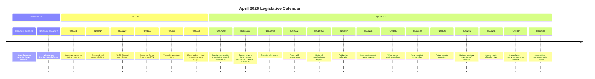
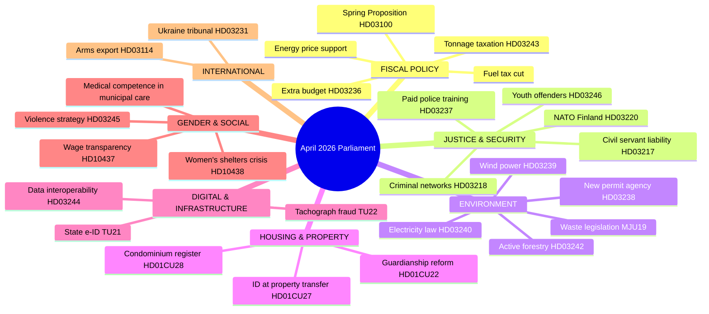

# Synthesis Summary — Monthly Review: March 20 – April 19, 2026

**Analysis Date**: 2026-04-19  
**Article Type**: monthly-review  
**Riksmöte**: 2025/26  
**Analysis Depth**: deep  
**Analyst**: AI Political Intelligence (Pass 2 — iteratively improved)

---

## Executive Summary

April 2026 marks one of the most legislatively intensive months of the 2025/26 parliamentary session. The Tidö-koalitionen government (M–SD–KD–L) tabled its **spring budget package** — including an extra change budget cutting fuel taxes and introducing energy price support — against a backdrop of a Swedish economy growing at a modest 0.82% in 2024, far below Denmark's 3.5%. Simultaneously, a sweeping criminal justice overhaul emerged as the session's defining domestic theme, with three major bills targeting criminal networks, youth offenders, and civil servant accountability. Environmental governance was substantially restructured through a new environmental permit authority and active forestry deregulation. The month's activity provides a clear electoral positioning signal ahead of the September 2026 Riksdag election.

---

## Key Legislative Developments (Chronological)

---

## Monthly Legislative Statistics

| Metric | Count | Trend vs. Prior Month |
|--------|-------|----------------------|
| Total propositioner (session) | 272 | ↑ +30 since March 12 |
| Total betankanden fetched | 50 | Spring peak |
| Total motioner (session) | 4,098 | Active opposition cycle |
| Interpellationer filed (last 30 days) | 41 | ↑ High opposition scrutiny |
| Written questions (last 30 days) | ~80 est. | Consistent |
| Constitutional amendments (vilande) | 2 | Notable |
| Budget propositions tabled | 4 | Spring budget package |

---

## Dominant Policy Themes

---

## Party Activity Analysis (Last 30 Days)

| Party | Role | Notable Actions | Assessment |
|-------|------|----------------|------------|
| **M** (Moderaterna) | Government lead | Budget leadership, energy/climate | Central to coalition cohesion |
| **SD** (Sverigedemokraterna) | Government partner | Crime legislation, deportation | Pushed double-penalty criminal bill |
| **KD** (Kristdemokraterna) | Government support | Social policy, civil services | Guardianship reform support |
| **L** (Liberalerna) | Government support | E-ID, transparency, gender equality | Wage transparency questioned |
| **S** (Socialdemokraterna) | Main opposition | 25+ interpellations, women's shelters | Active legislative scrutiny |
| **V** (Vänsterpartiet) | Opposition | Social insurance, forestry opposition | Voted against forestry bill |
| **C** (Centerpartiet) | Mixed/constructive | E-ID support, NATO presence | Supported key security bills |
| **MP** (Miljöpartiet) | Opposition | Anti-fuel-tax cut, environment | Opposed extra budget HD03236 |

---

## Economic Context

Sweden's economy grew at **0.82%** in 2024 — recovering from a -0.20% contraction in 2023 but significantly trailing Denmark (**3.5%**), Norway (**2.1%**), and the EU average. Unemployment hit **8.7%** in 2025, among the highest in the Nordic region. Inflation fell dramatically to **2.84%** in 2024 from a crisis peak of 8.55% in 2023. GDP per capita reached **USD 57,117** in 2024.

The government's extra change budget (HD03236) cutting fuel taxes and providing energy support directly responds to household cost pressures — a clear electoral move with only five months to the September 2026 vote.

---

## Significance Tiers

### Tier 1 — National Significance
- **HD03100** Spring Proposition 2026 — frames entire government economic strategy
- **HD03236** Extra budget — fuel taxes + energy support (immediate household impact)
- **HD03218** Double penalties for criminal networks (major criminal justice reform)
- **HD03220** NATO Finland contribution (national security commitment)

### Tier 2 — Major Policy
- **HD03238** New environmental permit authority (institutional restructuring)
- **HD03245** National violence against women strategy
- **HD03217** Extended civil servant criminal liability
- **HD03246** Stricter youth offender rules

### Tier 3 — Procedural/Technical
- **HD01CU28** National condominium register
- **HD01CU27** Property identity requirements
- **HD01KU32/33** Constitutional changes (vilande — require post-election confirmation)

---

## Election 2026 Implications

**Electoral Impact**: 🟩 HIGH — Budget season with fuel tax cuts is clearly electorally motivated. The September 2026 election means every major legislative action from April through September carries campaign weight.

**Coalition Scenarios**: 🟧 MEDIUM confidence — Current coalition appears stable. SD's crime agenda being legislated keeps SD aligned. L's support for e-ID and digital transparency pleases liberals. Risk: MP and V energized by environmental rollbacks could galvanize left-green voters.

**Voter Salience**: 🟩 HIGH — Crime (double penalties) and cost of living (fuel tax) are polling as top concerns. Women's shelter crisis (HD10438) creates visible S ammunition.

**Campaign Vulnerability**: 🟧 MEDIUM — Government exposed on: (1) women's shelter closures, (2) sluggish economic growth vs. Nordic peers, (3) active forestry deregulation facing environmental opposition.

**Policy Legacy**: 🟦 VERY HIGH confidence that this spring session shapes the campaign agenda: the government has staked its identity on crime reduction and economic relief.
