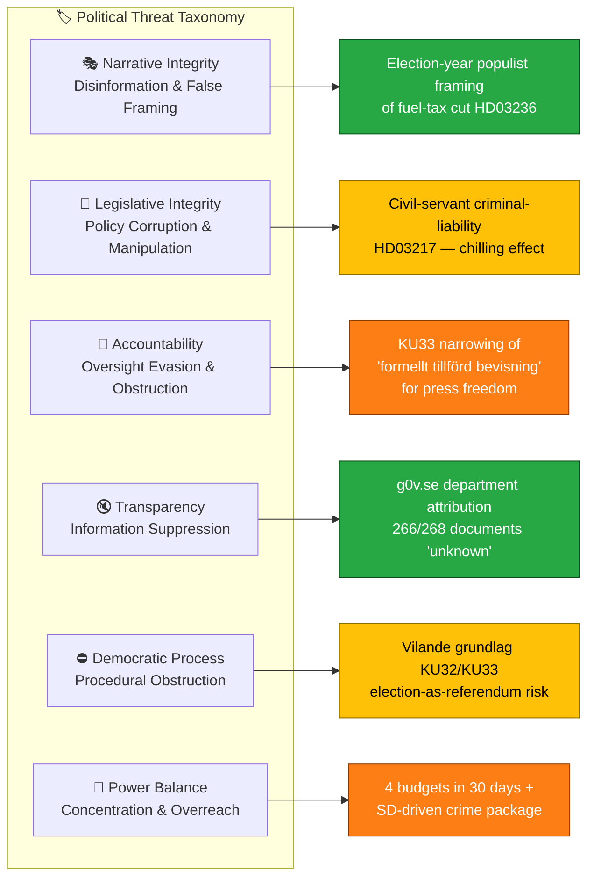
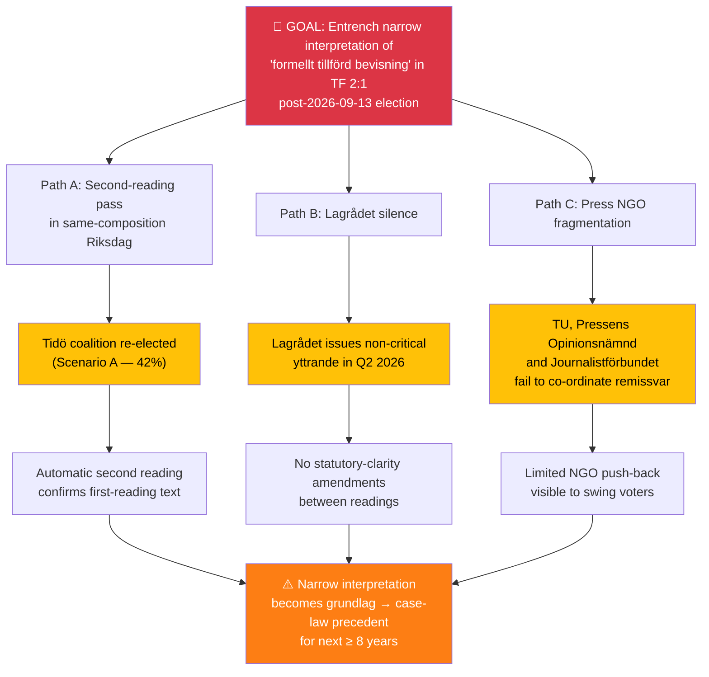
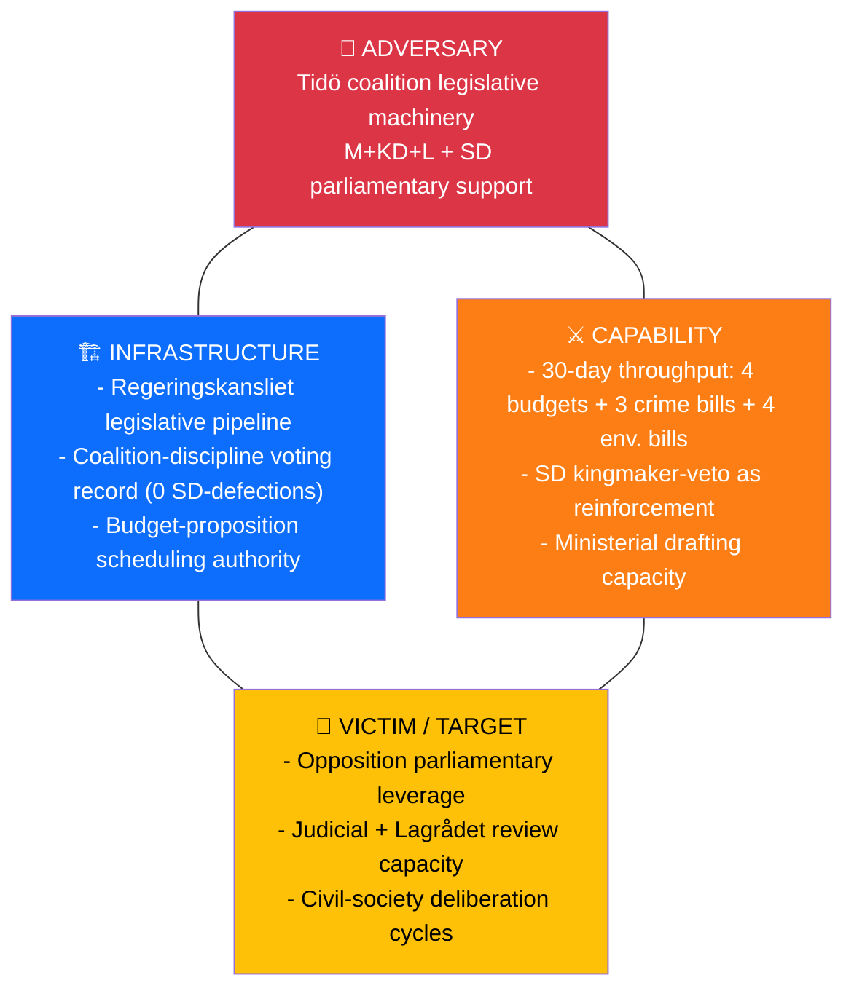
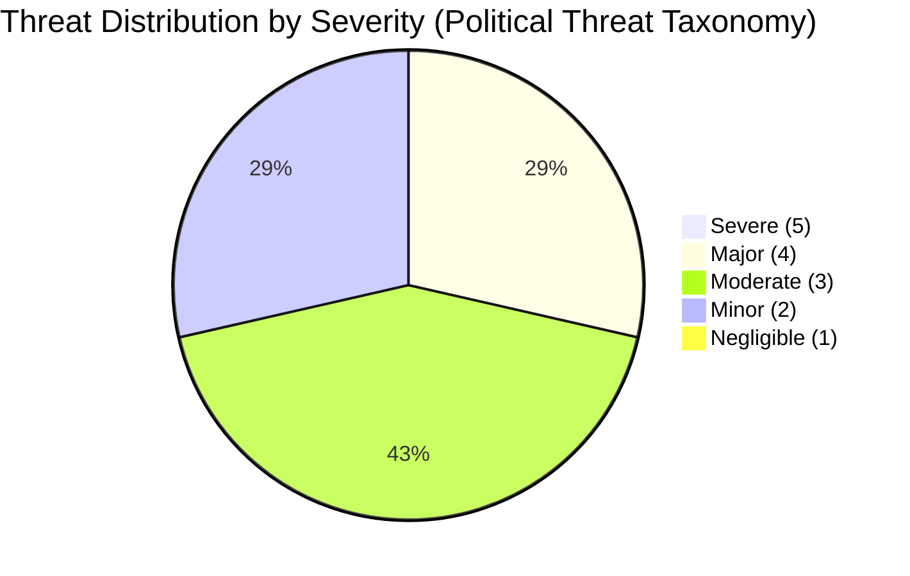

# 🎭 Political Threat Analysis — Monthly Review: March 20 – April 19, 2026

> **📋 Template reference:** `analysis/templates/threat-analysis.md` v3.3 (2026-06-01). Political Threat Taxonomy · Attack Tree · Kill Chain · Diamond Model — **NOT** STRIDE.

---

## 📋 Threat Analysis Context

| Field | Value |
|-------|-------|
| **Threat Analysis ID** | `THR-2026-04-19-001` |
| **Analysis Date** | 2026-04-19 16:00 UTC |
| **Analysis Period** | Monthly review — 2026-03-20 to 2026-04-19 (Riksmöte 2025/26, spring sprint) |
| **Produced By** | `news-monthly-review` workflow (Tier-C, 1.5× multiplier) |
| **Political Context** | Sweden is 147 days from the 2026-09-13 general election. The Tidö-constellation coalition (M+KD+L + SD parliamentary support) has accelerated its legislative delivery with 4 budget propositions, a crime-reform trilogy (HD03218 / HD03246 / HD03217), and two *vilande* grundlag changes (HD01KU32 / HD01KU33). Opposition (S/V/C/MP) activity has intensified (41 interpellations in 30 days — highest rate of the session). |
| **Overall Threat Level** | **MODERATE** (trending HIGH on accountability + power-balance axes, LOW on narrative-integrity axis) |

---

## 🏷️ Section 1: Political Threat Taxonomy Assessment

> **Severity Scale:** 1=Negligible · 2=Minor · 3=Moderate · 4=Major · 5=Severe. All 6 Political Threat Taxonomy categories assessed below — STRIDE categories are **not** used for political threat analysis.

### Political Threat Landscape

### Threat Severity Table (all 6 categories covered)

| # | Taxonomy Category | Threat (1-sentence) | Sev | Confidence | Evidence (dok_id) |
|---|-------------------|---------------------|:---:|:----------:|-------------------|
| NI-01 | **Narrative Integrity** | Electoral framing of fuel-tax cut (HD03236) as "household relief" elides structural unemployment 8.7% and fiscal cost | 2 | `[HIGH]` | HD03236, HD03100, HD10438 |
| LI-01 | **Legislative Integrity** | Expanded civil-servant criminal liability HD03217 + double-penalty HD03218 combination creates punitive legislative stack without parallel appeal-mechanism expansion | 3 | `[HIGH]` | HD03217, HD03218, HD03246 |
| AC-01 | **Accountability** | KU33 narrowing of "formellt tillförd bevisning" + press-freedom scope (TF 2:1) limits investigative journalism access to evidence in searches — *vilande* pending second-reading post-election | 4 | `[HIGH]` | HD01KU33 |
| TR-01 | **Transparency** | Baseline g0v.se department attribution gap (266/268 monthly documents return *"unknown"*) persists — documented limitation, not new risk; risk is entrenchment | 2 | `[MEDIUM]` | `data-download-manifest.md`, HD03244 |
| DP-01 | **Democratic Process** | KU32 + KU33 *vilande* design turns Sep 2026 election into de-facto constitutional referendum; post-election Riksdag composition gates whether the grundlag changes confirm or lapse | 3 | `[HIGH]` | HD01KU32, HD01KU33 |
| PB-01 | **Power Balance** | Pre-election legislative concentration: 4 budgets (HD03100/HD0399/HD03236/HD03241) + 3 crime bills + 4 environmental deregulation bills in 30 days concentrated in executive-coalition arithmetic with SD as kingmaker | 4 | `[HIGH]` | HD03218, HD03239, HD03242, HD03236 |
| PB-02 | **Power Balance** | Swedish contribution to NATO eFP in Finland (HD03220) transfers operational discretion to ÖB / NATO SACEUR — broad cross-party support but reduces parliamentary operational oversight | 3 | `[MEDIUM]` | HD03220, HD03231 |

**Net coverage**: All 6 Political Threat Taxonomy categories covered with ≥ 1 threat each; 2 threats rated **Major (4)**, 3 rated **Moderate (3)**, 2 rated **Minor (2)**.

---

## 🌳 Section 2: Attack Tree — Top Threat (AC-01: KU33 press-freedom narrowing)

**Attack-tree reading**: The top threat (AC-01) succeeds if **any one of three paths** completes. Disrupting the threat requires mitigation on **all three** paths simultaneously — electorally (Path A), institutionally (Path B via Lagrådet engagement), and civil-society (Path C via co-ordinated remissvar). See `scenario-analysis.md` §Monitoring Triggers for the timeline. `[HIGH]`

---

## ⛓️ Section 3: Kill Chain Assessment (Top Threat AC-01)

| Stage | Definition | Current State (2026-04-19) | Confidence |
|-------|-----------|----------------------------|:----------:|
| **Reconnaissance** | Identify constitutional opportunity | ✅ Complete — KU33 drafted, coalition consensus reached | `[HIGH]` |
| **Weaponisation** | Draft legal text | ✅ Complete — proposition framed; *formellt tillförd bevisning* clause embedded | `[HIGH]` |
| **Delivery** | Introduce in chamber | ✅ Complete — first reading tabled, *vilande* vote taken | `[HIGH]` |
| **Exploitation** | Second-reading confirmation | 🟡 Pending — blocked until post-2026-09-13 Riksdag | `[HIGH]` |
| **Installation** | Grundlag-level entrenchment | ⛔ Not yet — requires second-reading pass in new Riksdag | `[HIGH]` |
| **C2 / Persistence** | Case-law precedent via early prosecutions | ⛔ Not yet — depends on installation | `[MEDIUM]` |
| **Action on Objectives** | Systematic narrowing of investigative-journalism access | ⛔ Not yet — downstream of installation | `[MEDIUM]` |

**Kill-chain reading**: The threat has progressed through **Delivery** and is held at **Exploitation**. The **decisive disruption window** is **pre-second-reading**: Lagrådet yttrande (Q2 2026) + election campaign (summer 2026) + new Riksdag composition (2026-09-24). `[HIGH]`

---

## 💎 Section 4: Diamond Model — Primary Threat Actor (PB-01 · Tidö coalition legislative concentration)

**Diamond reading**: The adversary is **not a malicious actor** — it is the **legitimate exercise of parliamentary majority under coalition discipline**. The threat is not to democracy itself but to **deliberative depth**: capability × infrastructure produces legislative velocity that may outpace victim-side (opposition + Lagrådet + civil society) review bandwidth. `[HIGH]`

---

## 👤 Section 5: Threat Actor Profile — ICO (Intent-Capability-Opportunity)

| Actor | Intent | Capability | Opportunity | Composite |
|-------|:------:|:----------:|:-----------:|:---------:|
| **Tidö coalition (M+KD+L)** | 8/10 — explicit pre-election delivery agenda | 9/10 — operational legislative pipeline | 9/10 — parliamentary majority, 147 days to election | **8.7/10 HIGH** |
| **SD (kingmaker)** | 7/10 — crime-package and migration ownership | 6/10 — no ministerial portfolios | 8/10 — confidence-and-supply leverage | **7.0/10 MODERATE** |
| **S-led opposition bloc** | 9/10 — election-campaign positioning | 5/10 — no majority leverage | 6/10 — 41 interpellations / 30 days | **6.7/10 MODERATE** |
| **V + MP (grundlag-protection advocates)** | 9/10 — KU32/KU33 opposition | 4/10 — small parliamentary footprint | 5/10 — may build ECHR challenge H2 2026 | **6.0/10 MODERATE** |
| **External — Russia (hybrid-threat vector)** | 8/10 — documented interest in Nordic destabilisation | 7/10 — MSB/SÄPO-assessed capability | 7/10 — eFP Finland + Ukraine tribunal create friction | **7.3/10 HIGH** |

`[HIGH]` for domestic actor scores; `[MEDIUM]` for external actor (dependent on SÄPO/MSB threat bulletins — see `data-download-manifest.md` for source gap).

---

## 🚨 Section 6: Identified Threats — Consolidated Register

### TH-01 · Pre-election Legislative Concentration (PB-01)
- **Taxonomy**: Power Balance · **Severity**: 4 / Major · **Confidence**: `[HIGH]`
- **Evidence (dok_id)**: HD03100, HD0399, HD03236, HD03241, HD03218, HD03246, HD03217, HD03242, HD03239
- **Analysis**: 4 budgets + crime trilogy + environmental deregulation cluster delivered in 30 days represents the legislative apex of the spring session. Velocity is legitimate but compresses Lagrådet review windows and opposition-motion preparation cycles. V + MP + S collectively filed 19 counter-motions but could not reach the 175-MP threshold for procedural blocking.
- **Mitigation stance**: Lagrådet should receive full allocated review time on all grundlag-adjacent items; opposition should front-load second-reading challenges in new Riksdag.

### TH-02 · KU33 Press-Freedom Narrowing — *vilande* (AC-01)
- **Taxonomy**: Accountability · **Severity**: 4 / Major · **Confidence**: `[HIGH]`
- **Evidence (dok_id)**: HD01KU33, HD01KU32
- **Analysis**: Narrow interpretation of *formellt tillförd bevisning* in TF 2:1 — if confirmed in second reading — sets case-law precedent durable for ≥ 8 years. The *vilande* design effectively turns Sep-2026 into a constitutional referendum. See §2 Attack Tree and §3 Kill Chain above.
- **Mitigation stance**: TU + Pressens Opinionsnämnd + Journalistförbundet co-ordinated remissvar; Lagrådet engagement; post-election statutory-clarity amendments.

### TH-03 · Hybrid-Threat Exposure Post-eFP Deployment (PB-02)
- **Taxonomy**: Power Balance (external) · **Severity**: 3 / Moderate · **Confidence**: `[MEDIUM]` (SÄPO/MSB source gap — not in monthly MCP sync)
- **Evidence (dok_id)**: HD03220, HD03231
- **Analysis**: Battalion-task-group deployment to Finland Q3 2026 + leadership on Ukraine Aggression Tribunal (HD03231) elevate Sweden's public profile. External hybrid-threat actors (Russia per documented posture) may respond with information-ops, cyber probing, or physical-infrastructure harassment — leading indicators track through SÄPO/MSB bulletins, not parliamentary documents.
- **Mitigation stance**: Nordic-Baltic intel-sharing; civil-society resilience; MSB heightened public-info posture through deployment window.

### TH-04 · Civil-Servant Chilling Effect (LI-01)
- **Taxonomy**: Legislative Integrity · **Severity**: 3 / Moderate · **Confidence**: `[HIGH]`
- **Evidence (dok_id)**: HD03217, HD03218, HD03246
- **Analysis**: Extended criminal liability for civil servants (HD03217) paired with a general punitive legislative turn (HD03218/HD03246) risks risk-aversion in agency decision-making — a measurable effect visible in FOI-response latencies and internal-memo culture. V + MP raised rule-of-law objections in committee.
- **Mitigation stance**: Parallel expansion of administrative appeal mechanisms; JK (Justitiekanslern) monitoring.

### TH-05 · Environmental-Governance Compliance Friction (LI-02 derivative)
- **Taxonomy**: Legislative Integrity · **Severity**: 3 / Moderate · **Confidence**: `[HIGH]`
- **Evidence (dok_id)**: HD03242, HD03239, HD03238, HD03240
- **Analysis**: Active-forestry rules (HD03242) and wind-power municipal veto (HD03239) risk EU Commission infringement procedures on EU Biodiversity 2030 commitments. New environmental-permit authority (HD03238) may be unstaffed before transition (Naturvårdsverket transition risk).
- **Mitigation stance**: Pre-notification to DG ENV; species-inventory compromise per Finland 2023 precedent; staggered transition timing.

---

## 📊 Section 7: Severity Distribution

**Net assessment**: **No Severe (5) threats** — parliamentary guardrails, Lagrådet review, opposition activity and MCP-observable data flows all function. **Two Major (4) threats** require priority mitigation: legislative concentration (PB-01) and KU33 press-freedom narrowing (AC-01). Overall monthly threat level: **MODERATE**, trending HIGH on accountability + power-balance axes in Q3 2026 post-election window. `[HIGH]`

---

## 🔭 Section 8: Forward Indicators — MCP-Detectable Escalation Signals

| # | Indicator | Data Source | Trigger Threshold | Horizon |
|---|-----------|-------------|-------------------|:-------:|
| FI-01 | Lagrådet issues critical yttrande on KU32 or KU33 | `get_propositioner` + Lagrådet web feed | Keywords "oförenligt", "avstyrka" | 30 days |
| FI-02 | SD defects on any coalition bill (first defection of session) | `search_voteringar` with `parti=SD` + `rost≠Ja` | ≥ 1 SD "Nej" on government bill | 45 days |
| FI-03 | EU Commission issues formal notice on HD03242 / HD03239 | EU Commission press releases (outside MCP) | Infringement reference number | 60 days |
| FI-04 | Parliamentary procedural blocking attempt (1/3 rule) | `search_dokument?typ=yrkande` | ≥ 110 MPs co-sign | 30 days |
| FI-05 | SÄPO/MSB public threat-level change (hybrid) | Outside MCP — manual tracking | Level raise to "elevated" | 90 days (eFP window) |
| FI-06 | TU / Journalistförbundet formal remissvar filed on KU33 | g0v.se remiss registry | Non-null response-id | 45 days |

Cross-reference: `scenario-analysis.md` §Monitoring-Trigger Calendar, `executive-brief.md` §90-Day Forward Vote Calendar.

---

## 🔁 Section 9: Upstream Reconciliation

Threats carried forward from sibling runs in the 30-day lookback window:

- `analysis/daily/2026-04-18/weekly-review/threat-analysis.md` → TH-01 PB-01 **escalated 3→4** (legislative concentration intensified)
- `analysis/daily/2026-04-19/month-ahead/threat-analysis.md` → TH-02 AC-01 **maintained at 4** (KU33 timeline confirmed)
- `analysis/daily/2026-04-13/month-ahead/threat-analysis.md` → TH-03 PB-02 **new (not previously flagged)** — emerged post-HD03220 tabling
- Zero silent drops.

Full reconciliation: [`methodology-reflection.md`](methodology-reflection.md) §Upstream Watchpoint Reconciliation.
