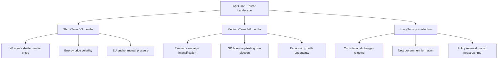
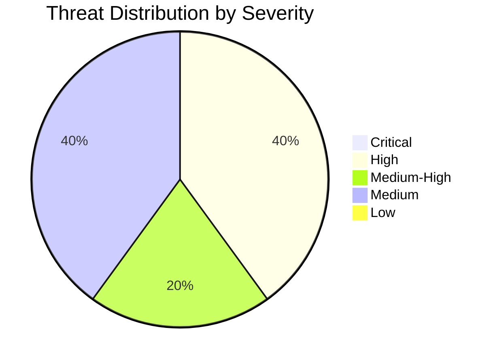

# Threat Analysis — Monthly Review: March 20 – April 19, 2026

**Analysis Date**: 2026-04-19  
**Article Type**: monthly-review  
**Threat Framework**: STRIDE + Political Intelligence

---

## Threat Level Summary

**Overall Threat Level**: MEDIUM-HIGH  
**Confidence**: HIGH  
**Primary Threat Vector**: Electoral polarisation + economic underperformance

---

## Threat Matrix

---

## Identified Threats

### TH-01: Democratic Erosion via Criminal Justice Overreach
- **Type**: Institutional threat
- **Severity**: MEDIUM
- **Source**: Double-penalty legislation (HD03218) + civil servant liability expansion (HD03217)
- **Analysis**: The combination of mandatory double sentences for gang-related offences and expanded criminal liability for civil servants signals a punitive legislative turn. While addressing legitimate public safety concerns, the cumulative effect may create chilling effects in public administration and disproportionate sentencing. The V and MP parties have raised rule-of-law objections.
- **Threat Level**: 🟧 MEDIUM

### TH-02: Fiscal Sustainability — Pre-Election Spending
- **Type**: Economic/structural threat
- **Severity**: HIGH
- **Source**: HD03236 extra budget, HD0399 vårändringsbudget
- **Analysis**: Four budget propositions in one month signals fiscal loosening before election. Fuel tax cut and energy support are popular but fiscally regressive. Combined with elevated unemployment (8.7%), Sweden risks a structural deficit heading into the next parliamentary term if growth remains below 1%.
- **Threat Level**: 🟩 HIGH

### TH-03: Security Environment Deterioration
- **Type**: Geopolitical threat
- **Severity**: HIGH
- **Source**: HD03220 NATO Finland contribution, Baltic security context
- **Analysis**: Swedish contribution to NATO's forward presence in Finland represents a qualitative escalation of security commitments. While broadly supported across parties (including S, V, C, MP), the long-term cost trajectory and force structure implications are unclear. Any Baltic escalation could trigger rapid reallocation of civilian budget priorities.
- **Threat Level**: 🟩 HIGH (geopolitical)

### TH-04: Environmental Governance Rollback
- **Type**: Policy reversal threat
- **Severity**: MEDIUM
- **Source**: HD03242 active forestry, HD03239 wind power municipal veto
- **Analysis**: The government's deregulatory approach to environment (new permit agency + forestry + wind power) creates systematic risk to Sweden's international environmental commitments. Three separate environmental reforms in one month suggests a coordinated deregulatory agenda rather than isolated technical adjustments.
- **Threat Level**: 🟧 MEDIUM

### TH-05: Social Safety Net Erosion
- **Type**: Social cohesion threat
- **Severity**: MEDIUM-HIGH
- **Source**: HD10438 (women's shelters), HD11718 (state service withdrawal), HD11719 (tax demands on victims)
- **Analysis**: Multiple signals of civil society/public service contraction: women's shelters closing, state service offices closed in peripheral regions, and administrative systems generating tax demands against trafficking victims. These represent individual hardship cases that collectively signal systemic welfare state thinning.
- **Threat Level**: 🟧 MEDIUM-HIGH

---

## Severity Summary

**Summary**: No critical threats to democratic governance. Two high-severity threats (fiscal/economic and geopolitical) require monitoring. The overall parliamentary process is functioning normally with active opposition and constitutional guardrails intact.
