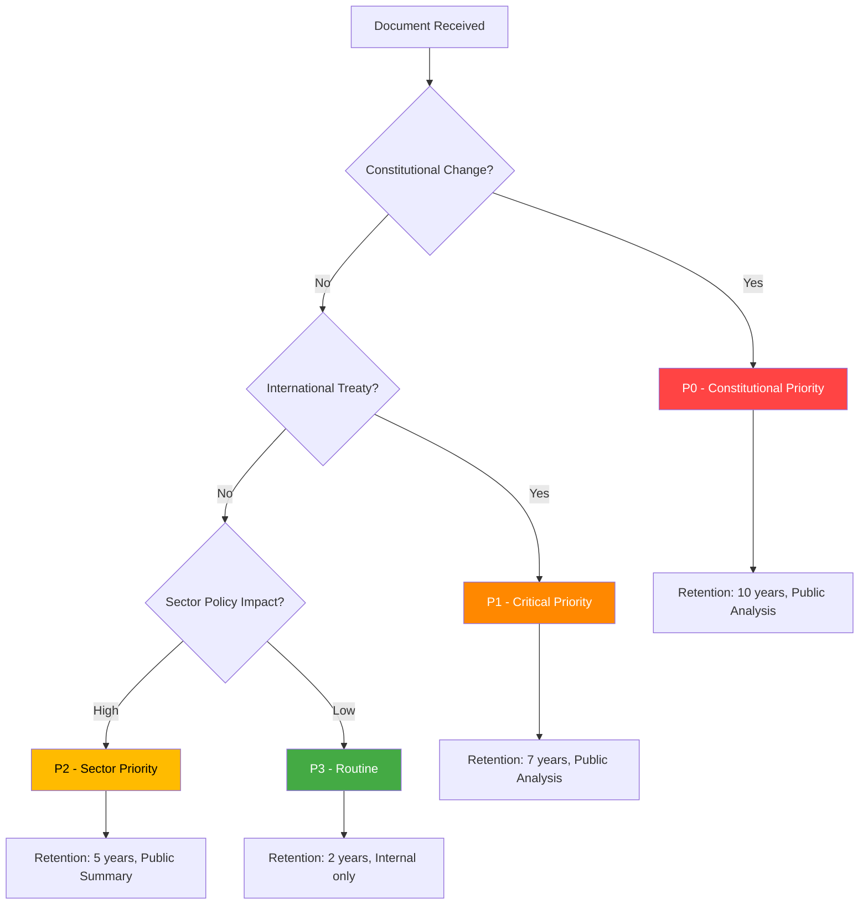

# Classification Results — Realtime Monitor 2026-04-19 (1219)

**CLS-ID**: CLS-20260419-1219  
**Date**: 2026-04-19  
**Analyst**: James Pether Sörling  
**Version**: 2.0 (Pass 2 enriched)

## Sensitivity Decision Framework

## Per-Document Classification

| dok_id | Priority | Classification | Retention | Offentlighetsprincipen | Reasoning |
|--------|----------|---------------|-----------|----------------------|-----------|
| HD01KU33 | **P0 Constitutional** | Public — Full Analysis | 10 years | Public | Grundlag (TF) amendment; affects democratic transparency infrastructure |
| HD01KU32 | **P0 Constitutional** | Public — Full Analysis | 10 years | Public | Grundlag (TF+YGL) amendment; EU accessibility implementation |
| HD03231 | **P1 Critical** | Public — Full Analysis | 7 years | Public | International treaty, Ukraine war accountability |
| HD03232 | **P1 Critical** | Public — Full Analysis | 7 years | Public | International treaty, international law institution |
| HD01CU28 | **P2 Sector** | Public — Sector Summary | 5 years | Public | Property rights reform; market transparency |

## Political Temperature Assessment

| Document | Temperature | Trend | Parties in conflict |
|----------|------------|-------|---------------------|
| KU33 | 🌡️ HIGH (7/10) | Rising | Civil liberties advocates vs. law enforcement proponents |
| KU32 | 🌡️ MODERATE (5/10) | Stable | Broad consensus; EU compliance |
| HD03231 | 🌡️ HIGH (8/10) | Peak | Broad cross-party support; SD cautious |
| HD03232 | 🌡️ HIGH (7/10) | Rising | Same as HD03231 |
| CU28 | 🌡️ LOW (3/10) | Stable | Housing industry concerns but broad agreement |

## Strategic Significance

- **KU33**: First-reading passage of a constitutional amendment means Sweden has made an irreversible (until next election) commitment to narrow offentlighetsprincipen for law enforcement materials. If the riksdag elected in September 2026 confirms the amendment, it takes effect January 2027 — within 9 months.
- **Ukraine Package**: Simultaneous accession to both the Special Tribunal for Aggression AND the Compensation Commission represents a comprehensive legal-accountability commitment to Ukraine, coinciding with the King's visit to Kyiv (2026-04-17). Globally only ≈40 states have joined the tribunal; Sweden's accession is norm-entrepreneurship with historical significance.
