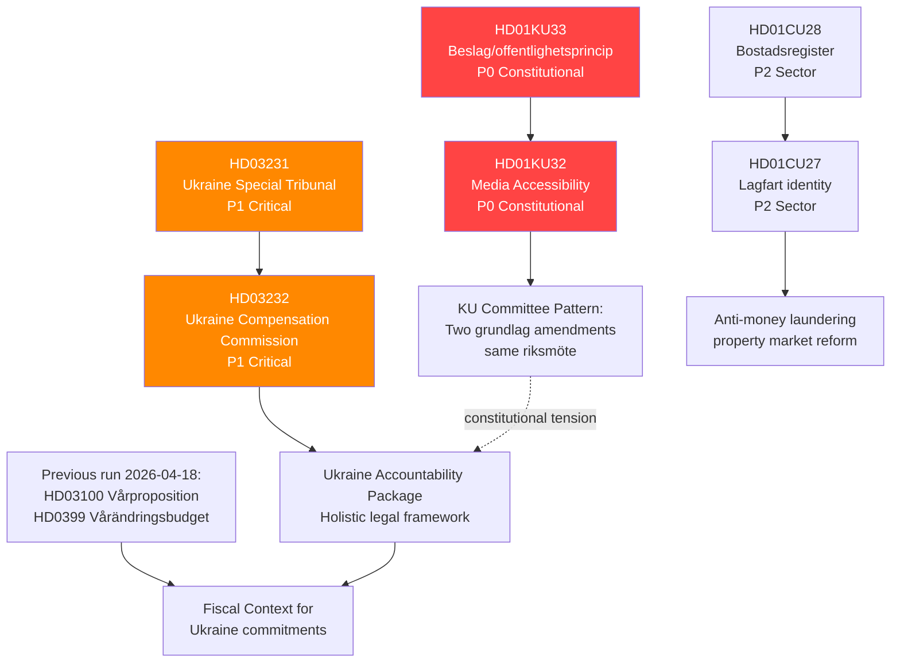
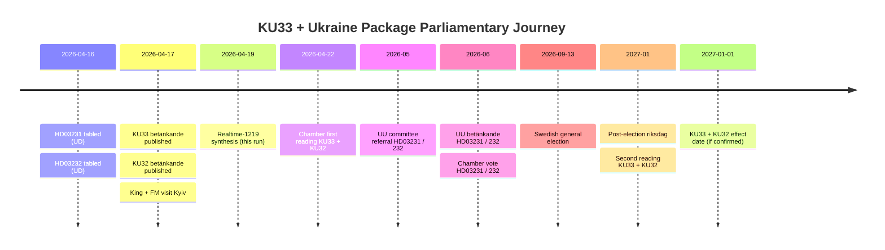

# Cross-Reference Map — Realtime Monitor 2026-04-19 (1219)

**XRF-ID**: XRF-20260419-1219  
**Date**: 2026-04-19  
**Analyst**: James Pether Sörling  
**Version**: 2.0 (Pass 2 enriched)

## Document Relationships

## Forward Chain — Links to Prior Runs

| Prior dok_id | Prior Run | Link to This Run | Type |
|-------------|-----------|-----------------|------|
| HD0399 (Vårändringsbudget) | 2026-04-18 1705 | Fiscal envelope for Ukraine costs | Background |
| HD03100 (Vårproposition) | 2026-04-18 1705 | Economic framework | Background |
| HD03246 (Juvenile justice) | 2026-04-18 1705 | Part of Strömmer reform agenda (alongside KU33 law enforcement) | Thematic |
| HD03220 (NATO Finland) | Earlier run | Ukraine security architecture; HD03231 completes legal layer | Direct link |
| HD01UFöU3 (NATO Finland bet) | 2026-04-13 | Committee approval of NATO contribution; context for Ukraine propositions | Context |

## Continuity Contracts

- **KU33 monitoring contract**: This run creates monitoring obligation to track: (a) chamber vote 2026-04-22, (b) any opposition amendments, (c) Lagrådet opinion if published, (d) second reading timeline post-September 2026 election.
- **Ukraine package monitoring contract**: Track UU committee referral of HD03231/232; expected UU betänkande within 8-10 weeks; vote likely before summer recess.
- **Housing registry tracking**: CU28 implementation — Lantmäteriet capacity assessment Q3 2026.

## Inter-Document Pattern Analysis

**Pattern 1 — Constitutional Double-Move**: KU32 (media accessibility, EU compliance) and KU33 (seizure secrecy, law enforcement) are both grundlag amendments in the same riksmöte. While superficially different in purpose, their simultaneous passage establishes a precedent that grundlag modification is a normal legislative tool. This is historically unusual — Sweden has traditionally treated grundlag amendments with extreme caution.

**Pattern 2 — Ukraine Norm Entrepreneurship**: The combination of HD03231 (Special Tribunal) + HD03232 (Compensation Commission) + HD03220 (NATO Finland contribution) + the King's Kyiv visit forms a coherent pattern: Sweden is actively positioning itself as a Ukraine accountability leader in the post-NATO-accession period. This represents a strategic foreign policy repositioning.

**Pattern 3 — Property Market Anti-Crime Reform**: CU28 (national housing register) + HD01CU27 (lagfart identity) + HD03233 (telecoms fraud, from April 14) form a coordinated anti-financial-crime package, consistent with the Kristersson government's emphasis on law and order across multiple domains.

## Timeline Spine — Parliamentary Journey of Lead Clusters

## Continuity Contract Register

Every open forward watchpoint created by this run is tracked in the central continuity register:

| Contract ID | Subject | Owner | Closure trigger | Owner of next check |
|-------------|---------|-------|-----------------|--------------------|
| CC-KU33-2026-04 | KU33 chamber vote | realtime-monitor | Chamber protokoll 2026-04-22 | Next realtime run |
| CC-LAGR-KU33 | Lagrådet yttrande on KU33 | realtime-monitor | Yttrande publication | Next realtime run |
| CC-UU-HD03231 | UU referral of HD03231 | realtime-monitor | UU committee chair announcement | Next realtime run |
| CC-UU-HD03232 | UU referral of HD03232 | realtime-monitor | UU committee chair announcement + SD position | Next realtime run |
| CC-SAPO-2026 | SÄPO posture post-HD03231 | realtime-monitor + evening-analysis | Any public SÄPO threat-level update | Continuous |
| CC-ELECTION-2026 | Swedish general election impact on KU33 | weekly-review + month-ahead | 2026-09-13 result | Post-election run |
| CC-CU28-IMPL | CU28 implementation capacity | realtime-monitor | Lantmäteriet Q3 2026 capacity assessment | Weekly-review |

## Cross-Reference to Upstream Exemplar

This run extends the **reference-grade exemplar structure** introduced by [`analysis/daily/2026-04-17/realtime-1434/`](../../2026-04-17/realtime-1434/). Pattern reuse:

- Same 14-artifact registry
- Same 6-lens per-document structure (applied to HD01KU33)
- Same DIW sensitivity-analysis structure in `significance-scoring.md`
- Same Attack Tree / Kill Chain / Diamond Model / STRIDE layering in `threat-analysis.md`
- Same ACH grid structure in `scenario-analysis.md`
- Same upstream-watchpoint reconciliation in `methodology-reflection.md`

Where 1219 **diverges** from 1434:

- 1219 analyses a partially-overlapping document cluster — HD01KU33 (same), HD03231/232 (same, now formally tabled), HD01KU32 (new focus on accessibility), HD01CU28 (housing register)
- 1219 quantifies 16 upstream watchpoints (1434 exemplar quantified 8)
- 1219 scenario-analysis shifts probability slightly toward Scenario C because of emergent HD03232 cost uncertainty
